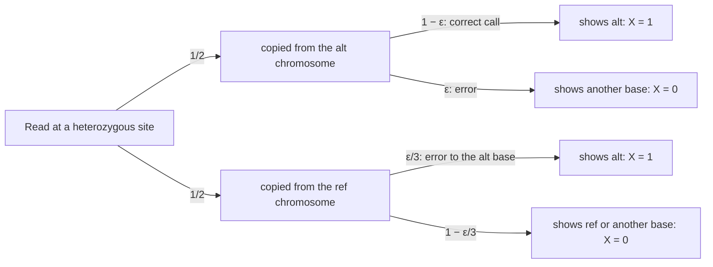

---
aliases:
  - Bernoulli Trial
  - Bern(p)
  - Loi de Bernoulli
tags:
  - type/concept
  - domain/statistics
  - domain/mathematics
  - level/L1
  - level/L2
mastery: 0
prerequisites:
  - "[[Random Variable]]"
  - "[[Probability Distribution]]"
  - "[[Expected Value]]"
  - "[[Variance]]"
related:
  - "[[Binomial Distribution]]"
  - "[[Genotype Likelihood]]"
  - "[[Maximum Likelihood Estimation]]"
  - "[[Logistic Regression]]"
projects:
  - "[[10-genomic-pipeline]]"
sources:
  - "[[Introduction to Probability (Blitzstein)]]"
  - "[[MIT 18.05 - Introduction to Probability and Statistics]]"
  - "[[Harvard Stat 110 - Probability]]"
  - "[[Nielsen 2011 - Genotype and SNP Calling from Next-Generation Sequencing Data]]"
  - "[[Cock 2010 - The Sanger FASTQ File Format]]"
  - "[[An Introduction to Statistical Learning (James)]]"
---

# Bernoulli Distribution

> [!abstract]
> A Bernoulli variable is one yes/no trial coded 1 or 0, such as "this read shows the alternative allele". A single number, the success probability $p$, fixes it: its mean is $p$ and its variance $p(1-p)$.

## Definition

$X$ has the **Bernoulli distribution** with parameter $p \in [0, 1]$, written $X \sim \mathrm{Bern}(p)$, if it takes the value 1 ("success") with probability $p$ and 0 ("failure") with probability $1 - p$:

$$P(X = x) = p^x (1 - p)^{1 - x}, \qquad x \in \{0, 1\}.$$

The indicator $\mathbf{1}_A$ of any event $A$ is Bernoulli with $p = P(A)$.[^blitz][^1805][^stat110]

## Why it matters

- **Each read at a variant site is a Bernoulli trial**: it shows the alternative allele or not, with a probability set by the genotype and the error rate. Products of these per-read probabilities are the genotype likelihoods of probabilistic variant callers ([[Genotype Likelihood]], [[Variant Calling]], [[10-genomic-pipeline]]).[^nielsen]
- **Counts are sums of Bernoulli variables**: alternative-allele reads, errors in a read, occurrences of a k-mer. Their means and variances are built from $p$ and $p(1-p)$ ([[Binomial Distribution]], [[Expected Value]], [[Variance]]).

## Core (L1)

### One read at a heterozygous site

Take a diploid site with one reference and one alternative copy, and a base-calling error probability $\varepsilon$ (from the base quality, $\varepsilon = 10^{-Q/10}$, [[Phred Quality Score]]).[^cock] Let $X = 1$ if the read shows the alternative base.



Adding the two paths to $X = 1$ ([[Law of Total Probability]]): $p = \tfrac12(1 - \varepsilon) + \tfrac12 \cdot \tfrac{\varepsilon}{3} = \tfrac12 - \tfrac{\varepsilon}{3}$. Likewise $p = \varepsilon/3$ at a homozygous reference site and $1 - \varepsilon$ at a homozygous alternative site. Two assumptions are built in: both chromosomes are sampled equally (no mapping bias), and an error yields each of the three other bases equally often. Real data can violate both.

### Mean and variance

$$E[X] = 0 \cdot (1-p) + 1 \cdot p = p, \qquad X^2 = X \Rightarrow E[X^2] = p, \qquad \operatorname{Var}(X) = p - p^2 = p(1-p).$$

The variance peaks at $1/4$ for $p = 1/2$ and vanishes at $p = 0$ or $1$: a read at a heterozygous site is the most unpredictable trial, a read at a homozygous site is nearly certain.[^blitz][^1805] Relative to the mean, rare outcomes are the noisy ones: the coefficient of variation $\sqrt{p(1-p)}/p = \sqrt{(1-p)/p}$ is 1 at $p = 1/2$ but 31.6 at $p = 0.001$.

## Deeper (L2)

### Sums of Bernoulli trials

- **Independent, same $p$**: the number of successes in $n$ trials is binomial, mean $np$, variance $np(1-p)$ ([[Binomial Distribution]]). In sequence, such trials form a [[Bernoulli Process]], and the wait for the first success is geometric ([[Geometric Distribution]]).
- **Independent, different $p_i$** (reads with different base qualities): mean $\sum_i p_i$, variance $\sum_i p_i(1 - p_i)$. Since $\sum_i p_i^2 \ge (\sum_i p_i)^2/n$, this is at most the binomial variance $n\bar p(1 - \bar p)$ with the same mean, with equality only if all $p_i$ are equal (Exercise 3). Heterogeneity *within* one sample narrows a count; heterogeneity *between* samples widens it ([[Overdispersion]]).
- **Dependent trials**: two reads that are PCR copies of one molecule carry the same allele; their positive covariance makes the count vary more than a binomial ([[Duplicate Read]], [[Covariance]]).

### Likelihoods: estimating $p$, scoring genotypes

With $k$ successes in $n$ independent trials, $\ell(p) = k \ln p + (n - k)\ln(1 - p)$ ([[Likelihood Function]]); $\ell'(p) = k/p - (n-k)/(1-p)$ vanishes at $\hat p = k/n$, the maximum likelihood estimate ([[Maximum Likelihood Estimation]]), unbiased with variance $p(1-p)/n$. For genotypes, read $i$ has its own error probability $\varepsilon_i$, hence its own $p_i(G)$ under genotype $G$, and the likelihood of the observed calls is $\prod_i p_i(G)^{x_i}(1 - p_i(G))^{1 - x_i}$; with a prior over genotypes this is probabilistic genotype calling.[^nielsen] The same likelihood with $p_i$ a function of covariates is fitted by [[Logistic Regression]].[^isl] Real callers also use which non-alternative base was read and model mapping errors ([[Genotype Likelihood]]).

## Mathematical representation

$X : \Omega \to \{0, 1\}$ with PMF $p^x (1-p)^{1-x}$ and CDF $F(x) = 0$ for $x < 0$, $1 - p$ for $0 \le x < 1$, $1$ for $x \ge 1$. Since $X^r = X$ for $r \ge 1$, every moment $E[X^r]$ equals $p$, and $\operatorname{Var}(X) = p(1-p) \le 1/4$. The generating function is $E[s^X] = 1 - p + ps$; its $n$-th power, $(1 - p + ps)^n$, is that of the binomial ([[Probability Distribution#Advanced (L3)]]).

## Computational representation

```python
import random

rng = random.Random(11)
error = 0.01                                     # per-read error probability (quality 20)
for g in (0, 1, 2):                              # alternative copies at a diploid site
    from_alt = g / 2                             # chance that the read comes from an alt copy
    p = from_alt * (1 - error) + (1 - from_alt) * error / 3
    reads = [int(rng.random() < p) for _ in range(100_000)]      # 100,000 Bernoulli(p) reads
    m = sum(reads) / len(reads)
    v = sum((x - m) ** 2 for x in reads) / (len(reads) - 1)
    print(f"{g} alt copies: p = {p:.4f}, p(1-p) = {p * (1 - p):.4f} | "
          f"simulated mean {m:.4f}, variance {v:.4f}")
```

```text
0 alt copies: p = 0.0033, p(1-p) = 0.0033 | simulated mean 0.0034, variance 0.0034
1 alt copies: p = 0.4967, p(1-p) = 0.2500 | simulated mean 0.4944, variance 0.2500
2 alt copies: p = 0.9900, p(1-p) = 0.0099 | simulated mean 0.9903, variance 0.0096
```

Simulated means and variances match $p$ and $p(1-p)$. NumPy draws Bernoulli arrays with `Generator.binomial(1, p, size)`.

## Worked example

> [!example] What does one read say about the genotype?
> A SNP has reference C and alternative T; reads have base quality 20, so $\varepsilon = 0.01$,[^cock] and for CC, CT, TT a read shows T with $p = 0.0033$, $0.4967$, $0.99$.
> 1. **One read shows T** ($x = 1$): probabilities $0.0033$, $0.4967$, $0.99$. CT is 149 times and TT 297 times more likely than CC to produce it.
> 2. **A second read shows C** ($x = 0$): probabilities $1 - p = 0.9967$, $0.5033$, $0.01$. With independent reads, the pair has probability $0.0033$, $0.2500$, $0.0099$.
> 3. **Reading.** CT is now 75 times more likely than CC and 25 times more likely than TT. These products are genotype likelihoods; [[Bayes' Theorem]] turns them into posterior probabilities, and with $n$ reads the number of T reads is binomial ([[Binomial Distribution#Worked example]]).

## Common misconceptions

> [!warning] "A Bernoulli variable is a fair coin"
> $p$ can be anything in $[0, 1]$, such as $0.0033$ for an alternative read at a homozygous reference site. Only the outcome space $\{0, 1\}$ is fixed.

> [!warning] "Small variance means a precise estimate"
> $p(1-p)$ is tiny for rare events, but the coefficient of variation explodes (31.6 at $p = 0.001$): estimating a rare proportion, such as an error rate, to a given relative precision needs far more trials than estimating $p = 1/2$.

## Exercises

> [!question] Exercise 1 (L1)
> A CpG is methylated on 70 % of the DNA copies of a sample; each bisulfite read reports methylated (1) or not (0), with perfect conversion ([[Bisulfite Sequencing]]). Give the distribution, mean, variance and SD of one read's call. At which methylation level is a single read least predictable?

> [!success]- Solution
> $\mathrm{Bern}(0.7)$: mean 0.7, variance $0.7 \times 0.3 = 0.21$, SD 0.458. The variance $p(1-p)$ is maximal at $p = 1/2$: a half-methylated site gives the least predictable reads.

> [!question] Exercise 2 (L2)
> With $\varepsilon = 0.001$ (quality 30), give the probability that a read shows the alternative base for each genotype. At a homozygous reference site with 30 independent reads, what is the probability of at least one alternative read?

> [!success]- Solution
> $p = \varepsilon/3 = 0.00033$, $1/2 - \varepsilon/3 = 0.49967$, $1 - \varepsilon = 0.999$. At least one alternative read among 30: $1 - (1 - 0.00033)^{30} = 0.0100$. About 1 % of homozygous reference sites show a stray alternative read at depth 30, tens of thousands of sites in a genome-wide analysis, so one read is not enough evidence for a variant.

> [!question] Exercise 3 (L2, Python)
> A 20-base read has invented error probabilities: 0.001 for 10 bases, 0.01 for 5 and 0.1 for 5. Compute the mean and variance of its number of errors and $P(\text{no error})$, and compare them with a binomial of the same mean.

> [!success]- Solution
> ```python
> from math import prod
>
> eps = [0.001] * 10 + [0.01] * 5 + [0.1] * 5      # invented error probabilities of 20 bases
> mean, var = sum(eps), sum(e * (1 - e) for e in eps)
> pbar = mean / len(eps)
> print(round(mean, 4), round(var, 4), "| binomial with the same mean:", round(len(eps) * pbar * (1 - pbar), 4))
> print("P(no error):", round(prod(1 - e for e in eps), 4), "| binomial:", round((1 - pbar) ** len(eps), 4))
> # 0.56 0.5095 | binomial with the same mean: 0.5443
> # P(no error): 0.556 | binomial: 0.5667
> ```
>
> The mean, 0.56 errors, needs only linearity. The variance, 0.509, is below the binomial's 0.544, as the inequality of Deeper (L2) predicts, and replacing per-base qualities by their average misstates even $P(\text{no error})$.

## Mastery checklist

- [ ] 1 Recognized: I can write the Bernoulli PMF and state its mean $p$ and variance $p(1-p)$.
- [ ] 2 Understood: I can derive the probability that a read shows the alternative base for each genotype, with errors, by the law of total probability.
- [ ] 3 Practiced: I can simulate Bernoulli trials, compute the mean and variance of sums with equal or unequal $p_i$, and derive $\hat p = k/n$.
- [ ] 4 Applied: in [[10-genomic-pipeline]], I turn real base qualities at a variant site into per-read probabilities and genotype likelihoods.
- [ ] 5 Explained: I can teach why heterogeneity within a sample narrows a count while dependence or heterogeneity between samples widens it, and how the Bernoulli likelihood underlies genotype calling and logistic regression.

## References

[^blitz]: [[Introduction to Probability (Blitzstein)]], 2nd ed., ch. 3 "Random Variables and Their Distributions" (Bernoulli and binomial distributions, indicator random variables) and ch. 4 "Expectation" (expectation and variance of indicators).
[^1805]: [[MIT 18.05 - Introduction to Probability and Statistics]], Spring 2022, Reading 4a "Discrete Random Variables" and Reading 5a "Variance of Discrete Random Variables".
[^stat110]: [[Harvard Stat 110 - Probability]], random variables and the named distributions.
[^nielsen]: [[Nielsen 2011 - Genotype and SNP Calling from Next-Generation Sequencing Data]], Nielsen R et al., *Nature Reviews Genetics* 12(6):443-451: genotype likelihoods from read bases and qualities, probabilistic genotype calling.
[^cock]: [[Cock 2010 - The Sanger FASTQ File Format]], *Nucleic Acids Research* 38(6):1767-1771: Phred quality $Q = -10 \log_{10} p$.
[^isl]: [[An Introduction to Statistical Learning (James)]], classification methods (logistic regression).
