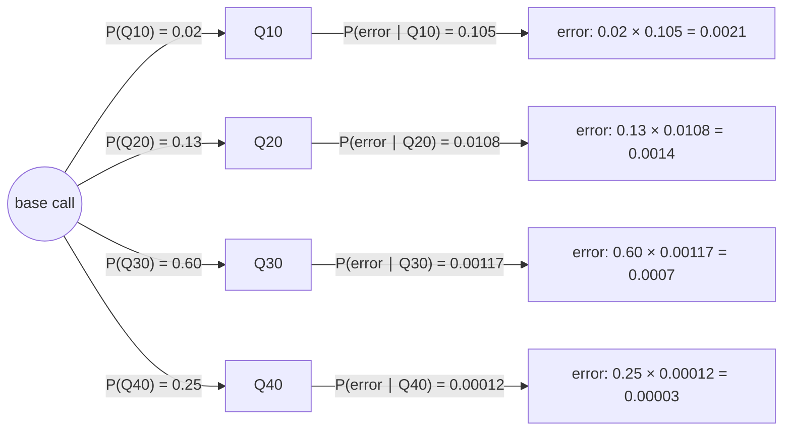

---
aliases:
  - P(A|B)
  - Multiplication Rule
  - Chain Rule of Probability
  - Probabilité conditionnelle
tags:
  - type/concept
  - domain/statistics
  - domain/mathematics
  - domain/bioinformatics
  - level/L1
  - level/L2
  - level/L3
mastery: 0
prerequisites:
  - "[[Probability Space]]"
  - "[[Logarithm]]"
related:
  - "[[Independence (Probability)]]"
  - "[[Law of Total Probability]]"
  - "[[Bayes' Theorem]]"
  - "[[Phred Quality Score]]"
  - "[[FASTQ Format]]"
  - "[[Markov Chain]]"
  - "[[Genotype Likelihood]]"
projects:
  - "[[10-genomic-pipeline]]"
sources:
  - "[[Introduction to Probability (Blitzstein)]]"
  - "[[MIT 18.05 - Introduction to Probability and Statistics]]"
  - "[[Harvard Stat 110 - Probability]]"
  - "[[Cock 2010 - The Sanger FASTQ File Format]]"
  - "[[Biological Sequence Analysis (Durbin)]]"
---

# Conditional Probability

> [!abstract]
> The conditional probability $P(A \mid B)$ is the probability of $A$ once we know that $B$ has happened: we throw away every outcome outside $B$ and renormalize. A base quality score in a FASTQ file is exactly such a number: the probability that the base call is wrong, given the score the sequencer assigned.

## Definition

For events $A$ and $B$ with $P(B) > 0$, the **conditional probability of $A$ given $B$** is

$$P(A \mid B) = \frac{P(A \cap B)}{P(B)}.$$

$P(A)$ is then called the **prior** (unconditional) probability of $A$ and $P(A \mid B)$ its probability updated by the evidence $B$.[^blitz2][^1805-3] Rearranged, the definition gives the **multiplication rule** $P(A \cap B) = P(B)\, P(A \mid B) = P(A)\, P(B \mid A)$.[^blitz2]

## Why it matters

- **Base qualities are conditional probabilities.** A Phred quality $Q$ encodes the probability $p$ that the base call is incorrect through $Q = -10 \log_{10} p$, written in FASTQ as one ASCII character per base ([[Phred Quality Score]], [[FASTQ Format]]).[^cock] Every quality filter, trimmer and variant caller in [[10-genomic-pipeline]] reads these numbers as $P(\text{error} \mid Q)$.
- **Models are built from conditional pieces.** A [[Markov Chain]] specifies $P(x_i \mid x_{i-1})$, a hidden Markov model adds the emission probabilities $P(\text{symbol} \mid \text{state})$,[^durbin3] and a [[Genotype Likelihood]] is $P(\text{reads} \mid \text{genotype})$.
- **Direction matters.** $P(\text{reads} \mid \text{genotype})$ is what the error model gives; $P(\text{genotype} \mid \text{reads})$ is what we want. Going from one to the other is [[Bayes' Theorem]], and confusing them is the most common error in applied probability.

## Core (L1)

### Conditioning shrinks the sample space

Knowing that $B$ occurred rules out every outcome outside $B$. The new sample space is $B$; the part of $A$ that survives is $A \cap B$; dividing by $P(B)$ rescales so that $P(B \mid B) = 1$.[^blitz2] With equally likely outcomes, $P(A \mid B) = |A \cap B| / |B|$: count inside $B$ only.

### The multiplication rule

$P(A \cap B) = P(B)\, P(A \mid B)$: to get the probability that both happen, take the probability of the first and multiply by the probability of the second **given** the first. Drawn as a tree, one multiplies along a branch.[^1805-3]



*Tree of the invented calibration table below; only the error branches are drawn, each "correct" branch has the complementary probability.*

### Bio: the probability of a sequencing error given a quality score

The Phred scale defines the conditional error probability of a base call from its quality:[^cock]

$$P(\text{error} \mid Q = q) = 10^{-q/10}, \qquad q = -10 \log_{10} P(\text{error} \mid Q = q).$$

| $Q$ | $P(\text{error} \mid Q)$ | One wrong call in |
|---:|---:|---:|
| 10 | 0.1 | 10 |
| 20 | 0.01 | 100 |
| 30 | 0.001 | 1,000 |
| 40 | 0.0001 | 10,000 |

In the Sanger FASTQ variant, the character stored for quality $Q$ has ASCII code $Q + 33$, giving qualities 0 to 93: `I` (code 73) is $Q = 40$, `5` (code 53) is $Q = 20$.[^cock] Each 10 units of $Q$ divide the error probability by 10 ([[Logarithm]]).

## Deeper (L2)

### A conditional probability is a probability

For fixed $B$ with $P(B) > 0$, the function $A \mapsto P(A \mid B)$ satisfies the three axioms (proof in [[#Mathematical representation]]).[^blitz2] So every rule of [[Probability Space]] holds after conditioning: $P(A^c \mid B) = 1 - P(A \mid B)$, inclusion-exclusion given $B$, and so on. What does **not** hold is any rule that changes the conditioning event: in general $P(A \mid B) + P(A \mid B^c) \ne 1$.

### The chain rule

Applying the multiplication rule repeatedly gives, for events $A_1, \dots, A_n$ with $P(A_1 \cap \dots \cap A_{n-1}) > 0$,

$$P(A_1 \cap A_2 \cap \dots \cap A_n) = P(A_1)\, P(A_2 \mid A_1)\, P(A_3 \mid A_1 \cap A_2) \cdots P(A_n \mid A_1 \cap \dots \cap A_{n-1}).$$

For a read of $n$ bases, let $C_i$ be "base $i$ is called correctly". The chain rule gives $P(\text{read error-free}) = P(C_1) P(C_2 \mid C_1) \cdots$ exactly. Only if errors are assumed [[Independence (Probability)|independent]] given the qualities does this collapse to $\prod_i (1 - 10^{-Q_i/10})$ (Exercise 3); errors that cluster, for instance towards the end of a read, violate it.

### Confusion of the inverse

$P(A \mid B)$ and $P(B \mid A)$ answer different questions and can differ by orders of magnitude.[^1805-3] In the invented table below, $P(\text{error} \mid Q10) = 0.105$, but $P(Q10 \mid \text{error}) = 0.50$: only one Q10 call in ten is wrong, yet half of all errors carry Q10. Both numbers are useful: the first to decide whether to trust a base, the second to see where errors concentrate (and to justify trimming low-quality tails).

### Calibration: a quality score is a claim that can be checked

A reported Q30 asserts $P(\text{error} \mid Q = 30) = 0.001$. Whether that holds for a given run is an empirical question: align reads to a trusted reference, bin the calls by reported quality and estimate $P(\text{error} \mid \text{bin})$ as errors divided by calls in the bin. A calibrated run gives estimates close to $10^{-Q/10}$; systematic departures are the subject of [[Base Quality Score Recalibration]].

## Advanced (L3)

- **Sequence models as products of conditionals.** A first-order Markov model of DNA writes $P(x_1 \dots x_n) = P(x_1) \prod_{i \ge 2} P(x_i \mid x_{i-1})$, the chain rule with each factor depending only on the previous base; Durbin's CpG-island model is two such chains, one for islands and one for the rest of the genome.[^durbin3] Hidden Markov models, profile HMMs and pair HMMs add further conditional layers ([[Hidden Markov Model]]). Substitution models give $P(\text{base } b \text{ at time } t \mid \text{base } a \text{ at time } 0)$ ([[Nucleotide Substitution Model]]).
- **Probability or odds.** The old Solexa quality scale was defined on the odds of error, $Q_{\text{Solexa}} = -10 \log_{10}\big(p / (1 - p)\big)$, and stored with an ASCII offset of 64 (range $-5$ to 62).[^cock] Odds and probabilities agree when $p$ is small and diverge when it is not: a Solexa score of 0 means $p = 0.5$, a Phred score of 0 means $p = 1$ (Exercise 5). The odds scale reappears in the odds form of [[Bayes' Theorem]] and in log-odds scores.
- **Conditioning on events of probability zero.** $P(A \mid X = x)$ for a continuous [[Random Variable]] $X$ is undefined by the ratio formula, since $P(X = x) = 0$. It is defined through densities ([[Probability Density Function]], [[Joint Distribution]]) and, in general, through [[Conditional Expectation]].
- **Conditional probabilities are what a pipeline stores.** Base qualities, mapping qualities ([[Mapping Quality]]) and genotype likelihoods ([[Genotype Likelihood]]) are all conditional probabilities; each is only as good as the model that produced it and the calibration that checked it.

## Mathematical representation

Let $(\Omega, \mathcal{F}, P)$ be a probability space and $B \in \mathcal{F}$ with $P(B) > 0$. Define $P_B(A) = P(A \mid B) = P(A \cap B)/P(B)$ for $A \in \mathcal{F}$.

**$P_B$ is a probability.** (A1) $P_B(A) \ge 0$ as a ratio of non-negative numbers. (A2) $P_B(\Omega) = P(\Omega \cap B)/P(B) = 1$. (A3) If the $A_i$ are pairwise disjoint, so are the $A_i \cap B$, and

$$P_B\Big(\bigcup_i A_i\Big) = \frac{P\big(\bigcup_i (A_i \cap B)\big)}{P(B)} = \sum_i \frac{P(A_i \cap B)}{P(B)} = \sum_i P_B(A_i).$$

**Chain rule, by induction.** True for $n = 2$ (multiplication rule). If it holds for $n - 1$, apply the multiplication rule to $A_n$ and $D = A_1 \cap \dots \cap A_{n-1}$: $P(D \cap A_n) = P(D)\, P(A_n \mid D)$, then expand $P(D)$.

**Phred and Solexa scales**, for an error probability $p \in (0, 1]$ and a quality character $c$:

$$Q_{\text{Phred}} = -10 \log_{10} p, \qquad p = 10^{-Q/10}, \qquad Q = \operatorname{ord}(c) - 33 \ \text{(Sanger FASTQ)};$$

$$Q_{\text{Solexa}} = -10 \log_{10} \frac{p}{1 - p}, \qquad Q_{\text{Phred}} = 10 \log_{10}\big(10^{Q_{\text{Solexa}}/10} + 1\big).$$

The last identity follows from $p = o/(1+o)$ with odds $o = 10^{-Q_{\text{Solexa}}/10}$.

## Computational representation

Qualities are decoded character by character; a conditional probability estimated from data is a count inside the conditioning event divided by the size of that event. The simulation draws qualities, then errors given the qualities (the tree above), and recovers both $P(\text{error} \mid Q10)$ and the inverse $P(Q10 \mid \text{error})$.

```python
import random


def error_probability(q: int) -> float:
    """P(base call is wrong | quality q), by the Phred definition q = -10 log10 p."""
    return 10 ** (-q / 10)


def decode(quality: str, offset: int = 33) -> list[int]:
    """Sanger FASTQ: quality = ASCII code - 33."""
    return [ord(ch) - offset for ch in quality]


quality = "II?5+"                                   # invented quality string
for ch, q in zip(quality, decode(quality)):
    print(ch, q, error_probability(q))

# Invented calibration table: quality bin -> (bases, observed errors)
table = {10: (20_000, 2_100), 20: (130_000, 1_400), 30: (600_000, 700), 40: (250_000, 30)}
n_total = sum(n for n, _ in table.values())
e_total = sum(e for _, e in table.values())
print("P(error) =", e_total / n_total)
for q, (n, e) in table.items():
    print(f"Q{q}: P(error|Q) = {e / n:.5f} (nominal {error_probability(q):.4f}),"
          f" P(Q|error) = {e / e_total:.3f}")

# Simulation: qualities drawn with the table's frequencies, errors drawn from P(error|Q).
random.seed(42)
qs = list(table)
weights = [n / n_total for n, _ in table.values()]
calls = [(q, random.random() < error_probability(q))
         for q in random.choices(qs, weights, k=1_000_000)]
q10 = [err for q, err in calls if q == 10]
errs = [q for q, err in calls if err]
print("simulated P(error|Q10) =", round(sum(q10) / len(q10), 4))
print("simulated P(Q10|error) =", round(errs.count(10) / len(errs), 3))
```

```text
I 40 0.0001
I 40 0.0001
? 30 0.001
5 20 0.01
+ 10 0.1
P(error) = 0.00423
Q10: P(error|Q) = 0.10500 (nominal 0.1000), P(Q|error) = 0.496
Q20: P(error|Q) = 0.01077 (nominal 0.0100), P(Q|error) = 0.331
Q30: P(error|Q) = 0.00117 (nominal 0.0010), P(Q|error) = 0.165
Q40: P(error|Q) = 0.00012 (nominal 0.0001), P(Q|error) = 0.007
simulated P(error|Q10) = 0.0995
simulated P(Q10|error) = 0.508
```

In the simulation the qualities are exactly calibrated, so $P(\text{error} \mid Q10)$ comes out near the nominal 0.1, and $P(Q10 \mid \text{error})$ near its exact model value $0.002/0.003925 = 0.510$ ([[Bayes' Theorem]]).

## Worked example

> [!example] Error probabilities from an invented calibration table
> A run's base calls (1,000,000, invented) were compared with a trusted reference:
>
> | Quality bin | Calls | Errors |
> |---|---:|---:|
> | Q10 | 20,000 | 2,100 |
> | Q20 | 130,000 | 1,400 |
> | Q30 | 600,000 | 700 |
> | Q40 | 250,000 | 30 |
> | total | 1,000,000 | 4,230 |
>
> 1. **Unconditional error rate.** $P(\text{error}) = 4{,}230 / 10^6 = 0.00423$.
> 2. **Condition on the quality.** Restrict to the Q10 row: $P(\text{error} \mid Q10) = 2{,}100 / 20{,}000 = 0.105$, close to the nominal $10^{-1}$. Likewise $P(\text{error} \mid Q30) = 700/600{,}000 = 0.00117$ against a nominal 0.001: the Q30 bin is slightly over-confident.
> 3. **Multiplication rule.** $P(Q10 \cap \text{error}) = P(Q10)\, P(\text{error} \mid Q10) = 0.02 \times 0.105 = 0.0021$, which is the 2,100 errors out of $10^6$ calls.
> 4. **The inverse.** Restrict to the error column instead: $P(Q10 \mid \text{error}) = 2{,}100 / 4{,}230 = 0.496$. Two per cent of calls hold half of the errors.
> 5. **Interpretation.** Conditioning on quality splits a 0.4 % average error rate into bins ranging from 10 % to 0.01 %; trimming or down-weighting the Q10 bin removes half the errors at the cost of 2 % of the data.

## Common misconceptions

> [!warning] "$P(A \mid B)$ and $P(B \mid A)$ are about the same"
> They share the numerator $P(A \cap B)$ but divide by different things. $P(\text{error} \mid Q10) = 0.105$ while $P(Q10 \mid \text{error}) = 0.50$; in screening, $P(\text{positive} \mid \text{disease})$ can be 0.99 while $P(\text{disease} \mid \text{positive})$ is below 0.1 ([[Bayes' Theorem]]).

> [!warning] "Q30 means this very base has a 0.1 % chance of being wrong"
> The score is a model's statement about bases that receive Q30: among them, about one in 1,000 is wrong. Whether this holds for your run is checked by calibration, and a particular base may belong to a systematically worse context (a homopolymer, the end of a read).

> [!warning] "$P(A \mid B) + P(A \mid B^c) = 1$"
> Complements sum to 1 only inside one conditioning event: $P(A \mid B) + P(A^c \mid B) = 1$. In the table, $P(\text{error} \mid Q10) + P(\text{error} \mid \text{not } Q10) = 0.105 + 0.0022$.

> [!warning] "Conditioning on more information always makes an event more certain"
> Conditioning can move a probability up or down, or leave it unchanged (independence). New evidence is not the same as confirming evidence.

## Exercises

> [!question] Exercise 1 (L1)
> Decode the Sanger FASTQ quality string `#+5?I` into Phred qualities and error probabilities. (ASCII codes: `#` 35, `+` 43, `5` 53, `?` 63, `I` 73.)

> [!success]- Solution
> Subtract 33: $Q = 2, 10, 20, 30, 40$, so $p = 10^{-0.2} \approx 0.63$, then $0.1$, $0.01$, $0.001$, $0.0001$. A Q2 call (`#`) is wrong more often than right: it carries almost no information about the base.

> [!question] Exercise 2 (L1)
> From the worked-example table, compute $P(\text{error} \mid Q20)$, $P(Q20 \mid \text{error})$ and $P(Q20 \cap \text{error})$, and check the multiplication rule both ways.

> [!success]- Solution
> $P(\text{error} \mid Q20) = 1{,}400/130{,}000 = 0.01077$; $P(Q20 \mid \text{error}) = 1{,}400/4{,}230 = 0.331$; $P(Q20 \cap \text{error}) = 1{,}400/10^6 = 0.0014$. Check: $P(Q20)\,P(\text{error} \mid Q20) = 0.13 \times 0.01077 = 0.0014$ and $P(\text{error})\,P(Q20 \mid \text{error}) = 0.00423 \times 0.331 = 0.0014$.

> [!question] Exercise 3 (L2, Python)
> Assuming errors are independent given the qualities, compute the probability that a read is error-free when (a) its 150 bases all have Q30, (b) one of them has Q10 instead, (c) the read is the 5-base read `II?5+`. Write the chain rule that holds without the independence assumption.

> [!success]- Solution
> ```python
> import math
>
>
> def error_probability(q): return 10 ** (-q / 10)
>
>
> def p_error_free(qualities: list[int]) -> float:
>     """Chain rule with errors assumed independent given the qualities."""
>     return math.prod(1 - error_probability(q) for q in qualities)
>
>
> print(round(p_error_free([30] * 150), 4))
> print(round(p_error_free([30] * 149 + [10]), 4))
> print(round(p_error_free([40, 40, 30, 20, 10]), 4))
> ```
>
> ```text
> 0.8606
> 0.7754
> 0.8899
> ```
>
> Even a uniformly Q30 read of 150 bases has a 14 % chance of containing an error, and one Q10 base costs another 10 %. Without independence, $P(C_1 \cap \dots \cap C_n) = P(C_1) \prod_{i=2}^{n} P(C_i \mid C_1 \cap \dots \cap C_{i-1})$, where each factor may differ from $1 - p_i$ if errors cluster.

> [!question] Exercise 4 (L2)
> Prove that $P(A^c \mid B) = 1 - P(A \mid B)$ directly from the definition, then use the table to show that $P(\text{error} \mid Q10) + P(\text{error} \mid \text{not } Q10) \ne 1$.

> [!success]- Solution
> $A \cap B$ and $A^c \cap B$ are disjoint with union $B$, so $P(A \cap B) + P(A^c \cap B) = P(B)$; divide by $P(B)$. For the table: "not Q10" contains $980{,}000$ calls with $4{,}230 - 2{,}100 = 2{,}130$ errors, so $P(\text{error} \mid \text{not } Q10) = 0.00217$, and the sum is $0.107$. The two terms condition on different events, so nothing forces them to add to 1.

> [!question] Exercise 5 (L3, Python)
> Convert Solexa scores $-5, 0, 10, 20, 40$ to error probabilities and to Phred scores. Where do the two scales agree, and why?

> [!success]- Solution
> ```python
> import math
>
>
> def solexa_error(qs: float) -> float:
>     """Solexa score qs = -10 log10(p / (1 - p)): odds -> probability."""
>     odds = 10 ** (-qs / 10)
>     return odds / (1 + odds)
>
>
> for qs in (-5, 0, 10, 20, 40):
>     p = solexa_error(qs)
>     print(qs, round(p, 6), round(-10 * math.log10(p), 2))
> ```
>
> ```text
> -5 0.759747 1.19
> 0 0.5 3.01
> 10 0.090909 10.41
> 20 0.009901 20.04
> 40 0.0001 40.0
> ```
>
> For small $p$, $p/(1-p) \approx p$, so the scales agree above about 20; at low quality they diverge (Solexa 0 is Phred 3.01). A parser that confuses the two variants mis-states low qualities, which is why the offset and scale of a FASTQ file must be known before its qualities are used.[^cock]

## Mastery checklist

- [ ] 1 Recognized: I can write the definition of $P(A \mid B)$ and the multiplication rule, and read a Phred score as a conditional error probability.
- [ ] 2 Understood: I can explain conditioning as restricting the sample space, why $P(\cdot \mid B)$ is a probability, and why $P(A \mid B) \ne P(B \mid A)$.
- [ ] 3 Practiced: I can decode FASTQ qualities, apply the chain rule to a read, and estimate conditional probabilities from a table or a seeded simulation in Python.
- [ ] 4 Applied: in [[10-genomic-pipeline]], I estimate $P(\text{error} \mid Q)$ on reads aligned to a known reference and compare it with the reported qualities.
- [ ] 5 Explained: I can teach calibration, the Phred and Solexa scales, the difference between a likelihood and a posterior, and why conditioning on a probability-zero event needs densities.

## References

[^blitz2]: [[Introduction to Probability (Blitzstein)]], 2nd ed., ch. 2 "Conditional Probability" (definition, prior and posterior, multiplication rule, conditional probability as a probability); see also [[Harvard Stat 110 - Probability]], foundations part.
[^1805-3]: [[MIT 18.05 - Introduction to Probability and Statistics]], Reading 3 "Conditional Probability, Independence and Bayes' Theorem".
[^cock]: [[Cock 2010 - The Sanger FASTQ File Format]], Cock PJA et al., *Nucleic Acids Research* 38(6):1767-1771: Phred definition, Sanger offset 33 and range 0 to 93, Solexa odds scale with offset 64.
[^durbin3]: [[Biological Sequence Analysis (Durbin)]], ch. 3 "Markov chains and hidden Markov models" (transition and emission probabilities, the CpG island example).
