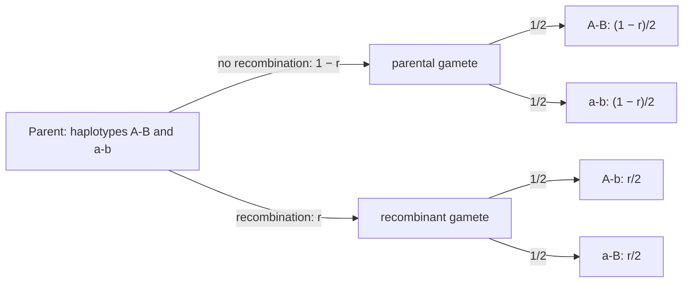

---
aliases:
  - Independent Events
  - Statistical Independence
  - Mutual Independence
  - Conditional Independence
  - Indépendance (probabilités)
tags:
  - type/concept
  - domain/statistics
  - domain/mathematics
  - domain/bioinformatics
  - level/L1
  - level/L2
  - level/L3
mastery: 0
prerequisites:
  - "[[Probability Space]]"
  - "[[Conditional Probability]]"
related:
  - "[[Law of Total Probability]]"
  - "[[Bayes' Theorem]]"
  - "[[Mendelian Inheritance]]"
  - "[[Genetic Linkage]]"
  - "[[Linkage Disequilibrium]]"
  - "[[Maximum Likelihood Phylogenetics]]"
  - "[[Markov Chain]]"
  - "[[Naive Bayes Classifier]]"
projects:
  - "[[08-phylogenetic-engine]]"
  - "[[10-genomic-pipeline]]"
sources:
  - "[[Introduction to Probability (Blitzstein)]]"
  - "[[MIT 18.05 - Introduction to Probability and Statistics]]"
  - "[[Felsenstein 1981 - Evolutionary Trees from DNA Sequences]]"
  - "[[Biological Sequence Analysis (Durbin)]]"
  - "[[Biology 2e (OpenStax)]]"
  - "[[An Introduction to Genetic Analysis (Griffiths)]]"
  - "[[Principles of Population Genetics (Hartl)]]"
  - "[[Molecular Evolution (Yang)]]"
---

# Independence (Probability)

> [!abstract]
> Two events are independent when knowing that one happened does not change the probability of the other; then the probability that both happen is the product of their probabilities. Most likelihoods in bioinformatics are products because they assume independence, and much of genetics is the study of where it fails.

## Definition

Events $A$ and $B$ are **independent** if

$$P(A \cap B) = P(A)\, P(B).$$

When $P(B) > 0$ this is equivalent to $P(A \mid B) = P(A)$: learning $B$ leaves the probability of $A$ unchanged.[^blitz2][^1805-3] Events $A_1, \dots, A_n$ are **(mutually) independent** if the product rule holds for every subfamily: $P(A_{i_1} \cap \dots \cap A_{i_k}) = P(A_{i_1}) \cdots P(A_{i_k})$ for all $2 \le k \le n$ and distinct indices; **pairwise** independence (only $k = 2$) is weaker.[^blitz2] Events $A$ and $B$ are **conditionally independent given $C$** if $P(A \cap B \mid C) = P(A \mid C)\, P(B \mid C)$.[^blitz2]

## Why it matters

- **Phylogenetic likelihoods are products over sites.** Felsenstein's likelihood method assumes that different sites of an alignment evolve independently, so the likelihood of a tree is the product of the per-site likelihoods and the log-likelihood a sum.[^f81][^durbin8] This is what makes [[Maximum Likelihood Phylogenetics]] and [[08-phylogenetic-engine]] computable, one column at a time ([[Felsenstein Pruning Algorithm]]).
- **Random sequence models multiply base probabilities.** The background model of alignment and motif statistics treats positions as independent draws, so a word's probability is a product of base frequencies ([[Probability Space]]).[^durbin2]
- **Reads are modelled as independent given the genotype.** The probability of a pile of reads at a site is a product over reads, conditionally on the genotype ([[Genotype Likelihood]], [[10-genomic-pipeline]]).
- **Linkage breaks independence.** Alleles of genes close together on a chromosome are transmitted together more often than independent assortment predicts ([[Genetic Linkage]]),[^os12] and the resulting non-random association of alleles in populations ([[Linkage Disequilibrium]]) is both a nuisance (neighbouring variants are not independent evidence) and a tool (it makes association mapping and imputation possible).

## Core (L1)

### Checking independence

Compute both sides of $P(A \cap B) = P(A)P(B)$. With two uniform, independently drawn bases, let $A$ = "base 1 is a purine (A or G)" and $B$ = "base 2 is G". Of the 16 equally likely pairs, 2 are in $A \cap B$ (`AG`, `GG`): $P(A \cap B) = 2/16 = 1/8 = \frac{1}{2} \times \frac{1}{4}$. Independent. Now let $B'$ = "the pair is `GG`": $P(A \cap B') = 1/16$ but $P(A)P(B') = 1/32$. Dependent: knowing $B'$ makes $A$ certain.

### Independent events multiply

For independent events the probability that all occur is the product of their probabilities; with a [[Logarithm]], products become sums. For an alignment of $m$ columns $x^{(1)}, \dots, x^{(m)}$ under a tree $T$ with parameters $\theta$, the independent-sites assumption gives[^f81][^durbin8]

$$L(T) = \prod_{j=1}^{m} P\big(x^{(j)} \mid T, \theta\big), \qquad \log L(T) = \sum_{j=1}^{m} \log P\big(x^{(j)} \mid T, \theta\big).$$

Identical columns contribute identical factors, so an alignment can be compressed into its distinct site patterns and their counts.

### Independent is not disjoint

Disjoint events cannot happen together: $P(A \cap B) = 0$. If both have positive probability, $P(A)P(B) > 0$, so they are **dependent**: learning that $A$ happened makes $B$ impossible. "Mutually exclusive" and "independent" are almost opposites.

### Bio: Mendel's second law is a statement of independence

Mendel's law of independent assortment says that the allele a gamete receives at one gene does not depend on the allele it receives at another gene.[^os12] It holds for genes on different chromosomes and fails for genes close together on the same chromosome, which travel together unless a crossover separates them ([[Mendelian Inheritance]], [[Genetic Linkage]]).[^os12]

## Deeper (L2)

### Complements and pairwise versus mutual independence

If $A$ and $B$ are independent, so are $A$ and $B^c$, $A^c$ and $B$, $A^c$ and $B^c$ (proof in [[#Mathematical representation]]).[^blitz2] But pairwise independence of three events does not imply mutual independence: with two uniform bases, "base 1 is a purine", "base 2 is a purine" and "exactly one base is a purine" are pairwise independent, yet the three cannot occur together (Exercise 3).

### Linkage: when two loci are not independent

Consider a double heterozygote whose two chromosomes carry the haplotypes `A-B` and `a-b`. A gamete is **recombinant** (`A-b` or `a-B`) when a crossover separates the two loci; the probability of this is the recombination fraction $r$, which ranges from 0 for tightly linked loci to $1/2$ for loci that assort independently ([[Genetic Recombination]]).[^griffiths]



Each allele alone is transmitted with probability $1/2$, so $P(A)P(B) = 1/4$, while $P(A \cap B) = (1 - r)/2$. The loci are independent exactly when $r = 1/2$. The departure $D = P(A \cap B) - P(A)P(B)$ is the **linkage disequilibrium** coefficient when the frequencies are those of haplotypes in a population ([[Linkage Disequilibrium]]).[^hartl] Here $D = (1 - 2r)/4$.

### Conditional independence

Independence can hold given a third event and fail without it, or the reverse. At a biallelic site with genotype frequencies $P(CC) = 0.81$, $P(CT) = 0.18$, $P(TT) = 0.01$ (invented) and error-free reads, each read shows `T` with probability 0, $1/2$, 1 given the genotype, and two reads are drawn independently **given** the genotype. Then $P(T_1) = 0.18 \times 0.5 + 0.01 = 0.1$, but

$$P(T_1 \cap T_2) = 0.18 \times 0.25 + 0.01 \times 1 = 0.055 \ne 0.1^2 = 0.01.$$

The two reads are dependent: a `T` in the first read signals a genotype carrying `T`, which makes a second `T` likely. They are only conditionally independent given the genotype. Computing $P(T_1)$ required summing over genotypes ([[Law of Total Probability]]).

### Testing independence in data

From observed counts, estimate $P(A)$, $P(B)$ and $P(A \cap B)$ and compare the joint frequency with the product of the marginals. Sampling noise makes exact equality impossible, so the decision needs a test, usually a [[Chi-Square Test]] of independence on the $2 \times 2$ table. An invented test cross in [[Mendelian Inheritance]] gives 245 `AB`, 55 `Ab`, 60 `aB`, 240 `ab` offspring: $\hat P(A \cap B) = 245/600 = 0.41$ against $\hat P(A)\hat P(B) = 0.500 \times 0.508 = 0.254$, a strong departure pointing to linkage.

## Advanced (L3)

- **Independent sites: necessary and wrong.** The product over sites is what makes tree likelihoods tractable,[^f81] but real sites interact. Paired bases in an RNA stem change together to preserve pairing (compensatory, covarying changes), the signal used to predict RNA structure from alignments.[^durbin10] Adjacent bases are not independent either: CG dinucleotides are depleted in vertebrate genomes, which a first-order [[Markov Chain]] captures and an independent-positions model cannot.[^durbin3]
- **One tree per locus, not per genome.** Across a recombining genome, different regions can have different genealogies, so "all sites share one tree" is itself an assumption that holds within a locus and fails between loci ([[Coalescent Theory]]).[^yang]
- **Counting evidence twice.** If dependent sites are treated as independent, the log-likelihood adds their evidence as if it were new. In the extreme case where every column is duplicated, every log-likelihood difference between two trees doubles while the information is unchanged (Exercise 6). Linked variants in association studies raise the same issue: a variant that affects a trait makes its linked neighbours look associated too, and separating them is the task of [[Fine-Mapping]].
- **Conditional independence as a modelling device.** Hidden Markov models assume that each symbol is independent of everything else given its hidden state;[^durbin3] a [[Naive Bayes Classifier]] assumes that features are independent given the class; genotype likelihoods assume reads are independent given the genotype. Each assumption replaces an intractable joint distribution by a product, and each is violated in known ways (duplicate reads, correlated k-mers, correlated errors), which inflates confidence.

## Mathematical representation

Let $(\Omega, \mathcal{F}, P)$ be a probability space.

- **Independence of two events**: $P(A \cap B) = P(A)P(B)$. If $P(B) > 0$, dividing by $P(B)$ gives $P(A \mid B) = P(A)$, and conversely.
- **Complement.** If $A, B$ are independent, $P(A \cap B^c) = P(A) - P(A \cap B) = P(A) - P(A)P(B) = P(A)\big(1 - P(B)\big) = P(A)P(B^c)$, using the disjoint union $A = (A \cap B) \cup (A \cap B^c)$. Applying this twice gives the other pairs.
- **Mutual independence of $n$ events**: $P\big(\bigcap_{i \in S} A_i\big) = \prod_{i \in S} P(A_i)$ for every $S \subseteq \{1, \dots, n\}$ with $|S| \ge 2$: $2^n - n - 1$ equations, of which pairwise independence checks only $\binom{n}{2}$.
- **Conditional independence given $C$** ($P(C) > 0$): $P(A \cap B \mid C) = P(A \mid C)\,P(B \mid C)$. Neither independence nor conditional independence implies the other.
- **Two linked loci.** With recombination fraction $r \in [0, \tfrac12]$ and parental haplotypes `A-B` / `a-b`:

| Gamete | `A-B` | `a-b` | `A-b` | `a-B` |
|---|---|---|---|---|
| Probability | $\frac{1-r}{2}$ | $\frac{1-r}{2}$ | $\frac{r}{2}$ | $\frac{r}{2}$ |

$P(A) = P(B) = \tfrac12$, $P(A \cap B) = \tfrac{1-r}{2}$, $D = \tfrac{1-2r}{4}$: independence $\iff r = \tfrac12$.

## Computational representation

A simulation makes the linkage table concrete: draw one of the two parental haplotypes, then recombine with probability $r$, and compare the joint frequency with the product of the marginal frequencies.

```python
import random


def gamete(r: float) -> str:
    """One gamete of an AB/ab double heterozygote; a crossover between the loci has probability r."""
    hap = random.choice(["AB", "ab"])
    if random.random() < r:                       # recombinant: swap the allele at locus 2
        hap = hap[0] + {"B": "b", "b": "B"}[hap[1]]
    return hap


random.seed(9)
n = 100_000
for r in (0.5, 0.1):
    gametes = [gamete(r) for _ in range(n)]
    p_a = sum(g[0] == "A" for g in gametes) / n
    p_b = sum(g[1] == "B" for g in gametes) / n
    p_ab = gametes.count("AB") / n
    print(f"r = {r}: P(A and B) = {p_ab:.3f}, P(A)P(B) = {p_a * p_b:.3f}, D = {p_ab - p_a * p_b:+.3f}")
```

```text
r = 0.5: P(A and B) = 0.250, P(A)P(B) = 0.250, D = +0.000
r = 0.1: P(A and B) = 0.450, P(A)P(B) = 0.250, D = +0.200
```

The simulated $D$ matches $(1 - 2r)/4$: 0 for unlinked loci, 0.2 for $r = 0.1$. In likelihood code, independence shows up as a sum of per-site log-probabilities; summing logs rather than multiplying probabilities also avoids numerical underflow on long alignments.

## Worked example

> [!example] Are two loci independent in the gametes of a double heterozygote?
> A parent carries haplotypes `A-B` and `a-b`, with recombination fraction $r = 0.1$ between the loci.
>
> 1. **Marginals.** By symmetry each chromosome is transmitted with probability 1/2, with or without recombination, so $P(A) = P(B) = 1/2$.
> 2. **Joint.** `A-B` gametes are non-recombinant: $P(A \cap B) = (1 - 0.1)/2 = 0.45$.
> 3. **Test.** $P(A)P(B) = 0.25 \ne 0.45$: the events "gamete carries A" and "gamete carries B" are dependent. Equivalently, $P(B \mid A) = 0.45/0.5 = 0.9 \ne P(B) = 0.5$: knowing the first allele predicts the second 90 % of the time.
> 4. **Measure.** $D = 0.45 - 0.25 = 0.2 = (1 - 2 \times 0.1)/4$.
> 5. **Unlinked case.** With $r = 0.5$, $P(A \cap B) = 0.25 = P(A)P(B)$: independent assortment, Mendel's second law.
> 6. **Consequence for analysis.** Genotypes at linked loci are not independent observations: a likelihood that multiplies them as if they were (independent sites) counts shared information twice.

## Common misconceptions

> [!warning] "Mutually exclusive events are independent"
> They are dependent whenever both have positive probability: one occurring rules the other out.

> [!warning] "Pairwise independent means independent"
> Three events can be independent in every pair and still not satisfy $P(A \cap B \cap C) = P(A)P(B)P(C)$ (Exercise 3). A product likelihood over many factors needs mutual independence.

> [!warning] "Independent given the genotype means independent"
> Reads are modelled as conditionally independent given the genotype, but across individuals or with an unknown genotype they are dependent: a `T` read makes another `T` read more likely.

> [!warning] "Sites in a likelihood model are independent, so the model says they evolve independently in nature"
> Independence is an assumption chosen for tractability. RNA stems, codons, neighbouring bases and linked regions all violate it; the question is how much the violation distorts the answer.

## Exercises

> [!question] Exercise 1 (L1)
> Two bases are drawn independently and uniformly. Let $A$ = "base 1 is G", $B$ = "base 2 is G", $C$ = "the two bases are identical". Which pairs among $A, B, C$ are independent?

> [!success]- Solution
> $P(A) = P(B) = 1/4$, $P(C) = 4/16 = 1/4$. $P(A \cap B) = 1/16 = P(A)P(B)$: independent (by construction). $A \cap C$ = {`GG`}: $1/16 = P(A)P(C)$, independent; likewise $B$ and $C$. Surprising but true: knowing the first base is G does not change the chance that the pair is a repeat (it is 1/4 either way). The three together are not mutually independent: $P(A \cap B \cap C) = 1/16 \ne 1/64$.

> [!question] Exercise 2 (L1)
> Prove that two disjoint events with positive probabilities are dependent.

> [!success]- Solution
> $P(A \cap B) = P(\varnothing) = 0$, while $P(A)P(B) > 0$. The product rule fails, so they are dependent. Intuitively, $P(B \mid A) = 0 < P(B)$.

> [!question] Exercise 3 (L2, Python)
> For two uniform, independent bases, let $A$ = "base 1 is a purine", $B$ = "base 2 is a purine", $C$ = "exactly one of the two is a purine". Check by enumeration that the three events are pairwise independent but not mutually independent.

> [!success]- Solution
> ```python
> import itertools
> from fractions import Fraction
>
> PURINES = set("AG")
> omega = list(itertools.product("ACGT", repeat=2))      # two i.i.d. uniform bases
>
>
> def P(*events) -> Fraction:
>     """Probability that all the given events occur (equally likely outcomes)."""
>     return Fraction(sum(all(e(w) for e in events) for w in omega), len(omega))
>
>
> A = lambda w: w[0] in PURINES                           # base 1 is a purine
> B = lambda w: w[1] in PURINES                           # base 2 is a purine
> C = lambda w: (w[0] in PURINES) != (w[1] in PURINES)    # exactly one purine
> print(P(A, B) == P(A) * P(B), P(A, C) == P(A) * P(C), P(B, C) == P(B) * P(C))
> print(P(A, B, C), P(A) * P(B) * P(C))
> ```
>
> ```text
> True True True
> 0 1/8
> ```
>
> Each pair satisfies the product rule, but $A \cap B$ (both purines) excludes $C$: any two of the events determine the third.

> [!question] Exercise 4 (L2)
> Loci 1 and 2 are 20 map units apart ($r = 0.2$) in an `A-B`/`a-b` parent. Give the four gamete probabilities, $P(B \mid A)$ and $D$. For which $r$ would $P(B \mid A) = P(B)$?

> [!success]- Solution
> `A-B` and `a-b`: $0.4$ each; `A-b` and `a-B`: $0.1$ each. $P(B \mid A) = 0.4/0.5 = 0.8$; $D = 0.4 - 0.25 = 0.15 = (1 - 0.4)/4$. $P(B \mid A) = (1 - r) = 1/2$ exactly when $r = 1/2$: loci far apart or on different chromosomes.

> [!question] Exercise 5 (L3, Python)
> An independent-positions model predicts that the dinucleotide `CG` has frequency $f_C f_G$. Simulate a sequence in which `G` follows `C` with probability 0.05 instead of 0.25 (all else uniform), and compute $\rho_{CG} = f_{CG}/(f_C f_G)$. Compare with an independent sequence.

> [!success]- Solution
> ```python
> import random
>
>
> def markov_sequence(n: int, p_g_after_c: float) -> str:
>     """Uniform bases, except that G follows C with probability p_g_after_c."""
>     seq = [random.choice("ACGT")]
>     for _ in range(n - 1):
>         if seq[-1] == "C":
>             rest = (1 - p_g_after_c) / 3
>             seq.append(random.choices("ACGT", [rest, rest, p_g_after_c, rest])[0])
>         else:
>             seq.append(random.choice("ACGT"))
>     return "".join(seq)
>
>
> def rho(seq: str, x: str, y: str) -> float:
>     """Observed frequency of dinucleotide xy divided by f(x) f(y)."""
>     n = len(seq)
>     f_xy = sum(seq[i:i + 2] == x + y for i in range(n - 1)) / (n - 1)
>     return f_xy / (seq.count(x) / n * seq.count(y) / n)
>
>
> random.seed(11)
> for p in (0.25, 0.05):
>     s = markov_sequence(200_000, p)
>     print(f"P(G after C) = {p}: rho_CG = {rho(s, 'C', 'G'):.2f}")
> ```
>
> ```text
> P(G after C) = 0.25: rho_CG = 1.01
> P(G after C) = 0.05: rho_CG = 0.26
> ```
>
> $\rho \approx 1$ is what independence predicts; $\rho = 0.26$ reveals dependence between adjacent positions even though the base composition barely changes. The same statistic on real genomes exposes CpG depletion ([[K-mer]], [[CpG Island]]).[^durbin3]

> [!question] Exercise 6 (L3)
> An alignment has per-site log-likelihood differences $\ell_j = \log P(x^{(j)} \mid T_1) - \log P(x^{(j)} \mid T_2)$ summing to 3.0 over its sites. A careless pipeline concatenates the alignment with a copy of itself. What happens to the total, and what does this say about dependent sites treated as independent?

> [!success]- Solution
> Under the independent-sites product, the log-likelihood difference is $\sum_j \ell_j$; the duplicated alignment gives $2 \times 3.0 = 6.0$, a likelihood ratio of $e^{6} \approx 403$ instead of $e^{3} \approx 20$, from the same information. Perfectly dependent sites are the extreme case; positively correlated sites (linked, covarying) inflate support in the same direction, less dramatically. Support values must be interpreted with the independence assumption in mind.

## Mastery checklist

- [ ] 1 Recognized: I can state the product rule for independent events and the definition of conditional independence.
- [ ] 2 Understood: I can explain why disjoint events are dependent, why pairwise is weaker than mutual independence, and why linkage makes $P(A \cap B) \ne P(A)P(B)$ for gametes.
- [ ] 3 Practiced: I can check independence by enumeration or from a table, and simulate linked loci and dependent bases in Python.
- [ ] 4 Applied: in [[08-phylogenetic-engine]], I compute an alignment log-likelihood as a sum over site patterns and can say which data would violate the independent-sites assumption.
- [ ] 5 Explained: I can teach conditional versus unconditional independence with the read-genotype example, and how dependence (linkage, RNA covariation, CpG) inflates or distorts product-based likelihoods.

## References

[^blitz2]: [[Introduction to Probability (Blitzstein)]], 2nd ed., ch. 2 "Conditional Probability" (independence of events, pairwise versus mutual independence, conditional independence).
[^1805-3]: [[MIT 18.05 - Introduction to Probability and Statistics]], Reading 3 "Conditional Probability, Independence and Bayes' Theorem".
[^f81]: [[Felsenstein 1981 - Evolutionary Trees from DNA Sequences]], Felsenstein J, *Journal of Molecular Evolution* 17(6):368-376: likelihood of a tree as a product over independently evolving sites.
[^durbin8]: [[Biological Sequence Analysis (Durbin)]], ch. 8 "Probabilistic approaches to phylogeny".
[^durbin2]: [[Biological Sequence Analysis (Durbin)]], ch. 2 "Pairwise alignment" (random model of independent residues).
[^durbin3]: [[Biological Sequence Analysis (Durbin)]], ch. 3 "Markov chains and hidden Markov models" (the CpG island example; emissions independent given the state).
[^durbin10]: [[Biological Sequence Analysis (Durbin)]], ch. 10 "RNA structure analysis" (covariation of base-paired positions).
[^os12]: [[Biology 2e (OpenStax)]], ch. 12, section "Laws of Inheritance" (independent assortment, linked genes).
[^griffiths]: [[An Introduction to Genetic Analysis (Griffiths)]], 7th ed. (2000), transmission genetics: linkage, recombinant gametes and recombination frequency.
[^hartl]: [[Principles of Population Genetics (Hartl)]], material on linkage disequilibrium.
[^yang]: [[Molecular Evolution (Yang)]], material on the coalescent and the multispecies coalescent.
