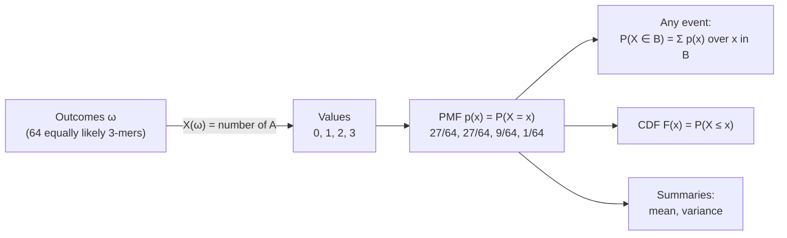

---
aliases:
  - Probability Mass Function
  - PMF
  - Discrete Distribution
  - Distribution of a Random Variable
  - Loi de probabilité
  - Fonction de masse
tags:
  - type/concept
  - domain/statistics
  - domain/mathematics
  - level/L1
  - level/L2
  - level/L3
mastery: 0
prerequisites:
  - "[[Probability Space]]"
  - "[[Random Variable]]"
  - "[[Summation Notation]]"
  - "[[Function]]"
related:
  - "[[Cumulative Distribution Function]]"
  - "[[Expected Value]]"
  - "[[Variance]]"
  - "[[Bernoulli Distribution]]"
  - "[[Binomial Distribution]]"
  - "[[Poisson Distribution]]"
  - "[[Probability Density Function]]"
  - "[[Joint Distribution]]"
  - "[[Frequency Distribution]]"
  - "[[Mixture Model]]"
  - "[[K-mer]]"
projects:
  - "[[05-sequence-search]]"
  - "[[07-evolution-simulator]]"
sources:
  - "[[Introduction to Probability (Blitzstein)]]"
  - "[[MIT 18.05 - Introduction to Probability and Statistics]]"
  - "[[MIT 6.041SC - Probabilistic Systems Analysis and Applied Probability]]"
  - "[[Harvard Stat 110 - Probability]]"
  - "[[Modern Statistics for Modern Biology (Holmes)]]"
  - "[[Biological Sequence Analysis (Durbin)]]"
---

# Probability Distribution

> [!abstract]
> The distribution of a random variable says which values it can take and how probable each one is; for a discrete variable it is a table of probabilities, the probability mass function (PMF).

## Definition

Let $X$ be a [[Random Variable]] on a [[Probability Space]] $(\Omega, \mathcal{F}, P)$. The **distribution** of $X$ is the rule that gives $P(X \in B)$ for every set of values $B$. $X$ is **discrete** if its values lie in a finite or countably infinite set; its distribution is then fully described by the **probability mass function**

$$p_X(x) = P(X = x),$$

which satisfies $p_X(x) \ge 0$ and $\sum_x p_X(x) = 1$. The **support** of $X$ is the set of values with $p_X(x) > 0$, and for any set $B$, $P(X \in B) = \sum_{x \in B} p_X(x)$.[^blitz3][^mit4a][^6041]

## Why it matters

- **A model is a distribution.** Read counts per gene, alternative-allele reads at a site, occurrences of a [[K-mer]] and new mutations per genome are all modeled by choosing a distribution for a count ([[Binomial Distribution]], [[Poisson Distribution]], [[Negative Binomial Distribution]]). Generative models of discrete data are the starting point of modern statistics for biology.[^holmes1]
- **Significance is a question about a distribution.** "Is this k-mer over-represented?", "is this variant real?", "is this alignment score better than chance?" all compare an observation with the distribution it would have under a null model ([[Cumulative Distribution Function]], [[P-Value]], [[E-Value]]).
- **Simulation samples from a distribution.** Checking a formula or building a null distribution by [[Monte Carlo Method|Monte Carlo]] means drawing values with the right PMF ([[Random Variate Generation]]); [[05-sequence-search]] needs k-mer count statistics and [[07-evolution-simulator]] draws allele counts every generation.
- **Data versus model.** The relative frequencies of observed values form an empirical distribution ([[Frequency Distribution]], [[Histogram]]); fitting a model means choosing a theoretical PMF close to it.

## Core (L1)

### From a random variable to a table

Take a random 3-mer with independent, uniform bases: its 64 outcomes are equally likely. Let $X$ be its number of A. Counting outcomes (choose the positions of the A, fill the others with one of 3 bases) gives the PMF:

| $x$ | 0 | 1 | 2 | 3 |
|---|---|---|---|---|
| outcomes | $3^3 = 27$ | $3 \cdot 3^2 = 27$ | $3 \cdot 3 = 9$ | 1 |
| $p_X(x)$ | 27/64 | 27/64 | 9/64 | 1/64 |

The masses are non-negative and sum to $64/64 = 1$, so this is a valid PMF. Any event about $X$ is a sum over the table: $P(X \ge 2) = 9/64 + 1/64 = 10/64 = 5/32$.



A PMF is drawn as a **bar chart** with one bar per support point, not as a histogram of adjacent bins: $X$ cannot be 1.5.

### Named distributions are families

Many PMFs share a formula and differ only by **parameters**: the [[Bernoulli Distribution]] (one parameter $p$), the [[Binomial Distribution]] ($n$, $p$), the [[Poisson Distribution]] ($\lambda$). Writing $X \sim \mathrm{Bin}(n, p)$ means "$X$ has the binomial PMF with these parameters".[^blitz3][^stat110][^durbin11] In the example above, $X \sim \mathrm{Bin}(3, 1/4)$.

### A distribution is not the random variable

Let $Y$ be the number of T in the same 3-mer. By symmetry $Y$ has exactly the PMF of $X$, yet $X \ne Y$: for the outcome AAA, $X = 3$ and $Y = 0$. Two variables with the **same distribution** can take different values on the same outcome, and can be dependent (here $X + Y \le 3$). Confusing a random variable with its distribution is a classic error that Blitzstein and Hwang warn against.[^blitz3]

### Empirical distribution versus model

Counting a 6-mer in each of many genomes gives one number per genome; the relative frequency of each count is an **empirical PMF**. A random-sequence model gives a **theoretical PMF** for the same count. Comparing the two is how one asks whether genomes use the word more or less than chance (see Worked example).

## Deeper (L2)

### Functions of a random variable

If $Y = g(X)$, the PMF of $Y$ collects the mass of every $x$ mapped to the same value:

$$p_Y(y) = \sum_{x \,:\, g(x) = y} p_X(x).$$

For example the indicator "the 3-mer contains at least one A", $Y = \mathbf{1}\{X \ge 1\}$, has $p_Y(0) = 27/64$ and $p_Y(1) = 37/64$: a [[Bernoulli Distribution]]. Presence/absence of a k-mer in a genome is such a function of its count.

### Sums of independent variables: convolution

If $X$ and $Y$ are independent ([[Independence (Probability)]]) with integer values, then summing over the ways to reach $s$:

$$p_{X+Y}(s) = \sum_{x} p_X(x)\, p_Y(s - x).$$

The number of A in two independent 3-mers is the number of A in a 6-mer, so convolving $\mathrm{Bin}(3, 1/4)$ with itself must give $\mathrm{Bin}(6, 1/4)$ (Exercise 4). The count of a word in a genome is the sum of its counts over chromosomes, and its PMF is their convolution when the chromosomes are modeled as independent.

Two variables measured on the same outcome (the counts of A and of T above; the genotypes at two loci) need a **joint** PMF $p_{X,Y}(x, y) = P(X = x, Y = y)$; summing it over $y$ recovers the PMF of $X$ ([[Law of Total Probability]], [[Joint Distribution]]).

## Advanced (L3)

### Mixtures: why counts across real genomes spread more

"The distribution of counts of a k-mer across genomes" is rarely one model. Genomes differ in composition, so if a fraction $w_j$ of genomes belongs to class $j$ with PMF $p_j$, the [[Law of Total Probability]] gives the **mixture**

$$p(x) = \sum_j w_j\, p_j(x), \qquad \sum_j w_j = 1.$$

With GAATTC (four A or T, two G or C) in random 10 kb sequences, the expected count is 3.42 at 35 % GC and 0.99 at 65 % GC. Pooling 500 simulated genomes of each (Exercise 5) gives $P(X = 0) = 0.183$ and $P(X \ge 6) = 0.061$, against $0.092$ and $0.038$ for uniform-composition genomes with a similar mean (2.45): the mixture has **heavier tails on both sides**. This is the mechanism behind [[Overdispersion]] of biological counts and behind count models built as mixtures, such as the gamma-Poisson ([[Negative Binomial Distribution]], [[Mixture Model]]).[^holmes] Real genomes add dependence between neighbouring bases and repeats, so "random sequence" is a null model to compare with, not a description ([[K-mer]]).

### The general picture

For any random variable, measure theory defines the distribution as the probability measure $P_X(B) = P(X^{-1}(B))$ on the values; the PMF is its density with respect to counting measure, and a [[Probability Density Function]] plays the same role for continuous variables with respect to length. For variables in $\{0, 1, 2, \dots\}$, the **probability generating function** $G_X(s) = \sum_x p_X(x) s^x$ packs the whole PMF into one power series; for independent $X$ and $Y$, $G_{X+Y} = G_X G_Y$, so convolution becomes multiplication ([[Generating Function]]).

## Mathematical representation

- $X : \Omega \to S$ with $S$ countable; $p_X(x) = P(\{\omega \in \Omega : X(\omega) = x\})$ for $x \in S$.
- Validity: $p_X(x) \ge 0$ and $\sum_{x \in S} p_X(x) = 1$. Events: $P(X \in B) = \sum_{x \in B \cap S} p_X(x)$.
- Function of $X$: $p_{g(X)}(y) = \sum_{x \in g^{-1}(y)} p_X(x)$. Independent sum: $p_{X+Y} = p_X * p_Y$ with $(p * q)(s) = \sum_x p(x)\, q(s - x)$. Mixture: $p = \sum_j w_j p_j$ with $w_j \ge 0$, $\sum_j w_j = 1$.
- Generating function: $G_X(s) = E[s^X] = \sum_{x \ge 0} p_X(x) s^x$, with $G_X(1) = 1$ and $p_X(x) = G_X^{(x)}(0)/x!$.

## Computational representation

A discrete PMF is a mapping from values to probabilities: a `dict` for sparse or arbitrary values, a list indexed by $0, 1, \dots, n$ for counts. Exact fractions keep small examples exact; real models use floats, and log-probabilities when masses become tiny.

```python
from collections import Counter
from fractions import Fraction


def is_pmf(pmf: dict, tol: float = 1e-12) -> bool:
    """Non-negative masses that sum to 1."""
    return all(p >= 0 for p in pmf.values()) and abs(sum(pmf.values()) - 1) <= tol


def prob(pmf: dict, event) -> float:
    """P(X in B), the event B given as a predicate on values."""
    return sum(p for x, p in pmf.items() if event(x))


def pmf_of_function(pmf: dict, g) -> dict:
    """PMF of Y = g(X): add the masses of all x with the same g(x)."""
    out = Counter()
    for x, p in pmf.items():
        out[g(x)] += p
    return dict(sorted(out.items()))


def show(pmf: dict) -> dict:
    return {x: str(p) for x, p in pmf.items()}


# X = number of A in a random 3-mer (i.i.d. uniform bases), exact fractions
q = Fraction(1, 4)
X = {0: (1 - q) ** 3, 1: 3 * q * (1 - q) ** 2, 2: 3 * q ** 2 * (1 - q), 3: q ** 3}
print(show(X), is_pmf(X))
print("P(X >= 2) =", prob(X, lambda x: x >= 2))
print("PMF of 1{X >= 1}:", show(pmf_of_function(X, lambda x: int(x >= 1))))
```

```text
{0: '27/64', 1: '27/64', 2: '9/64', 3: '1/64'} True
P(X >= 2) = 5/32
PMF of 1{X >= 1}: {0: '27/64', 1: '37/64'}
```

When the PMF has no simple formula, simulate it. Here, the count of GAATTC in 1,000 random 10 kb genomes (seeded, so the output is reproducible):

```python
import random
from collections import Counter


def empirical_pmf(data) -> dict:
    """Relative frequency of each observed value."""
    n = len(data)
    return {x: c / n for x, c in sorted(Counter(data).items())}


def random_genome(rng: random.Random, length: int, gc: float) -> str:
    w = [(1 - gc) / 2, gc / 2, gc / 2, (1 - gc) / 2]           # A, C, G, T
    return "".join(rng.choices("ACGT", weights=w, k=length))


rng = random.Random(37)
word, length = "GAATTC", 10_000        # GAATTC cannot overlap itself, so str.count is exact
counts = [random_genome(rng, length, 0.5).count(word) for _ in range(1000)]
pmf = empirical_pmf(counts)
print("expected count:", round((length - len(word) + 1) / 4 ** len(word), 3))
print("mean of counts:", sum(counts) / len(counts))
for x, p in pmf.items():
    print(f"{x:2d} {p:.3f} {'#' * round(100 * p)}")
```

```text
expected count: 2.44
mean of counts: 2.452
 0 0.092 #########
 1 0.202 ####################
 2 0.248 #########################
 3 0.229 #######################
 4 0.139 ##############
 5 0.052 #####
 6 0.022 ##
 7 0.011 #
 8 0.003 
 9 0.002 
```

The empirical mean matches the expected count $(n - k + 1)/4^k$ derived in [[Expected Value]]; the shape is close to a [[Poisson Distribution]], which item 13 of the learning path explains.

## Worked example

> [!example] Is 8 copies of GAATTC in a 10 kb region unusual?
> 1. **Variable.** $X$ = number of GAATTC in a 10 kb sequence. **Null model**: independent bases, 50 % GC.
> 2. **Distribution.** From the simulated PMF above: $p(8) = 0.003$, $p(9) = 0.002$ and no larger value was observed.
> 3. **Event.** "At least 8 copies" is $\{X \ge 8\}$: $P(X \ge 8) \approx 0.003 + 0.002 = 0.005$. Under the model, 8 copies happen in about 1 region in 200: unusual, and this tail probability is exactly the kind of number a [[P-Value]] reports ([[Cumulative Distribution Function]]).
> 4. **Check the model.** Repeat with 35 % GC: the 500 AT-rich genomes of Exercise 5 give $P(X \ge 8) \approx 0.026$, five times larger. For an AT-rich genome, 8 copies are much less surprising. The conclusion depends on the null distribution, so the null must match the genome's composition.

## Common misconceptions

> [!warning] "The PMF value is the probability of the observation, so a small $p(x)$ means the observation is surprising"
> When the support is large, every single value has small probability: in $\mathrm{Bin}(1000, 1/2)$ even the most likely value has probability about 0.025. Surprise is judged by the probability of the observation **or anything more extreme** (a tail), not by $p(x)$ alone.

> [!warning] "Same distribution means same variable"
> The numbers of A and of T in a 3-mer have the same PMF but differ on most outcomes and are dependent. Equal distributions say nothing about how two variables relate; that needs their [[Joint Distribution]].

> [!warning] "The empirical frequencies are the distribution"
> An empirical PMF from 1,000 draws estimates the true PMF with sampling noise, and misses rare values entirely (no simulated genome had 10 copies, yet $P(X = 10) > 0$). Tail probabilities need many draws or an exact formula.

## Exercises

> [!question] Exercise 1 (L1)
> A count $X$ has $p(0) = 0.3$, $p(1) = 0.4$, $p(2) = 0.2$, $p(3) = c$ and no other values. Find $c$, then $P(X \ge 1)$ and $P(X \text{ odd})$.

> [!success]- Solution
> The masses must sum to 1: $c = 1 - 0.9 = 0.1$. $P(X \ge 1) = 1 - p(0) = 0.7$. $P(X \text{ odd}) = p(1) + p(3) = 0.5$.

> [!question] Exercise 2 (L1)
> Let $R$ be the number of purines (A or G) in a random dinucleotide with independent, uniform bases. Give its PMF by counting outcomes, and check that it is valid.

> [!success]- Solution
> 16 equally likely dinucleotides. $R = 0$: both pyrimidines, $2 \times 2 = 4$ outcomes. $R = 2$: both purines, 4 outcomes. $R = 1$: the remaining 8. PMF: $4/16, 8/16, 4/16$ for $0, 1, 2$; non-negative, sum 1. It is $\mathrm{Bin}(2, 1/2)$.

> [!question] Exercise 3 (L2)
> From the simulated GAATTC table, give the PMF of $Y = \min(X, 2)$ ("zero, one, two or more sites"), the variable a restriction-mapping experiment might record.

> [!success]- Solution
> $Y = 0$ collects $x = 0$: 0.092. $Y = 1$ collects $x = 1$: 0.202. $Y = 2$ collects every $x \ge 2$: $1 - 0.092 - 0.202 = 0.706$. A function of $X$ merges masses; it never creates or loses probability.

> [!question] Exercise 4 (L2, Python)
> Write `convolve(pmf_x, pmf_y)` for independent integer variables. Check that convolving the 3-mer A-count PMF with itself equals the A-count PMF of a 6-mer computed by enumerating all $4^6$ 6-mers.

> [!success]- Solution
> ```python
> from collections import Counter
> from fractions import Fraction
> from itertools import product
>
>
> def convolve(pmf_x: dict, pmf_y: dict) -> dict:
>     out = Counter()
>     for x, px in pmf_x.items():
>         for y, py in pmf_y.items():
>             out[x + y] += px * py
>     return dict(sorted(out.items()))
>
>
> q = Fraction(1, 4)
> X = {0: (1 - q) ** 3, 1: 3 * q * (1 - q) ** 2, 2: 3 * q ** 2 * (1 - q), 3: q ** 3}
> by_convolution = convolve(X, X)
> counts = Counter(kmer.count("A") for kmer in product("ACGT", repeat=6))
> by_enumeration = {x: Fraction(c, 4 ** 6) for x, c in sorted(counts.items())}
> print(by_convolution == by_enumeration)
> print({x: str(p) for x, p in by_enumeration.items()})
> # True
> # {0: '729/4096', 1: '729/2048', 2: '1215/4096', 3: '135/1024', 4: '135/4096', 5: '9/2048', 6: '1/4096'}
> ```
>
> The two halves of a 6-mer are independent 3-mers, so the count of A in the whole is the sum of two independent counts, and its PMF is the convolution: $\mathrm{Bin}(3, 1/4) * \mathrm{Bin}(3, 1/4) = \mathrm{Bin}(6, 1/4)$.

> [!question] Exercise 5 (L3, Python)
> Simulate 500 random 10 kb genomes at 35 % GC and 500 at 65 % GC (seed 7), count GAATTC in each, and compare the pooled PMF with the uniform-composition table above: $P(X = 0)$ and $P(X \ge 6)$. Explain the difference with the mixture formula.

> [!success]- Solution
> ```python
> import random
> from collections import Counter
>
> def empirical_pmf(data):
>     n = len(data)
>     return {x: c / n for x, c in sorted(Counter(data).items())}
>
> def random_genome(rng, length, gc):
>     w = [(1 - gc) / 2, gc / 2, gc / 2, (1 - gc) / 2]
>     return "".join(rng.choices("ACGT", weights=w, k=length))
>
> rng = random.Random(7)
> word, length = "GAATTC", 10_000
> low = [random_genome(rng, length, 0.35).count(word) for _ in range(500)]
> high = [random_genome(rng, length, 0.65).count(word) for _ in range(500)]
> print(round(sum(low) / 500, 2), round(sum(high) / 500, 2))
> pooled = empirical_pmf(low + high)
> print("P(X = 0):", pooled[0], "P(X >= 6):", round(sum(p for x, p in pooled.items() if x >= 6), 3))
> # 3.39 1.08
> # P(X = 0): 0.183 P(X >= 6): 0.061
> ```
>
> The pooled mean is about 2.2, close to the uniform model's 2.45, yet zeros are twice as frequent (0.183 against 0.092) and 6 or more copies more frequent too (0.061 against 0.038). The pooled PMF is $\tfrac12 p_{35} + \tfrac12 p_{65}$: the GC-rich half piles up mass at 0 and 1, the AT-rich half at 3 to 6. A single random-sequence model fitted to genomes of mixed composition will call too many counts "surprising" in both tails.

## Mastery checklist

- [ ] 1 Recognized: I can define a PMF and its support, and say what $X \sim \mathrm{Bin}(n, p)$ means.
- [ ] 2 Understood: I can explain the difference between a random variable and its distribution, and between an empirical and a theoretical PMF.
- [ ] 3 Practiced: I can build PMFs by counting, compute event probabilities, PMFs of functions of $X$ and convolutions, in Python.
- [ ] 4 Applied: in [[05-sequence-search]], I compare the observed counts of a k-mer across real sequences with a simulated null PMF that matches their composition.
- [ ] 5 Explained: I can teach why mixtures of genomes or samples widen count distributions, and how that leads to overdispersed count models.

## References

[^blitz3]: [[Introduction to Probability (Blitzstein)]], 2nd ed., ch. 3 "Random Variables and Their Distributions".
[^mit4a]: [[MIT 18.05 - Introduction to Probability and Statistics]], Spring 2022, Reading 4a "Discrete Random Variables".
[^6041]: [[MIT 6.041SC - Probabilistic Systems Analysis and Applied Probability]], discrete random variables and their PMFs.
[^holmes1]: [[Modern Statistics for Modern Biology (Holmes)]], ch. 1 "Generative Models for Discrete Data".
[^holmes]: [[Modern Statistics for Modern Biology (Holmes)]], treatment of mixture models and of overdispersed count data.
[^stat110]: [[Harvard Stat 110 - Probability]], random variables and the named distributions.
[^durbin11]: [[Biological Sequence Analysis (Durbin)]], ch. 11 "Background on probability".
