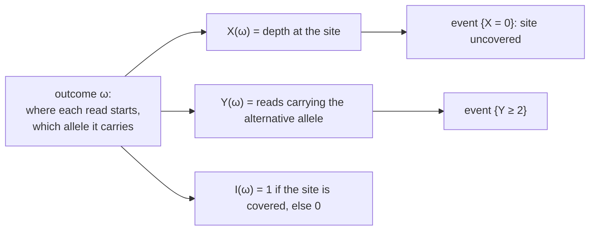

---
aliases:
  - RV
  - r.v.
  - Discrete Random Variable
  - Continuous Random Variable
  - Indicator Random Variable
  - Variable aléatoire
tags:
  - type/concept
  - domain/statistics
  - domain/mathematics
  - level/L1
  - level/L2
  - level/L3
mastery: 0
prerequisites:
  - "[[Probability Space]]"
  - "[[Function]]"
  - "[[Set]]"
related:
  - "[[Probability Distribution]]"
  - "[[Cumulative Distribution Function]]"
  - "[[Probability Density Function]]"
  - "[[Expected Value]]"
  - "[[Variance]]"
  - "[[Bernoulli Distribution]]"
  - "[[Binomial Distribution]]"
  - "[[Poisson Distribution]]"
  - "[[Independence (Probability)]]"
  - "[[Joint Distribution]]"
  - "[[Transformation of Random Variables]]"
  - "[[Statistical Model]]"
  - "[[Sequencing Coverage]]"
  - "[[Mutation Rate]]"
projects:
  - "[[10-genomic-pipeline]]"
  - "[[07-evolution-simulator]]"
sources:
  - "[[Introduction to Probability (Blitzstein)]]"
  - "[[Harvard Stat 110 - Probability]]"
  - "[[MIT 18.05 - Introduction to Probability and Statistics]]"
  - "[[Introductory Statistics (OpenStax)]]"
  - "[[Kong 2012 - Rate of De Novo Mutations and the Importance of Father's Age to Disease Risk]]"
---

# Random Variable

> [!abstract]
> A random variable is a rule that turns each outcome of a random experiment into a number, such as the read depth at a genome position or the number of mutations in a gene; statements about that number, like "depth ≥ 30", are events with probabilities.

## Definition

Given a [[Probability Space]] $(\Omega, \mathcal{F}, P)$, a **random variable** is a function $X : \Omega \to \mathbb{R}$ that assigns a real number $X(\omega)$ to each outcome $\omega$.[^blitz3][^mit4a] For a set of values $B$, $\{X \in B\} = \{\omega \in \Omega : X(\omega) \in B\}$ is an event, and its probability is written $P(X \in B)$; the most used are $\{X = x\}$ and $\{X \le x\}$. $X$ is **discrete** if its values lie in a finite or countably infinite set, and **continuous** if its probabilities are given by a density, in which case $P(X = x) = 0$ for every single value $x$.[^blitz3][^blitz5][^openstax]

## Why it matters

- **Every number a pipeline reports per position, read, gene or sample is modelled as a random variable**: depth at a position, reads supporting an allele, mutations in a gene, the expression level of a gene. A [[Statistical Model]] is a set of assumptions about the distributions of such variables, and a test is a statement about them.
- **Algebra on random quantities.** Depth is a sum over reads, the mutation count of a gene a sum over its positions, the total of a genome a sum over genes. Writing counts as sums of simple random variables is how their [[Expected Value|expected values]] and [[Variance|variances]] are computed and how the [[Binomial Distribution]] and the [[Poisson Distribution]] arise.
- **Simulation is code for random variables.** A simulator draws an outcome through a seeded generator and computes the quantities of interest from it, which is applying $X$ to $\omega$ ([[Random Variate Generation]], [[Monte Carlo Method]], [[07-evolution-simulator]]).

## Core (L1)

### A function of the outcome

The randomness lies in which outcome occurs; the random variable is a fixed rule applied to it. Several random variables can be read off the same outcome:



**Toy example (invented).** In a 10-bp region, two reads of length 4 start independently and uniformly at positions 1 to 7, and each comes from the chromosome carrying the alternative allele with probability 1/2 (a heterozygous site at position 5). An outcome is $\omega = (s_1, s_2, a_1, a_2)$, and the $7 \times 7 \times 2 \times 2 = 196$ outcomes are equally likely. A read starting at $s$ covers position 5 when $2 \le s \le 5$, so the depth at position 5 is

$$X(\omega) = \mathbb{1}(2 \le s_1 \le 5) + \mathbb{1}(2 \le s_2 \le 5),$$

where $\mathbb{1}(\cdot)$ is 1 when the condition holds and 0 otherwise. For $\omega = (2, 1, \text{alt}, \text{ref})$, only the first read covers the site: $X(\omega) = 1$, and $Y(\omega) = 1$ alternative read.

### Events defined by a random variable

$\{X = 0\}$ is the set of outcomes in which neither read covers the site: both starts in $\{1, 6, 7\}$, with any alleles, $3 \times 3 \times 4 = 36$ outcomes, so $P(X = 0) = 36/196 = 9/49$. Likewise $P(X = 1) = 24/49$, $P(X = 2) = 16/49$ and $P(X \ge 1) = 40/49$. The events $\{X = x\}$ for different values $x$ are disjoint and together cover $\Omega$: a random variable always defines a partition, the kind used by the [[Law of Total Probability]]. The table of the $P(X = x)$ is the distribution of $X$ ([[Probability Distribution]]).

### Discrete or continuous

| | Discrete | Continuous |
|---|---|---|
| Values | a finite or countable list | an interval of real numbers |
| A single value | $P(X = x)$ can be $> 0$ | $P(X = x) = 0$ |
| Described by | probability mass function ([[Probability Distribution]]) | density ([[Probability Density Function]]) |
| Bio examples | depth at a position, mutations in a gene, k-mer occurrences | log2 intensity of a probe, a measured concentration |

Both kinds have a [[Cumulative Distribution Function]] $F(x) = P(X \le x)$. Some measurements are neither: a value reported as the detection limit whenever it falls below it has a point mass plus a density ([[Probability Density Function#Deeper (L2)]]).

### Random variable and realization

A capital letter $X$ denotes the random variable, a lower-case $x$ a number it can take.[^blitz3] A column of depths in a file holds **realizations** $x_1, x_2, \dots$: observed values, one per position or per sample. "$P(X \ge 30)$" is a statement about the rule; "the depth here is 37" is a statement about one realization.

## Deeper (L2)

### Functions of random variables

A function of a random variable is a random variable: $Y = g(X)$ means $Y(\omega) = g(X(\omega))$.[^blitz3] Examples: $\mathbb{1}(X < 10)$ (a low-coverage flag), the $\log_2$ of an intensity, the alternative-allele fraction $Y/X$. The last one shows that the rule must be defined on **every** outcome: in the toy example $X = 0$ with probability $9/49$, so a pipeline must say what the fraction is at uncovered sites, or restrict the analysis to the event $\{X \ge 1\}$ and work conditionally on it ([[Conditional Probability]]). Distributions of functions of $X$ are derived in [[Probability Distribution]] (discrete case) and [[Transformation of Random Variables]] (continuous case).

### Indicators and counts

The **indicator** of an event $A$ is $\mathbb{1}_A(\omega) = 1$ if $\omega \in A$ and $0$ otherwise. It is a [[Bernoulli Distribution|Bernoulli]] random variable with $P(\mathbb{1}_A = 1) = P(A)$, and its expected value equals $P(A)$, the bridge between probabilities and expectations.[^blitz] Counts are sums of indicators:

- depth at a position $= \sum_{\text{reads } r} \mathbb{1}(r \text{ covers the position})$;
- mutations in a gene $= \sum_{\text{positions } i} \mathbb{1}(\text{position } i \text{ is mutated})$.

With independent indicators of equal probability such sums are [[Binomial Distribution|binomial]], and with many rare events approximately [[Poisson Distribution|Poisson]] ([[#Worked example]]).

### Several random variables and independence

Variables defined on the same space are usually related: in the toy example $Y \le X$ on every outcome, so $P(X = 0, Y = 2) = 0$ while $P(X = 0)\,P(Y = 2) = 36/2401$. Random variables are **independent** when every event about one is independent of every event about the other, $P(X \in A, Y \in B) = P(X \in A)\,P(Y \in B)$ for all sets $A, B$; **i.i.d.** (independent and identically distributed) variables also share one distribution.[^blitz3] Replicate measurements, the start positions of distinct reads and the errors of distinct reads given the genotype are commonly modelled as i.i.d.; the joint behaviour of dependent variables is the subject of [[Joint Distribution]] (and of [[Independence (Probability)]] for events).

## Advanced (L3)

- **Which functions qualify.** In measure-theoretic probability a random variable must be **measurable**: $\{X \le x\} \in \mathcal{F}$ for every $x$, so that $P(X \le x)$ is defined. On a finite $\Omega$ whose subsets are all events every function qualifies; the condition matters on continuous spaces ([[Probability Space#Advanced (L3)]]). The distribution of $X$ is then the probability $B \mapsto P(X^{-1}(B))$ on the real line ([[Probability Distribution#Advanced (L3)]]).
- **Beyond real numbers.** A read is a random string, a cell's expression profile a random vector of thousands of coordinates, a genealogy a random tree. The same definition with another set of values (a "random element") covers them; random vectors are treated in [[Joint Distribution]] and [[Multivariate Normal Distribution]].
- **Fixed unknowns or random variables.** The true genotype at a site is one fixed, unknown value. Frequentist methods treat such unknowns as constants to estimate; Bayesian methods give them a prior distribution, as random variables, and compute a posterior ([[Bayes' Theorem]], [[Bayesian Inference]]).[^1805]
- **Seeds fix the outcome.** In a simulation, the seed and state of the generator play the role of $\omega$: fixing the seed fixes the outcome, so every random variable computed from it is reproducible ([[Random Number Generation]]).

## Mathematical representation

- Random variable: $X : (\Omega, \mathcal{F}) \to \mathbb{R}$ with $X^{-1}\big((-\infty, x]\big) = \{X \le x\} \in \mathcal{F}$ for all $x \in \mathbb{R}$.
- Events $\{X \in B\} = X^{-1}(B)$; distribution $P_X(B) = P(X \in B)$; CDF $F_X(x) = P(X \le x)$.
- Discrete: values in a countable set $S$ with $\sum_{x \in S} P(X = x) = 1$. Continuous: $P(a \le X \le b) = \int_a^b f_X(t)\,dt$ for a density $f_X$.
- Functions: $(g \circ X)(\omega) = g(X(\omega))$. Indicators: $\mathbb{1}_{A \cap B} = \mathbb{1}_A \mathbb{1}_B$ and $\mathbb{1}_{A^c} = 1 - \mathbb{1}_A$, outcome by outcome.
- Counts: $N = \sum_{j=1}^{m} \mathbb{1}_{A_j}$ is the number of the events $A_1, \dots, A_m$ that occur.
- Independence: $P(X \in A, Y \in B) = P(X \in A)\,P(Y \in B)$ for all (measurable) $A, B \subseteq \mathbb{R}$.

## Computational representation

In code, a random variable is a function that takes an outcome and returns a number, and an event about it is a predicate. On a small finite space, enumerating the outcomes gives exact probabilities; drawing outcomes with a seeded generator and applying the same function gives realizations.

```python
import itertools
import random
from collections import Counter
from fractions import Fraction

READ_LEN, STARTS, SITE = 4, range(1, 8), 5     # toy region: 2 reads of length 4 start at 1..7

# Sample space: (start1, start2, allele1, allele2), 7 * 7 * 2 * 2 = 196 equally likely outcomes
omega = list(itertools.product(STARTS, STARTS, "RA", "RA"))    # R reference, A alternative

def covers(start: int, pos: int = SITE) -> bool:
    return start <= pos < start + READ_LEN

def X(w) -> int:
    """Depth at the site: number of reads covering it."""
    return covers(w[0]) + covers(w[1])

def Y(w) -> int:
    """Number of reads covering the site that carry the alternative allele."""
    return (covers(w[0]) and w[2] == "A") + (covers(w[1]) and w[3] == "A")

def pmf(rv) -> dict:
    counts = Counter(rv(w) for w in omega)
    return {x: Fraction(c, len(omega)) for x, c in sorted(counts.items())}

def prob(event) -> Fraction:
    return Fraction(sum(1 for w in omega if event(w)), len(omega))

w = omega[30]
print(len(omega), "outcomes; outcome", w, "-> X =", X(w), ", Y =", Y(w))
print("PMF of X:", {x: str(p) for x, p in pmf(X).items()})
print("PMF of Y:", {y: str(p) for y, p in pmf(Y).items()})
print("Y <= X on every outcome:", all(Y(w) <= X(w) for w in omega))
print("P(X >= 1) =", prob(lambda w: X(w) >= 1), "; Y/X undefined with probability", prob(lambda w: X(w) == 0))
print("P(X = 0, Y = 2) =", prob(lambda w: X(w) == 0 and Y(w) == 2),
      "but P(X = 0) P(Y = 2) =", pmf(X)[0] * pmf(Y)[2])

# The same random variable realized by simulation (seeded): draw outcomes, apply X
rng = random.Random(3)
draws = [(rng.choice(STARTS), rng.choice(STARTS), rng.choice("RA"), rng.choice("RA"))
         for _ in range(100_000)]
freq = Counter(X(w) for w in draws)
print("simulated PMF of X:", {x: round(freq[x] / len(draws), 4) for x in sorted(freq)})
```

```text
196 outcomes; outcome (2, 1, 'A', 'R') -> X = 1 , Y = 1
PMF of X: {0: '9/49', 1: '24/49', 2: '16/49'}
PMF of Y: {0: '25/49', 1: '20/49', 2: '4/49'}
Y <= X on every outcome: True
P(X >= 1) = 40/49 ; Y/X undefined with probability 9/49
P(X = 0, Y = 2) = 0 but P(X = 0) P(Y = 2) = 36/2401
simulated PMF of X: {0: 0.181, 1: 0.4911, 2: 0.3279}
```

The 100,000 realizations reproduce $9/49 = 0.184$, $24/49 = 0.490$ and $16/49 = 0.327$ within sampling error. The PMF of $Y$ is $\mathrm{Bin}(2, 2/7)$: each read independently covers the site and carries the alternative allele with probability $\frac47 \times \frac12$.

## Worked example

> [!example] The number of new mutations in a gene
> A child carries two copies of a gene whose coding sequence is 1,500 bp long (an invented length), so 3,000 sites can mutate. Assume that each site mutates independently with probability $\mu = 1.2 \times 10^{-8}$ per generation, the human rate estimated from sequenced trios.[^kong]
>
> 1. **Random variable.** $Y = \sum_{i=1}^{3000} J_i$, where $J_i$ indicates a new mutation at site $i$. $Y$ is discrete, with values $0, 1, \dots, 3000$.
> 2. **No new mutation.** $\{Y = 0\} = \bigcap_i \{J_i = 0\}$, so by independence $P(Y = 0) = (1 - \mu)^{3000} = 0.999964$ and $P(Y \ge 1) = 3.6 \times 10^{-5}$. Two or more: about $\binom{3000}{2}\mu^2 = 6.5 \times 10^{-10}$.
> 3. **A population.** Over $10^6$ births, the total $T$ is a sum of $3 \times 10^9$ indicators. Its expected value is $3 \times 10^9 \times \mu = 36$ ([[Expected Value]]), and $P(T = 0) = (1 - \mu)^{3 \times 10^9} \approx e^{-36} = 2.3 \times 10^{-16}$.
> 4. **Interpretation.** For one child, a new mutation in this gene is a rare event; in a large population, dozens arise in every generation ([[Mutation Rate]]). The model's assumptions are explicit: equal rates at all sites and for all parents. The second is known to fail, since the number of new mutations grows with the father's age.[^kong]

## Common misconceptions

> [!warning] "A random variable is a variable that changes at random"
> It is a fixed function; what is random is the outcome it is applied to. Two runs with the same seed give the same values because they apply the same functions to the same outcome.

> [!warning] "The observed depth is the random variable"
> 37 is a realization of $X$. The distribution belongs to the rule $X$; the data are draws from it. Mixing the two leads to statements like "this depth has a Poisson distribution".

> [!warning] "A count becomes continuous when it is large"
> A count of 10,000 reads is still discrete: $P(X = 10{,}000)$ is a positive mass. A continuous distribution can approximate it ([[Normal Distribution]]), but the approximation is a modelling choice, and it fails for small counts.

> [!warning] "The allele fraction $Y/X$ is a random variable like any other"
> Only once it is defined on every outcome. With probability $9/49$ in the toy example it is $0/0$; silently dropping uncovered sites changes the question into one conditional on $\{X \ge 1\}$.

## Exercises

> [!question] Exercise 1 (L1)
> In the toy region (two reads of length 4 starting uniformly at positions 1 to 7), let $D_1$ be the depth at position 1. Give the PMF of $D_1$ and compare $P(D_1 = 0)$ with $P(X = 0) = 9/49$ at position 5.

> [!success]- Solution
> Only a read starting at 1 covers position 1, with probability $1/7$, independently for the two reads. $P(D_1 = 0) = (6/7)^2 = 36/49$, $P(D_1 = 1) = 2 \times \frac17 \times \frac67 = 12/49$, $P(D_1 = 2) = 1/49$. Position 1 is uncovered four times as often as position 5: the ends of a region receive fewer reads. Same outcomes, different random variables.

> [!question] Exercise 2 (L1)
> Discrete or continuous? (a) the number of reads mapped to a gene; (b) the fraction of methylated reads at a CpG site covered by 12 reads; (c) the log2 intensity of a microarray probe; (d) the time until a cell divides.

> [!success]- Solution
> (a) Discrete, a count. (b) Discrete: with 12 reads the fraction takes only the 13 values $0, 1/12, \dots, 1$; a methylation level of the cell population could be modelled as continuous, but the measured fraction cannot. (c) Continuous, modelled by a density. (d) Continuous. The type belongs to the model of the measurement, not to the biological quantity alone.

> [!question] Exercise 3 (L2)
> Prove outcome by outcome that $\mathbb{1}_{A \cup B} = \mathbb{1}_A + \mathbb{1}_B - \mathbb{1}_A \mathbb{1}_B$. In the toy example, with $C_j = \{2 \le s_j \le 5\}$, write the indicator of "the site is covered" and deduce $P(X \ge 1)$.

> [!success]- Solution
> Fix $\omega$ and check the four cases. In neither event: $0 = 0 + 0 - 0$. Only in $A$: $1 = 1 + 0 - 0$. Only in $B$: $1 = 0 + 1 - 0$. In both: $1 = 1 + 1 - 1$. Two random variables are equal when they agree on every outcome. Hence $\mathbb{1}(X \ge 1) = \mathbb{1}_{C_1} + \mathbb{1}_{C_2} - \mathbb{1}_{C_1}\mathbb{1}_{C_2}$, whereas $X = \mathbb{1}_{C_1} + \mathbb{1}_{C_2}$. Taking expected values, which turn indicators into probabilities ([[Expected Value]]): $P(X \ge 1) = \frac47 + \frac47 - \frac{16}{49} = \frac{40}{49}$, inclusion-exclusion.

> [!question] Exercise 4 (L2, Python)
> Three reads of length 4 now start uniformly at positions 1 to 7 of the 10-bp region. Enumerate the $7^3$ outcomes and compute, for positions 1 to 5 (the profile is symmetric about the middle of the region), $P(\text{depth} = 0)$ and the mean depth ([[Expected Value]]). Describe the profile.

> [!success]- Solution
> ```python
> import itertools
> from fractions import Fraction
>
> READ_LEN, STARTS, N_READS = 4, range(1, 8), 3     # 3 reads of length 4 start uniformly at 1..7
> omega = list(itertools.product(STARTS, repeat=N_READS))   # 343 equally likely outcomes
>
> for pos in range(1, 6):                          # positions 6-10 mirror 5-1
>     depth = [sum(s <= pos < s + READ_LEN for s in w) for w in omega]   # X_pos(w) for every w
>     p_zero = Fraction(depth.count(0), len(omega))
>     mean = Fraction(sum(depth), len(omega))
>     print(f"position {pos:2d}: P(depth = 0) = {float(p_zero):.3f}, mean depth = {float(mean):.3f}")
> ```
>
> ```text
> position  1: P(depth = 0) = 0.630, mean depth = 0.429
> position  2: P(depth = 0) = 0.364, mean depth = 0.857
> position  3: P(depth = 0) = 0.187, mean depth = 1.286
> position  4: P(depth = 0) = 0.079, mean depth = 1.714
> position  5: P(depth = 0) = 0.079, mean depth = 1.714
> ```
>
> Positions 4 to 7 can be reached from 4 of the 7 start positions, positions 1 and 10 from only one, so the mean depth falls from $3 \times 4/7 = 1.71$ to $3/7 = 0.43$ and the probability of no coverage rises from 0.079 to 0.630. Uniform read starts do not give uniform coverage near the ends of a region; the coverage simulation of [[Poisson Distribution]] uses a circular genome to avoid this edge effect.

> [!question] Exercise 5 (L3, Python)
> In an invented mutagenesis experiment, each of the 1,000 sites of a gene mutates independently with probability 0.001. Write the count $Y$ as a sum of indicators, derive $P(Y = 0)$ and $P(Y = 1)$ from that representation, and check them by simulating 20,000 genes with a seeded generator. Then keep the expected count at 1 but give 10 "hotspot" sites probability 0.05 each, the 990 others sharing the rest equally. How does $P(Y = 0)$ change, and why?

> [!success]- Solution
> $\{Y = 0\}$ requires all 1,000 indicators to be 0: $(1 - p)^{1000}$. $\{Y = 1\}$ is the disjoint union, over the one site $i$ that mutates, of "only site $i$": $1000\, p\, (1 - p)^{999}$.
>
> ```python
> import random
>
> L, p = 1000, 0.001                        # invented: sites in a gene, per-site probability
> p0 = (1 - p) ** L                         # every indicator equals 0
> p1 = L * p * (1 - p) ** (L - 1)           # exactly one indicator equals 1: L choices
> print(f"exact:     P(Y = 0) = {p0:.4f}, P(Y = 1) = {p1:.4f}, P(Y >= 2) = {1 - p0 - p1:.4f}")
>
> rng = random.Random(11)
> genes = 20_000
> counts = [sum(rng.random() < p for _ in range(L)) for _ in range(genes)]   # Y = sum of L indicators
> print(f"simulated: P(Y = 0) = {counts.count(0) / genes:.4f}, P(Y = 1) = {counts.count(1) / genes:.4f}, "
>       f"P(Y >= 2) = {sum(c >= 2 for c in counts) / genes:.4f}")
>
> hot = 0.95 ** 10 * (1 - 0.5 / 990) ** 990      # 10 hotspots at 0.05, same expected count (1)
> print(f"10 hotspot sites, same mean: P(Y = 0) = {hot:.4f}")
> ```
>
> ```text
> exact:     P(Y = 0) = 0.3677, P(Y = 1) = 0.3681, P(Y >= 2) = 0.2642
> simulated: P(Y = 0) = 0.3640, P(Y = 1) = 0.3740, P(Y >= 2) = 0.2620
> 10 hotspot sites, same mean: P(Y = 0) = 0.3631
> ```
>
> The exact values are close to the Poisson values $e^{-1} = 0.3679$ ([[Poisson Distribution]]). With hotspots, $\log P(Y = 0) = \sum_i \log(1 - p_i)$, and since $\log(1 - p)$ is concave, this sum is largest when all $p_i$ are equal (Jensen's inequality): unequal probabilities within a gene **lower** $P(Y = 0)$ at a fixed mean. Variation of rates **between** genes has the opposite effect on pooled counts, raising the zeros through a mixture ([[Probability Distribution#Advanced (L3)]]).

## Mastery checklist

- [ ] 1 Recognized: I can define a random variable as a function on the sample space and give discrete and continuous examples from sequencing data.
- [ ] 2 Understood: I can explain the events $\{X \in B\}$, the difference between $X$ and a realization $x$, and why functions and indicators of random variables are random variables.
- [ ] 3 Practiced: I can enumerate a small sample space in Python, define random variables as functions on it, compute their PMFs exactly and check them by seeded simulation.
- [ ] 4 Applied: in [[10-genomic-pipeline]], I write depth, allele counts and allele fractions at real positions as random variables, state the model they come from and handle uncovered sites explicitly.
- [ ] 5 Explained: I can teach counts as sums of indicators, independence of random variables, measurability, and the frequentist and Bayesian status of unknown quantities.

## References

[^blitz3]: [[Introduction to Probability (Blitzstein)]], 2nd ed., ch. 3 "Random Variables and Their Distributions" (definition and notation, functions of random variables, independence and i.i.d. random variables).
[^blitz5]: [[Introduction to Probability (Blitzstein)]], 2nd ed., ch. 5 "Continuous Random Variables".
[^blitz]: [[Introduction to Probability (Blitzstein)]], 2nd ed., treatment of indicator random variables (the bridge between probability and expectation).
[^mit4a]: [[MIT 18.05 - Introduction to Probability and Statistics]], Spring 2022, Reading 4a "Discrete Random Variables"; see also [[Harvard Stat 110 - Probability]], random variables and their distributions.
[^1805]: [[MIT 18.05 - Introduction to Probability and Statistics]], Bayesian and frequentist statistics parts (unknown parameters with a prior, or as fixed constants).
[^openstax]: [[Introductory Statistics (OpenStax)]], 2nd ed., ch. 4 "Discrete Random Variables" and ch. 5 "Continuous Random Variables".
[^kong]: [[Kong 2012 - Rate of De Novo Mutations and the Importance of Father's Age to Disease Risk]], Kong A et al., *Nature* 488:471-475: $1.20 \times 10^{-8}$ mutations per nucleotide per generation, about two more new mutations per year of the father's age.
