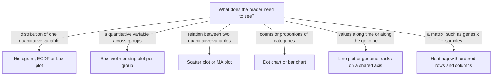

---
aliases:
  - Data Visualisation
  - Statistical Graphics
  - Dataviz
  - Scientific Figure
  - Visualisation de données
tags:
  - type/concept
  - domain/statistics
  - domain/bioinformatics
  - domain/scientific-practice
  - level/L1
  - level/L2
  - level/L3
mastery: 0
prerequisites:
  - "[[Level of Measurement]]"
  - "[[Histogram]]"
  - "[[Box Plot]]"
  - "[[Scatter Plot]]"
related:
  - "[[Exploratory Data Analysis]]"
  - "[[Heatmap]]"
  - "[[Genome Browser]]"
  - "[[Scientific Writing]]"
  - "[[Empirical Cumulative Distribution Function]]"
  - "[[Data Transformation]]"
  - "[[Standard Score]]"
  - "[[Computational Reproducibility]]"
projects:
  - "[[09-genome-browser]]"
  - "[[bio-visualization]]"
sources:
  - "[[Cleveland 1984 - Graphical Perception]]"
  - "[[Wong 2011 - Color Blindness]]"
  - "[[Introductory Statistics (OpenStax)]]"
  - "[[Modern Statistics for Modern Biology (Holmes)]]"
  - "[[HarvardX PH525x - Data Analysis for the Life Sciences]]"
  - "[[Python for Data Analysis (McKinney)]]"
  - "[[Sandve 2013 - Ten Simple Rules for Reproducible Computational Research]]"
  - "[[Integrative Genomics Viewer]]"
---

# Data Visualization

> [!abstract]
> Data visualization turns numbers into marks whose position, length, color and shape a reader can decode: choosing the chart that fits the question, encoding values honestly, using colors everyone can tell apart, and labelling every axis with its unit.

## Definition

**Data visualization** represents data by visual properties of graphical marks (position, length, angle, area, color, shape). **Scales** map data values to those properties, and axes, legends and labels let the reader map them back. In the grammar of graphics implemented by ggplot2, a chart is specified by its data, a mapping of variables to aesthetics (x, y, color, shape, size), geometric objects (points, lines, bars), scales and facets.[^holmes]

## Why it matters

- **Finding problems.** Sample swaps, failed libraries, batch effects and artifacts are found by plots before any test ([[Exploratory Data Analysis]]).[^ph525]
- **Communicating results.** A paper's figures carry its main results; one figure should make one point ([[Scientific Writing]]).
- **Positional data.** Genomic data live on coordinates: genome browsers stack tracks of reads, coverage, variants and annotations along one axis ([[Genome Browser]]).[^igv]
- **Readers with color blindness.** Red-green color blindness affects up to 8 % of men and 0.5 % of women of Northern European ancestry: a figure that relies on red versus green loses a sizeable part of its audience.[^wong]
- **Lab.** [[bio-visualization]] builds reusable plots; [[09-genome-browser]] builds track displays.

## Core (L1)

### 1. Choose the chart from the question



The type of each variable decides what can be drawn ([[Level of Measurement]]): a nominal variable can set color or panel but not position on a continuous axis. See [[Histogram]], [[Box Plot]], [[Scatter Plot]], [[Empirical Cumulative Distribution Function]] and [[Heatmap]].

### 2. Encode honestly

- **Prefer position.** People judge positions along a common scale most accurately, then lengths, then angles and slopes, and areas least accurately.[^cleveland] A dot chart or bar chart therefore beats a pie chart or bubble sizes when values must be compared.
- **Bars start at zero.** A bar encodes its value by its length, so its baseline must be zero; otherwise the drawn ratio is not the true ratio (Worked example). Dots encode by position only, so a dot plot may zoom on the interesting range, provided the axis is labelled.
- **Keep scales comparable.** Panels meant to be compared share their axes; avoid two different y axes on one panel and 3D effects, which distort lengths and areas by perspective.
- **Show the data.** With a few replicates, plot every point rather than a bar of the mean, and state what error bars show (standard deviation, standard error or confidence interval).
- **Transform when the data call for it.** Ratios and counts spanning orders of magnitude go on a log axis, with ticks labelled in original units ([[Data Transformation]]).

### 3. Color with purpose, for everyone

- **Match the palette to the variable.** Qualitative palettes (distinct hues) for categories; sequential palettes (light to dark) for magnitudes; diverging palettes (two hues meeting at a neutral color) for deviations from a meaningful center such as $z = 0$ or a log fold change of 0 ([[Standard Score]], [[Heatmap]]).[^holmes]
- **Use a color-blind-safe palette.** Wong presents eight colors that people with red-green color blindness can distinguish (panel A below): black, orange `#E69F00`, sky blue `#56B4E9`, bluish green `#009E73`, yellow `#F0E442`, blue `#0072B2`, vermillion `#D55E00` and reddish purple `#CC79A7`.[^wong]
- **Add redundancy.** Encode categories with shape, line type or direct labels as well as color, so the figure survives grayscale printing and any color vision (panel B: SNVs are triangles, indels squares).

![[data-visualization-palette-genome-track.svg]]

### 4. Label everything

- Each axis names its quantity and unit: "Insert size (bp)", "Depth (reads)", "log2(CPM + 1)", "Base quality (Phred Q)".[^os2]
- Legends, or better direct labels, decode colors and shapes.
- The caption says what is plotted, $n$ per group, any transformation, what whiskers or error bars mean, and whether the data are simulated or invented.
- Text stays legible at the printed size of the figure.

## Deeper (L2)

### The grammar of graphics in practice

Writing a chart as mappings makes design decisions explicit. The replicate plot of [[Scatter Plot]] is: data = one row per gene; x = log2 count in replicate 1, y = log2 count in replicate 2 (position, same linear scale on both); geom = points with transparency against overplotting; an extra layer for the line $y = x$; facets = one panel per pair of replicates. In Python, matplotlib and the plotting methods of pandas data frames play this role ([[Scientific Python Ecosystem]]).[^mckinney]

### Small multiples and ordering

Many similar panels with identical axes (facets) let the eye compare positions across panels instead of reading legends. Within a panel, order categories by a meaningful value (for example the median of each sample) rather than alphabetically, so that the order itself carries information.

### Figures are produced by code

Each figure should be regenerated by a script from the stored data: no manual editing of values, the data behind every plot kept, and the random seed recorded for anything simulated (the figures of these notes state theirs).[^sandve] Vector formats (SVG, PDF) keep line art and text sharp at any size ([[Computational Reproducibility]]).

## Advanced (L3)

### Genome tracks

A genome browser shares one horizontal axis, the genomic coordinate, among stacked tracks, each with its own vertical encoding: gene models drawn as boxes and lines with arrows for the strand, quantitative signals (coverage) drawn as areas with a labelled y axis, variants as glyphs, alignments as individual reads.[^igv] Three design problems are specific to them:

- **Zoom implies summary.** A 100-Mb chromosome drawn on 1,000 pixels puts 100 kb in each pixel. The value shown per pixel is a summary (mean, maximum) that must be chosen and stated: a maximum hides dips in coverage, a mean hides narrow peaks.
- **Coordinates have conventions.** BED intervals are zero-based with the end excluded, SAM/BAM positions are one-based; labels and tick marks must use one convention consistently.[^igvdocs]
- **Shared axis, separate scales.** Coverage tracks compared between samples need the same y range, or the eye compares heights that mean different depths.

### Color maps for matrices

A heatmap encodes values by color alone, the least accurate channel, so its color map carries all the weight ([[Heatmap]]). For z-scores or log fold changes, use a diverging map with symmetric limits around 0; clip extreme values to the limits and say so in the legend. Equal steps in the data should look like equal steps in color: a rainbow map fails this, since there is no natural order between its hues (is green above or below cyan?), so values cannot be ranked without constant reference to the legend.

### Checking a figure before sharing it

View it in grayscale and with a color-blindness simulator; check every axis label and unit; check that $n$ and the meaning of error bars are stated; ask someone to state the figure's message in one sentence.

## Mathematical representation

- **Linear scale** from data interval $[d_0, d_1]$ to pixel interval $[r_0, r_1]$: $s(x) = r_0 + \dfrac{x - d_0}{d_1 - d_0}\,(r_1 - r_0)$. In SVG the y axis points down, so $r_0 > r_1$ for a vertical axis.
- **Log scale**: $s(x) = r_0 + \dfrac{\log(x/d_0)}{\log(d_1/d_0)}\,(r_1 - r_0)$, $x > 0$: equal ratios get equal distances, whatever the base.
- **Truncated baseline** $t$: bars for values $a < b$ drawn from $t$ have length ratio $(b - t)/(a - t)$, larger than the true ratio $b/a$ whenever $0 < t < a$.
- **Area encoding**: a circle whose radius is proportional to the value has an area proportional to its square; for area to encode the value, use radius $\propto \sqrt{\text{value}}$.
- **Diverging color map** centered at $c$ with half-range $L$: position $u = \max(-1, \min(1, (v - c)/L))$ on the color scale, from the first hue at $u = -1$ through the neutral color at $u = 0$ to the second hue at $u = 1$.

## Computational representation

Scales and tick marks are what every plotting library computes for you; writing them once shows what they do ([[bio-visualization]]).

```python
import math

def linear_scale(d0, d1, r0, r1):
    """Map data interval [d0, d1] to pixel interval [r0, r1]."""
    return lambda x: r0 + (x - d0) / (d1 - d0) * (r1 - r0)

def log_scale(d0, d1, r0, r1):
    """Equal ratios get equal distances; d0 > 0."""
    return lambda x: r0 + math.log(x / d0) / math.log(d1 / d0) * (r1 - r0)

def nice_ticks(lo, hi, target=5):
    """About `target` ticks with a step of 1, 2 or 5 times a power of ten."""
    raw = (hi - lo) / target
    mag = 10 ** math.floor(math.log10(raw))
    step = min((m * mag for m in (1, 2, 5, 10)), key=lambda s: abs(s - raw))
    first = math.ceil(lo / step) * step
    return [round(first + i * step, 10) for i in range(int((hi - first) / step + 1e-9) + 1)]

def drawn_ratio(a, b, baseline):
    """How many times longer bar b looks than bar a when bars start at `baseline`."""
    return (b - baseline) / (a - baseline)

y = linear_scale(0, 80, 380, 300)            # depth 0..80 reads -> SVG y 380..300 (y grows downward)
print("depth 0, 40, 80 ->", y(0), y(40), y(80))
x = log_scale(100, 100_000, 0, 600)          # read length 100 bp .. 100 kb on 600 px
print("100 bp, 1 kb, 10 kb, 100 kb ->", [round(x(v)) for v in (100, 1_000, 10_000, 100_000)])
print("ticks 0..87:", nice_ticks(0, 87), " ticks 0.31..0.72:", nice_ticks(0.31, 0.72))
print("mapping 96 % vs 98 %: true ratio", round(98 / 96, 3),
      "| bars from 0:", round(drawn_ratio(96, 98, 0), 3), "| bars from 95 %:", drawn_ratio(96, 98, 95))
```

Output:

```text
depth 0, 40, 80 -> 380.0 340.0 300.0
100 bp, 1 kb, 10 kb, 100 kb -> [0, 200, 400, 600]
ticks 0..87: [0, 20, 40, 60, 80]  ticks 0.31..0.72: [0.4, 0.5, 0.6, 0.7]
mapping 96 % vs 98 %: true ratio 1.021 | bars from 0: 1.021 | bars from 95 %: 3.0
```

On the log scale, 100 bp to 1 kb takes as much room as 10 kb to 100 kb: each factor of 10 gets 200 pixels.

## Worked example

> [!example] Redesigning a QC figure (invented mapping rates)
> Six libraries have 96.1, 97.8, 95.4, 98.2, 88.0 and 97.0 % of reads mapped. The draft figure is a 3D bar chart with the y axis starting at 85 %, passing samples in green and the failing one in red, and no axis label.
>
> 1. **Truncated bars.** From an 85 % baseline, the bars of 98.2 % and 88.0 % have lengths 13.2 and 3.0: the best library looks 4.4 times "better" than the failing one, against a true ratio of 1.12.
> 2. **Encoding.** The message is a comparison of six values: use a dot plot, which encodes by position and may legitimately zoom on 85-100 %. Sort the samples by value.
> 3. **Color and redundancy.** Red versus green is unreadable for many color-blind readers. Draw the failing library in vermillion with a different shape and a direct label, the others in blue.
> 4. **Labels.** x axis "Reads mapped (%)"; a dashed reference line at the QC threshold with its value; caption with the aligner and reference used.
> 5. **Result.** The failing library stands out by position, shape and label; the 2-point differences among the others are visible without being exaggerated.

## Common misconceptions

> [!warning] "Every axis must start at zero"
> Only axes that encode by length or area (bars, areas) must. A dot plot or a scatter plot encodes by position and may zoom, with a clear axis label.

> [!warning] "Red and green are fine if there is a legend"
> A legend does not help readers who cannot tell the two colors apart. Use a color-blind-safe palette and redundant shapes or labels.[^wong]

> [!warning] "A pie chart is the natural chart for proportions"
> Angles and areas are judged less accurately than positions and lengths:[^cleveland] a sorted dot chart or bar chart of the same proportions is easier to read and compare.

> [!warning] "Decoration makes a figure clearer"
> 3D perspective, shadows and background images distort lengths and compete with the data. Every mark should encode something.

## Exercises

> [!question] Exercise 1 (L1)
> Choose a chart for each question: (a) the read-length distribution of one long-read run; (b) the expression of one gene in three genotypes, 12 individuals each; (c) agreement between two replicate libraries; (d) the fraction of reads assigned to five taxa in each of eight samples; (e) coverage around a deleted exon.

> [!success]- Solution
> (a) Histogram with a log x axis, or an ECDF. (b) Box or violin plot per genotype with the 12 points overlaid. (c) Scatter plot of log counts with $y = x$, or an MA plot. (d) Dot chart (or stacked bars, sorted) per sample, with a color-blind-safe palette for the taxa and shared axes. (e) Genome tracks: gene model plus coverage on a shared coordinate axis, same y range for all samples.

> [!question] Exercise 2 (L1)
> Critique a figure: bars of mean expression in control and treated groups (3 mice each) with unlabelled error bars, a y axis from 5 to 7 without a label, control in green and treated in red.

> [!success]- Solution
> Bars that do not start at zero exaggerate the difference; with $n = 3$ the points should be shown; the error bars must say SD, SE or CI; the y axis needs its quantity and unit (for example "log2 expression (CPM)"); red versus green fails for red-green color-blind readers. Fix: a strip plot of the six points with the group means, labelled axis, error-bar definition in the caption, palette colors such as blue and orange.

> [!question] Exercise 3 (L2)
> On a bubble chart, two taxa with abundances 10 and 40 are drawn with radii proportional to abundance. How many times larger does the second bubble look? Fix the encoding.

> [!success]- Solution
> Areas scale with the radius squared: $(40/10)^2 = 16$ times the area for a 4-fold difference. Use radius $\propto \sqrt{\text{abundance}}$ so that area is proportional to abundance, or better, a dot chart, since areas are judged poorly anyway.[^cleveland]

> [!question] Exercise 4 (L2, Python)
> Use `drawn_ratio` and `nice_ticks`: how much do bars of 40 and 50 differ visually from baselines 30 and 0? Which ticks cover a z-score axis from −3.2 to 4.1?

> [!success]- Solution
> ```python
> print(drawn_ratio(40, 50, 30), round(drawn_ratio(40, 50, 0), 3))   # 2.0 1.25
> print(nice_ticks(-3.2, 4.1))                                         # [-3, -2, -1, 0, 1, 2, 3, 4]
> ```
> From a baseline of 30, a 25 % difference looks like 100 %. For the z-score axis, integer ticks with step 1; for a diverging color scale on the same data, use symmetric limits such as ±4 so that 0 stays at the neutral color.

> [!question] Exercise 5 (L3)
> Design a figure showing a heterozygous deletion of one exon in a patient, compared with two controls. Specify tracks, scales, colors and labels.

> [!success]- Solution
> A shared x axis in genomic coordinates (kb) with the region's coordinates and assembly in the title; a gene-model track with strand arrows and the deleted exon highlighted; one coverage track per sample with the same y range ("Depth (reads)"), so that the patient's drop to about half depth over the exon reads directly by position; optional variant or split-read glyphs with shape plus color. Colors from a color-blind-safe palette, patient versus controls distinguished by label, not only by color. Caption: depth summary per pixel (mean), coordinate convention, number of reads, invented or real data.

## Mastery checklist

- [ ] 1 Recognized: I can name the main chart types and the visual channels from most to least accurate.
- [ ] 2 Understood: I can explain why bars start at zero but dots need not, how to choose a qualitative, sequential or diverging palette, and why color needs redundancy.
- [ ] 3 Practiced: I can implement scales and ticks in Python and produce a labelled, color-blind-safe figure from a script.
- [ ] 4 Applied: I redesign a real figure from a QC report or paper, and build a track display in [[09-genome-browser]].
- [ ] 5 Explained: I can teach the perceptual ranking of encodings, the pitfalls of genome-track summaries, and how to check a figure before sharing it.

## References

[^cleveland]: [[Cleveland 1984 - Graphical Perception]], *Journal of the American Statistical Association* 79(387), the ordering of elementary perceptual tasks (position, length, angle and slope, area).
[^wong]: [[Wong 2011 - Color Blindness]], *Nature Methods* 8(6):441: prevalence of red-green color blindness and the eight-color palette.
[^os2]: [[Introductory Statistics (OpenStax)]], 2nd ed., ch. 2 "Descriptive Statistics" (graphs of data and the labelling of their axes).
[^holmes]: [[Modern Statistics for Modern Biology (Holmes)]], graphics with ggplot2 (the grammar of graphics) and color palettes for heatmaps.
[^ph525]: [[HarvardX PH525x - Data Analysis for the Life Sciences]], PH525.1x, exploratory data analysis.
[^mckinney]: [[Python for Data Analysis (McKinney)]], plotting and visualization with matplotlib and pandas.
[^sandve]: [[Sandve 2013 - Ten Simple Rules for Reproducible Computational Research]], *PLoS Computational Biology* 9(10):e1003285, rules 2 (avoid manual data manipulation), 6 (record random seeds) and 7 (store raw data behind plots).
[^igv]: [[Integrative Genomics Viewer]], Robinson et al., *Nature Biotechnology* 29:24-26 (2011).
[^igvdocs]: [[Integrative Genomics Viewer]], desktop documentation, "File Formats" (BED zero-based with the end excluded; SAM/BAM one-based).
