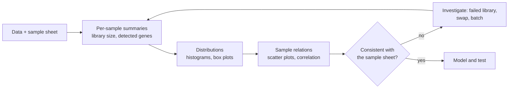

---
aliases:
  - EDA
  - Data Exploration
  - Analyse exploratoire des données
tags:
  - type/concept
  - domain/statistics
  - domain/bioinformatics
  - level/L1
  - level/L2
  - level/L3
mastery: 0
prerequisites:
  - "[[Summation Notation]]"
  - "[[Logarithm]]"
related:
  - "[[Sampling]]"
  - "[[Frequency Distribution]]"
  - "[[Measure of Central Tendency]]"
  - "[[Measure of Dispersion]]"
  - "[[Histogram]]"
  - "[[Box Plot]]"
  - "[[Scatter Plot]]"
  - "[[Correlation]]"
  - "[[Outlier]]"
  - "[[Count Matrix]]"
  - "[[Batch Effect]]"
  - "[[Principal Component Analysis]]"
projects:
  - "[[bio-visualization]]"
sources:
  - "[[HarvardX PH525x - Data Analysis for the Life Sciences]]"
  - "[[Experimental Design for Laboratory Biologists (Lazic)]]"
  - "[[Modern Statistics for Modern Biology (Holmes)]]"
  - "[[Leek 2010 - Tackling the Widespread and Critical Impact of Batch Effects]]"
  - "[[Molecular Biology of the Cell (Alberts)]]"
---

# Exploratory Data Analysis

> [!abstract]
> Exploratory data analysis means looking at a dataset with simple summaries and plots before fitting any model, to learn its structure and to catch the problems (failed samples, swapped labels, batches) that would otherwise silently corrupt every later result.

## Definition

**Exploratory data analysis (EDA)** is the examination of a dataset with numerical summaries and graphics, before formal modeling, to understand its structure, check data quality and the assumptions of later analyses, and generate hypotheses.[^ph525][^lazic] It comes before the tests and models of [[Statistical Inference]] and does not replace them.

## Why it matters

- **Count matrices.** The first look at an RNA-seq [[Count Matrix]] (library sizes, detected genes, how samples resemble each other) is where failed libraries and mislabeled samples are found, before they enter a differential expression test.[^holmes]
- **Quality control is EDA.** Read quality reports are collections of [[Histogram|histograms]] and [[Box Plot|box plots]] ([[Read Quality Control]]).
- **Batch effects** are usually discovered by exploratory plots, for example samples grouping by processing date rather than by biology.[^leek]
- **The model depends on the look.** Skewness, outliers and the mean-variance relationship seen during exploration decide the transformation and the test ([[Data Transformation]], [[Nonparametric Statistics]]).

## Core (L1)



A minimal exploration of any table, in this order:

1. **Know what each row and column is**: units, the type of each variable ([[Level of Measurement]]), how the samples were obtained ([[Sampling]]). Keep the sample sheet (metadata) next to the data.
2. **Summarize each sample.** For a count matrix: the **library size** (total counts of the sample) and the number of **detected genes** (genes with at least one count). A library far smaller than the others, with few detected genes, is a candidate failed library.
3. **Look at distributions** of values: [[Frequency Distribution]], [[Histogram]], [[Box Plot]], with their [[Measure of Central Tendency|center]] and [[Measure of Dispersion|spread]].
4. **Relate samples**: [[Scatter Plot|scatter plots]] of one replicate against another and [[Correlation|correlations]] between samples. Replicates of one condition should resemble each other more than samples of other conditions.
5. **Check against independent knowledge.** Sex is a cheap test: female cells express the XIST RNA, which coats the inactive X chromosome, and only male cells carry a Y chromosome.[^alberts] A sample whose reads contradict its recorded sex was swapped or mislabeled.
6. **Write down every decision** (sample excluded, threshold used) and its reason.

## Deeper (L2)

- **Choose the scale.** Counts are right-skewed: on the raw scale a few high-count genes dominate sums, means and correlations. The transformation $\log_2(k + 1)$ spreads them out and is the usual scale for exploring expression ([[Data Transformation]]).[^holmes]
- **Use robust summaries.** Describe samples with the median and the interquartile range or median absolute deviation, which one aberrant value cannot drag away ([[Measure of Dispersion]], [[Outlier]]).[^ph525]
- **Scale to many samples.** With dozens of libraries, plot per-sample box plots side by side and a sample-by-sample correlation [[Heatmap]] instead of reading numbers.
- **Relative thresholds.** Flag a library relative to the others (for example below 20 % of the median library size, an arbitrary choice to state) rather than with an absolute number that depends on the sequencing run.

## Advanced (L3)

- **Dimensionality reduction.** With thousands of genes, project the samples onto a few axes with [[Principal Component Analysis]] of log counts. Color the points by condition, then by every technical variable (date, lane, operator). Samples grouping by processing batch reveal a [[Batch Effect]]; if batch and condition coincide, no analysis can separate them, which is why design must prevent it.[^leek]
- **Identity checks have limits.** A sex check only catches swaps between samples of different recorded sex: it is a cheap first test, not a proof of identity.
- **Exploring is not confirming.** Searching many views of the same data turns up chance patterns: with 20 independent comparisons on data without any effect, the probability that at least one gives $p < 0.05$ is $1 - 0.95^{20} \approx 0.64$. A pattern found by exploration is a hypothesis, to be confirmed on independent data or with a pre-specified test ([[Multiple Testing Correction]]).
- **Composition.** In the toy matrix below, one induced gene takes half of each treated library (Exercise 4), so every other gene receives fewer reads at equal depth. Exploration shows it; normalization must handle it ([[Measure of Central Tendency#Advanced (L3)]], [[Count Normalization]]).

## Mathematical representation

Let $K = (k_{ij})$ be a count matrix with genes $i = 1, \dots, m$ in rows and samples $j = 1, \dots, n$ in columns, $k_{ij} \in \mathbb{N}$.

- Library size: $N_j = \sum_{i=1}^{m} k_{ij}$.
- Detected genes: $D_j = \sum_{i=1}^{m} \mathbb{1}[k_{ij} > 0]$, where $\mathbb{1}[\cdot]$ is 1 if the condition holds and 0 otherwise.
- Log expression: $y_{ij} = \log_2(k_{ij} + 1)$; the added 1 (a pseudocount) keeps zero counts finite.
- Sample relation: $r_{jl}$ = Pearson [[Correlation]] between columns $y_{\cdot j}$ and $y_{\cdot l}$.
- Flag rule: sample $j$ is suspect if $N_j < c \cdot \operatorname{median}(N_1, \dots, N_n)$, with $c$ chosen and reported (here $c = 0.2$).

All of these are statistics of the observed samples, not parameters of a population ([[Sampling]]).

## Computational representation

A count matrix is a table: in Python a dict of rows here, a NumPy array or pandas DataFrame in practice. The checks fit in a few lines of standard library:

```python
import math
import statistics

# Invented toy count matrix (not real data): 10 features x 6 RNA-seq samples.
SAMPLES = ["ctrl_1", "ctrl_2", "ctrl_3", "trt_1", "trt_2", "trt_3"]
SEX = dict.fromkeys(SAMPLES, "F")            # sample sheet: every donor recorded as female
COUNTS = {
    "geneA": [520, 610, 12, 540, 580, 500],
    "geneB": [300, 280, 5, 2400, 290, 2250],
    "geneC": [800, 760, 9, 60, 780, 75],
    "geneD": [40, 55, 0, 45, 38, 50],
    "geneE": [0, 2, 0, 1, 0, 3],
    "geneF": [150, 170, 3, 160, 140, 155],
    "geneG": [12, 9, 0, 300, 11, 280],
    "geneH": [1000, 1100, 20, 1050, 990, 1020],
    "XIST":  [210, 190, 4, 220, 0, 205],
    "chrY":  [0, 1, 0, 0, 160, 2],           # summed counts of Y-linked genes
}


def column(j: int) -> list[int]:
    return [row[j] for row in COUNTS.values()]


library_size = {s: sum(column(j)) for j, s in enumerate(SAMPLES)}
detected = {s: sum(c > 0 for c in column(j)) for j, s in enumerate(SAMPLES)}
cutoff = 0.2 * statistics.median(library_size.values())

for j, s in enumerate(SAMPLES):
    xist, y = COUNTS["XIST"][j], COUNTS["chrY"][j]
    inferred = "F" if xist >= 10 > y else "M" if y >= 10 > xist else "?"
    flags = []
    if library_size[s] < cutoff:
        flags.append("low library size")
    if inferred not in (SEX[s], "?"):
        flags.append(f"sex mismatch: recorded {SEX[s]}, data say {inferred}")
    print(f"{s:7} size={library_size[s]:5} detected={detected[s]:2}  {'; '.join(flags) or 'ok'}")

good = [s for s in SAMPLES if library_size[s] >= cutoff]
AUTOSOMAL = [g for g in COUNTS if g not in ("XIST", "chrY")]   # sex genes left out of sample relations
log_expr = {s: [math.log2(COUNTS[g][SAMPLES.index(s)] + 1) for g in AUTOSOMAL] for s in good}
print(" " * 7 + "".join(f"{s:>8}" for s in good))
for a in good:
    print(f"{a:7}" + "".join(f"{statistics.correlation(log_expr[a], log_expr[b]):8.2f}" for b in good))
```

```text
ctrl_1  size= 3032 detected= 8  ok
ctrl_2  size= 3177 detected=10  ok
ctrl_3  size=   53 detected= 6  low library size
trt_1   size= 4776 detected= 9  ok
trt_2   size= 2989 detected= 8  sex mismatch: recorded F, data say M
trt_3   size= 4540 detected=10  ok
         ctrl_1  ctrl_2   trt_1   trt_2   trt_3
ctrl_1     1.00    0.99    0.74    1.00    0.74
ctrl_2     0.99    1.00    0.67    0.99    0.67
trt_1      0.74    0.67    1.00    0.73    1.00
trt_2      1.00    0.99    0.73    1.00    0.73
trt_3      0.74    0.67    1.00    0.73    1.00
```

`statistics.correlation` (Python 3.10+) computes Pearson's $r$. The thresholds (10 reads for the sex genes, 20 % of the median library) are choices of this toy analysis, to be stated in a report.

## Worked example

> [!example] Reading the first look at the toy matrix
> 1. **ctrl_3 failed.** 53 counts against a median near 3,100 (under 2 %), and only 6 of 10 features detected. Its correlations would be noise, so it is excluded from the sample relations and the exclusion is recorded. The control group now has 2 replicates.
> 2. **trt_2 contradicts its sex.** No XIST, 160 Y-linked counts, yet recorded female: the data say male.
> 3. **trt_2 has a control profile.** It correlates at 1.00 with ctrl_1 but only 0.73 with trt_1 and trt_3, which correlate at 1.00 with each other. Its geneB, geneC and geneG counts look like the controls'.
> 4. **Conclusion.** Two independent clues point the same way: trt_2 is probably a control sample from a male donor, mislabeled or swapped. Check the laboratory records before any test; never relabel silently. Left in place, it would put a control inside the treated group and shrink the estimated effect of every responsive gene.

## Common misconceptions

> [!warning] "EDA means making nice plots for the paper"
> Exploration is quality control and decides the analysis. Its plots are quick and disposable; publication figures come later ([[Data Visualization]]).

> [!warning] "The correlation of raw counts measures replicate agreement"
> On raw counts, $r$ is dominated by the few largest values. In the toy matrix, $r(\text{ctrl\_1}, \text{trt\_1})$ is 0.237 on raw counts and 0.737 on $\log_2(k + 1)$. Compare samples on the log scale, and judge a correlation relative to the other pairs, not against an absolute bar.

> [!warning] "An odd-looking sample should simply be dropped"
> Exclude a sample only for a documented reason (failed library, confirmed swap). Removing samples because they disagree with the expected result biases the conclusion ([[Outlier]]).

> [!warning] "A pattern seen while exploring is a result"
> Looking at many views guarantees some chance patterns (Advanced (L3)): exploration generates hypotheses, it does not test them.

## Exercises

> [!question] Exercise 1 (L1)
> One sample of a count matrix has counts `[0, 15, 3, 0, 120, 7]` over six genes. Give its library size and number of detected genes.

> [!success]- Solution
> Library size $N = 0 + 15 + 3 + 0 + 120 + 7 = 145$; detected genes $D = 4$ (the non-zero entries). Both are summaries of one column of $K$.

> [!question] Exercise 2 (L1)
> Name three per-sample checks of an RNA-seq count matrix and the problem each one detects.

> [!success]- Solution
> Library size: failed or under-sequenced library. Detected genes: degraded or low-complexity library. Sex-specific genes (XIST, Y-linked genes) against the sample sheet: swapped or mislabeled samples. Sample-sample correlation is a fourth: a sample that resembles the wrong group.

> [!question] Exercise 3 (L2)
> Why explore $\log_2(k + 1)$ rather than $\log_2 k$ or $k$? Compute the transform for $k = 0, 1, 1000$ and comment.

> [!success]- Solution
> $\log_2 k$ is undefined at $k = 0$, and zeros are common in count matrices. Values: $\log_2 1 = 0$, $\log_2 2 = 1$, $\log_2 1001 \approx 9.967$ (against $\log_2 1000 \approx 9.966$). The pseudocount is negligible for large counts but compresses differences between small counts (0 and 1 become 0 and 1 instead of $-\infty$ and 0). The raw scale $k$ lets a few huge counts dominate.

> [!question] Exercise 4 (L2, Python)
> With `COUNTS`, `SAMPLES` and `library_size` from the code above, compute for each sample the fraction of its library taken by its most counted feature. What does the result imply for comparing raw counts between control and treated samples?

> [!success]- Solution
> ```python
> for j, s in enumerate(SAMPLES):
>     top = max(COUNTS, key=lambda g: COUNTS[g][j])
>     print(s, top, round(COUNTS[top][j] / library_size[s], 2))
> ```
> Output: `ctrl_1 geneH 0.33`, `ctrl_2 geneH 0.35`, `ctrl_3 geneH 0.38`, `trt_1 geneB 0.5`, `trt_2 geneH 0.33`, `trt_3 geneB 0.5`. In true treated samples one induced gene takes half the library, so at equal depth all other genes get fewer reads: dividing by library size would make unchanged genes look down-regulated. This is why RNA-seq uses composition-robust size factors ([[Measure of Central Tendency#Advanced (L3)]]).

> [!question] Exercise 5 (L3)
> A PCA of 12 libraries separates samples along the first axis by sequencing date. All controls were sequenced on day 1 and all treated samples on day 2. What can you conclude about the treatment, and what design would have avoided the problem?

> [!success]- Solution
> Nothing: date and treatment are completely confounded, so the separation could be biology, batch or both, and no correction can tell them apart.[^leek] Balancing conditions across days (each day processing controls and treated samples, in random order) would make the batch estimable and removable ([[Randomized Block Design]], [[Confounding]]).

## Mastery checklist

- [ ] 1 Recognized: I can say what EDA is for and name its usual summaries and plots.
- [ ] 2 Understood: I can explain why exploration comes before modeling, why counts are explored on a log scale, and why exploring is not confirming.
- [ ] 3 Practiced: I can compute library sizes, detected genes, sex checks and a sample correlation matrix in Python and interpret them.
- [ ] 4 Applied: I explored a real count matrix (or FASTQ quality data) with reusable plots from [[bio-visualization]] and documented every exclusion.
- [ ] 5 Explained: I can teach how failed libraries, sample swaps, composition effects and batch effects show up in a first look, and the limits of each check.

## References

[^ph525]: [[HarvardX PH525x - Data Analysis for the Life Sciences]], PH525.1x (exploratory data analysis, robust summaries).
[^lazic]: [[Experimental Design for Laboratory Biologists (Lazic)]], material on graphical data exploration and data quality checks.
[^holmes]: [[Modern Statistics for Modern Biology (Holmes)]], exploration and transformation of high-throughput count data.
[^leek]: [[Leek 2010 - Tackling the Widespread and Critical Impact of Batch Effects]], *Nature Reviews Genetics*.
[^alberts]: [[Molecular Biology of the Cell (Alberts)]], 4th ed. (2002), X-chromosome inactivation and sex chromosomes.
