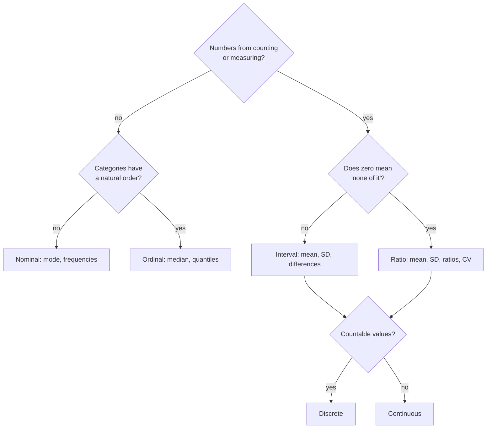

---
aliases:
  - Levels of Measurement
  - Scale of Measurement
  - Variable Type
  - Qualitative and Quantitative Data
  - Échelle de mesure
tags:
  - type/concept
  - domain/statistics
  - level/L1
  - level/L2
  - level/L3
mastery: 0
prerequisites:
  - "[[Exploratory Data Analysis]]"
related:
  - "[[Frequency Distribution]]"
  - "[[Measure of Central Tendency]]"
  - "[[Measure of Dispersion]]"
  - "[[Random Variable]]"
  - "[[Probability Distribution]]"
  - "[[Contingency Table]]"
  - "[[Rank Correlation]]"
  - "[[Data Transformation]]"
  - "[[Genotype]]"
  - "[[Count Matrix]]"
projects: []
sources:
  - "[[Introductory Statistics (OpenStax)]]"
  - "[[Modern Statistics for Modern Biology (Holmes)]]"
  - "[[Cock 2010 - The Sanger FASTQ File Format]]"
---

# Level of Measurement

> [!abstract]
> Before summarizing a variable, decide what kind of values it holds (unordered labels, ordered categories, counts or measurements), because that decides which summaries, plots and models mean anything.

## Definition

A **qualitative** (categorical) variable takes labels or categories; a **quantitative** variable takes numbers obtained by counting or measuring. Quantitative variables are **discrete** when their values can be counted (results of counting) and **continuous** when they can take any value in an interval (results of measuring).[^openstax] The **level of measurement** says how much arithmetic the values support, from least to most: **nominal**, **ordinal**, **interval**, **ratio**.[^openstax]

## Why it matters

- **Summaries.** A mean genotype or a mean tumor grade looks like a number and means nothing; the level of a variable tells which [[Measure of Central Tendency|center]] and [[Measure of Dispersion|spread]] are valid.
- **Models.** Read counts are discrete, with a variance tied to their mean, and are modeled with Poisson or negative binomial distributions rather than the normal distribution of continuous measurements ([[Poisson Distribution]], [[Overdispersion]]).[^holmes8]
- **Files.** Tables store categories as numbers (cluster 3, grade 2, genotype code 1). Knowing the level prevents averaging labels.

## Core (L1)

| Level | Values | Meaningful | Center | Bio example |
|---|---|---|---|---|
| Nominal | unordered categories | equal / different | mode | [[Genotype]] AA, Aa, aa; cell type; nucleotide |
| Ordinal | ordered categories | also less / greater | median, mode | tumor grade G1 < G2 < G3 |
| Interval | numbers, arbitrary zero | also differences | mean, median | temperature in °C; $\log_2$ expression |
| Ratio | numbers, true zero | also ratios | mean, median | read counts; TPM; length in bp |

Quantitative variables are also **discrete** or **continuous**: read counts take values 0, 1, 2, ...; an expression level or a concentration can take any value in an interval.



**Nominal summaries** are frequencies and the mode ([[Frequency Distribution]]); **ordinal** ones add the median and quantiles ([[Quantile]]); **interval** data support means and standard deviations; **ratio** data also support ratios such as fold changes and the coefficient of variation ([[Measure of Dispersion]]).

## Deeper (L2)

**Recodings that a level allows.** A level can be characterized by the recodings that keep all its information:

| Level | Allowed recoding $g$ | Example |
|---|---|---|
| Nominal | any one-to-one relabeling | AA, Aa, aa → 0, 1, 2 or → "x", "y", "z" |
| Ordinal | any strictly increasing $g$ | G1, G2, G3 → 1, 2, 3 or 1, 2, 10 |
| Interval | $g(x) = ax + b$, $a > 0$ | °C → °F |
| Ratio | $g(x) = ax$, $a > 0$ | bp → kb |

A statement is meaningful at a level if its truth survives every allowed recoding. "The median grade is G2" survives any increasing recoding; "the mean grade is 2" does not (Exercise 3).

**Codes and counts.** A genotype is nominal, but recoding it as the **dosage**, the number of copies of allele `a` (0, 1, 2), defines a new, discrete ratio variable. Its mean divided by 2 is the frequency of `a` in the sample ([[Allele Frequency]]): a meaningful mean, because dosage counts something.

**Logs change the level.** TPM is ratio-scale: 0 means no expression and 20 TPM is twice 10 TPM. $\log_2(\text{TPM})$ is interval-scale: its zero (1 TPM) is arbitrary, differences are log fold changes, and "twice the log expression" means nothing ([[Log Fold Change]], [[Data Transformation]]).

## Advanced (L3)

- **Level guides the model.** Nominal variables lead to tables of counts and chi-square tests ([[Contingency Table]], [[Chi-Square Test]]); ordinal ones to rank methods ([[Rank Correlation]], [[Wilcoxon Rank-Sum Test]]); counts to Poisson or negative binomial models whose variance depends on the mean;[^holmes8] continuous measurements to models such as the [[Normal Distribution]]. In probability terms: a discrete variable has a probability mass function, a continuous one a [[Probability Density Function]] ([[Random Variable]], [[Probability Distribution]]).
- **Discreteness can come from encoding.** A Phred base quality $Q = -10 \log_{10} p$ summarizes a continuous error probability $p$, but FASTQ files store it as an integer character code.[^cock] Rounding makes it discrete; it is not a count.
- **Compositions.** Relative abundances (fractions of reads per gene or per taxon) are ratio-scale but constrained to sum to 1, so one component rising forces the others to fall. Their correlations and changes need care, as the composition effect of [[Exploratory Data Analysis#Advanced (L3)]] shows.
- **Large counts as continuous.** Counts in the thousands are often analyzed on a log scale as if continuous; the approximation is reasonable only when counts are large, which is why low counts need count models.[^holmes8]

## Mathematical representation

A variable maps each unit $\omega$ of the sample to a value: $X : \Omega \to V$ ([[Random Variable]]). The level is the structure of $V$ that statements may use:

- **Nominal**: a set $V$ with equality only.
- **Ordinal**: a totally ordered set $(V, \le)$.
- **Interval**: $V \subseteq \mathbb{R}$, statements invariant under $x \mapsto ax + b$, $a > 0$.
- **Ratio**: $V \subseteq [0, \infty)$ with a true zero, statements invariant under $x \mapsto ax$, $a > 0$.
- **Discrete** if $V$ is countable; **continuous** if $V$ is an interval of $\mathbb{R}$.

**Median and monotone recodings.** For odd $n$ and strictly increasing $g$, $g$ keeps the order of $x_1, \dots, x_n$, so the middle value maps to the middle value: $\operatorname{median}(g(x_1), \dots, g(x_n)) = g(\operatorname{median}(x_1, \dots, x_n))$. The mean has this property only for affine $g$; for $g = \log_2(x + 1)$ the toy TPM values give 3.209 against 3.823 (code below).

## Computational representation

Store nominal values as strings, ordinal ones with an explicit order (a mapping to ranks or an `enum`), counts as `int`, measurements as `float`, and choose summaries by level:

```python
import math
import statistics

# Invented toy table: 7 tumor samples (not real patients).
genotype = ["AA", "Aa", "Aa", "aa", "AA", "Aa", "AA"]     # nominal
grade = ["G1", "G3", "G2", "G2", "G1", "G3", "G2"]        # ordinal: G1 < G2 < G3
reads = [0, 12, 7, 30, 5, 18, 9]                          # discrete counts (ratio scale)
tpm = [0.0, 14.2, 7.9, 35.0, 4.1, 21.6, 9.3]              # continuous expression (ratio scale)

LEVEL = {"genotype": "nominal", "grade": "ordinal", "reads": "discrete", "tpm": "continuous"}
ORDER = {"G1": 1, "G2": 2, "G3": 3}


def summarize(name: str, values: list) -> str:
    level = LEVEL[name]
    if level == "nominal":
        return f"mode={statistics.multimode(values)}"
    if level == "ordinal":
        ranked = sorted(values, key=ORDER.get)
        return f"median={ranked[(len(ranked) - 1) // 2]}, mode={statistics.multimode(values)}"
    return (f"mean={statistics.fmean(values):.2f}, median={statistics.median(values)}, "
            f"sd={statistics.stdev(values):.2f}")


for name, values in (("genotype", genotype), ("grade", grade), ("reads", reads), ("tpm", tpm)):
    print(f"{name:8} {LEVEL[name]:10} {summarize(name, values)}")

# Recoding a nominal genotype as a count of 'a' alleles gives a discrete variable.
dosage = [g.count("a") for g in genotype]
print(dosage, round(statistics.fmean(dosage) / 2, 3))

# A monotone transform commutes with the median (odd n), not with the mean.
log_tpm = [math.log2(x + 1) for x in tpm]
print(round(statistics.median(log_tpm), 3), round(math.log2(statistics.median(tpm) + 1), 3))
print(round(statistics.fmean(log_tpm), 3), round(math.log2(statistics.fmean(tpm) + 1), 3))
```

```text
genotype nominal    mode=['AA', 'Aa']
grade    ordinal    median=G2, mode=['G2']
reads    discrete   mean=11.57, median=9, sd=9.88
tpm      continuous mean=13.16, median=9.3, sd=11.88
[0, 1, 1, 2, 0, 1, 0] 0.357
3.365 3.365
3.209 3.823
```

`statistics.multimode` returns every most frequent value: here genotype has two modes. The ordinal median takes the lower middle element for even $n$, so it is always an existing category.

## Worked example

> [!example] Classifying a clinical sample sheet
> Columns (invented): `patient_id`, `sex`, `genotype`, `tumor_grade`, `age_years`, `gene_reads`, `gene_tpm`.
> 1. `patient_id`: nominal identifier. Never summarized; only used to join tables.
> 2. `sex`, `genotype`: nominal. Report counts and proportions per category ([[Frequency Distribution]]).
> 3. `tumor_grade`: ordinal. Report the distribution over grades and the median grade, not a mean.
> 4. `age_years`: ratio-scale and continuous in nature, discrete as recorded (whole years). Mean and SD are fine.
> 5. `gene_reads`: discrete ratio. Mean, median, and a count model for inference.
> 6. `gene_tpm`: continuous ratio. Explore on a log scale, where it becomes interval: compare by differences (log fold changes), not by ratios of logs.

## Common misconceptions

> [!warning] "If it is a number, it is quantitative"
> Patient IDs, genotype codes and cluster labels are numbers used as names. "Cluster 3" is not more than "cluster 1", and averaging codes gives a value that changes with the arbitrary coding: the toy genotypes average 0.714 with codes 0, 1, 2 and 2.0 with codes 1, 3, 2.

> [!warning] "Averaging an ordinal scale is harmless"
> The mean of grades assumes equal distances between G1, G2 and G3, which the scale does not guarantee. Changing the spacing changes the mean but not the median (Exercise 3).

> [!warning] "Counts are continuous once they are large enough"
> Large counts can be approximated on a log scale, but they stay discrete, and their variance depends on their mean; low counts in particular need count models.[^holmes8]

## Exercises

> [!question] Exercise 1 (L1)
> Give the level and, if quantitative, discrete or continuous: (a) the nucleotide at a position; (b) the number of reads mapped to a gene; (c) a melting temperature in °C; (d) the same temperature in kelvin; (e) tumor grade; (f) the GC fraction of a contig.

> [!success]- Solution
> (a) nominal; (b) ratio, discrete; (c) interval, continuous (0 °C is not "no heat"); (d) ratio, continuous (0 K is a true zero); (e) ordinal; (f) ratio, continuous ([[GC Content]]).

> [!question] Exercise 2 (L1)
> For each variable of Exercise 1, choose a measure of center.

> [!success]- Solution
> (a) mode; (b) median or mean (both valid; the median resists outliers); (c) and (d) mean or median; (e) median or mode; (f) mean or median.

> [!question] Exercise 3 (L2, Python)
> Code the toy grades `grade` of the code above first as G1, G2, G3 → 1, 2, 3, then as 1, 2, 10 (still increasing). Compute the mean and the median under both codings and conclude.

> [!success]- Solution
> ```python
> for code in ({"G1": 1, "G2": 2, "G3": 3}, {"G1": 1, "G2": 2, "G3": 10}):
>     values = [code[g] for g in grade]
>     print(statistics.fmean(values), statistics.median(values))
> ```
> Output: `2.0 2`, then `4.0 2`. The median is code 2 (grade G2) under both codings; the mean doubles. Only the median is a meaningful summary of an ordinal variable.

> [!question] Exercise 4 (L2)
> Show that the mean dosage divided by 2 equals the sample frequency of allele `a`, and check it on the toy genotypes.

> [!success]- Solution
> With $n$ diploid individuals, the sum of dosages is the number of `a` alleles among $2n$ allele copies, so $\frac{1}{2} \cdot \frac{1}{n}\sum_i d_i = \frac{\#a}{2n}$, the allele frequency. Toy data: dosages sum to 5 over $2 \times 7 = 14$ alleles, $5/14 \approx 0.357$, as printed.

> [!question] Exercise 5 (L3)
> Gene X has $\log_2$ TPM 4 in sample 1 and 2 in sample 2. A colleague says it is "twice as expressed" in sample 1. Correct the statement and explain which level makes ratios meaningful.

> [!success]- Solution
> $2^4 = 16$ TPM against $2^2 = 4$ TPM: a 4-fold difference. On the log scale only differences are meaningful (interval level): a difference of 2 means a $2^2$-fold change. Ratios are meaningful on the TPM scale itself (ratio level), where $16/4 = 4$.

## Mastery checklist

- [ ] 1 Recognized: I can name the four levels of measurement and the discrete/continuous distinction.
- [ ] 2 Understood: I can explain which summaries each level allows and why a mean of codes is meaningless.
- [ ] 3 Practiced: I can classify every column of a biological table and choose summaries in code.
- [ ] 4 Applied: I typed the columns of a real sample sheet and count matrix (categories, ordered categories, counts, measurements) before analysis.
- [ ] 5 Explained: I can teach how logs, dosage coding and encoding change the level of a variable, and how the level guides the model.

## References

[^openstax]: [[Introductory Statistics (OpenStax)]], 2nd ed., ch. 1 "Sampling and Data" (types of data, levels of measurement).
[^holmes8]: [[Modern Statistics for Modern Biology (Holmes)]], ch. 8 "High-Throughput Count Data".
[^cock]: [[Cock 2010 - The Sanger FASTQ File Format]], *Nucleic Acids Research*.
