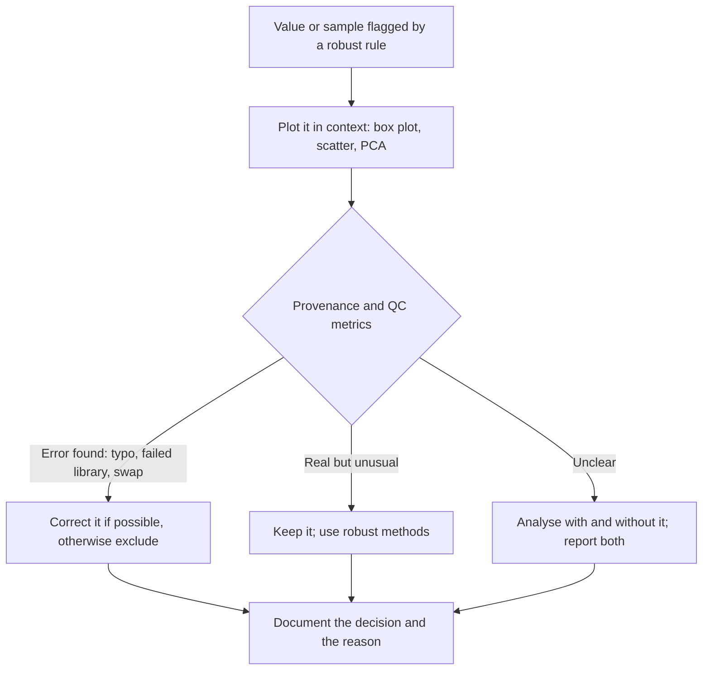

---
aliases:
  - Outlying Observation
  - Extreme Value
  - Anomaly
  - Valeur aberrante
tags:
  - type/concept
  - domain/statistics
  - domain/bioinformatics
  - level/L1
  - level/L2
  - level/L3
mastery: 0
prerequisites:
  - "[[Quantile]]"
  - "[[Measure of Dispersion]]"
  - "[[Standard Score]]"
  - "[[Box Plot]]"
related:
  - "[[Exploratory Data Analysis]]"
  - "[[Measure of Central Tendency]]"
  - "[[Correlation]]"
  - "[[Nonparametric Statistics]]"
  - "[[Principal Component Analysis]]"
  - "[[Mahalanobis Distance]]"
  - "[[Batch Effect]]"
  - "[[Read Quality Control]]"
  - "[[Single-Cell Quality Control]]"
projects: []
sources:
  - "[[Introductory Statistics (OpenStax)]]"
  - "[[HarvardX PH525x - Data Analysis for the Life Sciences]]"
  - "[[Experimental Design for Laboratory Biologists (Lazic)]]"
  - "[[Modern Statistics for Modern Biology (Holmes)]]"
  - "[[Leek 2010 - Tackling the Widespread and Critical Impact of Batch Effects]]"
  - "[[Python Documentation]]"
---

# Outlier

> [!abstract]
> An outlier is a value that does not fit the pattern of the rest of the data; finding it takes a robust rule and a plot, and deciding what to do with it takes an investigation, not a reflex deletion.

## Definition

An **outlier** is an observation that lies unusually far from the other values of a dataset, or off the pattern they follow. A common rule flags as potential outliers the values more than $1.5 \times \mathrm{IQR}$ below the first quartile or above the third quartile, which is how a [[Box Plot]] draws them. An outlier may be a recording or measurement error, or a genuine but unusual value: it should be investigated before any decision.[^os2]

## Why it matters

- **One bad library contaminates everything.** A failed RNA-seq library inflates the within-group variance of every gene, distorts normalization and can pull a principal component on its own. The standard check is a [[Principal Component Analysis]] or a sample correlation heatmap of transformed counts, where a library far from its group stands out.[^msmb]
- **Outliers can be systematic.** A group of samples apart from the rest may be a processing batch rather than an isolated failure; batch structure is found by the same exploratory plots.[^leek] See [[Batch Effect]].
- **Many summaries break.** The mean, the standard deviation and Pearson's [[Correlation]] are pulled by a single extreme value; the median, the median absolute deviation and rank-based methods are not.[^ph525] Quality-control thresholds on reads, cells or samples are therefore safer when built from robust summaries ([[Read Quality Control]], [[Single-Cell Quality Control]]).

## Core (L1)

**Three kinds of outlier.**

| Kind | Example | Usual decision |
|---|---|---|
| Error | typo in a sample sheet, a failed library, a swapped tube | correct it, or exclude it and say so |
| Rare but real | a gene expressed 1,000 times above the median, a patient who responds | keep it; it may be the finding |
| Different population | a contaminated sample, a different cell type, a different batch | analyse separately or model the factor |

**Rule 1: the 1.5 × IQR fences.** With quartiles $Q_1, Q_3$ and $\mathrm{IQR} = Q_3 - Q_1$ ([[Quantile]]), flag values outside $[Q_1 - 1.5\,\mathrm{IQR},\ Q_3 + 1.5\,\mathrm{IQR}]$.[^os2] Quartiles barely move when an extreme value is added, so the fences are robust.

**Rule 2: the robust z-score.** Replace the mean by the median and the standard deviation by the **median absolute deviation** (MAD), the median of $|x_i - \operatorname{median}(x)|$. Multiplied by 1.4826, the MAD estimates the standard deviation for normal data while resisting outliers.[^ph525] The robust z-score is $(x_i - \operatorname{median})/(1.4826\,\mathrm{MAD})$, and a value is flagged when its absolute value exceeds a threshold fixed in advance, such as 3 ([[Measure of Dispersion]]).

**Why not the ordinary z-score.** The mean and SD are computed **with** the outlier, which drags the mean towards it and inflates the SD, shrinking its own z-score (worked example). In small samples the 3-SD rule cannot fire at all (Exercise 3).

**What to do.** A flag is a question, not a verdict. Look at the data, check the sample's provenance and quality metrics, then decide, and report what was excluded and why. Data quality checks belong to the planned analysis, not to a search for a nicer result.[^lazic]



## Deeper (L2)

**Masking.** Several outliers inflate the SD together and hide each other: two failed libraries among ten have ordinary z-scores of only −1.85 and −1.89, while their robust z-scores are near −8 (Exercise 4). Removing outliers one at a time and recomputing does not fix this, and repeated trimming eats into real data, because each removal shrinks the spread and tightens the next fences.

**False alarms in clean data.** For normal data, $Q_3 = \mu + 0.674\sigma$, so the upper fence sits at $\mu + 2.698\sigma$: 0.70 % of perfectly normal values fall outside the fences, against 0.27 % beyond $\pm 3\sigma$. Over 20,000 genes, that is about 140 and 54 flags with nothing wrong. A rule applied to many variables needs the same care as [[Multiple Testing Correction]].

**Skewed data.** On raw counts, every highly expressed gene sits far above the upper fence. Rules that assume a roughly symmetric distribution should be applied after a [[Data Transformation]] such as $\log(x + 1)$, or replaced by distribution-aware models.

**Outliers in two dimensions.** In a [[Scatter Plot]], a point can be ordinary on each axis and still far from the trend. In regression, such points have large residuals; a point whose removal changes the fitted line substantially is **influential**.[^os12] Each Anscombe dataset shows a different case ([[Correlation]]).

## Advanced (L3)

**An outlier library in a PCA of RNA-seq samples.** A standard sample-level check:[^msmb][^leek]

1. Transform the count matrix (log or [[Variance-Stabilizing Transformation]]) so that a few highly expressed genes do not dominate.
2. Run [[Principal Component Analysis]] on the most variable genes and plot PC1 against PC2, colored by condition and again by batch, processing date or sequencing lane.
3. A library far from its biological group is a candidate outlier. Because PCA maximizes variance, a single extreme library can define PC1 by itself, hiding the structure of the rest.
4. Confirm with a second view: its median [[Correlation]] with the other libraries, compared with the others' through a robust z-score (Exercise 5).
5. Investigate before deciding: library size, mapping rate, sample sheet, lab notes. A swap is corrected; a failed library is excluded and reported; a biologically distinct sample is kept and explained.

**Multivariate distances.** Outlyingness across many correlated variables is measured by the [[Mahalanobis Distance]], which accounts for the covariance between variables. Its classical version uses a mean and covariance matrix that outliers also distort, which motivates robust estimates of both.

**Down-weighting instead of deleting.** Rank-based tests and correlations ([[Nonparametric Statistics]], [[Rank Correlation]]) limit the influence of any single value without discarding it.[^ph525]

## Mathematical representation

For data $x_1, \dots, x_n$ with quartiles $Q_1, Q_3$ and $\mathrm{IQR} = Q_3 - Q_1$:

- **Fences**: $x_i$ is flagged if $x_i < Q_1 - k\,\mathrm{IQR}$ or $x_i > Q_3 + k\,\mathrm{IQR}$, with $k = 1.5$ by convention.[^os2]
- **MAD**: $\mathrm{MAD} = \operatorname{median}_i |x_i - \tilde x|$ with $\tilde x$ the median. For normal data the MAD estimates $0.6745\,\sigma$ (the upper quartile of $|Z|$), so $1.4826\,\mathrm{MAD} \approx \sigma$, since $1/0.6745 \approx 1.4826$.[^ph525]
- **Robust z-score**: $z_i^{\mathrm{rob}} = (x_i - \tilde x)/(1.4826\,\mathrm{MAD})$.
- **Bound on the ordinary z-score**: with $s$ the sample SD (denominator $n - 1$), $|z_i| \le (n-1)/\sqrt{n}$ for every $i$ (proof in Exercise 3). For $n \le 10$ the bound is below 3.
- **Breakdown**: moving a single value to infinity sends the mean and the SD to infinity, whereas the median and the MAD stay bounded until about half of the values are moved.

## Computational representation

`statistics.quantiles` offers two quartile definitions, `"exclusive"` (default) and `"inclusive"` (linear interpolation between order statistics, used below); state the method because fences depend on it ([[Quantile]]).[^pydoc]

```python
import math
import statistics


def tukey_fences(values, k=1.5):
    """Lower and upper fences Q1 - k*IQR and Q3 + k*IQR (linear-interpolation quartiles)."""
    q1, _, q3 = statistics.quantiles(values, n=4, method="inclusive")
    iqr = q3 - q1
    return q1 - k * iqr, q3 + k * iqr


def z_scores(values):
    m, s = statistics.mean(values), statistics.stdev(values)
    return [(v - m) / s for v in values]


def robust_z(values):
    """(x - median) / (1.4826 * MAD): close to the z-score for normal data, but not pulled by outliers."""
    med = statistics.median(values)
    mad = statistics.median([abs(v - med) for v in values])
    return [(v - med) / (1.4826 * mad) for v in values]


libs = {"S1": 21.3, "S2": 19.8, "S3": 22.6, "S4": 20.4,   # invented library sizes,
        "S5": 18.9, "S6": 23.1, "S7": 4.2, "S8": 20.9}    # millions of reads
v = list(libs.values())
lo, hi = tukey_fences(v)
print("fences", round(lo, 2), round(hi, 2), [s for s, x in libs.items() if not lo <= x <= hi])
print("z      ", [round(z, 2) for z in z_scores(v)])
print("robust z", [round(z, 2) for z in robust_z(v)])
print("max |z| possible for n = 8:", round(7 / math.sqrt(8), 3))
```

```text
fences 16.5 24.7 ['S7']
z       [0.39, 0.15, 0.61, 0.25, 0.0, 0.69, -2.41, 0.33]
robust z [0.34, -0.44, 1.01, -0.13, -0.91, 1.27, -8.53, 0.13]
max |z| possible for n = 8: 2.475
```

A MAD of 0 (more than half the values identical) makes the robust z-score undefined; guard against it in production code.

## Worked example

> [!example] A failed library among eight (invented library sizes, millions of reads)
> Values: 21.3, 19.8, 22.6, 20.4, 18.9, 23.1, **4.2**, 20.9.
> 1. **Quartiles** (inclusive method): sorted values 4.2, 18.9, 19.8, 20.4, 20.9, 21.3, 22.6, 23.1. $Q_1$ sits at position $0.25 \times 7 = 1.75$: $18.9 + 0.75 \times 0.9 = 19.575$. $Q_3$ at position 5.25: $21.3 + 0.25 \times 1.3 = 21.625$. $\mathrm{IQR} = 2.05$.
> 2. **Fences**: $19.575 - 3.075 = 16.5$ and $21.625 + 3.075 = 24.7$. Library S7 (4.2) is flagged.
> 3. **Ordinary z-score**: mean 18.9, SD 6.10 (both dragged by S7), so $z_{S7} = -2.41$: missed by the 3-SD rule, and it could never exceed $7/\sqrt 8 \approx 2.47$.
> 4. **Robust z-score**: median 20.65; absolute deviations sorted 0.25, 0.25, 0.65, 0.85, 1.75, 1.95, 2.45, 16.45, so MAD = 1.3 and $z^{\mathrm{rob}}_{S7} = -16.45/(1.4826 \times 1.3) = -8.53$.
> 5. **Decision**: a library with a fifth of the expected reads suggests a failed preparation. Check the lab record and its other metrics (mapping rate, duplication); if confirmed, exclude it and report the exclusion. Do not exclude it merely because a rule flagged it.

## Common misconceptions

> [!warning] "Outliers are errors and should be removed"
> Some are; many are the most interesting values in the dataset (a strongly induced gene, an exceptional responder). Exclusion needs a documented reason, such as a failed quality metric or a recorded mistake.[^os2][^lazic]

> [!warning] "Flag everything beyond 3 standard deviations"
> The outlier inflates the SD used to judge it, several outliers mask each other, and with $n \le 10$ no value can reach $|z| = 3$. Use the median and MAD, or the IQR fences.

> [!warning] "A point that is normal on every axis cannot be an outlier"
> A library can have ordinary values for each gene taken alone and still sit far from its group in a PCA, because its combination of values is unusual. Multivariate outliers need multivariate views ([[Principal Component Analysis]], [[Mahalanobis Distance]]).

## Exercises

> [!question] Exercise 1 (L1)
> Invented read lengths from a 150-cycle run: 148, 150, 151, 149, 150, 150, 35, 151, 150, 152, 149, 150. Compute the inclusive quartiles and the 1.5 × IQR fences by hand. Which reads are flagged, and what might a 35-base read be?

> [!success]- Solution
> Sorted: 35, 148, 149, 149, 150, 150, 150, 150, 150, 151, 151, 152 ($n = 12$). $Q_1$ at position $0.25 \times 11 = 2.75$: between 149 and 149, so 149. $Q_3$ at position 8.25: $150 + 0.25 \times 1 = 150.25$. $\mathrm{IQR} = 1.25$, fences $149 - 1.875 = 147.125$ and $150.25 + 1.875 = 152.125$. Only 35 is flagged (`tukey_fences` gives the same). A short read is expected after adapter or quality trimming: it is a real observation about the library, to be handled by [[Read Quality Control]], not a typo.

> [!question] Exercise 2 (L1)
> Classify each case (error, rare but real, different population) and say what you would do: (a) a sample whose recorded age is 450 years; (b) one gene with 10⁶ reads in a liver library, far above all others; (c) in a PCA, three samples processed on the same day sit apart from all others.

> [!success]- Solution
> (a) Error: correct from the source record or set to missing, and report it. (b) Plausibly real if the gene is known to be highly expressed in liver (check its annotation and other liver datasets); keep it and use log-scale or robust summaries. (c) Possibly a batch: color by processing date and condition; if it is a batch, model it rather than delete three samples ([[Batch Effect]]).[^leek]

> [!question] Exercise 3 (L2)
> Prove that $|z_i| \le (n-1)/\sqrt n$ for the ordinary z-score, and find when equality holds. For which $n$ can the rule $|z| > 3$ never flag anything?

> [!success]- Solution
> Center the data so that $\bar x = 0$ and take $i = 1$. Then $\sum_{j \ge 2} x_j = -x_1$, and by Cauchy-Schwarz $\sum_{j \ge 2} x_j^2 \ge x_1^2/(n-1)$. So $(n-1)s^2 = \sum_j x_j^2 \ge x_1^2 \left(1 + \tfrac{1}{n-1}\right) = x_1^2 \tfrac{n}{n-1}$, which gives $z_1^2 = x_1^2/s^2 \le (n-1)^2/n$. Equality holds when the other $n - 1$ values are all equal. The bound is $1.789$ for $n = 5$, $2.846$ for $n = 10$ and $3.015$ for $n = 11$: with 10 or fewer values, $|z| > 3$ is impossible. Check: `z_scores([0.0] * 9 + [1000.0])` has maximum 2.846.

> [!question] Exercise 4 (L2, Python)
> Add a second failed library (3.9) and one more good one (21.7) to the worked example. Compare the ordinary and robust z-scores of the two failed libraries.

> [!success]- Solution
> ```python
> two = [21.3, 19.8, 22.6, 20.4, 18.9, 23.1, 4.2, 20.9, 3.9, 21.7]
> print([round(z, 2) for z in z_scores(two)])
> # [0.5, 0.29, 0.67, 0.37, 0.17, 0.74, -1.85, 0.44, -1.89, 0.55]
> print([round(z, 2) for z in robust_z(two)])
> # [0.31, -0.41, 0.94, -0.12, -0.84, 1.18, -7.93, 0.12, -8.07, 0.51]
> ```
> Together, the two failures pull the mean down and inflate the SD so much that neither passes even $|z| > 2$ (masking). The median and MAD ignore them, and both robust z-scores are near −8.

> [!question] Exercise 5 (L3, Python)
> Simulate six invented libraries (A1-A3, B1-B3) over 2,000 genes, where condition B shifts some genes by ±1.5 on the log2 scale and library B2 is degraded (noise SD 1.2 instead of 0.3). For each library, compute its median correlation with the five others, then the ordinary and robust z-scores of these medians. Which library is flagged?

> [!success]- Solution
> ```python
> import random
> rng = random.Random(3)
> G, samples = 2000, ["A1", "A2", "A3", "B1", "B2", "B3"]
> base = [rng.uniform(0, 12) for _ in range(G)]                       # invented log2 expression
> effect = [rng.choice((-1.5, 0, 0, 0, 1.5)) for _ in range(G)]       # condition B shifts some genes
> logexpr = {}
> for s in samples:
>     noise = 1.2 if s == "B2" else 0.3                               # B2: a degraded library (invented)
>     shift = [e if s.startswith("B") else 0 for e in effect]
>     logexpr[s] = [b + d + rng.gauss(0, noise) for b, d in zip(base, shift)]
>
>
> def pearson(x, y):
>     mx, my = statistics.mean(x), statistics.mean(y)
>     sxy = sum((a - mx) * (b - my) for a, b in zip(x, y))
>     return sxy / math.sqrt(sum((a - mx) ** 2 for a in x) * sum((b - my) ** 2 for b in y))
>
>
> med_r = {s: statistics.median(pearson(logexpr[s], logexpr[t]) for t in samples if t != s) for s in samples}
> z = dict(zip(samples, z_scores(list(med_r.values()))))
> rz = dict(zip(samples, robust_z(list(med_r.values()))))
> for s in samples:
>     print(s, round(med_r[s], 3), round(z[s], 2), round(rz[s], 1), "FLAG" if rz[s] < -3 else "")
> ```
> ```text
> A1 0.959 0.39 -0.6
> A2 0.959 0.42 0.6
> A3 0.959 0.43 0.7
> B1 0.958 0.38 -1.3
> B2 0.908 -2.04 -100.9 FLAG
> B3 0.959 0.42 0.6
> ```
> B2 correlates less with everyone (0.908 against about 0.959). Its ordinary z-score is −2.04, essentially the largest possible with six values ($5/\sqrt 6 \approx 2.04$), so the 3-SD rule cannot flag it. The robust z-score is enormous because the five good libraries agree so closely that the MAD is tiny: the flag is clear, but the size of $z^{\mathrm{rob}}$ is not meaningful, which is why the plot (PCA, correlation heatmap) is looked at before deciding. Note also that condition B barely lowers correlations: the condition effect is small relative to the spread of expression across genes ([[Correlation]]).

## Mastery checklist

- [ ] 1 Recognized: I can define an outlier and name the 1.5 × IQR fences and the robust z-score.
- [ ] 2 Understood: I can explain why the ordinary z-score fails (inflated SD, masking, small $n$) and why an outlier is a question, not a verdict.
- [ ] 3 Practiced: I can compute fences, MAD and robust z-scores by hand and in Python, and prove the $(n-1)/\sqrt n$ bound.
- [ ] 4 Applied: on a public RNA-seq dataset, I ran a PCA and a sample correlation check on transformed counts, found the least typical library, and justified keeping or excluding it.
- [ ] 5 Explained: I can teach masking, false-alarm rates over thousands of variables, the role of transformations, and multivariate outliers.

## References

[^os2]: [[Introductory Statistics (OpenStax)]], 2nd ed., ch. 2 "Descriptive Statistics" (quartiles, box plots and outliers).
[^os12]: [[Introductory Statistics (OpenStax)]], 2nd ed., chapter on linear regression and correlation (outliers and influential points).
[^ph525]: [[HarvardX PH525x - Data Analysis for the Life Sciences]], PH525.1x, robust statistics (median, median absolute deviation, rank-based methods).
[^lazic]: [[Experimental Design for Laboratory Biologists (Lazic)]], data exploration and quality checks.
[^msmb]: [[Modern Statistics for Modern Biology (Holmes)]], high-throughput count data (transformations and sample-level quality assessment).
[^leek]: [[Leek 2010 - Tackling the Widespread and Critical Impact of Batch Effects]], *Nature Reviews Genetics* 11(10):733-739.
[^pydoc]: [[Python Documentation]], Library Reference, `statistics` module.
