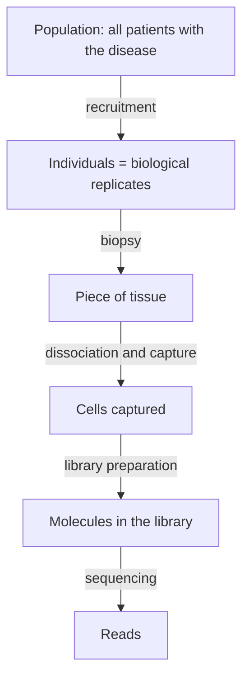

---
aliases:
  - Statistical Sampling
  - Population and Sample
  - Random Sample
  - Échantillonnage
tags:
  - type/concept
  - domain/statistics
  - domain/scientific-practice
  - domain/bioinformatics
  - level/L1
  - level/L2
  - level/L3
mastery: 0
prerequisites:
  - "[[Probability]]"
  - "[[Binomial Coefficient]]"
related:
  - "[[Sampling Distribution]]"
  - "[[Exploratory Data Analysis]]"
  - "[[Biological Replicate]]"
  - "[[Technical Replicate]]"
  - "[[Pseudoreplication]]"
  - "[[Experimental Unit]]"
  - "[[Selection Bias]]"
  - "[[Experimental Design]]"
  - "[[Genetic Drift]]"
  - "[[Single-Cell RNA Sequencing]]"
projects:
  - "[[07-evolution-simulator]]"
sources:
  - "[[Introductory Statistics (OpenStax)]]"
  - "[[Experimental Design for Laboratory Biologists (Lazic)]]"
  - "[[Modern Statistics for Modern Biology (Holmes)]]"
  - "[[Popejoy 2016 - Genomics Is Failing on Diversity]]"
  - "[[Principles of Population Genetics (Hartl)]]"
---

# Sampling

> [!abstract]
> A sample is the part of a population that you actually observe; how it was drawn decides whether its summaries say anything about the whole.

## Definition

A **population** is the whole collection of individuals or objects about which information is wanted; a **sample** is the subset actually studied. A **parameter** is a number describing the population; a **statistic** is a number computed from the sample, used to estimate the parameter.[^openstax] **Sampling** is the procedure that selects the sample. In a **simple random sample** of size $n$, every group of $n$ members has the same chance of being selected.[^openstax]

## Why it matters

- **Cells and reads are samples.** A single-cell experiment sequences a sample of the cells of a tissue, and the reads of a library are a random sample of its molecules, which adds sampling noise to every count.[^holmes8]
- **Cohorts are samples.** In 2016 about 81 % of participants in genome-wide association studies were of European ancestry; findings from such a sample transfer poorly to other populations.[^popejoy]
- **Replicates define $n$.** Conclusions about biology need independent biological units; repeated measurements of one sample do not add to $n$ ([[Biological Replicate]], [[Pseudoreplication]]).[^lazic]
- **Every summary of this domain is a statistic.** [[Measure of Central Tendency|Means]], [[Measure of Dispersion|standard deviations]] and frequencies describe a sample; how they vary from sample to sample is the subject of [[Sampling Distribution]].

## Core (L1)

| Question | Population | Sample | Parameter | Statistic |
|---|---|---|---|---|
| Fraction of T cells in a tumor | all cells of the tumor | cells captured and sequenced | true fraction $\pi$ | observed fraction $\hat p$ |
| Allele frequency in a species | all individuals of the species | genotyped individuals | $p$ | $\hat p$ |
| Mean expression of a gene in a condition | all animals that could receive the condition | the replicate animals | $\mu$ | $\bar x$ |

Notation keeps the distinction visible: Greek letters for parameters ($\mu$, $\sigma$, $\pi$), Latin letters or hats for statistics ($\bar x$, $s$, $\hat p$). The parameters of a model are defined in [[Expected Value]] and [[Variance]]; this domain computes the statistics.

**Ways to sample.**[^openstax]

- **Simple random**: a chance mechanism gives every group of size $n$ the same probability.
- **Stratified**: divide the population into groups (strata) and draw a random sample within each.
- **Cluster**: divide into groups, pick some groups at random and take all their members.
- **Systematic**: take every $k$-th member of a list from a random start.
- **Convenience**: take what is easy to reach. It is not random.

**Two kinds of error.** **Sampling error** is the chance difference between a statistic and its parameter; it shrinks as $n$ grows. **Sampling bias** arises when some members of the population are less likely to be chosen than others; it does not shrink with $n$.[^openstax]

**Biological and technical replicates.** Biological replicates are independent biological units (animals, patients, independently grown cultures) and capture biological variability. Technical replicates are repeated measurements of one biological sample (same RNA prepared twice, same library sequenced on two lanes) and capture only measurement noise.[^lazic]



Each arrow is a sampling step: a bias at any step propagates to every statistic computed from the reads.

## Deeper (L2)

- **Error shrinks like $1/\sqrt{n}$.** The standard deviation of a sample proportion is about $\sqrt{p(1-p)/n}$ ([[Binomial Distribution]]): 0.046 for $p = 0.3$ and $n = 100$, half that for $n = 400$. The simulation below shows it, and shows that a biased capture stays biased at every $n$.
- **Stratify on known heterogeneity.** If sites, batches or ancestries differ, sampling within each guarantees that all are represented and lets their differences be estimated ([[Randomized Block Design]]).
- **Which variance does a replicate measure?** Resequencing a library adds only Poisson sampling noise; independent biological samples also differ in their true expression, which adds variance growing with the square of the mean ([[Overdispersion]]).[^holmes8] Technical replicates therefore underestimate the variability that a biological conclusion must overcome, and the true $n$ is the number of independent units ([[Experimental Unit]]).[^lazic]
- **Sampling a large part of a finite population** leaves less room for chance: drawing 5,000 of 10,000 cells without replacement varies less than the binomial formula predicts, and drawing all 10,000 would give the parameter exactly.

## Advanced (L3)

- **Ascertainment.** Who enters a cohort depends on how participants were found: hospital recruitment, existing biobanks, ancestry. In 2016, people of African, Latin American and indigenous ancestry together made up less than 4 % of genome-wide association study participants; allele frequencies, effect sizes and linkage patterns differ between populations, so results built on one ancestry transfer poorly ([[Genome-Wide Association Study]], [[Selection Bias]]).[^popejoy]
- **Unequal capture in single-cell data.** If one cell type is captured with lower probability than others (in the toy simulation, half as often), the observed proportions are biased, and sequencing more cells only makes the wrong answer more precise. Known capture probabilities can be undone by weighting (Mathematical representation); unknown ones cannot ([[Single-Cell RNA Sequencing]]).
- **Filters are sampling rules.** Every quality-control threshold (minimum reads per cell, minimum detected genes) redefines the population that the results describe; report it with the results.
- **Drift is sampling.** In a finite population, each generation's gene pool is a random sample of the previous one's gametes, so allele frequencies fluctuate by chance, more strongly in small populations ([[Genetic Drift]], simulated in [[07-evolution-simulator]]).[^hartl]

## Mathematical representation

- Population $U = \{1, \dots, N\}$ with values $x_1, \dots, x_N$; parameter $\mu = \frac{1}{N}\sum_{u=1}^{N} x_u$.
- Sample $S \subset U$ of size $n$; statistic $\bar x_S = \frac{1}{n}\sum_{u \in S} x_u$.
- **Simple random sampling without replacement**: $P(S) = 1/\binom{N}{n}$ for every $S$ with $|S| = n$ ([[Binomial Coefficient]]). Each unit is then included with probability $n/N$, so $E[\bar x_S] = \frac{1}{n}\sum_{u} x_u \frac{n}{N} = \mu$: the sample mean is unbiased.
- **Unequal inclusion.** If a unit of type $k$ is kept with probability $\pi_k$, the expected observed fraction of type $B$ is $\dfrac{\pi_B N_B}{\pi_B N_B + \pi_O N_O}$. With $N_B/N = 0.3$, $\pi_B = 0.5$, $\pi_O = 1$: $\frac{0.15}{0.15 + 0.7} \approx 0.176$ instead of 0.3.
- **Inverse-probability weighting.** Counting each kept unit as $1/\pi_k$ units gives expected weighted counts $\pi_k N_k / \pi_k = N_k$ (up to a common factor), so the weighted fraction estimates the population fraction.

## Computational representation

`random.sample` draws a simple random sample without replacement; a biased sampler keeps each candidate with a type-dependent probability:

```python
import random
import statistics

rng = random.Random(42)
# Invented toy tissue: 10,000 cells, 3,000 of them of type "B" (true fraction 0.30).
tissue = ["B"] * 3_000 + ["other"] * 7_000
CAPTURE = {"B": 0.5, "other": 1.0}   # invented: B cells survive dissociation half as often


def fraction_b(cells: list[str]) -> float:
    return cells.count("B") / len(cells)


def random_sample(n: int) -> list[str]:
    """Simple random sample without replacement: every subset of size n equally likely."""
    return rng.sample(tissue, n)


def biased_sample(n: int) -> list[str]:
    """Draw cells until n are captured; a cell is kept with probability CAPTURE[type]."""
    kept = []
    while len(kept) < n:
        cell = rng.choice(tissue)
        if rng.random() < CAPTURE[cell]:
            kept.append(cell)
    return kept


def weighted_fraction_b(cells: list[str]) -> float:
    """Inverse-probability weighting: each captured cell counts 1 / P(capture)."""
    w_b = cells.count("B") / CAPTURE["B"]
    w_other = cells.count("other") / CAPTURE["other"]
    return w_b / (w_b + w_other)


for name, draw in (("random", random_sample), ("biased", biased_sample)):
    for n in (100, 1_000, 5_000):
        est = [fraction_b(draw(n)) for _ in range(200)]
        print(f"{name:6} n={n:5}  mean={statistics.fmean(est):.3f}  sd={statistics.stdev(est):.3f}")

est = [weighted_fraction_b(biased_sample(1_000)) for _ in range(200)]
print(f"weighted n= 1000  mean={statistics.fmean(est):.3f}  sd={statistics.stdev(est):.3f}")
```

```text
random n=  100  mean=0.304  sd=0.050
random n= 1000  mean=0.300  sd=0.014
random n= 5000  mean=0.300  sd=0.004
biased n=  100  mean=0.176  sd=0.037
biased n= 1000  mean=0.176  sd=0.012
biased n= 5000  mean=0.177  sd=0.005
weighted n= 1000  mean=0.300  sd=0.017
```

Each line summarizes 200 repeated samples: the mean shows bias, the standard deviation shows sampling error.

## Worked example

> [!example] Counting the real $n$ of an RNA-seq design
> Design (invented): 3 mice per condition, RNA extracted once per mouse, each library sequenced on 2 lanes.
> 1. **Biological replicates**: 3 per condition (the mice are the independently treated units).
> 2. **Technical replicates**: 2 lanes per library; they measure the same molecules twice.
> 3. **Measurements**: $2 \times 3 \times 2 = 12$ lane-level count vectors.
> 4. **Analysis**: sum the two lanes of each library (they are one sample sequenced deeper) and compare 3 against 3. Treating lanes as 6 against 6 would be [[Pseudoreplication]]: it counts measurement noise as if it were biological variation.
> 5. **Population**: the conclusion generalizes to mice like these (strain, sex, age, housing), not to "mice" in general.

## Common misconceptions

> [!warning] "A bigger sample removes bias"
> More data shrink sampling error, not bias. In the simulation, the biased capture estimates 0.176 at $n = 100$ and at $n = 5{,}000$; only the precision of the wrong answer improves.

> [!warning] "Technical replicates increase the sample size"
> They measure one biological sample repeatedly, so they inform about assay noise, not about variation between individuals.[^lazic]

> [!warning] "Random means haphazard"
> "The patients who came to our clinic" or "the cells that dissociated easily" are convenience samples. Random sampling needs a chance mechanism with known selection probabilities.

> [!warning] "The statistic is the parameter"
> $\bar x$ estimates $\mu$ and differs from it by sampling error (and possibly bias). Writing $\mu$ for a sample mean hides the uncertainty that [[Statistical Inference]] quantifies.

## Exercises

> [!question] Exercise 1 (L1)
> To estimate the frequency of a variant allele in a fish species, researchers genotype 200 fish caught in one lake and find the variant on 46 of 400 chromosomes. Identify the population, the sample, the parameter and the statistic. To which population does the result really apply?

> [!success]- Solution
> Intended population: all fish of the species; sample: the 200 genotyped fish; parameter: the allele frequency $p$ in the species; statistic: $\hat p = 46/400 = 0.115$ ([[Allele Frequency]]). Since all fish come from one lake, the sample represents that lake at best: other lakes may differ, so the claim should be restricted to the lake.

> [!question] Exercise 2 (L1)
> Name the sampling method: (a) every 10th tube of a freezer box from a random start; (b) 5 random patients from each of 4 hospitals; (c) the first 50 volunteers; (d) 3 hospitals chosen at random, all their patients included.

> [!success]- Solution
> (a) systematic, (b) stratified, (c) convenience (not random), (d) cluster.

> [!question] Exercise 3 (L2)
> Four patients each give a tumor and a matched normal biopsy; each of the 8 libraries is sequenced twice. How many biological units, technical replicates and measurements are there, and what is $n$ for a tumor-versus-normal comparison?

> [!success]- Solution
> 4 patients (biological units), 2 sequencing runs per library (technical), $4 \times 2 \times 2 = 16$ measurements. The comparison is paired within patients ([[Paired Design]]), so $n = 4$ pairs, not 8 samples and not 16 runs.

> [!question] Exercise 4 (L2, Python)
> Compute $\sqrt{p(1-p)/n}$ for $p = 0.3$ and $n = 100, 1000, 5000$ and compare with the standard deviations of the random sampler above. Explain the difference at $n = 5000$.

> [!success]- Solution
> ```python
> for n in (100, 1_000, 5_000):
>     print(n, round((0.3 * 0.7 / n) ** 0.5, 3))
> ```
> Output: `100 0.046`, `1000 0.014`, `5000 0.006`. The simulation gave 0.050, 0.014 and 0.004. The first two agree within simulation noise (200 repetitions). At $n = 5000$ the sampler draws half of a finite population without replacement: the sample overlaps heavily with the population, so it varies less than independent draws would.

> [!question] Exercise 5 (L3)
> In the biased capture of the code, 176 B cells and 824 other cells are captured. Derive the expected observed fraction from $\pi_B = 0.5$, $\pi_O = 1$ and the true fraction 0.3, then correct the observed counts by inverse-probability weighting.

> [!success]- Solution
> Expected observed fraction: $\frac{0.3 \times 0.5}{0.3 \times 0.5 + 0.7 \times 1} = \frac{0.15}{0.85} \approx 0.176$. Weighting: $176/0.5 = 352$ and $824/1 = 824$, so the corrected fraction is $352/1176 \approx 0.299$, close to 0.3. The correction needs the capture probabilities, which real experiments rarely know: preventing the bias by design is better than correcting it.

## Mastery checklist

- [ ] 1 Recognized: I can define population, sample, parameter and statistic, and name the five sampling methods.
- [ ] 2 Understood: I can explain why sampling error shrinks with $n$ while bias does not, and why technical replicates do not increase $n$.
- [ ] 3 Practiced: I can simulate random and biased sampling in Python and correct a known bias by weighting.
- [ ] 4 Applied: I identified the experimental units and the sampled population of a real dataset (cohort, single-cell experiment) and simulated sampling drift in [[07-evolution-simulator]].
- [ ] 5 Explained: I can teach how ascertainment, capture and filtering bias a genomic study, with the nested sampling steps from population to reads.

## References

[^openstax]: [[Introductory Statistics (OpenStax)]], 2nd ed., ch. 1 "Sampling and Data".
[^lazic]: [[Experimental Design for Laboratory Biologists (Lazic)]], material on experimental units, biological and technical replication, and pseudoreplication.
[^holmes8]: [[Modern Statistics for Modern Biology (Holmes)]], ch. 8 "High-Throughput Count Data" (sampling noise of read counts, variation between biological replicates).
[^popejoy]: [[Popejoy 2016 - Genomics Is Failing on Diversity]], *Nature* 538:161-164.
[^hartl]: [[Principles of Population Genetics (Hartl)]], treatment of random genetic drift.
