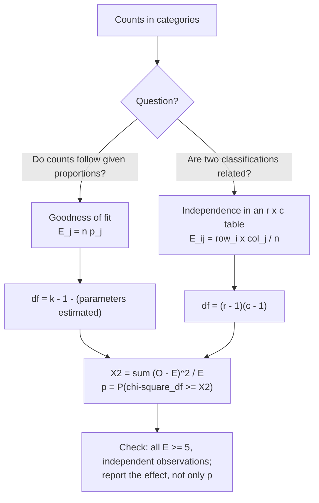

---
aliases:
  - Pearson's Chi-Square Test
  - Chi-Squared Test
  - χ² Test
  - Goodness-of-Fit Test
  - Goodness of Fit
  - Test of Independence
  - Allelic Association Test
  - Test du khi-deux
tags:
  - type/concept
  - domain/statistics
  - domain/bioinformatics
  - level/L1
  - level/L2
  - level/L3
mastery: 0
prerequisites:
  - "[[Hypothesis Testing]]"
  - "[[P-Value]]"
  - "[[Chi-Square Distribution]]"
  - "[[Contingency Table]]"
related:
  - "[[Mendelian Inheritance]]"
  - "[[Hardy-Weinberg Equilibrium]]"
  - "[[Genome-Wide Association Study]]"
  - "[[Fisher's Exact Test]]"
  - "[[Likelihood Ratio Test]]"
  - "[[Effect Size]]"
  - "[[Population Stratification]]"
projects: []
sources:
  - "[[Introductory Statistics (OpenStax)]]"
  - "[[MIT 18.05 - Introduction to Probability and Statistics]]"
  - "[[MIT 18.650 - Statistics for Applications]]"
  - "[[Principles of Population Genetics (Hartl)]]"
---

# Chi-Square Test

> [!abstract]
> The chi-square test compares observed counts with the counts a model predicts, adding up squared differences scaled by the predictions; a total too large for chance says the model, such as Hardy-Weinberg proportions or "allele frequency unrelated to disease", does not fit.

## Definition

**Pearson's chi-square test** compares observed counts $O_j$ in categories with expected counts $E_j$ computed under a null hypothesis, through the statistic

$$X^2 = \sum_j \frac{(O_j - E_j)^2}{E_j},$$

which approximately follows a [[Chi-Square Distribution]] under $H_0$ when expected counts are large enough. In a **goodness-of-fit** test, $H_0$ specifies the category probabilities, with $k - 1 - m$ degrees of freedom for $k$ categories and $m$ parameters estimated from the data; in a **test of independence**, $H_0$ states that the row and column variables of an $r \times c$ [[Contingency Table]] are independent, with $(r-1)(c-1)$ degrees of freedom.[^os11][^18650][^1805]

## Why it matters

- **Genotype quality control.** Genotype counts at a site are compared with [[Hardy-Weinberg Equilibrium]] proportions; strong departures flag genotyping problems or population structure ([[Genotype]]).[^hartl]
- **Association studies.** At each variant, a case-control study compares allele (or genotype) counts between cases and controls with a test of independence, millions of times in a [[Genome-Wide Association Study]].
- **Genetics and annotation.** Mendelian segregation ratios ([[Mendelian Inheritance]]), codon or k-mer composition against a background, overlap of a gene list with an annotation category: all are counts against expectations.
- **One statistic, many tests.** The same $\sum (O - E)^2/E$ serves goodness of fit, independence and homogeneity; only the expected counts and degrees of freedom change.[^os11]

## Core (L1)

### The procedure



### Goodness of fit

$H_0$ gives the probabilities $p_1, \dots, p_k$ of the categories; the expected counts are $E_j = n p_j$. Large $X^2$ means the observed proportions are farther from the model than sampling noise allows.[^os11] When the probabilities are fully specified, as in Mendel's 3:1 ratio, $\nu = k - 1$ (worked for Mendel's peas in [[Mendelian Inheritance#Core (L1)]]).

### Bio: departure from Hardy-Weinberg proportions

Under random mating and no selection, migration or drift, genotype frequencies at a biallelic locus are $p^2$, $2pq$, $q^2$, with $p$ the allele frequency and $q = 1 - p$.[^hartl] Two invented samples of 1,000 people:

| Sample | AA | Aa | aa | $\hat p_A$ | Expected AA, Aa, aa | $X^2$ (1 df) | $p$ |
|---|---|---|---|---|---|---|---|
| 1 | 298 | 489 | 213 | 0.5425 | 294.3, 496.4, 209.3 | 0.22 | 0.64 |
| 2 | 360 | 380 | 260 | 0.5500 | 302.5, 495.0, 202.5 | 53.97 | $2 \times 10^{-13}$ |

1. **Estimate $p$** from the 2,000 alleles: sample 2 has $\hat p = (2 \times 360 + 380)/2000 = 0.55$.
2. **Expected counts**: $1000 \times 0.55^2 = 302.5$, $1000 \times 2 \times 0.55 \times 0.45 = 495$, $1000 \times 0.45^2 = 202.5$.
3. **Statistic**: $\frac{57.5^2}{302.5} + \frac{115^2}{495} + \frac{57.5^2}{202.5} = 10.93 + 26.72 + 16.33 = 53.97$.
4. **Degrees of freedom**: 3 classes, minus 1 (counts sum to $n$), minus 1 (estimated $p$) = 1.
5. **Reading**: sample 1 fits; sample 2 has 115 fewer heterozygotes than expected. A heterozygote deficit arises from inbreeding or population subdivision,[^hartl] and in sequencing data also from heterozygotes miscalled as homozygotes, which is why such sites are flagged in quality control.

### Test of independence

For an $r \times c$ table of counts with row totals $R_i$, column totals $C_j$ and grand total $n$, independence predicts $E_{ij} = R_i C_j / n$: each row has the same column proportions as the whole table.[^os11] The degrees of freedom are $(r - 1)(c - 1)$ ([[Contingency Table]]).

### Bio: allelic association in a case-control study

At one variant, 1,000 cases and 1,000 controls are genotyped; their 2,000 alleles each are counted (invented):

| | A | a | Total |
|---|---|---|---|
| Cases | 640 | 1,360 | 2,000 |
| Controls | 520 | 1,480 | 2,000 |
| Total | 1,160 | 2,840 | 4,000 |

$H_0$: the frequency of A is the same in cases and controls. Expected counts: $2000 \times 1160/4000 = 580$ A alleles in each group, 1,420 a. $X^2 = 17.48$ with 1 df, $p = 2.9 \times 10^{-5}$ (code below). The allele frequency is 0.32 in cases against 0.26 in controls; the odds ratio $\frac{640 \times 1480}{1360 \times 520} = 1.34$ gives the size of the association ([[Effect Size]]).

### Conditions

- **Expected counts at least about 5** in every cell, otherwise the chi-square approximation is unreliable; use an exact test ([[Fisher's Exact Test]]).[^os11]
- **Independent observations**: each count is a separate unit (person, allele draw, read) falling in exactly one cell.
- **Counts, never percentages or normalized values**: $X^2$ scales with $n$, so the same proportions on 10 times more data give 10 times the statistic.

## Deeper (L2)

### Degrees of freedom

The $k$ standardized deviations $(O_j - E_j)/\sqrt{E_j}$ are approximately normal but tied by $\sum O_j = n$; each parameter estimated from the same data ties them further. Hence $\nu = k - 1 - m$.[^18650] For an $r \times c$ table, the $r - 1$ row proportions and $c - 1$ column proportions estimated under independence leave $rc - 1 - (r - 1) - (c - 1) = (r-1)(c-1)$.

### 2 × 2 tables

For a table with cells $a, b$ (first row) and $c, d$ (second row),

$$X^2 = \frac{n\,(ad - bc)^2}{(a + b)(c + d)(a + c)(b + d)},$$

and $X^2 = Z^2$, the square of the two-proportion z statistic with pooled standard error (Exercise 3). The chi-square test of a 2×2 table is therefore a two-sided test of two proportions, and the odds ratio $ad/(bc)$ is its natural effect size.

### Residuals show where the misfit is

Pearson residuals $(O - E)/\sqrt E$ are roughly standard normal under $H_0$. In Hardy-Weinberg sample 2 they are $+3.31$ (AA), $-5.17$ (Aa), $+4.04$ (aa): too few heterozygotes, too many homozygotes of both kinds, the signature of a heterozygote deficit rather than of a wrong allele frequency.

### Allelic and genotypic tests

The allelic 2×2 test counts two alleles per person, which treats the two alleles of an individual as independent draws, true under Hardy-Weinberg proportions in the sampled groups. The genotypic test uses the 2×3 table of genotype counts (AA, Aa, aa) with 2 degrees of freedom and needs no such assumption, at the cost of one more degree of freedom.

## Advanced (L3)

- **Likelihood ratio version.** The G statistic $G = 2\sum O_j \ln(O_j/E_j)$ is the [[Likelihood Ratio Test]] statistic for the same hypotheses, also approximately $\chi^2_\nu$; with large counts it is close to $X^2$ (17.51 against 17.48 in the case-control table).[^18650]
- **Significance grows with $n$, effect size does not.** For the Hardy-Weinberg test, $X^2 = n\hat F^2$ exactly, where $\hat F = 1 - O_{Aa}/E_{Aa}$ is the relative heterozygote deficit (the inbreeding coefficient estimate):[^hartl] $1000 \times 0.232^2 = 53.97$ in sample 2. In a biobank of $n = 100{,}000$, a negligible $F = 0.01$ gives $X^2 = 10$, $p = 0.0016$. Report $\hat F$, not only $p$ ([[Effect Size]]).
- **Confounding by ancestry.** If cases and controls are drawn in different proportions from populations with different allele frequencies, the pooled table shows an association that exists in neither population (Exercise 5, Simpson's paradox of [[Law of Total Probability]]). Association studies therefore model ancestry ([[Population Stratification]], [[Genome-Wide Association Study]]).
- **Cases need not be in Hardy-Weinberg proportions.** If a genotype raises disease risk, cases are a genotype-selected sample, so their genotype frequencies depart from $p^2, 2pq, q^2$ even with perfect genotyping. Quality-control tests are therefore more interpretable in controls.
- **Rare variants and sparse tables.** With a minor allele frequency of 1 % and 1,000 people, about 0.1 rare homozygotes are expected: the chi-square approximation fails, and exact tests are used ([[Fisher's Exact Test]]).

## Mathematical representation

- **Goodness of fit**: $n$ independent observations fall in category $j$ with probability $p_j(\theta)$; $O_j$ counts them, $E_j = n\,p_j(\hat\theta)$ with $\hat\theta$ estimated ($m$ parameters). Under $H_0$, $X^2 = \sum_{j=1}^k (O_j - E_j)^2/E_j \xrightarrow{d} \chi^2_{k-1-m}$ as $n \to \infty$.[^18650]
- **Hardy-Weinberg**: $\hat p = (2n_{AA} + n_{Aa})/(2n)$, $E = (n\hat p^2,\ 2n\hat p\hat q,\ n\hat q^2)$, $\nu = 1$, and $X^2 = n\hat F^2$ with $\hat F = 1 - n_{Aa}/(2n\hat p\hat q)$.
- **Independence**: $E_{ij} = R_i C_j/n$, $X^2 = \sum_{i,j}(O_{ij} - E_{ij})^2/E_{ij} \xrightarrow{d} \chi^2_{(r-1)(c-1)}$.
- **G statistic**: $G = 2\sum O\ln(O/E)$; a second-order Taylor expansion of $O\ln(O/E)$ around $O = E$ gives $G \approx X^2$.
- **p-value**: $p = P(\chi^2_\nu \ge X^2_{\text{obs}})$, an upper tail only, because any departure from $H_0$ increases $X^2$.

## Computational representation

Counts are lists (one category per entry) or lists of rows. The p-value uses the exact chi-square tail of [[Chi-Square Distribution]]. SciPy's `chisquare(obs, exp, ddof=1)` and `chi2_contingency(table, correction=False)` return the same statistics and p-values.

```python
import math


def chi2_sf(x, k):
    """P(X >= x), X ~ chi-square(k), integer k (recurrence from Chi-Square Distribution)."""
    if x <= 0:
        return 1.0
    q, j = (math.erfc(math.sqrt(x / 2)), 1) if k % 2 else (math.exp(-x / 2), 2)
    while j < k:
        q += math.exp((j / 2) * math.log(x / 2) - x / 2 - math.lgamma(j / 2 + 1))
        j += 2
    return q


def pearson(observed, expected):
    return sum((o - e) ** 2 / e for o, e in zip(observed, expected))


def g_stat(observed, expected):
    return 2 * sum(o * math.log(o / e) for o, e in zip(observed, expected) if o > 0)


def hwe_test(n_AA, n_Aa, n_aa):
    """Goodness of fit to Hardy-Weinberg proportions, allele frequency estimated: 1 df."""
    n = n_AA + n_Aa + n_aa
    p = (2 * n_AA + n_Aa) / (2 * n)
    expected = [n * p * p, 2 * n * p * (1 - p), n * (1 - p) ** 2]
    x2 = pearson([n_AA, n_Aa, n_aa], expected)
    f = 1 - n_Aa / expected[1]                      # heterozygote deficit (inbreeding coefficient)
    return p, expected, x2, chi2_sf(x2, 1), f


def independence_test(table):
    """Pearson test of independence for an r x c table of counts: (X2, df, p, expected, G)."""
    rows = [sum(r) for r in table]
    cols = [sum(c) for c in zip(*table)]
    n = sum(rows)
    expected = [[r * c / n for c in cols] for r in rows]
    obs = [o for row in table for o in row]
    exp = [e for row in expected for e in row]
    df = (len(rows) - 1) * (len(cols) - 1)
    x2 = pearson(obs, exp)
    return x2, df, chi2_sf(x2, df), expected, g_stat(obs, exp)


# 1. Hardy-Weinberg: two invented samples of 1,000 genotypes
for counts in ((298, 489, 213), (360, 380, 260)):
    p, e, x2, pv, f = hwe_test(*counts)
    print(f"{counts}: p_A = {p:.4f}, expected {[round(v, 1) for v in e]}, X2 = {x2:.2f}, p = {pv:.2g}, F = {f:.3f}")

# 2. Allelic association, case-control: allele counts (A, a) in 1,000 cases and 1,000 controls (invented)
table = [[640, 1360],    # cases
         [520, 1480]]    # controls
x2, df, pv, e, g = independence_test(table)
odds_ratio = (640 * 1480) / (1360 * 520)
print(f"allelic test: X2 = {x2:.2f}, G = {g:.2f}, df = {df}, p = {pv:.2g}, OR = {odds_ratio:.2f}")
print("expected:", [[round(v, 1) for v in row] for row in e])
```

```text
(298, 489, 213): p_A = 0.5425, expected [294.3, 496.4, 209.3], X2 = 0.22, p = 0.64, F = 0.015
(360, 380, 260): p_A = 0.5500, expected [302.5, 495.0, 202.5], X2 = 53.97, p = 2e-13, F = 0.232
allelic test: X2 = 17.48, G = 17.51, df = 1, p = 2.9e-05, OR = 1.34
expected: [[580.0, 1420.0], [580.0, 1420.0]]
```

## Worked example

> [!example] The case-control table by hand
> Using the allele counts of the Core.
> 1. **Hypotheses**: $H_0$: allele A has the same frequency in cases and controls; $H_1$: frequencies differ.
> 2. **Expected counts** $E_{ij} = R_iC_j/n$: $2000 \times 1160/4000 = 580$ (A) and $2000 \times 2840/4000 = 1420$ (a) in each row. All far above 5.
> 3. **Contributions**: A cells $(640 - 580)^2/580 = 6.21$ and $(520 - 580)^2/580 = 6.21$; a cells $60^2/1420 = 2.54$ twice. $X^2 = 2 \times (6.21 + 2.54) = 17.48$.
> 4. **Shortcut check**: $ad - bc = 640 \times 1480 - 1360 \times 520 = 240{,}000$; $X^2 = \frac{4000 \times 240000^2}{2000 \times 2000 \times 1160 \times 2840} = 17.48$.
> 5. **Decision**: $\nu = 1$, $17.48 > 3.841$; $p = 2.9 \times 10^{-5}$. At a single pre-specified variant, strong evidence of association; in a genome-wide scan this p-value would not survive the correction for millions of tests ([[Multiple Testing Correction]]).
> 6. **Effect**: odds ratio 1.34, a modest risk allele. Association is not causation: the variant may tag a causal one nearby, or reflect ancestry differences between cases and controls (Advanced).

## Common misconceptions

> [!warning] "A non-significant test proves Hardy-Weinberg equilibrium"
> It shows only that the departure is not detectable with this sample. With 50 people, even substantial inbreeding can go unnoticed; with 100,000, negligible departures are significant. Look at $\hat F$ and the sample size.

> [!warning] "Hardy-Weinberg has 2 degrees of freedom because there are 3 genotypes"
> Estimating the allele frequency from the same counts removes one more: $3 - 1 - 1 = 1$. Using 2 df makes the test too lenient.

> [!warning] "Percentages or normalized values can go into the table"
> The statistic assumes raw counts of independent units. Percentages make $n = 100$ regardless of the real sample size; normalized expression values are not counts at all.

> [!warning] "A significant association means the variant causes the disease"
> The test detects dependence between two classifications. Linkage disequilibrium with a nearby causal variant, population stratification or genotyping differences between case and control batches produce the same signal ([[Linkage Disequilibrium]], [[Batch Effect]]).

## Exercises

> [!question] Exercise 1 (L1)
> Give the degrees of freedom: (a) 4 phenotype classes against 9:3:3:1; (b) genotype counts against Hardy-Weinberg with the allele frequency estimated; (c) a 2×3 table of cases/controls by genotype; (d) 4 nucleotides of a sequence against equal frequencies.

> [!success]- Solution
> (a) $4 - 1 = 3$. (b) $3 - 1 - 1 = 1$. (c) $(2 - 1)(3 - 1) = 2$. (d) $4 - 1 = 3$.

> [!question] Exercise 2 (L1)
> A sample of 200 people has 50 AA, 80 Aa, 70 aa. Compute $\hat p_A$, the expected counts, $X^2$ and the decision at 5 %.

> [!success]- Solution
> $\hat p = (100 + 80)/400 = 0.45$, $\hat q = 0.55$. Expected: $200 \times 0.2025 = 40.5$, $200 \times 0.495 = 99$, $200 \times 0.3025 = 60.5$. $X^2 = 9.5^2/40.5 + 19^2/99 + 9.5^2/60.5 = 2.23 + 3.65 + 1.49 = 7.37 > 3.841$ with 1 df ($p = 0.0066$): reject; heterozygotes are in deficit ($\hat F = 1 - 80/99 = 0.19$; check: $200 \times 0.192^2 = 7.37$).

> [!question] Exercise 3 (L2)
> For the case-control table, compute the two-proportion z statistic $z = (\hat p_1 - \hat p_2)/\sqrt{\bar p(1 - \bar p)(1/n_1 + 1/n_2)}$ with the pooled frequency $\bar p$, and compare $z^2$ with $X^2$.

> [!success]- Solution
> $\hat p_1 = 0.32$, $\hat p_2 = 0.26$, $\bar p = 1160/4000 = 0.29$, SE $= \sqrt{0.29 \times 0.71 \times 2/2000} = 0.01435$, $z = 0.06/0.01435 = 4.18$, $z^2 = 17.48 = X^2$. The 1-df chi-square test and the two-sided z-test for two proportions are the same test.

> [!question] Exercise 4 (L2)
> Compute the Pearson residuals of Hardy-Weinberg sample 2 and describe the pattern. Which biological or technical explanations fit it?

> [!success]- Solution
> $(360 - 302.5)/\sqrt{302.5} = 3.31$, $(380 - 495)/\sqrt{495} = -5.17$, $(260 - 202.5)/\sqrt{202.5} = 4.04$: a deficit of heterozygotes balanced by excess homozygotes of both types. Inbreeding or a mixture of subpopulations with different allele frequencies produce it;[^hartl] so does a genotyper that misses one allele in heterozygotes (allele dropout).

> [!question] Exercise 5 (L3, Python)
> Two populations have A-allele frequency 0.2 and 0.4, identical in cases and controls. Population 1 contributes 500 cases and 1,500 controls, population 2 contributes 1,500 cases and 500 controls (invented). Build the allele tables, test each population and the pooled table, and explain the result.

> [!success]- Solution
> Run after the Computational representation code:
> ```python
> # Allele counts (A, a) for cases and controls in two populations (invented); A is more common in population 2
> pop1 = [[200, 800], [600, 2400]]       # 500 cases, 1,500 controls, frequency of A = 0.2 in both
> pop2 = [[1200, 1800], [400, 600]]      # 1,500 cases, 500 controls, frequency of A = 0.4 in both
> pooled = [[a + b for a, b in zip(r1, r2)] for r1, r2 in zip(pop1, pop2)]
> for name, t in (("population 1", pop1), ("population 2", pop2), ("pooled", pooled)):
>     x2, df, p, _, _ = independence_test(t)
>     print(f"{name:12s} {t}  X2 = {x2:.1f}, p = {p:.2g}")
> ```
> Output: `population 1 [[200, 800], [600, 2400]]  X2 = 0.0, p = 1`, `population 2 [[1200, 1800], [400, 600]]  X2 = 0.0, p = 1`, `pooled       [[1400, 2600], [1000, 3000]]  X2 = 95.2, p = 1.7e-22`. Cases come mostly from population 2, where A is common, so pooled cases carry more A alleles without any effect of A on disease. Stratified analyses or ancestry covariates remove this confounding ([[Population Stratification]]).

> [!question] Exercise 6 (L3)
> Using $X^2 = n\hat F^2$, find the smallest heterozygote deficit $\hat F$ detectable at $p < 0.05$ (1 df) with $n = 100$ and with $n = 100{,}000$ genotyped people. What should a quality-control filter on large biobanks use instead of $p < 0.05$?

> [!success]- Solution
> $n\hat F^2 > 3.841$: $\hat F > \sqrt{3.841/n}$, that is 0.196 for $n = 100$ and 0.0062 for $n = 100{,}000$. In a biobank almost every site with any structure fails $p < 0.05$, so filters use far stricter p-value thresholds together with a bound on $|\hat F|$ (the size of the departure), not significance alone.

## Mastery checklist

- [ ] 1 Recognized: I can state when to use a goodness-of-fit and a test of independence and write $X^2 = \sum (O - E)^2/E$.
- [ ] 2 Understood: I can compute expected counts and degrees of freedom, including parameters estimated from the data, and state the conditions of validity.
- [ ] 3 Practiced: I can implement Hardy-Weinberg and contingency-table tests with p-values in Python and check them against SciPy.
- [ ] 4 Applied: I ran Hardy-Weinberg quality control or a case-control allelic test on real genotype data and reported effect sizes.
- [ ] 5 Explained: I can explain the link with the z-test and the G-test, $X^2 = n\hat F^2$, allelic versus genotypic tests, confounding by stratification, and when exact tests are needed.

## References

[^os11]: [[Introductory Statistics (OpenStax)]], 2nd ed., ch. 11 "The Chi-Square Distribution" (11.2 "Goodness-of-Fit Test", 11.3 "Test of Independence", 11.4 "Test for Homogeneity"; expected counts of at least 5).
[^1805]: [[MIT 18.05 - Introduction to Probability and Statistics]], Spring 2022, Readings 17b to 19 "Null Hypothesis Significance Testing I, II and III" (chi-square tests).
[^18650]: [[MIT 18.650 - Statistics for Applications]], testing part (goodness of fit with estimated parameters, likelihood ratio tests).
[^hartl]: [[Principles of Population Genetics (Hartl)]], 4th ed., treatment of Hardy-Weinberg proportions, inbreeding (heterozygote deficit and the inbreeding coefficient) and population subdivision.
