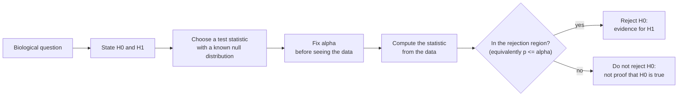

---
aliases:
  - Statistical Hypothesis Test
  - Significance Test
  - Null Hypothesis Significance Testing
  - NHST
  - Null Hypothesis
  - Alternative Hypothesis
  - Type I Error
  - Type II Error
  - Significance Level
  - Test d'hypothèse
tags:
  - type/concept
  - domain/statistics
  - domain/bioinformatics
  - level/L1
  - level/L2
  - level/L3
mastery: 0
prerequisites:
  - "[[Sampling Distribution]]"
  - "[[Normal Distribution]]"
  - "[[Conditional Probability]]"
related:
  - "[[P-Value]]"
  - "[[Confidence Interval]]"
  - "[[Student's t-Test]]"
  - "[[Chi-Square Test]]"
  - "[[Statistical Power]]"
  - "[[Effect Size]]"
  - "[[Multiple Testing Correction]]"
  - "[[Likelihood Ratio Test]]"
  - "[[Differential Expression Analysis]]"
projects:
  - "[[05-sequence-search]]"
sources:
  - "[[Introductory Statistics (OpenStax)]]"
  - "[[MIT 18.05 - Introduction to Probability and Statistics]]"
  - "[[MIT 18.650 - Statistics for Applications]]"
  - "[[HarvardX PH525x - Data Analysis for the Life Sciences]]"
  - "[[Modern Statistics for Modern Biology (Holmes)]]"
  - "[[Wasserstein 2016 - The ASA Statement on p-Values]]"
  - "[[Ioannidis 2005 - Why Most Published Research Findings Are False]]"
  - "[[Pearson 2013 - An Introduction to Sequence Similarity Searching]]"
  - "[[Experimental Design for Laboratory Biologists (Lazic)]]"
---

# Hypothesis Testing

> [!abstract]
> A hypothesis test asks whether the data are surprising if nothing interesting is going on: it states a "no effect" null hypothesis, measures the data with a test statistic, and rejects the null only when the statistic falls in a region that chance alone would reach rarely, with a known error rate.

## Definition

A **statistical hypothesis test** is a rule that uses a sample to decide between two hypotheses about the model that generated it: a **null hypothesis** $H_0$ (typically "no effect" or "no difference") and an **alternative hypothesis** $H_1$. The rule computes a **test statistic** $T$ whose distribution under $H_0$ is known, and rejects $H_0$ when $T$ falls in a **rejection region** chosen so that $P(\text{reject } H_0 \mid H_0 \text{ true}) \le \alpha$, the **significance level** fixed in advance.[^os9][^1805]

## Why it matters

- **Differential expression.** "Is this gene differentially expressed?" becomes a test of $H_0$: mean log2 fold change $= 0$, run once per gene, 20,000 times per experiment ([[Differential Expression Analysis]], [[Student's t-Test]]).[^holmes]
- **Genetics.** Association of a variant with a disease, departure of genotype counts from [[Hardy-Weinberg Equilibrium]], Mendelian ratios: all are tests on counts ([[Chi-Square Test]], [[Mendelian Inheritance]]).
- **Sequence search.** A database search reports a hit as homologous only when its alignment score is statistically significant, that is, higher than unrelated sequences would produce ([[E-Value]], [[05-sequence-search]]).[^pearson]
- **Errors have costs.** A false positive sends a lab to validate a gene that does nothing; a false negative misses a real effect. Designing an experiment means choosing how many of each to accept ([[Statistical Power]], [[Experimental Design]]).[^lazic]
- **Testing at scale changes the meaning of "significant".** With thousands of tests, a 5 % false-positive rate per test produces hundreds of false discoveries, which is why genomics needs [[Multiple Testing Correction]].

## Core (L1)

### The procedure



These steps are common to every test, from the t-test to the chi-square test.[^os9][^1805]

### Null and alternative hypotheses

The null hypothesis is the precise, "boring" statement whose consequences can be computed; the alternative is what the researcher suspects.[^os9]

| Question | $H_0$ | $H_1$ |
|---|---|---|
| Is gene G differentially expressed after treatment? | mean log2 fold change $\mu = 0$ | $\mu \ne 0$ (two-sided) |
| Does a drug lower a tumor marker? | $\mu_{\text{drug}} - \mu_{\text{placebo}} \ge 0$ | $\mu_{\text{drug}} - \mu_{\text{placebo}} < 0$ (one-sided) |
| Are genotype counts in Hardy-Weinberg proportions? | $p_{AA}, p_{Aa}, p_{aa} = p^2, 2pq, q^2$ | some other proportions |
| Is the variant associated with the disease? | allele frequency equal in cases and controls | frequencies differ |

$H_0$ must contain an equality (or a boundary), because it is the hypothesis under which the distribution of the statistic is computed.

### Test statistic and null distribution

A test statistic summarizes the evidence against $H_0$ in one number, standardized so that its distribution under $H_0$ is known: a $z$ score is $\mathcal N(0, 1)$, a t statistic follows [[Student's t-Distribution]], a Pearson statistic a [[Chi-Square Distribution]]. For a mean with known $\sigma$,

$$Z = \frac{\bar X - \mu_0}{\sigma/\sqrt n} \sim \mathcal N(0, 1) \text{ under } H_0: \mu = \mu_0,$$

the observed difference measured in standard errors ([[Sampling Distribution]]).[^os9]

### Rejection rule and significance level

With $\alpha = 0.05$ and a two-sided $H_1$, reject when $|Z| \ge 1.96$, because $P(|Z| \ge 1.96) = 0.05$ under $H_0$ ([[Normal Distribution]]). Equivalently, reject when the [[P-Value]], the probability under $H_0$ of a statistic at least as extreme as the one observed, is at most $\alpha$.[^1805]

### Two kinds of error

| Decision | $H_0$ true (no effect) | $H_0$ false (real effect) |
|---|---|---|
| Reject $H_0$ | **Type I error** (false positive), probability $\alpha$ | correct, probability $1 - \beta$ = **power** |
| Do not reject $H_0$ | correct, probability $1 - \alpha$ | **Type II error** (false negative), probability $\beta$ |

$\alpha$ is controlled by the choice of rejection region; $\beta$ depends on the true effect, the noise and the sample size.[^os9][^1805]

### How to word the conclusion

"Reject $H_0$" means the data would be unusual if $H_0$ were true. "Do not reject $H_0$" means the data are compatible with $H_0$, which is not the same as showing that $H_0$ is true: a small experiment fails to reject almost anything.[^os9] Write "no evidence of differential expression at this sample size", never "the gene is not differentially expressed".

## Deeper (L2)

### Power and sample size

![[hypothesis-test-alpha-beta-power.svg]]

Under $H_1$ with true shift $\delta$, the z statistic is centered at $\delta\sqrt n/\sigma$ instead of 0 (figure). The power of the two-sided test is the probability that it lands beyond $\pm z_{1-\alpha/2}$:

$$1 - \beta = \Phi\!\left(\frac{\delta\sqrt n}{\sigma} - z_{1-\alpha/2}\right) + \Phi\!\left(-\frac{\delta\sqrt n}{\sigma} - z_{1-\alpha/2}\right).$$

For a true doubling ($\delta = 1$ on the log2 scale), $\sigma = 0.8$ and 3 replicates, the power is 0.58: the experiment misses a real doubling 42 % of the time. Solving for $n$ gives $n = \left[(z_{1-\alpha/2} + z_{1-\beta})\,\sigma/\delta\right]^2$: 6 replicates for 80 % power, 7 for 90 % (Computational representation). Power is decided before the experiment, by its design ([[Statistical Power]]).[^lazic]

At fixed $n$, lowering $\alpha$ moves the critical values outward, which shrinks the red tails of the figure but grows the amber region: fewer false positives, more false negatives. Only more data or less noise reduce both.

### One-sided or two-sided

A one-sided test puts all of $\alpha$ in one tail (reject when $Z \ge 1.645$ at $\alpha = 0.05$), which gives more power in that direction and none in the other. It is legitimate only when the direction is fixed before the data and an effect in the other direction would be treated like no effect.[^os9] Choosing the side after seeing the sign of the estimate doubles the real type I error rate. In genomics, where genes can go up or down, tests are two-sided.

### Which test?

| Data and question | Test | Note |
|---|---|---|
| One mean, or paired differences, approximately normal | one-sample or paired t-test | [[Student's t-Test]] |
| Two independent means | Welch t-test | [[Student's t-Test]] |
| Counts in categories against expected proportions | chi-square goodness of fit | [[Chi-Square Test]] |
| Association in a contingency table, large counts | chi-square test of independence | [[Chi-Square Test]], [[Contingency Table]] |
| 2×2 table with small counts, gene set enrichment | Fisher's exact test | [[Fisher's Exact Test]] |
| Two groups, no normality assumption | rank test | [[Wilcoxon Rank-Sum Test]] |
| Any statistic, null by reshuffling labels | permutation test | [[Permutation Test]] |
| Nested parametric models | likelihood ratio test | [[Likelihood Ratio Test]] |

### The null hypothesis includes the assumptions

$H_0$ is not only "$\mu = 0$": it is "$\mu = 0$ **and** the observations are independent, normal, with the assumed variance". A rejection says that this whole model is incompatible with the data, which can happen because an assumption fails rather than because $\mu \ne 0$.[^asa] Correlated replicates, a batch effect confounded with the treatment or an outlier can all produce "significant" results with no biological effect ([[Batch Effect]], [[Pseudoreplication]]).

### Significant is not important

The z statistic grows with $\sqrt n$, so with enough data any non-zero difference, however small, is significant. A log2 fold change of 0.05 (a 3.5 % change) measured with SE 0.01 gives $z = 5$. A test answers "is there evidence of an effect?", not "is the effect large enough to matter?"; report an [[Effect Size]] with its [[Confidence Interval]].[^asa]

## Advanced (L3)

- **Formal view.** A model is a family $\{P_\theta : \theta \in \Theta\}$; $H_0: \theta \in \Theta_0$ against $H_1: \theta \in \Theta_1$. A test is a function $\phi(x) \in \{0, 1\}$ (reject or not); its **size** is $\sup_{\theta \in \Theta_0} P_\theta(\phi = 1)$ and its **power function** is $\theta \mapsto P_\theta(\phi = 1)$. Good tests have size at most $\alpha$ and the highest power over $\Theta_1$.[^18650]
- **Nuisance parameters.** In "$\mu = 0$, $\sigma$ unknown", $\sigma$ is a nuisance parameter: the null is composite. Studentizing removes it (the t statistic has the same distribution whatever $\sigma$, [[Student's t-Distribution]]); conditioning on the observed data removes it in [[Permutation Test|permutation tests]] and [[Fisher's Exact Test]].
- **A general recipe.** Comparing the maximized likelihood under $H_0$ and under $H_1$ gives the [[Likelihood Ratio Test]], whose statistic is approximately chi-square for large samples; it underlies tests of substitution models, molecular clocks and many differential expression models.[^18650]
- **What "significant" means in a screen.** If a fraction $\pi_1$ of the tested genes truly change, the probability that a significant gene is real is, by [[Bayes' Theorem]],
$$P(\text{real} \mid \text{significant}) = \frac{(1-\beta)\,\pi_1}{(1-\beta)\,\pi_1 + \alpha\,(1 - \pi_1)}.$$
With $\pi_1 = 0.1$, $\alpha = 0.05$ and power 0.8 it is 0.64; with power 0.2 it falls to 0.31. Low power and a low prior make most "discoveries" false, the argument of Ioannidis's essay.[^ioannidis] Controlling the [[False Discovery Rate]] targets this quantity directly.
- **The test must be fixed before the data.** Peeking at the p-value after each new replicate and stopping as soon as $p \le 0.05$ raises the real type I error from 5 % to about 21 % when looking from 3 to 20 replicates (Exercise 5). Trying several tests, outlier rules or normalizations and reporting the best has the same effect. The ASA statement calls for full reporting of all analyses performed for this reason ([[P-Hacking]]).[^asa]
- **Decision versus evidence.** The fixed-$\alpha$ procedure controls long-run error rates of decisions; it does not grade the strength of evidence in one experiment, and scientific conclusions should not rest only on whether a threshold is crossed.[^asa] Estimation with intervals, or Bayesian posterior probabilities, answer the questions that a binary verdict leaves open ([[Confidence Interval]], [[Bayesian Inference]]).

## Mathematical representation

- **Hypotheses**: $H_0: \theta \in \Theta_0$, $H_1: \theta \in \Theta_1$, with $\Theta_0 \cap \Theta_1 = \emptyset$.
- **Test statistic** $T = T(X_1, \dots, X_n)$ with known distribution under $H_0$; **rejection region** $R$ with $P_{H_0}(T \in R) \le \alpha$.
- **Errors**: $\alpha = P(T \in R \mid H_0)$, $\beta(\theta) = P_\theta(T \notin R)$ for $\theta \in \Theta_1$, power $1 - \beta(\theta)$.
- **z-test** for $H_0: \mu = \mu_0$ with known $\sigma$: $Z = \frac{\bar X - \mu_0}{\sigma/\sqrt n}$; two-sided region $|Z| \ge z_{1-\alpha/2}$, one-sided $Z \ge z_{1-\alpha}$.
- **Power** at $\mu = \mu_0 + \delta$: $Z \sim \mathcal N(\delta\sqrt n/\sigma, 1)$, so $1 - \beta = \Phi(\delta\sqrt n/\sigma - z_{1-\alpha/2}) + \Phi(-\delta\sqrt n/\sigma - z_{1-\alpha/2})$.
- **Sample size**: ignoring the far tail, $\delta\sqrt n/\sigma = z_{1-\alpha/2} + z_{1-\beta}$, so $n = \left[(z_{1-\alpha/2} + z_{1-\beta})\sigma/\delta\right]^2$.

## Computational representation

The z-test, its power, a sample-size calculation and a simulation of error rates need only `statistics.NormalDist`. Tests with estimated variance are in [[Student's t-Test]].

```python
import math
import random
import statistics as st
from statistics import NormalDist

PHI = NormalDist()                      # standard normal: cdf, inv_cdf


def z_test(xs, mu0, sigma):
    """Two-sided one-sample z-test with known sigma: (z, p-value)."""
    z = (st.fmean(xs) - mu0) / (sigma / math.sqrt(len(xs)))
    return z, 2 * (1 - PHI.cdf(abs(z)))


def power_z(delta, sigma, n, alpha=0.05):
    """Probability that the two-sided z-test rejects when the true mean shift is delta."""
    c, shift = PHI.inv_cdf(1 - alpha / 2), delta * math.sqrt(n) / sigma
    return PHI.cdf(shift - c) + PHI.cdf(-shift - c)


def n_for_power(delta, sigma, power=0.8, alpha=0.05):
    za, zb = PHI.inv_cdf(1 - alpha / 2), PHI.inv_cdf(power)
    return math.ceil(((za + zb) * sigma / delta) ** 2)


# 1. One gene, four replicate log2 fold changes (invented), platform SD known to be 0.5
z, p = z_test([0.9, 1.4, 0.6, 1.1], mu0=0.0, sigma=0.5)
print(f"z = {z:.2f}, two-sided p = {p:.1e}")

# 2. Power and sample size for a true doubling (delta = 1) with sigma = 0.8
print(f"power with n = 3: {power_z(1, 0.8, 3):.3f}; n for 80 %: {n_for_power(1, 0.8)}; n for 90 %: {n_for_power(1, 0.8, 0.9)}")

# 3. Simulated error rates over 20,000 experiments of n = 3 (seed 3)
rng = random.Random(3)
REPS, ALPHA = 20_000, 0.05
for delta, label in ((0.0, "type I error rate (H0 true)"), (1.0, "power (true delta = 1)")):
    rejections = sum(z_test([rng.gauss(delta, 0.8) for _ in range(3)], 0.0, 0.8)[1] <= ALPHA
                     for _ in range(REPS))
    print(f"{label}: {rejections / REPS:.3f}")

# 4. Of all 'significant' genes, which fraction is real? (prior fraction of real effects pi1)
for pi1, pw in ((0.1, 0.8), (0.1, 0.2), (0.5, 0.8)):
    ppv = pw * pi1 / (pw * pi1 + ALPHA * (1 - pi1))
    print(f"pi1 = {pi1}, power = {pw}: P(real | significant) = {ppv:.2f}")
```

```text
z = 4.00, two-sided p = 6.3e-05
power with n = 3: 0.581; n for 80 %: 6; n for 90 %: 7
type I error rate (H0 true): 0.051
power (true delta = 1): 0.579
pi1 = 0.1, power = 0.8: P(real | significant) = 0.64
pi1 = 0.1, power = 0.2: P(real | significant) = 0.31
pi1 = 0.5, power = 0.8: P(real | significant) = 0.94
```

The simulated rejection rates match $\alpha = 0.05$ and the power formula (0.581) within simulation noise: the error rates of a test are long-run frequencies over repeated experiments.

## Worked example

> [!example] Is this gene differentially expressed?
> Four independent experiments (treated against control, one pair per batch) give log2 fold changes 0.9, 1.4, 0.6, 1.1 for gene G (invented). Suppose the platform's SD for a fold change is known from many earlier runs: $\sigma = 0.5$.
> 1. **Hypotheses**: $H_0: \mu = 0$ (no change), $H_1: \mu \ne 0$ (up or down), two-sided because either direction matters.
> 2. **Level**: $\alpha = 0.05$, fixed now. Critical values $\pm 1.96$.
> 3. **Statistic**: $\bar x = 1.0$, $\mathrm{SE} = 0.5/\sqrt4 = 0.25$, $z = 1.0/0.25 = 4.0$.
> 4. **Decision**: $|z| = 4.0 \ge 1.96$: reject $H_0$. The two-sided p-value is $2(1 - \Phi(4.0)) = 6.3 \times 10^{-5}$ ([[P-Value]]).
> 5. **Conclusion**: the data give strong evidence that G changes; the estimated change is a doubling ($2^{1.0}$), with 95 % interval $1.0 \pm 1.96 \times 0.25 = [0.51, 1.49]$ on the log2 scale ([[Confidence Interval]]).
> 6. **If $\sigma$ were unknown**, it would be estimated from the four values ($s = 0.337$) and the statistic $t = 1.0/(0.337/2) = 5.94$ compared with a t distribution with 3 degrees of freedom, giving $p = 0.0095$: still significant, but the price of estimating $\sigma$ from four numbers is a p-value 150 times larger ([[Student's t-Test]]).
> 7. **In a screen** of 20,000 genes, this gene's p-value would still have to survive a [[Multiple Testing Correction]].

## Common misconceptions

> [!warning] "Not rejecting $H_0$ proves there is no effect"
> Absence of evidence is not evidence of absence. With 3 replicates and $\sigma = 0.8$, a real doubling is missed 42 % of the time. Report the interval: if it is wide and includes large effects, the experiment was inconclusive, not negative.

> [!warning] "$\alpha$ is the probability that a significant result is a false positive"
> $\alpha = P(\text{reject} \mid H_0 \text{ true})$. The probability that a rejected hypothesis is true, $P(H_0 \mid \text{reject})$, depends also on power and on the fraction of real effects: 0.36 with $\pi_1 = 0.1$ and power 0.8 (Advanced). Confusing the two conditional probabilities is the error described in [[Bayes' Theorem]].

> [!warning] "A significant result is an important result"
> Significance measures the evidence against $H_0$, which grows with sample size; importance is about the size of the effect. A 3.5 % expression change can be highly significant and biologically irrelevant.[^asa]

> [!warning] "I can choose a one-sided test because the effect went up"
> The choice of $H_1$ must precede the data. Choosing the tail that matches the observed sign turns a 5 % test into a 10 % test.

## Exercises

> [!question] Exercise 1 (L1)
> Write $H_0$ and $H_1$ for: (a) a SNP's alternative-allele frequency differs between cases and controls; (b) a knockout reduces the growth rate of yeast; (c) reads at a heterozygous site are not split 50:50 between alleles.

> [!success]- Solution
> (a) $H_0: p_{\text{cases}} = p_{\text{controls}}$, $H_1: p_{\text{cases}} \ne p_{\text{controls}}$ (two-sided). (b) $H_0: \mu_{\text{KO}} \ge \mu_{\text{WT}}$, $H_1: \mu_{\text{KO}} < \mu_{\text{WT}}$; one-sided only if the direction was stated before the experiment, otherwise two-sided. (c) $H_0$: alternative-read fraction $= 0.5$, $H_1$: $\ne 0.5$ ([[Binomial Distribution]]).

> [!question] Exercise 2 (L1)
> A screen tests 10,000 genes at $\alpha = 0.05$. In truth 9,500 do not change and 500 do; the tests have power 0.6. Fill in the expected numbers of each outcome of the error table, and give the fraction of rejected genes that are false positives.

> [!success]- Solution
> True nulls: $9{,}500 \times 0.05 = 475$ false positives (type I), 9,025 correct non-rejections. Real effects: $500 \times 0.6 = 300$ true positives, 200 false negatives (type II). Rejected: 775, of which $475/775 = 61\%$ are false. A per-test $\alpha$ of 5 % does not mean 5 % of discoveries are false ([[False Discovery Rate]]).

> [!question] Exercise 3 (L2)
> With $\sigma = 0.8$, compute the power of the two-sided z-test at $\alpha = 0.05$ to detect $\delta = 0.5$ (a 1.4-fold change) with $n = 6$, and the $n$ needed for 80 % power.

> [!success]- Solution
> $\delta\sqrt n/\sigma = 0.5 \times 2.449/0.8 = 1.531$. Power $= \Phi(1.531 - 1.960) + \Phi(-1.531 - 1.960) = \Phi(-0.429) + \Phi(-3.49) = 0.334 + 0.0002 = 0.334$. For 80 %: $n = [(1.960 + 0.842) \times 0.8/0.5]^2 = 20.1$, so 21 replicates. Halving the effect multiplies the required $n$ by 4.

> [!question] Exercise 4 (L3)
> Using the formula of the Advanced section, find the power needed for $P(\text{real} \mid \text{significant}) \ge 0.9$ when $\pi_1 = 0.1$ and $\alpha = 0.05$. What does this say about small experiments in exploratory screens?

> [!success]- Solution
> Solve $\frac{0.1\,w}{0.1\,w + 0.045} \ge 0.9 \iff 0.1\,w \ge 0.09\,w + 0.0405 \iff 0.01\,w \ge 0.0405$, so $w \ge 4.05$: impossible, since power is at most 1. Even with perfect power, $P = 0.1/(0.1 + 0.045) = 0.69$. With a low prior, $\alpha = 0.05$ cannot deliver reliable discoveries: lower $\alpha$ (multiple-testing control) and independent replication are needed.[^ioannidis]

> [!question] Exercise 5 (L3, Python)
> Simulate (seed 11, 20,000 runs) an experimenter who starts with 3 replicates under a true $H_0$ ($\sigma = 0.8$ known), runs a two-sided z-test, and adds one replicate at a time up to 20, stopping as soon as $p \le 0.05$. Estimate the real type I error rate.

> [!success]- Solution
> ```python
> import math
> import random
> import statistics as st
> from statistics import NormalDist
>
> PHI = NormalDist()
> rng = random.Random(11)
> REPS, SIGMA, ALPHA = 20_000, 0.8, 0.05
> crit = PHI.inv_cdf(1 - ALPHA / 2)
> stopped_early = 0
> for _ in range(REPS):
>     xs = [rng.gauss(0.0, SIGMA) for _ in range(3)]           # H0 is true: no change
>     while True:
>         z = st.fmean(xs) / (SIGMA / math.sqrt(len(xs)))
>         if abs(z) >= crit:                                     # "significant": stop and publish
>             stopped_early += 1
>             break
>         if len(xs) == 20:                                      # give up
>             break
>         xs.append(rng.gauss(0.0, SIGMA))                       # add one replicate, test again
> print(f"type I error with peeking after every replicate (3 to 20): {stopped_early / REPS:.3f}")
> ```
> Output: `type I error with peeking after every replicate (3 to 20): 0.208`. Each look is a 5 % test, but 18 correlated looks give about four times the nominal rate. Fix $n$ in advance, or use a sequential design whose thresholds account for the looks.

## Mastery checklist

- [ ] 1 Recognized: I can name the parts of a test (hypotheses, statistic, null distribution, $\alpha$, decision) and the two types of error.
- [ ] 2 Understood: I can explain why "not rejecting" is not "accepting", and why $\alpha$ is not the probability that a discovery is false.
- [ ] 3 Practiced: I can run a z-test, compute power and sample size, and simulate error rates with a seeded generator.
- [ ] 4 Applied: I set up the hypotheses and chose the test for a real differential expression or association analysis, and planned its sample size.
- [ ] 5 Explained: I can explain composite nulls, assumptions as part of $H_0$, the positive predictive value of a screen, and how optional stopping and analytic flexibility break error control.

## References

[^os9]: [[Introductory Statistics (OpenStax)]], 2nd ed., ch. 9 "Hypothesis Testing with One Sample" (null and alternative hypotheses, outcomes and the type I and type II errors, distribution needed for the test, decision and conclusion).
[^1805]: [[MIT 18.05 - Introduction to Probability and Statistics]], Spring 2022, Readings 17b, 18 and 19 "Null Hypothesis Significance Testing I, II and III" (rejection region, significance level, power, p-values, common tests).
[^18650]: [[MIT 18.650 - Statistics for Applications]], testing part (parametric hypothesis testing).
[^holmes]: [[Modern Statistics for Modern Biology (Holmes)]], treatment of hypothesis testing and multiple testing.
[^pearson]: [[Pearson 2013 - An Introduction to Sequence Similarity Searching]].
[^lazic]: [[Experimental Design for Laboratory Biologists (Lazic)]], material on planning an experiment (replication and sample size).
[^asa]: [[Wasserstein 2016 - The ASA Statement on p-Values]], *The American Statistician* 70(2):129-133 (principles 1 to 6).
[^ioannidis]: [[Ioannidis 2005 - Why Most Published Research Findings Are False]], *PLoS Medicine* 2(8):e124.
