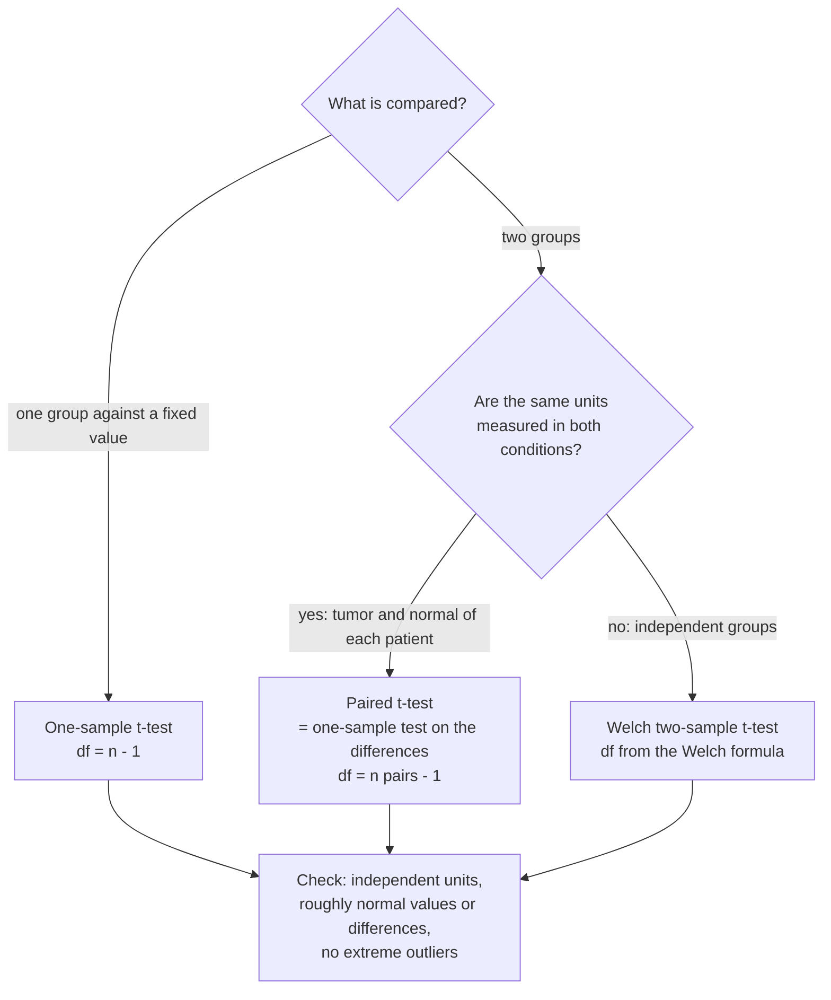

---
aliases:
  - t-Test
  - T-Test
  - One-Sample t-Test
  - Two-Sample t-Test
  - Welch's t-Test
  - Welch Test
  - Paired t-Test
  - Test t de Student
tags:
  - type/concept
  - domain/statistics
  - domain/bioinformatics
  - level/L1
  - level/L2
  - level/L3
mastery: 0
prerequisites:
  - "[[Hypothesis Testing]]"
  - "[[P-Value]]"
  - "[[Student's t-Distribution]]"
related:
  - "[[Confidence Interval]]"
  - "[[Paired Design]]"
  - "[[Wilcoxon Rank-Sum Test]]"
  - "[[Permutation Test]]"
  - "[[Analysis of Variance]]"
  - "[[Linear Regression]]"
  - "[[Differential Expression Analysis]]"
  - "[[Empirical Bayes]]"
projects: []
sources:
  - "[[Introductory Statistics (OpenStax)]]"
  - "[[MIT 18.05 - Introduction to Probability and Statistics]]"
  - "[[HarvardX PH525x - Data Analysis for the Life Sciences]]"
  - "[[Modern Statistics for Modern Biology (Holmes)]]"
  - "[[Experimental Design for Laboratory Biologists (Lazic)]]"
  - "[[Hurlbert 1984 - Pseudoreplication and the Design of Ecological Field Experiments]]"
  - "[[Student 1908 - The Probable Error of a Mean]]"
---

# Student's t-Test

> [!abstract]
> The t-test asks whether a mean, a difference between two group means, or a mean within-pair difference is far from zero relative to its estimated standard error; the answer is read on a t distribution, which accounts for estimating the noise from few replicates.

## Definition

A **t-test** tests a hypothesis about one or two means with a statistic of the form

$$t = \frac{\text{estimate} - \text{value under } H_0}{\text{estimated standard error}},$$

compared with [[Student's t-Distribution]]. Three versions cover most designs: the **one-sample** test ($H_0: \mu = \mu_0$), the **two-sample** test for independent groups ($H_0: \mu_1 = \mu_2$), in its **Welch** form when the two variances may differ, and the **paired** test, a one-sample test on within-pair differences.[^os10][^1805] The test is exact for normal data and originates in Student's 1908 paper.[^student]

## Why it matters

- **The default for small experiments with continuous outcomes**: qPCR fold changes, log-expression of a candidate gene, enzyme activities, growth rates ([[Hypothesis Testing]]).[^ph525]
- **Design decides the test.** Tumor and normal tissue from the same patients, cells before and after treatment, left and right sides of one animal: pairing removes between-individual variation and can turn an inconclusive comparison into a clear one ([[Paired Design]]).[^lazic]
- **The ancestor of genome-wide tests.** Differential expression on microarrays was first a t-test per gene; current tools keep the logic (estimate / standard error) but stabilize the variance across genes or model counts directly ([[Differential Expression Analysis]], [[Empirical Bayes]]).[^holmes8]
- **Its assumptions are the classic sources of false findings**: non-independent replicates, outliers, unequal variances with unequal group sizes (Deeper).[^hurlbert]

## Core (L1)

### Which t-test?



### One-sample

$H_0: \mu = \mu_0$. With $n$ observations, sample mean $\bar x$ and sample SD $s$:

$$t = \frac{\bar x - \mu_0}{s/\sqrt n}, \qquad \nu = n - 1.$$

Bio: four independent qPCR experiments give log2 fold changes 1.8, 2.4, 1.5, 2.1 (invented). $\bar x = 1.95$, $s = 0.387$, $t = 1.95/(0.387/2) = 10.07$ with 3 degrees of freedom, $p = 0.002$: the gene is induced.[^os9]

### Two independent groups: Welch's test

$H_0: \mu_1 = \mu_2$. With group sizes $n_1, n_2$ and sample variances $s_1^2, s_2^2$:

$$t = \frac{\bar x_1 - \bar x_2}{\sqrt{s_1^2/n_1 + s_2^2/n_2}}, \qquad \nu = \frac{\left(s_1^2/n_1 + s_2^2/n_2\right)^2}{\dfrac{(s_1^2/n_1)^2}{n_1 - 1} + \dfrac{(s_2^2/n_2)^2}{n_2 - 1}}.$$

The degrees of freedom are estimated from the data and are usually not an integer.[^os10] The older Student version pools the two variances into one and uses $\nu = n_1 + n_2 - 2$; it assumes equal variances (Deeper).

### Paired designs

When each unit is measured twice, compute the differences $d_i = x_i - y_i$ and run a one-sample test of $H_0: \mu_d = 0$:[^os10]

$$t = \frac{\bar d}{s_d/\sqrt n}, \qquad \nu = n - 1,$$

with $n$ the number of pairs.

### Bio: tumor versus matched normal tissue

Log2 expression of one gene in tumor and adjacent normal tissue of six patients (invented):

| Patient | 1 | 2 | 3 | 4 | 5 | 6 |
|---|---|---|---|---|---|---|
| Normal | 6.1 | 7.4 | 5.2 | 8.0 | 6.8 | 7.1 |
| Tumor | 6.9 | 8.0 | 5.9 | 8.5 | 7.9 | 7.5 |
| Difference | 0.8 | 0.6 | 0.7 | 0.5 | 1.1 | 0.4 |

- **Paired** (correct for this design): $\bar d = 0.683$, $s_d = 0.248$, $t = 6.74$, $\nu = 5$, $p = 0.0011$.
- **Welch** (wrongly ignoring the pairing): $t = 1.23$, $\nu = 9.96$, $p = 0.25$.

Patients differ by up to 2.8 log2 units in baseline expression, but every tumor is above its own normal by 0.4 to 1.1. The paired test compares each patient with themself, so the between-patient spread (SD about 1) disappears from the noise; the unpaired test leaves it in and sees nothing.

## Deeper (L2)

### Why pairing works

$\mathrm{Var}(X - Y) = \sigma_X^2 + \sigma_Y^2 - 2\rho\,\sigma_X\sigma_Y$, where $\rho$ is the correlation between the two measurements of a unit ([[Variance]]). Patient effects make $\rho$ large (0.97 in the table), so the variance of a difference (0.06) is far below the sum of the two variances (1.85). Pairing (or blocking) is decided at the design stage, by measuring both conditions on the same units ([[Paired Design]], [[Randomized Block Design]]).[^lazic] Pairing that does not exist in the design cannot be invented at analysis time.

### Assumptions and how to check them

| Assumption | What breaks if it fails | Check or remedy |
|---|---|---|
| Independent units (patients, animals, cultures) | Standard error too small, false positives | Count biological units, not technical repeats ([[Pseudoreplication]])[^hurlbert][^lazic] |
| Values (or differences) roughly normal | Wrong tail probabilities for small $n$, especially with skew | Plot the data, work on the log scale, [[Q-Q Plot]] if $n$ allows |
| No extreme outliers | One value dominates mean and SD | Inspect; consider a rank test ([[Wilcoxon Rank-Sum Test]]) |
| Equal variances (Student pooled test only) | Wrong type I error when group sizes differ | Use Welch by default |

With three values per group, normality cannot be checked from the data; it must come from knowledge of the measurement (log-expression is usually close to symmetric, raw counts are not). A normality test that "passes" on 3 points has no power to fail.

### Welch by default

When variances and group sizes differ, the pooled test mixes a small, noisy group with a large, tight one and underestimates the standard error of the difference. In a seeded simulation of 3 samples with SD 2 against 12 with SD 0.5 and no true difference, the pooled test rejects at the 5 % level in 32.6 % of experiments; Welch's test in 6.2 % (Computational representation). When variances are equal, the two tests give nearly the same answer, so Welch costs little.

### Rank tests are not a free alternative at $n = 3$

The rank-sum test uses only the ordering of the 6 values. There are $\binom{6}{3} = 20$ equally likely ways to assign 3 of the ranks to group 1 under $H_0$, and the most extreme two-sided outcome has probability $2/20 = 0.1$: with 3 against 3, a rank test can never reach $p < 0.05$, whatever the data ([[Wilcoxon Rank-Sum Test]], [[Nonparametric Statistics]]).

### Report the difference, not only $p$

The interval $\bar d \pm t_{\nu,\,0.975}\,s_d/\sqrt n$ for the paired example is $0.683 \pm 2.571 \times 0.101 = [0.42, 0.94]$ log2 units, a 1.3- to 1.9-fold increase ([[Confidence Interval]], [[Effect Size]]).

## Advanced (L3)

- **Thousands of t-tests.** Run one test per gene on 3 against 3 replicates and the variance estimates are so noisy that the most extreme $|t|$ values come from genes whose standard error is accidentally tiny: in a simulation of 10,000 null genes, the 100 largest $|t|$ have a median standard error three times smaller than the median over all genes, and the largest null $|t|$ reaches 24 (Exercise 4). Moderated statistics shrink gene-wise variances toward a common value estimated from all genes, which protects against these false hits ([[Empirical Bayes]]).[^holmes8]
- **Counts are not normal.** RNA-seq gives counts whose variance grows with the mean; differential expression tools model them with count distributions (negative binomial) instead of t-testing raw counts ([[Negative Binomial Distribution]], [[RNA Sequencing]]).[^holmes8]
- **A t-test is a linear model.** The pooled two-sample test is the test of the group coefficient in the regression $y = \beta_0 + \beta_1 \cdot \text{group} + \varepsilon$; the paired test is the same regression with one intercept per patient. This view extends to several groups (ANOVA), covariates and batches ([[Linear Regression]], [[Analysis of Variance]], [[Batch Effect]]).
- **When the null distribution is doubtful**, a [[Permutation Test]] keeps the t statistic but builds its null distribution by shuffling group labels (or flipping the signs of paired differences), which requires only exchangeability under $H_0$.

## Mathematical representation

- **One-sample**: $X_1, \dots, X_n$ i.i.d. $\mathcal N(\mu, \sigma^2)$. Under $H_0: \mu = \mu_0$, $T = \frac{\bar X - \mu_0}{S/\sqrt n} \sim t_{n-1}$ exactly ([[Student's t-Distribution]]).
- **Paired**: $D_i = X_i - Y_i$ i.i.d. $\mathcal N(\mu_D, \sigma_D^2)$; the one-sample test on $D$, with $\sigma_D^2 = \sigma_X^2 + \sigma_Y^2 - 2\,\mathrm{Cov}(X, Y)$.
- **Pooled two-sample** (equal variances): $S_p^2 = \frac{(n_1 - 1)S_1^2 + (n_2 - 1)S_2^2}{n_1 + n_2 - 2}$, $T = \frac{\bar X_1 - \bar X_2}{S_p\sqrt{1/n_1 + 1/n_2}} \sim t_{n_1 + n_2 - 2}$ under $H_0$.
- **Welch**: $T = \frac{\bar X_1 - \bar X_2}{\sqrt{S_1^2/n_1 + S_2^2/n_2}}$ is approximately $t_\nu$ under $H_0$, with $\nu$ given by the Welch formula (Core); the approximation does not require equal variances.[^os10]
- **Two-sided p-value**: $p = 2\,P(T_\nu \ge |t_{\text{obs}}|)$; **interval**: estimate $\pm\, t_{\nu,\,1-\alpha/2} \times \mathrm{SE}$.

## Computational representation

The tests need the mean, the sample variance (`statistics.variance`, divisor $n - 1$) and a t tail probability; the latter is computed as in [[Student's t-Distribution]]. SciPy's `ttest_rel` and `ttest_ind(..., equal_var=False)` return the same t, degrees of freedom and p-values for the patient data.

```python
import math
import random
import statistics as st


def t_pdf(x, df):
    c = math.exp(math.lgamma((df + 1) / 2) - math.lgamma(df / 2)) / math.sqrt(df * math.pi)
    return c * (1 + x * x / df) ** (-(df + 1) / 2)


def t_p_two_sided(t, df, steps=400):
    """2 P(T >= |t|), from Simpson's rule on the density (see Student's t-Distribution)."""
    h = abs(t) / steps
    inner = sum((4 if i % 2 else 2) * t_pdf(i * h, df) for i in range(1, steps))
    return 2 * (0.5 - (t_pdf(0, df) + inner + t_pdf(abs(t), df)) * h / 3)


def one_sample_t(xs, mu0=0.0):
    n = len(xs)
    t = (st.fmean(xs) - mu0) / (st.stdev(xs) / math.sqrt(n))
    return t, n - 1, t_p_two_sided(t, n - 1)


def paired_t(xs, ys):
    return one_sample_t([x - y for x, y in zip(xs, ys)])


def welch_t(xs, ys):
    v1, v2 = st.variance(xs) / len(xs), st.variance(ys) / len(ys)
    t = (st.fmean(xs) - st.fmean(ys)) / math.sqrt(v1 + v2)
    df = (v1 + v2) ** 2 / (v1 ** 2 / (len(xs) - 1) + v2 ** 2 / (len(ys) - 1))
    return t, df, t_p_two_sided(t, df)


def pooled_t(xs, ys):
    n1, n2 = len(xs), len(ys)
    sp2 = ((n1 - 1) * st.variance(xs) + (n2 - 1) * st.variance(ys)) / (n1 + n2 - 2)
    t = (st.fmean(xs) - st.fmean(ys)) / math.sqrt(sp2 * (1 / n1 + 1 / n2))
    return t, n1 + n2 - 2, t_p_two_sided(t, n1 + n2 - 2)


# Log2 expression of one gene in tumor and matched normal tissue of 6 patients (invented)
normal = [6.1, 7.4, 5.2, 8.0, 6.8, 7.1]
tumor = [6.9, 8.0, 5.9, 8.5, 7.9, 7.5]
for name, (t, df, p) in (("paired", paired_t(tumor, normal)), ("Welch (ignores pairing)", welch_t(tumor, normal))):
    print(f"{name:24s} t = {t:5.2f}, df = {df:5.2f}, p = {p:.4f}")

# Type I error when variances and group sizes differ: 3 samples with SD 2 vs 12 with SD 0.5 (seed 4)
rng = random.Random(4)
REPS = 10_000
rejected = {"pooled (Student)": 0, "Welch": 0}
for _ in range(REPS):
    a = [rng.gauss(0, 2.0) for _ in range(3)]
    b = [rng.gauss(0, 0.5) for _ in range(12)]
    rejected["pooled (Student)"] += pooled_t(a, b)[2] <= 0.05
    rejected["Welch"] += welch_t(a, b)[2] <= 0.05
for name, r in rejected.items():
    print(f"type I error, {name}: {r / REPS:.3f}")
```

```text
paired                   t =  6.74, df =  5.00, p = 0.0011
Welch (ignores pairing)  t =  1.23, df =  9.96, p = 0.2467
type I error, pooled (Student): 0.326
type I error, Welch: 0.062
```

Welch's rate (0.062) is close to the nominal 0.05; its degrees of freedom are an approximation, slightly liberal when one group has only 3 values.

## Worked example

> [!example] Welch's test by hand
> Group 1 (knockout, 3 mice): mean 5.0, $s_1 = 1.2$. Group 2 (wild type, 5 mice): mean 3.6, $s_2 = 0.4$ (invented log2 values).
> 1. **Variance terms**: $s_1^2/n_1 = 1.44/3 = 0.480$; $s_2^2/n_2 = 0.16/5 = 0.032$.
> 2. **Statistic**: $t = (5.0 - 3.6)/\sqrt{0.512} = 1.4/0.716 = 1.96$.
> 3. **Degrees of freedom**: $\nu = 0.512^2/(0.480^2/2 + 0.032^2/4) = 0.2621/0.1155 = 2.27$. The noisy group of 3 dominates: $\nu$ is close to its $n_1 - 1 = 2$, not to $n_1 + n_2 - 2 = 6$.
> 4. **Decision**: $t_{2.27,\,0.975} = 3.85 > 1.96$, so $H_0$ is not rejected at 5 %. The pooled test would use $s_p^2 = (2 \times 1.44 + 4 \times 0.16)/6 = 0.587$, dominated by the five tight values, giving $t = 1.4/\sqrt{0.587 \times (1/3 + 1/5)} = 2.50$ against a critical value of 2.45 with $\nu = 6$: a "significant" result produced by the equal-variance assumption.
> 5. **Reading**: a 1.4 log2-unit difference is not established with three highly variable knockouts. More knockouts, or less variable ones, are needed.

## Common misconceptions

> [!warning] "Equal group sizes mean the data are paired"
> Pairing comes from the design: the same patient, animal or culture measured twice. Two independent groups of six are not paired just because they have six each, and pairing them arbitrarily gives meaningless differences.

> [!warning] "Use the pooled Student test unless the variances look different"
> With 3 values per group, variances cannot be compared reliably, and the pooled test is badly wrong when variances and sizes differ (32.6 % false positives above). Welch loses almost nothing when variances are equal.

> [!warning] "Technical replicates increase $n$"
> Three RNA extractions from one mouse are one biological unit. A t-test on technical replicates tests whether that one mouse differs from another, not whether the genotype has an effect.[^hurlbert][^lazic]

> [!warning] "A t-test on raw RNA-seq counts is fine with enough replicates"
> Counts are discrete, skewed and heteroscedastic, and depend on library size; normalized log values or count models are needed ([[Count Normalization]], [[Differential Expression Analysis]]).[^holmes8]

## Exercises

> [!question] Exercise 1 (L1)
> Which test? (a) Methylation level at a CpG in blood of 10 smokers and 12 non-smokers. (b) Glucose before and after a drug in 8 patients. (c) Mean log2 fold change of a gene across 5 qPCR runs, against 0.

> [!success]- Solution
> (a) Welch two-sample (independent groups). (b) Paired (same patients), i.e. one-sample on the 8 differences. (c) One-sample with $\mu_0 = 0$, 4 degrees of freedom.

> [!question] Exercise 2 (L2)
> In the patient table, compute the correlation-based variance check: $s_N^2 + s_T^2$ against $s_d^2$, using $s_N = 0.993$, $s_T = 0.929$, $s_d = 0.248$. By what factor does pairing reduce the variance of the comparison?

> [!success]- Solution
> $0.993^2 + 0.929^2 = 1.849$ against $0.248^2 = 0.0615$: a 30-fold reduction, equivalent to having about 30 times more unpaired patients for the same standard error. It is possible because $\rho = 0.97$ between a patient's two tissues.

> [!question] Exercise 3 (L2)
> Show that with 3 versus 3 observations, an exact two-sided rank-sum test cannot give $p < 0.05$. What is the smallest group size $n$ (equal groups) for which it can?

> [!success]- Solution
> $\binom{6}{3} = 20$ arrangements, minimum two-sided $p = 2/20 = 0.1$. For $n = 4$: $\binom{8}{4} = 70$, minimum $2/70 = 0.029 < 0.05$. So at least 4 per group.

> [!question] Exercise 4 (L3, Python)
> Simulate 10,000 null genes (seed 12), each with 3 against 3 normal replicates of SD 1. Compute Welch $|t|$ and its standard error for each gene, and compare the median standard error of the 100 largest $|t|$ with the median over all genes.

> [!success]- Solution
> ```python
> import math
> import random
> import statistics as st
>
> rng = random.Random(12)
> genes = []
> for _ in range(10_000):                     # 10,000 null genes, 3 vs 3 replicates, true SD 1
>     a = [rng.gauss(0, 1) for _ in range(3)]
>     b = [rng.gauss(0, 1) for _ in range(3)]
>     se = math.sqrt(st.variance(a) / 3 + st.variance(b) / 3)
>     genes.append((abs(st.fmean(a) - st.fmean(b)) / se, se))
> top = sorted(genes, reverse=True)[:100]
> print(f"median SE, all genes: {st.median(se for _, se in genes):.3f}; top 100 by |t|: {st.median(se for _, se in top):.3f}")
> print(f"largest |t| among null genes: {top[0][0]:.1f}")
> ```
> Output: `median SE, all genes: 0.749; top 100 by |t|: 0.258`, then `largest |t| among null genes: 24.2`. The "top hits" of a null screen are mostly genes whose variance happened to be underestimated. Shrinking variances toward a common value ([[Empirical Bayes]]) or requiring a minimum fold change protects against this.

## Mastery checklist

- [ ] 1 Recognized: I can name the three t-tests and say which design each matches.
- [ ] 2 Understood: I can explain why pairing reduces variance, why Welch is the default, and what the degrees of freedom represent.
- [ ] 3 Practiced: I can compute one-sample, Welch and paired tests by hand and in Python, with intervals for the difference.
- [ ] 4 Applied: I analyzed a real paired or two-group experiment, checking independence of units, scale and outliers.
- [ ] 5 Explained: I can explain pseudoreplication, the failure of the pooled test, the small-$n$ limits of rank tests, and why genome-wide analyses moderate variances or model counts.

## References

[^os9]: [[Introductory Statistics (OpenStax)]], 2nd ed., ch. 9 "Hypothesis Testing with One Sample".
[^os10]: [[Introductory Statistics (OpenStax)]], 2nd ed., ch. 10 "Hypothesis Testing with Two Samples" (two population means with unknown standard deviations and the Welch degrees of freedom; section 10.4 "Matched or Paired Samples").
[^1805]: [[MIT 18.05 - Introduction to Probability and Statistics]], Spring 2022, Readings 17b to 19 "Null Hypothesis Significance Testing I, II and III" (one- and two-sample t-tests).
[^ph525]: [[HarvardX PH525x - Data Analysis for the Life Sciences]], PH525.1x (statistical inference for life-science data).
[^holmes8]: [[Modern Statistics for Modern Biology (Holmes)]], ch. 8 "High-Throughput Count Data" (count models for RNA-seq, sharing information across genes).
[^lazic]: [[Experimental Design for Laboratory Biologists (Lazic)]], material on experimental units, pseudoreplication and paired (blocked) designs.
[^hurlbert]: [[Hurlbert 1984 - Pseudoreplication and the Design of Ecological Field Experiments]].
[^student]: [[Student 1908 - The Probable Error of a Mean]], *Biometrika* 6(1):1-25.
