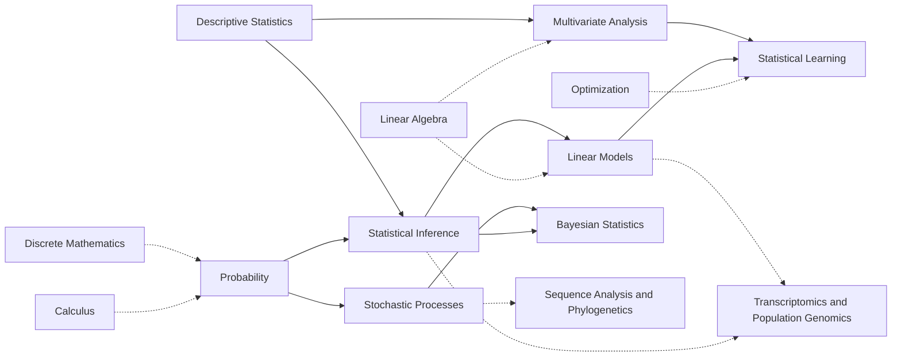

---
aliases:
  - Statistics
  - Biostatistics
  - Probabilités et statistique
tags:
  - type/moc
  - domain/statistics
  - domain/mathematics
  - level/L1
  - level/L2
  - level/L3
  - level/M1
prerequisites:
  - "[[Mathematics]]"
projects:
  - "[[01-dna-engine]]"
  - "[[05-sequence-search]]"
  - "[[06-mutation-lab]]"
  - "[[07-evolution-simulator]]"
  - "[[08-phylogenetic-engine]]"
  - "[[09-genome-browser]]"
  - "[[10-genomic-pipeline]]"
sources:
  - "[[UC San Diego - BS Bioinformatics]]"
  - "[[MIT - Course 6-7 Computer Science and Molecular Biology]]"
  - "[[MIT 18.05 - Introduction to Probability and Statistics]]"
  - "[[Harvard Stat 110 - Probability]]"
  - "[[Introduction to Probability (Blitzstein)]]"
  - "[[MIT 6.041SC - Probabilistic Systems Analysis and Applied Probability]]"
  - "[[MIT 18.650 - Statistics for Applications]]"
  - "[[An Introduction to Statistical Learning (James)]]"
  - "[[Modern Statistics for Modern Biology (Holmes)]]"
  - "[[HarvardX PH525x - Data Analysis for the Life Sciences]]"
  - "[[Biological Sequence Analysis (Durbin)]]"
  - "[[ETH Zurich - BSc Biology]]"
  - "[[Tsinghua University - BS Biological Sciences]]"
  - "[[Carnegie Mellon University - BS Computational Biology]]"
---

# Probability and Statistics

> [!abstract]
> Reasoning under uncertainty and learning from data: probability and stochastic processes as the models, descriptive statistics, inference, linear and multivariate models, Bayesian methods and statistical learning as the ways to confront them with biological data.

## Why it matters for bioinformatics

- **Every bioinformatics result is a statistical statement**: a variant call is a posterior probability, a differentially expressed gene is a test after FDR control, a clade has bootstrap support, a BLAST hit has an E-value.
- **Probabilistic models are the algorithms**: hidden Markov models annotate genes and protein families, continuous-time Markov chains model substitutions, likelihoods drive phylogenetics and genotype calling.
- **Omics data are high-dimensional**: PCA, clustering, regularized regression and careful validation separate signal from noise when there are more genes than samples.

## Target level and weight

**Target: L3, critical.** The [[Curriculum]] studies biology, statistics, algorithms and bioinformatics to L3/M1 (design principle 1). Probability and statistics are required in the computational programs of the [[Curriculum Benchmark]] (statistics is only an elective in MIT 6-7) and in the European and Chinese biology degrees.[^bench] The weight here is higher than in those programs because the field's methods are statistical: 8 subdomains and about 200 concepts.

## Subdomains

| MOC | Curriculum stage | Target level | Scope |
|---|---|---|---|
| [[Probability]] | 1 (L1), 2 (L2 and L3) | L1-L3 | Conditioning, Bayes, random variables, common distributions, joint distributions, limit theorems, information theory basics |
| [[Descriptive Statistics]] | 1 | L1-L2 | Variables, summaries, standard plots, correlation, data transformation, tidy and missing data |
| [[Statistical Inference]] | 2 (first tests from 1) | L1-L3 | Estimation, MLE, confidence intervals, tests, resampling, multiple testing and FDR, EM |
| [[Linear Models]] | 3 | L2-M1 | Regression, ANOVA, design matrices and contrasts, GLMs (logistic, Poisson, negative binomial), survival, mixed models |
| [[Multivariate Analysis]] | 3 | L2-M1 | Covariance, distances, clustering, PCA, MDS, NMF, t-SNE and UMAP |
| [[Bayesian Statistics]] | 3 | L2-M1 | Priors and posteriors, conjugacy, hierarchical and empirical Bayes, MCMC |
| [[Stochastic Processes]] | 3 | L2-M1 | Random walks, Markov chains, Poisson and branching processes, CTMCs, HMMs (Viterbi, forward-backward, Baum-Welch) |
| [[Statistical Learning]] | 4 | L2-M1 | Validation, classifiers, regularization, trees and ensembles, SVMs, neural networks |

Solid arrows are dependencies inside the domain; dashed arrows are prerequisites from [[Mathematics]] and the main consumers in [[Bioinformatics]].

## Cross-domain prerequisites

- **Before**: [[Calculus]] (integrals and series for continuous distributions), [[Discrete Mathematics]] (counting), [[Linear Algebra]] (for linear models, multivariate analysis and Markov chains), [[Optimization]] (for statistical learning), [[Programming]] (every concept is simulated or computed in Python).
- **After** (what this domain unlocks): [[Sequence Analysis]] (scoring, E-values, HMMs), [[NGS Data Analysis]] (coverage, error models, variant calling), [[Transcriptomics]] (count models, differential expression, FDR), [[Phylogenetics]] (likelihood, bootstrap, Bayesian trees), [[Population Genomics]] (drift, coalescent, association tests), [[Experimental Design]] (power, replication).

## Reference courses and books

| Resource | Kind | Use it for |
|---|---|---|
| [[MIT 18.05 - Introduction to Probability and Statistics]] | Course | First pass on [[Probability]], [[Statistical Inference]] and [[Bayesian Statistics]] |
| [[Harvard Stat 110 - Probability]] with [[Introduction to Probability (Blitzstein)]] | Course and free book | [[Probability]] and Markov chains in depth |
| [[MIT 18.650 - Statistics for Applications]] | Course | Theory of estimation, testing, regression, GLMs, PCA |
| [[An Introduction to Statistical Learning (James)]] | Free book with Python labs | [[Linear Models]], [[Multivariate Analysis]], [[Statistical Learning]], multiple testing |
| [[Modern Statistics for Modern Biology (Holmes)]] | Free book | Statistics on real high-throughput biological data |
| [[Biological Sequence Analysis (Durbin)]] | Book | Probabilistic sequence models, HMMs |

## Lab projects

| Project | Probability and statistics used |
|---|---|
| [[01-dna-engine]] | Base frequencies and composition ([[Descriptive Statistics]]) |
| [[05-sequence-search]] | Expected random hits, significance, sensitivity and specificity |
| [[06-mutation-lab]] | Probability of mutation classes under a uniform model |
| [[07-evolution-simulator]] | Binomial sampling, Markov chains, fixation ([[Stochastic Processes]]) |
| [[08-phylogenetic-engine]] | Distance matrices, maximum likelihood, bootstrap |
| [[09-genome-browser]] | [[Data Visualization]] |
| [[10-genomic-pipeline]] | Error models, base qualities, genotype likelihoods and posteriors |

## References

[^bench]: [[Carnegie Mellon University - BS Computational Biology]] (a required probability or statistical inference course), [[UC San Diego - BS Bioinformatics]] (MATH 186 Probability and Statistics), [[ETH Zurich - BSc Biology]] (statistics in the first two years), [[Tsinghua University - BS Biological Sciences]] (Probability and Mathematical Statistics required), [[MIT - Course 6-7 Computer Science and Molecular Biology]] (biostatistics only among restricted electives).

The order of study follows MIT OCW (18.05, then 6.041SC or Stat 110, then 18.650)[^1805][^6041][^stat110][^18650] and ISL for the modeling subdomains.[^isl] Biological applications follow MSMB and PH525x,[^msmb][^ph525] and HMMs follow Durbin.[^durbin]

[^1805]: [[MIT 18.05 - Introduction to Probability and Statistics]].
[^6041]: [[MIT 6.041SC - Probabilistic Systems Analysis and Applied Probability]].
[^stat110]: [[Harvard Stat 110 - Probability]]; [[Introduction to Probability (Blitzstein)]].
[^18650]: [[MIT 18.650 - Statistics for Applications]].
[^isl]: [[An Introduction to Statistical Learning (James)]].
[^msmb]: [[Modern Statistics for Modern Biology (Holmes)]].
[^ph525]: [[HarvardX PH525x - Data Analysis for the Life Sciences]].
[^durbin]: [[Biological Sequence Analysis (Durbin)]].
