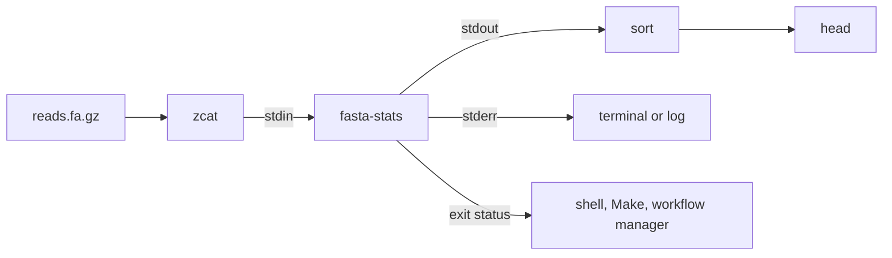

---
aliases:
  - CLI
  - Command-Line Tool
  - Interface en ligne de commande
tags:
  - type/concept
  - domain/computer-science
  - domain/bioinformatics
  - level/L1
  - level/L2
  - level/L3
mastery: 0
prerequisites:
  - "[[Python Programming]]"
  - "[[Iterator]]"
  - "[[File Input and Output]]"
  - "[[Unix Shell]]"
related:
  - "[[Process (Computing)]]"
  - "[[Unix Text Processing]]"
  - "[[Shell Script]]"
  - "[[Python Packaging]]"
  - "[[Unit Testing]]"
  - "[[Layered Architecture]]"
  - "[[Workflow Management System]]"
  - "[[Bioinformatics Pipeline]]"
  - "[[FASTA Format]]"
  - "[[Regular Expression]]"
projects:
  - "[[01-dna-engine]]"
sources:
  - "[[Python Documentation]]"
  - "[[MIT - The Missing Semester of Your CS Education]]"
  - "[[Bioinformatics Data Skills (Buffalo)]]"
  - "[[Research Software Engineering with Python (Irving)]]"
  - "[[Sandve 2013 - Ten Simple Rules for Reproducible Computational Research]]"
---

# Command-Line Interface

> [!abstract]
> A command-line interface is a program's text contract with the shell: arguments in, data on standard input and output, messages on standard error, and an exit status that says whether it worked; respect it and your tool composes with every other tool in a pipeline.

## Definition

A **command-line interface** (CLI) exposes a program through text: the caller passes **arguments** (positional values and named options), the program reads **standard input** (stdin), writes results to **standard output** (stdout) and diagnostics to **standard error** (stderr), and returns an integer **exit status** to its parent process, where 0 means success and any other value failure.[^missing][^sys] The shell connects programs by redirecting these streams to files or, with a pipe `|`, the stdout of one program to the stdin of the next.[^missing][^buffalo]

## Why it matters

- **The field runs on pipelines.** Day-to-day bioinformatics chains command-line tools and Unix utilities over large text files such as FASTA, FASTQ and SAM ([[Unix Text Processing]], [[Bioinformatics Pipeline]]).[^buffalo] A Python tool that behaves like `sort` or `grep` slots into those chains.
- **Callers see only the contract.** A shell script, a Makefile or a [[Workflow Management System]] knows a step through its command line, its files and streams and its exit status. A tool that prints an error but exits 0 lets the pipeline continue on garbage.
- **Reproducibility.** A command with explicit parameters replaces manual steps and documents how a result was produced; reporting the tool's version helps archive exact program versions (rules 1 to 3 of Sandve et al.).[^sandve]
- **Lab.** [[01-dna-engine]] ships a CLI next to its Python API.

## Core (L1)

**Anatomy of a call.**

| Element | Example | In Python |
|---|---|---|
| Program | `fasta-stats` | `sys.argv[0]`, `prog=` |
| Positional argument | `reads.fa` | `add_argument("fasta", nargs="*")` |
| Option with value | `--min-length 100` | `add_argument("--min-length", type=int)` |
| Flag | `--version`, `-h` | `action="version"`, automatic `-h` |
| stdin / stdout / stderr | `< in.fa`, `> out.tsv`, `2> log.txt` | `sys.stdin`, `print()`, `print(..., file=sys.stderr)` |
| Exit status | `$?` in bash | `return` code of `main`, `sys.exit(code)` |

`argparse` builds the parser, the `--help` text and the usage errors from these declarations; on an invalid command line it prints the usage and exits with status 2.[^argparse] `sys.exit(0)` is success; nonzero values signal abnormal termination to the shell, and only 0 to 127 are portable.[^sys]

**Five rules of a pipe-friendly tool.**

1. **Data on stdout, everything else on stderr**, so `> out.tsv` captures only results.
2. **Read stdin** when no file is given or the file is `-`, the convention also used by the standard library's `fileinput`.[^fileinput]
3. **Stream** record by record with a generator ([[Iterator]]): memory stays constant and `| head` can stop early.
4. **Exit status**: 0 success, 1 for a data or file error, 2 for a usage error (argparse's choice).
5. **No prompts, machine-readable output**: a TSV with one header line, no colors, no progress bars on stdout.



## Deeper (L2)

**Test `main` in-process.** `main(argv)` takes the argument list and returns the status, so a test calls it directly with captured stdout instead of spawning a process (Exercise 2, [[Unit Testing]]); `python3 fasta_stats.py` only adds the thin `sys.exit(main())` wrapper.

**Broken pipes.** When the reader closes its end early, as `head` does after a few lines, the writer gets the `SIGPIPE` signal and Python raises `BrokenPipeError`; the documentation's recipe redirects stdout to `os.devnull` and exits, and warns against restoring the default `SIGPIPE` handling.[^signal] Without it, `python3 -c 'for i in range(10**6): print(i)' | head -n 1` prints `0`, then a `BrokenPipeError` traceback on stderr. `fasta-stats` catches `BrokenPipeError` before its generic `OSError` handler, so that a closed pipe is not reported as an input error.

**Exit status through a pipe.** By default a bash pipeline reports the status of its **last** command; `set -o pipefail` makes a failure anywhere visible.[^buffalo] On an invalid FASTA (sequence before the first header):

```text
$ python3 fasta_stats.py bad.fa | sort > out.tsv; echo "exit=$? lines=$(wc -l < out.tsv)"
exit=0 lines=1
[stderr] fasta-stats: error: sequence data before the first '>' header

$ set -o pipefail; python3 fasta_stats.py bad.fa | sort > out.tsv; echo "exit=$? lines=$(wc -l < out.tsv)"
exit=1 lines=1
[stderr] fasta-stats: error: sequence data before the first '>' header
```

Without `pipefail`, the script sees success and a one-line `out.tsv`. See [[Shell Script]] for `set -euo pipefail`.

**Typer.** Typer, a third-party library (0.27.2 here), derives the parser from a function signature and its type hints: the parameter `min_length: int = 0` becomes the option `--min-length`.

```python
import sys
import typer
from fasta_stats import gc_fraction, read_fasta


def main(min_length: int = 0) -> None:
    """Length and GC content of each FASTA record read on stdin, as TSV."""
    for ident, seq in read_fasta(sys.stdin):
        if len(seq) >= min_length:
            print(f"{ident}\t{len(seq)}\t{gc_fraction(seq):.3f}")


typer.run(main)
```

`python3 typer_stats.py --min-length 10 < toy.fa` prints the `seqA` and `seqB` rows and exits 0; `--min-length ten` exits with status 2 and the message "Invalid value for '--min-length': 'ten' is not a valid int." on stderr.

Same contract (status 2 on a usage error), less boilerplate, one more dependency to pin. `argparse` is enough for a few options; Typer pays off with subcommands and many typed parameters.

**Install it as a command.** Packaging can expose `main` as an entry point, so users type `fasta-stats` rather than `python3 fasta_stats.py` ([[Python Packaging]]).[^irving]

## Advanced (L3)

**A CLI as a workflow step.** A workflow manager reruns, parallelizes and resumes steps, which works only if each step is a pure function of its declared inputs:

- **Explicit inputs and outputs**: every path on the command line, nothing read from hidden locations or the current directory by convention ([[Data Provenance]]).
- **Determinism**: same inputs and parameters, same bytes out (sorted output, fixed seeds, no timestamps in data).
- **Version on demand**: `--version`, recorded with the results, as part of archiving the exact programs used.[^sandve]
- **Fail loudly and atomically**: nonzero status on any failure, and no half-written output file. Write to a temporary file in the target directory, then rename it with `os.replace`, which is atomic on POSIX systems (Exercise 4).[^os]

**Thin interface, thick library.** The CLI parses arguments, opens streams, formats output and maps exceptions to statuses; the computation lives in importable functions (`read_fasta`, `gc_fraction`) that the CLI, the Python API, a notebook and the tests share ([[Layered Architecture]]).

## Mathematical representation

- A run of a CLI program is a function $P(\text{argv}, \text{stdin}, \text{env}) = (\text{stdout}, \text{stderr}, s)$ with exit status $s$, portably $s \in \{0, \dots, 127\}$, success iff $s = 0$.[^sys]
- A **filter** maps a sequence of input records $r_1, r_2, \dots$ to a sequence of output records. Call it **streaming** if the output emitted after reading $r_1, \dots, r_i$ depends only on $r_1, \dots, r_i$. Then memory is $O(\max_i |r_i|)$ instead of $O(\sum_i |r_i|)$, and a downstream `head -n m` lets it stop after $O(m)$ records. `fasta-stats` is streaming; `sort` is not (its first output line may depend on the last input line).
- A pipeline $f_1 \mid f_2 \mid \dots \mid f_n$ computes $f_n \circ \dots \circ f_1$ on the stream. In bash, its status is $s_n$ by default; with `pipefail`, it is the status of the last command that failed, or 0 (observed in Deeper and in the worked example).[^buffalo]

## Computational representation

The full tool, standard library only (outputs from Python 3.11):

```python
#!/usr/bin/env python3
"""fasta-stats: length and GC content of each FASTA record, as TSV."""
import argparse
import contextlib
import os
import sys
from collections.abc import Iterator
from typing import TextIO

__version__ = "0.1.0"


def read_fasta(handle: TextIO) -> Iterator[tuple[str, str]]:
    """Yield (identifier, sequence) one record at a time: constant memory per record."""
    ident, chunks = None, []
    for line in handle:
        line = line.rstrip()
        if line.startswith(">"):
            if ident is not None:
                yield ident, "".join(chunks)
            ident, chunks = (line[1:].split() or [""])[0], []
        elif line:
            if ident is None:
                raise ValueError("sequence data before the first '>' header")
            chunks.append(line)
    if ident is not None:
        yield ident, "".join(chunks)


def gc_fraction(seq: str) -> float:
    s = seq.upper()
    acgt = sum(s.count(b) for b in "ACGT")
    return (s.count("G") + s.count("C")) / acgt if acgt else 0.0


def build_parser() -> argparse.ArgumentParser:
    p = argparse.ArgumentParser(prog="fasta-stats", description="Length and GC content of each FASTA record, as TSV.")
    p.add_argument("fasta", nargs="*", default=["-"],
                   help="FASTA files; '-' or none reads standard input")
    p.add_argument("--min-length", type=int, default=0, metavar="N",
                   help="skip records shorter than N (default: 0)")
    p.add_argument("--version", action="version", version=f"%(prog)s {__version__}")
    return p


def main(argv: list[str] | None = None) -> int:
    parser = build_parser()
    args = parser.parse_args(argv)                  # usage error: message + exit status 2
    if args.min_length < 0:
        parser.error("--min-length must be >= 0")
    print("id\tlength\tgc")
    try:
        for path in args.fasta:
            source = contextlib.nullcontext(sys.stdin) if path == "-" else open(path)
            with source as handle:
                for ident, seq in read_fasta(handle):
                    if len(seq) >= args.min_length:
                        print(f"{ident}\t{len(seq)}\t{gc_fraction(seq):.3f}")
    except BrokenPipeError:                         # not an input error: handled below
        raise
    except (OSError, ValueError) as err:            # file or data problem: exit status 1
        print(f"fasta-stats: error: {err}", file=sys.stderr)
        return 1
    return 0


if __name__ == "__main__":
    try:
        sys.exit(main())
    except BrokenPipeError:                         # reader closed the pipe (| head)
        devnull = os.open(os.devnull, os.O_WRONLY)
        os.dup2(devnull, sys.stdout.fileno())
        sys.exit(1)
```

`contextlib.nullcontext(sys.stdin)` lets one `with` statement handle both cases without closing stdin. Runs on an invented `toy.fa` (`seqA` 17 nt, `seqB` 16 nt with `N` and lowercase, `seqC` 2 nt):

```text
$ cat toy.fa | python3 fasta_stats.py
id	length	gc
seqA	17	0.471
seqB	16	0.167
seqC	2	1.000

$ python3 fasta_stats.py --min-length ten toy.fa; echo "exit=$?"
exit=2
[stderr] usage: fasta-stats [-h] [--min-length N] [--version] [fasta ...]
fasta-stats: error: argument --min-length: invalid int value: 'ten'

$ python3 fasta_stats.py missing.fa > out.tsv; echo "exit=$?"
exit=1
[stderr] fasta-stats: error: [Errno 2] No such file or directory: 'missing.fa'
```

The error of the third run reaches the terminal although stdout goes to `out.tsv`: that is the point of stderr. `--help` prints the usage line, the description and one line per argument, all generated from the declarations; `--version` prints `fasta-stats 0.1.0`.

## Worked example

> [!example] Top GC records of a compressed file
> Data: 200 000 random 60-nt records (invented, `random.seed(1)`), gzip-compressed.
> ```text
> $ zcat big.fa.gz | python3 fasta_stats.py | tail -n +2 | sort -t$'\t' -k3,3gr | head -n 3; echo "exit=${PIPESTATUS[*]}"
> r63099	60	0.783
> r108279	60	0.767
> r167849	60	0.767
> exit=0 0 0 141 0
> ```
> 1. `zcat` decompresses to stdout; `fasta-stats` reads stdin because it got no file argument.
> 2. `tail -n +2` drops the TSV header; `sort -t$'\t' -k3,3gr` sorts on column 3 (GC), general numeric, reversed.
> 3. `head -n 3` exits after three lines. `PIPESTATUS` lists every status: `sort`, still writing, was stopped by the closed pipe (141). Under `set -o pipefail` this pipeline would therefore **fail** although the answer is right: a known trap when combining `pipefail` with `head`.
> 4. Memory: `fasta-stats` holds one record at a time; only `sort` holds the 200 000 lines.

## Common misconceptions

> [!warning] "A progress message is just a `print`"
> `print` writes to stdout, so the message ends up inside `out.tsv` or in the next tool's input. Diagnostics go to stderr.

> [!warning] "The error message is enough"
> Scripts and workflow managers read the exit status, not the text. Printing an error and returning 0 makes the failure invisible; without `pipefail`, even a nonzero status in the middle of a pipe is hidden.

> [!warning] "`BrokenPipeError` means my tool is broken"
> It means the reader stopped reading, which `head` does on purpose. Handle it as the Python documentation recommends, and do not report it as an input error.[^signal]

> [!warning] "`type=int` validates the option"
> It checks the syntax only. Semantic checks (`>= 0`, file exists, choices compatible) need explicit code and `parser.error`, which keeps status 2 for usage errors.[^argparse]

## Exercises

> [!question] Exercise 1 (L1)
> For `fasta-stats`, say which stream receives (a) the TSV rows, (b) "skipped 3 records shorter than 100 nt", (c) the usage message after a misspelled option, and which exit status follows (d) a successful run, (e) `--min-lenght 5`, (f) an unreadable file.

> [!success]- Solution
> (a) stdout; (b) stderr, it is a diagnostic; (c) stderr (argparse writes usage errors there). (d) 0; (e) 2, argparse's usage error;[^argparse] (f) 1, the tool's convention for data and file errors. Any nonzero value means failure to the shell;[^sys] distinct values help a caller tell "you called me wrong" from "your data is wrong".

> [!question] Exercise 2 (L2, Python)
> Write tests for `main` that check: the output rows for `--min-length 10 toy.fa`, status 2 and the message for `--min-length ten`, status 1 for a missing file.

> [!success]- Solution
> ```python
> import contextlib
> import io
> from fasta_stats import main
>
> def run(argv):
>     out, err = io.StringIO(), io.StringIO()
>     with contextlib.redirect_stdout(out), contextlib.redirect_stderr(err):
>         try:
>             code = main(argv)
>         except SystemExit as exc:        # argparse exits on usage errors
>             code = exc.code
>     return code, out.getvalue(), err.getvalue()
>
> code, out, err = run(["--min-length", "10", "toy.fa"])
> assert code == 0 and out.splitlines()[1:] == ["seqA\t17\t0.471", "seqB\t16\t0.167"]
> code, out, err = run(["--min-length", "ten"])
> assert code == 2 and "invalid int value" in err
> code, out, err = run(["missing.fa"])
> assert code == 1 and err.startswith("fasta-stats: error:")
> print("all tests passed")   # all tests passed
> ```
> Because `main` takes `argv` and returns a status, no subprocess is needed; usage errors surface as `SystemExit(2)`.

> [!question] Exercise 3 (L2)
> A colleague's script runs `python3 fasta_stats.py sample.fa | sort > stats.tsv && echo done`. On a corrupt `sample.fa` it prints the error **and** `done`. Explain, and fix it.

> [!success]- Solution
> The pipeline's status is `sort`'s (0), so `&&` continues; `stats.tsv` holds only the header (see Deeper). Fix: start the script with `set -euo pipefail` ([[Shell Script]]), or avoid the pipe (`fasta-stats` output to a file, then sort). With `pipefail`, beware of pipelines ending in `head`, which can report 141 for a correct result (worked example).[^buffalo]

> [!question] Exercise 4 (L3, Python)
> Implement `atomic_write(path)`, a context manager such that a failure in the middle of writing leaves no file at `path`, and demonstrate it.

> [!success]- Solution
> ```python
> import os
> import tempfile
> from contextlib import contextmanager
>
> @contextmanager
> def atomic_write(path: str):
>     """Write to a temporary file in the same directory, then rename it over path."""
>     fd, tmp = tempfile.mkstemp(dir=os.path.dirname(os.path.abspath(path)), suffix=".tmp")
>     try:
>         with os.fdopen(fd, "w") as handle:
>             yield handle
>         os.replace(tmp, path)              # atomic on POSIX
>     except BaseException:
>         os.unlink(tmp)
>         raise
>
> try:
>     with atomic_write("result.tsv") as out:
>         out.write("id\tlength\tgc\n")
>         raise ValueError("bad record halfway")
> except ValueError as err:
>     print("failed:", err, "| result.tsv exists:", os.path.exists("result.tsv"))
> with atomic_write("result.tsv") as out:
>     out.write("id\tlength\tgc\nseqA\t17\t0.471\n")
> print(open("result.tsv").read(), end="")
> ```
> ```text
> failed: bad record halfway | result.tsv exists: False
> id	length	gc
> seqA	17	0.471
> ```
> The temporary file lives in the target directory because a rename is atomic only within one file system.[^os] A workflow manager that checks for the output file never sees a truncated result.

## Mastery checklist

- [ ] 1 Recognized: I can name the parts of a command line, the three standard streams and the meaning of an exit status.
- [ ] 2 Understood: I can explain the five rules of a pipe-friendly tool, broken pipes and why `pipefail` matters.
- [ ] 3 Practiced: I can write an `argparse` tool that reads FASTA from stdin or files, streams TSV, and returns 0, 1 or 2, with in-process tests.
- [ ] 4 Applied: the CLI of [[01-dna-engine]] works in a `zcat | tool | sort | head` pipeline and in a workflow rule, with `--version` recorded.
- [ ] 5 Explained: I can teach the CLI as a workflow contract (explicit paths, determinism, atomic outputs) and when Typer is worth a dependency.

## References

[^missing]: [[MIT - The Missing Semester of Your CS Education]], shell and command-line environment lectures: streams, redirection, pipes and exit codes.
[^buffalo]: [[Bioinformatics Data Skills (Buffalo)]], Unix pipelines on bioinformatics files and robust Bash scripts (`set -o pipefail`); chapters not verified.
[^sys]: [[Python Documentation]], Library Reference, `sys.exit`: zero is successful termination, nonzero abnormal termination for shells; most systems require 0 to 127.
[^argparse]: [[Python Documentation]], Library Reference, `argparse`: parser, help and usage generation, `nargs`, `action="version"`, `ArgumentParser.error` (usage message, exit status 2).
[^fileinput]: [[Python Documentation]], Library Reference, `fileinput`: a file name `-` is replaced by `sys.stdin`.
[^signal]: [[Python Documentation]], Library Reference, `signal`, "Note on SIGPIPE": `BrokenPipeError` when piping into `head`, the recommended handler, and why not to restore the default `SIGPIPE` disposition.
[^os]: [[Python Documentation]], Library Reference, `os.replace`: a successful rename is atomic (a POSIX requirement), and may fail across file systems.
[^irving]: [[Research Software Engineering with Python (Irving)]], command-line Python programs and packaging; chapters not verified.
[^sandve]: [[Sandve 2013 - Ten Simple Rules for Reproducible Computational Research]], rules 1 to 3 (record how every result was produced, avoid manual data manipulation steps, archive exact versions of external programs).
