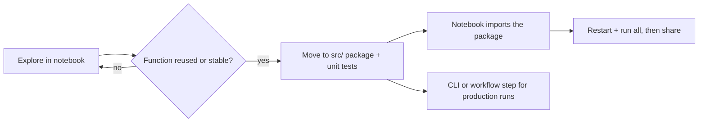

---
aliases:
  - Jupyter Notebook
  - Notebook
  - ipynb
  - Carnet de calcul
tags:
  - type/concept
  - domain/computer-science
  - domain/scientific-practice
  - level/L1
  - level/L2
mastery: 0
prerequisites:
  - "[[Python Programming]]"
  - "[[Scientific Python Ecosystem]]"
related:
  - "[[Computational Reproducibility]]"
  - "[[Exploratory Data Analysis]]"
  - "[[Python Packaging]]"
  - "[[Unit Testing]]"
  - "[[Version Control]]"
  - "[[Dependency Management]]"
  - "[[Command-Line Interface]]"
  - "[[Workflow Management System]]"
  - "[[State Machine]]"
projects: []
sources:
  - "[[Python for Data Analysis (McKinney)]]"
  - "[[Pimentel 2019 - A Large-Scale Study About Quality and Reproducibility of Jupyter Notebooks]]"
  - "[[Rule 2019 - Ten Simple Rules for Writing and Sharing Computational Analyses in Jupyter Notebooks]]"
  - "[[Sandve 2013 - Ten Simple Rules for Reproducible Computational Research]]"
  - "[[Cock 2010 - The Sanger FASTQ File Format]]"
---

# Computational Notebook

> [!abstract]
> A notebook interleaves code, results and prose, which makes it the best tool to explore data and the easiest place to fool yourself: the kernel remembers everything you ran, in the order you ran it, not what the page shows.

## Definition

A **computational notebook** is a document made of cells: code cells, their outputs (text, tables, figures) and narrative text. In **Jupyter**, a separate process, the **kernel**, executes code cells on request and keeps their variables in memory between executions; the Jupyter project is language-agnostic, and IPython provides the Python kernel.[^mck2] The notebook file (`.ipynb`) stores cell sources, outputs and execution counters as JSON (Computational representation).

## Why it matters

- **Exploration.** Loading a count table, plotting a distribution and trying a filter is a loop of seconds in a notebook ([[Exploratory Data Analysis]]).
- **Reproducibility risk, measured.** Of the GitHub notebooks that Pimentel et al. re-executed from a corpus of about 1.4 million, about 24 % ran without errors and about 4 % reproduced their stored results; the main causes were missing dependencies, hidden state and out-of-order execution, and inaccessible data.[^pimentel]
- **Where code should not stay.** Rules for notebooks in computational biology ask to modularize code, record dependencies, use version control and build pipelines,[^rule] in line with the general rules of keeping track of how every result was produced and versioning all custom scripts.[^sandve]

## Core (L1)

**The kernel model.** The kernel's state is the effect of **every cell executed so far, in execution order**, including cells since edited or deleted. The number in `In [n]` records when a cell last ran; the page shows the current source of each cell, not the history.

**Hidden state, simulated.** A kernel is one namespace that cells mutate (outputs from Python 3.11):

```python
CELLS = {                                          # an invented notebook, top to bottom
    1: 'raw = "II?5+I#"                       # quality line of one read (invented)',
    2: "quals = [ord(c) for c in raw]",
    3: "quals = [q - 33 for q in quals]          # decode Phred+33",
    4: "mean_q = sum(quals) / len(quals)",
}


def run(order: list[int]) -> dict:
    """Execute cells in the given order in ONE namespace, like a kernel."""
    namespace: dict = {}
    for i in order:
        exec(CELLS[i], namespace)
    return namespace


print("restart & run all:", round(run([1, 2, 3, 4])["mean_q"], 1))
print("cell 3 run twice: ", round(run([1, 2, 3, 3, 4])["mean_q"], 1))
ns = run([1, 2, 3, 4])
del CELLS[1]                                       # delete a cell: its variable survives
print("'raw' still in kernel:", "raw" in ns)
try:
    run([2, 3, 4])
except NameError as err:
    print("fresh kernel:", err)
```

```text
restart & run all: 26.0
cell 3 run twice:  -7.0
'raw' still in kernel: True
fresh kernel: name 'raw' is not defined
```

Re-running cell 3 subtracts the Phred+33 offset[^cock] a second time: the page still looks correct, the number is wrong. Deleting cell 1 changes nothing in the live kernel, but the notebook no longer runs from scratch. These are the "hidden states and out-of-order executions" that broke notebooks in the large study.[^pimentel]

**Hygiene, from day one.**

1. **Restart the kernel and run all cells** before trusting a result, sharing, or committing.
2. **Imports and parameters in the first cells** (paths, thresholds, random seeds; recording seeds is rule 6 of Sandve et al.).[^sandve]
3. **Idempotent cells**: never overwrite a variable with a transformation of itself (`quals = f(quals)`); give the result a new name (`phred = f(quals)`), so re-running a cell is harmless.
4. **Relative paths and documented inputs**: the notebook must find its data on another machine.
5. **Record dependencies** (a lock file of the project, not `pip install` cells).[^rule]



## Deeper (L2)

**The file is JSON.** Written with `nbformat` 5.11.1:

```python
import json
import nbformat

nb = nbformat.v4.new_notebook()
nb.cells = [nbformat.v4.new_markdown_cell("# GC exploration"),
            nbformat.v4.new_code_cell('raw = "II?5+I#"', execution_count=1),
            nbformat.v4.new_code_cell("quals = [ord(c) - 33 for c in raw]", execution_count=5),
            nbformat.v4.new_code_cell("mean_q = sum(quals) / len(quals)\nmean_q", execution_count=3,
                                      outputs=[nbformat.v4.new_output("execute_result", {"text/plain": "26.0"}, execution_count=3)])]
nbformat.write(nb, "explore.ipynb")
data = json.load(open("explore.ipynb"))
print(sorted(data), data["nbformat"])
cell = data["cells"][3]
print(sorted(cell))
print(cell["execution_count"], cell["outputs"][0]["data"])
```

```text
['cells', 'metadata', 'nbformat', 'nbformat_minor'] 4
['cell_type', 'execution_count', 'id', 'metadata', 'outputs', 'source']
3 {'text/plain': ['26.0']}
```

Consequences: outputs, including images and printed data, live **inside** the file, so diffs are noisy and sensitive data can leak into a repository; clear outputs before committing, or commit the package code and treat the notebook as a report ([[Version Control]]). The execution counters are stored too, which makes out-of-order runs detectable after the fact (Exercise 3).

**Move stable code into a tested package.** When a function is reused across notebooks, or a result depends on it, move it to a module under `src/` ([[Python Packaging]]), test it ([[Unit Testing]]), and import it from the notebook: rule 4, "modularize code".[^rule] The worked example does this for `decode_phred`.

**From notebook to pipeline.** Steps that must run again on new data (all samples, every release) become [[Command-Line Interface|command-line tools]] chained by a [[Workflow Management System]]: rule 7, "build a pipeline".[^rule] The notebook keeps the exploration and the narrative.

## Mathematical representation

Model the kernel as a [[State Machine]]: a state $S$ (the namespace), an initial state $S_0$, and each code cell $i$ as a function $c_i : S \mapsto S'$. An execution history $h = (i_1, \dots, i_m)$ yields
$$S_h = c_{i_m} \circ \dots \circ c_{i_1}(S_0),$$
while a reader of the notebook assumes the top-to-bottom result $S^* = c_n \circ \dots \circ c_1(S_0)$. The notebook is **consistent** when $S_h = S^*$; "restart and run all" sets $h = (1, \dots, n)$ and guarantees it. A cell is **idempotent** when $c \circ c = c$; cell 3 above is not ($c_3 \circ c_3$ subtracts 66), so any history repeating it diverges. With execution counters $e_1, \dots, e_n$ stored in the file, a fresh top-to-bottom run is exactly $e_j = j$ for every code cell $j$.

## Computational representation

Notebook code that has moved into a package, `src/qctools/phred.py`, with its tests:

```python
def decode_phred(quality: str, offset: int = 33) -> list[int]:
    """Phred scores from a FASTQ quality string (Phred+33 by default)."""
    scores = [ord(c) - offset for c in quality]
    if any(q < 0 for q in scores):
        raise ValueError(f"character below offset {offset} in {quality!r}")
    return scores
```

```python
# tests/test_phred.py
import pytest
from qctools.phred import decode_phred

def test_known_values():
    assert decode_phred("II?5+I#") == [40, 40, 30, 20, 10, 40, 2]

def test_empty():
    assert decode_phred("") == []

def test_rejects_below_offset():
    with pytest.raises(ValueError):
        decode_phred("II ")
```

```text
$ PYTHONPATH=src python -m pytest -q tests
...                                                                      [100%]
3 passed in 0.02s
```

## Worked example

> [!example] Rescuing a quality-control notebook
> 1. **Symptom.** A colleague's notebook reports a mean read quality of −7 in one run and 26 in another. The cells look right.
> 2. **Diagnosis.** The execution counters are not in page order, and cell 3, `quals = [q - 33 for q in quals]`, is not idempotent: run twice, it subtracts the offset twice (simulation above).
> 3. **Fix the cell.** `phred = [q - 33 for q in quals]`, and cell 4 averages `phred`. Restart and run all: 26.0, every time.
> 4. **Promote the code.** Decoding qualities will be needed in every QC notebook, so `decode_phred` moves to `src/qctools/phred.py` with three tests (known values, empty input, invalid character); the notebook now starts with `from qctools.phred import decode_phred`.
> 5. **Share.** Lock dependencies, clear outputs or regenerate them with a top-to-bottom run, commit. The notebook is now a readable report on top of tested code.

## Common misconceptions

> [!warning] "The notebook shows what was computed"
> It shows the current source of each cell. The results come from the execution history, which may include edited, repeated or deleted cells.

> [!warning] "Notebooks cannot be reproducible"
> The measured failures had concrete causes: missing dependencies, hidden state and out-of-order execution, inaccessible data.[^pimentel] A notebook that runs top to bottom in a fresh kernel, with locked dependencies and documented inputs, reproduces.

> [!warning] "Restart and run all is enough"
> It removes hidden state, not missing dependencies or data that only exist on your laptop. Version the environment and the inputs too.[^sandve][^rule]

## Exercises

> [!question] Exercise 1 (L1)
> With the four cells of the simulation, predict `mean_q` after the history 1, 2, 3, 4, 3, 4, and explain what a reader of the saved notebook would see.

> [!success]- Solution
> The second run of cell 3 subtracts 33 from every score again: mean $26 - 33 = -7.0$. The saved notebook shows the four cell sources, cell 4's output −7.0, and counters 1, 2, 5, 6: increasing, but with a gap where cells 3 and 4 first ran. Nothing in the code explains −7: only the counters betray the history (Exercise 3 flags it).

> [!question] Exercise 2 (L1)
> Rewrite cells 2 to 4 so that any order of re-execution after cell 1 gives the same mean, provided each cell has run at least once in page order.

> [!success]- Solution
> `codes = [ord(c) for c in raw]`, `phred = [q - 33 for q in codes]`, `mean_q = sum(phred) / len(phred)`. Each cell reads only variables defined by earlier cells and never rebinds them, so each is idempotent ($c \circ c = c$), and re-running any cell recomputes the same value.

> [!question] Exercise 3 (L2, Python)
> Write `execution_problems(path)`, which flags a notebook whose code cells were not executed top to bottom in one fresh kernel session, and test it on `explore.ipynb` above.

> [!success]- Solution
> ```python
> def execution_problems(path: str) -> list[str]:
>     cells = [c for c in json.load(open(path))["cells"] if c["cell_type"] == "code"]
>     counts = [c["execution_count"] for c in cells]
>     problems = []
>     if None in counts:
>         problems.append("unexecuted code cell")
>     seen = [n for n in counts if n is not None]
>     if seen != sorted(seen):
>         problems.append(f"out of order: {seen}")
>     if seen and seen != list(range(1, len(seen) + 1)):
>         problems.append(f"not a fresh top-to-bottom run: expected {list(range(1, len(seen) + 1))}")
>     return problems
>
> print(execution_problems("explore.ipynb"))
> # ['out of order: [1, 5, 3]', 'not a fresh top-to-bottom run: expected [1, 2, 3]']
> ```
> After renumbering the counters 1, 2, 3 (as a fresh run would), it returns `[]`. Run it in continuous integration on every committed notebook. It checks the order only; whether the notebook still runs needs an actual top-to-bottom execution.

> [!question] Exercise 4 (L2)
> Map each failure cause found by Pimentel et al. to one practice that prevents it.

> [!success]- Solution
> Missing dependencies → a locked environment recorded with the project ([[Dependency Management]]; "record dependencies").[^rule] Hidden state and out-of-order execution → idempotent cells and restart-and-run-all before sharing, checked in CI (Exercise 3). Inaccessible data → relative paths, documented download steps with accessions and versions, and a pipeline that fetches inputs ([[Data Provenance]]).[^pimentel][^sandve]

> [!question] Exercise 5 (L2)
> Sort into "package", "notebook" or "workflow": (a) `decode_phred`; (b) a histogram of per-read mean quality for one run; (c) trimming all 96 samples of a sequencing run every week; (d) a one-off comparison of two trimming thresholds; (e) a function that parses sample sheets, used in three notebooks.

> [!success]- Solution
> Package: (a) and (e), reused code that needs tests. Notebook: (b) and (d), exploration and narrative. Workflow: (c), a repeated production step built from package functions exposed as [[Command-Line Interface|CLIs]].

## Mastery checklist

- [ ] 1 Recognized: I can describe cells, kernel, outputs and execution counters, and what an `.ipynb` file contains.
- [ ] 2 Understood: I can explain hidden state and out-of-order execution with an example, and why the page can disagree with the kernel.
- [ ] 3 Practiced: I write idempotent cells, restart and run all before sharing, and can check execution order programmatically.
- [ ] 4 Applied: my Lab notebooks import tested package code and run top to bottom in a fresh environment.
- [ ] 5 Explained: I can teach the evidence on notebook reproducibility and the path from notebook to package to pipeline.

## References

[^mck2]: [[Python for Data Analysis (McKinney)]], 3rd ed., ch. 2 "Python Language Basics, IPython, and Jupyter Notebooks": the Jupyter notebook, kernels, IPython.
[^pimentel]: [[Pimentel 2019 - A Large-Scale Study About Quality and Reproducibility of Jupyter Notebooks]], MSR 2019: about 1.4 million GitHub notebooks; about 24 % of re-executed notebooks ran without errors and about 4 % produced the same results; causes of failure.
[^rule]: [[Rule 2019 - Ten Simple Rules for Writing and Sharing Computational Analyses in Jupyter Notebooks]], *PLoS Computational Biology* 15(7):e1007007: rules 4 (modularize code), 5 (record dependencies), 6 (use version control) and 7 (build a pipeline).
[^sandve]: [[Sandve 2013 - Ten Simple Rules for Reproducible Computational Research]], rules 1 (keep track of how every result was produced), 4 (version control all custom scripts) and 6 (note random seeds).
[^cock]: [[Cock 2010 - The Sanger FASTQ File Format]], *Nucleic Acids Research* 38(6):1767-1771: Sanger FASTQ qualities encoded as Phred + 33.
