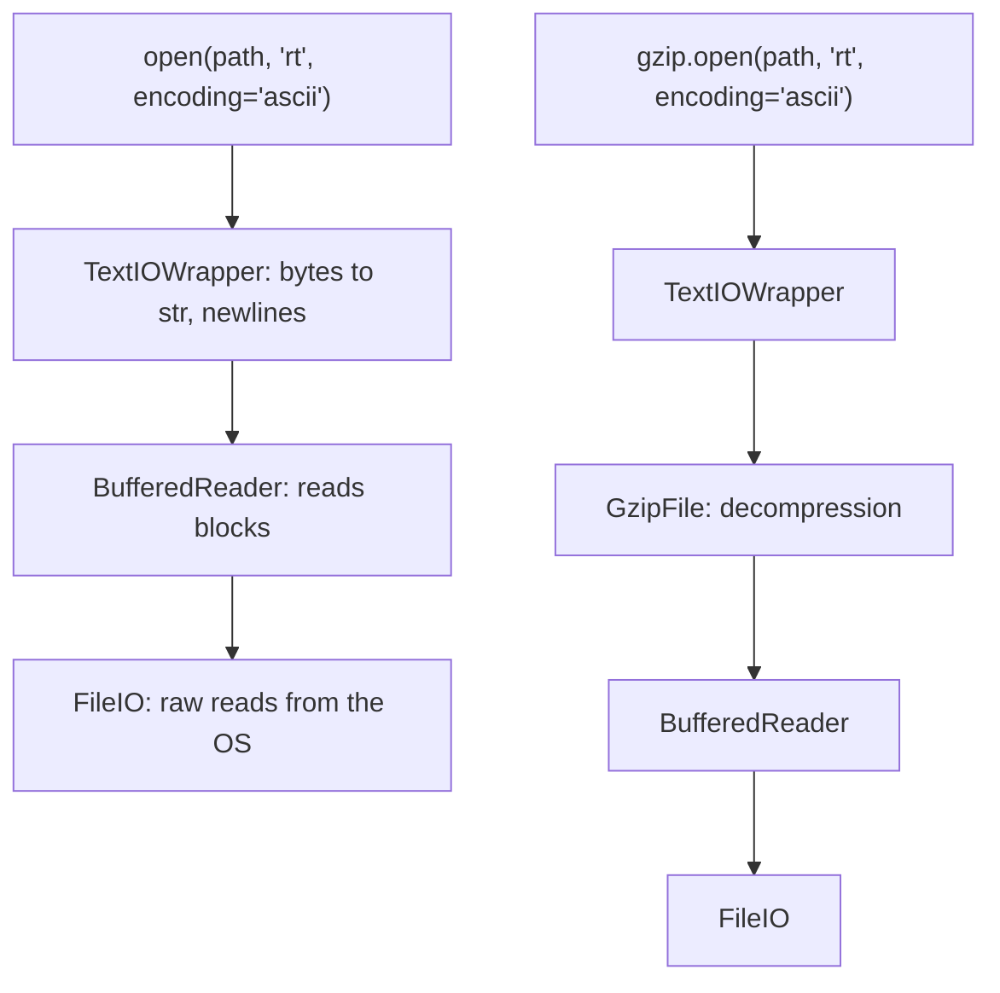

---
aliases:
  - File I/O
  - Text and Binary Files
  - Character Encoding
  - pathlib
  - gzip
  - Entrées-sorties fichiers
tags:
  - type/concept
  - domain/computer-science
  - domain/bioinformatics
  - level/L1
  - level/L2
  - level/L3
mastery: 0
prerequisites:
  - "[[Python Programming]]"
  - "[[Iterator]]"
  - "[[String]]"
related:
  - "[[FASTA Format]]"
  - "[[FASTQ Format]]"
  - "[[File System]]"
  - "[[Data Compression]]"
  - "[[Genomic File Indexing]]"
  - "[[Delimited Text Format]]"
  - "[[Command-Line Interface]]"
  - "[[Workflow Management System]]"
projects:
  - "[[01-dna-engine]]"
  - "[[10-genomic-pipeline]]"
sources:
  - "[[Python Documentation]]"
  - "[[GA4GH hts-specs]]"
  - "[[Bioinformatics Data Skills (Buffalo)]]"
  - "[[Python for Data Analysis (McKinney)]]"
  - "[[Information Theory, Inference, and Learning Algorithms (MacKay)]]"
---

# File Input and Output

> [!abstract]
> A file is a sequence of bytes: open it in binary mode to get those bytes, in text mode with an explicit encoding to get characters, through `gzip` to decompress on the fly, always inside a `with` block that closes it, and name it with `pathlib` paths rather than strings.

## Definition

Python's `io` module distinguishes **text I/O** (`str` in and out, with encoding, decoding and newline translation), **binary** or buffered I/O (`bytes`) and **raw** I/O, the unbuffered layer under both; `open()` returns one of these file objects according to its mode (`"r"`, `"w"`, `"x"`, `"a"`, plus `"b"` for binary or `"t"` for text).[^io][^open] An **encoding** maps characters to bytes; in text mode without an explicit `encoding`, Python 3.13 uses the platform's locale encoding.[^open] A **context manager** (`with open(...) as fh:`) closes the file when the block exits, even after an exception.[^tutorial] `pathlib.Path` objects represent file-system paths with methods for joining, inspecting and listing them.[^pathlib] `gzip.open` reads and writes gzip-compressed files as binary or text streams.[^gzip]

## Why it matters

- Every analysis starts by reading sequence, annotation or table files and ends by writing results ([[FASTA Format]], [[FASTQ Format]], [[Delimited Text Format]]). A wrong mode or encoding corrupts data quietly.
- Sequencing files are routinely gzip-compressed (see [[FASTQ Format]]), and BAM, tabix-indexed VCF and BED files use **BGZF**, a series of concatenated gzip blocks that standard gzip readers can decompress.[^hts]
- Metadata (sample sheets, clinical tables) is where non-ASCII text appears: accents, byte order marks, legacy encodings.
- Indexes ([[Genomic File Indexing]]) are byte offsets, which only binary mode gives reliably.
- Pipelines need outputs that are either complete or absent, never half-written ([[Workflow Management System]], [[10-genomic-pipeline]]).

## Core (L1)



Text streams are layered over binary streams; `gzip.open` in text mode wraps a `GzipFile` in a `TextIOWrapper`.[^io][^gzip]

**Five rules.**

1. **Always `with`.** Without it, written data may not be completely flushed to disk.[^tutorial]
2. **Always pass `encoding=`.** Sequence formats are ASCII; tables and metadata are usually UTF-8. Running with `-X warn_default_encoding` emits an `EncodingWarning` wherever it is missing.[^io]
3. **Text for text, bytes for bytes.** `"rt"` for FASTA, FASTQ, CSV; `"rb"` for checksums, magic numbers, offsets and binary formats ([[String]] for `str` versus `bytes`).[^mck3]
4. **Iterate, do not slurp.** `for line in fh` streams; `fh.read()` or `fh.readlines()` loads everything ([[Iterator]]).
5. **Paths are objects.** `Path` joins with `/`, and exposes `.name`, `.stem`, `.suffix`, `.suffixes`, `.parent`, `.exists()`, `.glob()`, `.mkdir(parents=True, exist_ok=True)`, `.read_text()`, `.open()`.[^pathlib]

```python
import gzip
import tempfile
from pathlib import Path

tmp = Path(tempfile.mkdtemp())
out_dir = tmp / "results" / "sample_A"
out_dir.mkdir(parents=True, exist_ok=True)                      # like mkdir -p
fasta = out_dir / "contigs.fa"
with fasta.open("w", encoding="ascii") as fh:                   # text mode, explicit encoding
    fh.write(">c1 toy\nACGTNACGT\n>c2\nGGCC\n")                  # invented
with fasta.open(encoding="ascii") as fh:                         # closed when the block ends
    print([line.rstrip("\n") for line in fh], fh.closed)
print(fh.closed, fasta.name, fasta.stem, fasta.suffix, fasta.parent.name, fasta.stat().st_size)
reads = out_dir / "reads.fastq.gz"
with gzip.open(reads, "wt", encoding="ascii") as fh:            # compress while writing text
    fh.write("@r1\nACGT\n+\nIIII\n")
with gzip.open(reads, "rt", encoding="ascii") as fh:            # decompress while reading text
    print(fh.read().split())
print(reads.suffixes, reads.stem, reads.name.removesuffix(".fastq.gz"))
print(sorted(p.name for p in out_dir.glob("*")))
```

```text
['>c1 toy', 'ACGTNACGT', '>c2', 'GGCC'] False
True contigs.fa contigs .fa sample_A 27
['@r1', 'ACGT', '+', 'IIII']
['.fastq', '.gz'] reads.fastq reads
['contigs.fa', 'reads.fastq.gz']
```

`Path("reads.fastq.gz").stem` is `reads.fastq`: only the last suffix is removed, so strip a known double suffix explicitly.

## Deeper (L2)

- **Newlines.** Reading in text mode with the default `newline=None` translates `\r\n` and `\r` to `\n` (universal newlines); writing translates `\n` to the platform's line separator, so on Windows pass `newline="\n"` to write Unix-style FASTA. `newline=""` disables translation, which the `csv` module requires.[^open][^csv]
- **Encodings and the BOM.** UTF-8 encodes ASCII characters as one byte each and other characters as several. A file may start with a UTF-8 **byte order mark** (`EF BB BF`), a signature that the `utf-8-sig` codec skips on reading and that plain `utf-8` decodes as the character `` glued to the first field (Worked example).[^codecs]
- **Detect compression by content.** A gzip member starts with the identification bytes 31 and 139 (`1f 8b`).[^hts] Checking them beats trusting the file name. A file made of several concatenated gzip members (BGZF, or `cat a.gz b.gz`) reads as one stream.[^gzip][^hts]
- **Offsets need binary mode.** In binary mode, `tell()` is a byte offset that `seek()` accepts later: the basis of FASTA indexes. In text mode, `tell()` returns an opaque number that is generally not a byte count, and it is disabled while iterating with `for line in fh`.[^io]
- **Integrity.** Compare a downloaded file's MD5 or SHA checksum with the one the provider publishes before analysing it;[^buffalo] `hashlib.file_digest` computes it from a binary handle in chunks.[^hashlib]

## Advanced (L3)

- **Atomic outputs.** Write to a temporary file in the destination directory, then `os.replace` it over the target: on POSIX the rename is atomic, so readers see either the old file or the complete new one; across file systems the rename may fail, hence the same directory.[^os] Workflow managers rely on outputs being complete when they exist (Exercise 4).
- **Many outputs at once.** Demultiplexing writes one file per sample; `contextlib.ExitStack` enters a variable number of context managers and closes them all on exit (Exercise 3).[^contextlib]
- **Compression is bounded by entropy.** No lossless code can use fewer bits per symbol, on average, than the entropy of the source ([[Shannon Entropy]]).[^mackay] gzip on random DNA stays above that bound (Mathematical representation); specialized compressors for sequence and quality data exploit structure that gzip ignores ([[Data Compression]]).
- **Streams.** `sys.stdin` and `sys.stdout` are text file objects; their `.buffer` attribute gives the binary layer, needed to pipe gzip or BAM bytes through a tool ([[Command-Line Interface]]).

## Mathematical representation

An encoding is an injective map $e : \Sigma^* \to \{0, \dots, 255\}^*$ from strings to byte strings, applied character by character for UTF-8; decoding is its partial inverse, undefined on invalid byte sequences (hence `UnicodeDecodeError`). For ASCII text, $|e(s)| = |s|$.

For a sequence of independent bases with probabilities $p_A, p_C, p_G, p_T$, the entropy
$$H = -\sum_{x \in \{A, C, G, T\}} p_x \log_2 p_x \ \text{bits per base}$$
is the lower bound on the average code length of any lossless compressor.[^mackay] Uniform bases give $H = 2$ bits, a quarter of the 8 bits of ASCII; an AT-rich source with $p_A = p_T = 0.4$, $p_C = p_G = 0.1$ gives $H = -2(0.4 \log_2 0.4 + 0.1 \log_2 0.1) \approx 1.722$ bits. Measured with CPython 3.13's `gzip` on 1,000,000 invented bases: 2.295 bits per base for the uniform source, 2.069 for the AT-rich one, both above $H$.

## Computational representation

Continuing the session above (`tmp`, `fasta`, `gzip`, `Path`): content-based opening, a multi-member gzip file, byte offsets, and a checksum.

```python
import hashlib

crlf = tmp / "windows.fa"
crlf.write_bytes(b">s1\r\nACGT\r\n")                             # invented, Windows line endings
print(repr(crlf.read_text(encoding="ascii")), repr(crlf.open(encoding="ascii", newline="").read()))

def open_text(path: Path, encoding: str = "ascii"):
    """Open plain or gzip-compressed text, decided by content, not by file name."""
    with open(path, "rb") as fh:
        magic = fh.read(2)
    if magic == b"\x1f\x8b":                                     # gzip identification bytes 31, 139
        return gzip.open(path, "rt", encoding=encoding)
    return open(path, encoding=encoding)

misnamed = tmp / "reads.fastq"                                   # gzip data without .gz
misnamed.write_bytes(gzip.compress(b"@r1\nACGT\n+\nIIII\n") + gzip.compress(b"@r2\nGG\n+\nII\n"))
with open_text(misnamed) as fh:                                  # two gzip members, read as one stream
    print(misnamed.read_bytes()[:2].hex(), [line.rstrip() for line in fh])

offsets = {}                                                     # byte offset of each record's sequence
with open(fasta, "rb") as fh:
    for line in iter(fh.readline, b""):
        if line.startswith(b">"):
            offsets[line[1:].split()[0].decode("ascii")] = fh.tell()
with open(fasta, "rb") as fh:
    fh.seek(offsets["c2"])
    print(offsets, fh.readline())
try:
    with open(fasta, encoding="ascii") as fh:
        for line in fh:
            fh.tell()
except OSError as err:
    print("OSError:", err)

with open(fasta, "rb") as fh:
    print(hashlib.file_digest(fh, "md5").hexdigest())            # compare with the provider's checksum
```

```text
'>s1\nACGT\n' '>s1\r\nACGT\r\n'
1f8b ['@r1', 'ACGT', '+', 'IIII', '@r2', 'GG', '+', 'II']
{'c1': 8, 'c2': 22} b'GGCC\n'
OSError: telling position disabled by next() call
681f34caf20c2a8b0fcaca3d69c2cd8b
```

The offset of `c2`'s sequence is 22: the 8 bytes of `>c1 toy\n`, 10 of `ACGTNACGT\n` and 4 of `>c2\n`. Jumping there with `seek` reads `GGCC` without scanning the file, which is what a FASTA index does at genome scale ([[FASTA Format#Advanced (L3)]]).

## Worked example

> [!example] The sample sheet whose first column vanished (invented file)
> A sample sheet `samples.csv` contains `sample,condition` and `S1,contrôle`, saved with a UTF-8 byte order mark. The script `csv.DictReader(open(path, encoding=...))` then looks up `row["sample"]`.
> ```python
> import csv
>
> sheet = tmp / "samples.csv"
> sheet.write_bytes("sample,condition\nS1,contrôle\n".encode("utf-8-sig"))   # invented, with BOM
> raw = sheet.read_bytes()
> print(raw[:3].hex(), len(raw))
> for enc in ("ascii", "latin-1", "utf-8", "utf-8-sig"):
>     try:
>         with sheet.open(encoding=enc, newline="") as fh:
>             rows = list(csv.DictReader(fh))
>         print(f"{enc:10} {list(rows[0])} {rows[0].get('sample')!r} {list(rows[0].values())[1]!r}")
>     except UnicodeDecodeError as err:
>         print(f"{enc:10} UnicodeDecodeError: {err.reason} at byte {err.start}")
> ```
> ```text
> efbbbf 33
> ascii      UnicodeDecodeError: ordinal not in range(128) at byte 0
> latin-1    ['sample', 'condition'] None 'contrôle'
> utf-8      ['sample', 'condition'] None 'contrôle'
> utf-8-sig  ['sample', 'condition'] 'S1' 'contrôle'
> ```
> 1. **Look at the bytes first**: `ef bb bf` is a UTF-8 BOM, the signature that Python's `utf-8-sig` codec handles.[^codecs] 33 bytes for 30 characters: the BOM (3 bytes) and `ô` (2 bytes) are multi-byte.
> 2. **ASCII** fails at byte 0, the first BOM byte. **Latin-1** never fails (every byte is a character) but produces mojibake: `sample`, `contrôle`.
> 3. **UTF-8** decodes correctly but keeps the BOM as `` in the first header: the column is `'sample'`, so `row["sample"]` is missing although it prints like `sample`.
> 4. **Fix**: read metadata with `encoding="utf-8-sig"`, which also reads files without a BOM, and fail loudly on missing columns ([[Defensive Programming]]).

## Common misconceptions

> [!warning] "`open()` reads UTF-8 by default"
> In Python 3.13 the default text encoding depends on the platform locale.[^open] A script that works on a UTF-8 Linux machine can fail or misread on another system: always pass `encoding=`.

> [!warning] "The `.gz` suffix tells whether a file is compressed"
> File names lie in both directions. Check the first two bytes for `1f 8b`, as `open_text` does.

> [!warning] "`fh.tell()` in text mode gives a byte position"
> It returns an opaque cookie, and it is disabled during line iteration (output above).[^io] Build indexes in binary mode.

## Exercises

> [!question] Exercise 1 (L1)
> Give the `open` or `gzip.open` call for: (a) reading `ref.fa`; (b) appending lines to `log.txt`; (c) creating `out.vcf` and failing if it exists; (d) reading `reads.fastq.gz` as text; (e) computing the MD5 of `reads.fastq.gz`.

> [!success]- Solution
> (a) `open("ref.fa", encoding="ascii")`; (b) `open("log.txt", "a", encoding="utf-8")`; (c) `open("out.vcf", "x", encoding="utf-8")`, where `"x"` refuses to overwrite;[^open] (d) `gzip.open("reads.fastq.gz", "rt", encoding="ascii")`; (e) `open("reads.fastq.gz", "rb")`: the checksum is of the compressed bytes, as published.

> [!question] Exercise 2 (L1)
> From `Path("data/S7_L001_R1.fastq.gz")`, obtain `S7_L001_R1` and the path `data/S7_L001_R1.trimmed.fastq.gz`.

> [!success]- Solution
> `p.name.removesuffix(".fastq.gz")` gives `S7_L001_R1`; then `p.with_name(f"{base}.trimmed.fastq.gz")`. `p.stem` would give `S7_L001_R1.fastq`, and `p.with_suffix(".trimmed.fastq.gz")` would replace only `.gz`, producing `S7_L001_R1.fastq.trimmed.fastq.gz`.

> [!question] Exercise 3 (L2, Python)
> Demultiplex invented reads by their first 4 bases (barcodes `ACGT` → S1, `TTAG` → S2, otherwise `undetermined`) into one gzipped FASTQ per sample, barcode removed, with all files closed on exit.

> [!success]- Solution
> ```python
> from collections import Counter
> from contextlib import ExitStack
>
> barcodes = {"ACGT": "S1", "TTAG": "S2"}                          # invented
> records = [("r1", "ACGTGGGA"), ("r2", "TTAGCCAT"), ("r3", "ACGTTTTT"), ("r4", "GGGGAAAA")]
> demux_dir = tmp / "demux"
> demux_dir.mkdir()
> counts = Counter()
> with ExitStack() as stack:
>     outs = {s: stack.enter_context(gzip.open(demux_dir / f"{s}.fastq.gz", "wt", encoding="ascii"))
>             for s in [*barcodes.values(), "undetermined"]}
>     for name, seq in records:
>         sample = barcodes.get(seq[:4], "undetermined")
>         outs[sample].write(f"@{name}\n{seq[4:]}\n+\n{'I' * len(seq[4:])}\n")
>         counts[sample] += 1
> print(dict(counts), all(f.closed for f in outs.values()), sorted(p.name for p in demux_dir.iterdir()))
> # {'S1': 2, 'S2': 1, 'undetermined': 1} True ['S1.fastq.gz', 'S2.fastq.gz', 'undetermined.fastq.gz']
> ```
> The number of samples is known only at run time, so a fixed nest of `with` statements cannot express it; `ExitStack` closes every file even if the loop raises. Real demultiplexing also tolerates barcode mismatches ([[Demultiplexing]]).

> [!question] Exercise 4 (L3, Python)
> Write an `atomic_write(path)` context manager and show that a crash during the write leaves the previous version of the file intact and no temporary file behind.

> [!success]- Solution
> ```python
> import os
> from contextlib import contextmanager
>
> @contextmanager
> def atomic_write(path: Path, mode: str = "w", **kwargs):
>     """Write to a temporary file in the same directory, then rename it over path."""
>     tmp_path = path.with_name(path.name + ".tmp")
>     try:
>         with open(tmp_path, mode, **kwargs) as fh:
>             yield fh
>         os.replace(tmp_path, path)                               # atomic on POSIX
>     except BaseException:
>         tmp_path.unlink(missing_ok=True)
>         raise
>
> target = tmp / "counts.tsv"
> with atomic_write(target, encoding="ascii") as fh:
>     fh.write("sample\treads\nS1\t2\n")
> try:
>     with atomic_write(target, encoding="ascii") as fh:
>         fh.write("sample\treads\n")
>         raise RuntimeError("crash in the middle of the write")
> except RuntimeError as err:
>     print("error:", err)
> print(repr(target.read_text(encoding="ascii")), sorted(p.name for p in tmp.glob("counts*")))
> # error: crash in the middle of the write
> # 'sample\treads\nS1\t2\n' ['counts.tsv']
> ```
> The inner `with` closes (and flushes) the temporary file before the rename; the rename happens only if the block finished without an exception. A fixed `.tmp` name is enough for one writer; concurrent writers need unique names (`tempfile.NamedTemporaryFile(dir=path.parent, delete=False)`).

## Mastery checklist

- [ ] 1 Recognized: I can list the `open` modes, the text, binary and raw layers, and the main `Path` methods.
- [ ] 2 Understood: I can explain encodings, the BOM, newline translation, gzip members and why offsets need binary mode.
- [ ] 3 Practiced: I can open plain or compressed files by content, compute checksums and byte offsets, and write atomically.
- [ ] 4 Applied: [[01-dna-engine]] and [[10-genomic-pipeline]] read `.fastq.gz` and metadata with explicit encodings and write outputs atomically.
- [ ] 5 Explained: I can diagnose an encoding or newline bug from the raw bytes and explain the entropy limit of compression.

## References

[^io]: [[Python Documentation]], 3.13, Library Reference, `io`: text, binary and raw I/O; text-stream `tell()` returns an opaque number; opt-in `EncodingWarning`.
[^open]: [[Python Documentation]], 3.13, Library Reference, "Built-in Functions", `open`: modes (including `"x"`), platform-dependent default encoding (`locale.getencoding()`), universal newlines and the `newline` parameter.
[^tutorial]: [[Python Documentation]], 3.13, "The Python Tutorial", "Reading and Writing Files": use `with`; without it, written data may not be completely written to disk.
[^pathlib]: [[Python Documentation]], 3.13, Library Reference, `pathlib`: `Path`, `/`, `name`, `stem`, `suffix`, `suffixes`, `with_name`, `with_suffix`, `glob`, `mkdir`.
[^gzip]: [[Python Documentation]], 3.13, Library Reference, `gzip`: `gzip.open` in text mode wraps a `GzipFile` in a `TextIOWrapper`; decompression of multi-member data.
[^csv]: [[Python Documentation]], 3.13, Library Reference, `csv`: open files with `newline=""`.
[^codecs]: [[Python Documentation]], 3.13, Library Reference, `codecs`, "Encodings and Unicode": the UTF-8 BOM `EF BB BF` and the `utf-8-sig` codec.
[^hashlib]: [[Python Documentation]], 3.13, Library Reference, `hashlib.file_digest`.
[^os]: [[Python Documentation]], 3.13, Library Reference, `os.replace`: atomic rename on POSIX; may fail across file systems.
[^contextlib]: [[Python Documentation]], 3.13, Library Reference, `contextlib.ExitStack`.
[^hts]: [[GA4GH hts-specs]], `SAMv1`, section on the BGZF compression format (a BGZF file is a series of gzip blocks, identification bytes 31 and 139, readable by standard gzip decompressors), and `tabix.tex` (tabix indexes BGZF-compressed files).
[^buffalo]: [[Bioinformatics Data Skills (Buffalo)]], treatment of data integrity checks with checksums; chapter not verified.
[^mck3]: [[Python for Data Analysis (McKinney)]], 3rd ed. (2022), ch. 3 "Built-In Data Structures, Functions, and Files": text versus binary file modes, encodings.
[^mackay]: [[Information Theory, Inference, and Learning Algorithms (MacKay)]], data compression and the source coding theorem.
