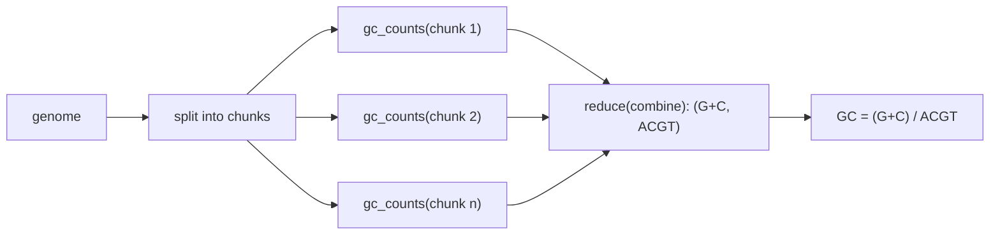

---
aliases:
  - FP
  - Pure Function
  - Higher-Order Function
  - Programmation fonctionnelle
tags:
  - type/concept
  - domain/computer-science
  - level/L1
  - level/L2
mastery: 0
prerequisites:
  - "[[Python Programming]]"
related:
  - "[[Object-Oriented Programming]]"
  - "[[Iterator]]"
  - "[[Python Object Model]]"
  - "[[Parallel Computing]]"
  - "[[Property-Based Testing]]"
  - "[[Scatter-Gather Parallelism]]"
projects:
  - "[[bio-core]]"
  - "[[07-evolution-simulator]]"
sources:
  - "[[Python Documentation]]"
  - "[[Python for Data Analysis (McKinney)]]"
  - "[[MIT 6.100L - Introduction to CS and Programming Using Python]]"
---

# Functional Programming

> [!abstract]
> Review sheet: write the computations of an analysis as pure functions over immutable values, glue them with higher-order functions, and they become trivial to test, safe to cache, and parallel by construction when partial results combine associatively.

## Definition

In the **functional style**, data flows through functions that compute outputs from inputs; a function with no side effects at all (no mutation of its arguments or of global state, no I/O) is **purely functional**.[^howto] Python functions are first-class objects: they can be passed, returned and stored, so **higher-order functions** such as `map`, `filter`, `sorted(key=...)` and `functools.reduce` take functions as arguments, and `lambda` writes small ones inline.[^mck3][^l9] **Immutability** (tuples, `frozenset`, `str`, frozen dataclasses) completes the style: values are replaced, never modified.

## Why it matters

- **Testable**: a pure function needs no fixture or mock, only inputs and expected outputs, and invites [[Property-Based Testing]] (for example, `rc(rc(s)) == s` for every generated `s`, see [[Reverse Complement]]).
- **Reproducible**: randomness passed in as an explicit `random.Random(seed)` makes a simulation a pure function of its seed ([[Random Number Generation]], [[07-evolution-simulator]]).
- **Parallel**: independent calls to a pure function can run on any worker in any order; this is the map step of [[Scatter-Gather Parallelism]] in pipelines and of [[Parallel Computing]] in general.
- **Cacheable**: only a pure function may be memoized.[^functools]

## Core (L1)

- **Pure versus impure.** `gc_counts(chunk)` below is pure. Impure: reading a file, `random.random()` (hidden global state), appending to a list passed in or to a mutable default ([[Python Object Model]]), printing. Push impurity to the edges (parsers, CLI) and keep the core pure ([[Layered Architecture]]).
- **Higher-order tools.** `map`, `filter` and generator expressions transform streams ([[Iterator]]); `sorted`, `min`, `max` take a `key`; `functools.partial` fixes arguments; `functools.reduce` folds a sequence into one value; `operator.add`, `itemgetter` avoid trivial lambdas.[^functools]
- **Immutable updates.** `copy.replace(obj, field=value)` (new in 3.13) returns a modified copy of a frozen dataclass or named tuple.[^new]

```python
import copy
from dataclasses import dataclass
from functools import reduce

def compose(*fs):
    return reduce(lambda f, g: lambda x: g(f(x)), fs)

clean = compose(str.strip, str.upper, lambda s: s.replace("U", "T"))
reads = ["acgu\n", " GGCAUU ", "AT"]                    # invented
print([clean(r) for r in reads])
print(sorted(map(clean, reads), key=len), list(filter(lambda s: len(s) >= 4, map(clean, reads))))

@dataclass(frozen=True)
class Read:
    name: str
    bases: str

r = Read("r1", "ACGTTTTT")
print(r, copy.replace(r, bases=r.bases[:4]))          # trimmed copy, r unchanged
```

```text
['ACGT', 'GGCATT', 'AT']
['AT', 'ACGT', 'GGCATT'] ['ACGT', 'GGCATT']
Read(name='r1', bases='ACGTTTTT') Read(name='r1', bases='ACGT')
```

## Deeper (L2)

**Parallel map-reduce.** Split the data, map a pure function over the chunks in worker processes, and fold the partial results with an associative operation.



```python
import random
from collections import Counter
from concurrent.futures import ProcessPoolExecutor
from functools import cache, partial, reduce
from operator import add

COMPLEMENT = str.maketrans("ACGT", "TGCA")

def gc_counts(chunk: str) -> tuple[int, int]:
    gc = chunk.count("G") + chunk.count("C")
    return gc, gc + chunk.count("A") + chunk.count("T")

def combine(a: tuple[int, int], b: tuple[int, int]) -> tuple[int, int]:
    return a[0] + b[0], a[1] + b[1]                 # associative, identity (0, 0)

def kmer_counts(seq: str, k: int) -> Counter:
    return Counter(seq[i:i + k] for i in range(len(seq) - k + 1))

def chunks(seq: str, size: int, overlap: int = 0) -> list[str]:
    return [seq[i:i + size + overlap] for i in range(0, len(seq), size)]

@cache                                              # safe only because canonical is pure
def canonical(kmer: str) -> str:
    return min(kmer, kmer.translate(COMPLEMENT)[::-1])

if __name__ == "__main__":
    rng = random.Random(7)                          # explicit seeded generator, no global state
    genome = "".join(rng.choices("ACGT", weights=[3, 2, 2, 3], k=200_000))   # invented
    k = 5
    with ProcessPoolExecutor(max_workers=4) as pool:
        gc, acgt = reduce(combine, pool.map(gc_counts, chunks(genome, 50_000)), (0, 0))
        count_k = partial(kmer_counts, k=k)
        naive = reduce(add, pool.map(count_k, chunks(genome, 50_000)))
        exact = reduce(add, pool.map(count_k, chunks(genome, 50_000, overlap=k - 1)))
    serial = kmer_counts(genome, k)
    print(gc_counts(genome) == (gc, acgt), round(gc / acgt, 4))
    print(serial == exact, serial.total() - naive.total())
    canon = Counter(canonical(genome[i:i + k]) for i in range(len(genome) - k + 1))
    info = canonical.cache_info()
    print(len(serial), len(canon), info.hits, info.misses)
```

```text
True 0.3998
True 12
1024 512 198972 1024
```

- Worker processes receive the function and its arguments by pickling, so only picklable objects can be submitted: top-level functions and `partial` objects work, lambdas do not.[^futures]
- Chunking changes nothing for GC counts, but a k-mer spanning a chunk border is lost unless chunks overlap by $k - 1$ bases (Worked example).
- `@cache` stored 1,024 results and answered the other 198,972 calls from its dictionary. Arguments must be hashable, and caching a function with side effects is a bug.[^functools]

## Mathematical representation

A pure function is a mathematical function $f : X \to Y$: equal inputs give equal outputs, so any call $f(x)$ can be replaced by its value (referential transparency), and composition is $(g \circ f)(x) = g(f(x))$. A fold with operation $\oplus$ and initial value $e$ computes
$$\mathrm{reduce}(\oplus, [x_1, \dots, x_n], e) = (\cdots((e \oplus x_1) \oplus x_2) \cdots) \oplus x_n.$$
If $\oplus$ is associative with identity $e$ (a **monoid**), the fold of a concatenation is the combination of the folds: $\mathrm{fold}(u \mathbin{+\!\!+} v) = \mathrm{fold}(u) \oplus \mathrm{fold}(v)$, so chunks can be folded independently and in parallel, then combined. Pairs $(g, n)$ of (G+C count, ACGT count) under componentwise addition form a monoid with identity $(0, 0)$; the ratio $g/n$ does not, which is why it is computed only at the end. Counters (multisets) under addition are a monoid too.

## Worked example

> [!example] k-mers across chunk borders (output above)
> 1. A sequence of length $L = 200{,}000$ has $L - k + 1 = 199{,}996$ windows of length $k = 5$.
> 2. Four disjoint chunks of 50,000 bases contain $4 \times 49{,}996 = 199{,}984$ windows: each of the 3 inner borders loses the $k - 1 = 4$ windows that straddle it, $3 \times 4 = 12$ in total, the `12` printed.
> 3. Extending each chunk by $k - 1$ bases makes every window start in exactly one chunk and end inside it, so the per-chunk counters add up to the serial counter (`True`).
> 4. The same reasoning sizes the overlap of any windowed computation (sliding GC, [[Minimizer|minimizers]]) split across workers.

## Common misconceptions

> [!warning] "Average the per-chunk GC fractions"
> With chunks `GC` (fraction 1.0) and `ATATATAT` (0.0), the mean of fractions is 0.5 but the GC content is $2/10 = 0.2$. Fractions are not a monoid; combine the counts, divide once.

> [!warning] "Functional style means no loops and no state"
> Inside a function, a local loop and a local mutable `Counter` are fine: purity concerns what the caller can observe. `kmer_counts` mutates its own counter and is still pure.

> [!warning] "Threads parallelize pure Python functions"
> In the default CPython build, the global interpreter lock lets one thread run Python bytecode at a time; CPU-bound pure Python needs processes (or the experimental free-threaded 3.13 build).[^gil][^new][^futures] See [[Concurrency]].

## Exercises

> [!question] Exercise 1 (L1)
> Which are pure? (a) `reverse_complement(s)`; (b) `def sample(reads): return random.sample(reads, 10)`; (c) `def add_read(r, batch=[]): batch.append(r); return batch`; (d) `def mean_q(qual: str) -> float`.

> [!success]- Solution
> (a) and (d) are pure. (b) reads hidden global random state: pass an `rng: random.Random` argument. (c) mutates a default list that persists between calls ([[Python Object Model]]): two calls return the same, growing list.

> [!question] Exercise 2 (L2)
> A genome of length $L$ is split into $c$ disjoint chunks for k-mer counting. How many windows are lost, and what overlap fixes it?

> [!success]- Solution
> Each of the $c - 1$ inner borders is straddled by $k - 1$ windows: $(c - 1)(k - 1)$ lost. An overlap of $k - 1$ bases on each chunk except the last recovers them exactly; a larger overlap would count some windows twice.

> [!question] Exercise 3 (L2)
> Design a combinable summary giving the mean and the maximum of read lengths across chunks.

> [!success]- Solution
> Map each chunk to $(n, s, m)$ = (count, sum, max), combine with $(n_1 + n_2,\ s_1 + s_2,\ \max(m_1, m_2))$, identity $(0, 0, -\infty)$, and compute the mean $s/n$ once at the end. Each component is a monoid, so the triple is one. Variance needs care: naive sums of squares lose precision ([[Numerical Stability]]).

## Mastery checklist

- [ ] 1 Recognized: I can define a pure function and name Python's higher-order tools.
- [ ] 2 Understood: I can explain why purity enables testing, caching and parallelism, and what makes a reduction combinable.
- [ ] 3 Practiced: I can parallelize a pure computation with `ProcessPoolExecutor` and verify it against the serial result.
- [ ] 4 Applied: the core of a Lab project ([[bio-core]], [[07-evolution-simulator]]) is pure, with I/O and randomness injected at the edges.
- [ ] 5 Explained: I can explain chunk overlaps, non-combinable statistics and the GIL to a colleague parallelizing an analysis.

## References

[^howto]: [[Python Documentation]], 3.13, "Functional Programming HOWTO": functional style, side effects, purely functional functions.
[^functools]: [[Python Documentation]], 3.13, Library Reference, `functools`: `reduce`, `partial`, `cache` and `lru_cache` (hashable arguments; caching functions with side effects makes no sense).
[^futures]: [[Python Documentation]], 3.13, Library Reference, `concurrent.futures`: `ProcessPoolExecutor` side-steps the global interpreter lock, so only picklable objects can be executed and returned.
[^new]: [[Python Documentation]], "What's New in Python 3.13": `copy.replace`, experimental free-threaded build (PEP 703).
[^gil]: [[Python Documentation]], 3.13, Glossary, "global interpreter lock": CPython lets only one thread execute Python bytecode at a time.
[^mck3]: [[Python for Data Analysis (McKinney)]], 3rd ed. (2022), ch. 3 "Built-In Data Structures, Functions, and Files": functions are objects, anonymous (lambda) functions.
[^l9]: [[MIT 6.100L - Introduction to CS and Programming Using Python]], lecture 9 "Lambda Functions, Tuples, and Lists".
