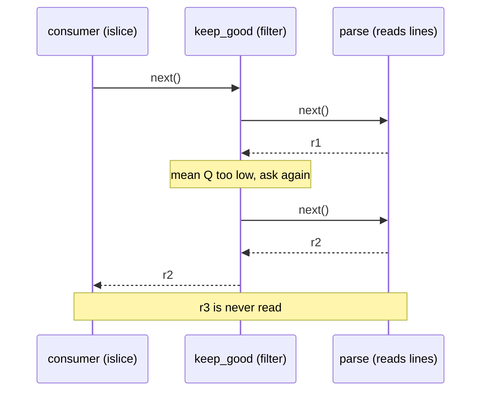

---
aliases:
  - Generator
  - Iterator Protocol
  - Lazy Evaluation
  - Streaming
  - itertools
  - Itérateur
tags:
  - type/concept
  - domain/computer-science
  - domain/bioinformatics
  - level/L1
  - level/L2
  - level/L3
mastery: 0
prerequisites:
  - "[[Python Programming]]"
  - "[[Functional Programming]]"
related:
  - "[[File Input and Output]]"
  - "[[FASTA Format]]"
  - "[[FASTQ Format]]"
  - "[[Python Object Model]]"
  - "[[Space Complexity]]"
  - "[[Paired-End Read]]"
  - "[[Out-of-Core Computation]]"
  - "[[External Memory Algorithm]]"
projects:
  - "[[02-sequence-translation]]"
  - "[[01-dna-engine]]"
  - "[[10-genomic-pipeline]]"
sources:
  - "[[Python Documentation]]"
  - "[[Python for Data Analysis (McKinney)]]"
  - "[[Bioinformatics Data Skills (Buffalo)]]"
---

# Iterator

> [!abstract]
> An iterator hands out the items of a collection or a stream one at a time, on demand; a generator is the easiest way to write one, and a chain of generators processes a sequencing file record by record, in memory proportional to one record instead of the whole file.

## Definition

An **iterable** is an object that can return its items one at a time; calling `iter()` on it gives an **iterator**, an object whose `__next__` method returns the next item and raises `StopIteration` when there are none left. A `for` loop does exactly this. An iterator is consumed as it is used and is then **exhausted**.[^itertypes][^glossary] A **generator function** is a function containing `yield`: calling it returns a generator iterator, whose execution is suspended at each `yield` and resumed with its local state intact by the next `next()`. A **generator expression** `(f(x) for x in xs)` builds one inline.[^yield][^mck3] The `itertools` module provides fast, memory-efficient building blocks for combining iterators.[^itertools]

## Why it matters

- **Files larger than RAM.** A gzip-compressed FASTQ file of many gigabytes ([[FASTQ Format]]) cannot be loaded as a list; streamed, it needs memory for one record at a time (measured below: 333 kB of peak against 41 MB for only 100,000 short reads).
- **Composable pipelines.** Parsing, filtering, trimming and counting become separate small generators chained like a Unix pipeline ([[Unix Text Processing]]); each stage is a function that can be tested alone.
- **The Lab.** [[02-sequence-translation]] streams codons over reading frames; [[01-dna-engine]] and [[10-genomic-pipeline]] read records with generators, as the reference parsers of [[FASTA Format#Computational representation]] and [[FASTQ Format#Computational representation]] do. Working with FASTA and FASTQ sequence data is a core chapter of practical genomics texts.[^buffalo]

## Core (L1)



Pull, do not push: the consumer asks for one item, and each stage asks the one before it only as much as it needs (Worked example).

**Generators and the protocol.**

```python
from itertools import batched, groupby, islice

def kmers(seq: str, k: int):
    """Generator function: yields the k-mers of seq one at a time."""
    for i in range(len(seq) - k + 1):
        yield seq[i:i + k]

g = kmers("ACGTAC", 3)
print(next(g), next(g), list(g), list(g))       # resumes where it stopped, then is exhausted

def read_fastq_simple(lines):
    """Unwrapped four-line FASTQ only (see FASTQ Format for a robust parser)."""
    for title, seq, plus, qual in batched((line.rstrip("\n") for line in lines), 4, strict=True):
        if not (title.startswith("@") and plus.startswith("+") and len(seq) == len(qual)):
            raise ValueError(f"malformed record {title!r}")
        yield title[1:], seq, qual

def read_fasta_groupby(lines):
    """Compact FASTA reader: groupby separates runs of header lines from runs of sequence lines."""
    header = None
    for is_header, run in groupby((l.rstrip() for l in lines if l.strip()), key=lambda l: l.startswith(">")):
        if is_header:
            *_, header = run                     # keeps the last of consecutive headers
        else:
            yield header[1:], "".join(run)

fasta = ">s1 toy\nACGT\nTTGA\n>s2\nGGC\n".splitlines(keepends=True)          # invented
fastq = "@r1\nACGT\n+\nII#I\n@r2\nTTGA\n+\nIIII\n".splitlines(keepends=True)  # invented
print(list(read_fasta_groupby(fasta)), list(read_fastq_simple(fastq)))
```

```text
ACG CGT ['GTA', 'TAC'] []
[('s1 toy', 'ACGTTTGA'), ('s2', 'GGC')] [('r1', 'ACGT', 'II#I'), ('r2', 'TTGA', 'IIII')]
```

The two readers are deliberately short: they show the iterator tools, while the robust parsers (wrapped FASTQ, `@` in qualities, strict modes) live in the format notes. `batched(..., strict=True)` (Python 3.13) turns a truncated last record into `ValueError: batched(): incomplete batch` instead of a silently shorter batch.[^itertools]

**The `itertools` toolbox for sequence data.**[^itertools]

| Tool | Does | Sequence-data use |
|---|---|---|
| `islice(it, n)` | first $n$ items, lazily | `head` of a FASTQ, a test sample |
| `chain.from_iterable(its)` | concatenates iterators | all lanes of a sample as one stream |
| `groupby(it, key)` | runs of consecutive equal keys | FASTA header versus sequence lines; reads sorted by name |
| `batched(it, n)` | tuples of $n$ items (3.12; `strict` in 3.13) | 4-line FASTQ records; chunks for a worker pool |
| `pairwise(it)` | overlapping pairs | gaps between consecutive sorted positions |
| `accumulate(it)` | running totals | cumulative coverage, offsets of records |
| `tee(it, n)` | $n$ independent copies | rarely: it stores every item one copy has consumed and another has not; compute both results in one pass instead |

Built-ins complete it: `enumerate`, `zip(..., strict=True)` (equal lengths enforced, Python 3.10+), `map`, `filter`, `sum`, `any`, `all`.[^funcs]

## Deeper (L2)

**Constant memory, measured.** An invented 100,000-read FASTQ (100 bp reads), gzip-compressed, read through `read_fastq_simple`, once streamed and once collected into a list (CPython 3.13, `tracemalloc` peak):

```python
import gzip, random, tempfile, tracemalloc
from pathlib import Path

def peak_bytes(task):
    tracemalloc.start()
    result = task()
    peak = tracemalloc.get_traced_memory()[1]
    tracemalloc.stop()
    return result, peak

rng = random.Random(1)
with tempfile.TemporaryDirectory() as tmp:
    path = Path(tmp) / "toy.fastq.gz"
    n_reads = 100_000
    with gzip.open(path, "wt", encoding="ascii") as out:            # invented reads, 100 bp
        for i in range(n_reads):
            seq = "".join(rng.choices("ACGT", k=100))
            qual = "".join(rng.choices("#+5?I", k=100))
            out.write(f"@read{i}\n{seq}\n+\n{qual}\n")

    def stream():
        with gzip.open(path, "rt", encoding="ascii") as fh:
            reads = bases = 0
            for _, seq, _ in read_fastq_simple(fh):
                reads += 1
                bases += len(seq)
            return reads, bases

    def materialize():
        with gzip.open(path, "rt", encoding="ascii") as fh:
            records = list(read_fastq_simple(fh))
            return len(records), sum(len(s) for _, s, _ in records)

    (r1, b1), p_stream = peak_bytes(stream)
    (r2, b2), p_list = peak_bytes(materialize)
    print(f"{path.stat().st_size / 1e6:.1f} MB gzipped, {r1:,} reads, {b1:,} bases")
    print(f"peak: streaming {p_stream / 1e3:.0f} kB, list {p_list / 1e6:.0f} MB ({p_list / r2:.0f} B per read)")
```

```text
7.4 MB gzipped, 100,000 reads, 10,000,000 bases
peak: streaming 333 kB, list 41 MB (406 B per read)
```

Both give the same counts; the streaming peak (file buffers plus one record) does not depend on the number of reads, the list grows by about 400 bytes per 100 bp read: three string objects and a tuple per record ([[Python Object Model]]).

**Paired-end files** are two streams that must stay in lockstep ([[Paired-End Read]]). Iterate them with `zip(read_fastq_simple(fh1), read_fastq_simple(fh2), strict=True)` and compare the names of each pair: on an invented pair of files whose mate file lacks its last record, plain `zip` silently drops the unpaired read, while `strict=True` raises `ValueError: zip() argument 2 is shorter than argument 1` (CPython 3.13).[^funcs]

**Generator lifetime.** A generator that opens a file inside a `with` block closes it when it is exhausted or when its `close()` method is called, which raises `GeneratorExit` at the paused `yield` so that `finally` and `with` clean-up run.[^yield] A consumer that stops early (`islice`) leaves the file open until the generator is closed or garbage-collected: prefer opening the file in the caller and passing the handle, as above.

**When not to stream.** Multiple passes, random access, sorting or `len()` need the data materialized or re-read. A file can be re-read (a new iterator each time); a generator cannot. Sorting more than RAM needs [[External Memory Algorithm|external sorting]] ([[Out-of-Core Computation]]).

## Advanced (L3)

- **Streaming algorithms.** One pass, bounded state: counts, sums, minima and maxima are folds ([[Functional Programming]]). **Reservoir sampling** keeps a uniform random sample of $k$ items from a stream of unknown length in $O(k)$ memory: keep the first $k$; the item at 0-based index $i \ge k$ replaces a uniformly chosen slot with probability $k/(i + 1)$. This is how reads can be subsampled from a FASTQ in one pass (proof in Mathematical representation, code in Exercise 3).
- **Windows across line breaks.** k-mers or sliding GC computed from a wrapped FASTA without joining the whole chromosome need only the last $k - 1$ characters of the previous line (Exercise 2). The same carry-over idea sizes chunk overlaps in parallel code ([[Functional Programming#Worked example]]).
- **Where Python stops.** Generators remove the memory problem, not the per-item interpreter cost ([[Python Object Model#Deeper (L2)]]); throughput-bound tools stream in compiled code (samtools, minimap2) and Python orchestrates them ([[Command-Line Interface]]).

## Mathematical representation

An iterator yields a sequence $x_1, x_2, \dots, x_n$ once, in order, with $n$ possibly unknown in advance. A streaming computation keeps a state $s_i = f(s_{i-1}, x_i)$ from $s_0$, a fold, and uses memory $O(|s| + \max_i |x_i|)$ instead of $O(\sum_i |x_i|)$ for a materialized list ([[Space Complexity]]).

**Reservoir sampling is uniform.** Number items $1, \dots, n$, with $n \ge k$; item $j > k$ enters with probability $k/j$ and evicts a uniformly chosen slot. A sampled item survives step $j > k$ unless item $j$ enters *and* picks its slot: probability $1 - \frac{k}{j} \cdot \frac{1}{k} = \frac{j - 1}{j}$.
- Item $i \le k$ is in the initial sample and survives steps $k + 1, \dots, n$: $\prod_{j=k+1}^{n} \frac{j - 1}{j} = \frac{k}{n}$ (telescoping product).
- Item $i > k$ enters with probability $\frac{k}{i}$ and survives steps $i + 1, \dots, n$: $\frac{k}{i} \cdot \frac{i}{n} = \frac{k}{n}$.

Every item ends in the sample with probability $k/n$.

## Worked example

> [!example] Who runs when: a lazy read filter (invented reads)
> Three reads: `r1` with qualities `#####+++` (mean $Q = 5$), `r2` and `r3` with better ones. Two generator stages, `parse` and `keep_good` (mean $Q \ge 20$), each printing when it works, consumed with `islice(pipeline, 1)`:
> ```python
> toy = ("@r1\nACGTACGT\n+\n#####+++\n"
>        "@r2\nGGCATTAC\n+\nIIIIIIII\n"
>        "@r3\nTTTTACGA\n+\nIIIII###\n").splitlines(keepends=True)   # invented
>
> def parse(lines):
>     for name, seq, qual in read_fastq_simple(lines):
>         print(f"  parse  {name}")
>         yield name, seq, qual
>
> def keep_good(records, min_mean_q=20):
>     for name, seq, qual in records:
>         mean_q = sum(ord(c) - 33 for c in qual) / len(qual)
>         print(f"  filter {name}: mean Q {mean_q:.1f}")
>         if mean_q >= min_mean_q:
>             yield name, seq, qual
>
> pipeline = keep_good(parse(toy))
> print("pipeline built, nothing read yet")
> for name, seq, qual in islice(pipeline, 1):
>     print(f"  output {name}")
> ```
> ```text
> pipeline built, nothing read yet
>   parse  r1
>   filter r1: mean Q 5.0
>   parse  r2
>   filter r2: mean Q 40.0
>   output r2
> ```
> 1. Building the pipeline executes nothing: generator bodies start at the first `next()`.
> 2. `r1` travels through both stages before `r2` is parsed: at any time, one record is in flight.
> 3. `r3` is never parsed, because the consumer stopped. On a real file, `head` of a filtered stream costs only the records it inspects.
> 4. Check: `#` is $Q = 2$ and `+` is $Q = 10$ in Phred+33 ([[Phred Quality Score]]), so `r1` has mean $(5 \cdot 2 + 3 \cdot 10)/8 = 5$.

## Common misconceptions

> [!warning] "A generator can be reused"
> It is exhausted after one pass: `lengths = (len(s) for s in seqs); sum(lengths); max(lengths)` raises `ValueError: max() iterable argument is empty`. Recreate it, or materialize it if several passes are needed.

> [!warning] "Streaming makes the code fast"
> It makes memory constant; the time is still one interpreted step per item. Measure before assuming a speed-up ([[Performance Profiling]]).

> [!warning] "`for line in f.readlines()` is the same as `for line in f`"
> `readlines()` first builds the list of every line in the file; iterating the file object reads it line by line through a buffer.[^io] ([[File Input and Output]])

## Exercises

> [!question] Exercise 1 (L1)
> `seqs = ["ACGT", "GG", "TTTAC"]; lengths = (len(s) for s in seqs)`. What do `sum(lengths)` and then `max(lengths)` return?

> [!success]- Solution
> `11`, then `ValueError: max() iterable argument is empty`: `sum` exhausted the generator. Use a list (`[len(s) for s in seqs]`) for two passes, or compute both in one loop.

> [!question] Exercise 2 (L2, Python)
> Write `stream_kmers(lines, k)` that yields the k-mers of one sequence given as wrapped lines, without joining the lines, and check it against `kmers` on the joined sequence.

> [!success]- Solution
> ```python
> def stream_kmers(lines, k):
>     """k-mers of one sequence given as wrapped lines, without joining the whole sequence."""
>     tail = ""
>     for line in lines:
>         chunk = tail + line.strip()
>         for i in range(len(chunk) - k + 1):
>             yield chunk[i:i + k]
>         tail = chunk[-(k - 1):] if k > 1 else ""
>
> wrapped = ["ACGTT", "GCA", "TTAGC"]   # invented
> print(list(stream_kmers(wrapped, 4)) == list(kmers("".join(wrapped), 4)), len(list(stream_kmers(wrapped, 4))))
> # True 10
> ```
> A k-mer that crosses a line break starts within the last $k - 1$ characters of the previous text, so carrying those $k - 1$ characters is enough; memory is one line plus $k - 1$ characters. 13 bases give $13 - 4 + 1 = 10$ k-mers.

> [!question] Exercise 3 (L3, Python)
> Implement reservoir sampling and check empirically that each of 5 items lands in a sample of 2 with probability $2/5$.

> [!success]- Solution
> ```python
> import random
> from collections import Counter
>
> def reservoir_sample(stream, k, rng):
>     """k items chosen uniformly from a stream of unknown length, in O(k) memory."""
>     sample = []
>     for i, item in enumerate(stream):            # i = 0, 1, 2, ...
>         if i < k:
>             sample.append(item)
>         else:
>             j = rng.randrange(i + 1)             # uniform in 0..i
>             if j < k:
>                 sample[j] = item                 # item i+1 enters with probability k/(i+1)
>     return sample
>
> rng = random.Random(2024)
> reads = (f"read{i}" for i in range(1, 1_000_001))    # a stream: never stored
> print(reservoir_sample(reads, 3, rng))
> trials = 100_000
> hits = Counter(x for _ in range(trials) for x in reservoir_sample("ABCDE", 2, rng))
> print({x: round(n / trials, 3) for x, n in sorted(hits.items())})
> ```
> Output: `['read969012', 'read915266', 'read404238']`, then `{'A': 0.398, 'B': 0.399, 'C': 0.399, 'D': 0.402, 'E': 0.402}`: all close to $0.4$, as the proof predicts. The million reads were never held in memory.

## Mastery checklist

- [ ] 1 Recognized: I can define iterable, iterator, generator and exhaustion, and name five `itertools` functions.
- [ ] 2 Understood: I can explain pull-based evaluation, why streaming memory is independent of file size, and the cost of `tee`.
- [ ] 3 Practiced: I write generator pipelines with `islice`, `batched`, `groupby` and `zip(strict=True)`, and measure their memory with `tracemalloc`.
- [ ] 4 Applied: the readers of [[01-dna-engine]] and [[02-sequence-translation]] stream real FASTA and FASTQ files of several gigabytes in constant memory.
- [ ] 5 Explained: I can prove reservoir sampling uniform and explain when a stream must be materialized or sorted externally.

## References

[^itertypes]: [[Python Documentation]], 3.13, Library Reference, "Built-in Types", iterator types: `__iter__`, `__next__`, `StopIteration`.
[^glossary]: [[Python Documentation]], 3.13, Glossary: "iterable", "iterator", "generator", "generator expression".
[^yield]: [[Python Documentation]], 3.13, Language Reference, "Expressions", yield expressions: suspended execution, generator-iterator methods `close()` and `GeneratorExit`.
[^itertools]: [[Python Documentation]], 3.13, Library Reference, `itertools`: `islice`, `chain`, `groupby`, `batched` (added in 3.12, `strict` in 3.13), `pairwise`, `accumulate`, `tee` (auxiliary storage).
[^funcs]: [[Python Documentation]], 3.13, Library Reference, "Built-in Functions": `zip` with `strict=True` (added in 3.10), `enumerate`, `map`, `filter`.
[^mck3]: [[Python for Data Analysis (McKinney)]], 3rd ed. (2022), ch. 3 "Built-In Data Structures, Functions, and Files": generators, generator expressions and the `itertools` module.
[^io]: [[Python Documentation]], 3.13, Library Reference, `io`: file objects are iterable line by line; `readlines()` is unnecessary for iteration.
[^buffalo]: [[Bioinformatics Data Skills (Buffalo)]], chapter "Working with Sequence Data" (FASTA and FASTQ).
