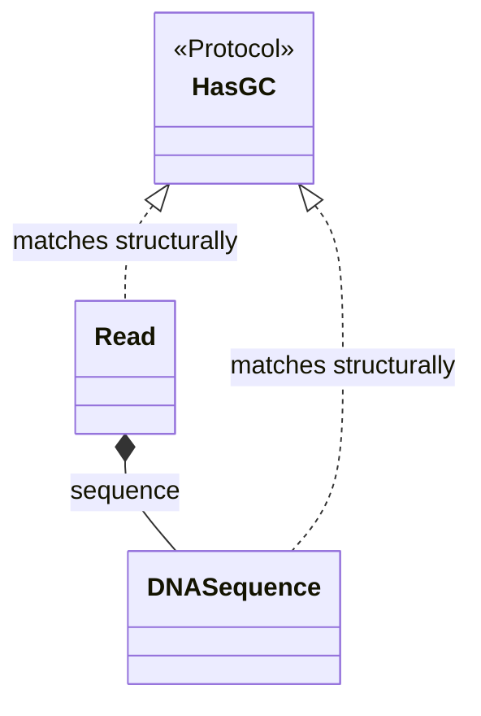

---
aliases:
  - OOP
  - Composition over Inheritance
  - Structural Subtyping
  - Programmation orientée objet
tags:
  - type/concept
  - domain/computer-science
  - level/L1
  - level/L2
mastery: 0
prerequisites:
  - "[[Python Programming]]"
related:
  - "[[Python Object Model]]"
  - "[[Functional Programming]]"
  - "[[Abstract Data Type]]"
  - "[[Value Object]]"
  - "[[Type Hint]]"
  - "[[Layered Architecture]]"
projects:
  - "[[01-dna-engine]]"
  - "[[bio-core]]"
sources:
  - "[[Python Documentation]]"
  - "[[MIT 6.100L - Introduction to CS and Programming Using Python]]"
  - "[[Python for Data Analysis (McKinney)]]"
---

# Object-Oriented Programming

> [!abstract]
> Review sheet: in Python, a domain object is best written as a small immutable class that validates its invariants once, plugs into the language through special methods, is combined with others by composition, and is accepted by functions through protocols rather than base classes.

## Definition

**Object-oriented programming** bundles state (attributes) and behaviour (methods) into objects whose type is a class. Python classes hook into the language through **special methods** (`__len__`, `__getitem__`, `__eq__`, `__hash__`...), which `len()`, indexing, `==` and dictionaries call.[^datamodel][^l17] **Inheritance** derives a class from another and reuses its methods;[^l19] **composition** gives an object other objects as attributes and delegates to them. A **protocol** (`typing.Protocol`) defines an interface structurally: any class with the right methods matches it, without inheriting from it.[^typing]

## Why it matters

- The domain model of [[bio-core]] and [[01-dna-engine]] (sequences, reads, intervals, variants) is a set of such classes. Each enforces its invariants (valid alphabet, one quality per base, $start \le end$) at construction, so downstream code never re-checks them.
- Immutable objects can be dictionary keys and set members, and can be shared without defensive copies ([[Python Object Model]]).
- Protocols let one function accept your `Read`, a test double or a library record, which keeps analysis code testable ([[Unit Testing]]).

## Core (L1)

| You write | Python calls | Use |
|---|---|---|
| `len(x)`, `x[i:j]` | `__len__`, `__getitem__` | length, slicing that keeps the type |
| `for b in x` | `__iter__` | iterate over bases or records ([[Iterator]]) |
| `x == y`, `hash(x)` | `__eq__`, `__hash__` | deduplicate sequences in a `set` |
| `with x:` | `__enter__`, `__exit__` | resources ([[File Input and Output]]) |

`@dataclass` writes `__init__`, `__repr__` and `__eq__` from the fields; `frozen=True` makes assignment raise `FrozenInstanceError`; with `eq` and `frozen` both true it also generates `__hash__`; `slots=True` drops the per-instance `__dict__`.[^dataclasses]

```python
from dataclasses import dataclass
from typing import Protocol, runtime_checkable

COMPLEMENT = str.maketrans("ACGTN", "TGCAN")

@dataclass(frozen=True, slots=True)
class DNASequence:
    bases: str

    def __post_init__(self) -> None:
        upper = self.bases.upper()
        if bad := set(upper) - set("ACGTN"):
            raise ValueError(f"invalid bases {sorted(bad)}")
        object.__setattr__(self, "bases", upper)   # normalise once, at construction
    def __len__(self) -> int:
        return len(self.bases)
    def reverse_complement(self) -> "DNASequence":
        return DNASequence(self.bases.translate(COMPLEMENT)[::-1])
    def gc_content(self) -> float:
        acgt = sum(map(self.bases.count, "ACGT"))
        return (self.bases.count("G") + self.bases.count("C")) / acgt if acgt else 0.0

@dataclass(frozen=True, slots=True)
class Read:                                         # a read HAS a sequence: composition
    name: str
    sequence: DNASequence
    quality: str

    def __post_init__(self) -> None:
        if len(self.quality) != len(self.sequence):
            raise ValueError(f"{self.name}: bases and qualities differ in length")
    def __len__(self) -> int:
        return len(self.sequence)
    def gc_content(self) -> float:
        return self.sequence.gc_content()           # delegation
    def reverse_complement(self) -> "Read":
        return Read(self.name, self.sequence.reverse_complement(), self.quality[::-1])

@runtime_checkable
class HasGC(Protocol):
    def __len__(self) -> int: ...
    def gc_content(self) -> float: ...

def gc_report(items: list[HasGC]) -> list[str]:
    return [f"{type(x).__name__} {len(x)} bp GC={x.gc_content():.2f}" for x in items]

s, r = DNASequence("atgcgtNNac"), Read("r1", DNASequence("GGCAT"), "II#5I")   # invented
print(s.reverse_complement(), r.reverse_complement(), sep="\n")
print(gc_report([s, r]), isinstance(r, HasGC), isinstance("ACGT", HasGC))
print(DNASequence("ACGT") == DNASequence("acgt"), len({DNASequence("ACGT"), DNASequence("acgt")}))
```

```text
DNASequence(bases='GTNNACGCAT')
Read(name='r1', sequence=DNASequence(bases='ATGCC'), quality='I5#II')
['DNASequence 10 bp GC=0.50', 'Read 5 bp GC=0.60'] True False
True 1
```

`s.bases = "A"` raises `FrozenInstanceError`, and `DNASequence("ACGU")` raises `ValueError: invalid bases ['U']`.



Neither class inherits from `HasGC`; both match it because they have its two methods. At runtime this is duck typing;[^mck2] the protocol makes the contract checkable by mypy ([[Type Hint]]).

## Deeper (L2)

- **Protocol versus abstract base class.** An `abc.ABC` is nominal: a class matches only if it inherits from it or is registered. A `Protocol` is structural, and `@runtime_checkable` lets `isinstance` check that the methods exist, not their signatures.[^typing]
- **The hash contract.** Objects that compare equal must have equal hashes.[^datamodel] A dataclass with `eq=True` and `frozen=False` therefore gets `__hash__ = None`;[^dataclasses] a key whose value changed would sit in the wrong slot ([[Hash Table]]).
- **Normalising a frozen instance** uses `object.__setattr__`, as the generated `__init__` itself does.[^dataclasses]
- **Next**: the full pattern (typed, validated, immutable values without identity) is [[Value Object]]; layering such objects behind parsers and tools is [[Layered Architecture]]. A class with an invariant is an [[Abstract Data Type]].

## Worked example

> [!example] Why a read is not a sequence (invented read)
> 1. If `Read` inherited from `DNASequence`, `read.reverse_complement()` would run the parent method and return a bare `DNASequence`: name and qualities lost.
> 2. Overriding it is possible, but every inherited method, present and future, must then be audited against the extra invariant.
> 3. With composition, `Read` exposes only what makes sense for a read. Its reverse complement also reverses the qualities: `GGCAT`/`II#5I` becomes `ATGCC`/`I5#II`, so each quality stays with its base.
> 4. Rule: inherit only when the subclass can replace the parent everywhere without breaking an invariant; otherwise compose.

## Common misconceptions

> [!warning] "Subclassing `str` gives a DNA type for free"
> `class BadDNA(str): pass` accepts `BadDNA("hello!")`, and `b[1:]`, `b.lower()` and `b + "X"` all return a plain `str` (checked in CPython 3.13). The invariant disappears at the first operation.

> [!warning] "A frozen dataclass is deeply immutable"
> `frozen` forbids rebinding fields; a `list` field can still be mutated in place. Use tuples, `frozenset` or nested frozen dataclasses ([[Python Object Model]]).

## Exercises

> [!question] Exercise 1 (L1)
> Why can `DNASequence` objects go into a `set`, while instances of `@dataclass class Mutable: x: int` cannot?

> [!success]- Solution
> With `eq` and `frozen` both true, `@dataclass` generates `__hash__` from the fields. With `eq=True` and `frozen=False`, it sets `__hash__` to `None` (`print(Mutable.__hash__)` prints `None`): a hash of fields that can change would break dictionaries.[^dataclasses]

> [!question] Exercise 2 (L2, Python)
> Write a frozen, ordered `Interval(chrom, start, end)` (0-based, half-open) with `overlaps`. Sort `chr10:5-9`, `chr2:100-200`, `chr2:7-12` with the generated ordering and explain the result.

> [!success]- Solution
> ```python
> @dataclass(frozen=True, order=True)
> class Interval:
>     chrom: str
>     start: int   # 0-based, inclusive
>     end: int     # exclusive
>     def overlaps(self, other: "Interval") -> bool:
>         return self.chrom == other.chrom and self.start < other.end and other.start < self.end
>
> ivs = [Interval("chr10", 5, 9), Interval("chr2", 100, 200), Interval("chr2", 7, 12)]
> rank = {f"chr{i}": i for i in range(1, 23)}
> print([f"{i.chrom}:{i.start}" for i in sorted(ivs)])
> print([f"{i.chrom}:{i.start}" for i in sorted(ivs, key=lambda i: (rank[i.chrom], i.start, i.end))])
> print(ivs[2].overlaps(Interval("chr2", 12, 20)), ivs[2].overlaps(Interval("chr2", 11, 20)))
> ```
> Output: `['chr10:5', 'chr2:7', 'chr2:100']`, `['chr2:7', 'chr2:100', 'chr10:5']`, `False True`. `order=True` compares field tuples and strings compare character by character, so `"chr10" < "chr2"`; genomic order needs an explicit key ([[Genomic Interval Arithmetic]]). `[7, 12)` and `[12, 20)` touch but do not overlap.

> [!question] Exercise 3 (L2)
> A `Scorer` protocol has `score(a, b) -> int`. Two classes implement it: Hamming distance (lower is better) and a match/mismatch score with $m > x$ (higher is better). For equal-length strings, can they disagree on the best target?

> [!success]- Solution
> No. For length $L$ and Hamming distance $d$, the match/mismatch score is $m(L - d) + x d = mL - (m - x)d$, a decreasing affine function of $d$, so both rank targets identically (ties included). They diverge only once gaps are allowed ([[Sequence Alignment]]). The protocol is what lets `best_hit(query, targets, scorer)` swap them without either inheriting from a base class.

## Mastery checklist

- [ ] 1 Recognized: I can name the special methods behind `len`, indexing, `==`, `hash` and `with`.
- [ ] 2 Understood: I can explain composition versus inheritance, nominal versus structural typing, and the hash contract.
- [ ] 3 Practiced: I can write a frozen, slotted, validated dataclass and a protocol that two unrelated classes satisfy.
- [ ] 4 Applied: the domain objects of [[bio-core]] follow this design and pass mypy.
- [ ] 5 Explained: in a code review, I can show which invariant a proposed subclass breaks and rewrite it as composition.

## References

[^datamodel]: [[Python Documentation]], 3.13, Language Reference, "Data model": special method names; `__hash__` (objects that compare equal must have the same hash value).
[^dataclasses]: [[Python Documentation]], 3.13, Library Reference, `dataclasses`: generated methods, `frozen`, `slots`, `__hash__` rules, `object.__setattr__` in frozen instances.
[^typing]: [[Python Documentation]], 3.13, Library Reference, `typing`: `Protocol` (structural subtyping, PEP 544) and `runtime_checkable`.
[^l17]: [[MIT 6.100L - Introduction to CS and Programming Using Python]], lecture 17 "Python Classes".
[^l19]: [[MIT 6.100L - Introduction to CS and Programming Using Python]], lecture 19 "Inheritance".
[^mck2]: [[Python for Data Analysis (McKinney)]], 3rd ed. (2022), ch. 2 "Python Language Basics, IPython, and Jupyter Notebooks": attributes and methods, duck typing.
