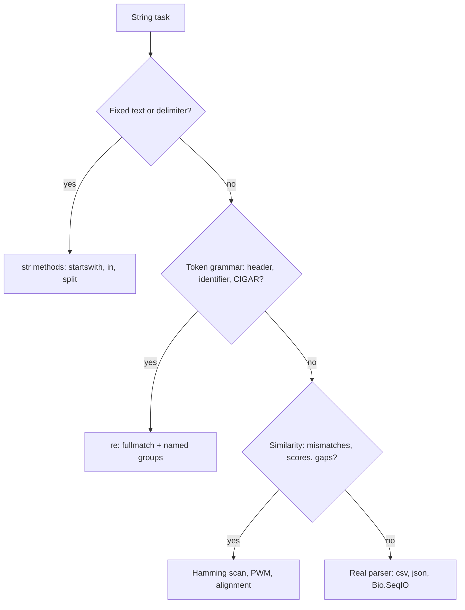

---
aliases:
  - Regex
  - Regexp
  - Expression régulière
  - Expression rationnelle
tags:
  - type/concept
  - domain/computer-science
  - domain/bioinformatics
  - level/L1
  - level/L2
  - level/L3
mastery: 0
prerequisites:
  - "[[String]]"
  - "[[Python Programming]]"
related:
  - "[[Accession Number]]"
  - "[[FASTA Format]]"
  - "[[SAM Format]]"
  - "[[Sequence Motif]]"
  - "[[Approximate Pattern Matching]]"
  - "[[Hamming Distance]]"
  - "[[Position Weight Matrix]]"
  - "[[State Machine]]"
  - "[[Unix Text Processing]]"
  - "[[Command-Line Interface]]"
projects: []
sources:
  - "[[Python Documentation]]"
  - "[[UniProt]]"
  - "[[GA4GH hts-specs]]"
  - "[[Bioinformatics Algorithms (Compeau)]]"
  - "[[Bioinformatics Data Skills (Buffalo)]]"
---

# Regular Expression

> [!abstract]
> A regular expression is a compact pattern for a set of strings: the right tool to validate and take apart headers, identifiers and specification fields, and the wrong tool for biological motifs that tolerate mismatches.

## Definition

A **regular expression** (regex) is a pattern, written in a small language of literals, character classes, repetition, alternation and groups, that specifies a set of strings; a regex engine tells whether a string, or a substring of it, belongs to that set and where. Python's `re` module provides Perl-like regular expressions on `str` or `bytes` (pattern and subject must be the same type).[^re]

## Why it matters

- **Headers.** FASTA definition lines follow database layouts. A UniProtKB header packs database, accession, entry name, protein name, organism (`OS=`), taxon ID (`OX=`), optional gene (`GN=`), protein existence (`PE=`) and sequence version (`SV=`) into one line.[^uniprot] One regex with named groups turns it into a record ([[FASTA Format]]).
- **Identifiers.** Accession formats are regular expressions; the classifier in [[Accession Number]] validates and splits `accession.version` with them.
- **Specifications.** The SAM specification defines each mandatory field by a regular expression, for example CIGAR as `\*|([0-9]+[MIDNSHPX=])+` ([[SAM Format]]).[^sam]
- **Command line.** `grep` and `sed` search and edit genomics text files with regular expressions ([[Unix Text Processing]]).[^buffalo]
- **Limit.** A binding site with one or two mismatches is not a good regex target (Deeper): use [[Approximate Pattern Matching]] or a [[Position Weight Matrix]].

## Core (L1)

**Syntax.** The constructs that cover most header and identifier parsing:[^re]

| Construct | Meaning | Example |
|---|---|---|
| `ACGT` | literal characters | `OS=` |
| `.` | any character except newline | `TT.ACA` |
| `[ACGT]`, `[^"]` | one character from a set, or outside it | `[MIDNSHPX=]` |
| `\d`, `\w`, `\s`, `\S` | digit, word character, whitespace, non-whitespace | `\d+` |
| `*`, `+`, `?`, `{m,n}` | repeat 0+, 1+, 0-1, m to n times (greedy) | `[A-Z]{2}_\d+` |
| `*?`, `+?` | same, but as few as possible (lazy) | `.+?` |
| `^`, `$` | start, end of string | |
| `a\|b` | alternation | `sp\|tr` |
| `(...)`, `(?:...)`, `(?P<name>...)` | capturing, non-capturing, named group | `(?P<acc>...)` |

**The Python API.**[^re] `re.match` anchors at the start only, `re.search` looks anywhere, `re.fullmatch` requires the whole string to match; `findall` returns the matched strings (or tuples of groups), `finditer` yields match objects with positions, `sub` replaces, `split` splits. `re.compile` builds a reusable pattern object; the module also caches recently used patterns, so compiling is about clarity more than speed. Write patterns as raw strings (`r"\d"`) so that backslashes reach the regex engine unchanged.

**Three habits.** Validate with `fullmatch`, extract with named groups, iterate with `finditer`. The header parser in Computational representation applies all three.

## Deeper (L2)

**Anchoring pitfalls.** Outputs below, as all in this note, come from Python 3.11:

```python
import re
ACC = r"[A-Z]{2}_\d+"
for f in (re.match, re.search, re.fullmatch):
    print(f"{f.__name__:9}", bool(f(ACC, "xNM_000546")), bool(f(ACC, "NM_000546.6")), bool(f(ACC, "NM_000546")))
print(bool(re.match(r"^NM_\d+$", "NM_000546\n")), bool(re.fullmatch(r"NM_\d+", "NM_000546\n")))
print(bool(re.fullmatch(r"\d+", "١٢٣")), bool(re.fullmatch(r"\d+", "١٢٣", re.ASCII)))
```

```text
match     False True True
search    True True True
fullmatch False False True
True False
True False
```

`match` accepts `NM_000546.6` because it ignores what follows the match; `$` also matches just before a final newline, so `^...$` accepts a line that still carries `\n`; in a `str` pattern, `\d` matches any Unicode decimal digit (here Arabic-Indic digits) unless the `ASCII` flag is set.[^re] A validator should use `fullmatch` with `re.ASCII` (or `[0-9]`).

**Greedy versus lazy.** Quantifiers take as much as they can, then give back.[^howto] On a toy GTF-style attribute string:

```python
attrs = 'gene_id "ENSG00000141510"; gene_name "TP53";'
print(re.search(r'gene_id "(.*)"', attrs).group(1))
print(re.search(r'gene_id "(.*?)"', attrs).group(1))
print(dict(re.findall(r'(\w+) "([^"]*)"', attrs)))
```

```text
ENSG00000141510"; gene_name "TP53
ENSG00000141510
{'gene_id': 'ENSG00000141510', 'gene_name': 'TP53'}
```

The negated class `[^"]*` states the intent ("up to the next quote") and cannot run past it; prefer it to `.*?`.

**When a string method is better.** For a fixed string or a fixed delimiter, string methods are simpler and usually faster.[^howto] `line.startswith(">")`, `"OS=Homo sapiens" in header`, `line.split("\t")` for tab-separated fields: no regex needed.

**Why regular expressions are the wrong tool for motifs with mismatches.** Approximate pattern matching asks for every position where a pattern of length $k$ occurs with at most $d$ mismatches.[^compeau] A regex can only say this by listing every way to place $d$ wildcards:

```python
from itertools import combinations

def mismatch_regex(word: str, d: int) -> str:
    """Alternation with d wildcard positions per branch: words within Hamming distance d."""
    branches = ["".join("." if i in wild else c for i, c in enumerate(word))
                for wild in combinations(range(len(word)), d)]
    return "(?=(" + "|".join(branches) + "))"          # lookahead: overlapping hits

def hamming_hits(text: str, word: str, d: int) -> list[tuple[int, int]]:
    """(position, number of mismatches) for every window within distance d."""
    k = len(word)
    hits = []
    for i in range(len(text) - k + 1):
        mm = sum(a != b for a, b in zip(text[i:i + k], word))
        if mm <= d:
            hits.append((i, mm))
    return hits

text, word = "ACGTTGACATTAGACATTGTCAGGTTGCCA", "TTGACA"     # invented
print(mismatch_regex(word, 1))
print([m.start() for m in re.finditer(mismatch_regex(word, 1), text)])
print(hamming_hits(text, word, 1))
```

```text
(?=(.TGACA|T.GACA|TT.ACA|TTG.CA|TTGA.A|TTGAC.))
[3, 10, 16, 24]
[(3, 0), (10, 1), (16, 1), (24, 1)]
```

Same positions, but the two tools are not equivalent. The regex grows combinatorially (66 branches for $k = 12$, $d = 2$; 1140 for $k = 20$, $d = 3$, Mathematical representation); it answers yes or no, while the scan reports how many mismatches and could report where; `.` also accepts `N` or any other character; and neither position weights ([[Position Weight Matrix]]), nor gaps ([[Sequence Alignment]]), nor the other strand ([[Reverse Complement]]) fit the regex model without multiplying it further. The [[Hamming Distance]] scan costs $O(nk)$ and generalizes to scores; see [[Sequence Motif]] for the biological side.



## Advanced (L3)

**Backtracking.** Python's engine tries alternatives in order and backs up when a later part of the pattern fails.[^howto] Nested quantifiers over the same characters make the number of alternatives explode: `(A+)+C` against a run of $n$ `A` with no `C` tries every way to cut the run into blocks before failing.

```python
import timeit
ms = {n: min(timeit.repeat(lambda: re.fullmatch(r"(A+)+C", "A" * n), number=1, repeat=3)) * 1000
      for n in (16, 18, 20, 22)}
print({n: round(t, 1) for n, t in ms.items()})                     # milliseconds
print(round(min(timeit.repeat(lambda: re.fullmatch(r"A+C", "A" * 22), number=1, repeat=3)) * 1000, 4))
```

```text
{16: 2.8, 18: 11.4, 20: 45.2, 22: 184.9}
0.0007
```

Time doubles with each extra `A` (times 4 per step of 2) ($2^{n-1}$ cuts, Mathematical representation), while `A+C`, which accepts the same strings, is instantaneous. A service that validates user-submitted sequences with such a pattern can be stalled by one long input. Remedies: never nest quantifiers over overlapping sets, bound input length first, or use the atomic groups and possessive quantifiers added in Python 3.11.[^re]

**Beyond regular.** A backreference `\1` matches the same text as group 1 matched,[^re] which describes exact tandem repeats:

```python
STR = re.compile(r"([ACGT]{2,6}?)\1{3,}")
seq = "GATTACACACACACAGGTAGATAGATAGATAGATCC"   # invented
print([(m.start(), m.group(1), len(m.group(0)) // len(m.group(1))) for m in STR.finditer(seq)])
```

```text
[(4, 'AC', 5), (17, 'TAGA', 4)]
```

Two limits show at once: the repeat unit is reported in whichever phase the scan meets first (`TAGA`, not `GATA`), and a single impure copy breaks the match, the same mismatch problem as above. Repeat annotation uses dedicated tools ([[Repeat Masking]], [[Low-Complexity Region]]).

**Bytes.** On large ASCII files, `re` works on `bytes` patterns (`rb"..."`) as well, without decoding to `str`.[^re] The automaton view of matching is in [[State Machine]].

## Mathematical representation

- Let $\Sigma$ be an alphabet and $\Sigma^*$ its strings. An expression $r$ denotes a **language** $L(r) \subseteq \Sigma^*$, built from $L(a) = \{a\}$, $L(\varepsilon) = \{\varepsilon\}$ and three operations: concatenation $L(rs) = \{uv : u \in L(r), v \in L(s)\}$, alternation $L(r \mid s) = L(r) \cup L(s)$ and star $L(r^*) = \bigcup_{i \ge 0} L(r)^i$. The rest is shorthand: $r^+ = r r^*$, $r? = r \mid \varepsilon$, $[AC] = A \mid C$, $r\{2,3\} = rr \mid rrr$. Backreferences and lookarounds are not shorthand: they extend the model.
- **Tasks.** `fullmatch`: is $x \in L(r)$? `search`: find the leftmost $i$ (and a $j$) with $x_{i..j} \in L(r)$. `finditer`: successive non-overlapping leftmost matches.
- **Mismatch neighbourhood.** With the Hamming distance $d_H$, $N_d(w) = \{x \in \Sigma^k : d_H(x, w) \le d\}$ has
$$|N_d(w)| = \sum_{i=0}^{d} \binom{k}{i} (|\Sigma| - 1)^i .$$
A wildcard regex needs $\binom{k}{d}$ branches (choose the $d$ free positions); branches overlap, since a word at distance $< d$ matches several. For DNA ($|\Sigma| = 4$): $(k, d) = (6, 1)$ gives 6 branches for 19 words, $(12, 2)$ 66 for 631, $(20, 3)$ 1140 for 32 551.
- **Backtracking cost.** A run of $n$ `A` can be cut into consecutive non-empty blocks in $2^{n-1}$ ways (keep or cut each of the $n-1$ gaps); `(A+)+C` explores all of them before reporting failure, hence time $\Theta(2^n)$.

## Computational representation

A UniProtKB header parser with `re.VERBOSE`, which ignores whitespace and allows `#` comments, so a literal space is written `\x20`:[^re][^uniprot]

```python
import re

# >db|UniqueIdentifier|EntryName ProteinName OS=OrganismName OX=OrganismIdentifier [GN=GeneName ]PE=ProteinExistence SV=SequenceVersion
UNIPROT_HEADER = re.compile(r"""
    >(?P<db>sp|tr)\|                 # sp = Swiss-Prot, tr = TrEMBL
    (?P<accession>[A-Z0-9]{6,10})\|  # loose; exact formats: see Accession Number
    (?P<entry_name>\S+)\x20
    (?P<protein_name>.+?)\x20        # lazy: stop at the first " OS="
    OS=(?P<organism>.+?)\x20
    OX=(?P<taxon_id>\d+)
    (?:\x20GN=(?P<gene>\S+))?        # optional field
    \x20PE=(?P<evidence>\d)
    \x20SV=(?P<seq_version>\d+)
""", re.VERBOSE | re.ASCII)


def parse_uniprot_header(line: str) -> dict[str, str | None]:
    m = UNIPROT_HEADER.fullmatch(line.rstrip("\n"))
    if m is None:
        raise ValueError(f"not a UniProtKB FASTA header: {line!r}")
    return m.groupdict()


headers = [
    ">sp|Q8I6R7|ACN2_ACAGO Acanthoscurrin-2 (Fragment) OS=Acanthoscurria gomesiana OX=115339 GN=acantho2 PE=1 SV=1",
    ">tr|A0A000TOY0|A0A000TOY0_9BACT Uncharacterized protein OS=uncultured bacterium OX=12345 PE=4 SV=1",  # invented
]
for h in headers:
    print(parse_uniprot_header(h))
try:
    parse_uniprot_header(">NM_000546.6 Homo sapiens tumor protein p53")
except ValueError as err:
    print(err)
```

```text
{'db': 'sp', 'accession': 'Q8I6R7', 'entry_name': 'ACN2_ACAGO', 'protein_name': 'Acanthoscurrin-2 (Fragment)', 'organism': 'Acanthoscurria gomesiana', 'taxon_id': '115339', 'gene': 'acantho2', 'evidence': '1', 'seq_version': '1'}
{'db': 'tr', 'accession': 'A0A000TOY0', 'entry_name': 'A0A000TOY0_9BACT', 'protein_name': 'Uncharacterized protein', 'organism': 'uncultured bacterium', 'taxon_id': '12345', 'gene': None, 'evidence': '4', 'seq_version': '1'}
not a UniProtKB FASTA header: '>NM_000546.6 Homo sapiens tumor protein p53'
```

The first header is UniProt's documented example;[^uniprot] the second is invented and lacks `GN=`, so the optional group returns `None`. A non-UniProt header fails loudly instead of yielding half a record.

## Worked example

> [!example] A CIGAR validator from the specification
> 1. **Read the spec.** SAM gives the CIGAR field the regexp `\*|([0-9]+[MIDNSHPX=])+`: either `*` (unavailable) or one or more (length, operation) pairs.[^sam]
> 2. **Translate.** Keep the pattern, make the group non-capturing and validate the whole field with `fullmatch`; then tokenize with a second pattern and `findall`:
> ```python
> CIGAR = re.compile(r"\*|(?:[0-9]+[MIDNSHPX=])+")    # regexp of the SAM specification
> CIGAR_OP = re.compile(r"([0-9]+)([MIDNSHPX=])")
>
> def cigar_ops(cigar: str) -> list[tuple[int, str]]:
>     if not CIGAR.fullmatch(cigar):
>         raise ValueError(f"invalid CIGAR: {cigar!r}")
>     return [(int(n), op) for n, op in CIGAR_OP.findall(cigar)]
> ```
> 3. **Run** on `5S20M2I30M1D10M`: `[(5, 'S'), (20, 'M'), (2, 'I'), (30, 'M'), (1, 'D'), (10, 'M')]`; `20M2` and `M20` raise `ValueError: invalid CIGAR`.
> 4. **Check an invariant.** The lengths of the `M/I/S/=/X` operations must add up to the length of SEQ.[^sam] Here $5 + 20 + 2 + 30 + 10 = 67$, so the read must have 67 bases; the `D` consumes reference, not read.
> 5. **Conclusion.** The regex checks the **syntax**; the arithmetic checks the **meaning**. Neither replaces the other.

## Common misconceptions

> [!warning] "`re.match` checks the whole string"
> It only anchors at the start, and `$` matches before a final newline. Use `fullmatch` to validate.[^re]

> [!warning] "`\d` means `[0-9]`"
> In `str` patterns it matches every Unicode decimal digit; add `re.ASCII` or write `[0-9]` in validators.[^re]

> [!warning] "A regular expression can describe a motif with mismatches"
> Only by enumerating every wildcard placement, which grows as $\binom{k}{d}$ and still gives no mismatch count, no position weights and no score. Scan with a distance or a profile instead.

> [!warning] "Regular expressions are fast"
> For fixed strings, string methods are simpler and usually faster,[^howto] and nested quantifiers can take exponential time on a failing input.

## Exercises

> [!question] Exercise 1 (L1)
> Write a validator for RefSeq mRNA accessions (`NM_` + digits, optional `.version`) that returns the version, and test it on `NM_000546.6`, `NM_000546`, `NM_000546.`, `XM_000546.1` and `NM_000546.6\n`.

> [!success]- Solution
> ```python
> REFSEQ_MRNA = re.compile(r"NM_\d+(?:\.(\d+))?", re.ASCII)
> for s in ["NM_000546.6", "NM_000546", "NM_000546.", "XM_000546.1", "NM_000546.6\n"]:
>     m = REFSEQ_MRNA.fullmatch(s)
>     print(repr(s), m is not None, m.group(1) if m else None)
> ```
> ```text
> 'NM_000546.6' True 6
> 'NM_000546' True None
> 'NM_000546.' False None
> 'XM_000546.1' False None
> 'NM_000546.6\n' False None
> ```
> `fullmatch` rejects the trailing dot and the newline; the optional non-capturing group holds a capturing group for the version, which is `None` when absent. Strip line endings when reading, not inside the validator.

> [!question] Exercise 2 (L1)
> Pick the tool: (a) check that a line starts a FASTA record; (b) check whether a header mentions `OS=Homo sapiens`; (c) check that a whole field is a valid CIGAR.

> [!success]- Solution
> (a) `line.startswith(">")`; (b) `"OS=Homo sapiens" in header`: both are fixed strings, where string methods are clearer and faster.[^howto] (c) `fullmatch` with the specification's regexp: a token grammar, the case regexes exist for.[^sam]

> [!question] Exercise 3 (L2, Python)
> Using `cigar_ops` from the worked example, compute the number of reference bases an alignment spans (operations `M`, `D`, `N`, `=`, `X`) for `5S20M2I30M1D10M` and `10M500N15M`.

> [!success]- Solution
> ```python
> def reference_length(cigar: str) -> int:
>     return sum(n for n, op in cigar_ops(cigar) if op in "MDN=X")
> print(reference_length("5S20M2I30M1D10M"), reference_length("10M500N15M"))   # 61 525
> ```
> Soft clips and insertions consume the read only; deletions and skipped regions (`N`, introns in RNA-seq alignments) consume the reference only.[^sam] End position = start + reference length - 1 (1-based, closed).

> [!question] Exercise 4 (L3, Python)
> For the 12-mer `ACGTACGTACGT` with up to 2 mismatches, how many branches and characters does `mismatch_regex` produce, and how many words does it accept? What happens if you also need the reverse complement strand and $d = 3$?

> [!success]- Solution
> ```python
> from math import comb
> print(len(mismatch_regex("ACGTACGTACGT", 2)), comb(12, 2), sum(comb(12, i) * 3 ** i for i in range(3)))
> # 863 66 631
> ```
> 66 branches in 863 characters for 631 words. With $d = 3$: $\binom{12}{3} = 220$ branches, and the reverse complement doubles that (here `ACGTACGTACGT` is its own reverse complement, a special case). The regex still returns no mismatch count. A Hamming scan of both strands is a few lines, $O(nk)$, and returns the count ([[Approximate Pattern Matching]]).

> [!question] Exercise 5 (L3)
> Explain why `re.fullmatch(r"(A+)+C", "A" * 22)` takes about 0.2 s, and give two safe rewrites.

> [!success]- Solution
> Each of the 21 gaps between the `A` can end a block of the inner `A+` or not: $2^{21} \approx 2 \times 10^6$ ways to split the run, and the engine tries them all before concluding that no `C` follows. Rewrites: `A+C` (same language, linear), or keep the structure but forbid giving back, with an atomic group `(?>A+)+C` or a possessive quantifier `A++C` (Python 3.11+).[^re] Rule: never nest quantifiers over overlapping character sets.

## Mastery checklist

- [ ] 1 Recognized: I can read a regex made of classes, quantifiers, anchors, alternation and groups.
- [ ] 2 Understood: I can explain `match` versus `search` versus `fullmatch`, greedy versus lazy, and why `$` and `\d` surprise validators.
- [ ] 3 Practiced: I can parse a UniProt header and a CIGAR string with named groups, and validate identifiers with `fullmatch`.
- [ ] 4 Applied: my FASTA and identifier parsers in [[bio-core]] use regexes only for token grammars and fail loudly on malformed input.
- [ ] 5 Explained: I can show why mismatch-tolerant motifs need distances or profiles, and why nested quantifiers can take exponential time.

## References

[^re]: [[Python Documentation]], Library Reference, `re` "Regular expression operations": syntax, `match`/`search`/`fullmatch`, `$` before a trailing newline, `\d` and the `ASCII` flag, `VERBOSE`, named groups, lookahead, backreferences, `str` and `bytes` patterns, cached compiled patterns, atomic groups and possessive quantifiers (new in 3.11).
[^howto]: [[Python Documentation]], "Regular Expression HOWTO": backtracking in repetition, greedy versus non-greedy, "Use String Methods".
[^uniprot]: [[UniProt]], help page "FASTA headers": header layout and fields, `sp` (Swiss-Prot) and `tr` (TrEMBL), the Acanthoscurrin-2 example.
[^sam]: [[GA4GH hts-specs]], `SAMv1`: regular expressions of the mandatory fields, CIGAR operations, which operations consume query and reference, sum of `M/I/S/=/X` lengths equal to the length of SEQ.
[^compeau]: [[Bioinformatics Algorithms (Compeau)]], chapter "Where in the Genome Does DNA Replication Begin?" (approximate pattern matching with at most $d$ mismatches).
[^buffalo]: [[Bioinformatics Data Skills (Buffalo)]], Unix data tools on genomics files (`grep`, `sed` and regular expressions); chapter not verified.
