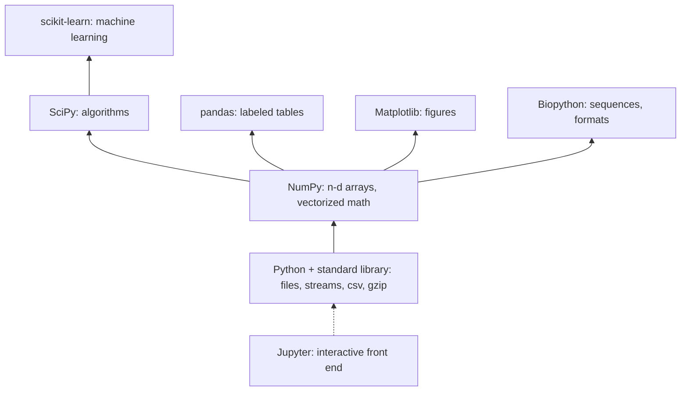

---
aliases:
  - SciPy Stack
  - PyData Stack
  - Écosystème Python scientifique
tags:
  - type/concept
  - domain/computer-science
  - domain/bioinformatics
  - level/L1
  - level/L2
mastery: 0
prerequisites:
  - "[[Python Programming]]"
related:
  - "[[N-Dimensional Array]]"
  - "[[Data Frame]]"
  - "[[Computational Notebook]]"
  - "[[Vectorization]]"
  - "[[Data Visualization]]"
  - "[[Statistical Learning]]"
  - "[[Sparse Matrix]]"
  - "[[Dependency Management]]"
  - "[[FASTA Format]]"
projects:
  - "[[Bioinformatics Lab]]"
  - "[[07-evolution-simulator]]"
sources:
  - "[[Python for Data Analysis (McKinney)]]"
  - "[[Harris 2020 - Array Programming with NumPy]]"
  - "[[Biopython]]"
---

# Scientific Python Ecosystem

> [!abstract]
> Scientific Python is a stack of libraries built on one shared object, the NumPy array: knowing what each layer provides tells you where a problem belongs, before you write a loop or install a package.

## Definition

The **scientific Python ecosystem** is the set of open-source libraries that turn Python into a language for numerical and data work. Its foundation is **NumPy** and its n-dimensional array, on which the other libraries build and through which they exchange data; NumPy increasingly acts as an interoperability layer between array libraries.[^harris] The core used throughout this curriculum: NumPy, SciPy, pandas, Matplotlib, scikit-learn, Jupyter for interactive work, and Biopython for molecular biology.[^mckinney][^biopython]

## Why it matters

- **Most analyses are a few library calls at the right layer.** A per-position quality profile is one NumPy reduction, a sample sheet join one pandas merge, a test one SciPy call. Choosing the wrong layer costs either speed (Python loops over numbers) or clarity (arrays where a labeled table was needed).
- **The Lab stack.** The [[Bioinformatics Lab]] adds NumPy, SciPy, pandas, NetworkX and Biopython once the standard-library versions exist; [[07-evolution-simulator]] keeps its population state in arrays.
- **Dependencies are part of the result.** Every layer is a pinned dependency of your project ([[Dependency Management]]).

## Core (L1)



| Layer | Provides | Bioinformatics example |
|---|---|---|
| Standard library | Text and binary I/O, compression, iteration, `csv`, `statistics` | stream a FASTQ file record by record ([[File Input and Output]], [[Iterator]]) |
| **NumPy** | The `ndarray`: fixed-type n-dimensional arrays, vectorized arithmetic and reductions, linear algebra, random numbers[^mck4][^harris] | quality scores as a reads × positions `uint8` matrix ([[N-Dimensional Array]]) |
| **SciPy** | Algorithms on arrays: `integrate` (quadrature, ODE solvers), `linalg`, `optimize`, `signal`, `sparse`, `special`, `stats`[^mckinney] | fit a kinetic model, test two groups, store a sparse single-cell matrix ([[Sparse Matrix]]) |
| **pandas** | `Series` and `DataFrame`: labeled, heterogeneous columns; loading, cleaning, merging, reshaping, group operations[^mckinney] | join a sample sheet to a gene count table ([[Data Frame]]) |
| **Matplotlib** | Figures and plots from arrays and tables[^mck9] | GC distributions, quality profiles ([[Data Visualization]]) |
| **scikit-learn** | Machine learning: classification, regression, clustering, dimensionality reduction, model selection, preprocessing[^mckinney] | PCA of samples, a classifier of cell types ([[Statistical Learning]]) |
| **Biopython** | Sequence objects, file formats (`Bio.SeqIO`), alignments, 3D structures, interfaces to BLAST and other tools, online database access[^biopython] | parse GenBank, fetch records from NCBI |
| **Jupyter** | Interactive notebooks mixing code, output and text[^mck2] | exploration ([[Computational Notebook]]) |

**Which layer does a problem belong to?** Look at the shape of the data first:

1. A **stream of records** (reads, FASTA entries) → standard library generators, or `Bio.SeqIO` once your own parser exists.
2. A **homogeneous numeric grid** (positions × reads, genes × samples, one-hot sequences) → NumPy.
3. A **standard numerical method** on such a grid (optimization, test, interpolation, sparse storage) → SciPy, never a hand-rolled version in production.
4. A **table of named, typed columns** with joins and groups → pandas ([[Tidy Data]]).
5. A **predictive model** with cross-validation → scikit-learn; a model you want to interpret with p-values and confidence intervals → SciPy or statsmodels.[^mckinney]

Use the lowest layer that expresses the problem, and write the algorithm by hand once before calling the library, as the Lab requires (see [[Programming]]).

## Deeper (L2)

**One array, many libraries.** Data move between layers as NumPy arrays: a pandas column converts with `.to_numpy()`, SciPy and scikit-learn accept arrays, Matplotlib plots them (worked example). pandas itself is built on NumPy.[^mckinney] Conversions are cheap when no copy is needed and expensive when types differ, so keep numeric data numeric from parsing onward.

**Interoperability beyond NumPy.** Array protocols let other array implementations, for distributed, GPU or sparse arrays, accept code written against NumPy's API, which is why NumPy is described as an interoperability layer.[^harris] For data larger than memory, see [[Out-of-Core Computation]].

**Versions move.** The stack evolves quickly: this note ran on NumPy 2.4.6, SciPy 1.17.1, pandas 3.0.6, Matplotlib 3.11.2, scikit-learn 1.9.1 and Biopython 1.88, newer than the versions McKinney's 3rd edition targets. Biopython's API changes between releases, so pin versions per project and read the matching documentation.[^biopython]

**Domain stacks sit on top.** Specialized tools for single-cell, structures or phylogenetics reuse these layers; when a step needs compiled speed, Python calls compiled code through a [[Command-Line Interface]] or a [[Foreign Function Interface]].

## Mathematical representation

The ecosystem is not a mathematical object, but its dependency structure is a directed acyclic graph $G = (V, E)$: packages $V$, and an edge $u \to v$ when $u$ requires $v$. Define the **layer** of a package as the length of its longest dependency path to NumPy. From the installed metadata below: NumPy is layer 0; SciPy, pandas, Matplotlib and Biopython layer 1; scikit-learn layer 2 (it requires SciPy). Upgrading a package of layer $k$ can affect every package above it, which is why lock files record the whole graph.

## Computational representation

Reading the declared dependencies of the installed stack (Python 3.11, in a virtual environment):

```python
import re
from importlib.metadata import requires, version

STACK = ["numpy", "scipy", "pandas", "matplotlib", "scikit-learn", "biopython"]


def runtime_deps(dist: str) -> list[str]:
    """Names of required distributions, ignoring optional extras."""
    reqs = requires(dist) or []
    return sorted({re.split(r"[ ;<>=!~\[(]", r, maxsplit=1)[0].lower()
                   for r in reqs if "extra ==" not in r})


for dist in STACK:
    deps = runtime_deps(dist)
    print(f"{dist:13} {version(dist):8} needs: {', '.join(d for d in deps if d in STACK) or '-'}"
          f"  (+{len([d for d in deps if d not in STACK])} other)")
```

```text
numpy         2.4.6    needs: -  (+0 other)
scipy         1.17.1   needs: numpy  (+0 other)
pandas        3.0.6    needs: numpy  (+2 other)
matplotlib    3.11.2   needs: numpy  (+8 other)
scikit-learn  1.9.1    needs: numpy, scipy  (+3 other)
biopython     1.88     needs: numpy  (+0 other)
```

Every library of the stack requires NumPy, and NumPy requires nothing: the layering of the diagram is visible in the packages' own metadata.

## Worked example

> [!example] One question, five layers
> Question: do reads from two (invented) conditions differ in GC content? 40 random 150-nt reads per group, with expected GC 0.40 (`ctrl`) and 0.46 (`trt`).
> ```python
> import io
> import numpy as np
> import pandas as pd
> from scipy import stats
> from Bio import SeqIO
> from Bio.SeqUtils import gc_fraction
> import matplotlib
> matplotlib.use("Agg")
> import matplotlib.pyplot as plt
>
> rng = np.random.default_rng(7)
> def toy_fasta(prefix, p_gc, n=40, length=150):
>     probs = [(1 - p_gc) / 2, p_gc / 2, p_gc / 2, (1 - p_gc) / 2]      # A, C, G, T
>     return "".join(f">{prefix}{i}\n{''.join(rng.choice(list('ACGT'), size=length, p=probs))}\n"
>                    for i in range(n))
> fasta = toy_fasta("ctrl", 0.40) + toy_fasta("trt", 0.46)              # invented reads
>
> records = list(SeqIO.parse(io.StringIO(fasta), "fasta"))              # Biopython: parsing
> gc = np.array([gc_fraction(r.seq) for r in records])                  # NumPy: numeric array
> table = pd.DataFrame({"id": [r.id for r in records], "gc": gc})       # pandas: labeled table
> table["group"] = table["id"].str.extract(r"^([a-z]+)")
> print(table.groupby("group")["gc"].agg(["count", "mean", "std"]).round(3))
> test = stats.mannwhitneyu(table.loc[table.group == "ctrl", "gc"],      # SciPy: statistics
>                           table.loc[table.group == "trt", "gc"])
> print(f"Mann-Whitney U = {test.statistic:.0f}, p = {test.pvalue:.2g}")
> fig, ax = plt.subplots(figsize=(4, 3))                                 # Matplotlib: figure
> table.boxplot(column="gc", by="group", ax=ax)
> fig.savefig("gc_by_group.png", dpi=100)
> ```
> ```text
>        count   mean    std
> group
> ctrl      40  0.393  0.042
> trt       40  0.455  0.043
> Mann-Whitney U = 237, p = 6e-08
> ```
> Each layer does one job: Biopython parses, NumPy holds the 80 numbers, pandas attaches labels and groups, SciPy tests, Matplotlib draws. The data cross every boundary as an `ndarray` of `float64`. In the Lab, the parsing line would first be your own [[FASTA Format|FASTA]] reader, with Biopython as a test oracle.

## Common misconceptions

> [!warning] "pandas replaces NumPy"
> pandas is built on NumPy and adds labels and heterogeneous columns.[^mckinney] A three-dimensional reads × positions × bases array has no natural table form: it stays in NumPy.

> [!warning] "With Biopython I do not need the algorithms"
> Biopython is a toolkit and a test oracle; using it before writing the algorithm skips the learning the Lab is built for.[^biopython]

> [!warning] "scikit-learn is the statistics library"
> It targets prediction (fit, predict, cross-validate). Hypothesis tests and interpretable models with standard errors live in `scipy.stats` and statsmodels.[^mckinney]

## Exercises

> [!question] Exercise 1 (L1)
> Assign a layer to each task: (a) read a 40 GB FASTQ in constant memory; (b) mean Phred score per position over a million 150-nt reads; (c) join a sample sheet to a count table by sample ID; (d) fit Michaelis-Menten parameters to rate data; (e) a PCA of 50 samples followed by k-means; (f) translate a coding sequence with NCBI table 11.

> [!success]- Solution
> (a) standard-library generators over a gzip stream ([[Iterator]]); (b) NumPy, a `uint8` matrix reduced along axis 0 ([[N-Dimensional Array]]); (c) pandas `merge` ([[Data Frame]]); (d) SciPy `optimize` (nonlinear least squares); (e) scikit-learn (PCA, then k-means, ideally in one pipeline); (f) your own [[Genetic Code|codon table]] code first, then Biopython to check it.

> [!question] Exercise 2 (L1)
> A colleague stores one-hot encoded reads (2 million reads × 150 positions × 4 bases) in a pandas DataFrame with 600 columns. What is wrong, and what layer fits?

> [!success]- Solution
> The data are a homogeneous 3-D numeric grid: the column labels add nothing and the third axis is flattened into names. A NumPy `uint8` array of shape `(2_000_000, 150, 4)` takes $2 \times 10^6 \times 600 = 1.2 \times 10^9$ bytes and supports reductions along any axis ([[N-Dimensional Array]]).

> [!question] Exercise 3 (L2, Python)
> Counts per million (CPM) divide each count by its sample's total and multiply by $10^6$. Rewrite this double loop at the right layer and check that both agree.
> ```python
> counts = pd.DataFrame({"s1": [10, 200, 3], "s2": [0, 150, 8], "s3": [25, 310, 0]},
>                       index=["geneA", "geneB", "geneC"])               # invented
> slow = counts.copy().astype(float)
> for gene in counts.index:
>     for s in counts.columns:
>         slow.loc[gene, s] = counts.loc[gene, s] / counts[s].sum() * 1e6
> ```

> [!success]- Solution
> ```python
> fast = counts / counts.sum(axis=0) * 1e6      # column totals, aligned by sample label
> print(fast.round(0))
> print(np.allclose(slow, fast))
> ```
> ```text
>              s1        s2        s3
> geneA   46948.0       0.0   74627.0
> geneB  938967.0  949367.0  925373.0
> geneC   14085.0   50633.0       0.0
> True
> ```
> The loop recomputes each column sum once per gene and goes through label lookup for every cell; the vectorized line computes 3 sums and one aligned division. On a 2000 × 12 table it took 0.49 ms here. See [[Count Normalization]] for why CPM alone is not enough.

> [!question] Exercise 4 (L2, Python)
> Using `runtime_deps`, list the packages of `STACK` that depend on SciPy. What does that imply when a SciPy upgrade changes a default?

> [!success]- Solution
> `[d for d in STACK if "scipy" in runtime_deps(d)]` returns `['scikit-learn']`. A SciPy change can alter scikit-learn results without any change in your code, so pin both in the lock file and re-run the tests on upgrades ([[Dependency Management]], [[Numerical Testing]]).

## Mastery checklist

- [ ] 1 Recognized: I can say in one line what NumPy, SciPy, pandas, Matplotlib, scikit-learn, Biopython and Jupyter each provide.
- [ ] 2 Understood: I can explain why NumPy is the foundation and how data move between layers.
- [ ] 3 Practiced: I can assign a task to its layer from the shape of its data and rewrite a loop at the right layer.
- [ ] 4 Applied: my Lab projects declare and pin exactly the layers they use, and use Biopython as a test oracle for my own code.
- [ ] 5 Explained: I can teach the layering, its dependency graph and the cost of choosing the wrong layer.

## References

[^harris]: [[Harris 2020 - Array Programming with NumPy]], *Nature* 585:357-362: NumPy as the foundation of scientific Python and an interoperability layer between array libraries; array protocols.
[^mckinney]: [[Python for Data Analysis (McKinney)]], 3rd ed. (2022): overview of the essential libraries (NumPy, pandas, Matplotlib, Jupyter, SciPy submodules, scikit-learn, statsmodels) and pandas as built on NumPy; chapter numbers not verified for these passages.
[^mck2]: [[Python for Data Analysis (McKinney)]], 3rd ed., ch. 2 "Python Language Basics, IPython, and Jupyter Notebooks".
[^mck4]: [[Python for Data Analysis (McKinney)]], 3rd ed., ch. 4 "NumPy Basics: Arrays and Vectorized Computation".
[^mck9]: [[Python for Data Analysis (McKinney)]], 3rd ed., ch. 9 "Plotting and Visualization".
[^biopython]: [[Biopython]], Cock et al. 2009, *Bioinformatics* 25(11):1422-1423 (modules for sequences, file formats, alignments, structures, tool interfaces, online databases) and the project's caveats on API changes between releases; tier C for usage advice.
