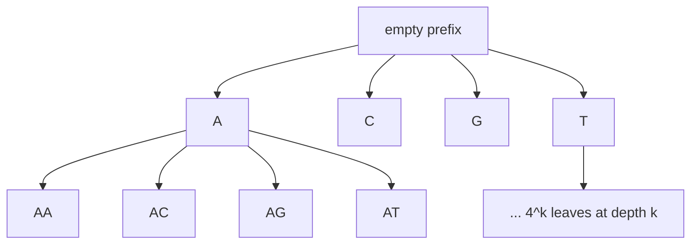

---
aliases:
  - Brute-Force Search
  - Brute Force
  - Generate and Test
  - Recherche exhaustive
tags:
  - type/algorithm
  - domain/computer-science
  - domain/bioinformatics
  - level/L1
  - level/L2
  - level/L3
mastery: 0
prerequisites:
  - "[[Big O Notation]]"
  - "[[Recursion]]"
  - "[[Combinatorics]]"
  - "[[K-mer]]"
  - "[[Hamming Distance]]"
related:
  - "[[Motif Finding]]"
  - "[[Sequence Motif]]"
  - "[[Branch and Bound]]"
  - "[[NP-Completeness]]"
  - "[[Property-Based Testing]]"
projects:
  - "[[05-sequence-search]]"
  - "[[bio-algorithms]]"
sources:
  - "[[Bioinformatics Algorithms (Compeau)]]"
  - "[[An Introduction to Bioinformatics Algorithms (Jones)]]"
---

# Exhaustive Search

> [!abstract]
> Exhaustive search solves a problem by generating every candidate solution and testing each one: always correct and simple to write, it is the baseline against which faster algorithms are checked, but its cost is the size of the candidate space, which grows exponentially with the length of a motif.

## Problem

- **Input**: a finite candidate space $C$ (all k-mers, all choices of one k-mer per sequence, all subsets...) and a test $P(x)$ or an objective $f(x)$ computable for each $x \in C$.
- **Output**: every candidate that passes the test, or one candidate that minimizes (or maximizes) the objective.
- **Biological use**: finding regulatory motifs by trying all k-mers as candidate motifs, or all choices of one k-mer per sequence, as in the motif chapter of Compeau and Pevzner;[^compeau-motif] counting frequent words; reference answers for testing faster code ([[bio-algorithms]]); exact answers to small instances of hard problems ([[NP-Completeness]]).

## Intuition

If the answer is somewhere in a finite set, look everywhere. Correctness needs only two arguments: the enumeration produces every candidate, and the test is right for each one. Everything else is cost: the number of candidates times the cost of testing one. That product is the whole analysis, and it is why exhaustive search is the first algorithm to write and usually not the last one to run.

## Mathematical formulation

**Generic form.** $x^* = \arg\min_{x \in C} f(x)$, in time $T = |C| \cdot T_f + T_{\mathrm{gen}}$, where $T_f$ is the cost of evaluating $f$ once and $T_{\mathrm{gen}}$ the cost of generating the candidates.

**Motifs.** Let $\mathrm{Dna} = (s_1, \dots, s_t)$ be $t$ strings of length $n$ over $\Sigma = \{A, C, G, T\}$, and $k$ the motif length.[^compeau-motif]

- A **motif matrix** $M = (m_1, \dots, m_t)$ takes one k-mer $m_i$ from each $s_i$; $\mathrm{Score}(M) = \sum_{j=1}^{k} \big(t - \max_{x \in \Sigma} \#\{i : m_i[j] = x\}\big)$ counts the mismatches with the column-wise consensus. **Motif Finding**: minimize $\mathrm{Score}(M)$ over the $(n - k + 1)^t$ motif matrices.
- For a pattern $p \in \Sigma^k$: $d(p, s) = \min_{i} d_H(p, s[i..i+k-1])$, the best [[Hamming Distance]] to a k-mer of $s$, and $d(p, \mathrm{Dna}) = \sum_{i=1}^{t} d(p, s_i)$. **Median String**: minimize $d(p, \mathrm{Dna})$ over the $4^k$ patterns.
- **Equivalence.** For a fixed $M$, $\sum_i d_H(p, m_i)$ is a sum of one term per column, each smallest when $p[j]$ is the most frequent letter of column $j$; the consensus therefore minimizes it, and $\mathrm{Score}(M) = \min_p \sum_i d_H(p, m_i)$. Exchanging the two minimizations:
$$\min_M \mathrm{Score}(M) = \min_M \min_p \sum_i d_H(p, m_i) = \min_p \sum_i \min_{m_i} d_H(p, m_i) = \min_p d(p, \mathrm{Dna}).$$
The two problems have the same optimum,[^compeau-motif] but the second searches $4^k$ candidates instead of $(n - k + 1)^t$.

**Feasibility.** With a budget of $R$ elementary operations per second and $B$ seconds, an exhaustive search is feasible when $|C| \cdot T_f \le RB$; for median string, $4^k \cdot t(n - k + 1)k \le RB$ gives the largest feasible $k$.

## Algorithm

```text
EXHAUSTIVE-SEARCH(C, f)
1  best = NIL, best_value = +∞
2  for each candidate x in C              // the enumeration must reach every x
3      v = f(x)                           // test or score it
4      if v < best_value
5          best = x, best_value = v
6  return best, best_value

MEDIAN-STRING(Dna, k)    = EXHAUSTIVE-SEARCH(all 4^k k-mers, p ↦ d(p, Dna))
MOTIF-SEARCH(Dna, k)     = EXHAUSTIVE-SEARCH(all (n - k + 1)^t motif matrices, Score)
```

The k-mers can be generated in lexicographic order as the leaves of a search tree of depth $k$ in which every node has four children ([[Recursion]]); pruning whole subtrees of this tree is the idea of [[Branch and Bound]] (Exercise 3).[^jones]



## Complexity

| | Time | Space |
|---|---|---|
| Median string (all $4^k$ patterns) | $\Theta(4^k \cdot t(n - k + 1) \cdot k)$ | $O(k)$ beyond the input |
| Brute-force motif search (all motif matrices) | $\Theta((n - k + 1)^t \cdot tk)$ | $O(tk)$ |
| Branch and bound on the pattern tree | same worst case, far fewer nodes in practice | $O(k)$ stack |
| Greedy, randomized and Gibbs-sampling motif search[^compeau-motif] | polynomial per run | no optimality guarantee |

**Where it becomes infeasible.** Timing the median-string loop on a toy instance and extrapolating to $t = 10$ sequences of $n = 600$ bases (Implementation): in pure Python, $k = 10$ takes hours, $k = 12$ about two days and $k = 15$ about half a year, while the motif-matrix space ($593^{10} \approx 5 \times 10^{27}$ choices at $k = 8$) is out of reach for any $k$. Each extra base multiplies the time by 4, so a faster implementation gains only a constant: a factor of 16 buys exactly two more bases.

## Implementation

```python
import random
import time
from itertools import product

def hamming(p: str, q: str) -> int:
    return sum(a != b for a, b in zip(p, q))

def distance(pattern: str, dna: list[str]) -> int:
    """d(Pattern, Dna): sum over the strings of the best Hamming distance to one of their k-mers."""
    k = len(pattern)
    return sum(min(hamming(pattern, s[i:i + k]) for i in range(len(s) - k + 1)) for s in dna)

def median_string(dna: list[str], k: int) -> tuple[str, int]:
    """Exhaustive search over all 4^k candidate patterns, in lexicographic order."""
    best, best_d = "", float("inf")
    for letters in product("ACGT", repeat=k):
        pattern = "".join(letters)
        d = distance(pattern, dna)
        if d < best_d:
            best, best_d = pattern, d
    return best, best_d

def score(motifs: tuple[str, ...]) -> int:
    """Number of mismatches with the column-wise consensus."""
    return sum(len(motifs) - max(col.count(b) for b in "ACGT") for col in zip(*motifs))

def brute_force_motif_search(dna: list[str], k: int) -> tuple[tuple[str, ...], int]:
    """Exhaustive search over all (n - k + 1)^t choices of one k-mer per string."""
    windows = [[s[i:i + k] for i in range(len(s) - k + 1)] for s in dna]
    best = min(product(*windows), key=score)
    return best, score(best)

dna = ["TTGATCAACG", "CAGGTCTATG", "ACCTGAACGT"]   # invented, GATC planted with mutations
print(median_string(dna, 4), brute_force_motif_search(dna, 4))
print([p for p in ("".join(x) for x in product("ACGT", repeat=4)) if distance(p, dna) == 2])

random.seed(0)                                       # speed of the loop on toy data
t, n, k = 10, 100, 5
toy = ["".join(random.choices("ACGT", k=n)) for _ in range(t)]
start = time.perf_counter()
median_string(toy, k)
rate = 4**k * t * (n - k + 1) * k / (time.perf_counter() - start)   # character comparisons per second
print(f"{rate:.1e} character comparisons per second")
t, n = 10, 600                                       # extrapolation to a larger instance
for k in (8, 10, 12, 15):
    median = 4**k * t * (n - k + 1) * k / rate
    brute = (n - k + 1) ** t * t * k / rate
    print(f"k={k:>2}  median string {median / 3600:9.1f} h   brute-force motifs {brute / 3.15e7:.1e} years")
```

```text
('AACG', 2) (('GATC', 'GGTC', 'GAAC'), 2)
['AACG', 'GATC', 'TCAA']
6.3e+06 character comparisons per second
k= 8  median string       0.1 h   brute-force motifs 2.2e+15 years
k=10  median string       2.7 h   brute-force motifs 2.6e+15 years
k=12  median string      52.1 h   brute-force motifs 3.0e+15 years
k=15  median string    4145.2 h   brute-force motifs 3.6e+15 years
```

Timings are from one machine (CPython 3.11); the factor of 4 per base does not depend on it.

## Worked example

> [!example] Two exhaustive searches on a toy motif problem
> Data (invented): three strings of length 10 in which `GATC` was planted with mutations: `TTGATCAACG` (exact), `CAGGTCTATG` (`GGTC`, one mismatch), `ACCTGAACGT` (`GAAC`, one mismatch). $k = 4$, $t = 3$, $n = 10$.
> 1. **Candidate spaces.** Median string tests $4^4 = 256$ patterns; brute-force motif search tests $(10 - 4 + 1)^3 = 343$ motif matrices. With $n = 600$ and $t = 10$ the second space would hold about $5 \times 10^{27}$ matrices: choosing the formulation is the first optimization.
> 2. **Brute-force motif search** returns (`GATC`, `GGTC`, `GAAC`) with score 2: columns 2 and 3 each have one mismatch with the consensus `GATC`.
> 3. **Median string** returns `AACG` with $d = 2$: the same optimal value, as the equivalence predicts, but not the planted motif.
> 4. **Ties.** Three patterns reach $d = 2$: `AACG`, `GATC` and `TCAA`. `AACG` occurs exactly in the first and third strings by chance, and the lexicographic scan meets it first. Exhaustive search is exact for the score; whether the score's optimum is the biological signal depends on the model and on how short and weak the motif is.

## Limitations

> [!warning] Exponential in the parameters
> $4^k$ grows fourfold per base and $(n - k + 1)^t$ grows with every added sequence. Exhaustive search answers small $k$ exactly and nothing else; the measured table above is the honest summary.

> [!warning] Exact for the model, not for the biology
> The optimum of $\mathrm{Score}$ or $d(p, \mathrm{Dna})$ can be a chance pattern, tied with or better than the real motif (Worked example). Short motifs, few sequences and degenerate binding sites make this worse; the statistics of chance occurrences are in [[Sequence Motif]]. And if the generator silently misses candidates (an off-by-one in `range(len(s) - k + 1)`, a forgotten strand), the "exact" optimum is wrong: count the candidates against the formula in tests.

## Variants and successors

- **Search with pruning.** Explore the candidate tree depth-first and skip a subtree when a lower bound on all its leaves is not better than the best solution found: [[Branch and Bound]], exact with the same worst case. Search trees and branch-and-bound motif search are classic textbook material.[^jones]
- **Enumerating less.** For the implanted-motif problem, $(k, d)$-motifs (k-mers occurring in every string with at most $d$ mismatches) can be found by enumerating only the $d$-neighborhoods of the k-mers present in the data instead of all $4^k$ patterns[^compeau-motif] (neighborhoods are generated recursively, see [[Recursion]]).
- **Giving up the guarantee.** Greedy motif search, randomized motif search and Gibbs sampling trade optimality for speed;[^compeau-motif] see [[Greedy Algorithm]], [[Heuristic Algorithm]] and [[Motif Finding]].
- **Changing the formulation.** Median string instead of motif matrices, or dynamic programming instead of enumerating alignments: two sequences of length 100 have astronomically more alignments than the $101 \times 101$ cells of their alignment grid ([[Sequence Alignment]], [[Dynamic Programming]]).
- **As a test oracle.** Exhaustive search is the reference for checking faster algorithms on small random inputs ([[Property-Based Testing]]): two implementations that agree on thousands of random instances, one of them obviously correct, are strong evidence.

## Exercises

> [!question] Exercise 1 (L1)
> For $t = 10$ strings of length $n = 600$ and $k = 15$, compute the sizes of the median-string space and of the motif-matrix space. Then, at the measured $6.3 \times 10^6$ character comparisons per second, find the largest $k$ for which median string finishes within one hour.

> [!success]- Solution
> $4^{15} = 1{,}073{,}741{,}824 \approx 1.1 \times 10^9$ patterns, against $586^{10} \approx 4.8 \times 10^{27}$ motif matrices: about $4 \times 10^{18}$ times fewer candidates, for the same optimum. Time $= 4^k \cdot 10 \cdot (601 - k) \cdot k / (6.3 \times 10^6)$ seconds: $k = 9$ takes 0.62 h and $k = 10$ takes 2.7 h, so $k = 9$. Even a 100 times faster implementation only reaches $k = 12$ within the hour.

> [!question] Exercise 2 (L2, Python)
> With `hamming` and `product` from the Implementation, find all $(k, d)$-motifs of the toy data (k-mers occurring in every string with at most $d$ mismatches) for $k = 4$, $d = 1$ and $d = 2$. What do the results say about the choice of $d$?

> [!success]- Solution
> ```python
> def approx_occurs(pattern: str, s: str, d: int) -> bool:
>     k = len(pattern)
>     return any(hamming(pattern, s[i:i + k]) <= d for i in range(len(s) - k + 1))
>
> def motif_enumeration(dna: list[str], k: int, d: int) -> list[str]:
>     """All (k, d)-motifs: k-mers occurring in every string with at most d mismatches."""
>     candidates = ("".join(x) for x in product("ACGT", repeat=k))
>     return [p for p in candidates if all(approx_occurs(p, s, d) for s in dna)]
>
> dna = ["TTGATCAACG", "CAGGTCTATG", "ACCTGAACGT"]       # same invented toy data
> print(motif_enumeration(dna, 4, 1), len(motif_enumeration(dna, 4, 2)))
> ```
> Output: `['AAGG', 'AATG', 'ATCT', 'CACG', 'GATC', 'TACG', 'TCAA'] 215`. With $d = 1$ the planted `GATC` is among 7 candidates; with $d = 2$, 215 of the 256 4-mers qualify, because a 4-mer allowed 2 mismatches matches almost anything. $d$ must stay small relative to $k$ for the answer to mean something.

> [!question] Exercise 3 (L3, Python)
> Add branch and bound to median string: explore patterns as a tree of prefixes and prune a prefix when a lower bound on $d(p, \mathrm{Dna})$ for all its extensions is not better than the best pattern found so far. Prove the bound valid, check the answer against `median_string`, and count the visited nodes.

> [!success]- Solution
> For a prefix $q$ of length $m \le k$, take $\mathrm{LB}(q) = \sum_i \min_j d_H(q, s_i[j..j+m-1])$ over the start positions $j \le n - k$ of full k-mers. For any extension $p$ of $q$ and any window $w$, $d_H(p, w) \ge d_H(q, w[1..m])$; minimizing and summing preserve the inequality, so $\mathrm{LB}(q) \le d(p, \mathrm{Dna})$, with equality at full length. With `hamming` and `median_string` from the Implementation:
> ```python
> import random
>
> def prefix_bound(prefix: str, dna: list[str], k: int) -> int:
>     """Lower bound on d(P, Dna) for every k-mer P that starts with prefix."""
>     m = len(prefix)
>     return sum(min(hamming(prefix, s[i:i + m]) for i in range(len(s) - k + 1)) for s in dna)
>
> def branch_and_bound_median(dna: list[str], k: int) -> tuple[str, int, int]:
>     best, best_d, visited = "", float("inf"), 0
>     def extend(prefix: str) -> None:
>         nonlocal best, best_d, visited
>         visited += 1
>         bound = prefix_bound(prefix, dna, k)
>         if bound >= best_d:                          # no extension can beat the best
>             return
>         if len(prefix) == k:
>             best, best_d = prefix, bound
>             return
>         for base in "ACGT":
>             extend(prefix + base)
>     extend("")
>     return best, best_d, visited
>
> random.seed(5)
> k, motif, dna = 6, "GATTCA", []
> for _ in range(8):                                   # toy data: 8 strings of 80 bases
>     s = random.choices("ACGT", k=80)
>     planted = list(motif)
>     planted[random.randrange(k)] = random.choice("ACGT")   # at most one mutation
>     pos = random.randrange(80 - k + 1)
>     s[pos:pos + k] = planted
>     dna.append("".join(s))
> print(median_string(dna, k), branch_and_bound_median(dna, k), sum(4**l for l in range(k + 1)))
> ```
> Output: `('GATTCA', 6) ('GATTCA', 6, 1197) 5461`. Same answer after visiting 1,197 of the 5,461 nodes of the tree (22 %). Both searches scan patterns in lexicographic order and keep the first optimum, so they agree even with ties. The worst case is unchanged (a useless bound prunes nothing): branch and bound is exact, not guaranteed fast.

## Mastery checklist

- [ ] 1 Recognized: I can state what exhaustive search does and that its cost is the number of candidates times the cost of one test.
- [ ] 2 Understood: I can explain the median string and motif finding formulations, prove their equivalence, and say why $4^k$ is the better space.
- [ ] 3 Practiced: I can implement median string, brute-force motif search and $(k, d)$-motif enumeration, and count their candidates against the formulas.
- [ ] 4 Applied: in [[bio-algorithms]] or [[05-sequence-search]], an exhaustive version serves as the test oracle of a faster method, and I measured the largest feasible $k$ on real promoter sequences.
- [ ] 5 Explained: I can explain when exhaustive search is the right tool (small parameters, reference answers), when to prune or switch to heuristics, and why an exact optimum of a score can still miss the biological motif.

## References

[^compeau-motif]: [[Bioinformatics Algorithms (Compeau)]], chapter "Which DNA Patterns Play the Role of Molecular Clocks?" (the implanted motif problem and $(k, d)$-motifs, the Motif Finding and Median String problems and their equivalence, brute-force algorithms, then greedy, randomized and Gibbs-sampling motif search).
[^jones]: [[An Introduction to Bioinformatics Algorithms (Jones)]], treatment of exhaustive search (search trees, branch-and-bound motif and median string search).
