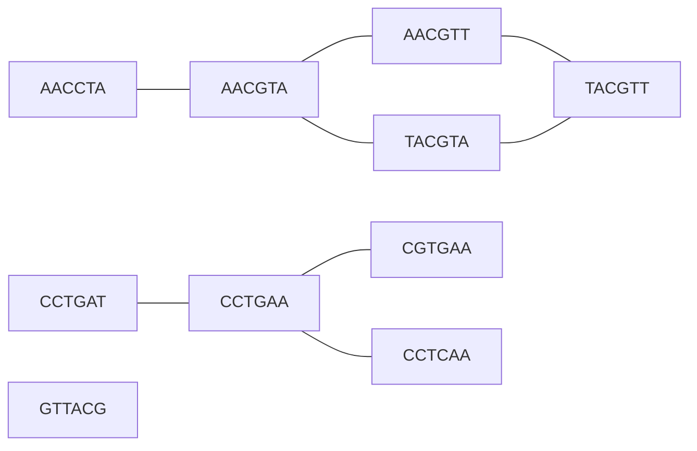

---
aliases:
  - Graph Search
  - Breadth-First Search
  - Depth-First Search
  - BFS
  - DFS
  - Parcours de graphe
tags:
  - type/algorithm
  - domain/computer-science
  - domain/mathematics
  - domain/bioinformatics
  - level/L1
  - level/L2
  - level/L3
mastery: 0
prerequisites:
  - "[[Graph]]"
  - "[[Graph Representation]]"
  - "[[Queue]]"
  - "[[Stack]]"
  - "[[Recursion]]"
  - "[[Big O Notation]]"
related:
  - "[[Connected Component]]"
  - "[[Directed Graph]]"
  - "[[Shortest Path]]"
  - "[[Topological Sort]]"
  - "[[De Bruijn Graph]]"
  - "[[Disjoint-Set Data Structure]]"
  - "[[Hamming Distance]]"
  - "[[Biological Network]]"
projects:
  - "[[08-phylogenetic-engine]]"
  - "[[bio-algorithms]]"
sources:
  - "[[Introduction to Algorithms (Cormen)]]"
  - "[[MIT 6.006 - Introduction to Algorithms]]"
  - "[[Coursera Stanford - Algorithms Specialization]]"
  - "[[Bioinformatics Algorithms (Compeau)]]"
---

# Graph Traversal

> [!abstract]
> Graph traversal visits every vertex reachable from a source by following edges, in $O(V + E)$ time on an adjacency list: breadth-first search (a FIFO queue) explores in order of distance and so finds shortest paths in edge count, depth-first search (a stack) goes deep first and exposes the graph's structure, and repeating either from unvisited vertices labels the connected components.

## Problem

- **Input**: a graph $G = (V, E)$, directed or undirected, stored as an adjacency list (for each vertex, the list of its neighbours), and a source $s \in V$ ([[Graph Representation]]).
- **Output**: the set of vertices reachable from $s$; for breadth-first search (BFS), the distance $\delta(s, v)$ in number of edges and a parent pointer giving one shortest path to each of them; for depth-first search (DFS), a visiting order and discovery and finishing times; over the whole graph, a component label for every vertex.[^clrs20]
- **Biological use**: walking assembly graphs, whose vertices are k-mers and whose paths spell candidate contigs ([[De Bruijn Graph]], [[Genome Assembly]]);[^compeau-asm] grouping sequences that are linked by chains of high similarity, such as reads or barcodes differing by sequencing errors (the connected components of a similarity graph); distances and neighbourhoods in [[Protein-Protein Interaction Network|protein interaction networks]] and reachability in [[Metabolic Network|metabolic networks]] ([[Biological Network]]); visiting every node of a [[Phylogenetic Tree]] ([[08-phylogenetic-engine]]).

## Intuition

Keep a **frontier**: vertices discovered but not yet explored. Repeatedly take one out, look at its neighbours, and add the undiscovered ones. Every traversal is this loop; the data structure holding the frontier decides the order:

- **Queue (first in, first out)**: vertices leave in the order they were found, so the search spreads in rings around the source, all vertices at distance 1, then distance 2... This is BFS ([[Queue]]).
- **Stack (last in, first out)**: the most recent discovery is explored next, so the search runs down one path as far as it can, then backtracks. This is DFS ([[Stack]], [[Recursion]]).

Marking vertices as discovered is what makes the cost linear: without marks, a cycle sends the search around forever, and shared neighbours are explored many times.

## Mathematical formulation

**Reachability.** $v$ is reachable from $s$ if there is a path $s = v_0, v_1, \dots, v_k = v$ with $(v_{i-1}, v_i) \in E$. The distance $\delta(s, v)$ is the smallest such $k$ ($\infty$ if none). In an undirected graph, "reachable" is an equivalence relation, whose classes are the **connected components** ([[Connected Component]]).

**Any traversal marks exactly the reachable vertices.**

- *Only reachable ones*: a vertex is marked only when it is a neighbour of a marked vertex, so by induction on marking time each marked vertex is joined to $s$ by a path.
- *All reachable ones*: suppose $v$ is reachable and never marked. On a path from $s$ to $v$, let $v_i$ be the first unmarked vertex; $v_{i-1}$ is marked, so it entered the frontier, was later taken out and had its neighbours scanned, which marks $v_i$. Contradiction.

**BFS computes distances.** Let $d[v]$ be the value BFS assigns.

1. $d[v] \ge \delta(s, v)$: each assignment $d[v] = d[u] + 1$ extends a path of length $d[u]$ by one edge.
2. At every moment the queue holds vertices with labels $d_1 \le d_2 \le \dots \le d_r \le d_1 + 1$ (enqueued vertices get $d[u] + 1$ while $u$ has the smallest label), so vertices leave in non-decreasing order of $d$ ([[Queue]]).
3. By induction on $k = \delta(s, v)$: take $u$ before $v$ on a shortest path, with $d[u] = k - 1$ by induction. When $u$ is dequeued, either $v$ is new and gets $d[v] = k$, or it was discovered earlier by some $w$ dequeued before $u$, so $d[w] \le d[u]$ and $d[v] \le k$. With item 1, $d[v] = k$.[^clrs20]

**Cost.** Each vertex enters the frontier once (marking on discovery) and each adjacency list is scanned once, when its vertex is explored: $\sum_{v} (1 + \deg(v)) = V + 2E$ for an undirected graph, $V + E$ for a directed one. So BFS and DFS run in $\Theta(V + E)$ on the reachable part.[^clrs20] With an adjacency matrix, finding the neighbours of a vertex means reading a whole row of $V$ entries, and the same traversal costs $\Theta(V^2)$.

**DFS structure.** Number the moments when DFS first discovers a vertex ($\mathrm{disc}$) and finishes scanning its neighbours ($\mathrm{fin}$). For any two vertices, the intervals $[\mathrm{disc}(u), \mathrm{fin}(u)]$ and $[\mathrm{disc}(v), \mathrm{fin}(v)]$ are either disjoint or nested, nested exactly when one is a descendant of the other in the DFS tree (the parenthesis structure).[^clrs20] Finishing times are what [[Topological Sort]] and strongly connected components are built on.

## Algorithm

```text
BFS(G, s)                                  DFS(G, s)   (iterative)
1  dist[s] = 0; parent[s] = NIL            1  stack = [s]; seen = {}
2  Q = queue containing s                  2  while stack not empty
3  while Q not empty                       3      u = POP(stack)
4      u = DEQUEUE(Q)                      4      if u in seen: continue
5      for v in Adj[u]                     5      add u to seen; visit u
6          if v not discovered             6      for v in Adj[u], in reverse
7              dist[v] = dist[u] + 1       7          if v not in seen: PUSH(stack, v)
8              parent[v] = u
9              ENQUEUE(Q, v)               COMPONENTS(G): for each vertex s not yet
                                             labelled, traverse from s and give every
                                             vertex reached a new label
```

The toy graph below joins invented 6-nt barcodes that differ at exactly one position ([[Hamming Distance]] 1), as a sequencing error would. It has three components; the first contains a cycle.



## Complexity

| | Time | Space |
|---|---|---|
| BFS or DFS, adjacency list | $\Theta(V + E)$ | $\Theta(V)$ marks; frontier up to $O(V)$ (BFS) or $O(E)$ (iterative DFS that pushes before checking) |
| BFS or DFS, adjacency matrix | $\Theta(V^2)$ | $\Theta(V^2)$ for the matrix itself |
| Connected components by repeated traversal | $\Theta(V + E)$ in total | $\Theta(V)$ labels |
| Components with edges arriving one by one | near-linear, via [[Disjoint-Set Data Structure\|union-find]][^clrs-ds] | $\Theta(V)$ |
| Weighted shortest paths | more than linear: a priority queue replaces the FIFO queue (Dijkstra)[^6006] | $\Theta(V)$ |

The restart loop of `COMPONENTS` is still linear in total: each vertex is reached by exactly one traversal, and each edge is scanned only by the traversal of its component.

## Implementation

Standard library only: an adjacency list is a `dict` of lists, the BFS queue a `collections.deque` (never `list.pop(0)`, see [[Queue]]), the DFS frontier a plain `list` used as a stack.

```python
from collections import deque
from itertools import combinations

def hamming(s: str, t: str) -> int:
    return sum(a != b for a, b in zip(s, t))

def similarity_graph(seqs: list[str], max_d: int) -> dict[str, list[str]]:
    """Undirected adjacency list: an edge joins two sequences at Hamming distance <= max_d."""
    adj = {s: [] for s in seqs}
    for s, t in combinations(seqs, 2):
        if hamming(s, t) <= max_d:
            adj[s].append(t)
            adj[t].append(s)
    return adj

def bfs(adj: dict, source) -> tuple[dict, dict]:
    """Distances (number of edges) and BFS-tree parents of every vertex reachable from source."""
    dist, parent = {source: 0}, {source: None}
    queue = deque([source])
    while queue:
        u = queue.popleft()
        for v in adj[u]:
            if v not in dist:                     # mark on discovery: each vertex enqueued once
                dist[v], parent[v] = dist[u] + 1, u
                queue.append(v)
    return dist, parent

def shortest_path(parent: dict, target) -> list | None:
    if target not in parent:
        return None                               # not reachable from the source
    path = []
    while target is not None:
        path.append(target)
        target = parent[target]
    return path[::-1]

def dfs_preorder(adj: dict, source) -> list:
    """Iterative depth-first search; same visiting order as the recursive version."""
    seen, order, stack = set(), [], [source]
    while stack:
        u = stack.pop()
        if u in seen:
            continue
        seen.add(u)
        order.append(u)
        stack.extend(v for v in reversed(adj[u]) if v not in seen)
    return order

def connected_components(adj: dict) -> list[list]:
    seen, comps = set(), []
    for s in adj:                                 # restart from every vertex not yet labelled
        if s not in seen:
            comp = list(bfs(adj, s)[0])
            seen.update(comp)
            comps.append(comp)
    return comps

barcodes = ["AACGTT", "AACGTA", "AACCTA", "TACGTT", "TACGTA",   # invented 6-nt barcodes
            "CCTGAA", "CCTGAT", "CGTGAA", "CCTCAA", "GTTACG"]
adj = similarity_graph(barcodes, max_d=1)
dist, parent = bfs(adj, "AACCTA")
print("BFS distances:", dist)
print("path:", shortest_path(parent, "TACGTT"), "| unreachable:", shortest_path(parent, "CCTGAA"))
print("DFS order:", dfs_preorder(adj, "AACCTA"))
comps = connected_components(adj)
print("components:", comps)
print("largest Hamming distance inside each:", [max(hamming(s, t) for s in c for t in c) for c in comps])

chain = {i: [i + 1] for i in range(100_000)} | {100_000: []}  # a path of 100,001 vertices
print("vertices reached on a long path:", len(dfs_preorder(chain, 0)))
```

```text
BFS distances: {'AACCTA': 0, 'AACGTA': 1, 'AACGTT': 2, 'TACGTA': 2, 'TACGTT': 3}
path: ['AACCTA', 'AACGTA', 'AACGTT', 'TACGTT'] | unreachable: None
DFS order: ['AACCTA', 'AACGTA', 'AACGTT', 'TACGTT', 'TACGTA']
components: [['AACGTT', 'AACGTA', 'TACGTT', 'AACCTA', 'TACGTA'], ['CCTGAA', 'CCTGAT', 'CGTGAA', 'CCTCAA'], ['GTTACG']]
largest Hamming distance inside each: [3, 2, 0]
vertices reached on a long path: 100001
```

Three lessons from the output. DFS reaches `TACGTA` last, four edges deep in its tree, although its distance is 2: DFS order says nothing about distances. Components chain: `AACCTA` and `TACGTT` differ at 3 positions but share a component through intermediate barcodes, the single-linkage effect ([[Hierarchical Clustering]], [[Minimum Spanning Tree]]). And the explicit stack walks a 100,001-vertex path that a recursive DFS could not, since CPython's default recursion limit is about a thousand frames ([[Recursion]]); a genome region without repeats gives exactly such a long non-branching path in a de Bruijn graph.

The edge-building loop compares all $\binom{n}{2}$ pairs, $\Theta(n^2 L)$ for $n$ sequences of length $L$: for millions of reads, the graph itself must be built from an index ([[Inverted Index]]), and then the traversal is the cheap part.

## Worked example

> [!example] BFS from `AACCTA` on the barcode graph, step by step
> Each line dequeues one vertex, discovers its unmarked neighbours and shows the queue afterwards:
> ```text
> dequeue AACCTA (d=0) discover ['AACGTA'] queue ['AACGTA']
> dequeue AACGTA (d=1) discover ['AACGTT', 'TACGTA'] queue ['AACGTT', 'TACGTA']
> dequeue AACGTT (d=2) discover ['TACGTT'] queue ['TACGTA', 'TACGTT']
> dequeue TACGTA (d=2) discover [] queue ['TACGTT']
> dequeue TACGTT (d=3) discover [] queue []
> ```
> 1. The queue always holds at most two consecutive distances (2 and 3 on line 3), as the invariant requires.
> 2. On line 4, `TACGTA` is adjacent to `TACGTT`, which is already marked: nothing happens. Marking at discovery, not at dequeue, is what keeps `TACGTT` from entering the queue twice through the cycle.
> 3. The BFS tree (parent pointers) has 4 edges for 5 vertices; following parents from `TACGTT` gives the shortest path `AACCTA → AACGTA → AACGTT → TACGTT`, 3 substitutions, which equals the Hamming distance between the endpoints. With one substitution per edge, a path can never be shorter than the Hamming distance (triangle inequality), and in a graph of observed barcodes only it can be longer, or missing.
> 4. The traversal stops with 5 vertices: the other 5 barcodes are in other components, found by restarting from them.

## Limitations

> [!warning] "DFS also finds shortest paths, just in another order"
> DFS reaches a vertex by the first path it happens to follow; in the barcode graph that path to `TACGTA` has 4 edges, against a distance of 2. Only BFS (unweighted), or Dijkstra's algorithm and its relatives (weighted), give shortest paths ([[Shortest Path]]).

> [!warning] "In a directed graph, a traversal from each vertex gives the components"
> Reachability is not symmetric in a [[Directed Graph]]: in the de Bruijn graph of Exercise 4, every vertex is reachable from `TA` but `TA` is reachable from none. Mutual reachability classes are the **strongly connected components**, computed with two depth-first searches;[^clrs20] a plain traversal only gives "everything downstream of $s$".

- **Unweighted only.** BFS counts edges. If edges carry lengths, costs or similarity scores, a path with fewer edges can be worse; edge weights of 0 and 1 still allow a deque-based BFS ([[Queue]]).
- **Memory, not time, is the limit at genome scale.** The marks alone cost one entry per vertex: for a de Bruijn graph with billions of k-mers, a Python `set` of strings is out of the question, and traversals must run on compact or implicit graphs where neighbours are computed (extend a k-mer by A, C, G, T and look it up) rather than stored.
- **Thresholds shape components.** Components of a similarity graph depend on the threshold, and chaining can merge unrelated groups through a few intermediate sequences; the result is single-linkage clustering, with its known weakness.

## Variants and successors

- **Multi-source BFS**: start with all sources in the queue at distance 0; in one $O(V + E)$ pass each vertex gets its distance to the nearest source and that source's label, for instance the nearest expected barcode of each observed one ([[Demultiplexing]]).
- **Bidirectional BFS**: search from both ends and stop when the frontiers meet; useful for one pair in a large graph.
- **0-1 BFS and Dijkstra**: weighted generalizations, with a deque or a [[Heap]] as the frontier ([[Queue]], [[Shortest Path]]).
- **DFS applications**: [[Topological Sort]] (reverse finishing order of a DAG), cycle detection, strongly connected components.[^clrs20][^stanford]
- **Eulerian paths**: assembly asks for a path using every edge of a de Bruijn graph once, a different question from visiting every vertex, solved in linear time ([[Eulerian Path]]); the vertex version is the NP-complete [[Hamiltonian Path]].[^compeau-asm]
- **Tree traversals**: preorder, inorder and postorder are DFS on a tree; level order is BFS ([[Tree (Graph Theory)]]).

## Exercises

> [!question] Exercise 1 (L1)
> Undirected graph with edges 1-2, 1-3, 2-4, 3-4, 4-5, 6-7, neighbours listed in increasing order. Give the BFS order and distances from 1, the DFS order from 1, the components, and the depth of vertex 3 in the DFS tree.

> [!success]- Solution
> BFS: 1, 2, 3, 4, 5 with distances 0, 1, 1, 2, 3. DFS: 1, 2, 4, 3, 5 (from 1 to 2, from 2 to 4, from 4 to 3, back to 4, then 5). Components $\{1, 2, 3, 4, 5\}$ and $\{6, 7\}$. Vertex 3 is at depth 3 in the DFS tree (1-2-4-3) but at distance 1: the DFS tree is not a shortest-path tree.

> [!question] Exercise 2 (L1)
> A BFS marks vertices when they are **dequeued** instead of when they are discovered. Is it still correct? What does it cost?

> [!success]- Solution
> It still terminates and, if the distance is recorded at the first dequeue, still returns correct distances: copies of a vertex leave the queue in non-decreasing order of their labels, so the first copy carries the smallest. But a vertex can be enqueued once per marked neighbour, so the queue can hold $\Theta(E)$ entries instead of at most $V$, and every duplicate must be skipped. On a dense similarity graph (each read similar to hundreds of others), that is hundreds of times more memory. Marking at discovery gives each vertex exactly one queue entry.

> [!question] Exercise 3 (L2)
> A k-mer graph has $V = 10^6$ vertices and $E = 3 \times 10^6$ undirected edges. Compare the memory of an adjacency matrix (1 bit per entry) and of an adjacency list (one 8-byte integer per list entry), and the number of basic steps of a BFS on each.

> [!success]- Solution
> Matrix: $V^2 = 10^{12}$ bits $= 1.25 \times 10^{11}$ bytes, 125 GB, and a BFS reads every row it explores: $V^2 = 10^{12}$ entries. List: $2E = 6 \times 10^6$ entries of 8 bytes, 48 MB (plus per-vertex overhead), and BFS does about $V + 2E = 7 \times 10^6$ steps. Biological graphs are **sparse** ($E = O(V)$: a k-mer has at most 8 neighbours in a de Bruijn graph, 4 successors and 4 predecessors), so adjacency lists, or neighbours computed on the fly, are the only practical representation ([[Space Complexity]], [[Graph Representation]]).

> [!question] Exercise 4 (L3, Python)
> Write an iterative DFS that records discovery and finishing times, run it on the de Bruijn graph of the 3-mers of the invented sequence `TAATGCCATGGGATGTT` (vertices are 2-mers, one edge per 3-mer), check the parenthesis structure, and compare what is reachable from `TA` and from `GG`.

> [!success]- Solution
> A stack of `(vertex, iterator over its neighbours)` pairs resumes each vertex where it stopped, which reproduces recursive DFS exactly, without recursion.
> ```python
> def dfs_times(adj: dict) -> tuple[dict, dict]:
>     """Discovery and finish times of a full DFS, with an explicit stack of iterators."""
>     time, disc, fin = 0, {}, {}
>     for s in adj:
>         if s in disc:
>             continue
>         disc[s] = time; time += 1
>         stack = [(s, iter(adj[s]))]
>         while stack:
>             u, it = stack[-1]
>             for v in it:
>                 if v not in disc:                 # tree edge: go deeper
>                     disc[v] = time; time += 1
>                     stack.append((v, iter(adj[v])))
>                     break
>             else:                                 # all neighbours explored: u finishes
>                 stack.pop()
>                 fin[u] = time; time += 1
>     return disc, fin
>
> def de_bruijn(seq: str, k: int) -> dict[str, list[str]]:
>     adj = {}
>     for i in range(len(seq) - k + 1):
>         kmer = seq[i:i + k]
>         adj.setdefault(kmer[:-1], []).append(kmer[1:])
>         adj.setdefault(kmer[1:], [])
>     return adj
>
> g = de_bruijn("TAATGCCATGGGATGTT", 3)
> disc, fin = dfs_times(g)
> print({v: (disc[v], fin[v]) for v in g})
> print(all(not (disc[u] < disc[v] < fin[u] < fin[v]) for u in g for v in g))
> print(sorted(bfs(g, "GG")[0]), sorted(bfs(g, "TA")[0]))
> ```
> ```text
> {'TA': (0, 21), 'AA': (1, 20), 'AT': (2, 19), 'TG': (3, 18), 'GC': (4, 9), 'CC': (5, 8), 'CA': (6, 7), 'GG': (10, 13), 'GA': (11, 12), 'GT': (14, 17), 'TT': (15, 16)}
> True
> ['AT', 'CA', 'CC', 'GA', 'GC', 'GG', 'GT', 'TG', 'TT'] ['AA', 'AT', 'CA', 'CC', 'GA', 'GC', 'GG', 'GT', 'TA', 'TG', 'TT']
> ```
> No two intervals cross: `GC` (4, 9) and `GG` (10, 13) are disjoint siblings, both nested in `TG` (3, 18). `AT` has three out-edges to `TG` because the 3-mer `ATG` occurs three times: the de Bruijn graph is a multigraph, and DFS simply skips the repeated, already-discovered target.[^compeau-asm] From `TA` everything is reachable; from `GG` neither `TA` nor `AA` is: `TA` is the start of the sequence and has no incoming edge. `GG` also has a self-loop (the 3-mer `GGG`). The cycle `AT → TG → GC → CC → CA → AT` comes from the repeated `ATG`: repeats create the cycles that make assembly ambiguous ([[Genome Assembly]]).

## Mastery checklist

- [ ] 1 Recognized: I can say what BFS and DFS compute and why each runs in $O(V + E)$ on an adjacency list.
- [ ] 2 Understood: I can prove that a traversal marks exactly the reachable vertices, that BFS distances are shortest, and state the parenthesis structure of DFS.
- [ ] 3 Practiced: I can implement BFS with parent pointers, iterative DFS with finishing times, and connected components, and test them on small graphs.
- [ ] 4 Applied: I traverse real graphs (a phylogenetic tree in [[08-phylogenetic-engine]], a de Bruijn graph built from reads) without recursion-depth or memory failures.
- [ ] 5 Explained: I can teach when to use BFS, DFS, union-find or Dijkstra, why directed graphs need strongly connected components, and how thresholds and chaining shape similarity-graph components.

## References

[^clrs20]: [[Introduction to Algorithms (Cormen)]], 4th ed. (2022), ch. 20 "Elementary Graph Algorithms": adjacency-list and adjacency-matrix representations; breadth-first search with a FIFO queue, shortest-path distances and breadth-first trees, $O(V + E)$ running time; depth-first search with discovery and finishing times and the parenthesis structure; topological sort and strongly connected components.
[^stanford]: [[Coursera Stanford - Algorithms Specialization]], course 2 "Graph Search, Shortest Paths, and Data Structures": BFS and DFS applications, connectivity.
[^clrs-ds]: [[Introduction to Algorithms (Cormen)]], 4th ed., treatment of disjoint-set data structures (union by rank and path compression, nearly linear total time).
[^6006]: [[MIT 6.006 - Introduction to Algorithms]], Spring 2020, graph algorithms part (graph search, then weighted shortest paths; lecture 13 "Dijkstra's Algorithm").
[^compeau-asm]: [[Bioinformatics Algorithms (Compeau)]], chapter "How Do We Assemble Genomes?" (de Bruijn graphs built from k-mers, with one edge per k-mer occurrence; Eulerian versus Hamiltonian paths).
