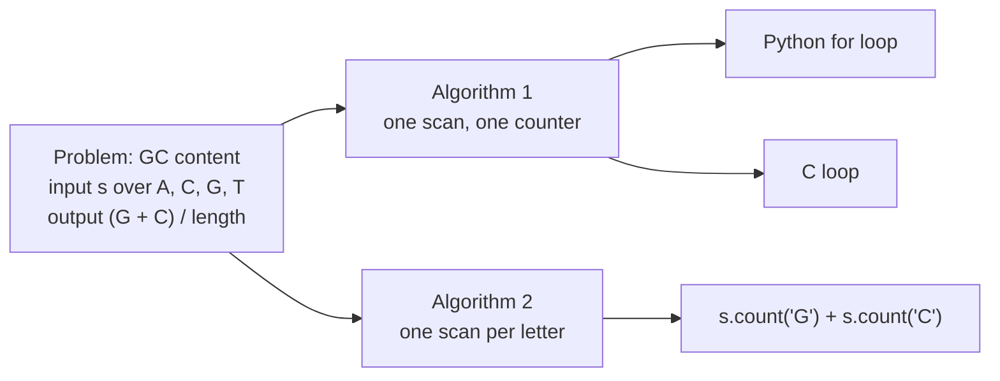

---
aliases:
  - Computational Model
  - Word-RAM Model
  - Word RAM
  - RAM Model
  - Cost Model
  - Modèle de calcul
tags:
  - type/concept
  - domain/computer-science
  - domain/mathematics
  - level/L1
  - level/L2
  - level/L3
mastery: 0
prerequisites:
  - "[[Python Programming]]"
  - "[[Binary Relation]]"
  - "[[Logarithm]]"
  - "[[Integer Representation]]"
related:
  - "[[Big O Notation]]"
  - "[[Loop Invariant]]"
  - "[[Space Complexity]]"
  - "[[Memory Hierarchy]]"
  - "[[External Memory Algorithm]]"
  - "[[Benchmarking]]"
projects:
  - "[[01-dna-engine]]"
  - "[[05-sequence-search]]"
sources:
  - "[[Introduction to Algorithms (Cormen)]]"
  - "[[MIT 6.006 - Introduction to Algorithms]]"
  - "[[Nurk 2022 - The Complete Sequence of a Human Genome]]"
  - "[[Blattner 1997 - The Complete Genome Sequence of Escherichia coli K-12]]"
  - "[[Fernández 2024 - A 160 Gbp Fork Fern Genome Shatters Size Record for Eukaryotes]]"
---

# Model of Computation

> [!abstract]
> A model of computation fixes which operations count as one step and what memory looks like, so that the cost of an algorithm becomes a number of steps that depends on the size of the input, not on the language or the machine.

## Definition

- A **computational problem** says, for every input, which outputs are correct: formally, a binary relation from problem inputs to correct outputs.[^6006-l1] One particular input is an **instance**.[^clrs1]
- An **algorithm** is a well-defined computational procedure that takes an input and produces an output in a finite amount of time. It is **correct** (it **solves** the problem) if, for every instance, it halts with a correct output.[^clrs1][^6006-l1]
- A **program** is one implementation of an algorithm, in one language, on one machine.
- A **model of computation** states which basic operations an algorithm may use and what each costs. Algorithm analysis uses the **word-RAM**: memory is an addressable sequence of $w$-bit machine words, and integer arithmetic, comparisons, logical and bitwise operations on $O(1)$ words, as well as reading or writing the word at a given address, each take constant time.[^6006-l1] Instructions execute one after another, with no concurrent operations.[^clrs2]

## Why it matters

- **Prediction before execution.** Counting steps gives a formula $T(n)$; timing one small run gives its constant; together they predict the cost on a 3.055 Gb human genome[^nurk] before a job runs for days (Worked example). [[01-dna-engine]] and [[05-sequence-search]] (100 to 1M sequences) are exercises in exactly this, checked by [[Benchmarking]].
- **Fair comparison.** A Python and a C implementation of one algorithm differ by a constant factor; two algorithms differ in how $T(n)$ grows ([[Big O Notation]]). The model separates the two questions.
- **Hidden loops.** `x in some_list`, `s[i:j]` and `a + b` on strings each hide a loop over the data; charging them one step is a classic analysis error in scientific scripts.
- **Where the model breaks.** Unit-cost memory access holds while the data fit in RAM, which is why genome indexes are designed around memory size ([[Space Complexity]], [[Memory Hierarchy]]).

## Core (L1)

### One problem, several algorithms, many programs



Correctness and growth belong to the algorithm, analyzed in the model; the constant factor belongs to the program and the machine.

### What one step is

| One step (constant time) | Not one step |
|---|---|
| `+`, `-`, `*`, `//`, `%`, comparisons and bitwise operations on word-size integers | arithmetic on integers longer than a word: Python `int` has no size limit |
| reading or writing `a[i]` | `x in xs` on a list (a scan), `s[i:j]` (a copy of $j - i$ characters), `s + t` on strings (a new string) |
| calling a function and returning (not the work inside it) | `sorted(xs)`, `sum(xs)`, `max(xs)`, `s.count(c)`: loops, even when written in C |

The cost of an algorithm on an input $x$ is the number of steps it executes. Its **worst-case running time** $T(n)$ is the largest such count over all inputs of size $n$, where $n$ counts the words or characters of the input (bases, for a sequence).[^clrs2] A scan that does a constant amount of work per base therefore costs $c \cdot n + c'$ steps, whatever the constants (Computational representation).

## Deeper (L2)

**The word must be able to address the input.** CLRS assume words of $c \lg n$ bits for a constant $c \ge 1$: at least $\lg n$ bits so that a word can hold the index of any input element, and only a constant factor more so that unbounded work cannot hide inside one word operation.[^clrs2] For genomes, a position needs $\lceil \log_2 n \rceil$ bits: 23 for *E. coli* K-12 (4,639,221 bp),[^blattner] 32 for one strand of the human T2T-CHM13 assembly (3.055 Gb),[^nurk] 33 for both strands and 38 for the 160.45 Gb genome of the fork fern *Tmesipteris oblanceolata*[^fernandez] (Exercise 3). A 32-bit offset (at most $2^{32} - 1 = 4{,}294{,}967{,}295$) indexes one human strand but not both.

**Big integers are not unit cost.** A $b$-bit integer occupies $\lceil b/w \rceil$ words, so adding two of them costs $\Theta(b/w)$ word operations. Python hides this: `4**k` is exact for any $k$, but its cost grows with its number of digits. Counting candidates with Python integers is harmless; using one huge integer as a bit vector over a genome is a loop in disguise.

**Several bases per word.** At 2 bits per base, one 64-bit word holds a [[K-mer]] with $k \le 32$ (Exercise 4). Comparing or hashing two packed k-mers costs $O(1)$ word operations instead of $\Theta(k)$ character comparisons, which makes $k = 32$ the natural limit for a k-mer stored in one machine word.

**Counting one dominant operation.** Analyses often count a single operation: comparisons for sorting, character comparisons for [[Exact Pattern Matching]]. Lower bounds are statements about such a model: comparison sorting needs $\Omega(n \log n)$ comparisons in the worst case, because comparing is the only way it learns about the keys,[^clrs-sort] and [[Radix Sort]] escapes the bound by reading the keys' letters directly ([[Sorting]]).

## Advanced (L3)

- **Polynomial time is model-independent.** For reasonable models, a problem solvable in polynomial time in one (the RAM) is solvable in polynomial time in another (the Turing machine).[^clrs-np] Exponents change from model to model; the class P does not, which is what lets [[NP-Completeness]] classify problems rather than machines.
- **External memory.** When data exceed RAM, transfers to and from secondary storage dominate, so B-tree algorithms are analyzed by their number of disk accesses.[^clrs-btree] The external-memory model makes this the cost: blocks of $B$ words, a memory of $M$ words, cost = number of block transfers ([[External Memory Algorithm]], sorting a BAM file larger than RAM).
- **Word-level parallelism.** Bit-parallel algorithms use a word as a vector of $w$ bits and update the state of up to $w$ pattern positions with a constant number of word operations ([[Bit-Parallel String Matching]]): $w$ becomes a resource, not just an address width.

## Mathematical representation

- A problem is a relation $R \subseteq I \times O$, with $(x, y) \in R$ iff $y$ is a correct output for input $x$. An algorithm computes $A : I \to O$ and solves $R$ iff $(x, A(x)) \in R$ for every $x \in I$.
- Each input has a size $|x| \in \mathbb{N}$ and a cost $t_A(x) \in \mathbb{N}$, the number of steps executed. Worst case $T_A(n) = \max_{|x| = n} t_A(x)$; best case: the minimum; average case: $\mathbb{E}[t_A(X_n)]$ for a random input $X_n$ of size $n$ (for instance uniformly random DNA).
- Word size $w \ge \lceil \log_2 N \rceil$ to address $N$ memory cells.
- GC loop below: $t(s) = 4n + 2 + \#_{GC}(s)$, so $4n + 2 \le T(n) \le 5n + 2$. Another step convention changes the constants, never the linear form.

## Computational representation

The model is a counting discipline. In code it appears as instrumented counters, and as **doubling experiments** that time a program on sizes $n, 2n, 4n$ and compare the ratios with the model ($2\times$ per doubling for linear, $4\times$ for quadratic; Exercise 2).

```python
import random


def gc_count_steps(seq: str) -> tuple[int, int]:
    """Count G + C, and the word-RAM steps executed (one per basic operation)."""
    steps, g = 1, 0                      # g = 0
    for base in seq:
        steps += 4                       # loop test, read base, up to two comparisons
        if base == "G" or base == "C":
            g += 1
            steps += 1                   # increment
    return g, steps + 1                  # return


random.seed(1)
for n in (10, 100, 1000, 10000):
    g, steps = gc_count_steps("".join(random.choices("ACGT", k=n)))
    print(f"n={n:>6}  steps={steps:>6}  steps/n={steps / n:.2f}")
```

```text
n=    10  steps=    46  steps/n=4.60
n=   100  steps=   454  steps/n=4.54
n=  1000  steps=  4523  steps/n=4.52
n= 10000  steps= 44892  steps/n=4.49
```

On random DNA half the bases are G or C, so the count approaches $4.5n$: linear, as the formula says.

## Worked example

> [!example] Predicting a genome-scale run from a 1 Mb test
> 1. **Model.** Both programs below run a $\Theta(n)$ algorithm (one scan, or one scan per letter), so time $\approx c \cdot n$.
> 2. **Measure $c$** on $10^6$ random bases (toy data), CPython 3.11 on the machine used for this note:
> ```python
> import random
> import timeit
>
> random.seed(2)
> seq = "".join(random.choices("ACGT", k=10**6))      # 1 Mb of random toy sequence
>
> def gc_loop(s: str) -> int:
>     g = 0
>     for base in s:
>         if base == "G" or base == "C":
>             g += 1
>     return g
>
> t_loop = min(timeit.repeat(lambda: gc_loop(seq), number=1, repeat=5))
> t_count = min(timeit.repeat(lambda: seq.count("G") + seq.count("C"), number=1, repeat=5))
> genome = 3.055e9                                     # bases in T2T-CHM13
> print(f"per 10^6 bases: loop {t_loop:.3f} s, str.count {t_count:.4f} s, ratio {t_loop / t_count:.0f}")
> print(f"predicted for the human genome: loop {t_loop * genome / 1e6 / 60:.0f} min, "
>       f"str.count {t_count * genome / 1e6:.0f} s")
> ```
> ```text
> per 10^6 bases: loop 0.039 s, str.count 0.0060 s, ratio 6
> predicted for the human genome: loop 2 min, str.count 18 s
> ```
> 3. **Extrapolate** to $n = 3.055 \times 10^9$:[^nurk] about 2 minutes for the loop and 18 s for `str.count`, once the genome is in memory as one string (reading a 3.1 GB file adds its own linear cost).
> 4. **Interpret.** The model predicts that a genome twice as long takes twice as long with both programs. The factor of about 6 between them belongs to the programs, not to the algorithms: asymptotic analysis cannot find it, [[Benchmarking]] can.

## Common misconceptions

> [!warning] "An algorithm and a program are the same thing"
> The algorithm is the method, independent of language; correctness and growth rate are its properties. A program adds constant factors, bugs and limits (integer width, recursion depth): two programs of one algorithm can differ sixfold in speed and still scale identically.

> [!warning] "One line of Python is one step"
> `if read not in seen_list`, `seq = seq + line` and `window = seq[i:i + k]` each hide a loop over the data. Put one inside a loop over $n$ items and the program becomes quadratic (Exercise 2).

> [!warning] "Every memory access costs the same"
> Only inside the model. Caches, RAM and disks have very different access times, and a disk access is far slower than a memory access;[^clrs-btree] when an index no longer fits in RAM, the word-RAM's prediction fails ([[Space Complexity]], [[Memory Hierarchy]]).

## Exercises

> [!question] Exercise 1 (L1)
> For "report every position of the EcoRI site `GAATTC` in a chromosome", state the problem as an input/output relation, give two different algorithms, and name two programs for one of them.

> [!success]- Solution
> Problem: input a string $s$ over {A, C, G, T}; correct output the set $\{i : s_i \dots s_{i+5} = \texttt{GAATTC}\}$ (a relation that happens to be a function). Algorithm 1: slide a window of 6 and compare at each position, at most $6n$ character comparisons. Algorithm 2: index all 6-mers once in a [[Hash Table]], then look the site up. Programs for algorithm 1: a Python loop over `range(len(s) - 5)`, or `re.finditer("(?=GAATTC)", s)`. Correctness is argued once per algorithm, not once per program.

> [!question] Exercise 2 (L1, Python)
> `rc = COMP[base] + rc` builds a reverse complement by prepending. Count its steps in the model, predict the effect of doubling $n$, and check against a version using `"".join`.

> [!success]- Solution
> Prepending creates a new string of length $i$ at iteration $i$, copying $i$ characters: $\sum_{i=1}^{n} i = n(n+1)/2 = \Theta(n^2)$ steps, so doubling $n$ should multiply the time by about 4. The join version writes each character once: $\Theta(n)$.
> ```python
> import random
> import timeit
>
> COMP = {"A": "T", "C": "G", "G": "C", "T": "A"}
>
> def rc_prepend(s: str) -> str:
>     rc = ""
>     for base in s:
>         rc = COMP[base] + rc          # builds a new string of length i + 1
>     return rc
>
> def rc_join(s: str) -> str:
>     return "".join(COMP[base] for base in reversed(s))
>
> random.seed(3)
> for n in (25_000, 50_000, 100_000):
>     s = "".join(random.choices("ACGT", k=n))
>     assert rc_prepend(s) == rc_join(s)
>     t1 = min(timeit.repeat(lambda: rc_prepend(s), number=1, repeat=3))
>     t2 = min(timeit.repeat(lambda: rc_join(s), number=1, repeat=3))
>     print(f"n={n:>7}  prepend {t1 * 1e3:6.1f} ms  join {t2 * 1e3:4.1f} ms")
> ```
> ```text
> n=  25000  prepend    5.4 ms  join  1.2 ms
> n=  50000  prepend   33.6 ms  join  2.7 ms
> n= 100000  prepend  126.1 ms  join  5.0 ms
> ```
> The last doubling multiplies the prepend time by 3.8 and the join time by 1.9, as predicted. At $n = 10^8$ bases, quadratic growth predicts $10^6 \times 126$ ms, about 35 hours, against about 5 s for the join version.

> [!question] Exercise 3 (L2)
> How many bits does a position need in *E. coli* K-12 (4,639,221 bp), in one and in both strands of the human genome (3.055 Gb), and in the 160.45 Gb fern genome? Which fit in an unsigned 32-bit integer?

> [!success]- Solution
> $\lceil \log_2 n \rceil$: $\log_2 4{,}639{,}221 = 22.1$ → 23 bits; $\log_2 3.055 \times 10^9 = 31.5$ → 32 bits; $\log_2 6.11 \times 10^9 = 32.5$ → 33 bits; $\log_2 1.6045 \times 10^{11} = 37.2$ → 38 bits. Only the first two fit in 32 bits, the human strand with little room to spare. Both strands, a diploid genome or a large plant genome need 64-bit positions, which doubles the size of every position array ([[Space Complexity]]).

> [!question] Exercise 4 (L3)
> With 2 bits per base (A, C, G, T coded 0 to 3, first base in the high bits), what is the largest $k$ for which a k-mer fits in one 64-bit word? Prove that comparing the packed codes orders k-mers lexicographically.

> [!success]- Solution
> $2k \le 64$, so $k \le 32$ (a 33-mer of `T` needs 66 bits). The code of $u = u_1 \dots u_k$ is $\sum_j e(u_j) 4^{k-j}$, its number in base 4. If $u$ and $v$ first differ at position $j$ with $e(u_j) < e(v_j)$, the difference of the codes is at least $4^{k-j} - \sum_{i > j} 3 \cdot 4^{k-i} = 4^{k-j} - (4^{k-j} - 1) = 1 > 0$, so code order is lexicographic order, and one word comparison replaces up to $k$ character comparisons.

## Mastery checklist

- [ ] 1 Recognized: I can define problem, instance, algorithm, program and model of computation.
- [ ] 2 Understood: I can explain what the word-RAM counts as one step, and name Python operations that are not one step.
- [ ] 3 Practiced: I can count the steps of a loop, give $T(n)$ in worst, best and average case, and check it with a doubling experiment.
- [ ] 4 Applied: in [[01-dna-engine]] or [[05-sequence-search]], I predicted a runtime on a real genome from a small benchmark, then measured it.
- [ ] 5 Explained: I can explain when the model's assumptions fail (word size, big integers, memory hierarchy) and which other models (comparison, external memory) answer which questions.

## References

[^clrs1]: [[Introduction to Algorithms (Cormen)]], 4th ed., ch. 1 "The Role of Algorithms in Computing" (algorithms, instances, correctness).
[^clrs2]: [[Introduction to Algorithms (Cormen)]], 4th ed., ch. 2 "Getting Started" (the RAM model: sequential instructions, constant-time basic operations, words of $c \lg n$ bits; worst-case running time).
[^clrs-sort]: [[Introduction to Algorithms (Cormen)]], 4th ed., treatment of lower bounds for comparison sorting.
[^clrs-np]: [[Introduction to Algorithms (Cormen)]], 4th ed., chapter "NP-Completeness" (polynomial time across reasonable models of computation).
[^clrs-btree]: [[Introduction to Algorithms (Cormen)]], 4th ed., chapter "B-Trees" (data on secondary storage; algorithms analyzed by disk accesses).
[^6006-l1]: [[MIT 6.006 - Introduction to Algorithms]], Spring 2020, lecture 1 "Introduction" notes (problem as a binary relation from inputs to correct outputs, algorithm, word-RAM).
[^nurk]: [[Nurk 2022 - The Complete Sequence of a Human Genome]], *Science* 376:44-53.
[^blattner]: [[Blattner 1997 - The Complete Genome Sequence of Escherichia coli K-12]], *Science*.
[^fernandez]: [[Fernández 2024 - A 160 Gbp Fork Fern Genome Shatters Size Record for Eukaryotes]], *iScience* 27(6):109889.
