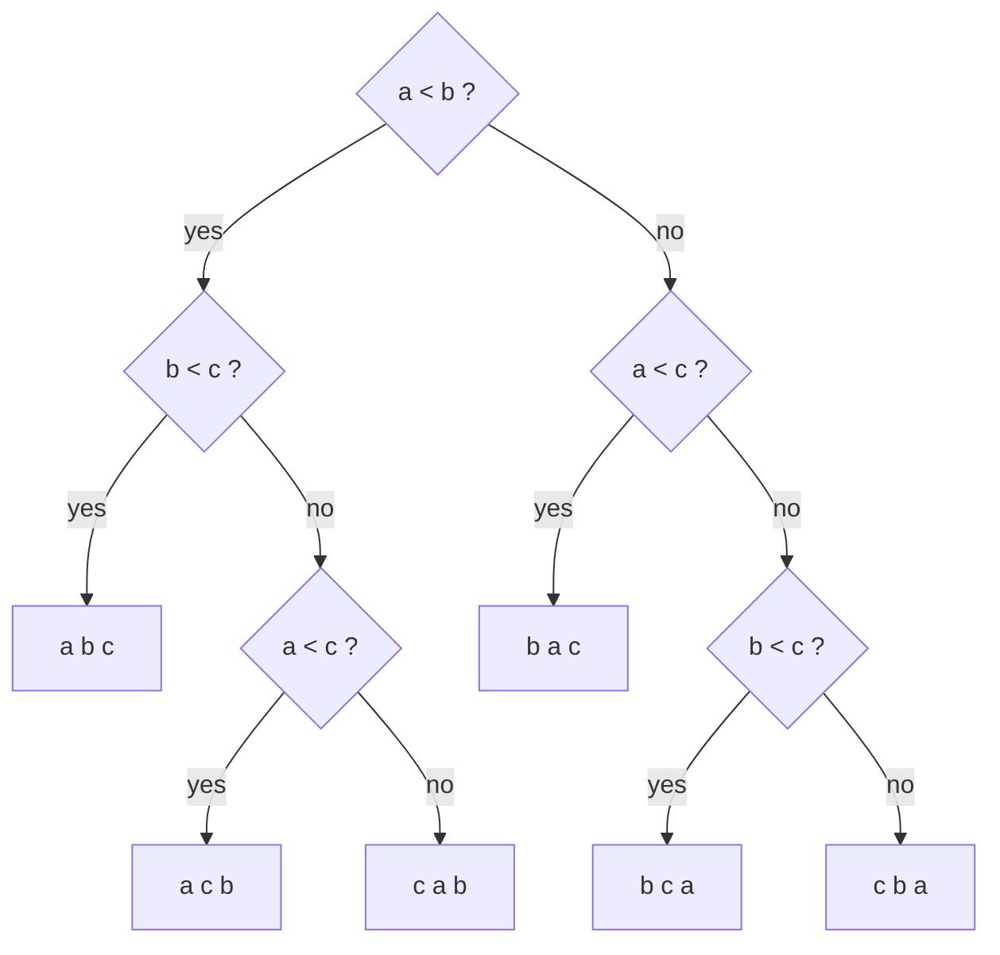

---
aliases:
  - Sorting Algorithm
  - Comparison Sort
  - Insertion Sort
  - Merge Sort
  - Quicksort
  - Heapsort
  - Stable Sort
  - Algorithmes de tri
tags:
  - type/algorithm
  - domain/computer-science
  - domain/bioinformatics
  - level/L1
  - level/L2
  - level/L3
mastery: 0
prerequisites:
  - "[[Loop Invariant]]"
  - "[[Big O Notation]]"
  - "[[Recursion]]"
  - "[[Array]]"
related:
  - "[[Binary Search]]"
  - "[[Divide and Conquer]]"
  - "[[Master Theorem]]"
  - "[[Radix Sort]]"
  - "[[Heap]]"
  - "[[Randomized Algorithm]]"
  - "[[External Memory Algorithm]]"
  - "[[Suffix Array]]"
projects:
  - "[[bio-algorithms]]"
  - "[[10-genomic-pipeline]]"
sources:
  - "[[Introduction to Algorithms (Cormen)]]"
  - "[[MIT 6.006 - Introduction to Algorithms]]"
  - "[[Python Documentation]]"
  - "[[GA4GH hts-specs]]"
  - "[[Bioinformatics Algorithms (Compeau)]]"
---

# Sorting

> [!abstract]
> Sorting rearranges records into non-decreasing order of a key; insertion sort, merge sort, quicksort and heapsort solve it with different trade-offs in worst-case time, memory and stability, and no algorithm that learns about keys only by comparing them can beat $\Omega(n \log n)$ comparisons.

## Problem

- **Input**: a sequence of $n$ records $r_1, \dots, r_n$ and a key function $k$ whose values are totally ordered (numbers, strings, tuples such as (chromosome, position)).
- **Output**: a permutation $\pi$ of $\{1, \dots, n\}$ such that $k(r_{\pi(1)}) \le k(r_{\pi(2)}) \le \dots \le k(r_{\pi(n)})$, delivered as the reordered records.[^6006-l3] The sort is **stable** if records with equal keys keep their input order; it is **in place** if it uses $O(1)$ memory beyond the input (or $O(\log n)$ for a recursion stack, by a looser convention).
- **Biological use**: coordinate-sorted alignment, variant and feature files, which the tabix and CSI index formats require and the BED specification regulates;[^hts] the [[Suffix Array]], which is the list of a genome's suffixes in sorted order;[^compeau] counting k-mers by sorting them and counting runs of equal values; medians and quantiles of coverage or expression values; and making any later lookup a [[Binary Search]].

## Intuition

Each algorithm keeps a different part of the array "done":

- **Insertion sort** grows a sorted prefix by inserting the next item where it belongs; the [[Loop Invariant]] note proves it correct. It is fast when the input is nearly sorted.
- **Merge sort** sorts the two halves recursively, then merges two sorted lists by repeatedly taking the smaller front item.[^clrs2] The work is in the combine step.
- **Quicksort** partitions around a pivot (smaller items left, larger right), then sorts each side. The work is in the split step, and the pivot's luck decides the cost.
- **Heapsort** builds a max-[[Heap]] in the array, then repeatedly swaps the maximum to the end of the shrinking heap.[^clrs-heap]

## Mathematical formulation

**Inversions.** An inversion is a pair $i < j$ with $a_i > a_j$; let $I(a)$ be their number, $0 \le I \le \binom{n}{2}$. Each shift of insertion sort swaps one adjacent inverted pair and removes exactly one inversion, so insertion sort performs exactly $I$ shifts and runs in $\Theta(n + I)$: $\Theta(n)$ on sorted input, $\Theta(n^2)$ on reversed input.[^clrs2] On a random permutation each pair is inverted with probability $1/2$, so $E[I] = n(n-1)/4$: quadratic on average too.

**Merge sort recurrence.** Merging lists of total length $n$ takes at most $n - 1$ comparisons, so

$$T(n) = T(\lceil n/2 \rceil) + T(\lfloor n/2 \rfloor) + \Theta(n), \qquad T(1) = \Theta(1),$$

which solves to $T(n) = \Theta(n \log n)$: $\lceil \log_2 n \rceil$ levels of halving, each doing $O(n)$ merge work in total ([[Recursion]], [[Master Theorem]]).[^clrs2]

**Quicksort recurrences.** A pivot that lands at rank $q$ costs $n - 1$ comparisons and leaves subproblems of sizes $q - 1$ and $n - q$. Always extreme pivots give $T(n) = T(n - 1) + \Theta(n) = \Theta(n^2)$; balanced splits give the merge-sort recurrence. With a uniformly random pivot the expected cost is $O(n \log n)$ for every input, and the worst case stays $\Theta(n^2)$.[^clrs-quick]

**Comparison lower bound.** A comparison sort is a decision tree: each internal node compares two keys, each leaf is an output order. To sort every input of $n$ distinct keys, the tree needs at least $n!$ leaves, so its height $h$ satisfies[^clrs-sort]

$$h \ \ge\ \log_2 (n!) \ \ge\ \log_2 \left( (n/2)^{n/2} \right) = \frac{n}{2} \log_2 \frac{n}{2} = \Omega(n \log n),$$

using that the largest $n/2$ factors of $n!$ are each at least $n/2$ ([[Big O Notation]]). Merge sort and heapsort are therefore asymptotically optimal comparison sorts. The bound says nothing about algorithms that read the keys' digits: [[Radix Sort]] sorts DNA k-mers in linear time.



*Decision tree of insertion sort on three distinct keys: $3! = 6$ leaves, height $3 = \lceil \log_2 6 \rceil$.*

## Algorithm

```text
MERGE(L, R)                               PARTITION(a, lo, hi)      // pivot already in a[hi]
  out = []                                  store = lo
  while L and R not empty                   for i = lo to hi - 1
      if R[0] < L[0]: move R[0] to out          if a[i] < a[hi]
      else:           move L[0] to out              swap a[i], a[store]; store = store + 1
  append the rest of L, then of R           swap a[store], a[hi]
  return out                                return store            // final pivot position
```

Insertion sort is written out in [[Loop Invariant]]; heapsort is BUILD-MAX-HEAP followed by $n - 1$ rounds of "swap the root behind the heap, sift the new root down" ([[Heap]]). Two details carry the guarantees: taking from the left list on ties makes merge sort stable, and recursing on the smaller side of a partition bounds quicksort's stack depth by $O(\log n)$ even when its time is quadratic.[^clrs-stack]

## Complexity

| Algorithm | Worst case | Typical | Extra memory | Stable |
|---|---|---|---|---|
| Insertion sort | $\Theta(n^2)$ | $\Theta(n + I)$, linear when nearly sorted | $O(1)$ | yes |
| Merge sort | $\Theta(n \log n)$ | $\Theta(n \log n)$ | $\Theta(n)$ (merge buffers) | yes |
| Quicksort, random pivot | $\Theta(n^2)$ | $O(n \log n)$ expected | $O(\log n)$ stack | no |
| Heapsort | $O(n \log n)$ | $\Theta(n \log n)$ | $O(1)$ | no |
| Python `sorted` / `list.sort` | not stated in the HOWTO | adapts to existing order (measured below) | not stated in the HOWTO | yes, guaranteed |
| [[Radix Sort]] (keys of $d$ digits over alphabet $\sigma$) | $\Theta(d(n + \sigma))$ | same | $\Theta(n + \sigma)$ | yes |

Python's built-in sort is guaranteed to be stable, and the documentation names its algorithm, Timsort, which takes advantage of any ordering already present in the data;[^py-sort] `list.sort` sorts in place and `sorted` returns a new list.

## Implementation

All four sorts inspect keys only through `less`, which counts comparisons; the built-in `sorted()` is the test oracle.

```python
import math
import random

COMPARISONS = 0

def less(x, y) -> bool:                           # the only way the sorts inspect keys
    global COMPARISONS
    COMPARISONS += 1
    return x < y

def insertion_sort(a: list) -> list:
    a = list(a)
    for i in range(1, len(a)):
        item, j = a[i], i - 1
        while j >= 0 and less(item, a[j]):        # strict: never passes an equal key
            a[j + 1] = a[j]
            j -= 1
        a[j + 1] = item
    return a

def merge_sort(a: list) -> list:
    if len(a) <= 1:
        return list(a)
    left, right = merge_sort(a[:len(a) // 2]), merge_sort(a[len(a) // 2:])
    out, i, j = [], 0, 0
    while i < len(left) and j < len(right):
        if less(right[j], left[i]):               # right only if strictly smaller: stable
            out.append(right[j]); j += 1
        else:
            out.append(left[i]); i += 1
    return out + left[i:] + right[j:]

def quicksort(a: list, pivot: str = "random") -> list:
    a = list(a)
    def partition(lo: int, hi: int) -> int:       # Lomuto partition of a[lo..hi]
        p = random.randint(lo, hi) if pivot == "random" else lo
        a[p], a[hi] = a[hi], a[p]
        store = lo
        for i in range(lo, hi):
            if less(a[i], a[hi]):
                a[i], a[store] = a[store], a[i]
                store += 1
        a[store], a[hi] = a[hi], a[store]
        return store
    def sort(lo: int, hi: int) -> None:
        while lo < hi:                            # recurse on the smaller side, loop on the larger
            q = partition(lo, hi)
            if q - lo < hi - q:
                sort(lo, q - 1); lo = q + 1
            else:
                sort(q + 1, hi); hi = q - 1
    sort(0, len(a) - 1)
    return a

def heapsort(a: list) -> list:
    a = list(a)
    def sift_down(i: int, size: int) -> None:     # restore the max-heap property below i
        while 2 * i + 1 < size:
            c = 2 * i + 1
            if c + 1 < size and less(a[c], a[c + 1]):
                c += 1
            if not less(a[i], a[c]):
                return
            a[i], a[c] = a[c], a[i]
            i = c
    for i in range(len(a) // 2 - 1, -1, -1):      # build the heap bottom-up
        sift_down(i, len(a))
    for end in range(len(a) - 1, 0, -1):          # move the maximum behind the heap
        a[0], a[end] = a[end], a[0]
        sift_down(0, end)
    return a

SORTS = {"insertion": insertion_sort, "merge": merge_sort,
         "quick (random pivot)": quicksort, "heap": heapsort,
         "quick (first pivot)": lambda xs: quicksort(xs, "first")}

class Key:                                        # defines only <, and counts it
    def __init__(self, v): self.v = v
    def __lt__(self, other): return less(self.v, other.v)

SORTS["sorted() built-in"] = lambda xs: [k.v for k in sorted(map(Key, xs))]

random.seed(0)
for _ in range(300):                              # test oracle: the built-in sorted()
    xs = random.choices(range(20), k=random.randint(0, 40))
    assert all(f(xs) == sorted(xs) for f in SORTS.values())

def comparisons(f, xs) -> int:
    global COMPARISONS
    COMPARISONS = 0
    f(xs)
    return COMPARISONS

n = 1000
inputs = {"random": random.sample(range(n), n), "sorted": list(range(n)),
          "reversed": list(range(n, 0, -1))}
print(f"n log2 n = {n * math.log2(n):.0f}, log2 n! = {math.lgamma(n + 1) / math.log(2):.0f}")
for name, f in SORTS.items():
    print(f"{name:21}", {k: comparisons(f, v) for k, v in inputs.items()})

class Rec:                                        # compared on its k-mer only
    def __init__(self, kmer, i): self.kmer, self.i = kmer, i
    def __lt__(self, other): return self.kmer < other.kmer
    def __repr__(self): return f"{self.kmer}{self.i}"

recs = [Rec(k, i) for i, k in enumerate(["GAT", "ACA", "GAT", "ACA", "TTG", "GAT"])]
for name in ("insertion", "merge", "quick (random pivot)", "heap"):
    print(f"{name:21}", SORTS[name](recs))
```

```text
n log2 n = 9966, log2 n! = 8529
insertion             {'random': 251548, 'sorted': 999, 'reversed': 499500}
merge                 {'random': 8730, 'sorted': 4932, 'reversed': 5044}
quick (random pivot)  {'random': 11239, 'sorted': 10083, 'reversed': 11290}
heap                  {'random': 16813, 'sorted': 17583, 'reversed': 15965}
quick (first pivot)   {'random': 11487, 'sorted': 499500, 'reversed': 499500}
sorted() built-in     {'random': 8600, 'sorted': 999, 'reversed': 999}
insertion             [ACA1, ACA3, GAT0, GAT2, GAT5, TTG4]
merge                 [ACA1, ACA3, GAT0, GAT2, GAT5, TTG4]
quick (random pivot)  [ACA3, ACA1, GAT2, GAT0, GAT5, TTG4]
heap                  [ACA1, ACA3, GAT2, GAT0, GAT5, TTG4]
```

Reading the measurements ($n = 1000$; the assertions passed silently on 300 random lists):

- **Insertion sort** follows $\Theta(n + I)$: $n - 1 = 999$ comparisons on sorted input, $\binom{n}{2} = 499{,}500$ on reversed input, about $n^2/4$ on random input.
- **First-element pivots** make quicksort quadratic on sorted input, a common real input (an already sorted file); the random pivot removes the dependence on the input.
- **The lower bound** is $\log_2 1000! \approx 8529.4$, so at least 8,530 comparisons. On random input the built-in sort (8,600) and merge sort (8,730) come close; heapsort pays about twice as many. The built-in sort also needs only $n - 1$ comparisons on sorted and on reversed input, and only `<` from the `Key` class.
- **Stability**: insertion and merge sort keep `ACA1` before `ACA3` and `GAT0, GAT2, GAT5` in input order; quicksort and heapsort reorder equal keys.

## Worked example

> [!example] Merge sort on eight variant positions (invented)
> Input `[512, 105, 950, 230, 777, 230, 1203, 801]`. Each line is one merge, indented by recursion depth:
> ```text
>     merge [512] + [105] -> [105, 512]
>     merge [950] + [230] -> [230, 950]
>   merge [105, 512] + [230, 950] -> [105, 230, 512, 950]
>     merge [777] + [230] -> [230, 777]
>     merge [1203] + [801] -> [801, 1203]
>   merge [230, 777] + [801, 1203] -> [230, 777, 801, 1203]
> merge [105, 230, 512, 950] + [230, 777, 801, 1203] -> [105, 230, 230, 512, 777, 801, 950, 1203]
> ```
> 1. **Levels**: $\log_2 8 = 3$ levels of merges; each level touches all 8 items once, so at most $8 - (\text{number of merges at that level})$ comparisons per level.
> 2. **Last merge**: compare fronts 105 vs 230 (take 105), 230 vs 230 (tie: take the **left** 230, which keeps stability), 512 vs 230 (take the right 230), 512 vs 777, 950 vs 777, 950 vs 801, 950 vs 1203; then the left list is empty and 1203 is copied without comparison: 7 comparisons, the maximum $n - 1$.
> 3. **Memory**: every merge writes a new list; at the top level, $n$ extra slots. This is the price of the guaranteed $\Theta(n \log n)$ and of stability, and the reason heapsort exists.

## Limitations

> [!warning] "Quicksort is $O(n \log n)$"
> Only in expectation, over its own random pivot choices; its worst case is $\Theta(n^2)$.[^clrs-quick] With a deterministic pivot rule, an input (often a sorted one, as measured above) triggers the worst case every time. When a guaranteed bound matters, use merge sort, heapsort or the built-in sort.

> [!warning] "A stable sort keeps equal records unchanged, so stability rarely matters"
> Stability is what makes **multi-key sorting by passes** correct: sort by the secondary key, then stably by the primary key, and records stay ordered by the secondary key within each primary key (Exercise 3). The Python documentation guarantees it for the built-in sort;[^py-sort] it is not a property of quicksort or heapsort.

- **Comparisons are not unit cost for long keys.** Comparing two strings of length $L$ costs up to $L$ character comparisons. Sorting the $n$ suffixes of a genome with a generic sort costs $O(n \log n)$ comparisons of up to $n$ characters each: on repetitive sequence, far more than $n \log n$ operations, which is why [[Suffix Array Construction]] has dedicated algorithms: on $T = A^n$, every comparison of two suffixes costs as much as the shorter one.
- **Data larger than RAM.** A sort that needs the whole array in memory cannot sort a file larger than memory; external merge sort writes sorted runs to disk, then merges them ([[External Memory Algorithm]]).
- **Order is part of the data.** The order of chromosome names (`chr1, chr2, ..., chr10` versus text order `chr1, chr10, chr2`) must match between a sorted file, its index and the tool that reads it (Exercise 4, [[Binary Search]]).

## Variants and successors

- **Linear-time sorts** for small key alphabets: counting sort and [[Radix Sort]] (k-mers over {A, C, G, T}, 2-bit codes).
- **Adaptive sorts**: algorithms whose cost falls when the input is already partly ordered. Insertion sort is the simplest; natural merge sort merges the runs already present instead of fixed halves; the built-in Timsort takes advantage of existing order.[^py-sort]
- **Selection without sorting**: the median or the $k$-th smallest in expected linear time by randomized partitioning (quickselect, [[Randomized Algorithm]]); the $k$ smallest of a stream with a bounded [[Heap]] (`heapq.nsmallest`).

## Exercises

> [!question] Exercise 1 (L1)
> Show by hand that the heapsort above is not stable on the two records `1a, 1b` (equal keys), and that quicksort with a first-element pivot is not stable on `2a, 1b, 1c`.

> [!success]- Solution
> Heapsort: building the heap does nothing (`1a` is not smaller than `1b`), then the extraction loop swaps `a[0]` and `a[1]`: output `1b, 1a`. Quicksort: the pivot `2a` is swapped to the end, giving `1c, 1b, 2a`; both 1s are smaller and stay in place. The left part `1c, 1b` is then partitioned around its first item `1c`: it is swapped to the end (`1b, 1c`), `1b` is not smaller than it, and the final swap puts `1c` back in front: `1c, 1b, 2a`. Both reorder equal keys because they move items by **long-distance swaps**, while insertion and merge sort only move an item past strictly larger ones.

> [!question] Exercise 2 (L2, Python)
> Modify merge sort to count inversions in $O(n \log n)$, test it against the $O(n^2)$ definition, and use it to measure the disorder between two (invented) gene orders: `dnaA dnaN recF gyrB rpoB rpoC` and `dnaA recF dnaN rpoC gyrB rpoB`.

> [!success]- Solution
> When the merge takes `right[j]` before the remaining `len(left) - i` items of the left list, each of those forms an inversion with it.
> ```python
> def sort_count(a: list) -> tuple[list, int]:
>     """Merge sort that also returns the number of inversions (i < j with a[i] > a[j])."""
>     if len(a) <= 1:
>         return list(a), 0
>     mid = len(a) // 2
>     left, x = sort_count(a[:mid])
>     right, y = sort_count(a[mid:])
>     out, i, j, inv = [], 0, 0, x + y
>     while i < len(left) and j < len(right):
>         if right[j] < left[i]:
>             out.append(right[j]); j += 1
>             inv += len(left) - i            # right[j] jumps over every remaining left item
>         else:
>             out.append(left[i]); i += 1
>     return out + left[i:] + right[j:], inv
>
> for xs in ([3, 1, 2], [2, 2, 1, 0], list(range(9, -1, -1))):   # against the O(n^2) definition
>     assert sort_count(xs)[1] == sum(x > y for i, x in enumerate(xs) for y in xs[i + 1:])
> order_a = ["dnaA", "dnaN", "recF", "gyrB", "rpoB", "rpoC"]       # invented gene orders
> order_b = ["dnaA", "recF", "dnaN", "rpoC", "gyrB", "rpoB"]
> rank = {g: i for i, g in enumerate(order_a)}
> print(sort_count([rank[g] for g in order_b]))
> print(sort_count(list(range(1000, 0, -1)))[1])
> ```
> Output: `([0, 1, 2, 3, 4, 5], 3)` then `499500`. Order B is 3 inversions (adjacent transpositions) away from order A; the reversed list of 1000 items has the maximum $\binom{1000}{2}$, equal to insertion sort's 499,500 comparisons on it. Caution: an "inversion" of a permutation (a pair out of order) is not a genomic **inversion** (a reversed segment), the operation studied in [[Genome Rearrangement]].

> [!question] Exercise 3 (L2, Python)
> Sort the features `(chr10, 500), (chr2, 900), (chrX, 10), (chr2, 40), (chr1, 70), (chrM, 5), (chr10, 20)` in natural chromosome order (1 to 22, then X, Y, M), then by position: once with a tuple key, once with two stable passes.

> [!success]- Solution
> ```python
> features = [("chr10", 500), ("chr2", 900), ("chrX", 10), ("chr2", 40),
>             ("chr1", 70), ("chrM", 5), ("chr10", 20)]
> print(sorted(features))                                    # text order: wrong for chromosomes
> ORDER = {**{f"chr{i}": i for i in range(1, 23)}, "chrX": 23, "chrY": 24, "chrM": 25}
> def natural(f): return (ORDER[f[0]], f[1])
> print(sorted(features, key=natural))
> two_pass = sorted(features, key=lambda f: f[1])            # secondary key first
> two_pass.sort(key=lambda f: ORDER[f[0]])                   # then primary; stability keeps positions
> print(two_pass == sorted(features, key=natural))
> ```
> ```text
> [('chr1', 70), ('chr10', 20), ('chr10', 500), ('chr2', 40), ('chr2', 900), ('chrM', 5), ('chrX', 10)]
> [('chr1', 70), ('chr2', 40), ('chr2', 900), ('chr10', 20), ('chr10', 500), ('chrX', 10), ('chrM', 5)]
> True
> ```
> The two-pass method is correct only because the second sort is stable. Whatever order you choose, a sorted file and every tool that reads it must agree on it.

> [!question] Exercise 4 (L3)
> Prove that merge sort uses at most $n \lceil \log_2 n \rceil$ comparisons, then compare with the lower bound $\lceil \log_2 n! \rceil$ for $n = 3, 4, 5, 10, 1000$. What does the gap say?

> [!success]- Solution
> By induction on the recursion depth: the merges at any one depth involve disjoint lists of total length at most $n$, so they cost at most $n$ comparisons; halving with ceilings reaches size 1 after $\lceil \log_2 n \rceil$ levels. Total $\le n \lceil \log_2 n \rceil$. The lower bound values are 3, 5, 7, 22 for $n = 3, 4, 5, 10$, and 8,530 for $n = 1000$ (computed with `math.lgamma`), against upper bounds of 6, 8, 15, 40 and 10,000. Merge sort measured 8,730 on a random input of size 1000, within 3 % of the lower bound: the $\Omega(n \log n)$ bound is tight including the constant 1 in front of $n \log_2 n$, and the remaining room is lower-order terms. For small $n$ the relative gap is larger (15 against 7 at $n = 5$): constant factors and lower-order terms matter most on short inputs.

## Mastery checklist

- [ ] 1 Recognized: I can name the four algorithms and state, for each, worst case, extra memory and stability.
- [ ] 2 Understood: I can derive the merge-sort recurrence, the quicksort worst case, and the $\Omega(n \log n)$ decision-tree lower bound.
- [ ] 3 Practiced: I can implement all four with a comparison counter and test them against `sorted` on random inputs, including stability.
- [ ] 4 Applied: I sort real feature and alignment records by (chromosome, position) with an explicit, documented chromosome order in [[10-genomic-pipeline]], and choose between sorting and hashing for k-mer counting.
- [ ] 5 Explained: I can teach why comparison sorts cannot beat $n \log_2 n$, when radix sort and external sorting take over, and why stability matters for multi-key sorts.

## References

[^6006-l3]: [[MIT 6.006 - Introduction to Algorithms]], Spring 2020, lecture 3 "Sets and Sorting" (sorting as computing a sorted permutation of the input; sorted arrays and binary search).
[^clrs2]: [[Introduction to Algorithms (Cormen)]], 4th ed., ch. 2 "Getting Started" (insertion sort, in place, best and worst case; the divide-and-conquer method, merge sort and its recurrence).
[^clrs-heap]: [[Introduction to Algorithms (Cormen)]], 4th ed., treatment of heapsort (max-heaps, building a heap, in-place sorting in $O(n \log n)$).
[^clrs-quick]: [[Introduction to Algorithms (Cormen)]], 4th ed., treatment of quicksort (partitioning, worst-case $\Theta(n^2)$, randomized version with expected $O(n \log n)$ running time).
[^clrs-stack]: [[Introduction to Algorithms (Cormen)]], 4th ed., treatment of the stack depth of quicksort (stack frames, tail recursion).
[^clrs-sort]: [[Introduction to Algorithms (Cormen)]], 4th ed., treatment of lower bounds for comparison sorting (the decision-tree model, $\Omega(n \lg n)$ comparisons in the worst case).
[^py-sort]: [[Python Documentation]], 3.13, Sorting HOWTO: sorts are guaranteed to be stable (records with equal keys keep their original order), and the Timsort algorithm takes advantage of ordering already present in the data, which makes multiple sorts efficient.
[^hts]: [[GA4GH hts-specs]]: `BEDv1.tex` (sorting rules for BED), `tabix.tex` and `CSIv1.tex` (index formats for position-sorted files).
[^compeau]: [[Bioinformatics Algorithms (Compeau)]], chapter "How Do We Locate Disease-Causing Mutations?" (suffix arrays).
