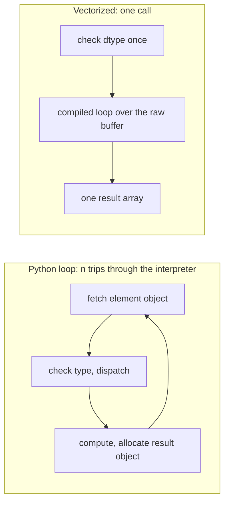

---
aliases:
  - Array Programming
  - Vectorized Computation
  - Universal Function
  - ufunc
  - Vectorisation
tags:
  - type/concept
  - domain/computer-science
  - domain/bioinformatics
  - level/L1
  - level/L2
  - level/L3
mastery: 0
prerequisites:
  - "[[N-Dimensional Array]]"
  - "[[Python Object Model]]"
  - "[[Big O Notation]]"
related:
  - "[[Broadcasting]]"
  - "[[Array Indexing]]"
  - "[[Integer Representation]]"
  - "[[Floating-Point Arithmetic]]"
  - "[[Performance Profiling]]"
  - "[[Benchmarking]]"
  - "[[Memory Hierarchy]]"
  - "[[Single Instruction Multiple Data]]"
  - "[[Just-In-Time Compilation]]"
  - "[[Array Memory Layout]]"
  - "[[Sequencing Coverage]]"
  - "[[Dynamic Programming]]"
projects:
  - "[[07-evolution-simulator]]"
sources:
  - "[[Harris 2020 - Array Programming with NumPy]]"
  - "[[Python for Data Analysis (McKinney)]]"
  - "[[Python Documentation]]"
---

# Vectorization

> [!abstract]
> Vectorization replaces a Python loop over elements by a few operations on whole arrays, so that the loop runs once in compiled code instead of a million times in the interpreter: typically 10 to 100 times faster, with the same result, but only when the computation has no step-to-step dependency.

## Definition

**Vectorization** (array programming) is expressing a computation as operations on whole arrays rather than on individual elements.[^harris] NumPy users call it vectorization: arrays let you write batch operations without `for` loops, and arithmetic between arrays of equal size applies element by element.[^mck4] The building blocks are **universal functions** (ufuncs), functions that operate element-wise on arrays (`np.add`, `np.exp`, `np.log`, comparisons), together with reductions, boolean masks and index-based selection.[^mck4] The per-element loop still exists, but it runs inside NumPy's compiled code over a contiguous buffer of one dtype ([[N-Dimensional Array]]).

## Why it matters

- **Scale.** A sequencing run yields millions of reads and billions of quality values; a Python loop costs tens of nanoseconds per element in interpreter overhead alone ([[Python Object Model]]), the vectorized loop about one.
- **Simulation.** [[07-evolution-simulator]] updates the allele frequencies of every locus at once, one generation per step (Exercise 6).
- **Clearer code.** `counts / counts.sum(axis=0)` states a normalization in one line ([[Broadcasting]]); the loop version hides it in indices.
- **Not free.** Some computations need an algorithmic rewrite to vectorize (coverage, Deeper), some cannot be vectorized along their main loop (dynamic programming), and small arrays are faster in plain Python (Deeper). Measure, do not assume ([[Performance Profiling]]).

## Core (L1)



**The toolkit.** Most per-element loops in bioinformatics scripts map to a handful of array operations:[^mck4]

| Loop pattern | Vectorized form |
|---|---|
| transform each value | arithmetic operators, ufuncs (`np.exp`, `np.log10`, `np.sqrt`) |
| keep values that pass a test | boolean mask `a[a >= 20]`; `np.flatnonzero` for positions |
| if/else per value | `np.where(cond, x, y)` |
| total, mean, maximum (per row, per column) | reductions with `axis=` |
| running total | `np.cumsum` |
| translate codes (bases to integers) | lookup table indexed by the codes |
| count occurrences of small integers | `np.bincount`; `np.unique(..., return_counts=True)` |

**Measure the speed-up.** `timeit` runs a statement many times; take the minimum of several repeats, the run least disturbed by other activity, rather than the mean.[^timeit] Converting a million Phred scores to error probabilities $p = 10^{-Q/10}$ ([[Phred Quality Score]]), with outputs from NumPy 2.4.6 on Python 3.11 (timings depend on the machine, ratios less so):

```python
import timeit

import numpy as np


def best_ms(stmt, number=5, repeat=5) -> float:
    """Fastest of `repeat` runs, in ms per call: the least disturbed measurement."""
    return min(timeit.repeat(stmt, number=number, repeat=repeat)) / number * 1e3


rng = np.random.default_rng(42)
Q = rng.integers(2, 42, size=1_000_000).astype(np.uint8)      # invented Phred qualities
Q_list = Q.tolist()


def perr_loop(qs):
    return [10 ** (-q / 10) for q in qs]


def perr_vec(qs):
    return 10.0 ** (-(qs / 10))                                 # two ufuncs: divide, power


perr_npvec = np.vectorize(lambda q: 10 ** (-(q / 10)))
print(np.allclose(perr_loop(Q_list), perr_vec(Q)), np.allclose(perr_npvec(Q[:1000]), perr_vec(Q[:1000])))
t_loop, t_npvec, t_vec = (best_ms(lambda: perr_loop(Q_list), number=1),
                          best_ms(lambda: perr_npvec(Q), number=1), best_ms(lambda: perr_vec(Q)))
print(f"loop {t_loop:.1f} ms, np.vectorize {t_npvec:.1f} ms, ufuncs {t_vec:.1f} ms, speed-up {t_loop / t_vec:.0f}x")
```

```text
True True
loop 146.3 ms, np.vectorize 243.1 ms, ufuncs 16.0 ms, speed-up 9x
```

Two lessons. First, always check that both versions agree (`np.allclose`) before timing. Second, `np.vectorize` is slower than the plain loop: it calls the Python function once per element, so it only changes the syntax. The ufunc version gains "only" 9 times here because `**` is an expensive operation in either form; cheap operations gain more (below).

**Vectorized code keeps the dtype rules.** The first version written for this note was `10.0 ** (-qs / 10)`: unary minus binds before `/`, so NumPy negated the `uint8` array, which wraps ([[Integer Representation]]):

```python
print(Q[:4], -Q[:4], 10.0 ** (-Q[:4] / 10))
```

```text
[ 5 32 28 19] [251 224 228 237] [1.25892541e+25 2.51188643e+22 6.30957344e+22 5.01187234e+23]
```

Probabilities of $10^{25}$ raised no error. The loop over Python integers had no such problem, which is exactly why the comparison with a reference loop comes first.

**Per-read statistics on a 2-D array.** With reads of equal length stored as a reads × positions `uint8` array, GC content per read is a comparison, an `or` and a mean along axis 1:

```python
reads = rng.choice(np.frombuffer(b"ACGT", dtype=np.uint8), size=(10_000, 150))   # invented reads
reads_str = [r.tobytes().decode() for r in reads]


def gc_char_loop(rs):
    out = []
    for r in rs:
        n = 0
        for ch in r:
            if ch == "G" or ch == "C":
                n += 1
        out.append(n / len(r))
    return out


def gc_count_loop(rs):
    return [(r.count("G") + r.count("C")) / len(r) for r in rs]


def gc_vec(arr):
    return ((arr == ord("G")) | (arr == ord("C"))).mean(axis=1)


print(np.allclose(gc_char_loop(reads_str), gc_vec(reads)), np.allclose(gc_count_loop(reads_str), gc_vec(reads)))
print(f"char loop {best_ms(lambda: gc_char_loop(reads_str), number=1):.1f} ms, "
      f"str.count loop {best_ms(lambda: gc_count_loop(reads_str)):.1f} ms, numpy {best_ms(lambda: gc_vec(reads)):.1f} ms")
```

```text
True True
char loop 62.2 ms, str.count loop 12.1 ms, numpy 1.9 ms
```

`str.count` is already a compiled loop over each string, so the loop over 10,000 reads is only 6 times slower than NumPy; the loop over 1.5 million characters is 33 times slower. What matters is how many trips the interpreter makes.

## Deeper (L2)

**Some loops need a different algorithm.** Per-base [[Sequencing Coverage]] from read intervals is naturally a loop over reads adding 1 to a slice. The vectorized form changes the algorithm: write $+1$ at each start and $-1$ at each end (a **difference array**), then one cumulative sum recovers the coverage. Beware duplicates: `a[idx] += 1` with a repeated index adds only once, because NumPy computes `a[idx] + 1` and then assigns; `np.add.at` (or `np.bincount`) counts every occurrence.

```python
L = 16
starts = np.array([2, 5, 5, 9])                                 # invented reads, 0-based half-open
ends = np.array([8, 10, 12, 15])
bad = np.zeros(L + 1, dtype=np.int32)
bad[starts] += 1                                                # duplicate index 5 counted once
bad[ends] -= 1
diff = np.zeros(L + 1, dtype=np.int32)
np.add.at(diff, starts, 1)                                      # unbuffered: every occurrence counts
np.add.at(diff, ends, -1)
naive = np.zeros(L, dtype=np.int32)
for s, e in zip(starts, ends):
    naive[s:e] += 1
print(diff[:L].tolist())
print(np.cumsum(diff)[:L].tolist(), np.array_equal(np.cumsum(diff)[:L], naive))
print(np.cumsum(bad)[:L].tolist())
```

```text
[0, 0, 1, 0, 0, 2, 0, 0, -1, 1, -1, 0, -1, 0, 0, -1]
[0, 0, 1, 1, 1, 3, 3, 3, 2, 3, 2, 2, 1, 1, 1, 0] True
[0, 0, 1, 1, 1, 2, 2, 2, 1, 2, 1, 1, 0, 0, 0, -1]
```

The buggy version lost one read at position 5 and ends with coverage $-1$. At scale, 200,000 invented reads of 150 bp on a 1 Mb contig:

```python
G = 1_000_000
st = rng.integers(0, G - 150, size=200_000)                     # invented 150-bp reads on a 1 Mb contig
en = st + 150


def cov_slices():
    c = np.zeros(G, dtype=np.int32)
    for s, e in zip(st.tolist(), en.tolist()):
        c[s:e] += 1
    return c


def cov_diff():
    return np.cumsum(np.bincount(st, minlength=G + 1) - np.bincount(en, minlength=G + 1))[:G]


print(np.array_equal(cov_slices(), cov_diff()))
print(f"loop of slices {best_ms(cov_slices, number=1):.0f} ms, difference array {best_ms(cov_diff):.1f} ms")
```

```text
True
loop of slices 308 ms, difference array 11.4 ms
```

The slice loop does $n \times \ell$ additions (reads × read length) plus $n$ interpreter trips; the difference array does $O(n + G)$ work in compiled code ([[Big O Notation]]).

**Small arrays do not benefit.** Every NumPy call has a fixed overhead (argument checks, dtype resolution, allocation). Sum of squares, Python generator against `(x * x).sum()`:

```python
for n in (1, 10, 100, 1_000, 100_000):
    xs = rng.random(n)
    xl = xs.tolist()
    t_py = best_ms(lambda: sum(v * v for v in xl), number=200) * 1e3
    t_np = best_ms(lambda: (xs * xs).sum(), number=200) * 1e3
    print(f"n={n:>6}: Python {t_py:8.1f} us   NumPy {t_np:6.1f} us")
```

```text
n=     1: Python      0.3 us   NumPy    1.5 us
n=    10: Python      0.6 us   NumPy    1.6 us
n=   100: Python      3.7 us   NumPy    1.6 us
n=  1000: Python     35.7 us   NumPy    2.8 us
n=100000: Python   3875.9 us   NumPy  117.1 us
```

Below a few dozen elements the loop wins; above, NumPy's cost per element is about 33 times lower (Exercise 5). Vectorizing an inner loop of length 4 (the four bases) inside a Python loop over millions of reads gains nothing: vectorize along the long axis.

**Temporaries cost memory and time.** `2.0 * big + 1.0` allocates an intermediate array of the same size as `big`. Ufuncs accept `out=` to write in place:

```python
x = np.array([3, 1, 4, 1, 5])
print(np.add.reduce(x), np.add.accumulate(x), np.maximum.accumulate(x))
print(np.add.reduceat(np.arange(10), [0, 3, 7]), np.multiply.outer([1, 2], [1, 10, 100]).tolist())
q = np.array([35, 12, 40, 8, 30])
print(np.where(q >= 20, q, 0), q[q >= 20], np.flatnonzero(q < 20))
big = rng.random(5_000_000)
buf = np.empty_like(big)


def with_temporaries():
    return 2.0 * big + 1.0


def in_place():
    np.multiply(big, 2.0, out=buf)
    np.add(buf, 1.0, out=buf)
    return buf


print(np.array_equal(with_temporaries(), in_place()),
      f"temporaries {best_ms(with_temporaries):.1f} ms, out= {best_ms(in_place):.1f} ms")
```

```text
14 [ 3  4  8  9 14] [3 3 4 4 5]
[ 3 18 24] [[1, 10, 100], [2, 20, 200]]
[35  0 40  0 30] [35 40 30] [1 3]
True temporaries 18.1 ms, out= 11.8 ms
```

## Advanced (L3)

- **Ufunc methods.** Every binary ufunc has `reduce` (fold an axis), `accumulate` (running result), `reduceat` (fold consecutive segments: per-read or per-gene sums over a flat array, given segment starts), `outer` (all pairs) and `at` (unbuffered in-place update), shown above. Together with [[Broadcasting]] they cover most array algorithms without explicit indices.
- **Dependencies decide.** A loop vectorizes along a dimension only if its iterations are independent. A Wright-Fisher simulation is independent across loci but sequential across generations (Exercise 6); the [[Dynamic Programming]] matrices of sequence alignment depend on their left, upper and diagonal neighbours, so cells of one anti-diagonal can be computed together but rows cannot. Such kernels are compiled instead ([[Just-In-Time Compilation]]) or mapped onto processor vector instructions, the hardware meaning of the word vectorization ([[Single Instruction Multiple Data]]).
- **Memory becomes the limit.** Once the loop runs in compiled code, a pass over a large array is dominated by moving data between memory and the processor: fewer passes (fusing operations, `out=`), smaller dtypes and contiguous access matter more than the arithmetic ([[Memory Hierarchy]], [[Array Memory Layout]]). Arrays larger than RAM are processed in vectorized chunks ([[Out-of-Core Computation]]).
- **Vectorization and correctness.** A vectorized rewrite is a new program: keep the loop as a reference implementation in tests, compare with `np.array_equal` for integers and `np.allclose` for floats, since a different summation order can change the last bits ([[Floating-Point Arithmetic]], [[Numerical Testing]]).

## Mathematical representation

- **Lifting.** A scalar function $f : T \to T'$ becomes an array function $F$ on any shape: $(F(A))_i = f(A_i)$ for every index $i$ in the index set $I$ of $A$; binary ufuncs lift $g : T \times T \to T'$ the same way on arrays of equal shape (or broadcast shapes).
- **Reduction and scan.** For an associative operation $\oplus$: $\mathrm{reduce}(a) = a_0 \oplus a_1 \oplus \dots \oplus a_{n-1}$ and $\mathrm{scan}(a)_j = a_0 \oplus \dots \oplus a_j$. The difference array is the inverse of the scan for $+$: with $d_s \mathrel{+}= 1$, $d_e \mathrel{-}= 1$ for each interval $[s, e)$, $\mathrm{cov}_j = \sum_{i \le j} d_i$ counts the intervals with $s \le j < e$.
- **Cost model.** A Python loop costs $T_{py}(n) \approx a + bn$ and a vectorized call $T_{np}(n) \approx c + dn$ with $c > a$ (call overhead) and $b \gg d$ (interpreter work per element). The break-even size is $n^* = (c - a)/(b - d)$; with the measurements above ($a \approx 0.3$ µs, $b \approx 37$ ns, $c \approx 1.5$ µs, $d \approx 1.1$ ns), $n^* \approx 33$, consistent with the crossover between 10 and 100. Vectorization changes the constants, not the [[Big O Notation|asymptotic complexity]], unless the algorithm changes too (the difference array).

## Computational representation

| Form | Where the loop runs | Speed |
|---|---|---|
| `for` loop, comprehension, `map` | interpreter, one trip per element | baseline |
| `np.vectorize(f)` | interpreter (calls `f` per element) | baseline or slower |
| string methods (`str.count`, `bytes.translate`) | compiled, per string | fast within one string |
| ufuncs, reductions, masks, fancy indexing | compiled, one call per array | 10 to 100 times faster on large arrays |
| JIT-compiled loop (Numba) | compiled from your loop | for loops that do not vectorize |

## Worked example

> [!example] Coverage of four reads by a difference array
> Invented reads, 0-based half-open: $[2, 8)$, $[5, 10)$, $[5, 12)$, $[9, 15)$ on a 16-bp contig.
> 1. **Starts**: $+1$ at 2, $+2$ at 5 (two reads start there), $+1$ at 9.
> 2. **Ends**: $-1$ at 8, 10, 12 and 15.
> 3. **Difference array** (positions 0 to 15): `0 0 1 0 0 2 0 0 -1 1 -1 0 -1 0 0 -1`.
> 4. **Running sum**: `0 0 1 1 1 3 3 3 2 3 2 2 1 1 1 0`. Check position 9: reads $[5,10)$, $[5,12)$ and $[9,15)$ cover it, coverage 3; position 8 is the half-open end of $[2, 8)$, so coverage drops to 2 there.
> 5. **Pitfall**: with `diff[starts] += 1`, position 5 receives $+1$ instead of $+2$, every later value is 1 too low and the last is $-1$: an impossible coverage that a simple assertion (`(cov >= 0).all()`) would catch.

## Common misconceptions

> [!warning] "`np.vectorize` vectorizes"
> It wraps a Python function so that it accepts arrays, but still calls it once per element: 243 ms against 146 ms for the plain loop and 16 ms for ufuncs above.

> [!warning] "Vectorized code is always faster"
> Not for small arrays (call overhead, crossover near 30 elements here), not when the rewrite builds huge temporaries (all pairwise distances need $n^2$ memory where a loop needs $O(1)$), and not for loops with step-to-step dependencies.

> [!warning] "`a[idx] += 1` counts every index"
> With repeated indices the update happens once per distinct index. Use `np.add.at(a, idx, 1)` or `np.bincount(idx, minlength=len(a))` for histograms and coverage.

> [!warning] "A vectorized expression behaves like the math"
> It behaves like the dtype: `-q` on `uint8` wraps, integer arrays overflow silently, and a different summation order changes float results in the last digits ([[Integer Representation]], [[Floating-Point Arithmetic]]).

## Exercises

> [!question] Exercise 1 (L1)
> Rewrite without a Python loop: `[q if q >= 20 else 0 for q in quals]`, `sum(1 for q in quals if q < 20)`, and `[min(q, 40) for q in quals]` for a `uint8` array `quals`.

> [!success]- Solution
> `np.where(quals >= 20, quals, 0)`; `(quals < 20).sum()` (a boolean array sums as integers); `np.minimum(quals, 40)` (or `quals.clip(max=40)`). All three return arrays (or a NumPy integer) computed in one call each.

> [!question] Exercise 2 (L1)
> A colleague replaces `[f(x) for x in data]` by `np.vectorize(f)(data)` and reports no speed-up. Explain, and say what would help.

> [!success]- Solution
> `np.vectorize` still runs `f`, a Python function, once per element: the interpreter trips are the cost and they remain. The function body must itself be written with array operations (ufuncs, masks, `np.where`), so that the whole array goes through compiled loops; if that is impossible, compile the loop ([[Just-In-Time Compilation]]).

> [!question] Exercise 3 (L2, Python)
> Compute GC content per read for the invented reads `GGCATNNACG`, `ATATATGCAT`, `CCGGNACGTT` stored as a 3 × 10 `uint8` array, with `N` excluded from the denominator.

> [!success]- Solution
> ```python
> reads2 = np.frombuffer(b"GGCATNNACG" b"ATATATGCAT" b"CCGGNACGTT", dtype=np.uint8).reshape(3, 10)   # invented
> gc = np.isin(reads2, np.frombuffer(b"GC", dtype=np.uint8)).sum(axis=1)
> acgt = np.isin(reads2, np.frombuffer(b"ACGT", dtype=np.uint8)).sum(axis=1)
> print(gc, acgt, (gc / acgt).round(3))
> ```
> ```text
> [5 2 6] [ 8 10  9] [0.625 0.2   0.667]
> ```
> Two masks, two reductions along axis 1, one element-wise division: the same convention as `gc_content` in [[DNA#Computational representation]].

> [!question] Exercise 4 (L2)
> Predict `a` after `a = np.zeros(5, dtype=int); idx = np.array([1, 1, 3, 1]); a[idx] += 1`, then after `np.add.at(a, idx, 1)` applied to a fresh zero array.

> [!success]- Solution
> `a[idx] += 1` evaluates `a[idx] + 1` = `[1, 1, 1, 1]` and assigns it to positions 1, 1, 3, 1: result `[0, 1, 0, 1, 0]`. `np.add.at` applies each update: `[0, 3, 0, 1, 0]`, the same as `np.bincount(idx, minlength=5)`.

> [!question] Exercise 5 (L3)
> Using the cost model $T_{py} = a + bn$, $T_{np} = c + dn$, estimate the break-even size from the measurements for $n = 1$ and $n = 100\,000$ in the table above, and explain why vectorizing the 4-element loop over bases inside a loop over reads would not help.

> [!success]- Solution
> From the table: $b \approx (3875.9 - 0.3)/10^5 \approx 38.8$ ns, $a \approx 0.3$ µs; $d \approx (117.1 - 1.5)/10^5 \approx 1.16$ ns, $c \approx 1.5$ µs. $n^* = (1.5 - 0.3)\ \mu s / (38.8 - 1.16)\ \text{ns} \approx 32$. A 4-element operation sits far below $n^*$: each NumPy call would cost more than the 4 Python steps, and the outer loop over millions of reads remains. Restructure so that the long axis (reads, positions) is the array axis.

> [!question] Exercise 6 (L3, Python)
> Simulate Wright-Fisher genetic drift ($N = 100$ diploids, so $2N$ allele copies) at 5 independent loci starting at frequency 0.5, for 50 generations, with seed 7. Which loop must stay, and which is vectorized?

> [!success]- Solution
> ```python
> rng2 = np.random.default_rng(7)
> N, n_loci, generations = 100, 5, 50
> p = np.full(n_loci, 0.5)                                        # allele frequency at each locus
> for _ in range(generations):                                     # time is sequential: keep this loop
>     p = rng2.binomial(2 * N, p) / (2 * N)                        # all loci at once: vectorized
> print(p)
> ```
> ```text
> [0.64  0.41  0.865 0.725 0.83 ]
> ```
> Generation $t + 1$ depends on generation $t$, so the time loop is a true dependency; the loci are independent, so one `binomial` call draws all of them (with $10^5$ loci the loop still has only 50 trips). Seeding makes the run reproducible ([[Random Number Generation]], [[07-evolution-simulator]]).

## Mastery checklist

- [ ] 1 Recognized: I can define vectorization and ufuncs and list the array operations that replace common loops.
- [ ] 2 Understood: I can explain where the speed comes from, why `np.vectorize` does not help, and when small arrays or dependencies prevent gains.
- [ ] 3 Practiced: I can rewrite loops with masks, `np.where`, reductions, `cumsum`, `bincount` and `np.add.at`, check them against a reference loop and time them with `timeit`.
- [ ] 4 Applied: [[07-evolution-simulator]] updates all loci per generation with array operations, with a measured speed-up over the loop version.
- [ ] 5 Explained: I can teach the cost model and break-even size, algorithmic rewrites such as the difference array, and the limits set by dependencies and memory bandwidth.

## References

[^harris]: [[Harris 2020 - Array Programming with NumPy]], *Nature* 585:357-362: the array programming paradigm, whole-array operations instead of loops over elements, executed in compiled code over the data buffer.
[^mck4]: [[Python for Data Analysis (McKinney)]], 3rd ed. (2022), ch. 4 "NumPy Basics: Arrays and Vectorized Computation": batch operations without `for` loops ("vectorization"), element-wise arithmetic between equal-size arrays, universal functions, boolean arrays and `np.where`, reductions along an axis, `cumsum`, `unique`.
[^timeit]: [[Python Documentation]], 3.13, Library Reference, `timeit`: `repeat`, and the note that the minimum of the repeated timings, not their mean, is the useful lower bound.
