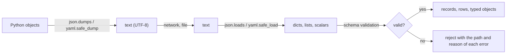

---
aliases:
  - Serialization
  - JSON
  - YAML
  - JSON Schema
  - Deserialization
  - Sérialisation des données
tags:
  - type/concept
  - domain/computer-science
  - domain/bioinformatics
  - level/L1
  - level/L2
  - level/L3
mastery: 0
prerequisites:
  - "[[File Input and Output]]"
  - "[[Hash Table]]"
  - "[[Delimited Text Format]]"
related:
  - "[[Programmatic Database Access]]"
  - "[[Biological Database]]"
  - "[[Accession Number]]"
  - "[[Pipeline Configuration]]"
  - "[[Metadata]]"
  - "[[Data Provenance]]"
  - "[[Integer Representation]]"
  - "[[Floating-Point Arithmetic]]"
  - "[[Defensive Programming]]"
  - "[[Columnar Storage]]"
  - "[[Hierarchical Data Format]]"
  - "[[NoSQL Database]]"
projects:
  - "[[10-genomic-pipeline]]"
sources:
  - "[[Python Documentation]]"
  - "[[JSON Schema]]"
  - "[[YAML Specification]]"
  - "[[Python for Data Analysis (McKinney)]]"
---

# Data Serialization

> [!abstract]
> Serialization turns in-memory data (nested records, lists, maps) into text or bytes that another program can parse back: JSON for exchange and APIs, YAML for human-edited configuration, a schema to check that what arrives has the expected shape, and never a format that can execute code when loaded from an untrusted source.

## Definition

**Serialization** converts a data structure into a sequence of characters or bytes that can be stored or transmitted; **deserialization** (parsing) rebuilds the structure. **JSON** represents objects (string-keyed maps), arrays, strings, numbers, `true`, `false` and `null`; Python's `json` module maps them to `dict`, `list`, `str`, `int` or `float`, `True`, `False` and `None`.[^json] **YAML** is an indentation-based serialization language with comments; since version 1.2 it is a superset of JSON, and its schemas decide which unquoted scalars become booleans or numbers.[^yaml] **JSON Schema** is a JSON vocabulary for declaring what a valid document looks like (types, required members, allowed values, patterns) so that a validator can check documents automatically.[^schema] Language-specific binary formats such as Python's `pickle` can serialize arbitrary objects, but loading them can run code.[^pickle]

## Why it matters

- **APIs answer in serialized text.** Many web services publish data feeds as JSON,[^mck6] and public biological resources offer programmatic interfaces for scripts ([[Programmatic Database Access]], [[Biological Database]]). A JSON response is nested (a gene with its location and transcripts) and must be validated and flattened into tables.
- **Hand-edited configuration.** When pipeline parameters or sample sheets are written in YAML and edited by hand ([[Pipeline Configuration]], [[10-genomic-pipeline]]), an unquoted `NO`, `007` or `3.10` changes type without error (Core).
- **Metadata needs a contract.** A schema turns "the sample record must have an ID, a chromosome and integer coordinates" into an automatic check at the boundary of the pipeline ([[Metadata]], [[Defensive Programming]]).
- **Delimited text is not enough** for nested or variable-length data: a gene with any number of transcripts is one JSON object but needs two tables or repeated rows in CSV ([[Delimited Text Format]]).

## Core (L1)



**JSON round trip.** The JSON data model is smaller than Python's: tuples come back as lists, and because JSON object keys are always strings, non-string keys are converted, so a dict can come back different from the original.[^json] Outputs below come from Python 3.11 with PyYAML 6.0.1 and jsonschema 4.26.0.

```python
import json

record = {"sample_id": "S01", "reads": 1_250_000, "gc": 0.41, "paired": True,      # invented
          "lanes": (1, 2), "qc": None, "counts": {1: 10, 2: 7}}
text = json.dumps(record)
print(text)
back = json.loads(text)
print(back == record, back["lanes"], list(back["counts"]))
print(json.dumps({"condition": "contrôle"}), json.dumps({"condition": "contrôle"}, ensure_ascii=False))
```

```text
{"sample_id": "S01", "reads": 1250000, "gc": 0.41, "paired": true, "lanes": [1, 2], "qc": null, "counts": {"1": 10, "2": 7}}
False [1, 2] ['1', '2']
{"condition": "contr\u00f4le"} {"condition": "contrôle"}
```

By default non-ASCII characters are escaped (`\u00f4`); `ensure_ascii=False` writes them as UTF-8 text.[^json]

**Edges of the standard.** Python accepts and writes `NaN` and `Infinity`, which are outside the JSON specification, unless `allow_nan=False`; it raises `TypeError` for types JSON cannot represent; and for repeated names in an object it keeps the last value.[^json]

```python
import math
from decimal import Decimal

print(json.dumps([math.nan, math.inf]), json.loads("[NaN, Infinity]"))
try:
    json.dumps([math.nan], allow_nan=False)
except ValueError as err:
    print("ValueError:", err)
for value in ({"A", "C"}, Decimal("0.1"), b"ACGT"):
    try:
        json.dumps(value)
    except TypeError as err:
        print("TypeError:", err)
print(json.loads('{"id": "S1", "id": "S2"}'))
big = 2**63 + 1
print(json.loads(json.dumps(big)) == big, int(float(big)), json.loads("0.1", parse_float=Decimal))
```

```text
[NaN, Infinity] [nan, inf]
ValueError: Out of range float values are not JSON compliant
TypeError: Object of type set is not JSON serializable
TypeError: Object of type Decimal is not JSON serializable
TypeError: Object of type bytes is not JSON serializable
{'id': 'S2'}
True 9223372036854775808 0.1
```

A JSON file written by Python with a NaN in it is rejected by strict parsers in other languages; write `null` for missing values instead. Python's `int` survives the round trip at any size, but `float(big)` shows what a consumer that reads JSON numbers as doubles receives (Advanced).

**YAML: readable, and typed by guesswork.** YAML adds comments and indentation-based nesting, which is why it is preferred for files that people edit. Unquoted scalars are typed by pattern; PyYAML applies the YAML 1.1 rules, under which `yes` and `NO` are booleans, `007` is an octal integer and `12:30` a base-60 number, while the YAML 1.2 Core schema reads only `true` and `false` as booleans.[^yaml]

```python
import yaml

doc = """
# sample sheet (invented)
genome: GRCh38
pipeline_version: 3.10
paired: yes
country: NO
sample_id: 007
start_time: 12:30
threshold: 1e3
samples:
  - {id: S01, condition: control}
  - {id: S02, condition: "heat shock"}
"""
for key, value in yaml.safe_load(doc).items():
    print(f"{key}: {value!r} ({type(value).__name__})")
print(yaml.safe_load('pipeline_version: "3.10"\ncountry: "NO"\nsample_id: "007"\nstart_time: "12:30"\nthreshold: 1.0e+3'))
print(yaml.safe_load(json.dumps(back)) == back)
```

```text
genome: 'GRCh38' (str)
pipeline_version: 3.1 (float)
paired: True (bool)
country: False (bool)
sample_id: 7 (int)
start_time: 750 (int)
threshold: '1e3' (str)
samples: [{'id': 'S01', 'condition': 'control'}, {'id': 'S02', 'condition': 'heat shock'}] (list)
{'pipeline_version': '3.10', 'country': 'NO', 'sample_id': '007', 'start_time': '12:30', 'threshold': 1000.0}
True
```

Version `3.10` became `3.1`, the country code for Norway became `False`, `12:30` became 750 (minutes), and `1e3` stayed a string (YAML 1.1 floats need a dot). Quote every value that is a label, and validate types after loading. The last line shows the JSON-subset property in practice: a JSON document parses as YAML to the same data.

**Loading must not execute.** YAML tags can name language objects, and `pickle` can rebuild any Python object; the `pickle` documentation warns that it is not secure and that only trusted data may be unpickled.[^pickle] With PyYAML, `safe_load` refuses such tags while `unsafe_load` calls the named function:

```python
try:
    yaml.safe_load("!!python/object/apply:os.getcwd []")
except yaml.YAMLError as err:
    print(type(err).__name__, str(err).splitlines()[0])
print(yaml.unsafe_load("!!python/object/apply:len [[1, 2, 3]]"))
```

```text
ConstructorError could not determine a constructor for the tag 'tag:yaml.org,2002:python/object/apply:os.getcwd'
3
```

`len` was called during parsing; any importable function could have been. Use `json.loads` and `yaml.safe_load` for anything downloaded or shared.

## Deeper (L2)

**Schema validation.** A JSON Schema states, in JSON, the constraints that a record must satisfy: `type`, `enum` and numeric bounds such as `minimum`, string `pattern`, `required` members, and `properties` with `additionalProperties` controlling unknown members; `$schema` declares the dialect (here 2020-12).[^schema]

```python
from jsonschema import Draft202012Validator, FormatChecker

schema = {
    "$schema": "https://json-schema.org/draft/2020-12/schema",
    "type": "object",
    "required": ["sample_id", "chrom", "start", "end", "strand"],
    "properties": {
        "sample_id": {"type": "string", "pattern": "^S[0-9]{2}$"},
        "chrom": {"type": "string"},
        "start": {"type": "integer", "minimum": 0},
        "end": {"type": "integer", "minimum": 1},
        "strand": {"enum": ["+", "-", "."]},
        "collected": {"type": "string", "format": "date"},
    },
    "additionalProperties": False,
}
Draft202012Validator.check_schema(schema)                       # the schema itself is valid
validator = Draft202012Validator(schema)
good = {"sample_id": "S01", "chrom": "chr1", "start": 999, "end": 1500, "strand": "+"}
bad = {"sample_id": "s1", "chrom": "chr1", "start": -5, "end": "1500", "strand": "plus",
       "depth": 30, "collected": "2026-13-45"}
print(validator.is_valid(good), validator.is_valid(bad))
for err in sorted(validator.iter_errors(bad), key=lambda e: list(e.path)):
    print(list(err.path), err.validator, "->", err.message)
strict = Draft202012Validator(schema, format_checker=FormatChecker())
print([e.message for e in strict.iter_errors({**good, "collected": "2026-13-45"})])
```

```text
True False
[] additionalProperties -> Additional properties are not allowed ('depth' was unexpected)
['end'] type -> '1500' is not of type 'integer'
['sample_id'] pattern -> 's1' does not match '^S[0-9]{2}$'
['start'] minimum -> -5 is less than the minimum of 0
['strand'] enum -> 'plus' is not one of ['+', '-', '.']
["'2026-13-45' is not a 'date'"]
```

`iter_errors` reports every violation with its path, not only the first. The impossible date passed the default validator: in the 2020-12 dialect `format` is an annotation unless format assertion is enabled, which `FormatChecker` does.[^schema] The `pattern` keyword is where [[Accession Number|accession formats]] and sample-ID conventions are enforced.

**Parsing an API response.** Responses are nested; analysis wants rows. The response below is invented, with a typical shape (query echo, count, pagination link, results with nested objects); real field names differ by resource and must be read from each API's documentation.

```python
response = json.loads("""
{"query": "geneX", "count": 2, "next": null,
 "results": [
   {"id": "G0001", "symbol": "geneX",
    "location": {"chrom": "7", "start": 1200, "end": 5400, "strand": -1},
    "transcripts": [{"id": "T0001", "length": 2100, "canonical": true},
                    {"id": "T0002", "length": 900}]},
   {"id": "G0002", "symbol": "geneX-AS1",
    "location": {"chrom": "7", "start": 5300, "end": 6100, "strand": 1},
    "transcripts": []}]}
""")                                                             # invented response
rows = [(g["id"], g["location"]["chrom"], g["location"]["start"], g["location"]["end"],
         "+" if g["location"]["strand"] == 1 else "-", t["id"], t["length"], t.get("canonical", False))
        for g in response["results"] for t in g["transcripts"]]
for r in rows:
    print(r)
print(len(response["results"]) == response["count"], response["next"],
      [g["id"] for g in response["results"] if not g["transcripts"]])
```

```text
('G0001', '7', 1200, 5400, '-', 'T0001', 2100, True)
('G0001', '7', 1200, 5400, '-', 'T0002', 900, False)
True None ['G0002']
```

Three checks worth automating: optional members read with `.get` and an explicit default (`canonical` is absent on `T0002`); the reported `count` equals the records received, and `next` is followed until it is `null`, otherwise results are silently truncated; and flattening a nested list drops parents whose list is empty (`G0002` vanished, like an inner join). Store the raw response with the query, date and API version next to the derived table ([[Data Provenance]]).

## Advanced (L3)

- **Numbers across languages.** The Python documentation warns that JSON numbers are commonly deserialized into IEEE 754 doubles elsewhere, so very large integers lose precision in other consumers.[^json] 64-bit hashes, database row IDs or genomic offsets above $2^{53}$ must travel as strings (Exercise 5, [[Integer Representation]], [[Floating-Point Arithmetic]]).
- **Streaming.** `json.load` builds the whole document in memory. For millions of records, writing one JSON object per line lets a reader parse record by record while iterating over the file, with constant memory.
- **Schemas as versioned contracts.** Declaring `$schema` fixes the rules applied;[^schema] versioning your own schemas alongside the code (and validating configuration at pipeline start) turns a crash after hours of computation into an error before the first step ([[Pipeline Configuration]]). Some constraints cross fields (`end > start`) and are outside the core JSON Schema keywords: check them in code after validation (Exercise 3).
- **Choosing a format.** JSON and YAML suit nested metadata and configuration; large numeric tables and arrays belong in typed binary formats ([[Columnar Storage]], [[Hierarchical Data Format]]); document databases store JSON-like records natively ([[NoSQL Database]]).

## Mathematical representation

- **JSON values** form a recursive type: $V = \texttt{null} \mid \mathbb{B} \mid \text{Number} \mid \Sigma^* \mid V^* \mid (\Sigma^* \rightharpoonup V)$, where $V^*$ is a finite sequence (array) and $\Sigma^* \rightharpoonup V$ a finite partial map from strings to values (object).
- **Serialization** is a map $s : V \to \Sigma^*$ and parsing a partial map $p : \Sigma^* \rightharpoonup V$ with $p(s(v)) = v$ for every $v \in V$. A Python value $x$ round-trips iff it is the image of a JSON value under the type mapping; otherwise $p(s(x)) = \phi(x) \ne x$, where $\phi$ maps tuples to lists and non-string keys to strings.
- **A schema** is a predicate $\sigma : V \to \{\text{true}, \text{false}\}$ built by conjunction of keyword predicates, e.g. $\sigma(v) = [\,v \text{ is an object}\,] \wedge [\,\texttt{start} \in \mathrm{dom}(v)\,] \wedge [\,v(\texttt{start}) \in \mathbb{Z}_{\ge 0}\,] \wedge \dots$ Validation evaluates every conjunct and reports the failed ones with their paths.

## Computational representation

| Format | Nesting | Comments | Types on load | Safe to load untrusted | Typical use |
|---|---|---|---|---|---|
| CSV, TSV | no | no (by convention only) | none, strings | yes | tables ([[Delimited Text Format]]) |
| JSON | yes | no | 6 types | yes (`json`) | APIs, metadata exchange |
| YAML | yes | yes | inferred from patterns | only with `safe_load` | configuration, hand-edited sheets |
| `pickle` | any Python object | n/a | exact Python objects | no[^pickle] | short-lived caches of your own data |
| Parquet, HDF5 | columns, arrays | n/a | declared | yes | large numeric data |

## Worked example

> [!example] From an API response to a validated table
> Invented response above: two genes, the first with two transcripts, the second with none.
> 1. **Parse** with `json.loads`: a `dict` with `results`, a list of 2 dicts.
> 2. **Validate** each result against a schema (required `id` and `location`, integer `start` and `end`, `strand` in $\{-1, 1\}$) before using it; reject the whole batch if any record fails, listing paths.
> 3. **Check completeness**: `count` is 2 and 2 results arrived; `next` is `null`, so there is no further page.
> 4. **Flatten**: one row per (gene, transcript). Decide what a gene without transcripts becomes: dropped (inner-join semantics, `G0002` disappears) or kept with empty transcript fields (Exercise 4).
> 5. **Convert conventions**: strand `-1`/`1` to `-`/`+`; check whether `start` is 0- or 1-based in this API's documentation before mixing with BED ([[Genomic Coordinate System]]).
> 6. **Write** the rows as TSV with a header, and save the raw JSON with the query and date next to it.

## Common misconceptions

> [!warning] "JSON round-trips any Python data"
> Tuples become lists, integer keys become strings, sets, bytes and `Decimal` raise `TypeError`, and NaN is written in a non-standard form.[^json]

> [!warning] "YAML is JSON without the braces"
> YAML infers types from unquoted text: `NO`, `yes`, `007`, `3.10` and `12:30` are not strings under YAML 1.1 rules, which common parsers apply.[^yaml] Quote labels and versions.

> [!warning] "If it parses, the data is valid"
> Parsing only proves the syntax. A missing coordinate, a string where an integer belongs or an unknown strand code all parse; a schema check catches them at the boundary.[^schema]

> [!warning] "Loading a file cannot run code"
> `pickle.load` and full YAML loaders can construct arbitrary objects and call functions.[^pickle] Use `json` or `yaml.safe_load` for downloaded or shared files.

## Exercises

> [!question] Exercise 1 (L1)
> Which of these survive `json.loads(json.dumps(x)) == x`: `{"a": [1, 2]}`, `{"a": (1, 2)}`, `{1: "chr1"}`, `{"p": 1e-300}`, `{"s": {"A", "C"}}`, `{"x": None}`?

> [!success]- Solution
> Survive: `{"a": [1, 2]}`, `{"p": 1e-300}` (floats round-trip through their shortest repr), `{"x": None}` (`null`). Change: the tuple comes back as a list, the key `1` as `"1"`. Fail: the set raises `TypeError`.[^json]

> [!question] Exercise 2 (L1)
> With PyYAML's `safe_load`, predict the type of each value: `assembly: GRCh38`, `release: 110`, `version: 2.10`, `paired: no`, `sample: 0012`, `chrom: X`. Rewrite the file so that every value is read as written.

> [!success]- Solution
> `str`, `int`, `float` (2.1), `bool` (False), `int` (octal 0012 = 10), `str`. Quote the labels: `version: "2.10"`, `paired: "no"` (or `false` if a boolean is meant), `sample: "0012"`; keep `release: 110` only if it really is a number.

> [!question] Exercise 3 (L2, Python)
> Write a schema for an interval record with integer `start` (≥ 0) and `end` (≥ 1), then test `{"start": 900, "end": 400}`. Is the record valid? What does that tell you about schema validation?

> [!success]- Solution
> ```python
> schema = {"type": "object", "required": ["start", "end"],
>           "properties": {"start": {"type": "integer", "minimum": 0}, "end": {"type": "integer", "minimum": 1}}}
> rec = {"start": 900, "end": 400}
> print(Draft202012Validator(schema).is_valid(rec), rec["end"] > rec["start"])
> ```
> ```text
> True False
> ```
> Each field is valid on its own, but the interval is inverted. The core keywords constrain values one member at a time;[^schema] cross-field rules (`end > start`, `end` within the chromosome length) need code after validation.

> [!question] Exercise 4 (L2, Python)
> Flatten the invented API response so that a gene without transcripts still yields one row, with `None` for the transcript fields.

> [!success]- Solution
> ```python
> rows = []
> for g in response["results"]:
>     loc = g["location"]
>     for t in g["transcripts"] or [{}]:                       # keep genes without transcripts
>         rows.append((g["id"], loc["chrom"], loc["start"], loc["end"], t.get("id"), t.get("length")))
> for r in rows:
>     print(r)
> ```
> ```text
> ('G0001', '7', 1200, 5400, 'T0001', 2100)
> ('G0001', '7', 1200, 5400, 'T0002', 900)
> ('G0002', '7', 5300, 6100, None, None)
> ```
> `or [{}]` substitutes one empty transcript for an empty list: the left-join semantics of [[SQL]], where the inner version above is the inner join.

> [!question] Exercise 5 (L3, Python)
> A pipeline exports a 64-bit k-mer hash `0xDEADBEEFCAFEF00D` (invented) in JSON for a JavaScript dashboard. Show what a double-based consumer receives, and fix the export.

> [!success]- Solution
> ```python
> h = 0xDEADBEEFCAFEF00D                                           # invented 64-bit k-mer hash
> print(h, float(h) == h, int(float(h)), json.loads(json.dumps({"hash": str(h)}))["hash"] == str(h))
> ```
> ```text
> 16045690984503111693 False 16045690984503111680 True
> ```
> As a double, the hash loses its last bits (spacing $2^{11} = 2048$ near $1.6 \times 10^{19}$), so two different k-mers can collide in the dashboard. Serialize such identifiers as strings (or hexadecimal strings) and document it in the schema (`"type": "string"`).[^json]

## Mastery checklist

- [ ] 1 Recognized: I can name the JSON types and their Python counterparts, and say what YAML adds (comments, indentation, implicit typing).
- [ ] 2 Understood: I can explain which Python values do not round-trip, the YAML typing traps, why `pickle` and full YAML loaders are unsafe, and what a schema checks.
- [ ] 3 Practiced: I can write and apply a JSON Schema, report all violations with paths, and flatten a nested response into rows with explicit handling of absent members.
- [ ] 4 Applied: [[10-genomic-pipeline]] validates its YAML configuration and its sample metadata against schemas before running.
- [ ] 5 Explained: I can teach the round-trip property, precision limits of JSON numbers across languages, cross-field constraints, and how to choose between JSON, YAML, text tables and binary formats.

## References

[^json]: [[Python Documentation]], 3.13, Library Reference, `json`: conversion tables between JSON and Python types, keys coerced to strings, `ensure_ascii`, `allow_nan` and the out-of-spec `NaN` and `Infinity`, `parse_float`, repeated names (last value kept), and "Implementation Limitations" (JSON numbers often deserialized as IEEE 754 doubles by other software).
[^pickle]: [[Python Documentation]], 3.13, Library Reference, `pickle`: the module is not secure; only unpickle data you trust.
[^yaml]: [[YAML Specification]], version 1.2.2 and its changes page: YAML 1.2 as a superset of JSON; the Core schema as recommended default, with only `true` and `false` resolved as booleans, replacing the YAML 1.1 type library in which `y`, `yes`, `on`, `NO` were booleans.
[^schema]: [[JSON Schema]], 2020-12 Core and Validation documents: `$schema`, `type`, `enum`, `minimum`, `pattern`, `required`, `properties`, `additionalProperties`; `format` as annotation by default.
[^mck6]: [[Python for Data Analysis (McKinney)]], 3rd ed. (2022), ch. 6 "Data Loading, Storage, and File Formats": JSON data with the `json` module, and web APIs that provide data feeds as JSON.
