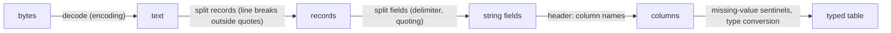

---
aliases:
  - CSV
  - TSV
  - Comma-Separated Values
  - Tab-Separated Values
  - Flat File
  - Fichier texte délimité
tags:
  - type/concept
  - domain/computer-science
  - domain/bioinformatics
  - level/L1
  - level/L2
  - level/L3
mastery: 0
prerequisites:
  - "[[File Input and Output]]"
  - "[[String]]"
  - "[[Iterator]]"
related:
  - "[[Data Serialization]]"
  - "[[Data Frame]]"
  - "[[Tidy Data]]"
  - "[[Missing Data]]"
  - "[[BED Format]]"
  - "[[GFF Format]]"
  - "[[VCF Format]]"
  - "[[Unix Text Processing]]"
  - "[[Integer Representation]]"
  - "[[Floating-Point Arithmetic]]"
  - "[[Relational Database]]"
  - "[[Columnar Storage]]"
projects:
  - "[[09-genome-browser]]"
  - "[[10-genomic-pipeline]]"
sources:
  - "[[RFC 4180]]"
  - "[[Python Documentation]]"
  - "[[Python for Data Analysis (McKinney)]]"
  - "[[Bioinformatics Data Skills (Buffalo)]]"
  - "[[Sequence Ontology GFF3 Specification]]"
  - "[[GA4GH hts-specs]]"
---

# Delimited Text Format

> [!abstract]
> A delimited text file stores a table as lines of fields separated by a comma (CSV) or a tab (TSV): simple enough for every tool to read, but its quoting, missing values and absent types must be handled deliberately, because a careless reader silently changes the data.

## Definition

A **delimited text format** serializes a table as text: one **record** per line, **fields** separated by a delimiter character, often with a first **header** line naming the columns. **CSV** is documented by RFC 4180: records end with CRLF, every record has the same number of comma-separated fields, the header is optional, and a field that contains a comma, a double quote or a line break must be enclosed in double quotes, with an inner quote written twice (`""`).[^rfc] **TSV** uses a tab and, in bioinformatics, usually no quoting at all: formats such as [[GFF Format|GFF3]] and [[VCF Format|VCF]] are tab-delimited tables with their own rules for forbidden characters, comments and missing values.[^gff][^vcf] The format carries no types: Python's `csv` reader returns every field as a string unless told otherwise.[^csv]

## Why it matters

- **Most bioinformatics tables are delimited text**: sample sheets, count matrices, differential expression results, and the BED, GFF and VCF annotation formats; tab-delimited files are the common currency of command-line tools ([[Unix Text Processing]]).[^buffalo]
- **Errors are silent.** A sample ID `007` read as the number 7, a `NA` read as missing, a comma inside a free-text note splitting a record: the file loads, the analysis runs, the joins and counts are wrong ([[10-genomic-pipeline]]).
- **Coordinates and IDs need exact types.** An integer column with one missing value becomes floating point, and identifiers above $2^{53}$ change value (Deeper).
- **It is the interchange layer** between spreadsheets, R and Python ([[Data Frame]]), relational databases ([[Relational Database]]) and genome browsers ([[09-genome-browser]]).

## Core (L1)



Each arrow is a decision that a reader makes, with or without you. Decoding is covered in [[File Input and Output]] (always pass `encoding=`; `utf-8-sig` for files with a byte order mark). The other steps are below.

**Quoting (RFC 4180).** The `csv` module implements these rules; files must be opened with `newline=""` so that line breaks inside quoted fields survive.[^csv][^rfc] Outputs below come from Python 3.11 and pandas 3.0.6.

```python
import csv
import io

rows = [["sample_id", "condition", "note"],                      # invented sample sheet
        ["S01", "heat shock, 42 C", 'library "B" re-run'],
        ["S02", "control", "line one\nline two"]]
buf = io.StringIO(newline="")
csv.writer(buf).writerows(rows)
text = buf.getvalue()
print(repr(text))
print(list(csv.reader(io.StringIO(text, newline=""))) == rows, len(text.splitlines()))
print(text.splitlines()[1].split(","))                            # naive split: wrong
```

```text
'sample_id,condition,note\r\nS01,"heat shock, 42 C","library ""B"" re-run"\r\nS02,control,"line one\nline two"\r\n'
True 4
['S01', '"heat shock', ' 42 C"', '"library ""B"" re-run"']
```

The writer quoted exactly the fields that needed it and the reader restored the table, but the text has 4 lines for 3 records, and `line.split(",")` produced 4 fields with quotes left in. Any tool that assumes one record per line (`wc -l`, `grep`, `awk`) is wrong on such a file.

**No types, unless asked.** Every field comes back as a string; with `QUOTE_NONNUMERIC` the reader converts unquoted fields to `float`.[^csv] For TSV, set `delimiter="\t"` and, for files read by Unix tools, `lineterminator="\n"`: the default `excel` dialect writes `\r\n`.[^csv]

```python
row = next(csv.reader(io.StringIO("chr1,1000,0.5\n")))
print(row, [type(x).__name__ for x in row])
print(next(csv.reader(io.StringIO('"chr1",1000,0.5\n'), quoting=csv.QUOTE_NONNUMERIC)))
out = io.StringIO(newline="")
tsv = csv.writer(out, delimiter="\t", lineterminator="\n")
tsv.writerows([["chrom", "start", "end", "name"], ["chr1", 1000, 1500, "peak 1"], ["chr2", 20, 90, "a\tb"]])
print(repr(out.getvalue()))
print(repr(csv.excel.lineterminator), csv.Sniffer().sniff("chrom\tstart\nchr1\t10\n").delimiter == "\t")
```

```text
['chr1', '1000', '0.5'] ['str', 'str', 'str']
['chr1', 1000.0, 0.5]
'chrom\tstart\tend\tname\nchr1\t1000\t1500\tpeak 1\nchr2\t20\t90\t"a\tb"\n'
'\r\n' True
```

The writer quoted the field containing a tab, which a CSV reader understands but a bioinformatics TSV consumer does not: those formats forbid or escape the delimiter instead. GFF3 percent-encodes tabs, newlines and `%` (and `;`, `=`, `&`, `,` inside attributes), splits on tabs only, and writes `.` for an undefined field; VCF starts with `##` meta-information lines, then a `#CHROM` header line, and writes `.` for missing values.[^gff][^vcf] BED accepts runs of spaces or tabs as separators, so a `name` may contain spaces only in a tab-only file ([[BED Format]]).

## Deeper (L2)

**Type inference.** `pandas.read_csv` guesses each column's type and treats a list of strings (empty field, `NA`, `NULL`, `NaN` and others) as missing; both behaviours are configurable (`dtype`, `na_values`, `keep_default_na`).[^mck6] On an invented sample sheet:

```python
import pandas as pd

sheet = ("sample_id,chrom,depth,status,note\n"                    # invented
         "007,X,35,NA,ok\n"
         '010,1,,pass,"re-run, lane 2"\n'
         "112,2,40,.,\n")
df = pd.read_csv(io.StringIO(sheet))
print({c: str(t) for c, t in df.dtypes.items()})
print(df.to_dict("list"))
typed = pd.read_csv(io.StringIO(sheet),
                    dtype={"sample_id": str, "chrom": str, "depth": "Int64"},
                    keep_default_na=False, na_values={"depth": [""], "status": ["."]})
print({c: str(t) for c, t in typed.dtypes.items()})
print(typed.to_dict("list"))
```

```text
{'sample_id': 'int64', 'chrom': 'str', 'depth': 'float64', 'status': 'str', 'note': 'str'}
{'sample_id': [7, 10, 112], 'chrom': ['X', '1', '2'], 'depth': [35.0, nan, 40.0], 'status': [nan, 'pass', '.'], 'note': ['ok', 're-run, lane 2', nan]}
{'sample_id': 'str', 'chrom': 'str', 'depth': 'Int64', 'status': 'str', 'note': 'str'}
{'sample_id': ['007', '010', '112'], 'chrom': ['X', '1', '2'], 'depth': [35, None, 40], 'status': ['NA', 'pass', nan], 'note': ['ok', 're-run, lane 2', '']}
```

With defaults: IDs lost their leading zeros (and no longer join with `007` elsewhere), `depth` became `float64` because of one empty field, the status `NA` (here a real code, "not applicable") became missing, while the VCF-style `.` stayed a string. With explicit dtypes, the nullable `Int64` type keeps integers next to a missing value,[^mck7] and missing-value sentinels are declared per column.

**Comment characters truncate.** `comment="#"` drops everything after a `#` anywhere on a line, including VCF's `#CHROM` header and any field containing `#`:

```python
vcf_like = "##fileformat=VCFv4.5\n#CHROM\tPOS\tID\nchr1\t100\trs#1\n"     # invented
print(pd.read_csv(io.StringIO(vcf_like), sep="\t", comment="#", header=None).values.tolist())
body = "\n".join(line for line in vcf_like.splitlines() if not line.startswith("##"))
print(pd.read_csv(io.StringIO(body), sep="\t").to_dict("list"))
```

```text
[['chr1', 100, 'rs']]
{'#CHROM': ['chr1'], 'POS': [100], 'ID': ['rs#1']}
```

Skip meta lines by their prefix, not with a comment character.

**Integer IDs through a float column.** A 54-bit identifier is changed by a single missing value in its column, because the column becomes `float64`, exact only up to $2^{53}$ ([[Floating-Point Arithmetic]]):

```python
ids = "id,x\n9007199254740993,1\n,2\n"                              # invented 54-bit identifier
print(pd.read_csv(io.StringIO(ids))["id"].iloc[0], pd.read_csv(io.StringIO(ids), dtype={"id": "Int64"})["id"].iloc[0])
```

```text
9007199254740992.0 9007199254740993
```

**Ragged rows.** Count the fields of every record against the header before trusting a file. pandas rejects a row with too many fields but pads a row with too few with missing values, silently:

```python
ragged = "gene\tsample\tcount\ng1\tS1\t10\ng2\tS1\ng3\tS1\t7\textra\ng4\tS1\t0\n"   # invented


def bad_widths(lines, delimiter="\t"):
    """(line number, field count) of every record whose width differs from the header."""
    reader = csv.reader(lines, delimiter=delimiter)
    width = len(next(reader))
    return [(reader.line_num, len(r)) for r in reader if len(r) != width]


print(bad_widths(io.StringIO(ragged)))
try:
    pd.read_csv(io.StringIO(ragged), sep="\t")
except pd.errors.ParserError as err:
    print("ParserError:", str(err).strip())
print(pd.read_csv(io.StringIO(ragged), sep="\t", on_bad_lines="skip").to_dict("list"))
```

```text
[(3, 2), (4, 4)]
ParserError: Error tokenizing data. C error: Expected 3 fields in line 4, saw 4
{'gene': ['g1', 'g2', 'g4'], 'sample': ['S1', 'S1', 'S1'], 'count': [10.0, nan, 0.0]}
```

`on_bad_lines="skip"` dropped `g3` and kept the truncated `g2` with a missing count: two different errors, both hidden. `bad_widths` reports both, with line numbers. The reader is an [[Iterator]], so the check runs in constant memory on files of any size.

## Advanced (L3)

- **Floats round-trip only at full precision.** Python writes a float with the shortest decimal string that reads back to the same double,[^tut] so `csv.writer` output is lossless; formatting with `f"{x:.6g}"` to "save space" is not (Exercise 5).
- **Validate before analysis.** A loader for a pipeline should check, in this order: encoding and delimiter, header names, field counts per record, one dtype per column, missing-value sentinels, uniqueness of the key column (sample ID), and ranges (start below end). These checks are what a database schema enforces automatically ([[Relational Database]]); a schema language for records is described in [[Data Serialization]].
- **Text is the slow path.** Every load re-parses digits into numbers. Large tables queried often are better stored once in a typed, compressed, columnar binary format ([[Columnar Storage]]) or a database ([[Embedded Database]]); delimited text stays the exchange and archive format, readable without any library.

## Mathematical representation

- A table is a matrix $T \in (\Sigma^*)^{m \times n}$ of strings over an alphabet $\Sigma$. Serialization $S$ joins fields with a delimiter $\delta$ and records with a terminator $\lambda$; parsing $P$ splits them.
- **Round-trip property**: $P(S(T)) = T$ for every table iff $S$ is injective. Without quoting, $S$ is not injective as soon as a field may contain $\delta$ or $\lambda$: the rows `["a,b"]` and `["a", "b"]` both serialize to `a,b`. RFC 4180 restores injectivity by quoting such fields and doubling inner quotes; GFF3 does it by percent-encoding, i.e. by mapping fields into $(\Sigma \setminus \{\delta, \lambda\})^*$ injectively.[^rfc][^gff]
- **Type inference** picks, for each column $j$, the smallest type in a chain such as $\texttt{bool} \subset \texttt{int} \subset \texttt{float} \subset \texttt{str}$ that parses every non-missing value $T_{ij}$ (each $T_{ij}$ not in the sentinel set $M$). The result depends on $M$ and on every row: one value `X` in a chromosome column turns the whole column into strings, one empty field turns NumPy integers into floats.

## Computational representation

| Tool | Reads quoting | Types | Use |
|---|---|---|---|
| `str.split` | no | strings | only for formats that forbid the delimiter in fields (BED, GFF3 with tabs) |
| `csv` module | yes, configurable dialect | strings (or floats with `QUOTE_NONNUMERIC`) | streaming, exact control, standard library[^csv] |
| `pandas.read_csv` | yes | inferred or given per column | analysis in a [[Data Frame]][^mck6] |
| `cut`, `awk`, `sort` | no | text | quick streaming on unquoted TSV ([[Unix Text Processing]]) |

Dialect parameters to set explicitly rather than sniff: `delimiter`, `quotechar`, `quoting`, `lineterminator`, plus `encoding` when opening the file. `csv.Sniffer` guesses them from a sample, which is useful for exploration and fragile in a pipeline.[^csv]

## Worked example

> [!example] Loading a sample sheet without changing it
> The invented sheet above: `sample_id,chrom,depth,status,note`, three records.
> 1. **Quoting**: record 2 has `"re-run, lane 2"`; a quote-aware reader gives 5 fields, `split(",")` would give 6.
> 2. **Default inference**: `sample_id` → `int64` (`007` → 7), `depth` → `float64` (one empty field), `status` `NA` → missing.
> 3. **Declare intent**: IDs and chromosome names are labels, so `str`; depth is a count with possible gaps, so `Int64`; the only missing-value sentinels are an empty depth and a `.` status; `NA` is a real code.
> 4. **Result**: `['007', '010', '112']`, depth `[35, <NA>, 40]`, status `['NA', 'pass', <missing>]`.
> 5. **Check**: assert that `sample_id` is unique and that every row had 5 fields (`bad_widths` returns `[]`) before joining the sheet to count data.

## Common misconceptions

> [!warning] "`line.split(',')` parses a CSV file"
> Only if no field contains a comma, a quote or a line break. RFC 4180 allows all three inside quotes; use the `csv` module.[^rfc][^csv]

> [!warning] "TSV is CSV with tabs"
> CSV has a quoting convention; tab-delimited bioinformatics formats generally do not, and either forbid the tab inside fields or escape it (GFF3 percent-encoding).[^gff] A CSV writer that quotes a tab-containing field produces a line a GFF or BED parser misreads.

> [!warning] "An empty field means zero"
> It means missing (or empty text), and `NA` or `.` may mean missing or be real values. Decide per column which strings are missing, and never fill missing counts with zeros without saying so ([[Missing Data]]).

> [!warning] "pandas reads the file as written"
> It infers types and missing values: leading zeros disappear, integers become floats, codes become NaN. Pass `dtype` and the missing-value options for every column that matters.[^mck6]

## Exercises

> [!question] Exercise 1 (L1)
> Which of these fields must be quoted in RFC 4180 CSV, and how is each written: `GAPDH`, `heat shock, 42 C`, `ratio "A/B"`, a two-line comment, ` padded ` (with spaces)?

> [!success]- Solution
> Quoted: the field with a comma, the one with quotes (inner quotes doubled) and the multi-line one. Spaces are part of the field and need no quotes.[^rfc] The `csv` writer gives:
> ```text
> 'GAPDH\r\n'
> '"heat shock, 42 C"\r\n'
> '"ratio ""A/B"""\r\n'
> '"two\nlines"\r\n'
> ' padded \r\n'
> ```

> [!question] Exercise 2 (L1)
> `wc -l samples.csv` prints 1001 and the file has a header. How many samples does it contain?

> [!success]- Solution
> Not necessarily 1000: a quoted field with a line break adds lines without adding records (the sheet above has 4 lines for 3 records). Count records with a CSV parser (`sum(1 for _ in csv.reader(fh)) - 1`), and use `wc -l` only on formats that forbid line breaks in fields.

> [!question] Exercise 3 (L2)
> You load the body of a VCF (after the `##` lines) with pandas. Which arguments make `POS` an integer column, keep `ID` values such as `rs#1` intact, and treat `.` as missing in `QUAL` only?

> [!success]- Solution
> `pd.read_csv(path, sep="\t", dtype={"#CHROM": str, "POS": "Int64", "ID": str}, keep_default_na=False, na_values={"QUAL": ["."]})`, after skipping the `##` lines by prefix (not `comment="#"`, which would cut `rs#1` and drop the header). `#CHROM` as `str` keeps names such as `1` and `X` uniform. `POS` is 1-based in VCF ([[Genomic Coordinate System]]).

> [!question] Exercise 4 (L2)
> A results table read with defaults shows the identifier `9007199254740992.0` where the file says `9007199254740993`. Explain both the `.0` and the changed last digit, and give two fixes.

> [!success]- Solution
> The column contains an empty field, so pandas stored it as `float64` (hence `.0`); $9\,007\,199\,254\,740\,993 = 2^{53} + 1$ is not representable as a double and rounds to $2^{53}$. Fixes: read identifiers as `str` (they are labels, not quantities), or as the nullable `Int64` type, which kept `9007199254740993` above.

> [!question] Exercise 5 (L3, Python)
> Write four floats with the `csv` writer and read them back; then write them with `f"{x:.6g}"` and compute the maximum relative error. Values: `0.1 + 0.2`, `1/3`, `2.5e-12`, `123456.789012345`.

> [!success]- Solution
> ```python
> vals = [0.1 + 0.2, 1 / 3, 2.5e-12, 123456.789012345]
> b = io.StringIO(newline="")
> csv.writer(b).writerow(vals)
> print(b.getvalue().strip(), [float(x) for x in next(csv.reader(io.StringIO(b.getvalue())))] == vals)
> short = [float(f"{v:.6g}") for v in vals]
> print(short, max(abs(s - v) / abs(v) for s, v in zip(short, vals)))
> ```
> ```text
> 0.30000000000000004,0.3333333333333333,2.5e-12,123456.789012345 True
> [0.3, 0.333333, 2.5e-12, 123457.0] 1.7090000208390837e-06
> ```
> `str(float)` round-trips exactly; 6 significant digits lose up to $1.7 \times 10^{-6}$ relative error, harmless for a plot, harmful for p-values compared at $10^{-8}$ or for coordinates (123456.789 became 123457).

## Mastery checklist

- [ ] 1 Recognized: I can state the RFC 4180 quoting rules and the missing-value and comment conventions of BED, GFF3 and VCF.
- [ ] 2 Understood: I can explain why `split` fails on CSV, why records and lines differ, and how type inference changes values.
- [ ] 3 Practiced: I can read and write CSV and TSV with `csv` and pandas with explicit dialects, dtypes and missing-value sentinels, and validate field counts.
- [ ] 4 Applied: [[10-genomic-pipeline]] loads its sample sheet with a validated, typed reader, and [[09-genome-browser]] parses BED and GFF tracks without quoting assumptions.
- [ ] 5 Explained: I can teach the round-trip property, why bioinformatics formats escape instead of quoting, and when to leave text for a database or columnar format.

## References

[^rfc]: [[RFC 4180]], section 2 "Definition of the CSV Format": CRLF record separator, optional header, equal field counts, spaces part of fields, double-quote enclosure for fields with commas, quotes or line breaks, doubled inner quotes.
[^csv]: [[Python Documentation]], 3.13, Library Reference, `csv`: `reader` returns rows as lists of strings with no automatic type conversion unless `QUOTE_NONNUMERIC` (unquoted fields become floats); open files with `newline=""`; dialects `excel` and `excel_tab`; `Dialect.lineterminator` (default `"\r\n"`); `Sniffer`.
[^mck6]: [[Python for Data Analysis (McKinney)]], 3rd ed. (2022), ch. 6 "Data Loading, Storage, and File Formats": `read_csv` options (delimiter, header, column types, missing-value sentinels such as `NA` and `NULL`, `keep_default_na`), type inference, the `csv` module and dialects.
[^mck7]: [[Python for Data Analysis (McKinney)]], 3rd ed. (2022), ch. 7 "Data Cleaning and Preparation": missing data and extension data types such as `Int64`.
[^buffalo]: [[Bioinformatics Data Skills (Buffalo)]], treatment of tabular plain-text data and Unix data tools on bioinformatics files; chapter not verified.
[^gff]: [[Sequence Ontology GFF3 Specification]], "Description of the Format": nine tab-separated columns, `.` for undefined fields, percent-encoding of tab, newline, carriage return, `%` and control characters (and `;` `=` `&` `,` in column 9), splitting on tabs only.
[^vcf]: [[GA4GH hts-specs]], VCF specification (v4.x): `##` meta-information lines, the `#CHROM` header line, tab-delimited data lines, `.` for missing values.
[^tut]: [[Python Documentation]], 3.13, "The Python Tutorial", "Floating-Point Arithmetic: Issues and Limitations": Python displays the shortest decimal string that rounds to the same double.
