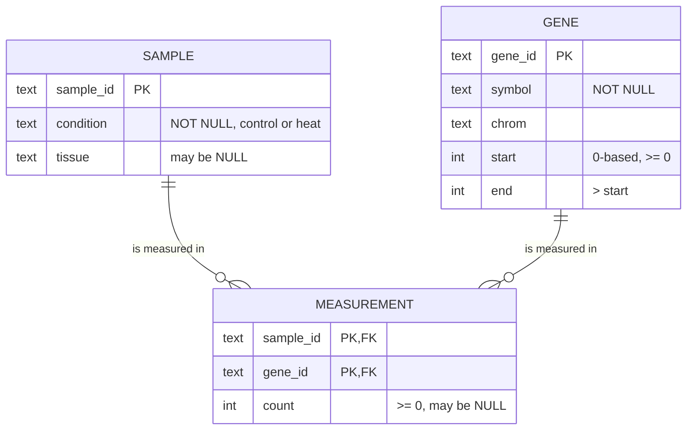

---
aliases:
  - Relational Model
  - RDBMS
  - Relational Database Management System
  - Primary Key
  - Foreign Key
  - Base de données relationnelle
tags:
  - type/concept
  - domain/computer-science
  - domain/bioinformatics
  - level/L1
  - level/L2
  - level/L3
mastery: 0
prerequisites:
  - "[[Set]]"
  - "[[Binary Relation]]"
  - "[[Delimited Text Format]]"
related:
  - "[[SQL]]"
  - "[[Relational Algebra]]"
  - "[[Entity-Relationship Model]]"
  - "[[Database Normalization]]"
  - "[[Database Index]]"
  - "[[Database Transaction]]"
  - "[[Embedded Database]]"
  - "[[Tidy Data]]"
  - "[[Data Frame]]"
  - "[[Accession Number]]"
  - "[[Laboratory Information Management System]]"
  - "[[NoSQL Database]]"
projects:
  - "[[09-genome-browser]]"
  - "[[10-genomic-pipeline]]"
sources:
  - "[[Codd 1970 - A Relational Model of Data for Large Shared Data Banks]]"
  - "[[CMU 15-445 - Database Systems]]"
  - "[[Python Documentation]]"
---

# Relational Database

> [!abstract]
> A relational database stores data as relations (tables of rows with typed columns), identifies each row by a primary key, links tables through foreign keys, and lets a management system enforce these rules for every program that writes, so that a measurement can never point to a sample that does not exist.

## Definition

In the **relational model**, introduced by Codd in 1970, a **relation** on domains $S_1, \dots, S_n$ is a set of $n$-tuples whose $j$-th element comes from $S_j$. Shown as a table, each row is a tuple, the order of rows is immaterial and all rows are distinct.[^codd] A **primary key** is a column, or combination of columns, whose values uniquely identify each row; a **foreign key** of a relation $R$ is a column (or combination) whose values are values of the primary key of some relation $S$.[^codd] A **relational database management system** (RDBMS) stores relations as tables and adds what a folder of CSV files lacks: a declarative query language ([[SQL]]), enforcement of integrity constraints, storage and indexing, query optimization, and transactions with concurrency control and crash recovery.[^cmu]

## Why it matters

- **Biology is linked data.** Samples come from donors, are sequenced in runs, produce measurements of genes, which lie on chromosomes. Keeping each entity once and linking by keys answers questions that cross them ("mean count of gene $g$ in heat-treated samples") with a join ([[SQL]]).
- **Integrity at the source.** A sample ID mistyped in a measurement file joins with nothing and silently disappears from an analysis. A foreign key rejects it at insertion, for every script and every user ([[10-genomic-pipeline]], [[Laboratory Information Management System]]).
- **Annotations for a browser.** [[09-genome-browser]] keeps gene annotations in an [[Embedded Database]], queried by chromosome and position.
- **The model behind data frames.** A tidy table, a pandas merge and a SQL join are the same relational ideas ([[Tidy Data]], [[Data Frame]]).

## Core (L1)

A toy expression study (all values invented): samples, genes, and one measured count per (sample, gene).



| Relational model | SQL | pandas / Python |
|---|---|---|
| relation | table | `DataFrame`, list of tuples |
| tuple | row | row, tuple |
| attribute | column | column |
| domain | column type plus constraints | dtype |
| key | `PRIMARY KEY`, `UNIQUE` | index (not enforced unique) |
| foreign key | `REFERENCES` | none (checked by hand) |

**Long, not wide.** A count matrix (genes × samples) is a spreadsheet layout; relationally it is the relation `measurement(sample_id, gene_id, count)` with the composite key `(sample_id, gene_id)`: one row per measured cell, no column per sample, and adding a sample adds rows, not columns ([[Tidy Data]]).

**Constraints in action.** SQLite, through Python's standard `sqlite3` module (SQLite 3.45.1 here):

```python
import sqlite3

SCHEMA = """
CREATE TABLE sample (
    sample_id  TEXT PRIMARY KEY,
    condition  TEXT NOT NULL CHECK (condition IN ('control', 'heat')),
    tissue     TEXT
);
CREATE TABLE gene (
    gene_id    TEXT PRIMARY KEY,
    symbol     TEXT NOT NULL,
    chrom      TEXT NOT NULL,
    start      INTEGER NOT NULL CHECK (start >= 0),
    end        INTEGER NOT NULL CHECK (end > start)
);
CREATE TABLE measurement (
    sample_id  TEXT NOT NULL REFERENCES sample (sample_id),
    gene_id    TEXT NOT NULL REFERENCES gene (gene_id),
    count      INTEGER CHECK (count >= 0),
    PRIMARY KEY (sample_id, gene_id)
);
"""
SAMPLES = [("S1", "control", "leaf"), ("S2", "control", "leaf"), ("S3", "heat", "leaf"), ("S4", "heat", None)]
GENES = [("g1", "alpha", "chr1", 100, 900), ("g2", "beta", "chr1", 1500, 4000),
         ("g3", "gamma", "chr2", 50, 700), ("g4", "delta", "chr2", 2000, 2600)]
COUNTS = {"S1": (120, 30, 0, 50), "S2": (100, 45, 2, 53), "S3": (400, 10, 1, None)}   # all invented


def build(enforce_fk: bool = True) -> sqlite3.Connection:
    con = sqlite3.connect(":memory:")
    if enforce_fk:
        con.execute("PRAGMA foreign_keys = ON")                 # SQLite: per connection
    con.executescript(SCHEMA)
    with con:                                                    # one transaction
        con.executemany("INSERT INTO sample VALUES (?, ?, ?)", SAMPLES)
        con.executemany("INSERT INTO gene VALUES (?, ?, ?, ?, ?)", GENES)
        con.executemany("INSERT INTO measurement VALUES (?, ?, ?)",
                        [(s, g[0], c) for s, cs in COUNTS.items() for g, c in zip(GENES, cs)])
    return con


con = build()
print(con.execute("SELECT count(*) FROM measurement").fetchone())
violations = {
    "duplicate key": "INSERT INTO measurement VALUES ('S1', 'g1', 5)",
    "unknown sample": "INSERT INTO measurement VALUES ('S9', 'g1', 5)",
    "negative count": "INSERT INTO measurement VALUES ('S4', 'g1', -3)",
    "missing condition": "INSERT INTO sample (sample_id) VALUES ('S5')",
    "inverted interval": "INSERT INTO gene VALUES ('g5', 'eps', 'chr3', 500, 400)",
    "delete referenced gene": "DELETE FROM gene WHERE gene_id = 'g1'",
}
for name, sql in violations.items():
    try:
        con.execute(sql)
        print(f"{name}: accepted")
    except sqlite3.IntegrityError as err:
        print(f"{name}: {err}")
```

```text
(12,)
duplicate key: UNIQUE constraint failed: measurement.sample_id, measurement.gene_id
unknown sample: FOREIGN KEY constraint failed
negative count: CHECK constraint failed: count >= 0
missing condition: NOT NULL constraint failed: sample.condition
inverted interval: CHECK constraint failed: end > start
delete referenced gene: FOREIGN KEY constraint failed
```

Each rule is declared once in the schema and checked on every write, whatever program performs it. Sample `S4` exists without measurements, which is allowed (the `o{` "zero or more" side of the diagram); the missing count of `S3`/`g4` is a NULL, which SQL treats specially ([[SQL]]).

## Deeper (L2)

**Choosing keys.** A **candidate key** is a minimal set of columns that identifies rows; one is chosen as primary key. Prefer identifiers designed to be stable and unique within a namespace, such as versioned accessions ([[Accession Number]]), over display names such as gene symbols, which carry no uniqueness guarantee. A **surrogate key** (an integer assigned by the database) is useful when no natural key exists or when the natural key is long; it must then be complemented by `UNIQUE` constraints on the natural identifiers, otherwise duplicates creep in under different surrogate numbers.

**Engine details matter.** The model says what must hold; each engine decides what is enforced. Observed with SQLite 3.45.1: foreign keys are checked only on a connection that executed `PRAGMA foreign_keys = ON`, and ordinary columns accept values of other types unless the table is declared `STRICT`:

```python
loose = build(enforce_fk=False)
loose.execute("INSERT INTO measurement VALUES ('S9', 'g1', 5)")
print(loose.execute("SELECT * FROM measurement WHERE sample_id = 'S9'").fetchall(),
      loose.execute("PRAGMA foreign_key_check").fetchall())
flexible = sqlite3.connect(":memory:")
flexible.execute("CREATE TABLE t (x INTEGER)")
flexible.execute("INSERT INTO t VALUES ('12'), ('chr1'), (3.0), (3.5)")
print(flexible.execute("SELECT x, typeof(x) FROM t").fetchall())
strict = sqlite3.connect(":memory:")
strict.execute("CREATE TABLE t (x INTEGER) STRICT")
try:
    strict.execute("INSERT INTO t VALUES ('chr1')")
except sqlite3.IntegrityError as err:
    print("IntegrityError:", err)
```

```text
[('S9', 'g1', 5)] [('measurement', 13, 'sample', 1)]
[(12, 'integer'), ('chr1', 'text'), (3, 'integer'), (3.5, 'real')]
IntegrityError: cannot store TEXT value in INTEGER column t.x
```

The orphan row went in; `PRAGMA foreign_key_check` finds it afterwards (row 13 of `measurement` references a missing `sample`). Defaults differ between engines: read them for the one you use, and with SQLite set both explicitly.

**Transactions.** Several writes that belong together (a new sample and its measurements) must succeed or fail as a unit. Used as a context manager, a `sqlite3` connection commits when the block succeeds and rolls back when it raises:[^sqlite3]

```python
try:
    with con:                                                    # commit on success, roll back on error
        con.execute("INSERT INTO sample VALUES ('S7', 'control', 'root')")
        con.execute("INSERT INTO measurement VALUES ('S7', 'g9', 1)")      # unknown gene
except sqlite3.IntegrityError as err:
    print("rolled back:", err)
print(con.execute("SELECT count(*) FROM sample WHERE sample_id = 'S7'").fetchone())
```

```text
rolled back: FOREIGN KEY constraint failed
(0,)
```

The sample `S7` was inserted, then removed by the rollback: no half-registered sample remains. Isolation between concurrent writers is the topic of [[Database Transaction]].

## Advanced (L3)

- **Data independence.** Codd's argument was that programs should not depend on how data is ordered, indexed or accessed.[^codd] Because a query states *what* rows are wanted, the system can add an index ([[Database Index]]), reorder storage, or keep tables by column instead of by row ([[Columnar Storage]]) without changing a single query; this split between logical model and physical storage is what database systems courses study under storage, indexing and query processing.[^cmu]
- **Redundancy is a bug source.** Copying gene coordinates into every measurement row makes them updatable in one place and stale in another. Removing such redundancy through functional dependencies is [[Database Normalization]]; designing entities and relationships before tables is the [[Entity-Relationship Model]].
- **SQL is not the pure model.** SQL tables may contain duplicate rows and NULL markers, and queries return bags (multisets) unless `DISTINCT` is used; the consequences for counting and filtering are in [[SQL]]. The operators of the model are [[Relational Algebra]].
- **When not relational.** Deeply nested, schema-variable records (raw API responses), graphs of interactions and large numeric arrays fit document stores, graph databases and array containers better ([[NoSQL Database]], [[Graph Database]], [[Hierarchical Data Format]]); a single-user analysis database needs no server ([[Embedded Database]]).

## Mathematical representation

- **Relation.** Given domains $D_1, \dots, D_n$, a relation is a finite set $R \subseteq D_1 \times \dots \times D_n$; with attribute names $A_1, \dots, A_n$, the **schema** is $R(A_1 : D_1, \dots, A_n : D_n)$, and $t[A]$ denotes the value of tuple $t$ on attribute $A$ ([[Set]], [[Binary Relation]] for $n = 2$).
- **Key.** $K \subseteq \{A_1, \dots, A_n\}$ is a superkey if $\forall t_1, t_2 \in R:\ t_1[K] = t_2[K] \Rightarrow t_1 = t_2$; a candidate key is a minimal superkey. Since $R$ is a set, the full attribute set is always a superkey.
- **Foreign key.** $F \subseteq \mathrm{attrs}(R)$ references key $K$ of $S$ if $\pi_F(R) \subseteq \pi_K(S)$, where $\pi_X$ keeps only the attributes $X$ (an inclusion dependency, imposed on the rows where $F$ is not NULL).
- **Measurements as a function.** With key $(\texttt{sample\_id}, \texttt{gene\_id})$, `measurement` is the graph of a partial function $c : \text{Samples} \times \text{Genes} \rightharpoonup \mathbb{N}$: at most one count per pair, and unmeasured pairs simply have no row. This is exactly a sparse matrix in coordinate form ([[Sparse Matrix]]).

## Computational representation

The schema above is written in SQL's data definition language (`CREATE TABLE` with `PRIMARY KEY`, `REFERENCES`, `NOT NULL`, `CHECK`, `UNIQUE`). From Python, `sqlite3` needs no server and stores a database in one file (or in memory, as here); placeholders (`?`) pass values separately from the SQL text, which `executemany` repeats for each tuple.[^sqlite3] Relations are loaded into analysis code as lists of tuples or as data frames, and a delimited text file is the usual import and export format ([[Delimited Text Format]]).

## Worked example

> [!example] From a spreadsheet to three relations
> Invented spreadsheet: columns `gene, symbol, chrom, start, end, S1, S2, S3`, one row per gene, and a separate sheet `sample, condition, tissue`.
> 1. **Entities**: samples and genes each become a relation, keyed by `sample_id` and `gene_id`.
> 2. **Measurements**: the columns `S1`, `S2`, `S3` become rows of `measurement(sample_id, gene_id, count)`: 4 genes × 3 samples = 12 rows, key `(sample_id, gene_id)`.
> 3. **Missing values**: the empty cell (`S3`, `g4`) becomes a row with `count` NULL (measured, value lost) or no row at all (not measured): decide which, and document it.
> 4. **Constraints**: `condition` restricted to `control` or `heat`, `count >= 0`, `end > start`, foreign keys from `measurement` to both entities.
> 5. **Payoff**: a typo `S9` in a new batch is rejected at insertion (`FOREIGN KEY constraint failed`) instead of vanishing from a later join; a fourth sample adds rows without changing the schema.

## Common misconceptions

> [!warning] "A table is a spreadsheet"
> A relation has no row order and no duplicate rows, and every column has one domain.[^codd] Sorting, merged cells, totals rows and colour coding carry no meaning in a database; put that information in columns.

> [!warning] "Declared foreign keys are always enforced"
> In SQLite, only on connections that enable them (observed above). Check the engine's defaults, and run an integrity check (`PRAGMA foreign_key_check`) after bulk loads.

> [!warning] "The gene symbol is a good primary key"
> A key must identify rows uniquely and durably. Display names offer no such guarantee; use a stable identifier and keep names as ordinary columns ([[Accession Number]]).

> [!warning] "Validating in the loading script is enough"
> Every program that writes would have to repeat the same checks, and the next script will forget one. Constraints in the schema are declared once and enforced for all writers.

## Exercises

> [!question] Exercise 1 (L1)
> A sequencing facility tracks `run(run_id, instrument, date)`, `library(library_id, sample_id, kit)` and `sequenced(run_id, library_id, lane, reads)`, where a library can be sequenced on several runs and lanes. Give the primary key of each relation and every foreign key.

> [!success]- Solution
> `run`: `run_id`. `library`: `library_id`, with foreign key `sample_id` → `sample(sample_id)`. `sequenced`: the composite key `(run_id, library_id, lane)` (the same library may appear on several lanes of one run), with foreign keys `run_id` → `run` and `library_id` → `library`. `reads` depends on the whole key.

> [!question] Exercise 2 (L1)
> A CSV of measurements contains the same line twice. What does the relational model say about it, and what happens if you load it into the `measurement` table above?

> [!success]- Solution
> A relation is a set: two identical tuples are one tuple, so the duplicate carries no extra information.[^codd] The primary key `(sample_id, gene_id)` makes the second insert fail with `UNIQUE constraint failed`, exposing the duplicate (and, more importantly, two *different* counts for the same pair) instead of silently doubling it in a sum.

> [!question] Exercise 3 (L2)
> For a `gene` table that will be joined with downloads from several releases of an annotation database, compare three primary keys: the gene symbol, the unversioned stable gene ID, and the versioned ID. Which do you choose, and what extra column do you need?

> [!success]- Solution
> The symbol is a display name without uniqueness guarantee: reject. The versioned ID changes when the gene model is updated, so the same gene would get several rows across releases. Use the unversioned stable ID as primary key and store the version and the release (or assembly) in columns; if several releases must coexist, make the key `(gene_id, release)` ([[Accession Number]], [[Data Provenance]]).

> [!question] Exercise 4 (L2, Python)
> On the `loose` database above (foreign keys not enforced, orphan `S9` inserted), find orphan measurements and samples without measurements using Python sets, as the inclusion $\pi_F(R) \subseteq \pi_K(S)$ suggests.

> [!success]- Solution
> ```python
> referenced = {r[0] for r in loose.execute("SELECT sample_id FROM measurement")}
> declared = {r[0] for r in loose.execute("SELECT sample_id FROM sample")}
> print(sorted(referenced - declared), sorted(declared - referenced))
> ```
> ```text
> ['S9'] ['S4']
> ```
> `referenced - declared` violates the foreign key (orphans); `declared - referenced` is allowed (samples not yet measured). The same questions in SQL are an anti-join ([[SQL]]).

> [!question] Exercise 5 (L3)
> A single-cell dataset has 30,000 genes × 10,000 cells, with 5 % of cells non-zero (invented figures). Compare the number of stored values in the wide matrix and in the relation `measurement(cell_id, gene_id, count)` storing non-zero counts only. What does a missing row mean in each design, and what must be documented?

> [!success]- Solution
> Wide: $3 \times 10^4 \times 10^4 = 3 \times 10^8$ cells. Long: $0.05 \times 3 \times 10^8 = 1.5 \times 10^7$ rows of 3 values, $4.5 \times 10^7$ stored values, about 7 times fewer, and the gap widens as sparsity grows. In the relation an absent row means "count 0", by convention; that convention must be documented, because it differs from NULL ("unknown") and from "gene not measured on this platform". This is the coordinate format of [[Sparse Matrix]], with a partial function as its mathematical model.

## Mastery checklist

- [ ] 1 Recognized: I can define relation, tuple, attribute, primary key and foreign key, and draw a schema of samples, genes and measurements.
- [ ] 2 Understood: I can explain why rows are unordered and distinct, what an RDBMS adds to files, and long versus wide layouts.
- [ ] 3 Practiced: I can write a schema with keys and constraints in SQLite from Python, trigger and read each constraint error, and use transactions.
- [ ] 4 Applied: [[10-genomic-pipeline]] keeps sample metadata, and [[09-genome-browser]] its annotations, in a database with enforced keys.
- [ ] 5 Explained: I can teach keys as functional constraints, foreign keys as inclusion dependencies, data independence, and engine-specific enforcement pitfalls.

## References

[^codd]: [[Codd 1970 - A Relational Model of Data for Large Shared Data Banks]], *Communications of the ACM* 13(6):377-387: relations as sets of n-tuples on domains; table representation with immaterial row order and distinct rows; primary and foreign keys; independence of programs from ordering, indexing and access paths.
[^cmu]: [[CMU 15-445 - Database Systems]], course topics: relational model and SQL, storage, indexes, query execution and optimization, concurrency control and recovery.
[^sqlite3]: [[Python Documentation]], 3.13, Library Reference, `sqlite3`: placeholders for SQL parameters, `executemany`, and the connection as a context manager (commit on success, rollback on exception).
