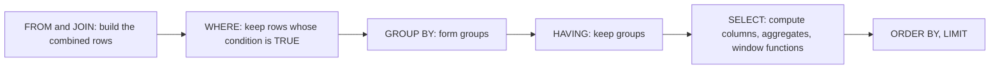

---
aliases:
  - Structured Query Language
  - SELECT
  - JOIN
  - Window Function
  - Langage SQL
tags:
  - type/concept
  - domain/computer-science
  - domain/bioinformatics
  - level/L1
  - level/L2
  - level/L3
mastery: 0
prerequisites:
  - "[[Relational Database]]"
  - "[[Set]]"
  - "[[Predicate Logic]]"
related:
  - "[[Relational Algebra]]"
  - "[[Database Index]]"
  - "[[Query Processing]]"
  - "[[Embedded Database]]"
  - "[[Data Frame]]"
  - "[[Split-Apply-Combine]]"
  - "[[Tidy Data]]"
  - "[[Count Normalization]]"
  - "[[Genomic Interval Arithmetic]]"
  - "[[Genomic Coordinate System]]"
  - "[[Database Transaction]]"
  - "[[Unix Text Processing]]"
projects:
  - "[[09-genome-browser]]"
  - "[[10-genomic-pipeline]]"
sources:
  - "[[CMU 15-445 - Database Systems]]"
  - "[[Codd 1970 - A Relational Model of Data for Large Shared Data Banks]]"
  - "[[Python Documentation]]"
  - "[[Python for Data Analysis (McKinney)]]"
---

# SQL

> [!abstract]
> SQL is the declarative language of relational databases: a query says which rows and columns you want (filter, join, group, rank) and the database decides how to compute them; mastering it means mastering joins, grouping, NULLs and window functions, the four places where queries return plausible but wrong answers.

## Definition

**SQL** (Structured Query Language) is the query language of [[Relational Database|relational database systems]]. It is **declarative**: a `SELECT` statement describes the result (which tables, which rows, which columns, how grouped and ordered), not the algorithm, which the system's optimizer chooses ([[Query Processing]]).[^cmu] It descends from the "universal data sublanguage" that Codd proposed with the relational model.[^codd] Beyond `SELECT ... FROM ... WHERE`, modern SQL provides joins, aggregation with `GROUP BY` and `HAVING`, nested queries, common table expressions (`WITH`) and **window functions**, which compute over a set of related rows without collapsing them.[^cmu2] Python reaches SQLite through the standard `sqlite3` module, passing values as parameters rather than pasting them into the SQL text.[^sqlite3]

## Why it matters

- **Joining metadata to measurements.** "Mean count of each gene per condition" needs samples, genes and counts together: one query with two joins and a `GROUP BY` ([[10-genomic-pipeline]]).
- **Per-sample normalization in place.** Counts per million divide each count by its sample's total, a window function over the sample's rows ([[Count Normalization]]).
- **Region queries.** "Which variants fall in which genes" is an interval-overlap join on chromosome and coordinates, which [[09-genome-browser]] runs against its annotation database ([[Genomic Interval Arithmetic]]).
- **Same ideas everywhere.** pandas `merge` and `groupby` are database-style joins and group operations in another syntax,[^mckinney] and SQLite, used throughout this note, runs inside the Python process without a server ([[Embedded Database]], [[Data Frame]], [[Split-Apply-Combine]]).

## Core (L1)

A model of what a query means, clause by clause (the optimizer may compute it differently, but the result must be the same):



This order explains common errors: `WHERE` runs before grouping, so it cannot test an aggregate (use `HAVING`), and window functions see the rows that survived `WHERE` and `GROUP BY`.

**The toy database** (all values invented): the samples, genes and counts of [[Relational Database]], built in memory with SQLite 3.45.1 from Python 3.11. One count (`S3`, `g4`) is NULL and sample `S4` has no measurements.

```python
import sqlite3

con = sqlite3.connect(":memory:")
con.executescript("""
CREATE TABLE sample (sample_id TEXT PRIMARY KEY, condition TEXT NOT NULL, tissue TEXT);
CREATE TABLE gene (gene_id TEXT PRIMARY KEY, symbol TEXT NOT NULL, chrom TEXT NOT NULL,
                   start INTEGER NOT NULL, end INTEGER NOT NULL);           -- 0-based, half-open
CREATE TABLE measurement (sample_id TEXT REFERENCES sample, gene_id TEXT REFERENCES gene,
                          count INTEGER, PRIMARY KEY (sample_id, gene_id));
INSERT INTO sample VALUES ('S1', 'control', 'leaf'), ('S2', 'control', 'leaf'),
                          ('S3', 'heat', 'leaf'), ('S4', 'heat', NULL);
INSERT INTO gene VALUES ('g1', 'alpha', 'chr1', 100, 900), ('g2', 'beta', 'chr1', 1500, 4000),
                        ('g3', 'gamma', 'chr2', 50, 700), ('g4', 'delta', 'chr2', 2000, 2600);
INSERT INTO measurement VALUES
  ('S1', 'g1', 120), ('S1', 'g2', 30), ('S1', 'g3', 0), ('S1', 'g4', 50),
  ('S2', 'g1', 100), ('S2', 'g2', 45), ('S2', 'g3', 2), ('S2', 'g4', 53),
  ('S3', 'g1', 400), ('S3', 'g2', 10), ('S3', 'g3', 1), ('S3', 'g4', NULL);
""")                                                             # all values invented


def show(sql: str, params=()) -> None:
    cur = con.execute(sql, params)
    print([d[0] for d in cur.description])
    for row in cur:
        print(row)
```

**Select, filter, sort.** Expressions can compute new columns; `AS` names them:

```python
show("""SELECT gene_id, symbol, end - start AS length
        FROM gene
        WHERE chrom = 'chr1' OR end - start < 650
        ORDER BY length DESC""")
print(con.execute("SELECT condition FROM sample ORDER BY condition").fetchall(),
      con.execute("SELECT DISTINCT condition FROM sample ORDER BY condition").fetchall())
```

```text
['gene_id', 'symbol', 'length']
('g2', 'beta', 2500)
('g1', 'alpha', 800)
('g4', 'delta', 600)
[('control',), ('control',), ('heat',), ('heat',)] [('control',), ('heat',)]
```

Unlike a relation, a query result may contain duplicate rows (it is a bag, or multiset); `DISTINCT` removes them.

**Join.** `JOIN ... ON` pairs rows whose keys match; each measurement finds its sample and its gene:

```python
show("""SELECT s.sample_id, s.condition, g.symbol, m.count
        FROM measurement AS m
        JOIN sample AS s ON s.sample_id = m.sample_id
        JOIN gene   AS g ON g.gene_id   = m.gene_id
        WHERE g.symbol IN ('alpha', 'delta')
        ORDER BY g.symbol, s.sample_id""")
```

```text
['sample_id', 'condition', 'symbol', 'count']
('S1', 'control', 'alpha', 120)
('S2', 'control', 'alpha', 100)
('S3', 'heat', 'alpha', 400)
('S1', 'control', 'delta', 50)
('S2', 'control', 'delta', 53)
('S3', 'heat', 'delta', None)
```

**Group and aggregate.** `GROUP BY` collapses each group to one row; aggregates (`count`, `sum`, `avg`, `min`, `max`) summarize it; `HAVING` filters groups:

```python
show("""SELECT s.condition, g.symbol,
               count(*) AS n_rows, count(m.count) AS n_values,
               sum(m.count) AS total, round(avg(m.count), 1) AS mean
        FROM measurement m
        JOIN sample s USING (sample_id)
        JOIN gene g USING (gene_id)
        GROUP BY s.condition, g.symbol
        HAVING sum(m.count) > 40
        ORDER BY s.condition, g.symbol""")
```

```text
['condition', 'symbol', 'n_rows', 'n_values', 'total', 'mean']
('control', 'alpha', 2, 2, 220, 110.0)
('control', 'beta', 2, 2, 75, 37.5)
('control', 'delta', 2, 2, 103, 51.5)
('heat', 'alpha', 1, 1, 400, 400.0)
```

`heat`/`delta` has one row with a NULL count, so its sum is NULL and `HAVING sum(...) > 40` is not TRUE: the group disappears. `count(*)` counts rows, `count(m.count)` counts non-NULL values. Putting the aggregate in `WHERE` instead fails (`misuse of aggregate: sum()` in SQLite), as the evaluation order predicts.

## Deeper (L2)

**NULL means unknown.** Comparisons with NULL yield NULL (unknown), not FALSE, and `WHERE` keeps only rows whose condition is TRUE. Test with `IS NULL`:

```python
print(con.execute("SELECT NULL = NULL, NULL IS NULL, 1 IN (1, NULL), 2 IN (1, NULL), 2 NOT IN (1, NULL)").fetchone())
print([con.execute(f"SELECT count(*) FROM measurement WHERE {cond}").fetchone()[0]
       for cond in ("count = 50", "count <> 50", "count IS NULL")])
```

```text
(None, 1, 1, None, None)
[1, 10, 1]
```

`count = 50` and `count <> 50` together cover 11 of the 12 rows: the NULL row satisfies neither. `2 NOT IN (1, NULL)` is unknown, a trap for anti-joins (Exercise 2).

**Outer joins and anti-joins.** An inner join drops rows without a partner; `LEFT JOIN` keeps every row of the left table and fills the right side with NULL. Samples without any measurement are found by an anti-join, here with `NOT EXISTS`:

```python
show("""SELECT s.sample_id, count(m.gene_id) AS n_measured
        FROM sample s LEFT JOIN measurement m ON m.sample_id = s.sample_id
        GROUP BY s.sample_id ORDER BY s.sample_id""")
show("""SELECT sample_id FROM sample s
        WHERE NOT EXISTS (SELECT 1 FROM measurement m WHERE m.sample_id = s.sample_id)""")
```

```text
['sample_id', 'n_measured']
('S1', 4)
('S2', 4)
('S3', 4)
('S4', 0)
['sample_id']
('S4',)
```

**Subqueries.** A subquery in parentheses is a value (scalar), a set (`IN`, `EXISTS`) or a table. A **correlated** subquery refers to the outer row and is evaluated per row, conceptually:

```python
show("""SELECT gene_id, sum(count) AS total FROM measurement
        GROUP BY gene_id
        HAVING sum(count) > 3 * (SELECT avg(count) FROM measurement)""")
show("""SELECT m.sample_id, m.gene_id, m.count FROM measurement m
        WHERE m.count = (SELECT max(m2.count) FROM measurement m2
                         WHERE m2.sample_id = m.sample_id)       -- correlated
        ORDER BY m.sample_id""")
```

```text
['gene_id', 'total']
('g1', 620)
['sample_id', 'gene_id', 'count']
('S1', 'g1', 120)
('S2', 'g1', 100)
('S3', 'g1', 400)
```

**Never paste values into SQL.** Building a query with string formatting lets the data rewrite the query (SQL injection); placeholders pass values separately.[^sqlite3] A sample name typed by a user, or a free-text note with an apostrophe, is enough:

```python
typed = "x' OR '1'='1"                                           # hostile input
print(con.execute(f"SELECT count(*) FROM sample WHERE sample_id = '{typed}'").fetchone(),
      con.execute("SELECT count(*) FROM sample WHERE sample_id = ?", (typed,)).fetchone())
```

```text
(4,) (0,)
```

The formatted query matched every sample; the parameterized one looked for a sample with that literal name and found none.

## Advanced (L3)

**Window functions.** `f(...) OVER (PARTITION BY p ORDER BY o)` computes, for every row, a value over the rows of its partition (optionally up to the current row in the given order), and keeps all rows.[^cmu2] Counts per million (CPM) and a rank of genes within each sample:

```python
show("""SELECT sample_id, gene_id, count,
               round(1e6 * count / sum(count) OVER (PARTITION BY sample_id)) AS cpm,
               rank() OVER (PARTITION BY sample_id ORDER BY count DESC) AS rnk
        FROM measurement
        WHERE count IS NOT NULL
        ORDER BY sample_id, rnk""")
```

```text
['sample_id', 'gene_id', 'count', 'cpm', 'rnk']
('S1', 'g1', 120, 600000.0, 1)
('S1', 'g4', 50, 250000.0, 2)
('S1', 'g2', 30, 150000.0, 3)
('S1', 'g3', 0, 0.0, 4)
('S2', 'g1', 100, 500000.0, 1)
('S2', 'g4', 53, 265000.0, 2)
('S2', 'g2', 45, 225000.0, 3)
('S2', 'g3', 2, 10000.0, 4)
('S3', 'g1', 400, 973236.0, 1)
('S3', 'g2', 10, 24331.0, 2)
('S3', 'g3', 1, 2433.0, 3)
```

`1e6 * count` forces real division (in SQLite, integer / integer truncates). With an `ORDER BY` inside `OVER`, an aggregate becomes a running total, and `lag` reads the previous row: cumulative gene length and the gap to the previous gene on each chromosome. Compare the row counts of a `GROUP BY` and a window over the same partition:

```python
show("""SELECT gene_id, chrom, start, end,
               sum(end - start) OVER (PARTITION BY chrom ORDER BY start) AS cumulative_bp,
               start - lag(end) OVER (PARTITION BY chrom ORDER BY start) AS gap
        FROM gene ORDER BY chrom, start""")
print(con.execute("SELECT count(*) FROM (SELECT sample_id, sum(count) FROM measurement GROUP BY sample_id)").fetchone(),
      con.execute("SELECT count(*) FROM (SELECT sample_id, sum(count) OVER (PARTITION BY sample_id) FROM measurement)").fetchone())
```

```text
['gene_id', 'chrom', 'start', 'end', 'cumulative_bp', 'gap']
('g1', 'chr1', 100, 900, 800, None)
('g2', 'chr1', 1500, 4000, 3300, 600)
('g3', 'chr2', 50, 700, 650, None)
('g4', 'chr2', 2000, 2600, 1250, 1300)
(3,) (12,)
```

**Interval joins and indexes.** With 0-based half-open gene intervals ([[Genomic Coordinate System]]), a variant at 0-based position $x$ lies in a gene iff $\text{start} \le x < \text{end}$. The join condition is a range, not an equality, and the query plan shows whether an index can be used ([[Database Index]], [[Query Processing]]):

```python
con.execute("CREATE TABLE variant (var_id TEXT PRIMARY KEY, chrom TEXT, pos0 INTEGER)")
con.executemany("INSERT INTO variant VALUES (?, ?, ?)",
                [("v1", "chr1", 99), ("v2", "chr1", 100), ("v3", "chr1", 899),
                 ("v4", "chr1", 900), ("v5", "chr2", 2100)])      # invented, 0-based positions
show("""SELECT v.var_id, v.pos0, g.gene_id
        FROM variant v LEFT JOIN gene g
          ON g.chrom = v.chrom AND g.start <= v.pos0 AND v.pos0 < g.end
        ORDER BY v.var_id""")
q = "SELECT gene_id FROM gene WHERE chrom = ? AND start < ? AND end > ?"
print([r[3] for r in con.execute("EXPLAIN QUERY PLAN " + q, ("chr1", 1000, 500))])
con.execute("CREATE INDEX gene_chrom_start ON gene (chrom, start)")
print([r[3] for r in con.execute("EXPLAIN QUERY PLAN " + q, ("chr1", 1000, 500))])
```

```text
['var_id', 'pos0', 'gene_id']
('v1', 99, None)
('v2', 100, 'g1')
('v3', 899, 'g1')
('v4', 900, None)
('v5', 2100, 'g4')
['SCAN gene']
['SEARCH gene USING INDEX gene_chrom_start (chrom=? AND start<?)']
```

The index narrows the search to one chromosome and to genes starting before the query end, but the condition `end > ?` is still checked row by row: a B-tree orders one coordinate, while overlap involves two. Genome-scale overlap queries therefore use binning schemes or interval structures ([[Interval Tree]], [[Genomic File Indexing]]).

## Mathematical representation

- **Select-project-join.** `SELECT L FROM R, S WHERE P` denotes $\pi_L(\sigma_P(R \times S))$: Cartesian product, selection by predicate $P$, projection on the list $L$ ([[Relational Algebra]]), evaluated on bags: without `DISTINCT`, duplicates keep their multiplicity.
- **Join size.** For an equi-join on key value $k$, with $n_R(k)$ and $n_S(k)$ the numbers of rows carrying $k$ in each table, $|R \bowtie S| = \sum_k n_R(k)\, n_S(k)$. If $k$ is a key of $S$ ($n_S(k) \le 1$), the join never multiplies rows of $R$; otherwise sums over $R$'s columns are inflated (Exercise 3).
- **Grouping.** $\gamma_{G;\, a = f(x)}(R)$ partitions $R$ by the values of $G$ and returns one tuple $(g, f(\{t[x] : t[G] = g\}))$ per group.
- **Window.** For each row $t$, $w(t) = f(\{\!\{ s[x] : s \in R,\ s[P] = t[P],\ s \preceq_O t \}\!\})$, where $P$ is the partition, $\preceq_O$ the window order (all rows of the partition if no `ORDER BY`), and $\{\!\{\cdot\}\!\}$ a multiset; the output has $|R|$ rows, against one per group for $\gamma$.
- **Three-valued logic.** Truth values $\{T, F, U\}$ with $\neg U = U$, $T \wedge U = U$, $F \wedge U = F$, $T \vee U = T$, $F \vee U = U$; comparisons with NULL give $U$, and `WHERE` keeps rows evaluating to $T$ only ([[Predicate Logic]] has only $T$ and $F$).

## Computational representation

| SQL | pandas | Python standard library |
|---|---|---|
| `WHERE` | boolean mask `df[df.x > 0]` | comprehension with `if` |
| `JOIN ... ON` | `df.merge(other, on=...)` | dict lookup on the key |
| `GROUP BY` + aggregate | `df.groupby(g).agg(...)` | `collections.defaultdict` |
| window `OVER (PARTITION BY p)` | `df.groupby(p)[x].transform(...)` | two passes: totals, then rows |
| `ORDER BY` | `sort_values` | `sorted(key=...)` |

From Python: `sqlite3.connect` (a file path, or `":memory:"`), `execute` with `?` placeholders, `executemany` for bulk inserts, `cursor.description` for column names.[^sqlite3] Query results load into a data frame with `pandas.read_sql`.[^mck6]

## Worked example

> [!example] Top gene per sample with a common table expression
> Question: for each sample, which gene has the highest count?
> 1. **Rank inside each sample**: `row_number() OVER (PARTITION BY sample_id ORDER BY count DESC)` numbers each sample's rows from 1 by decreasing count.
> 2. **Name the intermediate result** with `WITH ranked AS (...)`, then keep `rn = 1`:
> ```python
> show("""WITH ranked AS (
>             SELECT sample_id, gene_id, count,
>                    row_number() OVER (PARTITION BY sample_id ORDER BY count DESC) AS rn
>             FROM measurement)
>         SELECT sample_id, gene_id, count FROM ranked WHERE rn = 1 ORDER BY sample_id""")
> ```
> ```text
> ['sample_id', 'gene_id', 'count']
> ('S1', 'g1', 120)
> ('S2', 'g1', 100)
> ('S3', 'g1', 400)
> ```
> 3. **Why not `WHERE row_number() ... = 1` directly?** Window functions are computed in the `SELECT` step, after `WHERE`; the CTE (or a subquery) makes their result filterable.
> 4. **Ties**: `row_number` picks one row arbitrarily among equal counts; `rank` would keep all tied genes. Choose deliberately.
> 5. **Sample `S4`** has no measurements, so it is absent: start from `sample LEFT JOIN measurement` if every sample must appear.

## Common misconceptions

> [!warning] "`WHERE count <> 50` returns every other row"
> Rows with a NULL count are neither equal nor unequal to 50; they need `OR count IS NULL`. The same logic makes `NOT IN` over a list containing NULL return nothing.

> [!warning] "A join only adds columns"
> It multiplies rows when the key is not unique on one side: a gene with two aliases doubles that gene's counts in any later sum (Exercise 3). Check uniqueness of join keys, or aggregate before joining.

> [!warning] "GROUP BY and window functions do the same thing"
> `GROUP BY` returns one row per group (3 rows for 3 samples above); a window keeps every row (12) and attaches the group-level value to each. Use a window to normalize rows by their group total.

> [!warning] "String formatting is fine for internal scripts"
> Values with quotes break the query, and crafted values change its meaning (the injection above returned all 4 samples). Use placeholders always.[^sqlite3]

## Exercises

> [!question] Exercise 1 (L1)
> Write a query returning each gene symbol with its total count over all samples, keeping only genes with a total of at least 100, largest first.

> [!success]- Solution
> ```python
> show("""SELECT g.symbol, sum(m.count) AS total
>         FROM gene g JOIN measurement m USING (gene_id)
>         GROUP BY g.gene_id HAVING sum(m.count) >= 100 ORDER BY total DESC""")
> ```
> ```text
> ['symbol', 'total']
> ('alpha', 620)
> ('delta', 103)
> ```
> `sum` ignores the NULL count of `delta` in `S3`: its total is $50 + 53 = 103$, computed over two samples only. Report `count(m.count)` alongside when missing values are possible.

> [!question] Exercise 2 (L2)
> `SELECT sample_id FROM sample WHERE sample_id NOT IN (SELECT sample_id FROM measurement)` returns `S4`. What does it return if the subquery's result contains a NULL, and how do you write a robust anti-join?

> [!success]- Solution
> ```python
> print(con.execute("SELECT sample_id FROM sample WHERE sample_id NOT IN (SELECT sample_id FROM measurement)").fetchall(),
>       con.execute("""SELECT sample_id FROM sample
>                      WHERE sample_id NOT IN (SELECT sample_id FROM measurement UNION SELECT NULL)""").fetchall())
> ```
> ```text
> [('S4',)] []
> ```
> `'S4' NOT IN (..., NULL)` is unknown, never TRUE, so no row survives. `NOT EXISTS` with a correlated subquery (Deeper) or `LEFT JOIN ... WHERE m.sample_id IS NULL` are not affected by NULLs.

> [!question] Exercise 3 (L2, Python)
> Add a table `alias(gene_id, alias)` in which `g1` has two aliases. Compare the total count of `g1` computed directly and through a join with `alias`, and explain with the join-size formula.

> [!success]- Solution
> ```python
> con.execute("CREATE TABLE alias (gene_id TEXT REFERENCES gene, alias TEXT)")
> con.executemany("INSERT INTO alias VALUES (?, ?)", [("g1", "alp"), ("g1", "ALPH"), ("g2", "bet")])   # invented
> print(con.execute("SELECT sum(count) FROM measurement WHERE gene_id = 'g1'").fetchone(),
>       con.execute("SELECT sum(m.count) FROM measurement m JOIN alias a USING (gene_id) WHERE m.gene_id = 'g1'").fetchone(),
>       con.execute("SELECT count(*) FROM alias GROUP BY gene_id HAVING count(*) > 1").fetchall())
> ```
> ```text
> (620,) (1240,) [(2,)]
> ```
> $n_{\text{alias}}(g1) = 2$, so each of the 3 measurements of `g1` appears twice: $|R \bowtie S| = 3 \times 2 = 6$ rows and the sum doubles. The last query is the check to run before joining: which keys are duplicated on the side you expected to be unique.

> [!question] Exercise 4 (L3)
> Rank genes within each condition by their mean count, in one query, combining `GROUP BY` with a window function. Where does the gene with only a NULL value end up, and why?

> [!success]- Solution
> ```python
> show("""SELECT s.condition, m.gene_id, round(avg(m.count), 1) AS mean,
>                rank() OVER (PARTITION BY s.condition ORDER BY avg(m.count) DESC) AS rnk
>         FROM measurement m JOIN sample s USING (sample_id)
>         GROUP BY s.condition, m.gene_id
>         ORDER BY s.condition, rnk""")
> ```
> ```text
> ['condition', 'gene_id', 'mean', 'rnk']
> ('control', 'g1', 110.0, 1)
> ('control', 'g4', 51.5, 2)
> ('control', 'g2', 37.5, 3)
> ('control', 'g3', 1.0, 4)
> ('heat', 'g1', 400.0, 1)
> ('heat', 'g2', 10.0, 2)
> ('heat', 'g3', 1.0, 3)
> ('heat', 'g4', None, 4)
> ```
> The window is evaluated after grouping, so it ranks the groups. `heat`/`g4` has a NULL mean (no value), and SQLite sorts NULLs as smaller than any value, hence last in descending order (observed here). Make the treatment explicit (`ORDER BY avg(m.count) IS NULL, avg(m.count) DESC`) rather than relying on an engine default.

> [!question] Exercise 5 (L3)
> In the interval join, explain why `v1` (position 99) and `v4` (position 900) match no gene while `v2` (100) and `v3` (899) match `g1` = $[100, 900)$. Rewrite the join condition for genes stored 1-based and closed, as in GFF.

> [!success]- Solution
> Half-open $[100, 900)$ contains $100 \le x < 900$: 99 is before, 900 is the first base after the gene. For 1-based closed coordinates $[s_1, e_1]$ and a 1-based position $p$, the condition is `g.start <= v.pos AND v.pos <= g.end`; mixing a 0-based variant position with 1-based genes shifts every boundary by one ([[Genomic Coordinate System]], [[GFF Format]]).

## Mastery checklist

- [ ] 1 Recognized: I can read and write `SELECT`, `WHERE`, `JOIN`, `GROUP BY`, `HAVING` and `ORDER BY`, and state the logical order of the clauses.
- [ ] 2 Understood: I can explain NULL's three-valued logic, inner versus outer joins, join fan-out, and grouping versus windows.
- [ ] 3 Practiced: I can write anti-joins, correlated subqueries, CTEs and window functions (CPM, rank, running totals) in SQLite from Python with placeholders.
- [ ] 4 Applied: [[10-genomic-pipeline]] joins sample metadata to counts in SQL, and [[09-genome-browser]] answers region queries with an indexed interval join.
- [ ] 5 Explained: I can teach the algebra behind a query, predict result sizes, read a query plan, and explain why overlap queries need more than a B-tree.

## References

[^cmu]: [[CMU 15-445 - Database Systems]], lecture 1 on the relational model: relational algebra versus declarative queries; course topics on query execution and optimization.
[^cmu2]: [[CMU 15-445 - Database Systems]], lecture 2 "Modern SQL" (slide deck `02-modernsql` of recent editions): aggregates and `GROUP BY`, nested queries, window functions, common table expressions, lateral joins.
[^codd]: [[Codd 1970 - A Relational Model of Data for Large Shared Data Banks]], *Communications of the ACM* 13(6):377-387: the universal data sublanguage proposed with the relational model.
[^sqlite3]: [[Python Documentation]], 3.13, Library Reference, `sqlite3`: placeholders (`?`) to bind values and the warning that assembling queries with string operations is vulnerable to SQL injection; `execute`, `executemany`, `Cursor.description`.
[^mck6]: [[Python for Data Analysis (McKinney)]], 3rd ed. (2022), ch. 6 "Data Loading, Storage, and File Formats": interacting with databases from Python (`sqlite3`, SQLAlchemy) and loading query results with `pandas.read_sql`.
[^mckinney]: [[Python for Data Analysis (McKinney)]], 3rd ed. (2022): database-style joins with `merge` and group operations with `groupby`; chapter numbers not verified for these passages.
