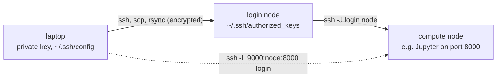

---
aliases:
  - SSH
  - OpenSSH
  - SSH Key
  - Secure Shell Protocol
  - Shell sécurisé
tags:
  - type/concept
  - domain/computer-science
  - domain/bioinformatics
  - level/L1
  - level/L2
mastery: 0
prerequisites:
  - "[[Unix Shell]]"
  - "[[File System]]"
  - "[[Process (Computing)]]"
related:
  - "[[High-Performance Computing]]"
  - "[[Job Scheduler]]"
  - "[[Data Integrity]]"
  - "[[Hash Function]]"
  - "[[Cloud Computing]]"
projects:
  - "[[10-genomic-pipeline]]"
sources:
  - "[[MIT - The Missing Semester of Your CS Education]]"
  - "[[HPC Carpentry - Introduction to High-Performance Computing]]"
  - "[[Bioinformatics Data Skills (Buffalo)]]"
  - "[[GNU Coreutils Manual]]"
  - "[[Python Documentation]]"
---

# Secure Shell

> [!abstract]
> SSH gives you an encrypted shell on a remote machine, authenticated by a key pair whose private half never leaves your computer; `scp` and `rsync` move data over it, and checksums prove that what arrived is what was sent.

## Definition

**Secure Shell (SSH)** is a protocol and a set of programs for logging into a remote machine and running commands on it over an encrypted connection.[^ms20cle][^hpcconnect] With **key-based authentication**, the user holds a key pair: the private key stays on the client, protected by a passphrase, and the public key is appended to `~/.ssh/authorized_keys` on the server.[^ms20cle] `scp` copies files over SSH; `rsync` synchronizes files and directories, skipping those that have not changed and able to resume an interrupted copy.[^ms20cle][^hpctransfer]

## Why it matters

- Clusters, cloud machines and sequencing-facility servers are reached by SSH, and raw data arrive and results leave through `scp` or `rsync` ([[High-Performance Computing]], [[Cloud Computing]]).[^hpcconnect][^hpctransfer][^buffalo]
- Multi-terabyte transfers get interrupted and files get corrupted: resumable transfers and checksum verification are part of [[Data Integrity]].[^buffalo]

## Core (L1)

The transcripts ran against a local test server standing in for a cluster login node (host name `vm`); keys, names and files are invented.



**Keys.** `ssh-keygen -t ed25519 -C alice@laptop -f keys/id_ed25519` creates a key pair (here with `-N` to pass the passphrase non-interactively; normally, type it at the prompt): the private key with mode 600, the public key `.pub` with 644. An agent (`ssh-agent`) holds the unlocked key for a session, and `ssh-copy-id` installs the public key on a server where you can still log in by password.[^ms20cle] The client refuses a private key that others can read ([[File System]] permissions): with a key of mode 644, `ssh -i keys/loose_key nokey true` printed `WARNING: UNPROTECTED PRIVATE KEY FILE!`, `Permissions 0644 for 'keys/loose_key' are too open.` and `This private key will be ignored.`, then failed with status 255; after `chmod 600 keys/loose_key` it logged in.

**Configuration.** `~/.ssh/config` gives each server an alias, so that `ssh cluster`, `scp` and `rsync` use the right user, key and options; `ssh -G cluster` prints the settings actually applied (here `user alice`, `hostname login.cluster.example.org`, `port 22`).[^ms20cle]

```text
Host cluster
    HostName login.cluster.example.org
    User alice
    IdentityFile ~/.ssh/id_ed25519
    ServerAliveInterval 60
```

**Remote commands.** `ssh host 'command'` runs a command remotely and returns its output and exit status. The local shell expands double-quoted text *before* sending it; single quotes leave expansion to the remote shell:

```console
$ ssh cluster 'hostname; nproc'
vm
4
$ X=local; ssh cluster "echo double quotes: X=${X:-unset}"; ssh cluster 'echo single quotes: X=${X:-unset}'
double quotes: X=local
single quotes: X=unset
```

Output streams back: `ssh cluster "zcat $R/reads.fq.gz" | awk 'END {print NR / 4, "reads"}'` counted `4 reads` locally from a remote file ([[Unix Shell]]).

**Transfers.** `scp file cluster:dir/` copies a file. `rsync` compares source and destination and sends only what differs; with `--partial`, an interrupted transfer keeps what it already received:[^hpctransfer][^ms20cle]

```console
$ rsync -ai --partial run1/ cluster:"$R"/run1/; echo "--- second run:"; rsync -ai --partial run1/ cluster:"$R"/run1/
created directory $L/remote_final/run1
cd+++++++++ ./
<f+++++++++ a.fq.gz
<f+++++++++ b.fa.gz
--- second run:
```

`-i` itemizes changes (`<f+++++++++`: a new file sent); the second run sent nothing. A trailing slash on the source means "the contents of": `rsync -a run1 dest1/` created `dest1/run1/a.fq.gz`, whereas `rsync -a run1/ dest2/` created `dest2/a.fq.gz`.

## Deeper (L2)

**rsync's quick check is not verification.** By default `rsync` considers a file unchanged when its size and modification time match.[^hpctransfer] A file corrupted in place without changing either is skipped silently; `rsync -c` compares the contents' checksums instead, at the cost of reading every file on both sides. A checksum **manifest** written at the source (`sha256sum *.gz > SHA256SUMS`) and checked at the destination (`sha256sum -c SHA256SUMS`) is the independent proof; data providers publish MD5 or SHA checksums for the same purpose.[^cumd5][^buffalo] The Worked example shows all three.

**Tunnels and jump hosts.** `ssh -L 9000:127.0.0.1:8000 cluster` forwards local port 9000 to port 8000 on the server: the usual way to open a Jupyter notebook or a web application running remotely.[^ms20cle] With a web server on the remote port 8000, `ssh -f -N -M -S tunnel.sock -L 9000:127.0.0.1:8000 cluster` opened the tunnel in the background, `curl http://127.0.0.1:9000/run1/SHA256SUMS` got HTTP 200, and `ssh -S tunnel.sock -O exit cluster` closed it. When compute nodes are reachable only through a gateway, `ssh -J gateway node` hops through it (`ssh -J cluster cluster 'echo reached through the jump host'` printed that line).

## Mathematical representation

A checksum is a [[Hash Function]] $h$ from byte strings to fixed-length digests ($\{0,1\}^{256}$ for SHA-256), and a copy is accepted when $h(\text{source}) = h(\text{copy})$. If corruption changed the digest like a random draw, an ideal $b$-bit hash would miss it with probability $2^{-b}$, negligible for $b = 128$ (MD5) or $256$; deliberate tampering is a different threat model ([[Hash Function]]).

## Computational representation

Python computes the same digest as `sha256sum`, reading the file in chunks; on `run1/a.fq.gz` the two digests were equal.[^pydoc]

```python
import hashlib
from pathlib import Path

def sha256_file(path) -> str:
    with open(path, "rb") as fh:
        return hashlib.file_digest(fh, "sha256").hexdigest()   # reads in chunks

run = Path("run1")
```

## Worked example

> [!example] Transfer a sequencing run and prove it arrived intact (invented files)
> 1. Write a manifest at the source, transfer, verify at the destination:
>
> ```console
> $ (cd run1 && sha256sum *.gz > SHA256SUMS)
> rsync -a run1/ cluster:"$R"/run1/
> ssh cluster "cd $R/run1 && sha256sum -c SHA256SUMS"
> a.fq.gz: OK
> b.fa.gz: OK
> ```
>
> 2. Corrupt one byte of the remote `a.fq.gz` while keeping its size and modification time, then try again:
>
> ```console
> $ ssh cluster "cd $R/run1 && cp -p a.fq.gz ../a.ref && printf N | dd of=a.fq.gz bs=1 seek=20 conv=notrunc status=none && touch -r ../a.ref a.fq.gz"
> rsync -ai run1/ cluster:"$R"/run1/; echo "quick check: nothing sent"
> ssh cluster "cd $R/run1 && sha256sum -c SHA256SUMS"; echo "exit=$?"
> rsync -aic run1/ cluster:"$R"/run1/
> ssh cluster "cd $R/run1 && sha256sum --quiet -c SHA256SUMS && echo all OK"
> quick check: nothing sent
> a.fq.gz: FAILED
> b.fa.gz: OK
> sha256sum: WARNING: 1 computed checksum did NOT match
> exit=1
> <fc........ a.fq.gz
> all OK
> ```
>
> 3. The quick check skipped the damaged file; the manifest caught it (exit 1); `rsync -c` (`<fc`: content differs) resent it; the second check passed. Keep `SHA256SUMS` with the data so that every later copy can be checked.

## Common misconceptions

> [!warning] "rsync finished, so the files are identical"
> By default it compared sizes and modification times only. Verify with a checksum manifest.

> [!warning] "Quotes do not matter in `ssh host "..."`"
> Double-quoted variables are expanded locally before the command leaves; use single quotes for the server's variables.

## Exercises

> [!question] Exercise 1 (L1)
> `ssh cluster 'exit 3'; echo $?` prints 3, and `ssh -o Port=2999 cluster true; echo $?` prints `Connection refused`, then 255. How should a pipeline script use this?

> [!success]- Solution
> `ssh` returns the remote command's status, or 255 when SSH itself failed (network, authentication, host key). 255: retry or alert, the analysis never ran. Any other nonzero status: the remote command failed, inspect its log ([[Process (Computing)]]).

> [!question] Exercise 2 (L2)
> Plan the transfer of a 2 TB sequencing delivery from a provider's server to cluster scratch, over an unreliable link, ending with proof of integrity.

> [!success]- Solution
> Run `rsync -a --partial` inside `tmux` on the cluster side ([[Process (Computing)]]), so a dropped connection is resumed by rerunning the same command, which skips completed files. Verify with the provider's published checksums (`md5sum -c` or `sha256sum -c` on their manifest), not with rsync's size and time check; if no manifest is provided, `rsync -c` in a final pass compares contents. Then make the raw files read-only and copy them, with the manifest, from scratch to backed-up storage ([[File System]]).

> [!question] Exercise 3 (L2, Python)
> Using `sha256_file` and `run` above, write `failed_files(manifest)` returning the files of a `sha256sum`-style manifest whose digest no longer matches; test it on a copy of `run1` with one bit flipped in `a.fq.gz`.

> [!success]- Solution
> ```python
> import shutil
>
> def failed_files(manifest: Path) -> list[str]:
>     bad = []
>     for line in manifest.read_text(encoding="utf-8").splitlines():
>         digest, name = line.split(maxsplit=1)
>         if sha256_file(manifest.parent / name.lstrip("*")) != digest:   # "*" marks binary mode
>             bad.append(name)
>     return bad
>
> print(failed_files(run / "SHA256SUMS"))                     # []
> copy = Path("run1_copy")
> shutil.copytree(run, copy, dirs_exist_ok=True)
> data = bytearray((copy / "a.fq.gz").read_bytes())
> data[20] ^= 1                                               # flip one bit
> (copy / "a.fq.gz").write_bytes(bytes(data))
> print(failed_files(copy / "SHA256SUMS"))                    # ['a.fq.gz']
> ```
>
> One flipped bit changes the digest completely, so the damaged file is reported and the intact one is not.

## Mastery checklist

- [ ] 1 Recognized: I can say what SSH, a key pair, `scp` and `rsync` are for.
- [ ] 2 Understood: I can explain key authentication, why private keys must be mode 600, local versus remote expansion, and rsync's quick check.
- [ ] 3 Practiced: I set up keys and an SSH config, transfer directories with `rsync --partial`, and verify them with a manifest.
- [ ] 4 Applied: I moved real sequencing data to a cluster for [[10-genomic-pipeline]] and verified it against the provider's checksums.
- [ ] 5 Explained: I can teach tunnels, jump hosts, exit status 255, and why a transfer is not done until its checksums match.

## References

[^ms20cle]: [[MIT - The Missing Semester of Your CS Education]], earlier (2020) edition, lecture "Command-line Environment" (remote machines: SSH keys, configuration, copying files, port forwarding).
[^hpcconnect]: [[HPC Carpentry - Introduction to High-Performance Computing]], episode "Connecting to a remote HPC system".
[^hpctransfer]: [[HPC Carpentry - Introduction to High-Performance Computing]], episode "Transferring files with remote computers" (`scp`; `rsync` compares modification times and sizes, resumes interrupted transfers).
[^buffalo]: [[Bioinformatics Data Skills (Buffalo)]], working on remote machines, transferring data and checking it with checksums.
[^cumd5]: [[GNU Coreutils Manual]], "md5sum invocation" (`--check`; `sha256sum` works the same way).
[^pydoc]: [[Python Documentation]], `hashlib` module.
