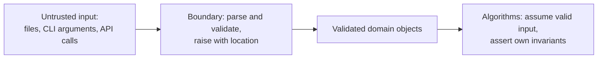

---
aliases:
  - Input Validation
  - Fail Fast
  - Assertion
  - Programmation défensive
tags:
  - type/concept
  - domain/computer-science
  - domain/bioinformatics
  - level/L1
  - level/L2
mastery: 0
prerequisites:
  - "[[Python Programming]]"
  - "[[Unit Testing]]"
related:
  - "[[Value Object]]"
  - "[[Static Analysis]]"
  - "[[Command-Line Interface]]"
  - "[[IUPAC Nucleotide Code]]"
  - "[[BED Format]]"
projects:
  - "[[01-dna-engine]]"
  - "[[bio-core]]"
  - "[[10-genomic-pipeline]]"
sources:
  - "[[Wilson 2014 - Best Practices for Scientific Computing]]"
  - "[[Python Documentation]]"
  - "[[Cornish-Bowden 1985 - Nomenclature for Incompletely Specified Bases in Nucleic Acid Sequences]]"
  - "[[GA4GH hts-specs]]"
  - "[[Research Software Engineering with Python (Irving)]]"
---

# Defensive Programming

> [!abstract]
> Defensive programming means checking inputs where they enter the program and stopping at once with a clear error when they are invalid, so that bad data can never turn into a plausible-looking result.

## Definition

**Defensive programming** is writing code that states its assumptions about inputs, state and outputs and checks them, raising an explicit error as soon as one is violated instead of continuing ("fail fast"). Two tools serve two purposes. **Exceptions** reject invalid input from outside: `ValueError` is the built-in exception for an argument of the right type but an inappropriate value.[^exc] **Assertions** check the program's own invariants: when one fails, the program halts at the cause, which simplifies debugging, and the assertion documents the invariant in executable form.[^wilson14] Assertions are not input validation: Python generates no code for `assert` when optimization is requested (`python -O`).[^assert]

## Why it matters

A crash costs an hour; a wrong number that looks right can cost a paper. Typical silent failures:

| Input mistake | Lenient code returns | Defensive code says |
|---|---|---|
| A protein, `MKVLAAGG`, given to a GC function | 0.25, a believable GC content | invalid character `'L'` at position 4 |
| An all-`N` contig | GC = 0.0 | GC content undefined |
| RNA (`U`) in a DNA file | `U` silently counted as non-GC | invalid `'U'`, with record and line |
| A BED interval with start > end | a negative length | invalid interval |

The first row is real output of the code below. Ambiguity codes and lowercase letters, by contrast, are legitimate in sequence files and must be accepted ([[IUPAC Nucleotide Code]]).[^iupac]

## Core (L1)

### Validate at the boundary, trust inside



Check once, where data enters (the parser, the [[Command-Line Interface]], the public functions of a library), and represent validated data by objects that cannot be invalid ([[Value Object]]). Inner algorithms then need no repeated checks, which matches the Lab's layered design ([[Layered Architecture]]). A useful error message says what is wrong, where (record, line, position), which value, and what was expected; `KeyError: 'U'` raised deep inside a function says none of it.[^irving]

### The code

`SequenceError` subclasses `ValueError`, so callers can catch either.[^exc] Toy version of [[01-dna-engine]]:

```python
from collections.abc import Iterable

IUPAC_DNA = frozenset("ACGTRYSWKMBDHVN")


class SequenceError(ValueError):
    """Invalid biological sequence data."""


def validate_dna(seq: str, where: str = "sequence") -> str:
    """Return seq in uppercase, or raise SequenceError locating the first invalid character."""
    upper = seq.upper()
    for i, base in enumerate(upper):
        if base not in IUPAC_DNA:
            raise SequenceError(f"{where}: invalid character {seq[i]!r} at position {i + 1}"
                                " (expected IUPAC DNA codes)")
    return upper


def gc_content(seq: str, where: str = "sequence") -> float:
    """GC fraction among A, C, G, T; raises SequenceError if undefined or invalid."""
    s = validate_dna(seq, where)
    n = sum(s.count(b) for b in "ACGT")
    if n == 0:
        raise SequenceError(f"{where}: GC content undefined, no A, C, G or T in {len(s)} bases")
    gc = (s.count("G") + s.count("C")) / n
    assert 0.0 <= gc <= 1.0, gc        # internal invariant: a bug here is ours, not the user's
    return gc


def read_fasta(lines: Iterable[str]) -> dict[str, str]:
    """Parse FASTA lines; every error names the line or the record."""
    records: dict[str, str] = {}
    name = None
    for lineno, raw in enumerate(lines, start=1):
        line = raw.strip()
        if line.startswith(">"):
            if not line[1:].strip():
                raise SequenceError(f"line {lineno}: empty header")
            name = line[1:].split()[0]
            if name in records:
                raise SequenceError(f"line {lineno}: duplicate record name {name!r}")
            records[name] = ""
        elif line:
            if name is None:
                raise SequenceError(f"line {lineno}: sequence before the first header")
            records[name] += validate_dna(line, f"record {name!r}, line {lineno}")
    for name, seq in records.items():
        if not seq:
            raise SequenceError(f"record {name!r} is empty")
    return records


def gc_lenient(seq: str) -> float:
    return (seq.count("G") + seq.count("C")) / len(seq) if seq else 0.0


print("lenient:", gc_lenient("MKVLAAGG"))
try:
    gc_content("MKVLAAGG", "query")
except SequenceError as err:
    print("strict: ", err)

bad_inputs = {                                   # invented files
    "RNA in a DNA file": ">s1\nACGT\n>s2\nACGU\n",
    "empty record": ">s1\nACGT\n>s2\n",
}
for label, text in bad_inputs.items():
    try:
        read_fasta(text.splitlines())
    except SequenceError as err:
        print(f"{label:18} -> {err}")
```

```text
lenient: 0.25
strict:  query: invalid character 'L' at position 4 (expected IUPAC DNA codes)
RNA in a DNA file  -> record 's2', line 4: invalid character 'U' at position 4 (expected IUPAC DNA codes)
empty record       -> record 's2' is empty
```

Each `raise` is a branch that needs its own `pytest.raises` test ([[Unit Testing]]).

## Deeper (L2)

**Assertions versus exceptions.** `assert` guards what *you* guarantee (a fraction stays in $[0, 1]$); `raise` guards what *callers* may get wrong. Since `assert` disappears under `-O`, it must never carry input validation:[^assert] `python3 -c 'assert 1.2 <= 1.0, "gc out of range"'` stops with `AssertionError: gc out of range`, while the same line under `python3 -O` runs on silently (checked).

**Add context, keep the cause.** At a boundary, re-raise a low-level error with its location and chain the original with `raise ... from err`, which stores it in `__cause__` so both tracebacks are shown (Exercise 3).[^raise] Never write `except Exception: pass`: it turns every bug into a silent wrong result.

**Choose a policy per anomaly, and make it explicit.**

| Anomaly | Strict (default) | Lenient (opt-in) |
|---|---|---|
| Character outside the alphabet; empty record | raise | skip, count, warn at the end |
| Ambiguity codes (`N`, `R`, ...) | accept, exclude from GC | same |
| Lowercase (soft-masking) | accept; uppercasing drops the mask | keep the original if masking matters downstream |

A lenient mode must report what it skipped ("9,998 of 10,000 records processed"). Decide also what *you* return: the [[GC Content]] note returns 0.0 for an empty sequence as a convention; here an undefined value raises instead, because 0.0 is a valid GC content and therefore a plausible wrong answer.

**Coordinates are input too.** BED intervals are 0-based and half-open, so `0 <= start <= end` must hold ([[BED Format]]).[^bed] A frozen dataclass can enforce it in `__post_init__`, so that no invalid interval object ever exists.[^dataclass]

## Mathematical representation

A function is specified on a domain $D$ smaller than the set $X$ its signature accepts. For GC content, $X$ is all strings and $D = \{ s \in \mathcal{I}^* : n_{ACGT}(s) > 0 \}$, with $\mathcal{I}$ the case-folded IUPAC DNA alphabet and $n_{ACGT}(s)$ the number of unambiguous bases. Defensive code implements a total function $\hat f : X \to [0, 1] \cup \{\bot\}$ with $\hat f(s) = \bot$ (an exception) for $s \notin D$. Lenient code returns some $y \in [0, 1]$ for $s \notin D$: a **plausible wrong result**, indistinguishable by value from a correct one. The precondition $s \in D$ is checked at the boundary; the postcondition $0 \le \hat f(s) \le 1$ is asserted.

**How strong is an alphabet check?** 14 of the 20 amino-acid letters are also IUPAC nucleotide codes (only E, F, I, L, P, Q are not). In a toy model where residues are independent and uniform over the 20 letters, a protein of length $L$ passes an IUPAC check with probability $(14/20)^L$ and an ACGT-only check with $(4/20)^L$: $5.76 \times 10^{-2}$ versus $2.56 \times 10^{-6}$ for $L = 8$, $1.80 \times 10^{-8}$ versus $1.13 \times 10^{-35}$ for $L = 50$ (computed). Validation catches real-length mistakes, but a short peptide can slip through an ambiguity-tolerant check: a type declared by the caller (DNA or protein) is stronger than a guess from the letters.

## Worked example

> [!example] A sample that was not DNA
> A collaborator's FASTA of 200 contigs contains, by mistake, one peptide record. The lenient script reports GC = 0.25 for it, an ordinary value, and it ends up in a GC-bias plot. The defensive `read_fasta` stops instead: `record 'pep7', line 812: invalid character 'L' at position 4 (expected IUPAC DNA codes)` (invented name and line). The file is fixed before any analysis, with everything needed to find the line in the message.

## Common misconceptions

> [!warning] "Defensive means wrapping everything in try/except"
> The opposite: catch only what you can handle, add context, re-raise. A broad `except` that continues hides exactly the error defensive programming wants to surface.

> [!warning] "Skipping bad records makes a tool robust"
> It makes it quiet. Robust tools fail clearly by default and offer an explicit lenient mode that reports what it skipped.

## Exercises

> [!question] Exercise 1 (L1)
> Does `gc_content` above return or raise on `"acgtn"`, `"ACGU"`, `"NNNN"`, `"ACG T"`? Why?

> [!success]- Solution
> `acgtn`: 0.5 (case folded, N excluded). `ACGU`: raises, `U` is not in the DNA alphabet (RNA must be declared, not guessed). `NNNN`: raises, GC undefined. `ACG T`: raises at position 4; whitespace must be stripped by the file reader, not tolerated inside a sequence.

> [!question] Exercise 2 (L2)
> Why is `assert 0.0 <= gc <= 1.0` appropriate inside `gc_content`, while `assert set(seq) <= IUPAC_DNA` would not be?

> [!success]- Solution
> The first states a property our own arithmetic guarantees: if it fails, our code has a bug, and halting there is right. The second checks the caller's input: it would vanish under `-O` and give an uninformative error. Input checks use `raise`.

> [!question] Exercise 3 (L2, Python)
> Write a frozen dataclass `Interval(chrom, start, end)` for BED-style intervals that cannot be created when `0 <= start <= end` fails. What does `Interval("chr1", 250, 100)` do, and what should a BED parser add to that error?

> [!success]- Solution
> ```python
> from dataclasses import dataclass
>
>
> @dataclass(frozen=True)
> class Interval:
>     """0-based, half-open interval [start, end) on one chromosome."""
>     chrom: str
>     start: int
>     end: int
>
>     def __post_init__(self) -> None:
>         if not 0 <= self.start <= self.end:
>             raise ValueError(f"invalid interval {self.chrom}:{self.start}-{self.end}")
> ```
>
> `Interval("chr1", 250, 100)` raises `ValueError: invalid interval chr1:250-100`, so no invalid interval ever exists downstream. The object does not know the file position: the parser catches the error and re-raises it with the line, `raise ValueError(f"line {lineno}: bad interval {line!r}: {err}") from err`, which gave `line 2: bad interval 'chr1\t250\t100': invalid interval chr1:250-100` with the original error kept in `__cause__`.

## Mastery checklist

- [ ] 1 Recognized: I can define fail fast, precondition and postcondition, and the difference between `assert` and `raise`.
- [ ] 2 Understood: I can explain why lenient code produces plausible wrong results, with bioinformatics examples.
- [ ] 3 Practiced: I can write a validating parser whose errors name record, line and position, and test every error branch.
- [ ] 4 Applied: [[01-dna-engine]] and [[bio-core]] validate at their public boundary, with an exception hierarchy and a documented policy for ambiguity codes and lowercase.
- [ ] 5 Explained: I can teach where to validate, which policy to choose per anomaly, and the limits of alphabet checks.

## References

[^wilson14]: [[Wilson 2014 - Best Practices for Scientific Computing]], "Plan for mistakes": add assertions to check the program's operation; the program halts immediately when something goes wrong, and assertions are executable documentation.
[^exc]: [[Python Documentation]], Library Reference, "Built-in Exceptions": `ValueError` (right type, inappropriate value) and user-defined exceptions derived from built-in ones.
[^assert]: [[Python Documentation]], Language Reference, "The assert statement": no code is generated for `assert` when optimization is requested (`-O`).
[^raise]: [[Python Documentation]], Language Reference, "The raise statement": exception chaining with `from`, stored in `__cause__`.
[^dataclass]: [[Python Documentation]], Library Reference, `dataclasses`: `frozen=True` and `__post_init__`.
[^iupac]: [[Cornish-Bowden 1985 - Nomenclature for Incompletely Specified Bases in Nucleic Acid Sequences]], one-letter codes for incompletely specified bases.
[^irving]: [[Research Software Engineering with Python (Irving)]], error handling in research software (part "Trustworthy results"); chapters not verified.
[^bed]: [[GA4GH hts-specs]], `BEDv1`: BED uses 0-based, half-open coordinates.
