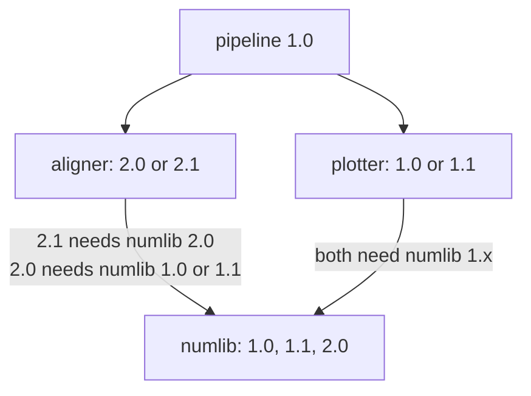

---
aliases:
  - Lock File
  - uv.lock
  - Virtual Environment
  - Dependency Pinning
  - Gestion des dépendances
tags:
  - type/concept
  - domain/computer-science
  - domain/scientific-practice
  - level/L1
  - level/L2
mastery: 0
prerequisites:
  - "[[Python Packaging]]"
  - "[[Version Control]]"
related:
  - "[[Software Environment Management]]"
  - "[[Container]]"
  - "[[Computational Reproducibility]]"
  - "[[Continuous Integration]]"
  - "[[Graph Traversal]]"
  - "[[Software Release]]"
projects:
  - "[[10-genomic-pipeline]]"
  - "[[bio-core]]"
  - "[[Bioinformatics Lab]]"
sources:
  - "[[Python Packaging User Guide]]"
  - "[[uv]]"
  - "[[Python Documentation]]"
  - "[[Sandve 2013 - Ten Simple Rules for Reproducible Computational Research]]"
---

# Dependency Management

> [!abstract]
> Dependency management declares which other packages your code needs and which versions it accepts, resolves those ranges into one exact, consistent set including the dependencies of dependencies, records it in a lock file, and installs it in an isolated environment, so that the same analysis runs with the same code next year.

## Definition

A **dependency** is a package your code imports. You declare **direct** dependencies with version constraints ("abstract" requirements: names and acceptable ranges); a **resolver** chooses one exact version of every package needed, including **transitive** dependencies (those of your dependencies); the exhaustive pinned result ("concrete" requirements) gives repeatable installations of a whole environment.[^pypug-abstract] With uv, the abstract requirements live in `pyproject.toml` and the concrete ones in **`uv.lock`**, a universal lock file with the exact resolved versions for every platform and supported Python version, meant to be committed.[^uv] They are installed into a **virtual environment**, an isolated Python environment for one project rather than system-wide.[^pypug-venv]

## Why it matters

- Archiving the exact versions of the programs used is rule 3 of Sandve et al.[^sandve] A pipeline rerun with whatever versions are current next year may give different numbers, or fail.
- A bioinformatics project pulls in far more code than it names: the one constraint `biopython>=1.84` below installs NumPy as well.
- Two analyses on one machine often need incompatible versions of the same library; one environment per project avoids the conflict.
- In the [[Bioinformatics Lab]], `uv.lock` is committed in every repository and CI installs exactly from it ([[Continuous Integration]]); [[10-genomic-pipeline]] records the lock with its outputs.

## Core (L1)

### Declaring constraints

| Specifier | Meaning | Example matches among 1.9, 2.0, 2.1, 2.1.5, 2.2, 3.0 |
|---|---|---|
| `>=2.1,<3` | at least 2.1, below 3 | 2.1, 2.1.5, 2.2 |
| `~=2.1` | compatible release: `>=2.1, ==2.*` | 2.1, 2.1.5, 2.2 |
| `~=2.1.0` | `>=2.1.0, ==2.1.*` | 2.1, 2.1.5 |
| `==2.*` | any 2.x | 2.0, 2.1, 2.1.5, 2.2 |

The compatible-release rule is from the version-specifier specification;[^pypug-spec] the match column was computed with the `packaging` library's `SpecifierSet`. A library ([[bio-core]]) declares **ranges**, as wide as it is tested for, so that it can be installed next to other libraries; exact pins in a library's metadata would block its users from upgrades.[^pypug-abstract] An application or pipeline **locks** exact versions.

### Resolving and locking with uv

Real session (uv 0.8.17, a toy application `gc-report`):

```text
$ uv add "biopython>=1.84"
Resolved 3 packages in 590ms
 + biopython==1.88
 + numpy==2.5.3
$ uv tree
gc-report v0.1.0
└── biopython v1.88
    └── numpy v2.5.3
```

(Interpreter, download and progress lines omitted.) `pyproject.toml` now says only `dependencies = ["biopython>=1.84"]`; `uv.lock` holds the decision. Its `numpy` entry starts:

```toml
name = "numpy"
version = "2.5.3"
source = { registry = "https://pypi.org/simple" }
```

followed by the source archive and 54 wheel files (CPython 3.13 to 3.15, macOS, Linux and Windows), each with its `sha256` hash, so every machine installs the same version and can verify the bytes. The lock is created and updated by `uv lock`, `uv sync` and `uv run`, and is not edited by hand.[^uv] When `pyproject.toml` changes without relocking, a check fails:

```text
$ uv lock --check
Resolved 3 packages in 3.89s
The lockfile at `uv.lock` needs to be updated, but `--locked` was provided. To update the lockfile, run `uv lock`.
```

CI runs `uv sync --locked` (or `uv lock --check`) so that a stale lock fails the build instead of being silently re-resolved.

### Virtual environments

uv creates the project environment in `.venv/` (never committed: it is rebuilt from the lock). Inside it, `sys.prefix` differs from `sys.base_prefix`, the interpreter it was created from:[^venv]

```text
$ uv run python -c "import sys; print(sys.prefix != sys.base_prefix)"
True
$ python3.13 -c "import sys; print(sys.prefix != sys.base_prefix)"
False
```

## Deeper (L2)



**Resolution is a search.** Each candidate version brings its own constraints, so choosing a newer version of one package can make the whole set unsatisfiable. In the toy index of the diagram (code below), the newest `aligner` needs `numlib 2.0`, which every `plotter` refuses: the resolver must backtrack to the older `aligner 2.0`. Real resolvers add heuristics, caching and good error messages, but face the same structure.

**Updating is a decision.** A lock freezes everything, including security fixes. Upgrade deliberately (`uv lock --upgrade-package numpy`), rerun the tests, and commit the new lock with a message; the diff of `uv.lock` documents what changed ([[Software Release]]).

**Python is not the whole stack.** A virtual environment isolates Python packages, not the interpreter's system libraries or command-line tools such as samtools. Those need conda or Bioconda environments ([[Software Environment Management]]) or a container image ([[Container]]); the Python lock file is one layer of [[Computational Reproducibility]].

## Mathematical representation

Let $\mathcal{P}$ be the set of packages, $V_p$ the available versions of $p$, and for each candidate $(p, v)$ a set of constraints $\{(q, A) : A \subseteq V_q\}$. A **resolution** for a root $r$ is a set $S \subseteq \mathcal{P}$ with $r \in S$ and a function $L : S \to \bigcup_p V_p$, $L(p) \in V_p$, such that for every $p \in S$ and every constraint $(q, A)$ of $(p, L(p))$: $q \in S$ and $L(q) \in A$. The lock file stores $L$ (plus hashes). The **dependency graph** has an edge $p \to q$ when $(p, L(p))$ constrains $q$; the direct dependencies are the successors of $r$, the transitive ones the vertices reachable from $r$ ([[Graph Traversal]]). The search space is $\prod_{p \in S} |V_p|$, exponential in the number of packages, which is why resolvers backtrack and prune instead of enumerating.

## Computational representation

A toy index (invented packages) and a depth-first resolver that prefers the newest version and backtracks on conflicts; `uv tree` above showed the transitive side on real packages:

```python
# Invented package index: (package, version) -> {dependency: allowed versions}
INDEX = {
    ("pipeline", "1.0"): {"aligner": {"2.0", "2.1"}, "plotter": {"1.0", "1.1"}},
    ("aligner", "2.0"): {"numlib": {"1.0", "1.1"}},
    ("aligner", "2.1"): {"numlib": {"2.0"}},
    ("plotter", "1.0"): {"numlib": {"1.0"}},
    ("plotter", "1.1"): {"numlib": {"1.0", "1.1"}},
    ("numlib", "1.0"): {},
    ("numlib", "1.1"): {},
    ("numlib", "2.0"): {},
}


def versions(pkg: str) -> list[str]:
    """Available versions of pkg, newest first."""
    found = [v for p, v in INDEX if p == pkg]
    return sorted(found, key=lambda v: tuple(map(int, v.split("."))), reverse=True)


def resolve(constraints: list[tuple[str, set[str]]],
            chosen: dict[str, str]) -> dict[str, str] | None:
    """One version per package satisfying all constraints; depth-first, newest first."""
    if any(pkg in chosen and chosen[pkg] not in ok for pkg, ok in constraints):
        return None                                    # conflict: backtrack
    open_pkgs = [pkg for pkg, _ in constraints if pkg not in chosen]
    if not open_pkgs:
        return chosen
    pkg = open_pkgs[0]
    allowed = set.intersection(*(ok for p, ok in constraints if p == pkg))
    for v in versions(pkg):
        if v in allowed:
            print(f"try {pkg} {v}")
            deps = list(INDEX[(pkg, v)].items())
            result = resolve(constraints + deps, {**chosen, pkg: v})
            if result is not None:
                return result
    return None


print(resolve([("pipeline", {"1.0"})], {}))
```

```text
try pipeline 1.0
try aligner 2.1
try plotter 1.1
try plotter 1.0
try aligner 2.0
try plotter 1.1
try numlib 1.1
{'pipeline': '1.0', 'aligner': '2.0', 'plotter': '1.1', 'numlib': '1.1'}
```

## Worked example

> [!example] Why the newest version was not installed
> Reading the trace: `aligner 2.1` is tried first (newest) and requires `numlib 2.0`; both `plotter` versions accept only `numlib 1.x`, so no `numlib` fits and the resolver backtracks twice. With `aligner 2.0`, `plotter 1.1` and `numlib 1.1` (the newest allowed) satisfy everything. The lock records this compromise; the user who asked for "the latest aligner" did not get it, and only a lock file says so after the fact. The same reasoning explains a real `uv add` that installs an older release than expected: some other package's upper bound forbids the newer one.

## Common misconceptions

> [!warning] "Pin exact versions in pyproject.toml to be safe"
> In an application, the lock already pins. In a library, exact pins in `dependencies` make it uninstallable next to any package that needs another version. Declare tested ranges; lock in the project that runs the analysis.

> [!warning] "requirements.txt from pip freeze is a lock file"
> It lists what one machine has installed, for one platform, usually without hashes and without the abstract constraints it came from. `uv.lock` records a resolution valid across platforms with hashes, alongside the declared ranges.

## Exercises

> [!question] Exercise 1 (L1)
> A library declares `numpy~=2.1`. Can it be installed with NumPy 2.0, 2.4 and 3.0? What would `~=2.1.0` allow?

> [!success]- Solution
> `~=2.1` means `>=2.1, ==2.*`: 2.0 no, 2.4 yes, 3.0 no. `~=2.1.0` means `>=2.1.0, ==2.1.*`: only 2.1.x releases. The table above was checked with `packaging.specifiers.SpecifierSet`.

> [!question] Exercise 2 (L2, Python)
> In the toy index, make `aligner 2.0` require `numlib {"2.0"}` too and rerun `resolve`. What happens, and what should a real tool print?

> [!success]- Solution
> The trace tries `pipeline 1.0`, `aligner 2.1`, both plotters, `aligner 2.0`, both plotters again, then prints `None`: every `aligner` needs `numlib 2.0`, every `plotter` needs `numlib 1.x`, so no resolution exists. A useful message names the conflict: "aligner (any version) requires numlib==2.0, plotter (any version) requires numlib<2". The fix is a human decision: wait for a `plotter` release, drop a dependency, or relax a constraint after testing.

> [!question] Exercise 3 (L3)
> A colleague installs your pipeline from the same `uv.lock` on another operating system, and one statistic differs in the 7th decimal. List plausible causes and how to investigate.

> [!success]- Solution
> The lock fixes versions, not binaries: compiled wheels differ per platform (other compilers, CPU instructions, linked math libraries), so floating-point results can differ in the last digits. Other causes: a different Python version or interpreter build, non-Python tools outside the lock, unseeded randomness, or input files that differ (compare checksums). Investigate by recording `uv run python -c "import sys, platform; print(sys.version, platform.platform())"` and package versions with every result, and compare with tolerances rather than exact equality ([[Numerical Testing]]); for bit-identical reruns, fix the platform too ([[Container]]).

## Mastery checklist

- [ ] 1 Recognized: I can define direct and transitive dependencies, version specifiers, lock file and virtual environment.
- [ ] 2 Understood: I can explain why libraries declare ranges while analyses lock, and why resolution may pick an older version.
- [ ] 3 Practiced: I can add, tree, lock, check and upgrade dependencies with uv, and write a small resolver.
- [ ] 4 Applied: every Lab repository commits `uv.lock`, CI installs with `--locked`, and pipeline outputs record the locked environment.
- [ ] 5 Explained: I can teach what a lock guarantees and what it does not (platform, non-Python tools, randomness).

## References

[^pypug-abstract]: [[Python Packaging User Guide]], discussion "install_requires vs requirements files": abstract requirements (names and version restrictions a project minimally needs; pinning them is overly restrictive) versus requirements files with exhaustive pinned versions for repeatable installs of a complete environment.
[^pypug-spec]: [[Python Packaging User Guide]], specification "Version specifiers": the compatible release clause `~=` (`~=3.1` means `>= 3.1, == 3.*`).
[^pypug-venv]: [[Python Packaging User Guide]], Glossary, "Virtual Environment": an isolated Python environment that allows packages to be installed for a particular application rather than system-wide.
[^uv]: [[uv]], documentation "Structure and files": `uv.lock` is universal (cross-platform), holds the exact resolved versions, should be checked into version control, is managed by uv, and is created or updated by `uv lock`, `uv sync` and `uv run`; the project environment lives in `.venv`. Outputs above from uv 0.8.17.
[^sandve]: [[Sandve 2013 - Ten Simple Rules for Reproducible Computational Research]], rule 3 (archive the exact versions of all external programs used).
[^venv]: [[Python Documentation]], Library Reference, `venv`: inside a virtual environment, `sys.prefix` points to the environment while `sys.base_prefix` points to the base Python installation.
