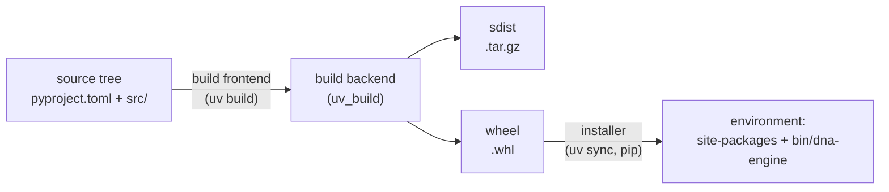

---
aliases:
  - Python Package
  - pyproject.toml
  - src Layout
  - Wheel
  - Empaquetage Python
tags:
  - type/concept
  - domain/computer-science
  - level/L1
  - level/L2
mastery: 0
prerequisites:
  - "[[Python Programming]]"
  - "[[Command-Line Interface]]"
  - "[[Unit Testing]]"
related:
  - "[[Dependency Management]]"
  - "[[Software Release]]"
  - "[[Software Environment Management]]"
  - "[[Software Documentation]]"
  - "[[Computational Notebook]]"
projects:
  - "[[Bioinformatics Lab]]"
  - "[[01-dna-engine]]"
  - "[[bio-core]]"
sources:
  - "[[Python Packaging User Guide]]"
  - "[[uv]]"
  - "[[Python Documentation]]"
  - "[[Research Software Engineering with Python (Irving)]]"
---

# Python Packaging

> [!abstract]
> Packaging turns a folder of Python files into an installable, versioned unit: a `src/` tree described by `pyproject.toml`, built by a build backend into a wheel, installed into an environment where `import dna_engine` and the `dna-engine` command both work.

## Definition

An **import package** is a directory of modules imported under one name (`import dna_engine`); a **distribution package** is the versioned archive that installs it (`dna-engine 0.1.0`), either a source distribution (sdist) or a built **wheel**.[^pypug-glossary] A project declares itself in **`pyproject.toml`**: the `[build-system]` table names the **build backend** that turns the source tree into distributions and the packages needed to run it; the `[project]` table holds the metadata (name, version, Python requirement, dependencies); `[project.scripts]` declares commands, which are console-scripts **entry points**.[^pypug-toml] uv creates, builds and runs such projects.[^uv][^irving]

## Why it matters

- Tests must exercise the code users will install, not loose files that happen to sit in the working directory ([[Unit Testing]]).
- A notebook or a pipeline imports the tested package instead of copying functions between files ([[Computational Notebook]]).
- A [[Command-Line Interface]] becomes a command (`dna-engine gc reads.fa`) usable from shell scripts and workflow managers, and a version number and metadata make a result citable to a release ([[Software Release]]); the [[Bioinformatics Lab]] libraries ([[bio-core]]) are consumed by every project as packages, never by copying code.

## Core (L1)

### The Lab layout

```text
01-dna-engine/
├── pyproject.toml        metadata, build backend, entry points, tool configuration
├── uv.lock               exact versions of every dependency (Dependency Management)
├── README.md             Lab README sections (Software Documentation)
├── src/dna_engine/       the import package
│   ├── __init__.py
│   ├── cli.py            main(): the dna-engine command
│   ├── fasta.py
│   └── sequence.py
└── tests/                test_*.py and tests/data/tiny.fa
```

In the **flat layout** the import package sits at the repository root; the **src layout** moves it into `src/`. The src layout prevents accidental use of the in-development copy: the project must be installed (in editable mode during development) before its code can be imported.[^pypug-src] The reason is the import path: when Python runs `python -c ...` or a script, it puts the current directory (or the script's directory) first on `sys.path`, so a root-level `dna_engine/` would be imported directly, bypassing what the wheel actually contains.[^syspath]

### `pyproject.toml`

`uv init --package --python 3.13 dna-engine` (uv 0.8.17) generated the skeleton; after editing the description, author and entry point, and adding the development tools with `uv add --dev pytest ruff mypy`:

```toml
[project]
name = "dna-engine"
version = "0.1.0"
description = "Validate, measure and transform DNA sequences"
readme = "README.md"
authors = [{ name = "Lab Student", email = "student@example.org" }]
requires-python = ">=3.13"
dependencies = []

[project.scripts]
dna-engine = "dna_engine.cli:main"

[build-system]
requires = ["uv_build>=0.8.17,<0.9.0"]
build-backend = "uv_build"

[dependency-groups]
dev = [
    "mypy>=2.4.0",
    "pytest>=9.1.1",
    "ruff>=0.16.10",
]
```

The distribution name uses a hyphen, the import name an underscore. `dependencies` lists what users need at run time (none: the Lab implements the core by hand); the `dev` group holds tools only developers need. Other build backends (setuptools, hatchling, flit-core, pdm-backend) are declared the same way.[^pypug-toml]

### Running it

Real session in the project directory:

```text
$ uv run dna-engine gc tests/data/tiny.fa
s1	0.667
s2	0.500
$ python3.13 -c "import dna_engine"
ModuleNotFoundError: No module named 'dna_engine'
$ uv run python -c "import dna_engine, pathlib; print(pathlib.Path(dna_engine.__file__).relative_to(pathlib.Path.cwd()))"
src/dna_engine/__init__.py
$ uv build
Building source distribution (uv build backend)...
Building wheel from source distribution (uv build backend)...
Successfully built dist/dna_engine-0.1.0.tar.gz
Successfully built dist/dna_engine-0.1.0-py3-none-any.whl
```

The system interpreter cannot import the package (src layout: nothing is installed there); inside the project environment, the editable install points to `src/`, so edits take effect without reinstalling.[^uv]

## Deeper (L2)



**Frontend and backend.** The tool you run (uv, pip, `build`) is a frontend; it installs the packages listed in `[build-system] requires` and asks the named backend for distributions.[^pypug-toml] Because this interface and the `[project]` table are standards, a project is not tied to the tool that created it; only `[tool.*]` tables are tool-specific.

**What an entry point becomes.** At installation, the installer writes a small launcher into the environment's `bin/`. The one uv wrote for `dna-engine` contains `from dna_engine.cli import main` and `sys.exit(main())`, so an integer returned by `main` becomes the command's exit status ([[Command-Line Interface]]).

**One version, one place.** The version lives in `pyproject.toml`; code reads it from the installed metadata with `importlib.metadata.version("dna-engine")` rather than duplicating it.[^metadata]

## Computational representation

A pure-Python wheel is a zip archive: the import package plus a `.dist-info` directory of metadata. The standard library can open it, and can read the installed metadata:

```python
import zipfile
from importlib.metadata import entry_points, version

wheel = "dist/dna_engine-0.1.0-py3-none-any.whl"
with zipfile.ZipFile(wheel) as zf:
    for name in sorted(zf.namelist()):
        print(name)
    metadata = zf.read("dna_engine-0.1.0.dist-info/METADATA").decode()
    print([line for line in metadata.splitlines()
           if line.startswith(("Name:", "Version:", "Requires-Python:"))])
    print(zf.read("dna_engine-0.1.0.dist-info/entry_points.txt").decode().strip())

print(version("dna-engine"))
(script,) = entry_points(group="console_scripts", name="dna-engine")
print(script.value)
```

Output (run with `uv run python`):

```text
dna_engine-0.1.0.dist-info/
dna_engine-0.1.0.dist-info/METADATA
dna_engine-0.1.0.dist-info/RECORD
dna_engine-0.1.0.dist-info/WHEEL
dna_engine-0.1.0.dist-info/entry_points.txt
dna_engine/
dna_engine/__init__.py
dna_engine/cli.py
dna_engine/fasta.py
dna_engine/sequence.py
['Name: dna-engine', 'Version: 0.1.0', 'Requires-Python: >=3.13']
[console_scripts]
dna-engine = dna_engine.cli:main
0.1.0
dna_engine.cli:main
```

Nothing is compiled, and `tests/` is not shipped: the wheel carries only the import package and its metadata.

## Worked example

> [!example] From a notebook function to a command
> 1. `gc_content` lives in a notebook cell and has been copied into two other notebooks, already diverging ([[Computational Notebook]]).
> 2. `uv init --package --python 3.13 dna-engine` creates `pyproject.toml`, `src/dna_engine/__init__.py`, a README and `.python-version`; uv 0.8.17 chose `uv_build` as backend.
> 3. Move the function to `src/dna_engine/sequence.py`, its tests to `tests/test_sequence.py`, write `cli.py` with `main()`, and declare `dna-engine = "dna_engine.cli:main"` under `[project.scripts]`.
> 4. `uv run pytest` and `uv run dna-engine gc tests/data/tiny.fa` (outputs above). The notebooks now start with `from dna_engine.sequence import gc_content`: one implementation, tested, versioned.

## Common misconceptions

> [!warning] "Running the file directly is the same as running the command"
> `python3.13 src/dna_engine/cli.py gc tests/data/tiny.fa` fails with `ModuleNotFoundError: No module named 'dna_engine'`: the script's own directory, not `src/`, goes first on `sys.path`. Install the package and use the entry point (`uv run dna-engine ...`).[^syspath]

> [!warning] "If the tests pass, the package works"
> With a flat layout, tests may import the working-directory copy while the wheel misses a module or data file. The src layout, plus a check of the built wheel (Exercise 3), closes that gap.

## Exercises

> [!question] Exercise 1 (L1)
> For the project above, which name do you give to `uv add`, which to `import`, and which on the command line? Why do they differ?

> [!success]- Solution
> `uv add dna-engine` (distribution name), `import dna_engine` (import name: a hyphen is not allowed in a Python identifier), `dna-engine gc file.fa` (the key of `[project.scripts]`).

> [!question] Exercise 2 (L1)
> You add `dna-revcomp = "dna_engine.cli:revcomp_main"` to `[project.scripts]`. What must exist, and what must happen before the command works?

> [!success]- Solution
> A function `revcomp_main` in `dna_engine/cli.py`. The launcher is written at installation, so the environment must be synchronized again (`uv sync`, which `uv run` triggers) before `dna-revcomp` appears in `.venv/bin/`.

> [!question] Exercise 3 (L2, Python)
> Write `missing_from_wheel(src, wheel)` returning the `.py` files under `src/` that the built wheel does not contain.

> [!success]- Solution
> ```python
> import zipfile
> from pathlib import Path
>
>
> def missing_from_wheel(src: Path, wheel: Path) -> set[str]:
>     """Modules under src/ that the built wheel does not contain."""
>     expected = {p.relative_to(src).as_posix() for p in src.rglob("*.py")}
>     with zipfile.ZipFile(wheel) as zf:
>         shipped = {name for name in zf.namelist() if name.endswith(".py")}
>     return expected - shipped
>
>
> print(missing_from_wheel(Path("src"), Path("dist/dna_engine-0.1.0-py3-none-any.whl")))   # set()
> ```
>
> Paths under `src/` (`dna_engine/cli.py`) match the paths inside the wheel because the wheel root corresponds to `src/`. An empty set means every module ships; run it in CI after `uv build`.

## Mastery checklist

- [ ] 1 Recognized: I can name import package, distribution package, wheel, build backend and entry point.
- [ ] 2 Understood: I can explain why the src layout forces tests to use the installed code, and what each `pyproject.toml` table is for.
- [ ] 3 Practiced: I can create a uv package with a console command, build its sdist and wheel, and inspect the wheel.
- [ ] 4 Applied: every Lab project and [[bio-core]] is an installable src-layout package used through imports and entry points, never by copying files.
- [ ] 5 Explained: I can teach how a source tree becomes an installed command, and which parts are standards and which are tool-specific.

## References

[^pypug-glossary]: [[Python Packaging User Guide]], Glossary: import package, distribution package, source distribution, wheel.
[^pypug-toml]: [[Python Packaging User Guide]], guide "Writing your pyproject.toml": the `[build-system]` table (build backend and its requirements, examples for setuptools, hatchling, flit-core, pdm-backend, uv_build), the `[project]` table, and `[project.scripts]` as console-scripts entry points.
[^pypug-src]: [[Python Packaging User Guide]], discussion "src layout vs flat layout".
[^uv]: [[uv]], documentation: project structure and files, `uv init`, `uv run`, `uv sync`, `uv build`. Outputs above from uv 0.8.17.
[^irving]: [[Research Software Engineering with Python (Irving)]], packaging Python code (part "Publishing"); chapters not verified.
[^syspath]: [[Python Documentation]], Library Reference, `sys.path`: the directory of the script, or the current directory for `python -c`, is prepended to the module search path.
[^metadata]: [[Python Documentation]], Library Reference, `importlib.metadata`: `version()` and `entry_points()` read the metadata of installed distributions.
