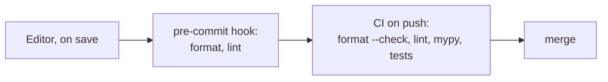

---
aliases:
  - Linting
  - Static Type Checking
  - Ruff
  - mypy
  - Analyse statique
tags:
  - type/concept
  - domain/computer-science
  - level/L1
mastery: 0
prerequisites:
  - "[[Python Programming]]"
  - "[[Type Hint]]"
related:
  - "[[Unit Testing]]"
  - "[[Continuous Integration]]"
  - "[[Defensive Programming]]"
  - "[[Version Control]]"
projects:
  - "[[Bioinformatics Lab]]"
  - "[[01-dna-engine]]"
sources:
  - "[[MIT - The Missing Semester of Your CS Education]]"
  - "[[Python Documentation]]"
---

# Static Analysis

> [!abstract]
> Static analysis checks code without running it: a formatter fixes its layout, a linter flags suspicious patterns, and a type checker verifies that values match their annotations, so whole classes of bugs are caught before the code touches data.

## Definition

**Static analysis** examines source code without executing it. In Python practice it has three layers: an **auto-formatter** rewrites the surface syntax to one canonical layout; a **linter** reports patterns that are likely errors; a **type checker** verifies that the [[Type Hint|type annotations]] are consistent. Ruff is a Python linter and formatter, and projects commonly run such tools in pre-commit hooks and in continuous integration.[^missing-cq] The Python runtime does not enforce annotations; third-party tools such as type checkers use them.[^typing]

## Why it matters

- A pipeline step that dies after three hours on an attribute of `None` is a bug a type checker reports in a second.
- One canonical layout keeps diffs to real changes, so review sees the scientific edit, not reformatting noise ([[Version Control]]). The [[Bioinformatics Lab]] runs Ruff and mypy in every repository and in [[Continuous Integration]].

## Core (L1)

| Tool | Question | Lab command (CI variant) |
|---|---|---|
| Formatter | Is the layout canonical? | `uv run ruff format .` (`--check`) |
| Linter | Unused imports, undefined names, risky idioms? | `uv run ruff check .` |
| Type checker | Do argument, return and attribute types agree? | `uv run mypy src` |

Configuration lives in `pyproject.toml` ([[Python Packaging]]):

```toml
[tool.ruff]
line-length = 100

[tool.ruff.lint]
select = ["E", "F", "B", "I", "UP"]   # pycodestyle, Pyflakes, bugbear, import order, pyupgrade

[tool.mypy]
strict = true
```

A toy module, `src/dna_engine/stats.py`, and the real reports of Ruff 0.15.8 and mypy 1.19.1:

```python
import os
from collections import Counter


def gc_content(seq: str, cache: dict[str, float] = {}) -> float:
    counts = Counter(seq.upper())
    n = sum(counts[b] for b in "ACGT")
    if n == None:
        return None
    return (counts["G"] + counts["C"]) / n


def length_of(records: dict[str, str], name: str) -> int:
    seq = records.get(name)
    return len(seq)
```

```text
$ ruff check src --output-format concise
src/dna_engine/stats.py:1:8: F401 [*] `os` imported but unused
src/dna_engine/stats.py:5:52: B006 Do not use mutable data structures for argument defaults
src/dna_engine/stats.py:8:13: E711 Comparison to `None` should be `cond is None`
Found 3 errors.
[*] 1 fixable with the `--fix` option (2 hidden fixes can be enabled with the `--unsafe-fixes` option).
$ mypy src
src/dna_engine/stats.py:9: error: Incompatible return value type (got "None", expected "float")  [return-value]
src/dna_engine/stats.py:15: error: Argument 1 to "len" has incompatible type "str | None"; expected "Sized"  [arg-type]
Found 2 errors in 1 file (checked 2 source files)
```

The tools complement each other: Ruff sees idioms, mypy sees that `dict.get` may return `None`. Neither sees the real bug: the author meant `n == 0` (an empty or all-`N` sequence); after the style fix to `n is None` the test is still never true, and `gc_content("NNNN")` raises `ZeroDivisionError`. Only a test on a hand-checked edge case finds it ([[Unit Testing]], [[Defensive Programming]]).



## Mathematical representation

Let $B$ be the set of real defects and $R$ the set of reported locations. False positives are $R \setminus B$, false negatives $B \setminus R$. A tool with many false positives gets silenced; no tool empties $B \setminus R$, because defects in scientific code are mostly about meaning (wrong denominator, wrong coordinate convention), which is not in the syntax. Static analysis shrinks $B$; tests sample it.

## Computational representation

The Ruff and mypy runs above are the practical form. Underneath, a linter parses the source into an abstract syntax tree and matches patterns on its nodes, without executing anything;[^ast] Exercise 3 builds a one-rule linter with the standard library `ast` module.

## Worked example

> [!example] Annotations are promises, not checks
> 1. `def gc_count(seq: str) -> int: return seq.count("G") + seq.count("C")` called as `gc_count(["G", "C", "A"])` returns `2`: lists also have `.count`, and the annotation is not enforced.[^typing]
> 2. mypy rejects the call before anything runs: `Argument 1 to "gc_count" has incompatible type "list[str]"; expected "str"  [arg-type]`.
> 3. On an unannotated `def gc_count(seq): return seq.count("G") + seq.count("C") + "1"`, plain `mypy` reports nothing, while `mypy --strict` reports `Function is missing a type annotation [no-untyped-def]`; the annotated version is flagged in both modes (`Unsupported operand types for + ("int" and "str")`). Hence `strict = true` in the Lab.

## Common misconceptions

> [!warning] "If Ruff and mypy pass, the code is correct"
> They pass on a GC function with a wrong denominator. Static analysis removes a class of crashes; correctness of the science comes from tests against hand-checked cases.

> [!warning] "Formatting is cosmetic, so it can wait"
> Reformatting a file later produces one huge diff that hides real changes and obscures `git blame`. Format from the first commit.

## Exercises

> [!question] Exercise 1 (L1)
> For each finding in the Ruff and mypy output above, say what can go wrong at runtime.

> [!success]- Solution
> F401: nothing, but dead imports mislead readers. B006: the default dict is created once and shared between calls, so a cache leaks state between sequences. E711: `==` can be overridden (NumPy compares elementwise), `is None` cannot. `return None` in a `float` function: a caller averaging the values gets a `TypeError` far from the cause. `len(seq)` with `seq` possibly `None`: a missing record crashes with an unclear `TypeError`.

> [!question] Exercise 2 (L1)
> Rewrite `length_of` so that mypy accepts it and a missing name raises an error naming the record.

> [!success]- Solution
> Check `if name not in records: raise KeyError(f"no record named {name!r}")`, then `return len(records[name])`. Indexing has type `str`, and `mypy --strict` accepts the function (checked).

> [!question] Exercise 3 (L2, Python)
> With `ast.parse` and `ast.walk`, write `bare_excepts(source)` returning the line numbers of bare `except:` clauses (which also catch `KeyboardInterrupt`), and test it on code with one bare and one specific handler.

> [!success]- Solution
> ```python
> import ast
>
> def bare_excepts(source: str) -> list[int]:
>     return [node.lineno for node in ast.walk(ast.parse(source))
>             if isinstance(node, ast.ExceptHandler) and node.type is None]
>
> code = "try:\n    x = 1 / 0\nexcept:\n    x = 0\ntry:\n    y = int('a')\nexcept ValueError:\n    y = 0\n"
> print(bare_excepts(code))   # [3]
> ```
>
> An `ExceptHandler` node without a `type` is a bare `except:`.

## Mastery checklist

- [ ] 1 Recognized: I can say what a formatter, a linter and a type checker each do.
- [ ] 2 Understood: I can explain why annotations are not enforced at runtime and what strict mode adds.
- [ ] 3 Practiced: I can configure Ruff and mypy in `pyproject.toml` and fix every finding in a module.
- [ ] 4 Applied: every Lab repository runs format check, lint and mypy in a pre-commit hook and in CI.
- [ ] 5 Explained: I can teach which bugs static analysis catches in scientific code and which only tests catch.

## References

[^missing-cq]: [[MIT - The Missing Semester of Your CS Education]], 2026 lecture "Code Quality": formatters, linters (Ruff as linter and formatter for Python), pre-commit hooks, and continuous integration running formatters, linters, tests and type checks.
[^typing]: [[Python Documentation]], Library Reference, `typing`: the runtime does not enforce function and variable annotations; they can be used by third-party tools such as type checkers.
[^ast]: [[Python Documentation]], Library Reference, `ast`: parsing source into an abstract syntax tree and walking its nodes.
