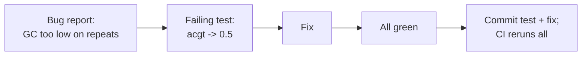

---
aliases:
  - Unit Test
  - pytest
  - Regression Test
  - Test unitaire
tags:
  - type/concept
  - domain/computer-science
  - domain/bioinformatics
  - level/L1
  - level/L2
mastery: 0
prerequisites:
  - "[[Python Programming]]"
  - "[[Functional Programming]]"
  - "[[Static Analysis]]"
related:
  - "[[Defensive Programming]]"
  - "[[Numerical Testing]]"
  - "[[Property-Based Testing]]"
  - "[[Continuous Integration]]"
  - "[[IUPAC Nucleotide Code]]"
  - "[[Pipeline Testing]]"
projects:
  - "[[01-dna-engine]]"
  - "[[02-sequence-translation]]"
  - "[[Bioinformatics Lab]]"
sources:
  - "[[Wilson 2014 - Best Practices for Scientific Computing]]"
  - "[[Research Software Engineering with Python (Irving)]]"
  - "[[pytest]]"
  - "[[Cornish-Bowden 1985 - Nomenclature for Incompletely Specified Bases in Nucleic Acid Sequences]]"
  - "[[Bioinformatics Data Skills (Buffalo)]]"
  - "[[Biopython]]"
---

# Unit Testing

> [!abstract]
> A unit test runs one small function on an input whose correct output you worked out by hand, and fails loudly if the function disagrees; a suite of them, rerun on every change, is how scientific code earns trust.

## Definition

A **unit test** is an automated check that a single unit of code (a function or a class) returns the expected result for a given input. Wilson et al. distinguish unit tests from **integration tests** (pieces work correctly together) and **regression tests** (behaviour does not change when details are modified); because the computer runs them, they are cheap to rerun after every change, and an off-the-shelf testing library beats home-made checks.[^wilson14] In Python that library is usually **pytest**: tests are plain functions using `assert`, collected and run by the `pytest` command.[^pytest][^irving]

## Why it matters

- Scientific bugs rarely crash: a GC function that ignores lowercase letters returns a plausible 0.31 instead of 0.42, and the number goes into a figure. Only a comparison with a known answer exposes it.
- Real files contain the awkward cases from day one: `N` and other IUPAC ambiguity codes,[^iupac] lowercase soft-masked repeats in genome FASTA files,[^buffalo] empty records. Each needs a decision and a test that records it ([[IUPAC Nucleotide Code]], [[FASTA Format]]).
- The [[Bioinformatics Lab]] requires tests from the first commit of [[01-dna-engine]]; [[Continuous Integration]] runs them, and they are the safety net for every later refactoring or optimization.

## Core (L1)

### Anatomy of a test

Arrange an input, act by calling the function, assert on the result. The expected value comes from **outside** the code under test: a hand calculation on a tiny input. `GGCC` has GC content 1, `ATAT` 0, `ACGT` 0.5; each takes seconds to check by eye, unlike a 10 kb sequence.

The function under test (toy version of [[01-dna-engine]], `src/dna_engine/sequence.py`), with the convention of [[GC Content]]: only A, C, G, T count, case-insensitively, and a sequence with none of them is an error ([[Defensive Programming]]).

```python
def gc_content(seq: str) -> float:
    """Fraction of G and C among the unambiguous bases A, C, G, T (case-insensitive)."""
    s = seq.upper()
    n = sum(s.count(b) for b in "ACGT")
    if n == 0:
        raise ValueError("GC content is undefined: no unambiguous base (A, C, G, T)")
    return (s.count("G") + s.count("C")) / n
```

### Parametrization and fixtures

`@pytest.mark.parametrize` runs one test function on several argument sets, each reported separately; `pytest.raises` checks that an error occurs, its `match` being a regular expression searched in the message. A **fixture** prepares an input, and a test requests it by naming it as a parameter; the built-in `tmp_path` fixture gives each test a fresh temporary directory, so tests never write into the repository or depend on each other.[^pytest] `tests/test_sequence.py`:

```python
import pytest

from dna_engine.fasta import read_fasta
from dna_engine.sequence import gc_content


@pytest.mark.parametrize(
    ("seq", "expected"),
    [
        ("GGCC", 1.0),     # all strong bases
        ("ATAT", 0.0),     # all weak bases
        ("ACGT", 0.5),
        ("acgt", 0.5),     # soft-masked (lowercase) bases count
        ("ACGTNN", 0.5),   # N is excluded from the denominator
        ("GCNRY", 1.0),    # so are the other IUPAC codes
    ],
)
def test_gc_content_hand_checked(seq: str, expected: float) -> None:
    assert gc_content(seq) == pytest.approx(expected)


@pytest.mark.parametrize("seq", ["", "NNNN"])
def test_gc_content_undefined(seq: str) -> None:
    with pytest.raises(ValueError, match="undefined"):
        gc_content(seq)


@pytest.fixture
def tiny_fasta(tmp_path):
    path = tmp_path / "tiny.fa"
    path.write_text(">s1 toy record\nACGT\nGG\n>s2\nacgtnn\n")   # invented
    return path


def test_read_fasta_joins_lines(tiny_fasta) -> None:
    assert read_fasta(tiny_fasta) == {"s1": "ACGTGG", "s2": "acgtnn"}


def test_gc_per_record(tiny_fasta) -> None:
    gc = {name: gc_content(seq) for name, seq in read_fasta(tiny_fasta).items()}
    assert gc == pytest.approx({"s1": 4 / 6, "s2": 0.5})
```

`read_fasta` is a minimal reader in `src/dna_engine/fasta.py` that joins sequence lines and keeps the first word of each header. Real run (pytest 9.1.1, Python 3.13; 4 of the 10 result lines shown, one per parametrized case):

```text
$ uv run pytest -v tests/test_sequence.py
tests/test_sequence.py::test_gc_content_hand_checked[GGCC-1.0] PASSED    [ 10%]
tests/test_sequence.py::test_gc_content_hand_checked[acgt-0.5] PASSED    [ 40%]
tests/test_sequence.py::test_gc_content_undefined[NNNN] PASSED           [ 80%]
tests/test_sequence.py::test_gc_per_record PASSED                        [100%]
============================== 10 passed in 0.03s ==============================
```

`pytest.approx` compares floats with a tolerance, a first step towards [[Numerical Testing]]: never compare a computed float with `==` against a printed value.

## Deeper (L2)

**Where expected values come from (oracles).** In order of preference: a hand calculation on a tiny input; an analytical case; an independent implementation, such as [[Biopython]] once your own exists;[^biopython] an invariant true for every input, such as $\mathrm{rc}(\mathrm{rc}(s)) = s$, checked on generated inputs by [[Property-Based Testing]]. Never paste the function's own output as the expected value: such a test freezes the bug it should catch.

**Choosing cases.** Partition the inputs into classes the function should treat alike (uppercase ACGT, lowercase, with `N`, with other IUPAC codes, empty), take one representative per class, and add the **boundaries** between classes: length 0 and 1, a sequence entirely of `N`, a k-mer length equal to the sequence length.

**Regression tests.** When a bug is found, first write the test that reproduces it and watch it fail, then fix the code; the test stays and guards against the bug's return.



Unit tests are fast (milliseconds), deterministic and independent. Running a pipeline on a 2 GB FASTQ is not a unit test: it is slow and nobody knows the right answer. Whole workflows get their own tests on small bundled datasets ([[Pipeline Testing]]).

## Mathematical representation

Let $f : X \to Y$ be the function under test and $S \subseteq X \times Y$ its specification (the correct input-output pairs). A test case $(x, y) \in S$ passes when $f(x) = y$, or $|f(x) - y| \le \varepsilon$ for floats; a suite $T \subset S$ passes when all its cases pass. Passing shows agreement with $S$ on the finite sample $T$ only: tests can reveal a bug, never prove its absence. Choosing $T$ means partitioning $X = X_1 \cup \dots \cup X_k$ into classes on which a bug, if present, should show for every member, then picking representatives and boundaries of each $X_i$.

Stacked `parametrize` decorators with $a$ and $b$ values generate the Cartesian product, $a \times b$ cases: `seq` with 3 values and `window` with 2 gave 6 collected tests in a check with `pytest --collect-only`.

## Computational representation

Lab layout: tests mirror the package (`src/dna_engine/sequence.py` → `tests/test_sequence.py`), files and functions are named `test_*` so pytest collects them, and `uv run pytest` runs them in the project environment ([[Python Packaging]]). The standard library also ships `unittest` (class-based tests) and `doctest` (examples in docstrings, [[Software Documentation]]); the Lab uses pytest for plain `assert` and fixtures.

## Worked example

> [!example] Catching a plausible wrong number
> A first version computes `(seq.count("G") + seq.count("C")) / len(seq)`. On `ACGT` it returns 0.5, so a single happy-path test passes. Against the GC tests above (real output, excerpt):
>
> ```text
> $ pytest -q --tb=line test_v0.py
> FAILED test_v0.py::test_gc_content_hand_checked[acgt-0.5] - assert 0.0 == 0.5...
> FAILED test_v0.py::test_gc_content_hand_checked[ACGTNN-0.5] - assert 0.333333...
> FAILED test_v0.py::test_gc_content_hand_checked[GCNRY-1.0] - assert 0.4 == 1....
> FAILED test_v0.py::test_gc_content_undefined[] - ZeroDivisionError: division ...
> FAILED test_v0.py::test_gc_content_undefined[NNNN] - Failed: DID NOT RAISE Va...
> 5 failed, 3 passed in 0.02s
> ```
>
> Each failure is a scientific error: soft-masked repeats count as AT (0.0 instead of 0.5), `N` dilutes the denominator (0.333 instead of 0.5), an all-`N` contig gets GC = 0 instead of an error. On a genome rich in soft-masked repeats, the first bug alone biases every window.

## Common misconceptions

> [!warning] "It ran on my real data without errors, so it is tested"
> Running is not checking. A real file has no known answer, so a wrong number passes silently. Test on tiny inputs whose answers you know.

> [!warning] "100 % line coverage means the code is correct"
> Coverage counts executed lines, not checked cases. The one-line first version above reaches full line coverage with the single case `ACGT`, yet carries three bugs that only the lowercase, `N` and empty cases reveal.

## Exercises

> [!question] Exercise 1 (L1)
> Work out by hand, with the convention above, `gc_content` of `GATTACA`, `gattaNNca` and `SSWW`.

> [!success]- Solution
> `GATTACA`: G + C = 2 among 7 unambiguous bases: 2/7 ≈ 0.2857. `gattaNNca`: 7 unambiguous bases after case folding, G + C = 2: 2/7 again. `SSWW`: S (G or C) and W (A or T) are ambiguity codes, so no unambiguous base: `ValueError`. Another convention could count S as strong; the test records the chosen one. All three checked with pytest.

> [!question] Exercise 2 (L1)
> List the cases of a parametrized test for `reverse_complement` ([[Reverse Complement]], which keeps case and IUPAC codes): the empty sequence, one base, lowercase with `N`, IUPAC codes, the EcoRI site `GAATTC`, mixed case `ACgt`. Give each expected value.

> [!success]- Solution
> `("", "")`, `("A", "T")`, `("acgN", "Ncgt")` (case and N kept), `("RYKM", "KMRY")` (R↔Y, K↔M, then reversed), `("GAATTC", "GAATTC")` (a reverse palindrome), `("ACgt", "acGT")` (complement `TGca`, reversed). Passed to `@pytest.mark.parametrize(("seq", "expected"), [...])`, all pass against a case-preserving IUPAC implementation (checked).

> [!question] Exercise 3 (L2, Python)
> Write a fixture creating a FASTA whose single record `r1` is wrapped over three lines (`AC`, `GT`, `NN`) and ends with a blank line, and a test that `read_fasta` returns `{"r1": "ACGTNN"}`.

> [!success]- Solution
> ```python
> @pytest.fixture
> def wrapped_fasta(tmp_path):
>     path = tmp_path / "wrapped.fa"
>     path.write_text(">r1 wrapped\nAC\nGT\nNN\n\n")
>     return path
>
> def test_wrapped_record(wrapped_fasta) -> None:
>     assert read_fasta(wrapped_fasta) == {"r1": "ACGTNN"}
> ```
>
> It passes: lines are stripped and joined, the blank line is skipped, the header keeps its first word.

> [!question] Exercise 4 (L3)
> Before writing a future `kmer_counts(seq, k)`, list its equivalence classes and boundary cases. Which decisions must come first?

> [!success]- Solution
> Classes: `k <= 0` (error); `k > len(seq)` (no k-mer); `k == len(seq)` (exactly one); ordinary input; lowercase input; k-mers containing `N` or other IUPAC codes; empty sequence. Boundaries: `k = 1`, `k = len(seq)`, `k = len(seq) + 1`. Decisions first: case folding, treatment of ambiguous bases, and whether a k-mer and its reverse complement are merged (canonical k-mers). Each decision becomes one documented test.

## Mastery checklist

- [ ] 1 Recognized: I can define unit, integration and regression tests and name pytest's parametrize and fixtures.
- [ ] 2 Understood: I can explain where expected values must come from and why passing tests do not prove correctness.
- [ ] 3 Practiced: I can write parametrized tests with hand-checked biological edge cases (empty, `N`, IUPAC, lowercase) and fixtures with `tmp_path`.
- [ ] 4 Applied: every public function of [[01-dna-engine]] has edge-case tests run in CI, and every fixed bug left a regression test.
- [ ] 5 Explained: I can teach how to partition inputs, choose oracles and turn a bug report into a test.

## References

[^wilson14]: [[Wilson 2014 - Best Practices for Scientific Computing]], "Plan for mistakes": use an off-the-shelf unit testing library; unit, integration and regression tests, run by the computer so they are easy to rerun.
[^pytest]: [[pytest]], documentation: "How to use fixtures" (requesting fixtures as parameters, `tmp_path`), parametrizing tests, `pytest.raises` (`match` searched with `re.search`).
[^irving]: [[Research Software Engineering with Python (Irving)]], testing research software with pytest; chapters not verified.
[^iupac]: [[Cornish-Bowden 1985 - Nomenclature for Incompletely Specified Bases in Nucleic Acid Sequences]], one-letter codes for incompletely specified bases and their complements.
[^buffalo]: [[Bioinformatics Data Skills (Buffalo)]], treatment of FASTA files (soft-masked repeats in lowercase); chapters not verified.
[^biopython]: [[Biopython]]: used in the Lab as an independent check of hand-written functions, after the concept is implemented by hand.
