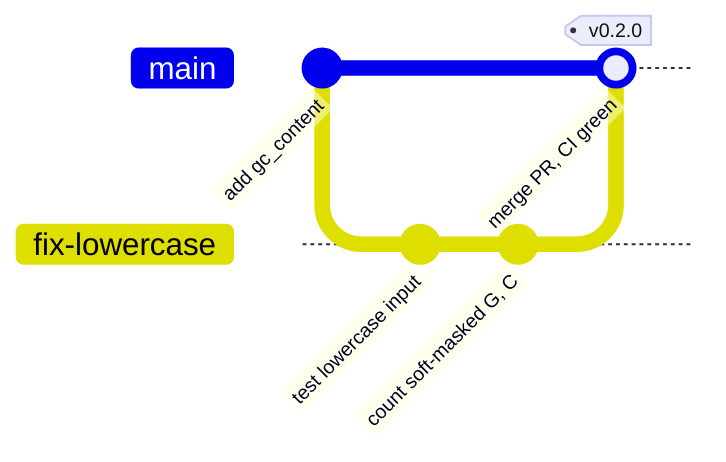

---
aliases:
  - Git
  - Version Control System
  - VCS
  - Gestion de versions
tags:
  - type/concept
  - domain/computer-science
  - domain/scientific-practice
  - level/L1
  - level/L2
mastery: 0
prerequisites:
  - "[[Unix Shell]]"
related:
  - "[[Continuous Integration]]"
  - "[[Data Provenance]]"
  - "[[Hash Function]]"
  - "[[Dependency Management]]"
projects:
  - "[[Bioinformatics Lab]]"
  - "[[10-genomic-pipeline]]"
sources:
  - "[[MIT - The Missing Semester of Your CS Education]]"
  - "[[Sandve 2013 - Ten Simple Rules for Reproducible Computational Research]]"
  - "[[Wilson 2017 - Good Enough Practices in Scientific Computing]]"
  - "[[Bioinformatics Data Skills (Buffalo)]]"
---

# Version Control

> [!abstract]
> Version control records every state of a project's code, with who changed what and why, so that any result can be traced to the exact code that produced it; the data stays outside the repository.

## Definition

A **version control system** records successive snapshots of a set of files with author, date and message, and lets people work on parallel lines of history and merge them. Git calls a file a **blob**, a directory a **tree** and a snapshot a **commit**; each commit refers to its parents, so the history is a directed acyclic graph of snapshots.[^missing]

## Why it matters

- **Provenance.** "Which code produced Figure 3?" has an answer only if the figure records a commit. Tracking how every result was produced and version-controlling every custom script are rules 1 and 4 of Sandve et al.[^sandve]
- **Data is not code.** Raw data should not change, regenerable intermediate files need no history, and version control systems are not designed for large files.[^wilson17] FASTQ and BAM files go to an archive ([[European Nucleotide Archive]]) or project storage, referenced by a download script with checksums ([[Data Provenance]]).[^buffalo]

## Core (L1)



The [[Bioinformatics Lab]] workflow: one short-lived branch per change; small commits that each leave the tests green, with an imperative message that says why; a pull request, merged after review once [[Continuous Integration]] has run tests, linters and type checks on it;[^missing-cq] tags for releases ([[Software Release]]).

| In the repository | Outside it |
|---|---|
| Code, tests, benchmark scripts, docs, README | Raw data: FASTQ, BAM, reference genomes |
| Tiny test datasets (a few KB, invented or subsampled) | Results and intermediate files a script regenerates |
| `pyproject.toml`, `uv.lock`, CI workflows ([[Dependency Management]]) | `.venv/`, caches, credentials |
| Download scripts with expected checksums | Large binaries; notebook outputs ([[Computational Notebook]]) |

Wilson et al. took GitHub's 100 MB per-file limit as a benchmark for "large", and noted that binary files such as PDFs can be stored but their changes cannot be pinpointed.[^wilson17] A `.gitignore` enforces the right-hand column; in a toy repository whose `.gitignore` lists `data/raw/`, `results/`, `*.fastq.gz`, `*.bam` and `.venv/`:

```text
$ git check-ignore -v data/raw/sample1.fastq.gz results/gc.tsv
.gitignore:2:data/raw/	data/raw/sample1.fastq.gz
.gitignore:3:results/	results/gc.tsv
```

## Deeper (L2)

**Content addressing.** Git names objects by a hash of their content ([[Hash Function]]): one changed base gives a new blob id. A commit $c = (t, P, m)$ (tree $t$, parents $P$, metadata $m$) gets $\operatorname{id}(c) = H(\operatorname{ser}(t, \{\operatorname{id}(p) : p \in P\}, m))$, with $\operatorname{ser}$ a serialization to bytes and $H$ a cryptographic hash. Since the id depends recursively on every ancestor's id (a Merkle structure), one short hash pins the code and its whole past: a sufficient provenance record for code, if the working tree was clean.

**History is permanent.** A file deleted in a later commit stays reachable from the earlier one. In the toy repository, a 5 MB random binary committed by mistake and removed in the next commit still weighs on every clone (`git count-objects -vH` after `git gc`: `size-pack: 4.77 MiB`). Purging it rewrites history and changes every later commit id, which breaks the provenance records that cite them. Prevention is cheaper: `.gitignore` and a pre-commit hook.[^missing-cq]

## Computational representation

```python
import hashlib
import subprocess


def git_blob_id(content: bytes) -> str:
    """Object id Git gives a file: SHA-1 of a 'blob <size>' header, a NUL byte, then the bytes."""
    return hashlib.sha1(b"blob %d\x00" % len(content) + content).hexdigest()


def code_version(repo: str = ".") -> str:
    """Short commit hash of HEAD, with '-dirty' if tracked files have uncommitted changes."""
    def git(*args: str) -> str:
        return subprocess.run(["git", *args], cwd=repo, capture_output=True,
                              text=True, check=True).stdout.strip()
    dirty = git("status", "--porcelain", "--untracked-files=no")
    return git("rev-parse", "--short", "HEAD") + ("-dirty" if dirty else "")


print(git_blob_id(b"ACGT\n"))   # 8a737e690f811c11b2d37b84ee977ace2e866e38
print(code_version("vc"))       # ba5d0aa (toy repository); ba5d0aa-dirty after an uncommitted edit
```

The blob id equals the output of `printf 'ACGT\n' | git hash-object --stdin`; your commit hash will differ. Write `code_version()` into the header of every result file.

## Worked example

> [!example] Tracing a number to its code
> `results/gc.tsv` starts with `# code_version=3f2c1e9` (invented hash). A reviewer asks why sample 7 changed between drafts. `git log --oneline 3f2c1e9..main -- src/` lists the code commits since then, including the merge of `fix-lowercase`; `git diff 3f2c1e9 main -- src/` shows that soft-masked (lowercase) bases were not counted before, so the GC content of the repeat-rich sample 7 was underestimated ([[GC Content]]). Had the header read `3f2c1e9-dirty`, the code behind the old number would be unknown.

## Common misconceptions

> [!warning] "Deleting the file fixed the oversized repository"
> The blob is still in history and in every clone; only a history rewrite removes it, at the cost of new commit ids.

> [!warning] "The commit hash identifies the result"
> It identifies the code, if the tree was clean. The result also depends on data, parameters and environment ([[Dependency Management]], [[Computational Reproducibility]]).

## Exercises

> [!question] Exercise 1 (L1)
> In or out? `reads_R1.fastq.gz` (2 GB), `tests/data/tiny.fa` (300 bytes), `uv.lock`, `results/gc_plot.png` (made by a script), `config/samples.tsv` (2 KB, hand-written).

> [!success]- Solution
> In: `tiny.fa` (tests need it), `uv.lock` (pins the environment), `samples.tsv` (hand-written, not regenerable). Out: the FASTQ (raw and large: archive plus checksum) and the plot (regenerated).

> [!question] Exercise 2 (L1)
> Write `.gitignore` lines that ignore every `.bam` and `.bai` file and everything in `data/` except `data/README.md`.

> [!success]- Solution
> `*.bam`, `*.bai`, `data/*`, `!data/README.md`. Write `data/*`, not `data/`: when the directory itself is ignored, Git does not look inside and `!` cannot re-include the README. Tested: with `data/*` `git status` lists `data/README.md`, with `data/` it does not.

> [!question] Exercise 3 (L2, Python)
> Compare `git_blob_id(b">s1\nACGT\n")` with the same FASTA in Windows line endings, `b">s1\r\nACGT\r\n"`. What does Git see when an editor converts line endings?

> [!success]- Solution
> `9ca6b4e79401f7d55b5099112fedcc3d0a61e01b` versus `7994d0934b2f7ff006653610ef68003ec56cc140`: different bytes, different blobs, so every line shows as changed although the sequence is identical. Agree on line endings in the repository and make parsers tolerate `\r` ([[FASTA Format]]).

## Mastery checklist

- [ ] 1 Recognized: I can name blob, tree, commit, branch and pull request, and say why raw data stays out of Git.
- [ ] 2 Understood: I can explain why a commit id pins the whole history and why a deleted large file still weighs on clones.
- [ ] 3 Practiced: I can write a `.gitignore` with correct negations and stamp results with a clean or dirty code version.
- [ ] 4 Applied: every Lab repository has a data `.gitignore`, a download script with checksums, and stamped outputs.
- [ ] 5 Explained: I can teach what to version in a bioinformatics project and what a commit hash does not guarantee.

## References

[^missing]: [[MIT - The Missing Semester of Your CS Education]], 2026 lecture "Version Control and Git": Git's data model (blobs, trees, snapshots, history as a directed acyclic graph of commits).
[^missing-cq]: [[MIT - The Missing Semester of Your CS Education]], 2026 lecture "Code Quality": pre-commit hooks; continuous integration (GitHub Actions) running formatters, linters and tests on every push.
[^sandve]: [[Sandve 2013 - Ten Simple Rules for Reproducible Computational Research]], rules 1 (keep track of how every result was produced) and 4 (version control all custom scripts).
[^wilson17]: [[Wilson 2017 - Good Enough Practices in Scientific Computing]], "What not to put under version control": raw data, regenerable intermediate files, binary files, large files (GitHub's 100 MB per-file limit in 2017 as a benchmark).
[^buffalo]: [[Bioinformatics Data Skills (Buffalo)]], project organization and Git for bioinformatics projects; chapters not verified.
