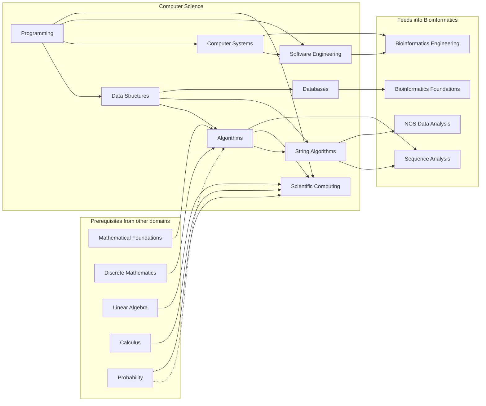

---
aliases:
  - CS
  - Informatique
tags:
  - type/moc
  - domain/computer-science
  - level/L1
  - level/L2
  - level/L3
  - level/M1
prerequisites:
  - "[[Mathematical Foundations]]"
projects:
  - "[[Bioinformatics Lab]]"
  - "[[01-dna-engine]]"
  - "[[02-sequence-translation]]"
  - "[[03-genome-diff]]"
  - "[[04-alignment-engine]]"
  - "[[05-sequence-search]]"
  - "[[07-evolution-simulator]]"
  - "[[08-phylogenetic-engine]]"
  - "[[09-genome-browser]]"
  - "[[10-genomic-pipeline]]"
  - "[[bio-algorithms]]"
  - "[[bio-core]]"
sources:
  - "[[MIT 6.006 - Introduction to Algorithms]]"
  - "[[MIT 6.046J - Design and Analysis of Algorithms]]"
  - "[[MIT 6.042J - Mathematics for Computer Science]]"
  - "[[MIT - The Missing Semester of Your CS Education]]"
  - "[[Introduction to Algorithms (Cormen)]]"
  - "[[Algorithms on Strings, Trees, and Sequences (Gusfield)]]"
  - "[[Bioinformatics Algorithms (Compeau)]]"
  - "[[Mathematics for Computer Science (Lehman)]]"
  - "[[Python for Data Analysis (McKinney)]]"
  - "[[MIT - Course 6-7 Computer Science and Molecular Biology]]"
  - "[[Carnegie Mellon University - BS Computational Biology]]"
  - "[[UC San Diego - BS Bioinformatics]]"
  - "[[Shanghai Jiao Tong University - BS Bioinformatics]]"
  - "[[Université Paris-Saclay - Licence Double Diplôme Informatique Sciences de la Vie]]"
---

# Computer Science

> [!abstract]
> The computational track of the curriculum: scientific Python, data structures and algorithms to L3, string algorithms and genome-scale indexes to the M1 frontier, numerical computing, data storage, the Unix and cluster environment, and the engineering practices that make research software correct and reproducible.

## Why it matters for bioinformatics

Bioinformatics is biology asked through algorithms on data too large to inspect. The same few ideas recur everywhere: [[Dynamic Programming]] aligns sequences, graph algorithms assemble genomes, the [[Burrows-Wheeler Transform]] and [[FM-Index]] map sequencing reads to a reference, hashing and [[Minimizer|minimizers]] make search and classification scale, numerical stability decides whether a likelihood is right, and clusters, containers and tests decide whether a result can be reproduced. The computational biology degrees verified weld a real computer science core (programming, discrete mathematics, algorithms) to the molecular biology core,[^mit67][^cmu] and place data structures and algorithms just before or alongside sequence analysis;[^ucsd] SJTU even teaches algorithms twice, in general and applied to bioinformatics.[^sjtu] The French double licence in computer science and life sciences starts Python in L1, next to a first introduction to bioinformatics.[^psisv]

## Target level and weight

- **Target**: L3, targeted; [[Algorithms]] and [[String Algorithms]] reach M1 at their frontier (see [[Curriculum]]).
- **Weight**: one of the three parallel tracks of every stage. The weight is uneven on purpose: heavy and rigorous in [[Algorithms]] and [[String Algorithms]], which underpin sequence bioinformatics; light in [[Programming]] and [[Software Engineering]], where the learner, already a professional developer, reviews generic material and studies only what is specific to scientific Python.
- **Stages** (from the [[Curriculum]]): [[Programming]], [[Data Structures]] and the first stage of [[Algorithms]] in Stage 1; the rest of [[Algorithms]], [[String Algorithms]], [[Databases]] and [[Computer Systems]] in Stage 2; [[Scientific Computing]] and [[Software Engineering]] in Stage 3. Inside each subdomain MOC, the stage headings give the level of each concept: L2 and L3 items of a Stage 1 subdomain are revisited when a later project needs them.

## Subdomains

| Subdomain | Curriculum stage | Target | Scope |
|---|---|---|---|
| [[Programming]] | 1 | L2 (L3 targeted) | Scientific Python: object model, streaming, NumPy arrays, data frames, typing, notebooks; R and C for reading |
| [[Data Structures]] | 1 | L3 | Arrays, hashing, trees, heaps, graphs, intervals; succinct and probabilistic structures |
| [[Algorithms]] | 1-2 | L3, M1 | Analysis, divide and conquer, greedy, dynamic programming, graphs, NP-hardness, approximation and heuristics |
| [[String Algorithms]] | 2 | L3, M1 | Exact and approximate matching, suffix trees and arrays, BWT and FM-index, hashing, minimizers, sketches |
| [[Scientific Computing]] | 3 | L3, M1 | Floating point, stability, vectorization, numerical linear algebra, random numbers and Monte Carlo, integration, stiff ODE solvers, profiling |
| [[Databases]] | 2 | L3 | Relational databases and SQL, schema design, indexing, columnar and array storage (Parquet, HDF5, Zarr), graph and linked data |
| [[Computer Systems]] | 2 | L3 | Unix shell, processes, memory, parallelism, containers, clusters and schedulers, cloud |
| [[Software Engineering]] | 3 (practiced from Stage 1) | L2 (L3 targeted) | Packaging with uv, testing numerical code, property-based testing, benchmarking, CI, releases |

## Dependencies

## Cross-domain prerequisites

- [[Mathematical Foundations]]: [[Proof Techniques]], [[Set]], [[Function]], [[Logarithm]], before [[Algorithms]].
- [[Discrete Mathematics]]: [[Combinatorics]], [[Recurrence Relation]], [[Graph]], [[Tree (Graph Theory)]], alongside [[Algorithms]] Stage 2.[^lehman]
- [[Probability]]: [[Random Variable]], [[Expected Value]], [[Probability Distribution]], for randomized algorithms, hashing and Monte Carlo.
- [[Linear Algebra]] and [[Calculus]]: before [[Scientific Computing]].
- [[Molecular Biology]]: [[DNA]] and [[Base Pairing]], the alphabet and the two strands that [[String Algorithms]] search.

## Reference courses and books

| Resource | Kind | Role in this domain |
|---|---|---|
| [[MIT 6.006 - Introduction to Algorithms]] | Course | Core of [[Data Structures]] and [[Algorithms]] Stages 1 and 2 |
| [[MIT 6.046J - Design and Analysis of Algorithms]] | Course | [[Algorithms]] Stage 3: advanced design, intractability, approximation |
| [[MIT 6.042J - Mathematics for Computer Science]] | Course | Proofs, graphs and counting before algorithms |
| [[MIT - The Missing Semester of Your CS Education]] | Course | Shell, command-line environment, version control, debugging and profiling, packaging, for [[Computer Systems]] and [[Software Engineering]] |
| [[Introduction to Algorithms (Cormen)]] | Book | Reference for [[Data Structures]] and [[Algorithms]], and string matching[^clrs] |
| [[Algorithms on Strings, Trees, and Sequences (Gusfield)]] | Book | Reference for [[String Algorithms]][^gusfield] |
| [[Bioinformatics Algorithms (Compeau)]] | Book | Every algorithm motivated by a biological question[^compeau] |
| [[Python for Data Analysis (McKinney)]] | Book | NumPy and pandas for [[Programming]][^mckinney] |

## Lab projects

| Project | Stage | Computer science it exercises |
|---|---|---|
| [[01-dna-engine]] | 1 | [[String]], [[Big O Notation]], [[Exact Pattern Matching]], [[Unit Testing]] |
| [[02-sequence-translation]] | 1 | [[Hash Table]], [[Iterator]] |
| [[03-genome-diff]] | 2 | [[Edit Distance]], [[Longest Common Subsequence]] |
| [[04-alignment-engine]] | 2 | [[Dynamic Programming]], [[Hamming Distance]], [[Edit Distance]] |
| [[05-sequence-search]] | 2 | [[Inverted Index]], [[Hash Table]], [[Benchmarking]] |
| [[07-evolution-simulator]] | 3 | [[Random Number Generation]], [[Vectorization]] |
| [[08-phylogenetic-engine]] | 3 | [[Tree (Data Structure)]], [[Log-Space Arithmetic]] |
| [[09-genome-browser]] | 3 | [[Interval Tree]], [[Embedded Database]] |
| [[10-genomic-pipeline]] | 3 | [[Container]], [[Job Scheduler]], [[Dependency Management]] |

The shared libraries [[bio-core]] and [[bio-algorithms]] hold the domain model and the reusable algorithms.

## References

[^mit67]: [[MIT - Course 6-7 Computer Science and Molecular Biology]]: 6.100A (Python programming), 6.1200 Mathematics for Computer Science, 6.1010 Fundamentals of Programming and 6.1210 Introduction to Algorithms in the required core, next to genetics, biochemistry and cell biology.
[^cmu]: [[Carnegie Mellon University - BS Computational Biology]]: computer science core of 02-120 or 15-112, 15-122, 15-251 and an algorithms course, next to the mathematics and statistics core and the biology core.
[^ucsd]: [[UC San Diego - BS Bioinformatics]]: CSE 100 Advanced Data Structures and CSE 101 Design and Analysis of Algorithms in the same upper division as the bioinformatics sequence (BIMM 181, BIMM 182, BENG 183, CSE 185).
[^lehman]: [[Mathematics for Computer Science (Lehman)]]: proofs, then graphs and counting, as the mathematical preparation for algorithms.
[^clrs]: [[Introduction to Algorithms (Cormen)]], 4th ed.: ch. 14 "Dynamic Programming", ch. 20 "Elementary Graph Algorithms", ch. 32 "String Matching".
[^gusfield]: [[Algorithms on Strings, Trees, and Sequences (Gusfield)]]: exact matching, suffix trees, inexact matching and alignment; predates the FM-index era.
[^compeau]: [[Bioinformatics Algorithms (Compeau)]]: chapters on genome assembly (graph algorithms), sequence comparison (dynamic programming) and read mapping (suffix arrays, Burrows-Wheeler transform).
[^mckinney]: [[Python for Data Analysis (McKinney)]], 3rd ed.: NumPy, pandas and Jupyter.
[^sjtu]: [[Shanghai Jiao Tong University - BS Bioinformatics]]: "Algorithms and Data Structures" in the computer science core and "Principles of Algorithms in Bioinformatics" in the bioinformatics core.
[^psisv]: [[Université Paris-Saclay - Licence Double Diplôme Informatique Sciences de la Vie]]: Python programming and an introduction to bioinformatics are both first-year units.
