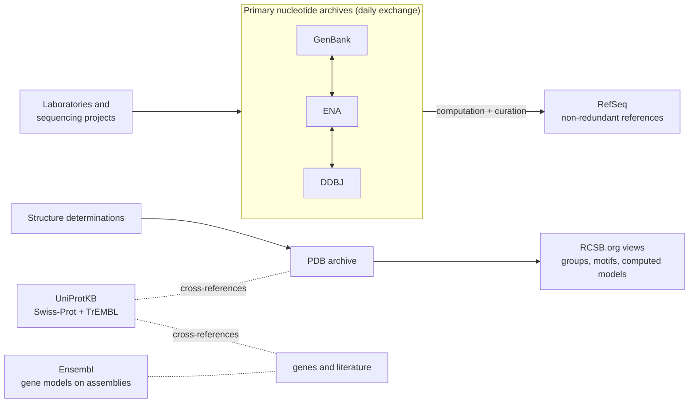

---
aliases:
  - Biological Databases
  - Primary Database
  - Secondary Database
  - Knowledge Base
  - Base de données biologique
tags:
  - type/concept
  - domain/bioinformatics
  - domain/computer-science
  - level/L1
  - level/L2
  - level/L3
mastery: 0
prerequisites:
  - "[[Omics]]"
  - "[[Gene]]"
  - "[[Protein]]"
related:
  - "[[Accession Number]]"
  - "[[FASTA Format]]"
  - "[[GenBank Format]]"
  - "[[Gene Annotation]]"
  - "[[Identifier Mapping]]"
  - "[[Programmatic Database Access]]"
  - "[[Relational Database]]"
  - "[[Metadata]]"
  - "[[FAIR Principles]]"
  - "[[Data Repository]]"
  - "[[Genome Browser]]"
projects:
  - "[[01-dna-engine]]"
  - "[[02-sequence-translation]]"
  - "[[10-genomic-pipeline]]"
  - "[[bio-core]]"
sources:
  - "[[EMBL-EBI - Introductory Bioinformatics]]"
  - "[[NCBI]]"
  - "[[NCBI GenBank]]"
  - "[[European Nucleotide Archive]]"
  - "[[NCBI RefSeq]]"
  - "[[UniProt]]"
  - "[[Ensembl]]"
  - "[[RCSB Protein Data Bank]]"
  - "[[Wilkinson 2016 - The FAIR Guiding Principles for Scientific Data Management and Stewardship]]"
---

# Biological Database

> [!abstract]
> A biological database is a public, searchable collection of records (sequences, structures, annotations), each with a stable identifier; some archive data exactly as scientists submitted it, others curate that raw material into reference knowledge.

## Definition

A **biological database** is an organized, persistent collection of biological data records, each identified by a stable [[Accession Number|accession]] and described by [[Metadata|metadata]], that people and programs can search and retrieve. Introductory bioinformatics distinguishes **primary** databases from **secondary** ones.[^ebi] In this vault:

- a **primary archive** stores data as submitted by the scientists who produced it: its records reflect what submitters provided, so redundancy and annotation quality vary ([[NCBI GenBank]]);[^genbank]
- a **curated knowledge base** (secondary database) derives reference records from primary data by computation and expert curation, for example a stable, non-redundant set of reference sequences ([[NCBI RefSeq]]).[^refseq]

## Why it matters

- Every analysis starts by fetching data and ends by citing it: the database and its release are part of the method ([[Data Provenance]]).
- The choice between archive and knowledge base changes the answer. An archive returns every submitted version of a sequence; a knowledge base returns one reviewed record, and says how much of it is curated.[^genbank][^uniprot]
- The Lab projects take their test data from these resources: sequences in [[FASTA Format]] for [[01-dna-engine]], annotated records in [[GenBank Format]] for [[02-sequence-translation]], reads and annotations for [[10-genomic-pipeline]].

## Core (L1)

### Primary archives

The three nucleotide archives, GenBank at [[NCBI]], the [[European Nucleotide Archive]] (ENA) at EMBL-EBI and the DNA Data Bank of Japan (DDBJ), exchange their data daily, so a sequence deposited in one is available from all three.[^genbank][^ena]

- **GenBank**: annotated nucleotide sequences from laboratories and sequencing projects; at its 2025 update, 34 trillion base pairs from over 4.7 billion sequences, for about 581,000 formally described species.[^genbank]
- **ENA**: open nucleotide sequencing data, from raw reads to annotated sequences, with the **study** and **sample** metadata behind each dataset; the accession in a paper's data availability statement usually leads here.[^ena]

### Curated knowledge bases

- **[[NCBI RefSeq|RefSeq]]**: one stable, non-redundant reference record per genome, transcript or protein, built from INSDC data by computation, manual curation and collaboration.[^refseq]
- **[[UniProt]]**: the protein knowledge base. UniProtKB has two sections: **Swiss-Prot**, manually annotated and reviewed by curators, and **TrEMBL**, computationally analysed and awaiting manual annotation.[^uniprot]
- **[[Ensembl]]**: gene models, variation, homology and regulation on the same genome coordinates, produced by one consistent annotation pipeline across species.[^ensembl]
- **[[RCSB Protein Data Bank|RCSB PDB]]**: the US data center of the single global archive of experimentally determined 3D structures (the PDB). The archive itself is primary; the RCSB.org portal adds organized views on top of it, such as redundancy-reduced groups of similar proteins, 3D motif search and computed structure models shown next to experimental ones.[^pdb]



### Picking a database for a question

| Question | First choice | Why |
|---|---|---|
| Has this nucleotide sequence been published? | GenBank or ENA (search, [[BLAST]]) | Archives hold every submission[^genbank] |
| Where are the raw reads of this paper? | ENA | Reads with study and sample metadata[^ena] |
| What is the reference mRNA of this human gene? | RefSeq (`NM_` record) | One stable reference record per molecule[^refseq] |
| What does this protein do? | UniProt, reviewed (Swiss-Prot) entry | Curated function with cross-references[^uniprot] |
| What does this protein look like in 3D? | RCSB PDB | Experimental structures, with computed models flagged[^pdb] |
| Which exons, transcripts and variants surround this gene? | Ensembl (or a [[Genome Browser]]) | Annotation, variation and homology on one coordinate system[^ensembl] |

## Deeper (L2)

**Levels of evidence inside a database.** Curation is rarely all or nothing. UniProtKB separates reviewed from unreviewed entries, and unreviewed annotations are predictions, not established function.[^uniprot] RefSeq separates records reviewed by NCBI staff or collaborators (`NM_`, `NP_`) from model records produced by an automated pipeline (`XM_`, `XP_`).[^refseq] Always read the evidence level before quoting a function.

**Releases.** A database is a moving target. Ensembl annotation is versioned by release, so the release and the assembly must be recorded with every download.[^ensembl] UniProtKB is being restricted to reference proteomes, so some sequences leave it over time.[^uniprot] Archive sizes grow with every release and must be quoted with a date.[^genbank] Record identifiers with their versions ([[Accession Number]]).

**Access.** Each resource offers a web interface for exploration and programmatic interfaces for scripts: GenBank has web, API and command-line access,[^genbank] and NCBI's E-utilities give programmatic search and retrieval across its databases.[^ncbi] A download that is scripted can be rerun ([[Programmatic Database Access]]).

**Where to find databases.** NCBI alone gives search and retrieval across 31 repositories and knowledge bases, described in a yearly paper of the *Nucleic Acids Research* database issue; these yearly papers are the reliable inventory, because names and interfaces change.[^ncbi]

## Advanced (L3)

- **Databases as FAIR infrastructure.** The FAIR principles ask that data be findable through persistent identifiers and rich metadata, accessible through standard protocols, interoperable through shared vocabularies and reusable with clear provenance and license.[^fair] Public biological databases are where these principles are implemented at scale ([[FAIR Principles]], [[Biological Ontology]]).
- **Curation at scale.** Manual curation does not keep up with sequencing, so knowledge bases combine it with automation: UniProt describes machine-learning assisted literature curation, community curation and automatic annotation of unreviewed entries.[^uniprot] A bioinformatician should know which statements come from which process.
- **Mixing sources.** Files from two resources may disagree silently: before combining Ensembl and UCSC data, check assembly version, chromosome naming and coordinate convention.[^ensembl] This is the practical reason for [[Reference Genome]], [[Genomic Coordinate System]] and [[Identifier Mapping]].
- **Experimental versus computed.** Since RCSB.org shows computed structure models next to experimental PDB entries, the kind of each entry must be checked before trusting atomic details.[^pdb]

## Mathematical representation

- A database at release $t$ is a finite map $D_t : A \to R$ from a set of accessions $A$ to records $R$; a record $r = (s, m)$ pairs data $s$ (for example a sequence in $\Sigma^*$) with metadata $m$.
- Let $\sigma : A \to \Sigma^*$ send an accession to its sequence. In an archive, $\sigma$ is not injective: identical sequences are submitted several times. The relation $a \sim b \iff \sigma(a) = \sigma(b)$ is an equivalence; a non-redundant derived database keeps one representative per class of $A/{\sim}$.
- The **redundancy ratio** $\rho = |A| / |\sigma(A)| \ge 1$ measures how many records exist per distinct sequence ($\rho = 1$: no duplicates).
- A reproducible query is a triple $(D, t, q)$: database, release, query. Changing $t$ may change the result even when $q$ does not.

## Computational representation

A secondary database can be derived from an archive by grouping identical sequences under a checksum ([[Hash Function]]) and keeping cross-references to the source records:

```python
import hashlib
from collections import defaultdict

# A toy primary archive: every submission is kept as submitted (all records invented).
archive = [
    {"acc": "XX000001.1", "organism": "Toy species", "seq": "ATGAAACGCATTAGCACCACC"},
    {"acc": "XX000002.1", "organism": "Toy species", "seq": "atgaaacgcattagcaccacc"},  # same, lowercase
    {"acc": "XX000003.1", "organism": "Toy species", "seq": "ATGAAACGCATTAGCACCACCATTACC"},
    {"acc": "XX000004.2", "organism": "Toy species", "seq": "ATGAAACGCATTAGCACCACC"},
]


def digest(seq: str) -> str:
    """Checksum of the normalized sequence: identical sequences share one key."""
    return hashlib.sha256(seq.upper().encode()).hexdigest()[:12]


groups = defaultdict(list)
for record in archive:
    groups[digest(record["seq"])].append(record["acc"])

# A toy secondary database: one representative per distinct sequence, with cross-references.
reference = {f"REF_{i + 1}": {"members": sorted(accs), "digest": key}
             for i, (key, accs) in enumerate(sorted(groups.items(), key=lambda kv: min(kv[1])))}
for ref_id, entry in reference.items():
    print(ref_id, entry["digest"], entry["members"])
print("redundancy ratio:", len(archive) / len(reference))
```

```text
REF_1 39d4b8938417 ['XX000001.1', 'XX000002.1', 'XX000004.2']
REF_2 777e2c8a96ef ['XX000003.1']
redundancy ratio: 2.0
```

Normalizing case before hashing is a curation decision: without it, record 2 would count as a different sequence. Real knowledge bases add what a checksum cannot: review of evidence, merged annotation and versioned releases.

## Worked example

> [!example] From a gene name to four database records
> A student reads about a human tumor suppressor gene and wants its reference transcript, its protein function, a 3D structure and some raw RNA-seq data.
> 1. **Reference transcript**: RefSeq, because it offers one stable, reviewed `NM_` record per transcript; note the accession **with** its version.[^refseq]
> 2. **Protein function**: UniProt, filtered to the reviewed (Swiss-Prot) entry; read the function section and the cross-references to structures.[^uniprot]
> 3. **Structure**: follow the cross-reference to RCSB PDB; check the experimental method, and whether the entry is experimental or a computed model.[^pdb]
> 4. **Raw data**: take the study accession from a paper's data availability statement and open it in ENA, where runs and samples are listed.[^ena]
> 5. **Record the provenance**: database, release or download date, accession.version, query. The four identifiers now link the student's notes to the data ([[Accession Number]]).

## Common misconceptions

> [!warning] "If it is in GenBank, it has been checked"
> GenBank is an archive: records reflect what submitters provided, and redundancy and annotation quality vary.[^genbank] For a reference sequence use a curated collection such as RefSeq.[^refseq]

> [!warning] "Every UniProt entry is curated"
> Only the Swiss-Prot section is manually reviewed; TrEMBL entries are computationally annotated and their functions are predictions.[^uniprot]

> [!warning] "The PDB contains predicted structures"
> The PDB archive holds experimentally determined structures; RCSB.org also displays computed structure models next to them, so the portal shows both kinds.[^pdb]

> [!warning] "A database gives the same answer every time"
> Annotations and sequences change between releases; without the release and the accession version, a result may not be reproducible.[^ensembl][^uniprot]

## Exercises

> [!question] Exercise 1 (L1)
> Classify each resource as primary archive or curated knowledge base, with one sentence of justification: GenBank, ENA, RefSeq, UniProtKB/Swiss-Prot, UniProtKB/TrEMBL, Ensembl, the PDB archive.

> [!success]- Solution
> Archives: GenBank and ENA (data as submitted[^genbank][^ena]), the PDB archive (deposited experimental structures[^pdb]). Knowledge bases: RefSeq (derived, non-redundant references[^refseq]), Swiss-Prot (manually reviewed[^uniprot]), Ensembl (consistent annotation pipeline[^ensembl]). TrEMBL is the in-between case: part of a knowledge base, but its entries are automatic and unreviewed.[^uniprot]

> [!question] Exercise 2 (L1)
> Choose a database for each question: (a) the raw reads behind a published yeast experiment; (b) whether a protein is known to bind DNA; (c) the exons of a human gene and the variants in them; (d) an experimentally determined structure of hemoglobin.

> [!success]- Solution
> (a) ENA (reads with study and sample metadata). (b) UniProt, reviewed entry. (c) Ensembl or a [[Genome Browser]]. (d) RCSB PDB, checking that the entry is experimental. See the table in Core (L1).

> [!question] Exercise 3 (L2)
> A colleague writes "protein X is a kinase (UniProt)" and cites an unreviewed entry, and another cites transcript `XM_` from RefSeq as "the reference mRNA". What should you check in each case, and why?

> [!success]- Solution
> The first is a TrEMBL entry: its function is a prediction, so look for a reviewed entry or experimental evidence before stating it.[^uniprot] The second is a RefSeq model record from an automated pipeline, not a record reviewed by NCBI staff; prefer an `NM_` record if one exists.[^refseq]

> [!question] Exercise 4 (L2, Python)
> Extend the toy archive of the Computational representation with a record `XX000005.1` whose sequence is `ATGAAACGCATTAGCACCACCATTACC` and a record `XX000006.1` with `ATGAAACGCATTAGCACCACCN`. Predict the number of reference entries and the redundancy ratio, then run the code. Should the record with `N` be merged?

> [!success]- Solution
> `XX000005.1` joins `REF_2`; `XX000006.1` has a different string, so it creates `REF_3`: 3 entries for 6 records, $\rho = 2.0$. An exact checksum cannot tell that the `N` record may be the same molecule with one unknown base ([[IUPAC Nucleotide Code]]); deciding that requires sequence comparison and curation, which is what knowledge bases add.

> [!question] Exercise 5 (L3)
> Write the provenance record you would store in [[10-genomic-pipeline]] for a human transcript sequence downloaded today, and say what goes wrong if each field is missing.

> [!success]- Solution
> Fields: database (RefSeq), accession with version (`NM_...`), download date or release, retrieval method (URL or programmatic query), and a checksum of the file. Without the database, the identifier may be ambiguous; without the version, the sequence may have changed;[^refseq] without the release or date, annotation cannot be matched;[^ensembl] without the query, the download cannot be rerun; without the checksum, silent corruption or substitution goes unnoticed.

> [!question] Exercise 6 (L3)
> GenBank, ENA and DDBJ exchange data daily. Does it matter which one you download a nucleotide record from? What should you keep in your notes?

> [!success]- Solution
> The nucleotide data are shared, so the same record can be reached from any partner;[^genbank][^ena] the interfaces and metadata views differ. Keep the original accession and version, which identify the record independently of the portal.[^ena]

## Mastery checklist

- [ ] 1 Recognized: I can name the INSDC archives and three curated knowledge bases, and say what each stores.
- [ ] 2 Understood: I can explain primary archive versus curated knowledge base, and reviewed versus unreviewed or model records.
- [ ] 3 Practiced: I can pick the right database for a question and derive a non-redundant set from toy records in Python.
- [ ] 4 Applied: I downloaded the test data of [[01-dna-engine]], [[02-sequence-translation]] and [[10-genomic-pipeline]] with recorded database, release and accession versions.
- [ ] 5 Explained: I can explain how evidence levels, releases and FAIR principles affect the reproducibility of an analysis.

## References

[^ebi]: [[EMBL-EBI - Introductory Bioinformatics]], "Bioinformatics for the terrified" (primary and secondary databases).
[^genbank]: [[NCBI GenBank]], GenBank 2025 update (*Nucleic Acids Research*) and the INSDC data exchange.
[^ena]: [[European Nucleotide Archive]], "The European Nucleotide Archive in 2024" (*Nucleic Acids Research*) and the INSDC data exchange.
[^refseq]: [[NCBI RefSeq]], O'Leary et al. 2016 (*Nucleic Acids Research*) and NLM documentation of RefSeq accessions.
[^uniprot]: [[UniProt]], "UniProt: the Universal Protein Knowledgebase in 2025" (*Nucleic Acids Research*).
[^ensembl]: [[Ensembl]], "Ensembl 2025" (*Nucleic Acids Research*).
[^pdb]: [[RCSB Protein Data Bank]], Burley et al. 2025 (*Nucleic Acids Research*) and the PDB history page.
[^ncbi]: [[NCBI]], "Database resources of the National Center for Biotechnology Information in 2025" (*Nucleic Acids Research*).
[^fair]: [[Wilkinson 2016 - The FAIR Guiding Principles for Scientific Data Management and Stewardship]], *Scientific Data*.
