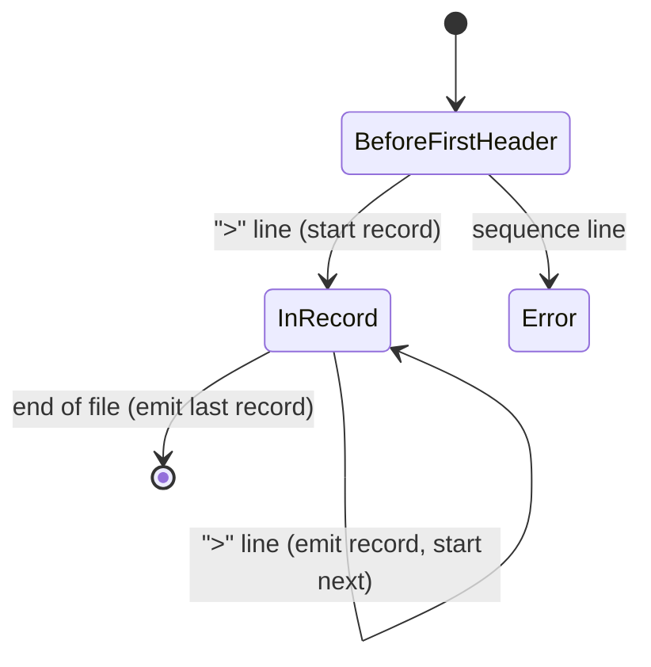

---
aliases:
  - FASTA
  - FASTA File
  - Multi-FASTA
  - Format FASTA
tags:
  - type/concept
  - domain/bioinformatics
  - domain/computer-science
  - level/L1
  - level/L2
  - level/L3
mastery: 0
prerequisites:
  - "[[Nucleotide]]"
  - "[[IUPAC Nucleotide Code]]"
  - "[[File Input and Output]]"
  - "[[String]]"
related:
  - "[[FASTQ Format]]"
  - "[[GenBank Format]]"
  - "[[Accession Number]]"
  - "[[Genomic File Indexing]]"
  - "[[Reference Genome]]"
  - "[[Multiple Sequence Alignment]]"
  - "[[Iterator]]"
  - "[[State Machine]]"
  - "[[Property-Based Testing]]"
  - "[[Data Compression]]"
projects:
  - "[[01-dna-engine]]"
  - "[[bio-core]]"
  - "[[09-genome-browser]]"
  - "[[04-alignment-engine]]"
sources:
  - "[[NCBI BLAST]]"
  - "[[Pearson 1988 - Improved Tools for Biological Sequence Comparison]]"
  - "[[NCBI]]"
  - "[[UniProt]]"
  - "[[Bioinformatics Data Skills (Buffalo)]]"
  - "[[Biopython]]"
  - "[[Galaxy Training Network - Training Material]]"
---

# FASTA Format

> [!abstract]
> A FASTA file is a plain-text list of sequences: each one starts with a `>` line that names it, followed by lines of letters (bases or amino acids). It is the simplest and most common sequence file in bioinformatics.

## Definition

**FASTA format** is a text format for nucleotide or protein sequences. In NCBI's description, a sequence in FASTA format begins with a single-line description, the **definition line** (defline), distinguished from the sequence data by a greater-than symbol (`>`) at its beginning, followed by lines of sequence data.[^ncbi] A **multi-FASTA** file concatenates several such records. The format carries the name of the FASTA sequence-comparison programs of Pearson and Lipman.[^pearson]

## Why it matters

- **Universal input.** BLAST accepts queries in FASTA format (or as bare sequences or identifiers),[^ncbi] and NCBI and UniProt offer sequence downloads in FASTA.[^ncbi-portal][^uniprot] The protein databases searched in [[Proteomics]] are FASTA files too.[^gtn]
- **Day-to-day skill.** Practical bioinformatics texts teach FASTA together with FASTQ, SAM and BAM as the formats of daily genomics work.[^buffalo]
- **First parser of the Lab.** Parsing and writing FASTA is the entry point of [[01-dna-engine]]; [[bio-core]] turns records into typed sequence objects, and [[09-genome-browser]] needs random access into large FASTA files ([[Genomic File Indexing]]).

## Core (L1)

### Specification

The rules, from NCBI's description of the format:[^ncbi]

1. A record starts with a **definition line** whose first character is `>`. It is a single line.
2. The following lines, up to the next `>` line or the end of the file, hold the **sequence**; a sequence can span many lines.
3. All lines should be **shorter than 80 characters**.
4. Sequences use the standard IUB/IUPAC **nucleic acid and amino acid codes** ([[IUPAC Nucleotide Code]]), with these exceptions: **lowercase** letters are accepted and read as uppercase; a single **hyphen** can stand for a gap of indeterminate length; in amino acid sequences, **`U`** and **`*`** are acceptable letters.
5. **Digits** are not sequence: remove them or replace them with a code for an unknown residue (`N` for nucleic acids, `X` for amino acids).
6. **Blank lines** are not allowed in the middle of FASTA input.

By convention the header's first word is the sequence **identifier**, usually an [[Accession Number|accession]], and the rest is a free description, as in NCBI's own example:[^ncbi]

```text
>P01013 GENE X PROTEIN (OVALBUMIN-RELATED)
QIKDLLVSSSTDLDTTLVLVNAIYFKGMWKTAFNAEDTREMPFHVTKQESKPVQMMCMNNSFNVATLPAE
```

### A minimal multi-FASTA file

Invented records, sequence wrapped at 10 characters to make the structure visible:

```text
>seqA toy promoter region
ACGTTGCAAT
GGCTAAC
>seqB
ttgacaNNNNtataat
```

Reading rules to apply every time: join the sequence lines, do not include line breaks in the length, and keep reading until the next `>` or the end of the file (the last record has no `>` after it).

## Deeper (L2)

### Parsing as a state machine

A FASTA reader is a small [[State Machine]] driven line by line:



Blank lines are either skipped (lenient mode) or an error inside a record (strict mode, following NCBI).[^ncbi]

**Streaming.** A reader that yields one record at a time (a Python generator, see [[Iterator]]) keeps only the current record in memory: $O(\ell_{\max})$ memory for the longest record instead of $O(\text{file})$, and $O(\text{bytes})$ time. Collect sequence lines in a list and join them once; repeated string concatenation can copy the growing sequence at every line.

**Headers.** Split the header once on whitespace: identifier, then description. Identifiers should be unique within a file, but nothing in the format enforces it: count them with a `Counter` before building a dictionary keyed by identifier, which would silently keep only the last duplicate.

**Writing.** Wrap sequence lines at a fixed width below 80 characters,[^ncbi] use `\n` line endings and write a final newline. A fixed width is not only cosmetic: it is what makes random access possible (L3).

### Pitfalls checklist

| Pitfall | Symptom | Fix |
|---|---|---|
| Last record not flushed at end of file | one sequence fewer than `grep -c '>'` | emit the pending record after the loop |
| Windows line endings (`\r\n`) | `\r` inside sequences, lengths off by one per line | strip `\r\n`, not only `\n` |
| Blank lines, trailing spaces | empty chunks, spaces in sequences | skip or reject blank lines; remove whitespace inside sequence lines |
| Lowercase letters | `seq.count("A")` misses `a` | normalize case for statistics; keep the original if case carries meaning ([[Repeat Masking]]) |
| Header truncated at first space | identifiers collide (`chr1` vs `chr1 assembled`) | define identifier = first word, keep description separately |
| Duplicate identifiers | a dictionary silently keeps the last record | count identifiers and fail on duplicates |
| Protein read as DNA | letters such as `E`, `L`, `*` flagged as invalid bases | declare the molecule type; validate with the right alphabet |
| Whole file loaded at once | memory error on a genome | stream records with a generator |
| Varying line widths | random access returns wrong bases | rewrite with a fixed width before indexing |

## Advanced (L3)

- **Random access.** If every sequence line of a record except the last has the same number of bases $w$ and the same line terminator of $t$ bytes, the byte position of any base is a closed formula (Mathematical representation). This is the idea behind FASTA index files, which store for each record where its sequence starts and its line geometry, so that a genome browser can read a small region of a large chromosome with one seek ([[Genomic File Indexing]], [[09-genome-browser]]; Exercise 3).
- **Compression.** Text FASTA compresses well; the standard library's `gzip.open(path, "rt")` returns a text handle, so the same streaming reader works on `.fa.gz` files ([[Data Compression]]).
- **What FASTA does not carry.** No per-base quality ([[FASTQ Format]]), no features or coordinates ([[GenBank Format]], [[GFF Format]]), no required metadata: provenance lives in the header only by convention, and conventions differ between databases. Record the source, accession.version and download date elsewhere ([[Data Provenance]]).
- **Testing a parser.** The strongest test is a round-trip property: for any list of valid records, `read(write(records)) == records`, checked on hundreds of random cases ([[Property-Based Testing]], Exercise 4). Established libraries such as `Bio.SeqIO` can serve as a test oracle once your own parser exists.[^biopython]

## Mathematical representation

**Grammar** (lenient variant, extended Backus-Naur form):

```text
file      = { blank } , { record } ;
record    = header , { seqline | blank } ;
header    = ">" , text , eol ;
seqline   = symbol , { symbol } , eol ;
blank     = { " " | "\t" } , eol ;
eol       = "\n" | "\r\n" ;
```

The strict variant removes `blank` inside `record`. A file denotes a list of records $((h_1, s_1), \dots, (h_m, s_m))$, with $h_k$ the header text and $s_k \in \mathcal{A}^*$ a word over the alphabet $\mathcal{A}$ (IUPAC nucleotide or amino acid codes, `-`, `*`). The line structure is not part of the meaning: two files with different wrapping denote the same records.

**Offset of a base.** A sequence of length $n$ written at width $w$ occupies $\lceil n / w \rceil$ lines. If each line ends with a terminator of $t$ bytes and the sequence starts at byte $o$, the 0-based base $i$ is at byte

$$\mathrm{off}(i) = o + \left\lfloor \frac{i}{w} \right\rfloor (w + t) + (i \bmod w).$$

Reading bases $[a, b)$ means reading bytes $[\mathrm{off}(a), \mathrm{off}(b))$ and removing the $t$-byte terminators in between.

## Computational representation

A streaming reader with a strict mode, and a writer, standard library only:

```python
import io
from typing import Iterable, Iterator, NamedTuple, TextIO


class FastaRecord(NamedTuple):
    id: str            # first word of the header
    description: str   # rest of the header ("" if none)
    sequence: str


class FastaError(ValueError):
    pass


def _record(header: str, chunks: list[str], uppercase: bool) -> FastaRecord:
    parts = header.split(maxsplit=1)
    if not parts:
        raise FastaError("empty header line '>'")
    seq = "".join(chunks)                       # linear-time concatenation
    return FastaRecord(parts[0], parts[1] if len(parts) > 1 else "", seq.upper() if uppercase else seq)


def read_fasta(handle: TextIO, strict: bool = False, uppercase: bool = False) -> Iterator[FastaRecord]:
    """Stream FASTA records one at a time: memory grows with the longest record, not the file."""
    header, chunks = None, []
    for lineno, line in enumerate(handle, start=1):
        line = line.rstrip("\r\n")               # accepts both LF and CRLF line endings
        if not line.strip():                     # blank line
            if strict and header is not None:
                raise FastaError(f"line {lineno}: blank line inside a record")
            continue
        if line.startswith(">"):
            if header is not None:
                yield _record(header, chunks, uppercase)
            header, chunks = line[1:], []
        elif header is None:
            raise FastaError(f"line {lineno}: sequence data before the first '>' header")
        else:
            chunks.append("".join(line.split()))  # drops spaces and tabs inside the line
    if header is not None:                       # flush the last record
        yield _record(header, chunks, uppercase)


def write_fasta(records: Iterable[FastaRecord], handle: TextIO, width: int = 60) -> None:
    """Write records with sequence lines of at most `width` characters."""
    for r in records:
        handle.write(f">{r.id} {r.description}\n" if r.description else f">{r.id}\n")
        for i in range(0, len(r.sequence), width):
            handle.write(r.sequence[i:i + width] + "\n")


messy = (">seq1 toy gene, forward strand\r\n"   # invented records, Windows line endings
         "ACGTACGTAC\r\n"
         "gtacNNACGT \r\n"                       # lowercase, N, trailing space
         "\r\n"                                  # blank line between records
         ">seq2\n"
         "MKV*\n"                                # a protein: the parser does not judge the alphabet
         ">empty record\n")
records = list(read_fasta(io.StringIO(messy)))
for r in records:
    print(r)
out = io.StringIO()
write_fasta(records, out, width=8)
print(out.getvalue().splitlines()[:3], list(read_fasta(io.StringIO(out.getvalue()))) == records)
try:
    list(read_fasta(io.StringIO(messy), strict=True))
except FastaError as err:
    print("strict:", err)
```

```text
FastaRecord(id='seq1', description='toy gene, forward strand', sequence='ACGTACGTACgtacNNACGT')
FastaRecord(id='seq2', description='', sequence='MKV*')
FastaRecord(id='empty', description='record', sequence='')
['>seq1 toy gene, forward strand', 'ACGTACGT', 'ACgtacNN'] True
strict: line 4: blank line inside a record
```

Design choices: the reader keeps case (use `uppercase=True` for statistics) and does not validate the alphabet, which is the job of a separate validator ([[IUPAC Nucleotide Code#Computational representation]]); an empty record is returned, not hidden, so the caller decides. To read a compressed file, pass `gzip.open(path, "rt")` as the handle.

## Worked example

> [!example] Parsing the minimal file by hand
> Input: the minimal multi-FASTA file of Core (L1).
> 1. Line 1 `>seqA toy promoter region`: state BeforeFirstHeader → InRecord; identifier `seqA`, description `toy promoter region`.
> 2. Lines 2 and 3: chunks `ACGTTGCAAT`, `GGCTAAC`.
> 3. Line 4 `>seqB`: emit record 1 with sequence `ACGTTGCAATGGCTAAC` (10 + 7 = 17 bases); start record 2, empty description.
> 4. Line 5: chunk `ttgacaNNNNtataat`.
> 5. End of file: emit record 2 (16 bases). Forgetting this step loses the last record, the classic bug.
> 6. **Checks**: 2 headers, 2 records; `seqB` has 4 `N` and is lowercase, which the reader keeps; a GC computation must first choose how to treat N ([[IUPAC Nucleotide Code#Worked example]]).

## Common misconceptions

> [!warning] "One line per sequence"
> A sequence can span many lines,[^ncbi] and genome files are wrapped. Code that reads "header line, then one sequence line" breaks on the first real genome.

> [!warning] "The header is the identifier"
> Only the first word is, by convention; the rest is a free description.[^ncbi] Tools that keep the whole line and tools that cut at the first space will not match each other's names.

> [!warning] "FASTA files contain only A, C, G and T"
> Lowercase, IUPAC ambiguity codes, gaps, and for proteins `U` and `*` are all allowed.[^ncbi] Validate with the right alphabet instead of assuming four letters; aligned FASTA files also use the hyphen as gap ([[Multiple Sequence Alignment]]).

## Exercises

> [!question] Exercise 1 (L1)
> How many records does this file contain, and what are the identifiers and sequence lengths?
> ```text
> >r1 first
> ACGT
> ACG
> >r2
> >r3 third one
> TTTT
> ```

> [!success]- Solution
> Three records: `r1` (7 bases, two lines joined), `r2` (0 bases: an empty record, legal for the parser but worth a warning), `r3` (4 bases, description `third one`).

> [!question] Exercise 2 (L1)
> List every problem in this input according to NCBI's description: line 1 `ACGTAC`, line 2 `>s1 test`, line 3 `ACGT ACGT`, line 4 empty, line 5 `ACGT1234`.

> [!success]- Solution
> Line 1: sequence data before any `>` definition line. Line 3: a space inside the sequence (remove whitespace). Line 4: blank line in the middle of the input, not allowed. Line 5: digits must be removed or replaced by `N`.[^ncbi]

> [!question] Exercise 3 (L2, Python)
> Write a random toy chromosome of 1,000 bases to a file at width 60, then implement `fetch(path, seq_start, width, eol, start, end)` that returns bases $[start, end)$ with one `seek`, and check it against slicing.

> [!success]- Solution
> ```python
> import os
> import random
> import tempfile
>
>
> def base_offset(seq_start: int, i: int, width: int, eol: int) -> int:
>     """Byte offset of 0-based base i, for sequence lines of `width` bases ending with `eol` bytes."""
>     return seq_start + (i // width) * (width + eol) + i % width
>
>
> def fetch(path: str, seq_start: int, width: int, eol: int, start: int, end: int) -> str:
>     """Bases [start, end) read with one seek, without parsing the file."""
>     with open(path, "rb") as f:
>         f.seek(base_offset(seq_start, start, width, eol))
>         raw = f.read(base_offset(seq_start, end, width, eol) - base_offset(seq_start, start, width, eol))
>     return raw.decode("ascii").replace("\r", "").replace("\n", "")
>
>
> random.seed(1)
> seq = "".join(random.choice("ACGT") for _ in range(1000))   # random toy chromosome
> header = ">chrToy random sequence\n"
> path = os.path.join(tempfile.mkdtemp(), "toy.fa")
> with open(path, "w", newline="\n") as f:
>     f.write(header)
>     for k in range(0, len(seq), 60):
>         f.write(seq[k:k + 60] + "\n")
>
> seq_start = len(header.encode())
> print(base_offset(seq_start, 0, 60, 1), base_offset(seq_start, 59, 60, 1), base_offset(seq_start, 60, 60, 1))
> print(fetch(path, seq_start, 60, 1, 118, 125), seq[118:125], fetch(path, seq_start, 60, 1, 118, 125) == seq[118:125])
> print(all(fetch(path, seq_start, 60, 1, a, a + 37) == seq[a:a + 37] for a in range(0, 963, 7)))
> ```
> Output: `24 83 85` (byte 84 is the newline; with `\r\n` endings base 60 would be at 86), then `CCGCGGT CCGCGGT True`, then `True`. The read costs $O(b - a)$ regardless of the chromosome's size, which is what makes browsing a genome interactive ([[Genomic File Indexing]]).

> [!question] Exercise 4 (L3, Python)
> Test the round-trip property `read(write(records)) == records` on 200 random lists of records (random identifiers, descriptions, sequences over `ACGTNacgtn-`, including empty sequences, and random widths). Which records would break the property, and should the writer reject them?

> [!success]- Solution
> ```python
> import io
> import random
>
> random.seed(0)
> ALPHABET = "ACGTNacgtn-"
>
>
> def random_record(k: int) -> FastaRecord:
>     seq = "".join(random.choice(ALPHABET) for _ in range(random.randint(0, 150)))
>     desc = random.choice(["", "toy description", "len=%d" % len(seq)])
>     return FastaRecord(f"rec{k}", desc, seq)
>
>
> ok = True
> for trial in range(200):
>     recs = [random_record(k) for k in range(random.randint(1, 5))]
>     buf = io.StringIO()
>     write_fasta(recs, buf, width=random.randint(1, 80))
>     ok &= list(read_fasta(io.StringIO(buf.getvalue()))) == recs
> print(ok)
> ```
> Output: `True`. The property fails for records the format cannot express: an identifier containing whitespace or empty, a description with leading spaces or a newline, a sequence containing `>` at a line start or whitespace. The writer should reject them with an error rather than write a file that reads back differently.

## Mastery checklist

- [ ] 1 Recognized: I can identify a FASTA file, its definition lines and its sequence lines.
- [ ] 2 Understood: I can state NCBI's rules (single `>` line, multi-line sequences, codes, lowercase, gaps, no blank lines, line length) and the header convention.
- [ ] 3 Practiced: I can write a streaming reader and a writer that pass the edge cases and the round-trip test.
- [ ] 4 Applied: [[01-dna-engine]] reads a real genome FASTA (with N and lowercase) in constant memory per record, and [[bio-core]] builds typed sequences from it.
- [ ] 5 Explained: I can explain random access by byte offset, what FASTA cannot carry, and why each pitfall in the checklist happens.

## References

[^ncbi]: [[NCBI BLAST]], BLAST documentation "Query Input and database selection", FASTA format description (definition line, sequence lines, line length, accepted codes, lowercase, hyphen, `U` and `*`, digits, blank lines, example record).
[^pearson]: [[Pearson 1988 - Improved Tools for Biological Sequence Comparison]], *PNAS* 85:2444-2448.
[^ncbi-portal]: [[NCBI]], sequence records downloadable in FASTA format.
[^uniprot]: [[UniProt]], protein sequences downloadable in FASTA format.
[^buffalo]: [[Bioinformatics Data Skills (Buffalo)]], material on genomics formats (FASTA, FASTQ, SAM and BAM); chapter not verified.
[^gtn]: [[Galaxy Training Network - Training Material]], topic "Proteomics" (tutorial "Protein FASTA Database Handling").
[^biopython]: [[Biopython]], `Bio.SeqIO` (reading and writing sequence formats); tier C, used here only as a test oracle.
