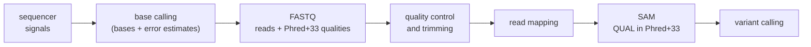

---
aliases:
  - FASTQ
  - FASTQ File
  - Sanger FASTQ
  - fastq-sanger
  - Format FASTQ
tags:
  - type/concept
  - domain/bioinformatics
  - domain/computer-science
  - domain/statistics
  - level/L1
  - level/L2
  - level/L3
mastery: 0
prerequisites:
  - "[[FASTA Format]]"
  - "[[IUPAC Nucleotide Code]]"
  - "[[Next-Generation Sequencing]]"
  - "[[Logarithm]]"
related:
  - "[[Phred Quality Score]]"
  - "[[Sequencing Read]]"
  - "[[Base Calling]]"
  - "[[Paired-End Read]]"
  - "[[Read Quality Control]]"
  - "[[Read Trimming]]"
  - "[[Read Mapping]]"
  - "[[SAM Format]]"
projects:
  - "[[10-genomic-pipeline]]"
  - "[[01-dna-engine]]"
sources:
  - "[[Cock 2010 - The Sanger FASTQ File Format]]"
  - "[[Galaxy Training Network - Training Material]]"
  - "[[GA4GH hts-specs]]"
  - "[[Shendure 2008 - Next-Generation DNA Sequencing]]"
  - "[[Biopython]]"
---

# FASTQ Format

> [!abstract]
> FASTQ stores sequencing reads as four-line records (title, bases, separator, qualities), where each base has one quality character encoding the probability $p$ that the base is wrong, through $Q = -10 \log_{10} p$ and the character with code $Q + 33$.

## Definition

**FASTQ** is a text format for sequences with per-base quality scores. Each record has a title line starting with `@`, the sequence, a line starting with `+`, and a quality string with exactly one character per base.[^cock][^gtn] In the standard (Sanger) variant, each character encodes a **Phred quality** $Q = -10 \log_{10} p$, where $p$ is the estimated probability that the base call is wrong, as the ASCII character of code $Q + 33$.[^cock] The format has no formal specification; the reference description is Cock et al. (2010), which also documents two older, incompatible Solexa/Illumina variants.[^cock][^hts]

## Why it matters

- **It is what sequencers deliver.** Massively parallel platforms sequence many immobilized fragments at once and report each as a read.[^shendure] Almost every analysis of [[Next-Generation Sequencing]] data starts with FASTQ files, including [[10-genomic-pipeline]].
- **Qualities drive decisions.** Quality control reports ([[Read Quality Control]]), trimming of low-quality ends ([[Read Trimming]]; Q20 is a common threshold), read mapping and variant calling all use the per-base error probabilities.[^gtn]
- **They travel downstream.** Aligned reads keep their qualities: the SAM `QUAL` field is the same Phred+33 encoding ([[SAM Format]]).[^hts]
- **Parsing is a classic trap.** The quality alphabet contains `@` and `+`, the very characters that mark record lines, so a naive line-by-line parser can split records in the wrong place.[^cock]

## Core (L1)

### Specification

Anatomy of one record (annotations after `<-` are not part of the file):

```text
@read1 invented example          <- line 1: '@' + title (identifier, then free text)
ACGTNACGTA                       <- line 2: bases (IUPAC letters, N = unknown)
+                                <- line 3: '+', optionally followed by the same title
IIII#IIII5                       <- line 4: one quality character per base
```

Rules:[^cock][^gtn][^biopython]

- The title line starts with `@`; the text after it identifies the read.
- The `+` line may repeat the title; if it does, the two must be identical.
- The quality string has exactly as many characters as the sequence.
- Sequence and quality may in principle be wrapped over several lines, as in FASTA, but this is discouraged: in practice one record is four lines.
- **Sanger encoding (Phred+33)**: character = `chr(Q + 33)`, so `!` is $Q = 0$ and `~` is $Q = 93$, the maximum. Current Illumina pipelines (1.8+) write this encoding.[^cock][^gtn]

### Minimal example

Two invented records, the second repeating its title on the `+` line:

```text
@read1 invented example
ACGTNACGTA
+
IIII#IIII5
@read2 invented example
TTGCAAGT
+read2 invented example
?????+55
```

### From character to error probability

$$Q = -10 \log_{10} p \quad \Longleftrightarrow \quad p = 10^{-Q/10}, \qquad Q = \mathrm{ord}(c) - 33.$$

| Character | Code | $Q$ | $p$ (error) | Accuracy |
|:---:|---:|---:|---:|---:|
| `!` | 33 | 0 | 1 | 0 % |
| `+` | 43 | 10 | 0.1 | 90 % |
| `5` | 53 | 20 | 0.01 | 99 % |
| `?` | 63 | 30 | 0.001 | 99.9 % |
| `I` | 73 | 40 | 0.0001 | 99.99 % |

Every 10 units of $Q$ divide the error probability by 10. The GTN quality-control tutorial works the same example: `/` has code 47, so $Q = 14$ and $p = 10^{-1.4} \approx 0.040$, an accuracy of about 96 %.[^gtn]

### Where FASTQ sits



## Deeper (L2)

### Three encodings

Before converging on the Sanger standard, Solexa and Illumina pipelines used an ASCII offset of 64, and the earliest ones a different score:[^cock]

| Variant | Score | Offset | Range | Characters |
|---|---|---:|---|---|
| Sanger, Illumina 1.8+ | Phred $-10\log_{10} p$ | 33 | 0 to 93 | `!` to `~` |
| Solexa (early Illumina) | Solexa $-10\log_{10}\frac{p}{1-p}$ | 64 | -5 to 62 | `;` to `~` |
| Illumina 1.3 to 1.7 | Phred | 64 | 0 to 62 | `@` to `~` |

Nothing in the file says which variant it is. A character below `;` (code 59) proves Phred+33, since no offset-64 variant can produce it; a file whose characters are all above that is ambiguous, because high-quality Phred+33 data also use those characters. Tools such as FastQC guess the encoding from the range of characters observed.[^gtn] Archived data may need conversion: Phred+64 to Phred+33 subtracts 31 from every character code.

### Robust parsing

The quality string can begin with `@` (a base of $Q = 31$) or contain `+`, so "a line starting with `@` begins a record" is false. A correct reader uses the **sequence length**: after the `+` line it reads quality characters until it has as many as there are bases. This also handles wrapped records.[^cock][^biopython]

### Size

A FASTQ file holds two characters per base (base and quality) plus titles, and is often stored gzip-compressed (`.fastq.gz`), like the input of the GTN tutorial.[^gtn] Python reads it as text with `gzip.open(path, "rt")`, and the parser below consumes the lines as they stream, never the whole file.

## Advanced (L3)

**Expected errors.** If the $n$ bases of a read have error probabilities $p_1, \dots, p_n$, the expected number of wrong bases is $E = \sum_i p_i$ (linearity of expectation, whatever the dependence between errors). $E$ is a more faithful summary of a read than its mean quality: because $p = 10^{-Q/10}$ is convex, the mean of the $p_i$ is at least $10^{-\bar{Q}/10}$ (Jensen's inequality), so averaging $Q$ hides a few very bad bases (Exercise 5).

**Solexa and Phred scores.** From $Q_S = -10\log_{10}\frac{p}{1-p}$, $\frac{p}{1-p} = 10^{-Q_S/10}$, so $p = \frac{1}{1 + 10^{Q_S/10}}$ and
$$Q_P = -10 \log_{10} p = 10 \log_{10}\left(1 + 10^{Q_S/10}\right).$$
The two scores are nearly equal for high qualities and differ at low ones (Solexa can be negative, Phred cannot).[^cock]

**Qualities are estimates.** A quality is the base caller's estimate of $p$, not a measurement, so whether $Q = 30$ really means one error in 1,000 depends on how well the estimate is calibrated. Checking and correcting that calibration is the subject of [[Base Quality Score Recalibration]]; [[Phred Quality Score]] develops the statistics.

## Mathematical representation

- A FASTQ file is a sequence of records $(t_k, s_k, q_k)$ with $s_k \in \Sigma^{n_k}$ (bases) and $q_k \in \{33, \dots, 126\}^{n_k}$ (character codes), $|s_k| = |q_k|$.
- Decoding: $Q_{k,i} = q_{k,i} - 33$, $p_{k,i} = 10^{-Q_{k,i}/10}$; encoding: $q = 33 + \mathrm{round}(-10 \log_{10} p)$, clipped to $[33, 126]$. The SAM specification defines the Phred scale of $p$ as $-10\log_{10} p$ rounded to the nearest integer.[^hts]
- Expected errors of read $k$: $E_k = \sum_{i=1}^{n_k} p_{k,i}$. Probability that the read is error-free, if errors are independent: $\prod_i (1 - p_{k,i})$.

## Computational representation

A streaming parser, standard library only, that accepts wrapped records, an optional title on the `+` line, quality lines starting with `@`, CRLF line endings and blank lines between records, and rejects truncated or inconsistent records.

```python
class FastqError(ValueError):
    pass

def parse_fastq(lines):
    """Yield (title, sequence, quality) from FASTQ lines (a list or an open text file).
    Accepts wrapped records, an optional title after '+', quality lines starting with '@'."""
    it = (line.rstrip("\r\n") for line in lines)
    for line in it:
        if not line:
            continue                                   # blank line between or after records
        if not line.startswith("@"):
            raise FastqError(f"expected '@title', got {line[:20]!r}")
        title, seq = line[1:], []
        for line in it:
            if line.startswith("+"):
                break
            seq.append(line.strip())
        else:
            raise FastqError(f"{title}: file ends before the '+' line")
        if line[1:] and line[1:] != title:
            raise FastqError(f"{title}: '+' line repeats a different title")
        sequence, quality = "".join(seq), ""
        while len(quality) < len(sequence):            # length, not '@', ends the record
            nxt = next(it, None)
            if nxt is None:
                raise FastqError(f"{title}: truncated quality string")
            quality += nxt.strip()
        if len(quality) != len(sequence):
            raise FastqError(f"{title}: {len(sequence)} bases but {len(quality)} qualities")
        if any(not 33 <= ord(c) <= 126 for c in quality):
            raise FastqError(f"{title}: quality character outside '!'..'~'")
        yield title, sequence, quality

def phred(quality: str, offset: int = 33) -> list[int]:
    return [ord(c) - offset for c in quality]

def error_probability(q: int) -> float:
    return 10 ** (-q / 10)                             # inverse of Q = -10 log10 p

def guess_offset(qualities) -> str:
    """Only a character below ';' (59) proves Phred+33; otherwise both offsets remain possible."""
    low = min(min(q) for q in qualities)
    return "Phred+33" if ord(low) < 59 else "undetermined (no character below ';')"

toy = """@read1 invented
ACGTNACGTA
+
IIII#IIII5
@read2 invented, wrapped
ACGTAC
GTAC
+read2 invented, wrapped
@@@@@@
@@@@
"""
records = list(parse_fastq(toy.splitlines()))
for title, seq, qual in records:
    q = phred(qual)
    expected = sum(error_probability(x) for x in q)
    print(f"{title:26} {seq} Q={q} expected errors={expected:.3f}")
print(guess_offset(q for _, _, q in records))

for bad in ["@r\nACGT\n+\nIII", "@r\nACGT\n+x\nIIII", "@r\nACGT\n"]:
    try:
        list(parse_fastq(bad.splitlines()))
    except FastqError as err:
        print("error:", err)
```

Output:

```text
read1 invented             ACGTNACGTA Q=[40, 40, 40, 40, 2, 40, 40, 40, 40, 20] expected errors=0.642
read2 invented, wrapped    ACGTACGTAC Q=[31, 31, 31, 31, 31, 31, 31, 31, 31, 31] expected errors=0.008
Phred+33
error: r: truncated quality string
error: r: '+' line repeats a different title
error: r: file ends before the '+' line
```

The second record is wrapped and its quality lines start with `@`: the length rule parses it correctly. For a compressed file: `with gzip.open("reads.fastq.gz", "rt") as fh: for title, seq, qual in parse_fastq(fh): ...`. [[Biopython]] offers the same logic as `Bio.SeqIO.QualityIO.FastqGeneralIterator`, a good test oracle once you have written your own.[^biopython]

### Pitfalls

- **Offset**: Phred+33 is the default today, but old Solexa/Illumina files use 64; decode with the wrong offset and every quality is off by 31.[^cock]
- **`@` in qualities**: never detect records by the first character alone; count quality characters against the sequence length.[^cock]
- **Title on the `+` line**: optional, and must match when present.[^cock]
- **Mean quality**: summarize reads with expected errors, not with the mean of $Q$.

## Worked example

> [!example] Decoding one record
> Invented record: `@read1` / `ACGTNACGTA` / `+` / `IIII#IIII5`.
> 1. **Lengths**: 10 bases, 10 quality characters: consistent.
> 2. **Decode** (Phred+33): `I` = 73 − 33 = 40, `#` = 35 − 33 = 2, `5` = 53 − 33 = 20. Qualities: 40, 40, 40, 40, **2**, 40, 40, 40, 40, 20.
> 3. **Probabilities**: $10^{-4}$ for each `I`, $10^{-0.2} \approx 0.631$ for `#`, $0.01$ for `5`.
> 4. **Expected errors**: $8 \times 10^{-4} + 0.631 + 0.01 \approx 0.642$ wrong bases per read of this quality profile.
> 5. **Interpretation**: the fifth base is `N` with $Q = 2$: the caller could not decide. The last base ($Q = 20$) is the kind a trimmer removes at a Q20 threshold.[^gtn]

## Common misconceptions

> [!warning] "The quality line is a string of numbers"
> It is a string of characters, one per base, each encoding a number by its ASCII code minus the offset. `I` is 40, not a letter to interpret.[^cock]

> [!warning] "Every FASTQ file uses Phred+33"
> Sanger and Illumina 1.8+ do; Solexa and Illumina 1.3-1.7 files use offset 64, and Solexa scores are not even Phred scores.[^cock][^gtn] Check the character range before decoding archived data.

> [!warning] "A line starting with `@` is a read title"
> `@` is also the quality character for $Q = 31$; a quality line can start with it.[^cock] Only the record structure (four lines, or length counting) tells titles from qualities.

> [!warning] "A read with mean quality 36 has about 0.03 % errors per base"
> Averaging $Q$ underestimates errors when a few bases are bad. For nine bases at Q40 and one at Q2, the mean $Q$ is 36.2 (error $2.4 \times 10^{-4}$) but the mean error probability is 0.063, a Phred value of 12 (Exercise 5).

## Exercises

> [!question] Exercise 1 (L1)
> Decode the Phred+33 characters `5`, `I`, `#` and `!` into $Q$ and error probability $p$.

> [!success]- Solution
> `5` = 53 − 33 = 20, $p = 0.01$; `I` = 73 − 33 = 40, $p = 10^{-4}$; `#` = 35 − 33 = 2, $p = 10^{-0.2} \approx 0.631$; `!` = 33 − 33 = 0, $p = 1$ (no information).
>
> ```python
> for c in "5I#!":
>     q = ord(c) - 33
>     print(c, q, 10 ** (-q / 10))
> # 5 20 0.01
> # I 40 0.0001
> # # 2 0.6309573444801932
> # ! 0 1.0
> ```

> [!question] Exercise 2 (L1)
> An unwrapped FASTQ file has 4,000,000 lines. How many reads does it contain? A quality line reads `@@@@@`: what are the qualities, and why is it not a title?

> [!success]- Solution
> Four lines per record: 1,000,000 reads. `@` is code 64, so $Q = 31$ for each base ($p \approx 7.9 \times 10^{-4}$). It is the fourth line of a record (it follows a `+` line and has the sequence's length), which is what identifies it, not its first character.[^cock]

> [!question] Exercise 3 (L2, Python)
> Write a function converting a Phred+64 quality string (Illumina 1.3-1.7) to Phred+33, and apply it to `h@B`. Give the $Q$ values.

> [!success]- Solution
> Same $Q$, offset 64 instead of 33: subtract 31 from each code.
>
> ```python
> def phred64_to_phred33(quality: str) -> str:
>     return "".join(chr(ord(c) - 31) for c in quality)
>
> print(phred64_to_phred33("h@B"), [ord(c) - 64 for c in "h@B"])
> # I!# [40, 0, 2]
> ```

> [!question] Exercise 4 (L2, Python)
> Convert the Solexa scores −5, 0, 10, 20 and 40 to Phred scores with the formula of the Advanced section. When does the distinction matter?

> [!success]- Solution
> ```python
> import math
>
> def solexa_to_phred(q_sol: float) -> float:
>     return 10 * math.log10(10 ** (q_sol / 10) + 1)
>
> print([round(solexa_to_phred(q), 2) for q in (-5, 0, 10, 20, 40)])
> # [1.19, 3.01, 10.41, 20.04, 40.0]
> ```
>
> At high quality the scores coincide; at low quality they diverge (Solexa 0 means $p = 0.5$, Phred 3). Old Solexa files decoded as Phred misstate exactly the low-quality bases that trimming and variant calling care about.[^cock]

> [!question] Exercise 5 (L3, Python)
> A read has nine bases at Q40 and one at Q2. Compute its mean $Q$, the error probability that the mean $Q$ suggests, the true mean error probability, and the Phred value of that mean. Explain the gap.

> [!success]- Solution
> ```python
> import math
>
> q = [40] * 9 + [2]
> mean_q = sum(q) / len(q)
> mean_p = sum(10 ** (-x / 10) for x in q) / len(q)
> print(mean_q, round(10 ** (-mean_q / 10), 6), round(mean_p, 4), round(-10 * math.log10(mean_p), 1))
> # 36.2 0.00024 0.0632 12.0
> ```
>
> The mean $Q$ suggests $2.4 \times 10^{-4}$ errors per base; the true mean is 0.063, 260 times larger, dominated by the single Q2 base. Since $p = 10^{-Q/10}$ is convex, $\overline{p} \ge 10^{-\overline{Q}/10}$ (Jensen): averaging on the log scale always flatters the read. Filters should use expected errors $E = \sum p_i$ (here 0.63).

> [!question] Exercise 6 (L3)
> Explain why the parser above cannot be fooled by the record below, while a parser that starts a new record at every line beginning with `@` would be. What would break if the file were truncated after the `+` line?
> ```text
> @r1
> ACGTAC
> GTAC
> +r1
> @@@@@@
> @@@@
> ```

> [!success]- Solution
> The naive parser sees `@@@@@@` and `@@@@` as two new records with titles `@@@@@` and `@@@`. The length-based parser knows the sequence has 10 bases (two wrapped lines), so it consumes quality lines until it has 10 characters, whatever they start with. If the file ends after `+r1`, the loop runs out of lines with 0 of 10 quality characters and raises "truncated quality string" instead of returning a silently incomplete read.[^cock][^biopython]

## Mastery checklist

- [ ] 1 Recognized: I can identify the four lines of a FASTQ record and state $Q = -10 \log_{10} p$.
- [ ] 2 Understood: I can decode any quality character, explain the offsets 33 and 64 and why `@` can start a quality line.
- [ ] 3 Practiced: I can write a streaming FASTQ parser in Python that handles wrapped records, and compute expected errors per read.
- [ ] 4 Applied: [[10-genomic-pipeline]] reads real gzip-compressed FASTQ, checks the encoding and reports quality summaries before mapping.
- [ ] 5 Explained: I can teach the encoding history, the pitfalls of mean quality and the meaning of a quality as an estimated probability.

## References

[^cock]: [[Cock 2010 - The Sanger FASTQ File Format]], *Nucleic Acids Research* 38(6):1767-1771: record layout, Phred and Solexa scores, the three variants and their offsets and ranges, wrapping and `@`/`+` in quality lines.
[^gtn]: [[Galaxy Training Network - Training Material]], topic "Sequence analysis", tutorial "Quality Control": the four lines of a read, Illumina 1.8+ using Phred+33, the worked decoding of `/`, encoding detection by FastQC, the Q20 trimming threshold.
[^hts]: [[GA4GH hts-specs]]: README (FASTQ has no formal definition; see Cock et al.) and `SAMv1` (Phred scale; `QUAL` as Phred+33).
[^shendure]: [[Shendure 2008 - Next-Generation DNA Sequencing]], *Nature Biotechnology* 26:1135-1145.
[^biopython]: [[Biopython]] (tier C, further reading), `Bio.SeqIO.QualityIO` documentation: `FastqGeneralIterator` and its handling of `@` in quality strings.
