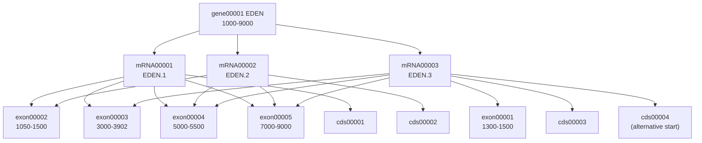

---
aliases:
  - General Feature Format
  - Generic Feature Format
  - GFF3
  - GTF
  - Gene Transfer Format
  - GFF2
  - Format GFF
tags:
  - type/concept
  - domain/bioinformatics
  - domain/computer-science
  - domain/biology
  - level/L1
  - level/L2
  - level/L3
mastery: 0
prerequisites:
  - "[[Genomic Coordinate System]]"
  - "[[Gene]]"
  - "[[Reference Genome]]"
  - "[[Delimited Text Format]]"
related:
  - "[[BED Format]]"
  - "[[GenBank Format]]"
  - "[[Gene Annotation]]"
  - "[[Genome Browser]]"
  - "[[Alternative Splicing]]"
  - "[[Biological Ontology]]"
  - "[[Directed Acyclic Graph]]"
projects:
  - "[[09-genome-browser]]"
  - "[[02-sequence-translation]]"
  - "[[bio-core]]"
sources:
  - "[[Sequence Ontology GFF3 Specification]]"
  - "[[UCSC Genome Browser]]"
  - "[[Ensembl]]"
  - "[[GA4GH hts-specs]]"
  - "[[Integrative Genomics Viewer]]"
---

# GFF Format

> [!abstract]
> GFF is the tab-separated format for gene models: one line per feature (gene, mRNA, exon, CDS) with 1-based closed coordinates, and a ninth column of attributes whose `ID` and `Parent` tags link exons and CDSs to transcripts and transcripts to genes.

## Definition

The **General Feature Format** (GFF) is a family of nine-column, tab-delimited text formats describing features located on sequences. Its current version, **GFF3**, is defined by the Sequence Ontology project: feature types come from the Sequence Ontology, coordinates are 1-based and closed, and a `Parent` attribute builds multi-level hierarchies.[^gff3][^samterm] **GTF** (Gene Transfer Format, GTF2.2) is an older dialect built on GFF2, in which `gene_id` and `transcript_id` attributes group lines into transcripts and genes.[^ucscgtf][^ensembl]

## Why it matters

- **It is how genomes are annotated.** Annotation databases such as [[Ensembl]] distribute and document their gene models in these formats, and [[Gene Annotation]] pipelines write them; the "operational gene" of bioinformatics is a GFF hierarchy ([[Gene#The operational gene of bioinformatics]]).[^ensembl]
- **Every transcript-level analysis reads it.** Quantifying transcripts, predicting the effect of a variant, extracting a coding sequence to translate ([[02-sequence-translation]]) all start from exon and CDS coordinates.
- **Browsers draw it.** IGV opens GFF2, GFF3 and GTF files as annotation tracks; UCSC custom tracks accept GFF (GFF2) and GTF.[^igv][^ucscgff] [[09-genome-browser]] must parse it.
- **Its hierarchy is the hard part.** Exons shared by several transcripts, CDSs spread over several lines, parents declared after their children: a line-by-line reader is not enough.

## Core (L1)

### Specification (GFF3, version 1.26)

A GFF3 file is plain text with nine **tab-separated** columns per feature line; an undefined field is written `.`.[^gff3]

| # | Column | Content |
|---:|---|---|
| 1 | `seqid` | the sequence (landmark) the coordinates refer to, e.g. `chr1`, `ctg123` |
| 2 | `source` | free text: the program or database that produced the feature |
| 3 | `type` | a Sequence Ontology term or accession (`gene`, `mRNA`, `exon`, `CDS`, `SO:0000147`) |
| 4-5 | `start`, `end` | positive **1-based** integers, `start` ≤ `end`, relative to `seqid` |
| 6 | `score` | floating-point number, meaning ill-defined |
| 7 | `strand` | `+`, `-`, `.` (unstranded) or `?` (stranded, unknown) |
| 8 | `phase` | for `CDS` only, **required**: 0, 1 or 2, the number of bases to skip from the 5' end of this CDS line to the start of the next codon |
| 9 | `attributes` | `tag=value` pairs separated by `;`, multiple values separated by `,` |

Rules a reader must respect:[^gff3]

- **Split on tabs only**: spaces are allowed inside fields.
- **Escaping**: tab, newline, carriage return, `%` and control characters are percent-encoded (`%09`, `%25`...), and so are `;`, `=`, `&` and `,` when they appear inside column 9 values. Decode *after* splitting.
- **Reserved attributes** start with an uppercase letter: `ID` (unique in the file; required for features that have children or span several lines), `Name`, `Alias`, `Parent`, `Target`, `Gap`, `Derives_from`, `Note`, `Dbxref`, `Ontology_term`, `Is_circular`. Tags are case-sensitive: `parent` is not `Parent`.
- **Parent** expresses only a part-of relationship; a feature may have several parents (`Parent=mRNA00001,mRNA00003`); cycles are errors.
- **One feature on several lines**: lines sharing an `ID` form one discontinuous feature, typically a CDS split across exons.
- **Directives**: `##gff-version 3` must be the first line; `##sequence-region seqid start end` gives bounds; `###` declares that all forward references so far are resolved; `##FASTA` ends the features and starts FASTA sequences. Lines starting with a single `#` are comments; end-of-line comments are not allowed.
- **CDS content**: the start and stop codons are included in the CDS; UTRs are implied by exons minus CDS and need not be written.

### Minimal example

Transcript EDEN.3 of the specification's "canonical gene", with the other two transcripts removed (so each exon lists only `mRNA00003` as parent); columns are separated by tabs:[^gff3]

```text
##gff-version 3
##sequence-region ctg123 1 1497228
ctg123	.	gene	1000	9000	.	+	.	ID=gene00001;Name=EDEN
ctg123	.	mRNA	1300	9000	.	+	.	ID=mRNA00003;Parent=gene00001;Name=EDEN.3
ctg123	.	exon	1300	1500	.	+	.	ID=exon00001;Parent=mRNA00003
ctg123	.	exon	3000	3902	.	+	.	ID=exon00003;Parent=mRNA00003
ctg123	.	exon	5000	5500	.	+	.	ID=exon00004;Parent=mRNA00003
ctg123	.	exon	7000	9000	.	+	.	ID=exon00005;Parent=mRNA00003
ctg123	.	CDS	3301	3902	.	+	0	ID=cds00003;Parent=mRNA00003;Name=edenprotein.3
ctg123	.	CDS	5000	5500	.	+	1	ID=cds00003;Parent=mRNA00003;Name=edenprotein.3
ctg123	.	CDS	7000	7600	.	+	1	ID=cds00003;Parent=mRNA00003;Name=edenprotein.3
###
```

Read it top-down: a gene contains an mRNA, which contains four exons and one CDS written on three lines (same `ID`). The CDS begins inside the second exon, so the first exon and the start of the second are 5' UTR.

### The hierarchy

The full canonical gene has three transcripts that share exons, so the structure is a [[Directed Acyclic Graph]], not a tree:[^gff3]



## Deeper (L2)

### GTF and GFF2

GTF2.2 keeps the first eight GFF columns and replaces the ninth by a list of `key "value";` pairs, each ending in a semicolon and separated by exactly one space. It must begin with the two mandatory attributes `gene_id` and `transcript_id`, and adds feature types such as `5UTR`, `3UTR` and `intron_CNS`.[^ucscgtf] The hierarchy is **implicit**: the UCSC browser groups lines with the same `transcript_id` into one transcript, using only `exon` and `CDS` lines.[^ucscgtf] Ensembl describes GTF as identical to GFF version 2, with 1-based start and end, `.` for empty columns, chromosome names with or without `chr`, and a `frame` column where `0` means the first base of the feature is the first base of a codon.[^ensembl]

```text
chr1	toy	exon	101	200	.	-	.	gene_id "g1"; transcript_id "t1";
```

| | GFF3 | GTF2.2 |
|---|---|---|
| Column 9 | `ID=t1;Parent=g1` | `gene_id "g1"; transcript_id "t1";` |
| Hierarchy | explicit, any depth, several parents | implicit, two levels (gene, transcript) |
| Types | Sequence Ontology terms | the GFF2 types plus a few defined by GTF2.2 (`exon`, `CDS`, `start_codon`, `5UTR`...) |
| Coordinates | 1-based closed | 1-based closed |

The UCSC format FAQ describes GFF custom tracks in the older GFF2 dialect and states that GFF3 is not supported there, while IGV reads all three dialects and recognizes them by extension (`.gff`, `.gff3`, `.gtf`).[^ucscgff][^igv] Converting between dialects is not neutral: GFF3 hierarchies deeper than gene → transcript → exon have no GTF equivalent, and an exon with several parents becomes one GTF line per transcript.

### Phase in practice

The phase of a CDS line is the number of bases to skip, from its 5' end, before the first complete codon; for a `-` strand CDS the 5' end is the `end` coordinate.[^gff3] It is determined by the CDS lines before it: if they total $L$ bases, the phase is $(3 - L \bmod 3) \bmod 3$. In EDEN.3 the first CDS line has 602 bases ($602 = 3 \times 200 + 2$), so one base is missing to complete a codon and the next line has phase 1. The computation is implemented in [[Gene]]; the GFF3 specification warns not to confuse phase with the reading **frame** of a base.[^gff3]

## Advanced (L3)

**Streaming and forward references.** A `Parent` may name a feature that appears later in the file. Without `###` directives a reader cannot emit a gene until the end of the file; with them, it can release everything seen so far.[^gff3] Large annotation files are therefore read in two passes or grouped by gene with `###`.

**Semantics come from an ontology.** `type` is a Sequence Ontology term, and `Parent` must respect SO part-of relations (an exon is part of a transcript); a relation that is not part-of should raise an error. Because part-of is transitive, "orphan" exons and CDSs predicted without a transcript may be attached directly to the gene.[^gff3] Using SO accessions (`SO:0000147`) makes types unambiguous across tools ([[Biological Ontology]]).

**Beyond genes.** The same nine columns encode alignments (`Target` and a CIGAR-like `Gap` attribute), features crossing the origin of circular sequences (`Is_circular`, with `end` extended past the landmark length), and polycistronic products (`Derives_from`).[^gff3] Parents need not contain their children: an enhancer can be part of a gene far away.[^gff3]

## Mathematical representation

- A GFF3 file defines a finite set of features $F$. Each $f \in F$ has a location set $\mathrm{loc}(f)$, a union of 1-based closed intervals on one `seqid` (one per line sharing its `ID`), a type $\tau(f)$ and a strand.
- `Parent` defines a relation $P \subseteq F \times F$, $(c, p) \in P$ meaning "$c$ is part of $p$". The graph $(F, P)$ must be **acyclic** (a [[Directed Acyclic Graph]]); it is a forest only if no feature has two parents.
- For a transcript $t$ with exons $E_t = \{c : (c, t) \in P,\ \tau(c) = \text{exon}\}$, its spliced length is $\sum_{c \in E_t} |\mathrm{loc}(c)|$, and for its CDS $d$ (possibly one feature on several lines) the translated length is $|\mathrm{loc}(d)| \equiv 0 \pmod 3$ for a complete CDS, start and stop codons included.
- Phase of the $i$-th CDS segment in 5' → 3' order: $\phi_i = (3 - (\sum_{j < i} \ell_j) \bmod 3) \bmod 3$ with $\ell_j$ the segment lengths.

## Computational representation

A reader in two steps: parse lines into features (validation, percent-decoding, multi-valued attributes, `##FASTA`), then build the hierarchy (group lines by `ID`, attach children to their parents, reject unknown parents and cycles). Standard library only.

```python
from collections import defaultdict
from dataclasses import dataclass
from urllib.parse import unquote

class GffError(ValueError):
    pass

@dataclass
class Feature:
    seqid: str
    source: str
    type: str
    start: int                                  # 1-based, closed
    end: int
    score: float | None
    strand: str
    phase: int | None
    attrs: dict[str, list[str]]

    @property
    def id(self) -> str | None:
        return self.attrs.get("ID", [None])[0]

def parse_attributes(text: str) -> dict[str, list[str]]:
    """Column 9: split on ';' then '=' then ','; decode %XX escapes last."""
    attrs: dict[str, list[str]] = {}
    for pair in filter(None, (p.strip() for p in text.split(";"))):
        tag, sep, value = pair.partition("=")
        if not sep:
            raise GffError(f"attribute {pair!r} is not tag=value")
        attrs[unquote(tag)] = [unquote(v) for v in value.split(",")]
    return attrs

def parse_gff3(lines):
    """Yield one Feature per feature line; stop at ##FASTA."""
    for no, raw in enumerate(lines, 1):
        line = raw.rstrip("\r\n")
        if no == 1 and not line.startswith("##gff-version 3"):
            raise GffError("line 1: a GFF3 file starts with ##gff-version 3")
        if line.startswith("##FASTA"):
            return                                      # the rest is FASTA sequence
        if not line.strip() or line.startswith("#"):
            continue                                    # blank, comment, directive, ###
        cols = line.split("\t")                         # tabs only: spaces are data
        if len(cols) != 9:
            raise GffError(f"line {no}: {len(cols)} tab-separated columns, need 9")
        seqid, source, ftype, start, end, score, strand, phase, attrs = cols
        try:
            f = Feature(unquote(seqid), unquote(source), unquote(ftype), int(start), int(end),
                        None if score == "." else float(score), strand,
                        None if phase == "." else int(phase),
                        {} if attrs == "." else parse_attributes(attrs))
        except ValueError as err:
            raise GffError(f"line {no}: {err}") from None
        if not 1 <= f.start <= f.end:
            raise GffError(f"line {no}: need 1 <= start <= end")
        if f.strand not in {"+", "-", ".", "?"}:
            raise GffError(f"line {no}: bad strand {f.strand!r}")
        if f.type == "CDS" and f.phase not in (0, 1, 2):
            raise GffError(f"line {no}: a CDS needs a phase of 0, 1 or 2")
        yield f

def build_hierarchy(features):
    """Group lines sharing an ID (one discontinuous feature) and link children to parents."""
    by_id: dict[str, list[Feature]] = defaultdict(list)
    children: dict[str, list[Feature]] = defaultdict(list)
    for f in features:
        if f.id:
            by_id[f.id].append(f)
    for f in features:
        for parent in f.attrs.get("Parent", []):       # zero, one or several parents
            if parent not in by_id:
                raise GffError(f"{f.type} {f.start}-{f.end}: unknown Parent {parent!r}")
            children[parent].append(f)
    def visit(fid: str, path: tuple[str, ...]):         # part-of links must not loop
        if fid in path:
            raise GffError("Parent cycle: " + " -> ".join(path + (fid,)))
        for child in children.get(fid, []):
            if child.id:
                visit(child.id, path + (fid,))
    for fid in by_id:
        visit(fid, ())
    return by_id, children

toy = """##gff-version 3
chrT|.|exon|101|200|.|+|.|Parent=t1,t2
chrT|.|exon|301|400|.|+|.|Parent=t1
chrT|.|gene|101|400|.|+|.|ID=g1;Name=toy%3Bgene
chrT|.|mRNA|101|400|.|+|.|ID=t1;Parent=g1
chrT|.|mRNA|101|200|.|+|.|ID=t2;Parent=g1
chrT|.|CDS|151|200|.|+|0|ID=c1;Parent=t1
chrT|.|CDS|301|349|.|+|1|ID=c1;Parent=t1
###
##FASTA
>chrT
ACGT"""                                  # invented toy locus; '|' stands for a tab

def read(text: str):
    return build_hierarchy(list(parse_gff3(text.replace("|", "\t").splitlines())))

by_id, children = read(toy)
print(by_id["g1"][0].attrs["Name"], len(by_id["c1"]), "lines with ID c1")
for mrna in children["g1"]:
    kids = children[mrna.id]
    print(mrna.id, "exons", [(k.start, k.end) for k in kids if k.type == "exon"],
          "CDS", [(k.start, k.end, k.phase) for k in kids if k.type == "CDS"])

for label, body in [("missing parent", "chrT|.|exon|1|9|.|+|.|Parent=tx9"),
                    ("cycle", "chrT|.|mRNA|1|9|.|+|.|ID=a;Parent=b\nchrT|.|gene|1|9|.|+|.|ID=b;Parent=a"),
                    ("CDS without phase", "chrT|.|CDS|1|9|.|+|.|ID=c"),
                    ("spaces, not tabs", "chrT . exon 1 9 . + . ID=e")]:
    try:
        read("##gff-version 3\n" + body)
    except GffError as err:
        print(f"{label}: {err}")
```

Output:

```text
['toy;gene'] 2 lines with ID c1
t1 exons [(101, 200), (301, 400)] CDS [(151, 200, 0), (301, 349, 1)]
t2 exons [(101, 200)] CDS []
missing parent: exon 1-9: unknown Parent 'tx9'
cycle: Parent cycle: a -> b -> a
CDS without phase: line 2: a CDS needs a phase of 0, 1 or 2
spaces, not tabs: line 2: 1 tab-separated columns, need 9
```

The exon at 101-200 is shared by `t1` and `t2`, and was read *before* its parents were declared; `%3B` decoded to `;` inside the gene name; the CDS `c1` is one feature on two lines. A GTF line needs a different column 9 reader:

```python
import re

def parse_gtf_attributes(text: str) -> dict[str, str]:
    """GTF column 9: key "value"; pairs (quotes optional for numbers)."""
    return {k: v.strip('"') for k, v in re.findall(r'(\S+) ("[^"]*"|[^;\s]+);?', text)}

print(parse_gtf_attributes('gene_id "Em:U62317.C22.6.mRNA"; transcript_id "Em:U62317.C22.6.mRNA"; exon_number 1'))
```

```text
{'gene_id': 'Em:U62317.C22.6.mRNA', 'transcript_id': 'Em:U62317.C22.6.mRNA', 'exon_number': '1'}
```

(The attribute string is the GTF example of the UCSC format FAQ.)[^ucscgtf]

### Pitfalls

- **Coordinates**: 1-based closed. The Python slice of a feature is `seq[start - 1:end]`; the BED line is `start - 1, end` ([[Genomic Coordinate System]]).
- **Split on tabs, decode last**: splitting on whitespace breaks values with spaces; decoding before splitting turns `%3B` into a separator.[^gff3]
- **`Parent` is a case-sensitive list, and one `ID` can span several lines**: collect all parents and all lines before computing lengths or sequences.[^gff3]
- **Dialect and assembly**: check `##gff-version 3` or the attribute syntax before choosing a reader, and the [[Reference Genome]] the `seqid`s refer to.

## Worked example

> [!example] Reading transcript EDEN.3
> Using the minimal example above:[^gff3]
> 1. **Exons** (1-based closed): 1300-1500 (201 bp), 3000-3902 (903), 5000-5500 (501), 7000-9000 (2,001): transcript length 3,606 nt.
> 2. **CDS** `cds00003` on three lines: 3301-3902 (602), 5000-5500 (501), 7000-7600 (601): 1,704 nt = 568 codons, stop codon included.
> 3. **UTRs** (implied, not written): 5' UTR = 1300-1500 and 3000-3300 = 201 + 301 = 502 nt; 3' UTR = 7601-9000 = 1,400 nt. Check: $502 + 1{,}704 + 1{,}400 = 3{,}606$.
> 4. **Phases**: 0 for the first CDS line; $602 \bmod 3 = 2$, so the second line starts with the last base of a split codon: phase 1; $(602 + 501) \bmod 3 = 2$ again: phase 1. Both match the file.
> 5. **As BED**: the first exon is `ctg123 1299 1500`; the whole transcript is one BED12 line ([[BED Format]]).

## Common misconceptions

> [!warning] "Every line has a unique ID"
> `ID` is optional for leaves, and one `ID` may span several lines when a feature is discontinuous, as a CDS split over exons is.[^gff3] Counting lines is not counting features.

> [!warning] "The annotation is a tree"
> One exon can have several `Parent`s (shared by alternative transcripts), so the hierarchy is a directed acyclic graph.[^gff3] Code that stores one parent per feature silently drops transcripts.

> [!warning] "Phase and frame are the same thing"
> Phase is about the CDS line (bases to skip before the next codon starts); frame usually refers to a base's codon position relative to the start of the ORF. The specification warns against confusing them.[^gff3]

> [!warning] "GTF is GFF3 with another extension"
> GTF is a GFF2 dialect: `key "value";` attributes, mandatory `gene_id` and `transcript_id`, no `ID`/`Parent`.[^ucscgtf][^ensembl] A GFF3 parser fails or silently finds no hierarchy.

## Exercises

> [!question] Exercise 1 (L1)
> For the canonical-gene line `ctg123 . exon 5000 5500 . + . ID=exon00004;Parent=mRNA00001,mRNA00002,mRNA00003`, give its length, its BED coordinates and the transcripts containing it.

> [!success]- Solution
> Length $5500 - 5000 + 1 = 501$ bp; BED `ctg123 4999 5500`; it belongs to the three mRNAs listed in `Parent`, so it is present in every isoform of EDEN.[^gff3]

> [!question] Exercise 2 (L1)
> Rewrite `chr1 toy exon 101 200 . - . gene_id "g1"; transcript_id "t1";` as a GFF3 exon line. Which additional lines does a valid GFF3 file need?

> [!success]- Solution
> `chr1	toy	exon	101	200	.	-	.	Parent=t1` (coordinates unchanged: both dialects are 1-based closed). The file also needs `##gff-version 3` as its first line, an mRNA line with `ID=t1;Parent=g1` and a gene line with `ID=g1`, because GFF3 `Parent` values must refer to features in the file.[^gff3]

> [!question] Exercise 3 (L2, Python)
> Save the minimal example as `eden3.gff3`. With `parse_gff3` and `build_hierarchy`, compute the exonic, 5' UTR, CDS and 3' UTR lengths of `mRNA00003`.

> [!success]- Solution
> ```python
> with open("eden3.gff3") as handle:                 # the minimal example, saved as a file
>     by_id, children = build_hierarchy(list(parse_gff3(handle)))
> kids = children["mRNA00003"]
> exons = sorted((k.start, k.end) for k in kids if k.type == "exon")
> cds = sorted((k.start, k.end) for k in kids if k.type == "CDS")
> cds_start, cds_end = cds[0][0], cds[-1][1]
>
> def size(a: int, b: int) -> int:                    # bases in [a, b], 0 if empty
>     return max(0, b - a + 1)
>
> exonic = sum(size(s, e) for s, e in exons)
> utr5 = sum(size(s, min(e, cds_start - 1)) for s, e in exons)   # + strand: 5' UTR on the left
> utr3 = sum(size(max(s, cds_end + 1), e) for s, e in exons)
> coding = sum(size(s, e) for s, e in cds)
> print(exonic, utr5, coding, utr3, utr5 + coding + utr3 == exonic, coding % 3)
> # 3606 502 1704 1400 True 0
> ```
>
> The UTRs are not in the file: they are computed as exonic bases outside the CDS span, as the specification intends.[^gff3] On the `-` strand, left and right swap.

> [!question] Exercise 4 (L2, Python)
> The five exons of the canonical gene have these parents: `exon00001` → mRNA00003; `exon00002` → mRNA00001, mRNA00002; `exon00003` → mRNA00001, mRNA00003; `exon00004` and `exon00005` → all three. List each transcript's exons and the exons present in every transcript. Which splicing events distinguish the isoforms?

> [!success]- Solution
> ```python
> exon_parents = {
>     "exon00001": ["mRNA00003"],
>     "exon00002": ["mRNA00001", "mRNA00002"],
>     "exon00003": ["mRNA00001", "mRNA00003"],
>     "exon00004": ["mRNA00001", "mRNA00002", "mRNA00003"],
>     "exon00005": ["mRNA00001", "mRNA00002", "mRNA00003"],
> }
> transcripts = sorted({t for parents in exon_parents.values() for t in parents})
> for t in transcripts:
>     print(t, [e for e, parents in exon_parents.items() if t in parents])
> print("in every transcript:", [e for e, p in exon_parents.items() if len(p) == len(transcripts)])
> # mRNA00001 ['exon00002', 'exon00003', 'exon00004', 'exon00005']
> # mRNA00002 ['exon00002', 'exon00004', 'exon00005']
> # mRNA00003 ['exon00001', 'exon00003', 'exon00004', 'exon00005']
> # in every transcript: ['exon00004', 'exon00005']
> ```
>
> EDEN.2 skips exon00003 (exon skipping); EDEN.3 starts with exon00001 (1300-1500) instead of exon00002 (1050-1500), an alternative first exon ([[Alternative Splicing]]). Inverting `Parent` is the basic operation behind every isoform comparison.

> [!question] Exercise 5 (L3)
> The canonical gene of the GFF3 specification has four CDSs: `cds00001` = 1201-1500, 3000-3902, 5000-5500, 7000-7600 (phases 0, 0, 0, 0); `cds00002` = 1201-1500, 5000-5500, 7000-7600 (0, 0, 0); `cds00003` = 3301-3902, 5000-5500, 7000-7600 (0, 1, 1); `cds00004` = 3391-3902, 5000-5500, 7000-7600 (0, 1, 1). Check the phases and the total lengths. What do you conclude?

> [!success]- Solution
> Part lengths: 1201-1500 = 300, 3000-3902 = 903, 5000-5500 = 501, 7000-7600 = 601, 3301-3902 = 602, 3391-3902 = 512. Phases with $\phi_i = (3 - (\sum_{j<i} \ell_j) \bmod 3) \bmod 3$: `cds00001` and `cds00002` have preceding totals divisible by 3 (300, 1203, 1704 and 300, 801), so 0, 0, 0; `cds00003` has 602 then 1103, both $\equiv 2$, so 0, 1, 1; `cds00004` has 512 then 1013, both $\equiv 2$, so 0, 1, 1. Every published phase is consistent. Totals: 2,305 and 1,402 ($\equiv 1 \bmod 3$) versus 1,704 and 1,614 ($\equiv 0$). Since GFF3 CDSs include the stop codon,[^gff3] `cds00001` and `cds00002` cannot be complete coding sequences: the canonical gene illustrates syntax, not a real gene. A validator should check both properties, because a file can be syntactically perfect and biologically impossible.

> [!question] Exercise 6 (L3)
> A 2 GB GFF3 file lists each gene's exons before its transcript and gene lines, and contains no `###` directive. Explain why a reader cannot emit any complete gene before the end of the file, and two ways to fix the problem.

> [!success]- Solution
> A child may reference a parent that appears later, and nothing guarantees that a gene has no further parts until the file ends, so a single-pass reader must keep every feature in memory.[^gff3] Fixes: (1) the writer emits `###` after each gene, which declares all forward references resolved and lets the reader release the gene;[^gff3] (2) the reader makes two passes, a first one indexing `ID` and `Parent` values (small) and a second one assembling one gene at a time, or the file is sorted and grouped by gene before reading. The same reasoning applies to [[09-genome-browser]], which must never load a whole annotation to draw one region ([[Genomic File Indexing]]).

## Mastery checklist

- [ ] 1 Recognized: I can name the nine GFF columns and tell GFF3 from GTF by column 9.
- [ ] 2 Understood: I can explain `ID`, `Parent`, multi-line features, phase and why the hierarchy is a DAG.
- [ ] 3 Practiced: I can parse GFF3 and GTF in Python, rebuild transcripts and compute UTR, CDS and phase values.
- [ ] 4 Applied: [[09-genome-browser]] loads a real Ensembl GFF3 or GTF file and draws its transcripts correctly on both strands.
- [ ] 5 Explained: I can teach the dialect differences, the validation checks and why conversions between GFF3, GTF and BED lose information.

## References

[^gff3]: [[Sequence Ontology GFF3 Specification]], version 1.26 (Stein, 2020): "Description of the Format", "The Canonical Gene" and its notes, "Circular Genomes", "Parent (part_of) Relationships", "Alignments", "Other Syntax" (directives).
[^ucscgtf]: [[UCSC Genome Browser]], FAQ "Data File Formats", section "GTF format" (GTF2.2 attributes and grouping by `transcript_id`, with the attribute example used above).
[^ucscgff]: [[UCSC Genome Browser]], FAQ "Data File Formats", section "GFF format" (GFF2 fields; GFF3 not supported for custom tracks).
[^ensembl]: [[Ensembl]], help page "GFF/GTF File Format" (nine fields, 1-based coordinates, frame, attributes); annotation distributed by release.
[^igv]: [[Integrative Genomics Viewer]], desktop documentation, "File Formats": GFF2, GFF3 and GTF, recognized by extension.
[^samterm]: [[GA4GH hts-specs]], `SAMv1`, "Terminology" (GFF among the 1-based formats).
