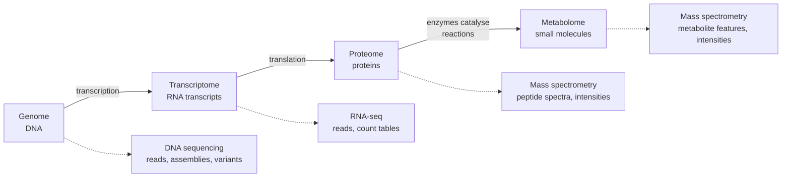

---
aliases:
  - Omics Layers
  - Omics Data
  - "-omics"
  - Omique
tags:
  - type/concept
  - domain/bioinformatics
  - domain/biology
  - level/L1
  - level/L2
  - level/L3
mastery: 0
prerequisites:
  - "[[Central Dogma]]"
  - "[[Genome]]"
  - "[[Gene Expression]]"
  - "[[Metabolism]]"
related:
  - "[[Genomics]]"
  - "[[Transcriptome]]"
  - "[[Proteome]]"
  - "[[Metabolomics]]"
  - "[[Epigenomics]]"
  - "[[Metagenomics]]"
  - "[[Multi-Omics Integration]]"
  - "[[Biological Database]]"
  - "[[Next-Generation Sequencing]]"
  - "[[RNA Sequencing]]"
  - "[[Mass Spectrometry]]"
projects:
  - "[[bio-core]]"
  - "[[10-genomic-pipeline]]"
sources:
  - "[[Biology 2e (OpenStax)]]"
  - "[[Wang 2009 - RNA-Seq - A Revolutionary Tool for Transcriptomics]]"
  - "[[Shendure 2008 - Next-Generation DNA Sequencing]]"
  - "[[Patti 2012 - Metabolomics - The Apogee of the Omics Trilogy]]"
  - "[[Hasin 2017 - Multi-Omics Approaches to Disease]]"
  - "[[Nurk 2022 - The Complete Sequence of a Human Genome]]"
  - "[[Galaxy Training Network - Training Material]]"
---

# Omics

> [!abstract]
> "Omics" are the fields that measure a whole class of molecules at once: all the DNA (genome), all the RNA transcripts (transcriptome), all the proteins (proteome), all the small metabolites (metabolome), each producing its own kind of data.

## Definition

The suffix **-ome** names the complete set of one kind of molecule, and **-omics** the field that measures that set globally rather than one molecule at a time:

- **Genomics** studies entire genomes: the complete set of genes, their nucleotide sequence and organization, and their interactions.[^os17]
- The **transcriptome** is the complete set of transcripts in a cell, with their quantities, for a given developmental stage or physiological condition.[^wang]
- The **proteome** is the entire set of proteins that a cell type produces; **proteomics** studies it.[^os175]
- The **metabolome** is the complete set of metabolites related to an organism's genetic makeup; **metabolomics** studies these small molecules.[^os175]

## Why it matters

- **The layer decides the data.** A genome project delivers reads, assemblies and variants; a transcriptome study delivers a count table; proteomics and metabolomics deliver mass spectra. Recognizing the layer tells you which formats ([[FASTQ Format]], [[FASTA Format]], [[VCF Format]]), tools and statistics apply.
- **Databases are organized by layer**: nucleotide archives for sequences, protein knowledge bases for proteins, structure archives for 3D models ([[Biological Database]]).
- **The curriculum follows the layers**: [[Genomics]], [[Transcriptomics]], [[Proteomics]] (which ends with [[Metabolomics]]), and [[Systems Biology]] with [[Multi-Omics Integration]].
- **Lab projects**: [[10-genomic-pipeline]] works on the genome layer; [[bio-core]] models the objects of each layer (DNA, RNA, protein) as types.

## Core (L1)

The four classic layers follow the [[Central Dogma]]: DNA is transcribed into RNA, RNA is translated into protein, and proteins (enzymes) catalyse the reactions that make and transform metabolites.[^os-u2]



| Layer | Molecules | What it tells you | Main measurement | Typical data |
|---|---|---|---|---|
| Genome | DNA | What can be encoded | Massively parallel DNA sequencing[^shendure] | Reads ([[FASTQ Format]]), assemblies ([[FASTA Format]]), variants ([[VCF Format]]) |
| Transcriptome | RNA transcripts | Which genes are expressed, how much, which isoforms[^wang] | RNA sequencing ([[RNA Sequencing]])[^wang] | Reads, then a genes by samples [[Count Matrix]] |
| Proteome | Proteins | Which proteins the cell actually makes[^os175] | [[Mass Spectrometry]][^os175] | Spectra, peptide and protein identifications, intensities |
| Metabolome | Small-molecule metabolites | A functional readout of cellular biochemistry[^patti] | Mass spectrometry[^patti] | Spectral features by samples, with intensities |

**Static versus dynamic.** All cells of a multicellular organism carry the same set of genes, but the proteins made differ between tissues and change with gene expression: the genome is essentially constant while the proteome varies.[^os175] The same holds for the transcriptome, whose definition includes the stage and condition of the cell.[^wang] A transcriptome, proteome or metabolome measurement is therefore a **snapshot** of one sample at one moment.

**Sequencing is not the only instrument.** Genomes and transcriptomes are read by sequencing; proteins and metabolites are not sequenced but identified by mass spectrometry.[^os175][^patti]

**More -omes.** The same naming extends to other sets: the [[Epigenomics|epigenome]] (chemical marks on DNA and chromatin), the metagenome of a microbial community ([[Metagenomics]], [[Microbiome]]), and others surveyed with the classic four in reviews of multi-omics.[^hasin]

## Deeper (L2)

**Two shapes of data.** Genome data are sequences and positions on a [[Reference Genome]]. The other layers are mostly **matrices**: rows are features (genes, transcripts, proteins, metabolite signals), columns are samples, values are counts (RNA-seq) or intensities (mass spectrometry). Most of the statistics taught in [[Transcriptomics]] and [[Proteomics]] start from such a matrix.

**Layers are not one-to-one.** One gene can give several transcripts, and RNA-seq can measure transcript isoforms separately.[^wang] A transcript may code for no protein ([[Non-Coding RNA]]), and metabolites are not encoded by genes at all: they are made and transformed by enzymes.[^os-u2] Linking layers therefore means following **relations**, not functions (see the Mathematical representation), which is why [[Identifier Mapping]] is a skill of its own and why "the protein level of a gene" is ambiguous.

**Relative measurements.** A count or an intensity is meaningful relative to the rest of the sample: if one gene takes a larger share of the reads, every other gene's share falls even if its absolute amount did not change (Exercise 4). This is the reason for [[Count Normalization]].

**Scale.** A haploid human genome is about $3.055 \times 10^9$ bp.[^nurk] Sequenced 30 times over, it gives about $9 \times 10^{10}$ bases of reads, far more than a typical RNA-seq sample (Exercise 5). Data volume decides where an analysis can run: a laptop, a server or a cluster.

## Advanced (L3)

- **Integration.** Combining layers measured on the same samples lets an analysis follow the flow of information from genetic variation to disease, instead of observing one level in isolation.[^hasin] A typical integrative question: does a variant found by a [[Genome-Wide Association Study]] change the expression of a nearby gene (transcriptome), then a protein and, downstream, metabolite levels ([[Multi-Omics Integration]])?
- **Closest to phenotype.** Because metabolites are the substrates and products of metabolism, the metabolome is the most direct functional readout of what the cell is doing, which is why it has been called the apogee of the omics trilogy.[^patti]
- **Layer-aware databases.** Protein identification searches spectra against a protein sequence database in [[FASTA Format]], for example [[UniProt]] sequences; [[Proteogenomics]] builds such databases from the sample's own genomic and transcriptomic data.[^gtn] The layers meet in the data, not only in the cell.
- **Choosing a layer is a design decision.** The question fixes the layer: inherited predisposition is a genome question, a response within hours is an expression, protein or metabolite question (Exercise 6).

## Mathematical representation

- **Genome**: a set of chromosome sequences $\{g_1, \dots, g_c\}$ with $g_k \in \Sigma^{N_k}$, $\Sigma = \{A, C, G, T\}$ ([[DNA]]).
- **Other layers**: for a layer $L$ with feature set $F_L$ (transcripts, proteins or metabolite signals), one sample $j$ is a vector $x_j \in \mathbb{R}_{\ge 0}^{|F_L|}$; for RNA-seq, $x_j \in \mathbb{N}^{|F_L|}$ (read counts). A study with $m$ samples is a matrix $X_L \in \mathbb{R}_{\ge 0}^{|F_L| \times m}$.
- **Cross-layer links** are relations: $R_{GT} \subseteq \text{Genes} \times \text{Transcripts}$ and $R_{TP} \subseteq \text{Transcripts} \times \text{Proteins}$. Gene-to-protein is their composition
$$R_{GP} = R_{TP} \circ R_{GT} = \{(g, p) : \exists t,\ (g, t) \in R_{GT} \wedge (t, p) \in R_{TP}\},$$
which is in general neither a function (one gene, several proteins) nor total (a non-coding gene has no protein).
- **Relative abundance**: $\pi_i = x_i / \sum_k x_k$. Since $\sum_i \pi_i = 1$, an increase of one $\pi_i$ forces a decrease of the others: shares are compositional.

## Computational representation

A dictionary per layer, and dictionaries of sets for the relations between layers ([[Hash Table]], [[Set]]):

```python
from collections import defaultdict

# Toy data for one sample, one dictionary per layer (all names and values invented).
genome = {"chr1": "ATGGCCATTGTAATGGGCCGCTGAAAGGGTGCCCGATAG"}  # layer 1: sequences
transcripts_of = {"G1": {"T1", "T2"}, "G2": {"T3"}}          # gene -> transcripts
proteins_of = {"T1": {"P1"}, "T2": {"P2"}, "T3": set()}       # transcript -> proteins (T3 non-coding)
rna_counts = {"T1": 120, "T2": 30, "T3": 850}                 # layer 2: read counts
protein_intensity = {"P1": 5.2e6, "P2": 0.8e6}                # layer 3: MS intensities
metabolite_intensity = {"feature_001": 3.1e5}                 # layer 4: MS features, encoded by no gene


def compose(r1: dict, r2: dict) -> dict:
    """Relation composition r2 o r1, e.g. gene -> transcripts -> proteins."""
    out = defaultdict(set)
    for a, bs in r1.items():
        for b in bs:
            out[a] |= r2.get(b, set())
    return dict(out)


proteins_of_gene = compose(transcripts_of, proteins_of)
print({g: sorted(ps) for g, ps in proteins_of_gene.items()})
print("gene -> protein is a function:", all(len(ps) == 1 for ps in proteins_of_gene.values()))

gene_counts = {g: sum(rna_counts[t] for t in ts) for g, ts in transcripts_of.items()}
total = sum(gene_counts.values())
print(gene_counts, {g: round(c / total, 3) for g, c in gene_counts.items()})
```

```text
{'G1': ['P1', 'P2'], 'G2': []}
gene -> protein is a function: False
{'G1': 150, 'G2': 850} {'G1': 0.15, 'G2': 0.85}
```

Summing transcript counts per gene is itself a modelling choice: it hides that G1's two isoforms make different proteins.

## Worked example

> [!example] One question, four layers (invented study)
> A team compares liver samples from fasted and fed mice.
> 1. **Genome**: sequenced once per animal (FASTQ, then VCF). It is identical between the two conditions for a given animal, so it cannot show the response to fasting; it can explain why two strains respond differently.
> 2. **Transcriptome**: one RNA-seq library per sample gives a genes by samples count matrix; differences between conditions suggest which pathways are switched on.
> 3. **Proteome**: mass spectrometry of digested proteins gives spectra, then protein intensities; it checks whether the RNA changes reached the protein level.
> 4. **Metabolome**: mass spectrometry of small molecules gives feature intensities; it shows the biochemical outcome, for instance which energy substrates accumulate.
> 5. **Linking**: each layer has its own identifiers (variant positions, gene IDs, protein accessions, metabolite features); joining them needs explicit mapping tables ([[Identifier Mapping]]).

## Common misconceptions

> [!warning] "Omics means sequencing"
> Genomes and transcriptomes are read by sequencing, but proteins and metabolites are measured by mass spectrometry.[^os175][^patti] Their data are spectra and intensities, not reads.

> [!warning] "A transcriptome is a fixed property of an organism"
> The transcriptome is defined for a cell at a given stage or condition.[^wang] Two tissues, or one tissue before and after a treatment, have different transcriptomes and proteomes, while sharing the same genome.[^os175]

> [!warning] "One gene, one transcript, one protein, so layers map one-to-one"
> Genes can yield several transcript isoforms,[^wang] some transcripts code for no protein, and metabolites are produced by enzymes rather than encoded.[^os-u2] Cross-layer joins are many-to-many relations.

## Exercises

> [!question] Exercise 1 (L1)
> Assign each dataset to its layer: (a) FASTQ files from whole-genome sequencing; (b) a table of read counts for 20,000 genes in 12 samples; (c) mass spectra of peptides from digested proteins; (d) mass spectrometry features measured in blood plasma small molecules; (e) a VCF file of variants.

> [!success]- Solution
> (a) genome, (b) transcriptome, (c) proteome, (d) metabolome, (e) genome (variants are differences from a reference genome). The instrument alone does not decide: (c) and (d) both come from mass spectrometry, and the molecules measured decide the layer.

> [!question] Exercise 2 (L1)
> A liver cell and a neuron come from the same person. Which of the four layers are (essentially) the same, and which differ? Why?

> [!success]- Solution
> The genome is essentially the same: both cells carry the same genes. The transcriptome, proteome and metabolome differ, because the genes expressed, the proteins made and the reactions running depend on the cell type.[^os175]

> [!question] Exercise 3 (L2)
> Using the relations of the Computational representation, explain why "the protein intensity of gene G1" is ambiguous and why G2 has no protein value. Propose two ways to report G1 and state what each hides.

> [!success]- Solution
> $R_{GP}(\text{G1}) = \{\text{P1}, \text{P2}\}$: two proteins from two isoforms, so a single number must be a choice. G2's only transcript T3 is non-coding, so $R_{GP}(\text{G2}) = \emptyset$. Reporting the sum $5.2 \times 10^6 + 0.8 \times 10^6$ hides that the isoforms may differ in function; reporting the major isoform P1 hides P2 entirely. State the rule in the methods.

> [!question] Exercise 4 (L2, Python)
> Counts (invented): control A = 100, B = 100, C = 800; treated A = 100, B = 900, C = 800. Only gene B changed. Compute each gene's share of the sample and explain what happens to A.

> [!success]- Solution
> ```python
> def proportions(counts: dict) -> dict:
>     total = sum(counts.values())
>     return {k: round(v / total, 3) for k, v in counts.items()}
>
>
> control = {"geneA": 100, "geneB": 100, "geneC": 800}   # invented counts
> treated = {"geneA": 100, "geneB": 900, "geneC": 800}   # only geneB changed
> print(proportions(control))
> print(proportions(treated))
> ```
> Output: `{'geneA': 0.1, 'geneB': 0.1, 'geneC': 0.8}` then `{'geneA': 0.056, 'geneB': 0.5, 'geneC': 0.444}`. A's share falls from 0.10 to 0.056 although its count did not change: shares sum to 1, so a rise in B pushes all others down. Normalization methods exist to separate such composition effects from real changes ([[Count Normalization]]).

> [!question] Exercise 5 (L3, Python)
> Estimate the raw FASTQ size of (a) a 30x whole-genome sequencing of a human genome of $3.055 \times 10^9$ bp and (b) an RNA-seq sample of 30 million reads of 100 nt (toy design), assuming 2 bytes per base (one sequence letter and one quality letter, headers ignored).

> [!success]- Solution
> ```python
> GENOME_BP = 3.055e9            # T2T-CHM13 haploid size
> BYTES_PER_BASE = 2             # one sequence letter + one quality letter, headers ignored
>
> wgs_bases = 30 * GENOME_BP                   # 30x whole-genome sequencing
> rnaseq_bases = 30e6 * 100                    # 30 million reads of 100 nt (toy design)
> for name, bases in [("WGS 30x", wgs_bases), ("RNA-seq 30M x 100", rnaseq_bases)]:
>     print(f"{name}: {bases:.2e} bases, about {bases * BYTES_PER_BASE / 1e9:.0f} GB of FASTQ")
> print(round(wgs_bases / rnaseq_bases, 1))
> ```
> Output: `WGS 30x: 9.16e+10 bases, about 183 GB of FASTQ`, `RNA-seq 30M x 100: 3.00e+09 bases, about 6 GB of FASTQ`, then `30.6`. The genome layer is about 30 times heavier per sample in this design: storage and compression ([[Data Compression]]) are part of genomics.

> [!question] Exercise 6 (L3)
> For each question, choose the most informative layer and justify: (a) does a family carry an inherited variant that predisposes to a disease? (b) does a drug change the energy metabolism of cultured cells within one hour? (c) which genes switch on during differentiation of a stem cell?

> [!success]- Solution
> (a) Genome: an inherited variant is in the DNA of every cell, and does not depend on condition. (b) Metabolome first: the question is about metabolism itself, and metabolites are its most direct functional readout;[^patti] proteomics can follow. (c) Transcriptome: which genes are expressed, sample by sample along differentiation.[^wang] Each answer can be strengthened by a second layer, which is the logic of [[Multi-Omics Integration]].

## Mastery checklist

- [ ] 1 Recognized: I can name genome, transcriptome, proteome and metabolome and the molecules each contains.
- [ ] 2 Understood: I can explain which layers are static or dynamic, which instrument measures each, and what data each produces.
- [ ] 3 Practiced: I can represent layers and their many-to-many links in Python and compute shares and data volumes.
- [ ] 4 Applied: I identified the layer, format and database of every dataset used in [[10-genomic-pipeline]], and modeled the layer objects in [[bio-core]].
- [ ] 5 Explained: I can argue which layer answers a given biological question, and what integration of layers adds and costs.

## References

[^os17]: [[Biology 2e (OpenStax)]], ch. 17 "Biotechnology and Genomics", introduction (definition of genomics).
[^os175]: [[Biology 2e (OpenStax)]], ch. 17, section 17.5 "Genomics and Proteomics" (proteome, metabolome, mass spectrometry, dynamic proteome).
[^os-u2]: [[Biology 2e (OpenStax)]], Unit 2 "The Cell" (metabolism and enzymes).
[^wang]: [[Wang 2009 - RNA-Seq - A Revolutionary Tool for Transcriptomics]], *Nature Reviews Genetics*.
[^shendure]: [[Shendure 2008 - Next-Generation DNA Sequencing]], *Nature Biotechnology*.
[^patti]: [[Patti 2012 - Metabolomics - The Apogee of the Omics Trilogy]], *Nature Reviews Molecular Cell Biology*.
[^hasin]: [[Hasin 2017 - Multi-Omics Approaches to Disease]], *Genome Biology*.
[^nurk]: [[Nurk 2022 - The Complete Sequence of a Human Genome]], *Science*.
[^gtn]: [[Galaxy Training Network - Training Material]], topic "Proteomics" (tutorials "Protein FASTA Database Handling" and "Proteogenomics 1: Database Creation").
