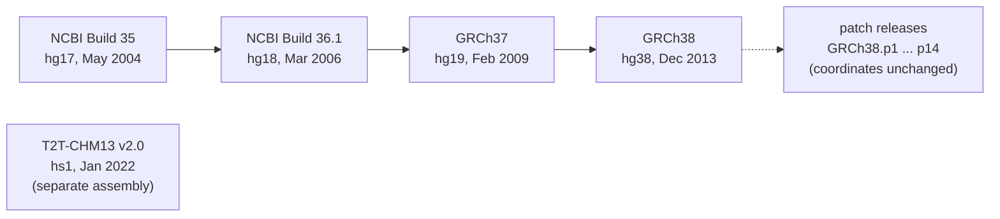

---
aliases:
  - Reference Assembly
  - Genome Build
  - Assembly Release
  - Génome de référence
tags:
  - type/concept
  - domain/bioinformatics
  - domain/biology
  - level/L1
  - level/L2
  - level/L3
mastery: 0
prerequisites:
  - "[[Genome]]"
  - "[[Chromosome]]"
  - "[[Accession Number]]"
  - "[[FASTA Format]]"
related:
  - "[[Genomic Coordinate System]]"
  - "[[Genome Assembly]]"
  - "[[Genome Browser]]"
  - "[[BED Format]]"
  - "[[GFF Format]]"
  - "[[Genetic Variant]]"
  - "[[Pangenome]]"
  - "[[Reference Data Management]]"
projects:
  - "[[09-genome-browser]]"
  - "[[10-genomic-pipeline]]"
  - "[[03-genome-diff]]"
sources:
  - "[[Genome Reference Consortium]]"
  - "[[UCSC Genome Browser]]"
  - "[[Nurk 2022 - The Complete Sequence of a Human Genome]]"
  - "[[IHGSC 2004 - Finishing the Euchromatic Sequence of the Human Genome]]"
  - "[[Lander 2001 - Initial Sequencing and Analysis of the Human Genome]]"
  - "[[GA4GH hts-specs]]"
  - "[[Integrative Genomics Viewer]]"
  - "[[Ensembl]]"
---

# Reference Genome

> [!abstract]
> A reference genome is one published, versioned set of chromosome sequences for a species; every genomic position ("chr19:44,908,684") is an offset into one of those sequences, so a coordinate means nothing until you know which release it refers to.

## Definition

A **reference genome** (reference assembly) is a genome assembly adopted as the standard representation of a species: a named set of sequences (chromosomes and additional scaffolds) with fixed names and lengths.[^grc] An **assembly release** is one frozen version of it, such as GRCh37 (February 2009), GRCh38 (December 2013) or T2T-CHM13 (2022).[^ucscrel] The release is the **coordinate system** of all annotations and data built on it: IGV, for example, requires a reference genome, which "serves as the coordinate system" for every track it displays.[^igv]

## Why it matters

- **Every positional file depends on it.** BED, GFF, VCF and SAM store positions on named sequences, not biology. The BED specification lists the genome assembly among the information that must be supplied *outside* the file; SAM and VCF headers can record it (`@SQ AS:` and `M5:` tags, `##contig=<...,assembly=...,md5=...>`).[^bed][^sam][^vcf]
- **Mixing releases is a silent bug.** The APOE variant rs429358 sits at chr19:50,103,781 in hg18 and chr19:44,908,684 in hg38: same variant, same chromosome name, positions 5.2 Mb apart.[^ucscrel] A BED file from one release read on another shows the wrong genes without any error message.
- **Pipelines start by choosing one.** Read mapping, variant calling and annotation in [[10-genomic-pipeline]] must all use the same release, and [[Reference Data Management]] exists to record which one. Annotation databases version their gene models by release too.[^ensembl]
- **Browsers are organized by it.** The [[Genome Browser]] you build in [[09-genome-browser]] draws every track on one reference axis.

## Core (L1)

**From assembly to reference.** Sequencing reads are assembled into long sequences ([[Genome Assembly]]); one assembly per species is then curated, maintained and published as the reference, with a name and a release date.[^grc] The public human draft appeared in 2001;[^lander] the "finished" euchromatic sequence of 2004 (NCBI Build 35) still had 341 gaps;[^ihgsc] the first gapless human sequence, T2T-CHM13, came in 2022.[^nurk]



*Solid arrows: each new release changes coordinates; the dotted arrow leads to patches, which do not. Names and dates from the UCSC release table.*[^ucscrel][^grc]

**Two naming schemes, one sequence.** The Genome Reference Consortium (GRC) names human releases GRCh37, GRCh38; the [[UCSC Genome Browser]] names the same releases hg19, hg38, and T2T-CHM13 v2.0 is `hs1` there.[^ucscrel][^grc] UCSC's human assemblies are near identical to NCBI's in primary sequence; the differences are in repeat masking, in sequence names (UCSC writes `chr1` where NCBI uses RefSeq accessions) and, for hg19 only, in the mitochondrial sequence.[^ucscrel]

| Release | UCSC name | Date | Producer |
|---|---|---|---|
| GRCh37 | hg19 | Feb 2009 | Genome Reference Consortium |
| GRCh38 | hg38 | Dec 2013 | Genome Reference Consortium |
| T2T-CHM13 v2.0 | hs1 | Jan 2022 | Telomere-to-Telomere Consortium |

**Why a coordinate needs its release.** A position is an index into a string. When a release closes a gap, removes an error or inserts sequence, every base downstream moves; the UCSC FAQ warns that a gene's coordinates stay the same between releases only if it lies on a completely unrevised chromosome.[^ucscrel] GRCh38 was the first coordinate-changing update since 2009 and resolved about 1,000 problems, from single-base fixes to megabase-scale rearrangements of the sequence path.[^schneider]

**Names are not identities.** The same chromosome can be `chr1`, `1` or `NC_000001.11` depending on the provider,[^ucscfmt] and the same name can hide two sequences: hg19's `chrM` is an older mitochondrial sequence (16,571 bp) than the revised Cambridge Reference Sequence later added as `chrMT` (16,569 bp).[^hg19mt] Always check names *and* lengths.

## Deeper (L2)

**Inside a GRC release.** A release separates the **primary assembly**, the sequences that form the main coordinate system (the chromosomes, plus scaffolds not assigned to a chromosome, named `chrUn_...` at UCSC), from **alternate loci**: extra sequences for regions too variable in humans to be represented by one sequence.[^ucscrel][^bed][^sam] GRCh38 expanded the alternate loci and was the first human reference to model centromeres with sequence.[^schneider] SAM marks an alternate locus with the `AH` tag, which gives the primary-assembly region it replaces.[^sam]

**Patches.** Between major releases the GRC publishes **patch releases** (GRCh38.p14 was released on 3 February 2022). FIX patches correct the reference; NOVEL patches add new alternate representations. Patches are separate scaffold sequences aligned to the chromosomes, so they never change chromosome coordinates.[^grc][^ucscrel] UCSC displays them as `chr1_KN538361v1_fix` or `chr5_KI270794v1_alt`, and warns that including them in an analysis can create duplicated sequence (a read may map equally well to a chromosome and to its patch).[^ucscrel]

**Moving data between releases.** UCSC **liftOver** converts coordinates using whole-assembly alignments stored as chain files (`hg19ToHg38.over.chain`). Positions falling in a gap, in deleted sequence or in unaligned regions are reported as unmapped.[^liftover] For single variants UCSC recommends against liftOver and advises converting by stable identifier (rsID) instead, because the mapping is "not complete nor perfect".[^ucscrel]

**Proving which reference a file used.** Names and lengths can coincide by accident; the sequence itself cannot. The SAM `M5` tag stores an MD5 digest of each reference sequence, computed after removing whitespace and uppercasing, precisely so that `1`, `Chr1` and `chr1` in different files can be checked to be the same sequence.[^sam]

## Advanced (L3)

**One sequence cannot represent a species.** The primary assembly gives one sequence per chromosome for a variable population. Alternate loci are the GRC's answer for the most divergent regions.[^schneider][^ucscrel] T2T-CHM13 removed the gaps (3.055 Gbp, every chromosome except Y), corrected errors in earlier references and added nearly 200 Mbp, but it comes from one essentially homozygous cell line and is not a sample of human diversity.[^nurk] The next step, a [[Pangenome]] reference, represents many genomes at once.

**The choice is a documented trade-off, not a default.** Differences between releases change results: a variant can move, disappear into a gap or appear in newly resolved sequence (T2T-CHM13's added sequence contains 1,956 gene predictions, 99 of them predicted protein coding).[^nurk] A reproducible pipeline records the release, the patch level, the provider (UCSC or NCBI style names) and per-sequence checksums, and never mixes files that disagree on any of them ([[Reference Data Management]], [[Computational Reproducibility]]).

**Beyond human.** Every organism has its own release history: UCSC's mm10 is GRCm38 (December 2011).[^ucscrel] The UCSC browser displays more than 4,000 assemblies and Ensembl more than 4,800 eukaryotic genomes;[^ucsc][^ensembl] the rules are the same for all of them: name, version, coordinates.

## Mathematical representation

- A release $R$ is a finite map from sequence names to strings: $R : \mathcal{N}_R \to \Sigma^*$, $n \mapsto S_n$, with lengths $L_n = |S_n|$ and $\Sigma$ the nucleotide alphabet (with $N$ for unknown bases).
- A **genomic position** is a triple $(R, n, i)$ with $1 \le i \le L_n$ (1-based, see [[Genomic Coordinate System]]); it denotes the base $S_n[i]$. The pair $(n, i)$ alone is ambiguous: two releases can share a name $n$ with $R(n) \ne R'(n)$.
- A **liftover** from $R$ to $R'$ is built from aligned blocks $(a_k, b_k, t_k)$: the 0-based half-open segment $[a_k, b_k)$ of $S_n$ aligns without gaps to $[t_k, t_k + b_k - a_k)$ of $S'_{n'}$. The lift is the **partial** function
$$\varphi(i) = i - a_k + t_k \quad \text{if } a_k \le i < b_k, \qquad \text{undefined otherwise.}$$
An interval lifts cleanly only if it lies inside one block; otherwise it is split or unmapped.
- **Identity by content.** With $h(S) = \mathrm{MD5}(\mathrm{upper}(S))$, two named sequences are treated as identical when their digests are equal. A digest has 128 bits, so two different sequences match by accident with probability of order $2^{-128}$ per pair.

## Computational representation

A release is distributed as a [[FASTA Format|FASTA]] file (one record per sequence), usually with an index of names and lengths ([[Genomic File Indexing]]). The code below builds a name → (length, digest) manifest, matches sequences across two naming schemes by content, and lifts intervals through toy alignment blocks.

```python
import hashlib

def sequence_md5(seq: str) -> str:
    """Digest used by the SAM @SQ M5 tag: keep characters 33-126, uppercase, MD5."""
    kept = "".join(ch for ch in seq if 33 <= ord(ch) <= 126).upper()
    return hashlib.md5(kept.encode("ascii")).hexdigest()

def manifest(release: dict[str, str]) -> dict[str, tuple[int, str]]:
    """Name -> (length, md5). Names are labels; the digest identifies the sequence."""
    return {name: (len(seq.strip()), sequence_md5(seq)) for name, seq in release.items()}

# Two invented toy releases: same chromosome under two names, and a mitochondrion that differs
release_a = {"chr1": "ACGTacgtNNACGT", "chrM": "GATCACAGGT"}
release_b = {"1": "ACGTACGTNNACGT", "MT": "GATCACAGGTC"}

digest_to_b = {md5: name for name, (_, md5) in manifest(release_b).items()}
for name, (length, md5) in manifest(release_a).items():
    print(f"{name:4} {length:3} {md5[:8]}  same sequence in B: {digest_to_b.get(md5)}")

# Lifting coordinates with alignment blocks (a toy chain, invented numbers).
# Each block: (source start, source end, target start), 0-based half-open.
BLOCKS = [(0, 1000, 0), (1000, 1500, 1200), (1600, 3000, 1700)]

def lift(start: int, end: int) -> tuple[int, int] | None:
    """Map [start, end) through one block; None if the interval leaves the block."""
    for s, e, t in BLOCKS:
        if s <= start and end <= e:
            return start - s + t, end - s + t
    return None

for interval in [(10, 20), (1100, 1101), (1490, 1510), (1550, 1560), (2000, 2100)]:
    print(interval, "->", lift(*interval))
```

Output:

```text
chr1  14 e8abc8ab  same sequence in B: 1
chrM  10 bc782b53  same sequence in B: None
(10, 20) -> (10, 20)
(1100, 1101) -> (1300, 1301)
(1490, 1510) -> None
(1550, 1560) -> None
(2000, 2100) -> (2100, 2200)
```

`chr1` and `1` are the same sequence despite the lowercase (soft-masked) letters, because the digest uppercases first. The mitochondrial sequences differ by one base, so no name mapping should equate them. The interval `(1490, 1510)` straddles a block boundary and `(1550, 1560)` falls in source sequence absent from the target: real liftOver reports both as unmapped or partially mapped.

## Worked example

> [!example] One variant, two releases
> The UCSC FAQ gives the positions of rs429358 (in exon 4 of *APOE*, alleles T/C): chr19:50,103,781 on hg18 and chr19:44,908,684 on hg38.[^ucscrel]
> 1. **Same name, different string.** `chr19` exists in both releases, but hg18's chromosome 19 and hg38's are different sequences.
> 2. **Size of the error.** $50{,}103{,}781 - 44{,}908{,}684 = 5{,}195{,}097$ bp: an hg18 BED line `chr19 50103780 50103781 rs429358` drawn on hg38 lands more than 5 Mb away from *APOE*.
> 3. **No error message.** Both positions are valid on chromosome 19 of both releases; only the header (or its absence) could have warned you.
> 4. **The fix.** Convert with the rsID (UCSC's advice for SNPs), or liftOver for regions, then record the release in the output (`##contig=<ID=chr19,...,assembly=...>` in VCF, `@SQ AS:` in SAM).[^ucscrel][^vcf][^sam]

## Common misconceptions

> [!warning] "hg19 and GRCh37 are two different genomes"
> They are two names for the same release. The primary sequence is near identical; UCSC changes the sequence names (`chr1`), masks repeats independently and, in hg19, used a different mitochondrial sequence.[^ucscrel] The big incompatibility is between releases (hg19 vs hg38); between providers of one release, check names and the mitochondrion.

> [!warning] "Updating to GRCh38.p14 moved my coordinates"
> Patch releases add FIX and NOVEL scaffolds beside the chromosomes; chromosome coordinates do not change.[^grc] What can change is which sequences are in your FASTA, and therefore where reads map.

> [!warning] "The reference genome is the normal or typical human genome"
> T2T-CHM13 comes from one essentially homozygous cell line,[^nurk] and GRCh38 needs alternate loci precisely because one sequence cannot represent variable regions.[^ucscrel] A difference from the reference is a [[Genetic Variant]], not an abnormality.

> [!warning] "liftOver converts everything, SNPs included"
> Positions in gaps or deleted sequence do not map, and UCSC advises converting single variants by rsID rather than by liftOver.[^liftover][^ucscrel]

## Exercises

> [!question] Exercise 1 (L1)
> Give the GRC name and the release date of hg19 and hg38, and the UCSC name of T2T-CHM13 v2.0. Can a BED file made on hg19 be loaded on hg38?

> [!success]- Solution
> hg19 = GRCh37 (February 2009), hg38 = GRCh38 (December 2013), T2T-CHM13 v2.0 = hs1 (January 2022).[^ucscrel] No: GRCh38 changed coordinates, so the file must be converted (liftOver) first, and features in changed regions may not convert.

> [!question] Exercise 2 (L1)
> A collaborator sends `peaks.bed` with no header. Which three facts must you ask for before using it?

> [!success]- Solution
> (1) The assembly release (and patch level, if alternate or patch sequences are involved), which BED cannot record;[^bed] (2) the naming scheme of sequences (`chr1` or `1` or accessions), and whether names like `chrM` mean the same sequence as yours; (3) whether the coordinates really follow the 0-based BED convention (see [[Genomic Coordinate System]]). Asking once saves every downstream analysis.

> [!question] Exercise 3 (L2)
> Using the rs429358 positions of the worked example, explain why a program that checks only "chromosome exists and position < chromosome length" cannot detect a release mismatch. Propose a check that can.

> [!success]- Solution
> Both positions exist on chromosome 19 of both releases, so any range check passes. A release check must compare something that differs between releases: sequence lengths (a quick first test, which only helps when the lengths differ), or better, per-sequence digests (`M5` in SAM, `md5` in VCF `##contig` lines) against a manifest of the expected release.[^sam][^vcf] A third check is biological: the reference base at a known variant position must match the file's REF allele.

> [!question] Exercise 4 (L2, Python)
> The SAM specification gives this header line as an example: `@SQ SN:MT AN:chrMT,M,chrM LN:16569 TP:circular`. Write a function that decides whether a user's `(name, length)` refers to this sequence, and show that a naive alias table fails on hg19's `chrM`.

> [!success]- Solution
> ```python
> def parse_sq(line: str) -> dict[str, str]:
>     """Parse a SAM @SQ header line into its TAG:VALUE fields."""
>     fields = line.rstrip("\n").split("\t")
>     assert fields[0] == "@SQ"
>     return dict(f.split(":", 1) for f in fields[1:])
>
> def same_sequence(query_name: str, query_length: int, sq: dict[str, str]) -> bool:
>     """Accept an alias only if the length agrees too (a cheap guard before comparing M5)."""
>     known = {sq["SN"], *sq.get("AN", "").split(",")}
>     return query_name in known and query_length == int(sq["LN"])
>
> sq = parse_sq("@SQ\tSN:MT\tAN:chrMT,M,chrM\tLN:16569\tTP:circular")
> print(same_sequence("chrM", 16569, sq))   # True: a file whose chrM is the 16,569 bp sequence
> print(same_sequence("chrM", 16571, sq))   # False: hg19's original chrM, same name, other sequence
> ```
>
> The alias list says `chrM` is `MT`, which is true for files using the 16,569 bp sequence but false for hg19's original 16,571 bp `chrM`.[^sam][^hg19mt] Names are claims; lengths and digests are evidence.

> [!question] Exercise 5 (L3, Python)
> The SAM specification states that the reference `ACGT ACGT ACGT` / `acgt acgt acgt` / `... 12345 !!!` (three lines, with spaces) has the digest of the string `ACGTACGTACGTACGTACGTACGT...12345!!!`. Check this with `sequence_md5`, then show that a soft-masked, wrapped FASTA record and its uppercase single-line version get the same digest. Why is this normalization the right choice for identifying references?

> [!success]- Solution
> ```python
> spec_example = "ACGT ACGT ACGT\nacgt acgt acgt\n... 12345 !!!\n"
> direct = hashlib.md5(b"ACGTACGTACGTACGTACGTACGT...12345!!!").hexdigest()
> print(sequence_md5(spec_example) == direct, direct)
> # True dfabdbb36e239a6da88957841f32b8e4
> soft_masked = "ACGTNNNNacgtacgtACGT\nACGTAC\n"      # invented, wrapped, lowercase repeats
> print(sequence_md5(soft_masked) == sequence_md5("ACGTNNNNACGTACGTACGTACGTAC"))   # True
> ```
>
> Line length and lowercase repeat masking are presentation choices that differ between providers (UCSC and NCBI mask repeats differently[^ucscrel]); the bases are the biology. Removing whitespace and case makes the digest depend only on the sequence, so two providers' files of the same release match, while any base change produces a different digest.[^sam]

> [!question] Exercise 6 (L3)
> You start a human pipeline for [[10-genomic-pipeline]]. List what you would record about the reference, and one argument each for GRCh38 and for T2T-CHM13.

> [!success]- Solution
> Record: release name, patch level, provider and naming scheme, download URL and date, the list of sequences included (with or without alternate loci and patches), and per-sequence length and MD5 ([[Reference Data Management]]). For GRCh38: it carries the GRC's curated alternate loci and patch system.[^grc][^schneider] For T2T-CHM13: it is gapless and corrects errors of earlier references, adding nearly 200 Mbp.[^nurk] Whatever the choice, all inputs (reads' alignments, annotation, variant databases) must be on the same release.

## Mastery checklist

- [ ] 1 Recognized: I can say what GRCh37, GRCh38, hg19, hg38 and T2T-CHM13 are.
- [ ] 2 Understood: I can explain why the same coordinate means different bases in two releases, and what patches, alternate loci and liftOver are.
- [ ] 3 Practiced: I can build a length and MD5 manifest of a FASTA file and detect a release or naming mismatch in Python.
- [ ] 4 Applied: in [[10-genomic-pipeline]], every input and output records its release, and my pipeline refuses mismatched files.
- [ ] 5 Explained: I can teach the trade-offs between GRCh38, T2T-CHM13 and pangenome references, and the failure modes of liftOver.

## References

[^grc]: [[Genome Reference Consortium]], human assembly releases and patch definitions (FIX and NOVEL patches; GRCh38.p14, 3 February 2022, no chromosome coordinate changes).
[^schneider]: [[Genome Reference Consortium]], key publication: Schneider VA et al., *Genome Research* 27:849-864 (2017), abstract.
[^ucscrel]: [[UCSC Genome Browser]], FAQ "Assembly Releases and Versions": release table, patch sequences (`_fix`, `_alt`), comparison of UCSC and NCBI human assemblies, coordinate changes between assemblies, converting SNPs between assembly versions (rs429358 example), and mm10.
[^ucscfmt]: [[UCSC Genome Browser]], FAQ "Data File Formats", BED `chrom` field (chromosome aliases such as `1` or `NC_000001.11` for `chr1`).
[^hg19mt]: [[UCSC Genome Browser]], hg19 download directory README: original `chrM` (NC_001807, 16,571 bp) and the later `chrMT` (NC_012920, 16,569 bp).
[^liftover]: [[UCSC Genome Browser]], LiftOver tool documentation and chain files (`hg19ToHg38.over.chain`); unmapped positions.
[^nurk]: [[Nurk 2022 - The Complete Sequence of a Human Genome]], *Science* 376:44-53.
[^ihgsc]: [[IHGSC 2004 - Finishing the Euchromatic Sequence of the Human Genome]], *Nature* 431:931-945 (Build 35, 341 gaps).
[^lander]: [[Lander 2001 - Initial Sequencing and Analysis of the Human Genome]], *Nature* 409:860-921.
[^sam]: [[GA4GH hts-specs]], `SAMv1`: `@SQ` header tags (`SN`, `LN`, `AH`, `AN`, `AS`, `M5`) and "Reference MD5 calculation".
[^vcf]: [[GA4GH hts-specs]], `VCFv4.5`: `##reference` and `##contig` header lines (assembly, length, md5).
[^bed]: [[GA4GH hts-specs]], `BEDv1`: "Information supplied out-of-band" (the genome assembly) and chromosome naming (`chrUn`, `_alt` scaffolds).
[^igv]: [[Integrative Genomics Viewer]], desktop documentation, "Reference genome".
[^ensembl]: [[Ensembl]], annotation versioned by release; "Ensembl 2025" (number of genomes).
[^ucsc]: [[UCSC Genome Browser]], 2025 database update (number of assemblies).
