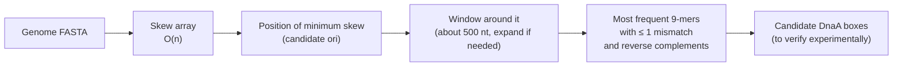

---
aliases:
  - G-C Skew
  - Cumulative GC Skew
  - Skew Diagram
  - Minimum Skew
  - Biais GC
tags:
  - type/concept
  - domain/bioinformatics
  - domain/biology
  - level/L1
  - level/L2
  - level/L3
mastery: 0
prerequisites:
  - "[[GC Content]]"
  - "[[DNA Replication]]"
  - "[[Reverse Complement]]"
  - "[[K-mer]]"
related:
  - "[[Sequence Motif]]"
  - "[[Hamming Distance]]"
  - "[[Approximate Pattern Matching]]"
  - "[[Chromosome]]"
  - "[[Bacteria]]"
  - "[[Mutation]]"
  - "[[Molecular Evolution]]"
projects:
  - "[[01-dna-engine]]"
  - "[[bio-visualization]]"
sources:
  - "[[Lobry 1996 - Asymmetric Substitution Patterns in the Two DNA Strands of Bacteria]]"
  - "[[Bioinformatics Algorithms (Compeau)]]"
  - "[[Coursera UCSD - Bioinformatics Specialization]]"
  - "[[Blattner 1997 - The Complete Genome Sequence of Escherichia coli K-12]]"
  - "[[Molecular Biology of the Cell (Alberts)]]"
---

# GC Skew

> [!abstract]
> Walking along one strand of a bacterial chromosome and keeping a running count of G minus C draws a curve that falls on one side of the replication origin and rises on the other: its minimum points to where replication begins, found from the sequence alone.

## Definition

The **GC skew** measures the imbalance between G and C on one strand. In a window it is $(G - C)/(G + C)$; in bacterial genomes its sign changes at the replication origin and at the terminus, because the two strands accumulate different substitutions.[^lobry] The **cumulative skew** (skew diagram) $\mathrm{Skew}_i$ is the number of G minus the number of C in the first $i$ nucleotides of the genome; the position where it is minimal is a prediction of the origin of replication, *ori*.[^compeau]

## Why it matters

- **Origins from sequence alone.** Locating *ori* experimentally is laborious; the skew minimum gives a candidate region in one linear scan of a genome file, the first step of the ori-finding pipeline taught by Compeau and Pevzner.[^compeau][^coursera]
- **A genome-scale signature of replication.** The *E. coli* K-12 genome is "strikingly organized with respect to the local direction of replication".[^blattner] Skew is the simplest way to see it.
- **A model of algorithmic biology.** A biological mechanism (asymmetric mutation during replication, [[DNA Replication]]) produces a statistical trace that a linear-time algorithm can read, and the result is then checked with [[K-mer]] and [[Sequence Motif]] analysis.
- **Lab.** The skew array and its plot belong to [[01-dna-engine]] and [[bio-visualization]].

## Core (L1)

**GC content versus GC skew.** [[GC Content]] counts G + C and is the same on both strands. The skew compares G with C on **one** strand; on a double-stranded molecule, the excess of G on one strand is an excess of C on the other.

**The skew diagram.** Start at 0 and read the genome 5' → 3': add 1 for each G, subtract 1 for each C, ignore A and T.[^compeau]

```text
position i   0  1  2  3  4  5  6  7  8  9 10 11 12 13 14
base            G  A  G  C  C  A  C  C  G  C  G  A  T  A
Skew_i       0  1  1  2  1  0  0 -1 -2 -1 -2 -1 -1 -1 -1
```

For this toy sequence (invented), the minimum $-2$ is reached at $i = 8$ and $i = 10$.

**Reading the curve on a real chromosome.** A bacterial chromosome is usually a single circle, replicated bidirectionally from one origin ([[DNA Replication]]);[^alberts] the two forks finish in a terminus region, *ter*.[^lobry] Along the strand stored in the file, the skew decreases on one half and increases on the other, so the curve looks like a "V": the minimum is near *ori*, the maximum near *ter*. For *E. coli*, the skew diagram reaches its maximum at position 1,550,413 and its minimum at position 3,923,620.[^compeau]

![[gc-skew-origin.svg]]

## Deeper (L2)

### Why the strands differ

Compeau and Pevzner split each strand into two **half-strands** at *ori* and *ter*. Read 5' → 3', a strand runs from *ori* to *ter* on its **forward half-strand** and from *ter* to *ori* on its **reverse half-strand**.[^compeau] The forward half-strand templates lagging-strand synthesis, so it waits single-stranded while Okazaki fragments are made ([[DNA Replication]]). Cytosine mutates to thymine by **deamination**, about 100 times faster in single-stranded DNA; forward half-strands therefore lose C and show G > C, reverse half-strands show the opposite, and the running count $\#G - \#C$ decreases along the reverse half-strand and increases along the forward one, turning around at *ori*.[^compeau]

This mechanism is the textbook explanation. The underlying observation is Lobry's: in *E. coli*, *Bacillus subtilis* and *Haemophilus influenzae*, G and C (and also A and T) depart from equal frequencies within one strand, with a sign that switches exactly at the origin and terminus, consistent with the leading and lagging strands accumulating different substitutions.[^lobry]

### Window skew or cumulative skew

The window skew $(G - C)/(G + C)$ is local and noisy: in a 100 kb toy genome with a 4% bias, one 10 kb window out of ten even has the wrong sign (Computational representation). The cumulative skew **integrates** the small bias over hundreds of kilobases, so its turning points stand out even when every window is noisy. The price: the minimum position inherits the accumulated noise, and is only approximate.

### From skew minimum to DnaA boxes



In *E. coli*, exact frequent 9-mers in a 500-nt window at the skew minimum show no 9-mer (with its reverse complement) occurring three or more times; allowing one mismatch and both strands reveals `TTATCCACA` and its reverse complement `TGTGGATAA`, the hypothesized DnaA box.[^compeau] Mismatches use the [[Hamming Distance]] ([[Approximate Pattern Matching]]); both strands use the [[Reverse Complement]].

## Advanced (L3)

- **A rough indicator.** The skew minimum often lands only near *ori*, which forces wider search windows; wider windows in turn bring in extraneous repeated substrings that compete with the true DnaA boxes.[^compeau] Exercise 4 reproduces both effects on a toy genome.
- **Strand-independent answer.** Reading the other strand negates and reverses the curve, but its minimum falls at the same physical position (Mathematical representation), so the prediction does not depend on which strand the FASTA file stores (Exercise 2).
- **Other skews.** The same asymmetry affects A and T, so an AT skew $(A - T)/(A + T)$ can be computed the same way.[^lobry]
- **Scope.** The method assumes one origin and one terminus per circular chromosome. Eukaryotic chromosomes use many origins ([[DNA Replication]]),[^alberts] so a single genome-wide minimum does not exist for them.
- **Composition is history.** Skew is one instance of a general principle: mutational processes that differ between strands or regions leave compositional traces ([[GC Content]], [[K-mer]] signatures, [[CpG Island|CpG depletion]]) that are read statistically ([[Molecular Evolution]]).

## Mathematical representation

Let $s = s_1 \dots s_n$ be one strand read 5' → 3' and $\delta(x) = +1$ if $x = G$, $-1$ if $x = C$, $0$ otherwise.

- **Cumulative skew** $\mathrm{Skew}_0 = 0$, $\mathrm{Skew}_i = \mathrm{Skew}_{i-1} + \delta(s_i) = \#_G(s_1 \dots s_i) - \#_C(s_1 \dots s_i)$, for $i = 1, \dots, n$.
- **Minimum skew positions** $\arg\min_{0 \le i \le n} \mathrm{Skew}_i$: one pass, $O(n)$ time; $O(1)$ extra space if only the minimum is kept.
- **Window skew** $\mathrm{GCskew}(i, w) = \dfrac{\#_G - \#_C}{\#_G + \#_C}$ over $s_{i+1} \dots s_{i+w}$, in $[-1, 1]$.
- **Other strand.** For $r = \mathrm{rc}(s)$, the first $i$ bases of $r$ are the complement of the last $i$ bases of $s$, which swaps G and C, so $\mathrm{Skew}^{r}_i = \mathrm{Skew}_{n-i} - \mathrm{Skew}_n$. Hence $i$ minimizes $\mathrm{Skew}^{r}$ iff $n - i$ minimizes $\mathrm{Skew}$: the same cut point in the double helix.

## Computational representation

```python
import random


def skew_array(genome: str) -> list[int]:
    """skew[i] = #G - #C in genome[:i]; skew[0] = 0 (length n + 1)."""
    skew = [0]
    for base in genome:
        skew.append(skew[-1] + (base == "G") - (base == "C"))
    return skew


def minimum_skew(genome: str) -> list[int]:
    """All i where skew[i] is minimal: ori is predicted just after the first i bases."""
    skew = skew_array(genome)
    low = min(skew)
    return [i for i, v in enumerate(skew) if v == low]


def window_skew(genome: str, w: int, step: int) -> list[tuple[int, float]]:
    """(start, (G - C)/(G + C)) of each window."""
    out = []
    for i in range(0, len(genome) - w + 1, step):
        win = genome[i:i + w]
        g, c = win.count("G"), win.count("C")
        out.append((i, (g - c) / (g + c) if g + c else 0.0))
    return out


def toy_bacterial_genome(n: int, ori: int, ter: int, bias: float, rng: random.Random) -> str:
    """Invented circular genome read 5'->3': G > C from ori to ter (forward half-strand), C > G elsewhere."""
    seq = []
    for i in range(n):
        forward = (i - ori) % n < (ter - ori) % n        # on the arc going 5'->3' from ori to ter
        g = 0.25 * (1 + bias) if forward else 0.25 * (1 - bias)
        c = 0.5 - g
        seq.append(rng.choices("ACGT", weights=[0.25, c, g, 0.25])[0])
    return "".join(seq)


rng = random.Random(11)
genome = toy_bacterial_genome(100_000, ori=70_000, ter=20_000, bias=0.04, rng=rng)
skew = skew_array(genome)
mins = minimum_skew(genome)
print("min at", mins[0], "...", mins[-1], "value", skew[mins[0]])
print("max at", skew.index(max(skew)), "value", max(skew))
print([(s, round(v, 3)) for s, v in window_skew(genome, 10_000, 10_000)])
```

```text
min at 68997 ... 69001 value -645
max at 20061 value 277
[(0, 0.03), (10000, 0.024), (20000, -0.035), (30000, -0.043), (40000, -0.035), (50000, -0.036), (60000, -0.027), (70000, 0.042), (80000, -0.002), (90000, 0.043)]
```

The toy *ori* is at 70,000 and *ter* at 20,000: the maximum is found 61 bp from *ter*, the minimum about 1 kb before *ori*, and the window at 80,000 has the wrong sign. This is the genome drawn in the figure.

## Worked example

> [!example] Reading the *E. coli* numbers
> The *E. coli* K-12 chromosome is 4,639,221 bp;[^blattner] its skew diagram has its maximum at 1,550,413 and its minimum at 3,923,620.[^compeau]
> 1. **Arc from minimum to maximum, going forward around the circle**: $4{,}639{,}221 - 3{,}923{,}620 + 1{,}550{,}413 = 2{,}266{,}014$ bp, 48.8% of the chromosome.
> 2. **The other arc**: $3{,}923{,}620 - 1{,}550{,}413 = 2{,}373{,}207$ bp, 51.2%.
> 3. **Interpretation**: the predicted *ori* and *ter* sit almost opposite each other, as expected when two forks leave the origin in opposite directions at similar speeds and meet on the far side.

## Common misconceptions

> [!warning] "The skew minimum is the origin"
> It is a prediction, often only a rough one; the origin must be confirmed by DnaA box analysis and ultimately by experiment.[^compeau]

> [!warning] "GC skew and GC content measure the same thing"
> GC content is $G + C$, identical on both strands. GC skew is $G - C$ on one strand, and reverses sign on the other strand.

> [!warning] "The forward half-strand is the leading strand"
> In Compeau and Pevzner's terms, the forward half-strand is a **template** that waits single-stranded while the **lagging** strand is made on it.[^compeau] Keep "template" and "new strand" apart when reasoning about which side is enriched in G.

## Exercises

> [!question] Exercise 1 (L1)
> Compute by hand the skew array of `CCGATAGGC` and give the positions of its minimum.

> [!success]- Solution
> $0, -1, -2, -1, -1, -1, -1, 0, 1, 0$. The minimum $-2$ is at $i = 2$: the candidate cut point is after the second base.

> [!question] Exercise 2 (L2)
> Prove $\mathrm{Skew}^{\mathrm{rc}(s)}_i = \mathrm{Skew}_{n-i} - \mathrm{Skew}_n$ and deduce that the minimum is at the same physical position. Check on `GAGCCACCGCGATA`.

> [!success]- Solution
> The first $i$ bases of $\mathrm{rc}(s)$ are the complements of $s_{n-i+1} \dots s_n$, so their G count is the C count of that suffix and vice versa: $\mathrm{Skew}^{\mathrm{rc}}_i = -(\mathrm{Skew}_n - \mathrm{Skew}_{n-i})$. Since $\mathrm{Skew}_n$ is a constant, $i$ minimizes the left side iff $n - i$ minimizes $\mathrm{Skew}$. For the toy ($n = 14$), `minimum_skew` gives [8, 10] on the sequence and [4, 6] on its reverse complement, and $14 - 4 = 10$, $14 - 6 = 8$.

> [!question] Exercise 3 (L2, Python)
> On the toy genome above, re-run with `bias=0.01` and `bias=0.1`. How does the error of the minimum change? Why does a weaker bias make the prediction worse?

> [!success]- Solution
> Changing only the `bias` argument, the first two printed lines become:
> ```text
> bias=0.01   min at 67526 ... 90795 value -197    max at 6864 value 85
> bias=0.04   min at 68997 ... 69001 value -645    max at 20061 value 277
> bias=0.1    min at 69923 ... 69957 value -1635   max at 20040 value 819
> ```
> With a 1% bias the minimum value is reached at positions spread over more than 20 kb and the maximum is 13 kb from *ter*; with 10%, the minimum is within 80 bp of *ori*. The expected drift of the running sum grows linearly with the bias, while its random fluctuations grow like $\sqrt{i}$ whatever the bias: a weak bias gives a flat bottom on which noise decides where the minimum lands, a strong bias a sharp "V".

> [!question] Exercise 4 (L3, Python)
> Plant 8 slightly varied copies of `TTATCCACA` (some as its reverse complement) just after the true *ori* of the toy genome. Locate the skew minimum, take a 2 kb window starting there, and find the most frequent 9-mers with at most one mismatch, counting both strands.

> [!success]- Solution
> Using `skew_array` and `toy_bacterial_genome` from the code above:
> ```python
> from collections import Counter
>
> COMPLEMENT = str.maketrans("ACGT", "TGCA")
>
>
> def neighbors(pattern: str) -> set[str]:
>     """All strings at Hamming distance <= 1 from pattern."""
>     return {pattern[:i] + b + pattern[i + 1:] for i in range(len(pattern)) for b in "ACGT"}
>
>
> def frequent_words_mismatch_rc(text: str, k: int) -> tuple[int, list[str]]:
>     """k-mers p maximizing Count_1(text, p) + Count_1(text, rc(p)) (at most 1 mismatch)."""
>     counts = Counter()
>     for i in range(len(text) - k + 1):
>         window = text[i:i + k]
>         for p in [*neighbors(window), *neighbors(window.translate(COMPLEMENT)[::-1])]:
>             counts[p] += 1
>     top = max(counts.values())
>     return top, sorted(p for p, c in counts.items() if c == top)
>
>
> rng = random.Random(11)
> genome = toy_bacterial_genome(100_000, ori=70_000, ter=20_000, bias=0.04, rng=rng)
> boxes = ["TTATCCACA", "TTATCCAAA", "TGTGGATAA", "TTATGCACA",     # planted, invented variants
>          "TGTGGATAA", "TTATCCACA", "TGTGGTTAA", "TTATCCACA"]     # of TTATCCACA and its rc
> for pos, box in zip(range(70_040, 70_900, 110), boxes):
>     genome = genome[:pos] + box + genome[pos + 9:]
> skew = skew_array(genome)
> m = skew.index(min(skew))
> print("minimum skew at", m)
> print(frequent_words_mismatch_rc(genome[m:m + 2_000], 9))
> ```
> Output: `minimum skew at 68997`, then `(8, ['TGTGGATAA', 'TTATCCACA'])`. The box and its reverse complement tie with a score of 8 although only 3 copies are exact. Two lessons: a 500-nt window at the minimum would have missed the boxes, which lie about 1 kb further; and a much wider window lets random words with as many approximate occurrences compete, the trade-off Compeau and Pevzner describe.[^compeau]

## Mastery checklist

- [ ] 1 Recognized: I can define GC skew and the skew diagram, and say what its minimum predicts.
- [ ] 2 Understood: I can explain the forward and reverse half-strands, the deamination argument and Lobry's observation.
- [ ] 3 Practiced: I can compute the skew array in $O(n)$, prove its strand symmetry and chain it with frequent words with mismatches and reverse complements.
- [ ] 4 Applied: in [[01-dna-engine]], I plotted the skew of a real bacterial genome from [[NCBI GenBank]] and compared the predicted ori with its annotation.
- [ ] 5 Explained: I can explain when skew fails (weak bias, eukaryotes, imprecise minima) and why window size is a trade-off in the DnaA box search.

## References

[^lobry]: [[Lobry 1996 - Asymmetric Substitution Patterns in the Two DNA Strands of Bacteria]], *Molecular Biology and Evolution*.
[^compeau]: [[Bioinformatics Algorithms (Compeau)]], chapter "Where in the Genome Does DNA Replication Begin?" (skew diagram, half-strands and deamination, *E. coli* minimum skew and DnaA boxes, complications of ori prediction).
[^coursera]: [[Coursera UCSD - Bioinformatics Specialization]], course I "Finding Hidden Messages in DNA".
[^blattner]: [[Blattner 1997 - The Complete Genome Sequence of Escherichia coli K-12]], *Science*, abstract.
[^alberts]: [[Molecular Biology of the Cell (Alberts)]], 4th ed. (2002), DNA replication: origins and bidirectional forks.
