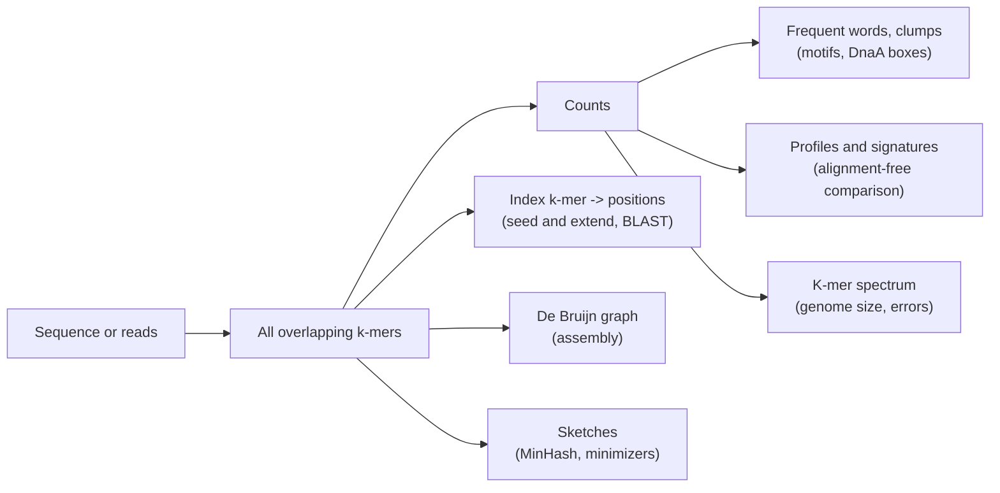

---
aliases:
  - k-mer
  - Kmer
  - K-tuple
  - Word (sequence analysis)
  - q-gram
  - K-mère
tags:
  - type/concept
  - domain/bioinformatics
  - domain/computer-science
  - domain/statistics
  - level/L1
  - level/L2
  - level/L3
mastery: 0
prerequisites:
  - "[[String]]"
  - "[[DNA]]"
  - "[[Reverse Complement]]"
  - "[[Hash Table]]"
  - "[[Expected Value]]"
related:
  - "[[GC Content]]"
  - "[[Sequence Motif]]"
  - "[[K-mer Spectrum]]"
  - "[[De Bruijn Graph]]"
  - "[[Seed and Extend]]"
  - "[[Alignment-Free Sequence Comparison]]"
  - "[[Inverted Index]]"
  - "[[MinHash]]"
  - "[[Minimizer]]"
projects:
  - "[[01-dna-engine]]"
  - "[[05-sequence-search]]"
  - "[[bio-algorithms]]"
sources:
  - "[[Bioinformatics Algorithms (Compeau)]]"
  - "[[Coursera UCSD - Bioinformatics Specialization]]"
  - "[[Altschul 1990 - Basic Local Alignment Search Tool]]"
  - "[[Karlin 1995 - Dinucleotide Relative Abundance Extremes]]"
  - "[[Biological Sequence Analysis (Durbin)]]"
  - "[[Blattner 1997 - The Complete Genome Sequence of Escherichia coli K-12]]"
  - "[[Nurk 2022 - The Complete Sequence of a Human Genome]]"
  - "[[Lander 2001 - Initial Sequencing and Analysis of the Human Genome]]"
---

# K-mer

> [!abstract]
> A k-mer is a substring of length k; cutting a sequence into all its overlapping k-mers and counting them turns it into a table of word frequencies that can reveal hidden signals, index a genome, seed a search or assemble reads.

## Definition

A **k-mer** is a string of length $k$; the k-mers of a sequence are its $n - k + 1$ overlapping substrings of length $k$. Over the DNA alphabet there are $4^k$ possible k-mers.[^compeau-ori] The **k-mer composition** (or k-mer profile) of a sequence is the count of each k-mer in it; for $k = 1$ it is the base composition ([[GC Content]]), for $k = 2$ the dinucleotide composition.

## Why it matters

- **Hidden messages.** Short words that are unexpectedly frequent in a small region can be binding sites: in the replication origin of *Vibrio cholerae*, the 9-mer `ATGATCAAG` and its reverse complement each occur three times, and they encode DnaA boxes.[^compeau-ori] This is the entry point of Compeau and Pevzner's course.[^coursera]
- **Search.** [[BLAST]] finds candidate hits from short word matches between query and database, then extends them ([[Seed and Extend]]).[^altschul] An index from k-mers to positions ([[Inverted Index]]) is the core of [[05-sequence-search]].
- **Assembly.** Genome assemblers build [[De Bruijn Graph|de Bruijn graphs]] whose edges are the k-mers of the reads.[^compeau-asm]
- **Signatures.** The frequencies of short words differ between genomes and are fairly constant within one, which makes them a "genomic signature" for comparing or classifying sequences without alignment.[^karlin] See [[Alignment-Free Sequence Comparison]] and [[Metagenomic Binning]].
- **Reads as k-mers.** Tabulating how many distinct k-mers of a read set occur once, twice, three times and so on gives the [[K-mer Spectrum]], studied in [[Genomics]]; a sequencing error creates up to $k$ new k-mers that are usually seen only once (Deeper).

## Core (L1)

```text
sequence   A T G A T C A A G        n = 9, k = 3  ->  n - k + 1 = 7 k-mers
           A T G
             T G A
               G A T
                 A T C
                   T C A
                     C A A
                       A A G
```

- **k-mers overlap.** Consecutive k-mers share $k - 1$ bases. This is the difference with codons, which are non-overlapping triplets read in one [[Reading Frame]].
- **Counting.** Slide a window of width $k$, look each k-mer up in a dictionary and increment its count ([[Hash Table]]): one pass, $O(nk)$ with string slicing, $O(n)$ with a [[Rolling Hash]].
- **Most frequent k-mers** ("frequent words") are those with the maximal count. Different $k$ give different pictures: $k = 1$ composition, $k = 2$ dinucleotides, $k \approx 8$ to 12 regulatory words, $k \ge 20$ nearly unique genome positions.
- **Both strands.** A double-stranded site can be read as a k-mer or as its [[Reverse Complement]]. Counting **canonical** k-mers (the smaller of the two) merges them ([[DNA#Advanced (L3)]]).

## Deeper (L2)

### The $4^k$ space and expected counts

If bases are independent and uniform, a given k-mer starts at each position with probability $4^{-k}$, so its expected count in a sequence of length $n$ is $(n - k + 1)/4^k$ ([[Expected Value]]). For the *E. coli* K-12 chromosome (4,639,221 bp)[^blattner] and the human T2T-CHM13 assembly (about $3.055 \times 10^9$ bp),[^nurk] the expected counts are:

| $k$ | $4^k$ | Expected count, *E. coli* | Expected count, human |
|---:|---:|---:|---:|
| 3 | 64 | 72,500 | $4.8 \times 10^7$ |
| 6 | 4,096 | 1,130 | 746,000 |
| 9 | 262,144 | 17.7 | 11,700 |
| 11 | 4,194,304 | 1.11 | 728 |
| 16 | $4.3 \times 10^9$ | 0.0011 | 0.71 |
| 21 | $4.4 \times 10^{12}$ | $1.1 \times 10^{-6}$ | $7 \times 10^{-4}$ |

**Choosing k.** A random k-mer is expected to be unique once $4^k$ exceeds the genome length, i.e. $k > \log_4 n$: about 11 for *E. coli*, 16 for human. Real genomes contain repeats, so practical tools use larger $k$; but larger $k$ also means sparser counts and more k-mers broken by sequencing errors (a read k-mer is error-free with probability $(1 - \varepsilon)^k$ at per-base error rate $\varepsilon$).

### Frequent words, clumps and mismatches

Compeau and Pevzner turn ori finding into k-mer problems: the most frequent k-mers of a region (Frequent Words), k-mers forming dense **clumps** in a short window of a genome, and frequent k-mers **with mismatches and reverse complements**. In *E. coli*, exact 9-mer counts in a 500-nt window at the predicted origin show nothing repeated three times; allowing one mismatch and both strands reveals `TTATCCACA` and its reverse complement, the hypothesized DnaA box.[^compeau-ori] Mismatches are measured with the [[Hamming Distance]] ([[Approximate Pattern Matching]]); the full origin-finding pipeline is in [[GC Skew]].

### Dense array or hash table

For small $k$, a **frequency array** of size $4^k$ indexed by the base-4 number of the k-mer (A=0, C=1, G=2, T=3) is fastest: 4,096 counters for $k = 6$. For $k = 21$ it would need $4.4 \times 10^{12}$ counters, so large $k$ requires a hash table storing only the k-mers present, at most $n - k + 1$.

## Advanced (L3)

- **Genomic signatures.** Karlin and Burge measured each dinucleotide against the expectation from base composition, the relative abundance $\rho_{XY} = f_{XY}/(f_X f_Y)$. The profile of the 16 values is similar for different DNA samples of the same organism and differs between organisms: a **genomic signature** that needs no alignment.[^karlin] A classic extreme is CG: in the human genome it is rarer than $f_C f_G$ predicts, because its C is typically methylated and methyl-C mutates readily to T ([[CpG Island]]).[^durbin3]
- **k-mers as graph pieces.** Each k-mer links its prefix and suffix $(k-1)$-mers; following all k-mers of the reads through this [[De Bruijn Graph]] reconstructs the genome as a path.[^compeau-asm] Repeats longer than $k$ create ambiguous branchings, which is why $k$ is a central assembly parameter ([[Genome Assembly]]).
- **Seeds and sketches.** Exact $k$-mer matches are the seeds of fast search ([[Seed and Extend]], [[Spaced Seed]]).[^altschul] At genome scale, the set of k-mers is too large to compare directly, so tools keep a sample: the minimum-hash k-mers ([[MinHash]]) to estimate the [[Jaccard Index]] of two k-mer sets, or one k-mer per window ([[Minimizer]]) to shrink an index.
- **Overlap breaks independence.** Occurrences of a self-overlapping word such as `ACACACACA` cluster, so counts of such words are more variable than a Poisson model predicts (Exercise 6). Low-complexity sequence creates spurious frequent words; mask it first ([[Low-Complexity Region]]).



## Mathematical representation

- Let $s \in \Sigma^n$, $\Sigma = \{A, C, G, T\}$, and $1 \le k \le n$. The k-mer at position $i$ is $s[i, k] = s_{i+1} \dots s_{i+k}$ for $i = 0, \dots, n - k$.
- **Count function** $\mathrm{Count}_s(w) = |\{ i : s[i, k] = w \}|$ for $w \in \Sigma^k$, with $\sum_{w \in \Sigma^k} \mathrm{Count}_s(w) = n - k + 1$ and at most $\min(4^k, n - k + 1)$ distinct k-mers.
- **Profile** $f_s \in \mathbb{R}^{4^k}$, $f_s(w) = \mathrm{Count}_s(w)/(n - k + 1)$; two sequences can be compared by a distance between profiles, or by the [[Jaccard Index]] of their k-mer sets.
- **Encoding** $\mathrm{idx}(w) = \sum_{j=1}^{k} e(w_j)\, 4^{k-j}$ with $e(A)=0, e(C)=1, e(G)=2, e(T)=3$: a bijection $\Sigma^k \to \{0, \dots, 4^k - 1\}$ that preserves lexicographic order.
- **Null model.** With i.i.d. bases of probabilities $\pi_x$, $\mathbb{E}[\mathrm{Count}_s(w)] = (n - k + 1) \prod_{j} \pi_{w_j}$; uniform bases give $(n - k + 1)/4^k$.
- **Relative abundance** $\rho_{XY} = f_{XY}/(f_X f_Y)$, where $f$ are observed frequencies; $\rho = 1$ means "as expected from composition".[^karlin]

## Computational representation

```python
from collections import Counter

COMPLEMENT = str.maketrans("ACGT", "TGCA")
INDEX = {"A": 0, "C": 1, "G": 2, "T": 3}


def reverse_complement(seq: str) -> str:
    return seq.translate(COMPLEMENT)[::-1]


def kmer_counts(seq: str, k: int, canonical: bool = False) -> Counter:
    """Count all overlapping k-mers (hash table); skip windows containing a non-ACGT symbol."""
    counts = Counter()
    for i in range(len(seq) - k + 1):
        kmer = seq[i:i + k]
        if set(kmer) <= set("ACGT"):
            counts[min(kmer, reverse_complement(kmer)) if canonical else kmer] += 1
    return counts


def frequent_kmers(seq: str, k: int, canonical: bool = False) -> tuple[int, list[str]]:
    counts = kmer_counts(seq, k, canonical)
    top = max(counts.values())
    return top, sorted(km for km, c in counts.items() if c == top)


def frequency_array(seq: str, k: int) -> list[int]:
    """Dense alternative: one counter per possible k-mer, index = base-4 number (A=0 ... T=3)."""
    array = [0] * 4**k
    for i in range(len(seq) - k + 1):
        index = 0
        for base in seq[i:i + k]:
            index = 4 * index + INDEX[base]
        array[index] += 1
    return array


seq = "ATGATCAAGCTTGATCATTTATGATCAAGGCTTGATCATNATG"   # invented toy sequence
counts = kmer_counts(seq, 9)
print(len(seq), sum(counts.values()), len(counts))       # length, 9-mers counted, distinct 9-mers
print(frequent_kmers(seq, 9))
print(frequent_kmers(seq, 9, canonical=True))
dinuc = frequency_array("ACGTACGT", 2)
print(len(dinuc), [(i, c) for i, c in enumerate(dinuc) if c])  # AC=1, CG=6, GT=11, TA=12
```

```text
43 31 28
(2, ['ATGATCAAG', 'CTTGATCAT', 'GCTTGATCA'])
(4, ['ATGATCAAG'])
16 [(1, 2), (6, 2), (11, 2), (12, 1)]
```

Of the 35 windows, the 4 that contain `N` are skipped. Canonical counting merges `ATGATCAAG` with `CTTGATCAT` into one word seen 4 times. Production k-mer counters pack k-mers into integers ([[Reverse Complement#Advanced (L3)]]) and use compact hash tables; the logic is the same.

## Worked example

> [!example] Is a repeated 9-mer surprising? (toy numbers, computed)
> A 500-nt origin region contains a 9-mer three times. How surprising is that in random sequence?
> 1. There are $500 - 9 + 1 = 492$ windows and $4^9 = 262{,}144$ possible 9-mers, so one given 9-mer has expected count $\lambda = 492/262{,}144 \approx 0.0019$.
> 2. Treating its count as Poisson, $P(\ge 3) \approx \lambda^3/6 \approx 1.1 \times 10^{-9}$.
> 3. Summed over all 262,144 possible 9-mers: about $2.9 \times 10^{-4}$ expected 9-mers with three or more copies per random 500-mer.
> 4. So three copies of the same 9-mer (six with the reverse complement, as in *V. cholerae*) are very unlikely by chance: a strong hint of function, to be checked against real biology.[^compeau-ori] Exercise 6 tests this estimate by simulation.

## Common misconceptions

> [!warning] "The k-mers of a sequence do not overlap"
> They do: position $i$ and $i + 1$ start two k-mers sharing $k - 1$ bases. Non-overlapping triplets are codons in a reading frame, a different object.

> [!warning] "A larger k is always more specific, hence better"
> Larger $k$ makes k-mers more unique but also rarer, sparser to compare, and more often destroyed by a single sequencing error or mutation. Every application chooses $k$ as a trade-off (assembly, search seeds, sketches).

> [!warning] "The most frequent k-mer is the biological signal"
> Frequency must be compared with an expectation that accounts for composition, sequence length and repeats. Homopolymers and tandem repeats top raw counts everywhere ([[Low-Complexity Region]]).

> [!warning] "Counting one strand is enough"
> A binding site may be written on either strand. Counting a k-mer without its reverse complement can halve the signal, as the *V. cholerae* DnaA boxes show.[^compeau-ori]

## Exercises

> [!question] Exercise 1 (L1)
> How many 4-mers does `GATTACATTA` contain, and how many distinct ones? Which is most frequent?

> [!success]- Solution
> $10 - 4 + 1 = 7$ 4-mers: GATT, ATTA, TTAC, TACA, ACAT, CATT, ATTA. ATTA appears twice, so 6 distinct, and ATTA is the most frequent.

> [!question] Exercise 2 (L1)
> How many possible 8-mers exist over DNA? Over the 20 amino acids? What is the expected count of one given DNA 8-mer in a 1 Mb random sequence?

> [!success]- Solution
> $4^8 = 65{,}536$ DNA 8-mers and $20^8 = 2.56 \times 10^{10}$ protein 8-mers. Expected count: $(10^6 - 7)/65{,}536 \approx 15.3$.

> [!question] Exercise 3 (L2)
> Using the table above, choose the smallest $k$ for which a random k-mer is expected at most once in the human genome, and explain why read mappers still see many k-mers of that length occurring several times.

> [!success]- Solution
> $k = 16$ (expected 0.71; at $k = 15$, $3.055 \times 10^9/4^{15} \approx 2.8$). The genome is not random: repeated sequences (such as [[Transposable Element|transposable elements]]) contain the same k-mers many times,[^lander] so real uniqueness needs larger $k$ and masking ([[Repeat Masking]]).

> [!question] Exercise 4 (L2, Python)
> With `kmer_counts`, find the most frequent canonical 9-mers of the toy sequence above and verify that the result is unchanged when the sequence is replaced by its reverse complement.

> [!success]- Solution
> ```python
> print(frequent_kmers(seq, 9, canonical=True) == frequent_kmers(reverse_complement(seq), 9, canonical=True))
> ```
> Output: `True`. The k-mers of $\mathrm{rc}(s)$ are the reverse complements of those of $s$, and a k-mer and its reverse complement have the same canonical form ([[DNA#Exercises]], Exercise 5).

> [!question] Exercise 5 (L3, Python)
> Generate a 200 kb random sequence (seed 3), then mimic methylation-driven decay by turning each `CG` into `TG` with probability 0.8. Compute the relative abundance $\rho_{XY}$ of CG, TG, CA, GC and AT and interpret.

> [!success]- Solution
> ```python
> import random
> from collections import Counter
>
>
> def relative_abundance(seq: str) -> dict[str, float]:
>     """rho_XY = f_XY / (f_X * f_Y): observed over expected dinucleotide frequency."""
>     mono = Counter(seq)
>     di = Counter(seq[i:i + 2] for i in range(len(seq) - 1))
>     n1, n2 = len(seq), len(seq) - 1
>     return {x + y: (di[x + y] / n2) / ((mono[x] / n1) * (mono[y] / n1))
>             for x in "ACGT" for y in "ACGT"}
>
>
> rng = random.Random(3)
> seq = list(rng.choices("ACGT", k=200_000))
> for i in range(len(seq) - 1):                 # toy "methylation-deamination": most CG become TG
>     if seq[i] == "C" and seq[i + 1] == "G" and rng.random() < 0.8:
>         seq[i] = "T"
> seq = "".join(seq)
> rho = relative_abundance(seq)
> print({d: round(r, 2) for d, r in rho.items() if d in ("CG", "TG", "CA", "GC", "AT")})
> ```
> Output: `{'AT': 1.0, 'CA': 1.27, 'CG': 0.26, 'GC': 1.0, 'TG': 1.5}`. CG falls to about a quarter of its expectation and TG, its product, rises. CA also rises only because C became rarer, lowering its expectation: $\rho$ compares to composition, so a change in one base shifts several ratios. In real DNA the same event on the other strand turns CG into CA, so both TG and CA gain; a CG deficit of this kind is what the human genome shows.[^durbin3]

> [!question] Exercise 6 (L3, Python)
> Test the worked example: simulate 50,000 random 500-mers (seed 1), count those in which some 9-mer occurs at least 3 times, and compare with the Poisson estimate. Explain the difference.

> [!success]- Solution
> ```python
> import math
> import random
> from collections import Counter
>
> n, k, t = 500, 9, 3
> lam = (n - k + 1) / 4**k                     # expected count of one given 9-mer
> p_one = 1 - sum(math.exp(-lam) * lam**i / math.factorial(i) for i in range(t))
> print(f"Poisson approx: {4**k * p_one:.2e}")  # expected number of 9-mers seen >= 3 times
>
> rng = random.Random(1)
> trials, hits = 50_000, 0
> for _ in range(trials):
>     s = "".join(rng.choices("ACGT", k=n))
>     if max(Counter(s[i:i + k] for i in range(n - k + 1)).values()) >= t:
>         hits += 1
> print(f"simulation: {hits} / {trials} = {hits / trials:.1e}")
> ```
> Output: `Poisson approx: 2.88e-04`, then `simulation: 26 / 50000 = 5.2e-04`. Both say "about 1 in 2,000 to 3,500": rare. The simulation is higher because most of the observed triples are self-overlapping words (`CCCCCCCCC`, `CACCACCAC`, `ACACACACA`): one run of 11 C's already contains `CCCCCCCCC` three times. The Poisson model assumes independent occurrences, which overlapping words violate.

## Mastery checklist

- [ ] 1 Recognized: I can define a k-mer and give the number of k-mers of a sequence and of possible k-mers.
- [ ] 2 Understood: I can explain expected counts, the choice of $k$, canonical k-mers and the difference with codons.
- [ ] 3 Practiced: I can count k-mers with a hash table and a frequency array, find frequent (canonical) words and compute $\rho_{XY}$.
- [ ] 4 Applied: in [[05-sequence-search]], I built a k-mer index of a real genome and measured its memory for several $k$.
- [ ] 5 Explained: I can explain k-mers as the common currency of motif finding, search seeds, assembly graphs, spectra and sketches, and where the random model fails.

## References

[^compeau-ori]: [[Bioinformatics Algorithms (Compeau)]], chapter "Where in the Genome Does DNA Replication Begin?" (frequent words, clumps, DnaA boxes of *V. cholerae* and *E. coli*).
[^compeau-asm]: [[Bioinformatics Algorithms (Compeau)]], chapter "How Do We Assemble Genomes?".
[^coursera]: [[Coursera UCSD - Bioinformatics Specialization]], course I "Finding Hidden Messages in DNA".
[^altschul]: [[Altschul 1990 - Basic Local Alignment Search Tool]], *Journal of Molecular Biology*.
[^karlin]: [[Karlin 1995 - Dinucleotide Relative Abundance Extremes]], *Trends in Genetics*.
[^durbin3]: [[Biological Sequence Analysis (Durbin)]], ch. 3 "Markov chains and hidden Markov models" (the CpG island example).
[^blattner]: [[Blattner 1997 - The Complete Genome Sequence of Escherichia coli K-12]], *Science*.
[^nurk]: [[Nurk 2022 - The Complete Sequence of a Human Genome]], *Science*.
[^lander]: [[Lander 2001 - Initial Sequencing and Analysis of the Human Genome]], *Nature*, analysis of repeats and transposable elements.
