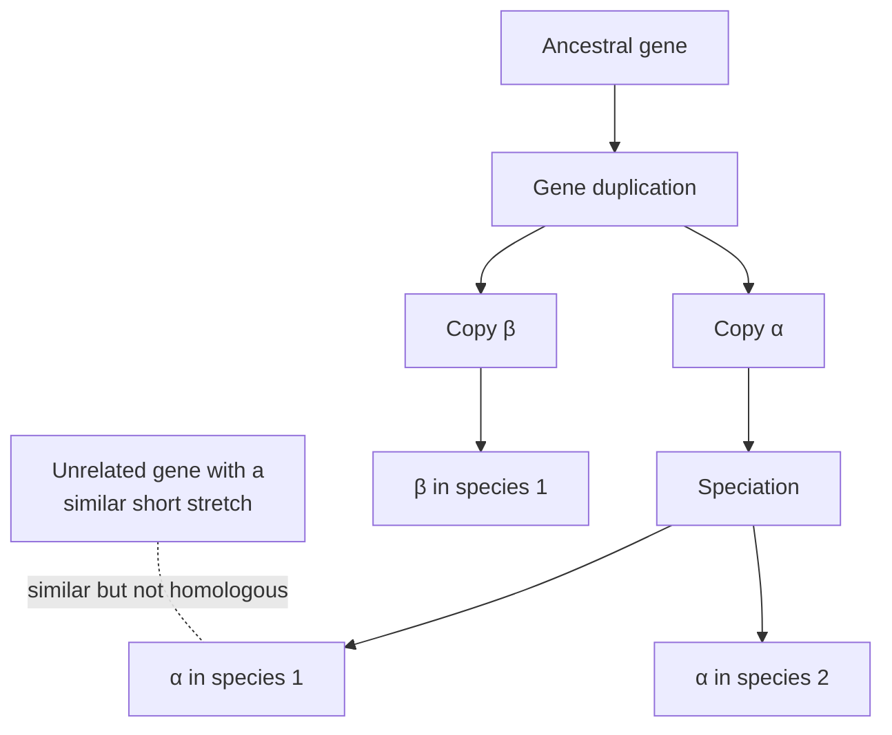

---
aliases:
  - Homology
  - Homologous Sequences
  - Homolog
  - Homologue
  - Homologie de séquence
tags:
  - type/concept
  - domain/bioinformatics
  - domain/biology
  - domain/statistics
  - level/L1
  - level/L2
  - level/L3
mastery: 0
prerequisites:
  - "[[Common Descent]]"
  - "[[Mutation]]"
  - "[[Indel]]"
  - "[[Convergent Evolution]]"
related:
  - "[[Sequence Alignment]]"
  - "[[Ortholog]]"
  - "[[Paralog]]"
  - "[[Gene Duplication]]"
  - "[[Molecular Evolution]]"
  - "[[BLAST]]"
  - "[[E-Value]]"
  - "[[Protein Family]]"
  - "[[Homology Modeling]]"
projects:
  - "[[04-alignment-engine]]"
  - "[[05-sequence-search]]"
sources:
  - "[[Reeck 1987 - Homology in Proteins and Nucleic Acids]]"
  - "[[Pearson 2013 - An Introduction to Sequence Similarity Searching]]"
  - "[[Evolution (Futuyma)]]"
  - "[[Blattner 1997 - The Complete Genome Sequence of Escherichia coli K-12]]"
  - "[[Biochemistry (Berg)]]"
---

# Sequence Homology

> [!abstract]
> Two sequences are homologous if they descend from a common ancestral sequence: a yes-or-no fact about history that we never observe directly, but infer from similarity, a number we can measure.

## Definition

**Homology** is common evolutionary origin: two sequences are **homologous** (they are **homologs**) if they derive from a common ancestral sequence. It is all or none; sequences cannot be "40% homologous". What can be measured is their **similarity**, a score computed from an alignment, and their **identity**, the proportion of identical aligned positions.[^reeck] Homology is **inferred** from similarity: sequence similarity searches identify homologs by detecting **excess similarity**, statistically significant similarity that reflects common ancestry.[^pearson]

## Why it matters

- **Transferring knowledge.** Most genes in a new genome are annotated because they are homologous to characterized genes; the logic of every [[BLAST]] search is "significant similarity, therefore probable homology, therefore possibly related function".[^pearson]
- **Meaning of an alignment.** A [[Sequence Alignment]] of homologs is a hypothesis about which positions descend from the same ancestral position; [[Substitution Matrix|substitution matrices]] and [[Gap Penalty|gap penalties]] are models of how homologous positions change.
- **Evolutionary analyses.** Phylogenetic trees, [[Multiple Sequence Alignment|multiple alignments]], [[Protein Family|protein families]] and [[Homology Modeling|homology models]] of structure all start from sets of homologs.
- **Lab.** [[04-alignment-engine]] computes similarity; [[05-sequence-search]] turns similarity scores into ranked, hopefully homologous, hits.

## Core (L1)

| Term | What it is | Kind of value | Depends on |
|---|---|---|---|
| **Homology** | common ancestry | yes or no, never observed directly | evolutionary history |
| **Similarity** | alignment score | a number, higher = more similar | alignment, scoring scheme |
| **Identity** | % identical aligned positions | a number, 0 to 100% | alignment, choice of denominator |

**Say it correctly.** "These proteins are 42% identical over 300 residues; the similarity is highly significant, so they are homologous." Not "they are 42% homologous".[^reeck]

**How homologs arise.** A gene is copied down lineages. When a species splits, each descendant carries a copy; when a gene is duplicated within a genome, the two copies evolve side by side. All resulting copies are homologs, and Stage 2 names them by the event that separated them: [[Ortholog|orthologs]] (separated by [[Speciation|speciation]]) and [[Paralog|paralogs]] (separated by [[Gene Duplication|gene duplication]]).[^futuyma] Paralog families can be large: in *E. coli* K-12 the largest contains 80 ABC transporters.[^blattner]



α1, α2 and β1 are all homologs (α1 and α2 are orthologs, α1 and β1 paralogs). The gene X resembles α1 locally by chance or convergence, not by descent ([[Convergent Evolution]]).

## Deeper (L2)

### Inferring homology from similarity

The argument is statistical: if two sequences are much more similar than unrelated sequences would be by chance, common ancestry is the simplest explanation.[^pearson] The yardstick is therefore not a raw percent identity but the **significance** of the alignment score, reported by search tools as an [[E-Value]]. Pearson gives working thresholds: protein:protein expectation values below 0.001 can reliably be used to infer homology, whereas DNA:DNA expectation values below $10^{-6}$ often occur by chance and $10^{-10}$ is a more widely accepted threshold.[^pearson]

### The inference is one-way

Significant similarity supports homology; the absence of significant similarity does **not** show that sequences are unrelated. Similarity erodes as mutations accumulate, and different comparisons see different depths of time: DNA:DNA alignments rarely detect homology after 200 to 400 million years of divergence, while protein:protein alignments routinely detect homology between sequences whose last common ancestor lived more than 2.5 billion years ago, such as human and bacterial proteins.[^pearson]

### Why proteins see further back

Two effects, both derivable from what you already know:

1. **Silent change.** The genetic code is degenerate, so many DNA substitutions, especially at third codon positions, leave the protein unchanged ([[Genetic Code#Advanced (L3)]]).[^berg] DNA diverges faster than the protein it encodes.
2. **Background identity.** Two unrelated random DNA sequences are identical at about 25% of aligned positions (1/4 with uniform bases), random proteins at about 5% (1/20): the signal of ancestry stands out more easily against the protein background (Exercise 5).

So to detect distant homologs of a coding sequence, compare translated sequences (blastp, blastx, tblastn in [[BLAST]]).

### Homology of parts

Homology is a statement about sequences **or parts of them**. A protein made of several [[Protein Domain|domains]] can be homologous to one protein over its first half and to another over its second half. Search results should therefore be read region by region (where does the alignment start and end?), and [[Sequence Alignment#Deeper (L2)|local alignment]] exists precisely to find homologous segments inside longer, unrelated contexts.

## Advanced (L3)

- **Similarity without homology.** Short motifs, low-complexity regions (long runs of one or two residues) and biased composition can give high-scoring alignments between unrelated sequences, because the random model behind the score assumes typical composition. Mask such regions before searching ([[Low-Complexity Region]]).
- **Homology beyond pairwise similarity.** When two homologs no longer align significantly, a model of their whole family can still recognize both: profile methods ([[PSI-BLAST]], [[Profile Hidden Markov Model]]) push detection further than any pairwise score ([[Protein Family]]).
- **Transitivity, with care.** Common ancestry is transitive: if A is homologous to B and B to C (over the same region), A and C are homologous even when A-C similarity is not significant. This is how iterative searches reach remote homologs. It fails when the shared regions differ, as with multidomain proteins (A-B share domain 1, B-C share domain 2), which is why chaining inferences blindly creates false families.
- **Homology is not functional equivalence.** Paralogs often diverge in function after duplication ([[Gene Duplication]], [[Paralog]]); orthologs are the better, but not guaranteed, candidates for function transfer ([[Ortholog]]).

## Mathematical representation

- **Homology** is a binary relation $H$ on sequences (or segments): $(x, y) \in H$ iff $x$ and $y$ descend from a common ancestral sequence. It is not observed; we estimate $P(H \mid \text{data})$ implicitly through a score and its significance.
- **Identity** of a pairwise alignment with columns $1, \dots, L$, of which $m$ are identical residue pairs, $L_{\text{pairs}}$ are gap-free columns, and ungapped lengths $n_x, n_y$:
$$\mathrm{id}_{\text{col}} = \frac{m}{L}, \qquad \mathrm{id}_{\text{pairs}} = \frac{m}{L_{\text{pairs}}}, \qquad \mathrm{id}_{\text{short}} = \frac{m}{\min(n_x, n_y)}.$$
These differ for the same alignment; a reported identity must name its denominator.
- **Chance identity.** For unrelated sequences with independent residues of frequencies $p_a$, an aligned pair is identical with probability $\sum_a p_a^2$: $4 \times (1/4)^2 = 1/4$ for uniform DNA, $1/20$ for uniform proteins.
- **Significance.** Search tools convert a score $S$ into the expected number $E$ of chance alignments scoring at least $S$ in the search space; homology is inferred when $E$ is small ([[E-Value]]).

## Computational representation

```python
def identity_report(a: str, b: str) -> dict[str, float]:
    """Percent identity of a pairwise alignment (gaps as '-') under common denominators."""
    assert len(a) == len(b), "aligned strings must have equal length"
    columns = list(zip(a, b))
    identical = sum(x == y != "-" for x, y in columns)
    aligned_pairs = sum(x != "-" and y != "-" for x, y in columns)       # no gap in the column
    shorter = min(len(a.replace("-", "")), len(b.replace("-", "")))
    return {
        "per alignment column": 100 * identical / len(columns),
        "per aligned pair (gaps ignored)": 100 * identical / aligned_pairs,
        "per residue of shorter sequence": 100 * identical / shorter,
    }


a = "MKT-AYIAKQRQISFVKSHFSRQ"   # invented aligned protein fragments
b = "MKTLAYVAKQ---SFVRSHWSRQ"
for name, value in identity_report(a, b).items():
    print(f"{name:32s} {value:5.1f}%")
```

```text
per alignment column              69.6%
per aligned pair (gaps ignored)   84.2%
per residue of shorter sequence   80.0%
```

One alignment, three honest answers from 70% to 84%. None of them is a "percent homology", and none says whether the similarity is significant: that needs a score and its statistics.

## Worked example

> [!example] From numbers to an inference (invented fragments)
> ```text
> a  MKT-AYIAKQRQISFVKSHFSRQ
>    ||| ||:|||   |||:||:|||
> b  MKTLAYVAKQ---SFVRSHWSRQ
> ```
> `|` marks identical residues, `:` chemically similar ones (I/V aliphatic, K/R basic, F/W aromatic).[^berg]
> 1. **Measure.** 16 identical pairs over 23 columns (69.6%), 19 gap-free columns (84.2%), shorter sequence 20 residues (80.0%).
> 2. **Compare with chance.** Unrelated proteins are identical at about 5% of aligned positions; 16 identities in 19 pairs is far above that. But 23 columns is short, and a real search compares the query with millions of sequences, so only the E-value of the score in that search can say whether such a match is surprising.
> 3. **Infer.** If the E-value were, say, $10^{-8}$ in a protein database search, homology would be the accepted conclusion; the correct sentence reports identity, alignment length and E-value, then concludes "homologous".
> 4. **Do not conclude** that the two proteins have the same function: that needs orthology evidence and ideally experiments.

## Common misconceptions

> [!warning] "The two sequences are 60% homologous"
> Homology is all or none; say "60% identical" (with the denominator) or give a similarity score.[^reeck]

> [!warning] "No significant BLAST hit means the gene has no homologs"
> Similarity can decay below detection, especially for DNA:DNA comparisons, whose look-back time is several times shorter than for proteins.[^pearson] Search with the protein, or with profiles, before concluding.

> [!warning] "High identity proves homology"
> High identity over a short or low-complexity region can arise by chance or convergence. Significance depends on length, composition and database size, not on percent identity alone.

> [!warning] "Homologous genes have the same function"
> Homology is about ancestry. Paralogs frequently acquire new functions; even orthologs can diverge.

## Exercises

> [!question] Exercise 1 (L1)
> Rewrite correctly: (a) "Gene X shows 35% homology with gene Y." (b) "These two short peptides are homologous because they are 100% identical over 6 residues."

> [!success]- Solution
> (a) "Gene X is 35% identical to gene Y over N aligned positions (denominator stated); given the E-value, they are (or are not) inferred to be homologous." (b) Identity over 6 residues is expected by chance in large databases: 100% identity over a short length is not evidence of homology without a significance estimate.

> [!question] Exercise 2 (L1)
> In the diagram above, classify each pair: α1-α2, α1-β1, α2-β1, α1-X.

> [!success]- Solution
> α1-α2: homologs, orthologs (split by speciation). α1-β1: homologs, paralogs (split by duplication). α2-β1: homologs, paralogs (their last common ancestor is the duplication). α1-X: not homologous; similar only locally.

> [!question] Exercise 3 (L2)
> You want to know whether a newly sequenced bacterial gene has a homolog in humans. Would you search with the DNA sequence against human DNA, or with the translated protein against human proteins? Justify with numbers.

> [!success]- Solution
> With the protein. Bacteria and humans diverged billions of years ago; DNA:DNA comparisons rarely detect homology beyond 200 to 400 million years, while protein:protein comparisons routinely detect homology across more than 2.5 billion years.[^pearson]

> [!question] Exercise 4 (L2, Python)
> Using `identity_report`, compute the three identities of the aligned pair `ACGT-TGCA` / `ACCTATG-A`. Which denominator would you report, and how?

> [!success]- Solution
> ```python
> for name, value in identity_report("ACGT-TGCA", "ACCTATG-A").items():
>     print(f"{name:32s} {value:5.1f}%")
> ```
> ```text
> per alignment column              66.7%
> per aligned pair (gaps ignored)   85.7%
> per residue of shorter sequence   75.0%
> ```
> 6 identities, 9 columns, 7 gap-free columns, both ungapped sequences have 8 bases. Any denominator is acceptable if stated: for example "6/9 identical positions (66.7%, gaps counted as differences)".

> [!question] Exercise 5 (L3, Python)
> Simulate 100,000 aligned positions of two unrelated random DNA sequences and of two unrelated random proteins (uniform residues, seed 5), and measure the identity. What does the result mean for detecting ancient homologs?

> [!success]- Solution
> ```python
> import random
>
> rng = random.Random(5)
> for name, alphabet in (("DNA", "ACGT"), ("protein", "ACDEFGHIKLMNPQRSTVWY")):
>     x = rng.choices(alphabet, k=100_000)
>     y = rng.choices(alphabet, k=100_000)
>     same = sum(p == q for p, q in zip(x, y)) / len(x)
>     print(f"{name:8s} observed {same:.3f}  expected {1 / len(alphabet):.3f}")
> ```
> ```text
> DNA      observed 0.251  expected 0.250
> protein  observed 0.050  expected 0.050
> ```
> Unrelated DNA is already 25% identical by chance (and more once gaps let an aligner pick favourable matches), so a decayed ancestral signal is quickly lost in that background; for proteins the background is 5%, and substitution matrices add graded similarity between amino acids. Real residue frequencies are not uniform, which raises both backgrounds somewhat ($\sum_a p_a^2$).

## Mastery checklist

- [ ] 1 Recognized: I can define homology, similarity and identity and say which one is yes or no.
- [ ] 2 Understood: I can explain why homology is inferred from significant similarity, why the inference is one-way, and how orthologs and paralogs arise.
- [ ] 3 Practiced: I can compute identities with explicit denominators and reason about chance identity for DNA and proteins.
- [ ] 4 Applied: I searched a real gene with [[NCBI BLAST]] at DNA and protein level and reported hits with identity, coverage and E-value, concluding correctly about homology.
- [ ] 5 Explained: I can explain similarity without homology, homology without detectable similarity, domain-level homology and the limits of transitive inference.

## References

[^reeck]: [[Reeck 1987 - Homology in Proteins and Nucleic Acids]], *Cell*.
[^pearson]: [[Pearson 2013 - An Introduction to Sequence Similarity Searching]], *Current Protocols in Bioinformatics*.
[^futuyma]: [[Evolution (Futuyma)]], 5th ed. (2023), evolution of genes and genomes.
[^blattner]: [[Blattner 1997 - The Complete Genome Sequence of Escherichia coli K-12]], *Science*.
[^berg]: [[Biochemistry (Berg)]], 5th ed. (2002), degeneracy of the genetic code and properties of amino acid side chains.
