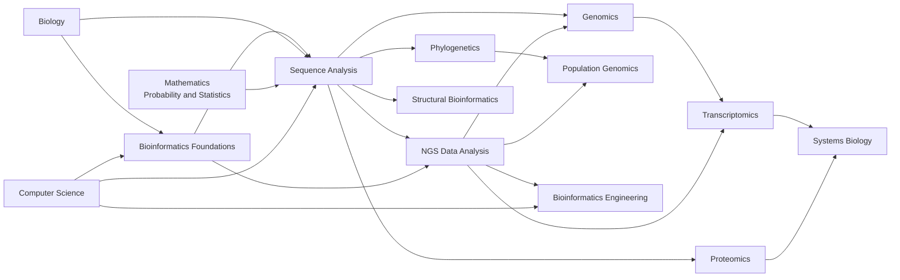

---
aliases:
  - Computational Biology
  - Bioinformatique
tags:
  - type/moc
  - domain/bioinformatics
  - domain/biology
  - domain/statistics
  - domain/computer-science
  - level/L1
  - level/L2
  - level/L3
  - level/M1
prerequisites:
  - "[[Biology]]"
  - "[[Probability and Statistics]]"
  - "[[Computer Science]]"
  - "[[Mathematics]]"
projects:
  - "[[Bioinformatics Lab]]"
  - "[[01-dna-engine]]"
  - "[[02-sequence-translation]]"
  - "[[03-genome-diff]]"
  - "[[04-alignment-engine]]"
  - "[[05-sequence-search]]"
  - "[[06-mutation-lab]]"
  - "[[07-evolution-simulator]]"
  - "[[08-phylogenetic-engine]]"
  - "[[09-genome-browser]]"
  - "[[10-genomic-pipeline]]"
sources:
  - "[[UC San Diego - BS Bioinformatics]]"
  - "[[Shanghai Jiao Tong University - BS Bioinformatics]]"
  - "[[Carnegie Mellon University - BS Computational Biology]]"
  - "[[Université Paris Cité - Licence Sciences de la Vie]]"
  - "[[Université Paris-Saclay - Licence Double Diplôme Informatique Sciences de la Vie]]"
  - "[[MIT - Course 6-7 Computer Science and Molecular Biology]]"
  - "[[ISCB - Bioinformatics Core Competencies]]"
  - "[[Bioinformatics Algorithms (Compeau)]]"
  - "[[Biological Sequence Analysis (Durbin)]]"
  - "[[Inferring Phylogenies (Felsenstein)]]"
  - "[[Modern Statistics for Modern Biology (Holmes)]]"
  - "[[Galaxy Training Network - Training Material]]"
  - "[[MIT 6.047 - Computational Biology]]"
  - "[[Coursera UCSD - Bioinformatics Specialization]]"
  - "[[Peking University - Bioinformatics Introduction and Methods]]"
  - "[[Inria - Bioinformatics Genomes and Algorithms]]"
  - "[[EMBL-EBI - Introductory Bioinformatics]]"
---

# Bioinformatics

> [!abstract]
> The convergence domain of the vault: biology, statistics and computer science applied together to biological data, from sequences and genomes to expression, proteins, structures, populations and networks, and the engineering that makes analyses reproducible.

## Why it matters for bioinformatics

This is the destination of the curriculum. Every other domain is studied to the depth this one needs: [[Biology]] supplies the questions, [[Probability and Statistics]] the models of noisy data, [[Computer Science]] the algorithms and systems that scale them. Real programs place the substantial bioinformatics courses (sequence analysis, databases, genomics) in the final stage, after algorithms and the molecular core, with at most a survey or project earlier.[^ucsd][^sjtu][^cmu]

## Target level and weight

- **Target**: L3 for the core (Stages 1 to 3), M1 for the Stage 4 subdomains and the frontier items of every syllabus.
- **Weight**: one of the domains taken to L3/M1, with [[Biology]], [[Probability and Statistics]] and algorithms (see [[Curriculum]], design principle 1). It holds 283 planned concept notes in 11 subdomains; Sequence Analysis (35) and Genomics (33) are the heaviest.
- **Start**: a light introduction in Stage 1 ([[Bioinformatics Foundations]]), as in programs that hook students in the first year,[^psisv][^cmu] then the core from Stage 2 onward.

## Subdomains

| Subdomain | Stage | Level | Scope | Validated by |
|---|---|---|---|---|
| [[Bioinformatics Foundations]] | 1 | L1-L2 | Databases, identifiers, coordinates, file formats, ontologies | [[01-dna-engine]], [[09-genome-browser]] |
| [[Sequence Analysis]] | 2 | L1-M1 | Composition, motifs, homology, pairwise and multiple alignment, BLAST, profile HMMs, gene finding | [[01-dna-engine]], [[04-alignment-engine]], [[05-sequence-search]] |
| [[NGS Data Analysis]] | 3 | L2-M1 | Reads, QC, mapping, coverage, germline and somatic variant calling | [[10-genomic-pipeline]] |
| [[Genomics]] | 3 | L2-M1 | Assembly, annotation, variant interpretation, comparative genomics, epigenomics, metagenomics | [[03-genome-diff]], [[06-mutation-lab]], [[09-genome-browser]] |
| [[Phylogenetics]] | 3 | L2-M1 | Substitution models, distance, parsimony, likelihood, Bayesian inference, bootstrap, clocks | [[08-phylogenetic-engine]] |
| [[Population Genomics]] | 3 | L2-M1 | Diversity, coalescent, LD, population structure, GWAS, selection scans | [[07-evolution-simulator]] |
| [[Transcriptomics]] | 4 | L2-M1 | Bulk RNA-seq (normalization, negative binomial differential expression), single-cell basics | none yet |
| [[Proteomics]] | 4 | L2-M1 | Mass spectra, peptide identification with FDR control, protein inference, quantification | none yet |
| [[Structural Bioinformatics]] | 4 | L2-M1 | Structure comparison and classification, RNA folding, structure prediction up to AlphaFold | none yet |
| [[Systems Biology]] | 4 | L2-M1 | Networks, enrichment analysis, dynamic models, flux balance analysis | none yet |
| [[Bioinformatics Engineering]] | 4 | L2-M1 | Workflow managers, containers, testing, provenance, FAIR workflows, tool benchmarking | [[10-genomic-pipeline]], [[05-sequence-search]] |

> [!warning]
> Four Stage 4 subdomains have no Lab project yet (Transcriptomics, Proteomics, Structural Bioinformatics, Systems Biology). Each subdomain MOC names a candidate project; adding one is a decision for [[Bioinformatics Lab]], not for this syllabus.

## Dependencies between subdomains

## Prerequisites and validation by subdomain

Each row reads: biology, mathematics and statistics, and computer science prerequisites (left) feed the subdomain, which a Lab project validates (right).

```mermaid
flowchart LR
    classDef bio stroke:#4c9a5f,stroke-width:2px
    classDef quant stroke:#4a78b5,stroke-width:2px
    classDef comp stroke:#b5754a,stroke-width:2px
    classDef lab stroke:#8a6bb5,stroke-width:2px,stroke-dasharray:4

    subgraph ST12["Stages 1 and 2"]
        direction LR
        F_B["Molecular Biology<br/>Genetics"]:::bio --> F["Bioinformatics Foundations"]
        F_C["Programming<br/>Data Structures<br/>Databases<br/>Computer Systems"]:::comp --> F
        F --> F_L["01-dna-engine<br/>09-genome-browser"]:::lab

        SA_B["Molecular Biology<br/>Genetics<br/>Evolution"]:::bio --> SA["Sequence Analysis"]
        SA_M["Probability<br/>Stochastic Processes"]:::quant --> SA
        SA_C["Algorithms<br/>String Algorithms<br/>Data Structures"]:::comp --> SA
        SA --> SA_L["04-alignment-engine<br/>05-sequence-search"]:::lab
    end

    subgraph ST3["Stage 3"]
        direction LR
        NGS_B["Biotechnology<br/>Genetics"]:::bio --> NGS["NGS Data Analysis"]
        NGS_M["Probability<br/>Statistical Inference"]:::quant --> NGS
        NGS_C["String Algorithms<br/>Computer Systems"]:::comp --> NGS
        NGS --> NGS_L["10-genomic-pipeline"]:::lab

        GEN_B["Genetics<br/>Molecular Biology<br/>Microbiology"]:::bio --> GEN["Genomics"]
        GEN_M["Discrete Mathematics<br/>Statistical Inference"]:::quant --> GEN
        GEN_C["Algorithms<br/>Data Structures"]:::comp --> GEN
        GEN --> GEN_L["03-genome-diff<br/>09-genome-browser"]:::lab

        PHY_B["Evolution"]:::bio --> PHY["Phylogenetics"]
        PHY_M["Stochastic Processes<br/>Statistical Inference<br/>Bayesian Statistics"]:::quant --> PHY
        PHY_C["Algorithms<br/>Data Structures"]:::comp --> PHY
        PHY --> PHY_L["08-phylogenetic-engine"]:::lab

        POP_B["Evolution<br/>Genetics"]:::bio --> POP["Population Genomics"]
        POP_M["Stochastic Processes<br/>Linear Models<br/>Multivariate Analysis"]:::quant --> POP
        POP_C["Scientific Computing"]:::comp --> POP
        POP --> POP_L["07-evolution-simulator"]:::lab
    end

    subgraph ST4["Stage 4"]
        direction LR
        TX_B["Molecular Biology"]:::bio --> TX["Transcriptomics"]
        TX_M["Statistical Inference<br/>Linear Models<br/>Multivariate Analysis<br/>Bayesian Statistics"]:::quant --> TX
        TX_C["Scientific Computing"]:::comp --> TX
        TX --> TX_L["no Lab project yet"]:::lab

        PROT_B["Biochemistry<br/>Biotechnology"]:::bio --> PROT["Proteomics"]
        PROT_M["Statistical Inference"]:::quant --> PROT
        PROT_C["Algorithms"]:::comp --> PROT
        PROT --> PROT_L["no Lab project yet"]:::lab

        STR_B["Biochemistry<br/>Biophysics"]:::bio --> STR["Structural Bioinformatics"]
        STR_M["Linear Algebra<br/>Optimization<br/>Statistical Learning"]:::quant --> STR
        STR_C["Algorithms<br/>Scientific Computing"]:::comp --> STR
        STR --> STR_L["no Lab project yet"]:::lab

        SYS_B["Biochemistry<br/>Molecular Biology<br/>Cell Biology"]:::bio --> SYS["Systems Biology"]
        SYS_M["Differential Equations<br/>Optimization<br/>Mathematical Modeling"]:::quant --> SYS
        SYS_C["Scientific Computing"]:::comp --> SYS
        SYS --> SYS_L["no Lab project yet"]:::lab

        ENG_M["Statistical Learning<br/>(evaluation metrics)"]:::quant --> ENG["Bioinformatics Engineering"]
        ENG_C["Computer Systems<br/>Software Engineering"]:::comp --> ENG
        ENG --> ENG_L["10-genomic-pipeline<br/>05-sequence-search"]:::lab
    end
```

Legend: green border, biology; blue, mathematics and statistics; orange, computer science; dashed purple, Lab project.

## Cross-domain prerequisites

| Subdomain | Biology | Mathematics and statistics | Computer science |
|---|---|---|---|
| [[Bioinformatics Foundations]] | [[Molecular Biology]], [[Genetics]] | none | [[Programming]], [[Data Structures]], [[Databases]], [[Computer Systems]] |
| [[Sequence Analysis]] | [[Molecular Biology]], [[Genetics]], [[Evolution]], [[Biochemistry]] | [[Probability]], [[Stochastic Processes]] | [[Algorithms]], [[String Algorithms]], [[Data Structures]] |
| [[NGS Data Analysis]] | [[Biotechnology]], [[Genetics]] | [[Probability]], [[Statistical Inference]] | [[String Algorithms]], [[Computer Systems]] |
| [[Genomics]] | [[Genetics]], [[Molecular Biology]], [[Microbiology]] | [[Discrete Mathematics]], [[Statistical Inference]], [[Stochastic Processes]] | [[Algorithms]], [[Data Structures]] |
| [[Phylogenetics]] | [[Evolution]] | [[Stochastic Processes]], [[Statistical Inference]], [[Bayesian Statistics]], [[Discrete Mathematics]], [[Linear Algebra]] | [[Algorithms]], [[Data Structures]] |
| [[Population Genomics]] | [[Evolution]], [[Genetics]] | [[Stochastic Processes]], [[Linear Models]], [[Multivariate Analysis]] | [[Scientific Computing]] |
| [[Transcriptomics]] | [[Molecular Biology]] | [[Statistical Inference]], [[Linear Models]], [[Multivariate Analysis]], [[Bayesian Statistics]] | [[Scientific Computing]] |
| [[Proteomics]] | [[Biochemistry]], [[Biotechnology]] | [[Statistical Inference]] | [[Algorithms]] |
| [[Structural Bioinformatics]] | [[Biochemistry]], [[Biophysics]], [[Physical Chemistry]] | [[Linear Algebra]], [[Optimization]], [[Statistical Learning]] | [[Algorithms]], [[Scientific Computing]] |
| [[Systems Biology]] | [[Biochemistry]], [[Molecular Biology]], [[Cell Biology]] | [[Differential Equations]], [[Optimization]], [[Mathematical Modeling]], [[Discrete Mathematics]] | [[Scientific Computing]] |
| [[Bioinformatics Engineering]] | none | [[Statistical Learning]] (evaluation metrics) | [[Computer Systems]], [[Software Engineering]] |

[[Scientific Practice]] runs alongside the whole domain: [[Experimental Design]] for every omics subdomain, [[Reproducibility]] and [[Research Data Management]] for [[Bioinformatics Engineering]].

## Reference courses

| Course | Institution | Level | Covers |
|---|---|---|---|
| [[Coursera UCSD - Bioinformatics Specialization]] | UC San Diego | L2-L3 | Six courses from hidden messages in DNA to genome sequencing, comparison, molecular evolution, clustering and mutations: the course companion of the reference textbook[^coursera] |
| [[MIT 6.047 - Computational Biology]] | MIT | L3-M1 | Genomes, networks and evolution: alignment, HMMs, gene finding, expression, motifs, epigenomics, phylogenomics, coalescent, disease mapping[^mit6047] |
| [[Peking University - Bioinformatics Introduction and Methods]] | Peking University | L2-L3 | Alignment, database search, Markov models, NGS mapping and variant calling, variant function prediction[^pku] |
| [[Inria - Bioinformatics Genomes and Algorithms]] | Inria (France) | L1-L2 | French MOOC: pattern searching, gene prediction, sequence comparison, phylogenetic trees[^inria] |
| [[Galaxy Training Network - Training Material]] | Galaxy Project | L1-M1 | Hands-on tutorials for every omics subdomain and for FAIR workflows[^gtn] |
| [[EMBL-EBI - Introductory Bioinformatics]] | EMBL-EBI | L1 | Primary and secondary databases, Ensembl, UniProt, expression and structure resources[^ebi] |

## Reference books

- [[Bioinformatics Algorithms (Compeau)]]: the algorithmic spine of Sequence Analysis, Genomics, NGS and Phylogenetics.[^compeau]
- [[Biological Sequence Analysis (Durbin)]]: probabilistic models (HMMs, profile HMMs, probabilistic phylogeny, RNA structure).[^durbin]
- [[Inferring Phylogenies (Felsenstein)]]: the reference for Phylogenetics.[^felsenstein]
- [[Modern Statistics for Modern Biology (Holmes)]]: the statistics of high-throughput data for Transcriptomics and beyond.

## Lab projects

The ten numbered projects of the [[Bioinformatics Lab]] validate Stages 1 to 3: [[01-dna-engine]] and [[02-sequence-translation]] (Stage 1), [[03-genome-diff]] to [[06-mutation-lab]] (Stage 2), [[07-evolution-simulator]] to [[10-genomic-pipeline]] (Stage 3). The shared libraries [[bio-core]], [[bio-algorithms]], [[bio-simulation]] and [[bio-visualization]] hold the reusable implementations.

## References

The subdomain list is the union of the named bioinformatics courses of dedicated majors: sequence analysis, databases and genomic technologies at UCSD;[^ucsd] structural bioinformatics, functional genomics, big data and systems biology at SJTU;[^sjtu] computational genomics and biological modeling at CMU.[^cmu] The final-stage placement matches the French pattern of an L3 biology-informatics parcours[^upc] and MIT's placement of computational biology after algorithms and the biology foundation.[^mit67] Introductory courses in the United States, China and France converge on the same core (alignment, database search, Markov models, NGS, phylogeny).[^coursera][^pku][^inria] The ISCB competency framework is the outcome check for the whole domain.[^iscb]

[^ucsd]: [[UC San Diego - BS Bioinformatics]]: BIMM 181 Molecular Sequence Analysis, BIMM 182 Biological Databases, BENG 183 Applied Genomic Technologies, CSE 185 Advanced Bioinformatics Laboratory.
[^sjtu]: [[Shanghai Jiao Tong University - BS Bioinformatics]]: bioinformatics core from semester 4.
[^cmu]: [[Carnegie Mellon University - BS Computational Biology]]: 02-510 Computational Genomics and 02-512 Computational Methods for Biological Modeling and Simulation; first-year Great Ideas in Computational Biology.
[^psisv]: [[Université Paris-Saclay - Licence Double Diplôme Informatique Sciences de la Vie]]: "Introduction to bioinformatics" in L1.
[^upc]: [[Université Paris Cité - Licence Sciences de la Vie]]: L3 parcours Biologie-Informatique.
[^mit67]: [[MIT - Course 6-7 Computer Science and Molecular Biology]]: computational biology as a restricted elective after the CS and biology foundations.
[^iscb]: [[ISCB - Bioinformatics Core Competencies]].
[^gtn]: [[Galaxy Training Network - Training Material]], topics "Sequence Analysis", "Variant Analysis", "Assembly", "Genome Annotation", "Epigenetics", "Microbiome", "Transcriptomics", "Single Cell", "Proteomics", "Evolution" and "FAIR Data, Workflows, and Research".
[^compeau]: [[Bioinformatics Algorithms (Compeau)]].
[^coursera]: [[Coursera UCSD - Bioinformatics Specialization]], courses I to VI and capstone.
[^mit6047]: [[MIT 6.047 - Computational Biology]], "Genomes", "Networks" and "Evolution" parts.
[^pku]: [[Peking University - Bioinformatics Introduction and Methods]].
[^inria]: [[Inria - Bioinformatics Genomes and Algorithms]].
[^ebi]: [[EMBL-EBI - Introductory Bioinformatics]].
[^durbin]: [[Biological Sequence Analysis (Durbin)]].
[^felsenstein]: [[Inferring Phylogenies (Felsenstein)]].
