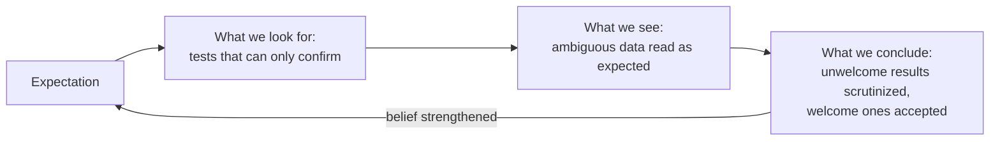

---
aliases:
  - Confirmatory Bias
  - Myside Bias
  - Biais de confirmation
tags:
  - type/concept
  - domain/scientific-practice
  - domain/statistics
  - level/L1
  - level/L2
  - level/L3
mastery: 0
prerequisites:
  - "[[Hypothesis]]"
  - "[[Falsifiability]]"
related:
  - "[[Empirical Evidence]]"
  - "[[Measurement Error]]"
  - "[[Blinding]]"
  - "[[Preregistration]]"
  - "[[P-Hacking]]"
  - "[[Analytical Flexibility]]"
projects:
  - "[[05-sequence-search]]"
sources:
  - "[[Nickerson 1998 - Confirmation Bias - A Ubiquitous Phenomenon in Many Guises]]"
  - "[[The Logic of Scientific Discovery (Popper)]]"
  - "[[Platt 1964 - Strong Inference]]"
  - "[[Introductory Statistics (OpenStax)]]"
  - "[[Experimental Design for Laboratory Biologists (Lazic)]]"
  - "[[Ioannidis 2005 - Why Most Published Research Findings Are False]]"
  - "[[Gelman 2014 - The Statistical Crisis in Science]]"
  - "[[Reproducibility and Replicability in Science (National Academies)]]"
---

# Confirmation Bias

> [!abstract]
> We tend to look for, see and interpret evidence in ways that favour what we already expect; science protects itself with procedures that take the expectation out of the loop (blinding, preregistration, controls), not with good intentions.

## Definition

**Confirmation bias** is the seeking or interpreting of evidence in ways that are partial to existing beliefs, expectations or a hypothesis in hand.[^nickerson] The form that matters in research is **unwitting**: it affects people who sincerely believe they are weighing the evidence impartially, unlike an advocate who builds a one-sided case on purpose.[^nickerson] It is a bias in the statistical sense too: a systematic, not random, distortion of what is recorded and concluded ([[Measurement Error]]).

## Why it matters

- **Analyses are full of choices**: filters, normalization, outlier removal, covariates, thresholds. An analyst who knows the hoped-for answer can steer them without noticing. The more flexibility in designs, definitions, outcomes and analytical modes, the less likely a claimed finding is true.[^ioannidis]
- **Asymmetric debugging.** A surprising result sends us hunting for bugs; an expected one does not. Bugs that favour the hypothesis survive. Running the same pipeline on simulated data with a known answer checks both directions ([[In Silico Experiment]]).
- **Omics invites stories.** Any list of a few hundred genes contains something that fits a narrative; without [[Multiple Testing Correction]] and independent confirmation, the story is the expectation, not the data ([[Data-Driven Research]]).

## Core (L1)

### Three entry points



### The 2-4-6 task

In Wason's rule-discovery task, people learn that the triple 2-4-6 fits a rule and propose triples to discover it. Most form a hypothesis such as "even numbers rising by 2" and test triples that fit it (8-10-12, 20-22-24), all of which get a "yes"; few propose a triple their hypothesis forbids. The rule was any ascending sequence, so confirming tests could never reveal that the hypothesis was too narrow.[^nickerson] A test informs only if it could fail ([[Falsifiability]]):[^popper] 1-2-3, forbidden by the hypothesis, would have refuted it at once. Platt's remedy is to hold several hypotheses and choose the test on which they disagree ([[Strong Inference]]).[^platt]

### Countermeasures

| Countermeasure | Guards against | How |
|---|---|---|
| [[Blinding]] | expectations shaping measurement, scoring or response | subjects, experimenters or evaluators do not know who received which treatment[^stat1][^lazic] |
| [[Randomization]] | choosing "suitable" units for the treatment | chance, not the experimenter, assigns treatments[^stat1][^lazic] |
| Controls | seeing an effect where there is none | positive and negative controls run alongside ([[Controlled Experiment]]) |
| [[Preregistration]] | choosing the analysis after seeing the data | hypotheses, primary outcome and analysis plan fixed and dated in advance[^nasem] |
| Independent replication | one team's idiosyncrasies | other people, other data, same question[^nasem] |

## Deeper (L2)

**P-hacking and the garden of forking paths.** Each analysis choice that could have been made otherwise is a **fork**. Trying paths until $p < 0.05$ is [[P-Hacking]]. Gelman and Loken added the subtler case: a researcher who states the hypothesis in advance and runs a single analysis is still on a forking path if the details of that analysis would have differed with different data; the reported p-value is then, in effect, the best of many potential comparisons.[^gelman] With $k$ independent tests of true null hypotheses at level $\alpha$, the chance of at least one false positive is $1 - (1 - \alpha)^k$: 0.23 for $k = 5$, 0.64 for $k = 20$. Forks on the same data are correlated, so the inflation is somewhat smaller, but still large (Computational representation). [[Multiple Testing Correction]] works when the family of tests is explicit; forking paths form a hidden family that no correction can count ([[Analytical Flexibility]]).

**Blinding the analysis.** The logic of blinding extends to computation. Decide quality filters, outlier removal, normalization and clustering parameters with condition labels hidden (recoded as A/B, or shuffled), freeze the pipeline under version control, and only then reveal the labels. A test set used once at the end plays the same role for predictive models ([[Overfitting]], [[Data Leakage]]); rerunning the whole analysis with permuted labels is a negative control ([[Permutation Test]]).

## Advanced (L3)

- **Community scale.** Selective publication and hypotheses rewritten after the results act as confirmation bias at the level of a literature ([[Publication Bias]], [[Questionable Research Practice]]); the National Academies count such practices among the sources of non-replicability.[^nasem]
- **Exploratory is not wrong, mislabelled is.** Data-driven omics generates hypotheses; the error is reporting them as confirmed. Split discovery and validation (another cohort, a held-out half, a [[Preregistration|preregistered]] follow-up).[^gelman]

## Mathematical representation

Ioannidis models bias as the proportion $u$ of analyses that would not have produced a finding but are reported as one.[^ioannidis] Let $R$ be the pre-study odds that a tested relationship is true, $1 - \beta$ the power and $\alpha$ the significance level. A true relationship yields a reported finding with probability $(1 - \beta) + u\beta$, a null one with probability $\alpha + u(1 - \alpha)$, so
$$\mathrm{PPV} = \frac{(1 - \beta)R + u\beta R}{R + \alpha - \beta R + u - u\alpha + u\beta R}.$$
With $u = 0$ this reduces to the unbiased form used in [[Hypothesis]]; even a modest $u$ lowers the PPV sharply (Exercise 2).

## Computational representation

A null experiment (no true difference), analysed four defensible ways: all data, "outliers" beyond 2 SD removed, and two subgroups (say, each sex). The analyst reports whichever path gives the smallest p-value.

```python
import random
import statistics as st
from statistics import NormalDist

PHI = NormalDist().cdf

def p_value(a: list[float], b: list[float]) -> float:
    """Two-sided p-value for a difference in means (Welch statistic, normal approximation)."""
    se = (st.variance(a) / len(a) + st.variance(b) / len(b)) ** 0.5
    return 2 * (1 - PHI(abs(st.fmean(a) - st.fmean(b)) / se))

def trim(x: list[float], k: float = 2.0) -> list[float]:
    """Drop 'outliers' more than k standard deviations from the group mean."""
    m, s = st.fmean(x), st.stdev(x)
    return [v for v in x if abs(v - m) <= k * s]

rng = random.Random(42)
trials, planned, best = 20_000, 0, 0
for _ in range(trials):  # the null is true: both groups come from N(0, 1)
    a, b = ([rng.gauss(0, 1) for _ in range(40)] for _ in range(2))
    p = [p_value(a, b), p_value(trim(a), trim(b)),            # all data, outliers trimmed,
         p_value(a[:20], b[:20]), p_value(a[20:], b[20:])]    # two subgroups (e.g. sexes)
    planned += p[0] < 0.05
    best += min(p) < 0.05
print(f"pre-specified analysis : {planned / trials:.3f}")
print(f"best of four forks     : {best / trials:.3f}")
print(f"four independent tests : {1 - 0.95 ** 4:.3f}")
```

```text
pre-specified analysis : 0.055
best of four forks     : 0.180
four independent tests : 0.185
```

The pre-specified path keeps its nominal rate (0.055 rather than 0.050 because of the normal approximation with 40 per group). Choosing among four paths after the fact more than triples the false-positive rate, although each path alone is defensible. The result sits just below the value for four independent tests because the full and trimmed analyses share most observations: correlation softens the inflation without removing it.

## Worked example

> [!example] A blinded analysis plan for an RNA-seq comparison (invented study)
> Hypothesis: gene X is higher in tumour than in matched normal tissue, 12 pairs.
> 1. **Before data**: write and date the plan: primary outcome (log fold change of X), test (paired), covariates, the multiple-testing rule for secondary genes, and the outlier rule (e.g. a library with fewer than 5 million reads is dropped).
> 2. **Blind QC**: a colleague recodes samples as S01 to S24 and keeps the key. Library sizes, PCA and outlier calls are made on codes only.
> 3. **Freeze**: commit the pipeline and its parameters ([[Version Control]]).
> 4. **Unblind and run once.** Report the primary result whatever it is, label every additional analysis as exploratory, and rerun with the tumour/normal labels shuffled within pairs as a negative control: X should not stand out.

## Common misconceptions

> [!warning] "Only careless or dishonest scientists are affected"
> The bias is mostly unwitting and appears in people trying to be fair.[^nickerson] That is why the remedies are procedures, not resolutions.

> [!warning] "Stating my hypothesis in advance is enough"
> If the analysis details are still chosen after seeing the data, the forking paths remain.[^gelman] Fix the analysis plan, not just the hypothesis.

> [!warning] "Blinding is for clinical trials"
> Any step where a person judges data (scoring images, flagging outliers, picking clusters, tuning parameters) can be blinded, usually at little cost.

## Exercises

> [!question] Exercise 1 (L1)
> A student believes motif M makes genes heat-inducible. She takes the 40 genes most induced by heat and finds M in 30 of them. What is missing before this supports her hypothesis?

> [!success]- Solution
> She looked only at confirming cases. She needs the frequency of M among non-induced genes and the fraction of M-carrying genes that are induced: a 2x2 table of motif by induction ([[Contingency Table]]). If 75 % of all genes carry M, 30 of 40 is exactly what chance predicts. This is the 2-4-6 error: test where the hypothesis could fail.

> [!question] Exercise 2 (L2, Python)
> Using the PPV formula, compute the PPV for pre-study odds $R = 0.1$ and $R = 1$, power 0.8, $\alpha = 0.05$, and bias $u = 0, 0.1, 0.3$. Interpret.

> [!success]- Solution
> ```python
> def ppv(R, power, alpha=0.05, u=0.0):
>     beta = 1 - power
>     return ((1 - beta) * R + u * beta * R) / (R + alpha - beta * R + u - u * alpha + u * beta * R)
>
> print([(u, round(ppv(0.1, 0.8, u=u), 3), round(ppv(1.0, 0.8, u=u), 3)) for u in (0.0, 0.1, 0.3)])
> # [(0.0, 0.615, 0.941), (0.1, 0.361, 0.85), (0.3, 0.204, 0.72)]
> ```
> For a long-shot hypothesis ($R = 0.1$), a bias of 0.1 drops the PPV from 0.62 to 0.36: most "findings" are then false. Bias hurts most where prior odds are low, as in genome-wide exploratory searches.[^ioannidis]

> [!question] Exercise 3 (L3)
> For a differential expression study, list what a preregistration should fix and what may stay exploratory.

> [!success]- Solution
> Fix: primary hypothesis and contrast, samples and exclusion criteria, quality thresholds, normalization and model (with covariates such as batch), the multiple-testing procedure and FDR level, and the primary output (list or specific genes). Exploratory: additional contrasts, enrichment analyses, clustering, any analysis suggested by the data, clearly labelled and ideally validated on independent data.[^nasem][^gelman]

## Mastery checklist

- [ ] 1 Recognized: I can define confirmation bias and name three countermeasures.
- [ ] 2 Understood: I can explain the 2-4-6 task, why confirming tests are weak, and how to blind a scoring or analysis step.
- [ ] 3 Practiced: I can compute family-wise error and PPV with bias, and simulate forking paths.
- [ ] 4 Applied: I wrote and followed a dated analysis plan, with blinded QC, for a benchmark in [[05-sequence-search]] or a real dataset.
- [ ] 5 Explained: I can teach why stating a hypothesis in advance does not remove forking paths, and when exploratory results are legitimate.

## References

[^nickerson]: [[Nickerson 1998 - Confirmation Bias - A Ubiquitous Phenomenon in Many Guises]], *Review of General Psychology* 2(2):175-220 (definition; unwitting selectivity; Wason's rule-discovery task).
[^popper]: [[The Logic of Scientific Discovery (Popper)]], part on demarcation (a theory is tested by the observations it forbids).
[^platt]: [[Platt 1964 - Strong Inference]], Platt JR, *Science* 146(3642):347-353.
[^stat1]: [[Introductory Statistics (OpenStax)]], 2nd ed., ch. 1 "Sampling and Data", experimental design (random assignment, placebo, blinding).
[^lazic]: [[Experimental Design for Laboratory Biologists (Lazic)]], material on randomization and blinding.
[^ioannidis]: [[Ioannidis 2005 - Why Most Published Research Findings Are False]], *PLoS Medicine* 2(8):e124 (bias $u$ in the positive predictive value; corollary on flexibility in designs, definitions, outcomes and analytical modes).
[^gelman]: [[Gelman 2014 - The Statistical Crisis in Science]], Gelman A, Loken E, *American Scientist* 102:460-465.
[^nasem]: [[Reproducibility and Replicability in Science (National Academies)]], sources of non-replicability and recommendations to researchers.
